## 数组数据结构

### 什么是接口

接口就是Interface，也可以是ADT(Abstract Data Tructure), 当定义一个接口的时候，实际上是一种规范，一种约束。

接口定义了一些方法，也就是支持哪些操作。

这里拿Java的List接口举个例子。

List<E>
- add(E element): 表示List接口支持add操作，将一个元素添加到list中，至于如何实现，不重要。
- remove(E element): 表示List接口支持remove操作，将一个元素从list中移除，至于如何实现，不重要。
- size(): 表示List接口支持size操作，返回list中有多少个元素，如何实现，不重要。

接口还可以想象成提出了一些问题，比如说，我现在有List这个接口，我提出了三个问题。
- 我要将一个元素添加到list中，如何实现？
- 我要将一个元素从list中移除，如何实现?
- 我要计算list中元素的数量，如何实现？

### 什么是数据结构

那么什么是数据结构呢？就是一种接口的具体实现方案。

它是数据实际的表示形式。它有一些方法，或者说使用一些算法，来实现上面接口提出的操作。

同样可以理解为对于上面提出的三个问题的解答。

以Java中ArrayList和LinkedList来举例。

ArrayList: 使用数组实现了List接口
- add(E element): 表示ArrayList这种数据结构，实现了List接口，支持add操作，使用了适合ArrayList这种数据结构的算法来实现add，解决了上面的第一个问题。
- remove(E element): 表示ArrayList这种数据结构，实现了List接口，支持remove操作，使用了适合ArrayList这种数据结构的算法来实现remove，解决了上面的第二个问题。
- len(): 表示ArrayList这种数据结构，实现了List接口，支持len操作，使用了适合ArrayList这种数据结构的算法来实现len，解决了上面的第三个问题。

LinkedList：使用链表实现了List接口
- add(E element): 表示LinkedList这种数据结构，实现了List接口，支持add操作，使用了适合LinkedList这种数据结构的算法来实现add，解决了上面的第一个问题。
- remove(E element): 表示LinkedList这种数据结构，实现了List接口，支持remove操作，使用了适合LinkedList这种数据结构的算法来实现remove，解决了上面的第二个问题。
- len(): 表示LinkedList这种数据结构，实现了List接口，支持len操作，使用了适合LinkedList这种数据结构的算法来实现len，解决了上面的第三个问题。

## 静态数组实现

静态数组可以实现List的功能吗？当然可以了。那么我们看一下静态数组的实现，有哪些好处和坏处。

我们现在定义一个接口，List，下面是接口支持的操作。
- build(x): 新建一个List。
- len(): 返回数量
- get_at(i): 获取i下标的元素
- set_at(i, x): 设置i下标的元素为x
- insert_at(i, x): 插入某一个位置
- delete_at(i): 删除某一个位置的元素
- insert_first(x): 将一个元素插入到第一个位置
- insert_last(x)：将一个元素插入到最后一个位置
- delete_fist()：删除第一个位置的元素
- delete_last()：删除最后一个位置的元素

通过静态数组来实现这个接口，也就是数组长度一旦确定就不可以改变了。

先看build，可以通过for去构建一个静态数组。其时间复杂度为O(n)
```java
public void build(x) {
    int[] array = new Int[x.length];
    for(int i = 0; i < x.length; i++) {
        array[i] = x[i];
    }
    // 记录静态数组的长度
    len = array.lenght;
}
```

因为上面在构建的时候已经记录了长度，因此，可以直接返回。len的时间复杂度就是O(1)
```java 
public int len() {
    return len;
}
```

对于数组来说，我们知道它是内存中一段连续的空间，因此这个时候，我们的内存里面是这样的。假设x里面是1,2,3,4,5,6

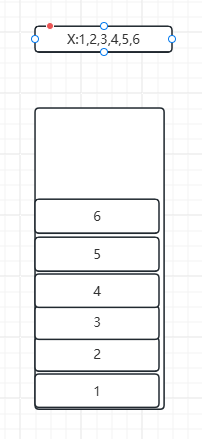

我们还知道一个int等于32位，4个字节，因此，假设元素1的地址是0，那么其余的地址如下图所示。

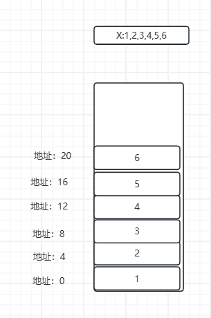

因此，`get_at(i)`这个操作的时间复杂度同样是O(1)，因为可以直接计算出对应位置的地址，计算公式如下
```
第i个元素的地址 = 首地址 + （4 * i）
i = 0的地址 = 0 + 0 = 0
i = 1的地址 = 0 + 4 = 4
```

伪代码如下
```java 
public E get_at(i) {
    // 因为java语言会自动计算i这个下标对应的地址
    return array[i];
}
```

对于`set_at(i,x)`这个操作来说，同样的O(1)复杂度。
```java
public void set_at(i,x) {
    array[i] = x;
}
```

上面的操作都很快，但是如果我们想插入或者删除一个元素，对于`静态数组`这个数据结构来说，就很慢了。因为要移动元素。我们看一下操作`delete_at(i)`的执行过程。

假设delete_at(0)：表示删除第0个元素，也就是首个元素。

第一步，删除，我们可以看到地址0指向的首个元素的内容变成`null`了

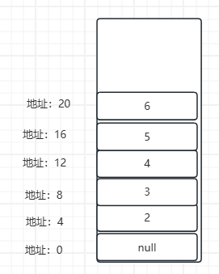

第二步，移动后面的元素到前面的位置。

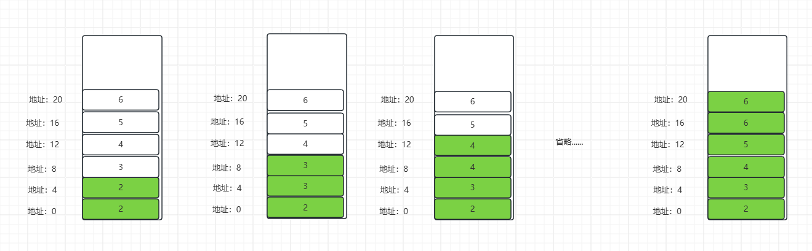

删除完成，这个时候肯定有人问了，不对啊，你这最后两个元素一样啊，是的，不用管它。

因为我们的len减少了，而获取的时候需要判断大小，如果获取的下标长度超过len了，应该返回空或错误。这个在上面的伪代码里面省略了。

> 完整的代码做为课后作业，希望大家可以自己完成，只有自己实践了，知识才是自己的，你光看我写的内容，过一会就忘了，如果你觉得实现有困难，那么我的内容可以帮助你解决困难，帮助你自己实现它。

伪代码如下
```java
public void delete_at(i) {
    //第一步 删除 这一步其实可以省略，这里是希望大家明白原理
    array[i] = null;
    //第二步，移动后面的元素过来
    for (j = i + 1; j < len; j++) {
        array[j - 1] = array[j];
    }
    len--;
}
```

对于`insert_at(i,x)`操作来说，和上面的原理几乎一样，分为两个步骤。

第一步，将i元素及后面的元素往后移动一步，把i这个位置腾出来。我们拿`insert(0,1)`来举例。

可以看到几乎是上方delete操作的一个逆序过程。

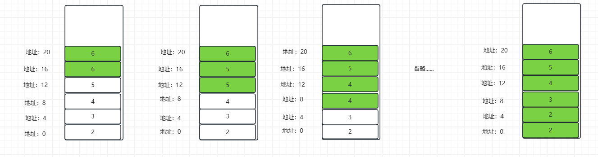

现在可以看到0的位置已经空出来了，虽然里面还有一个2，但是我们可以覆盖它。

第二步，将1插入0的位置。

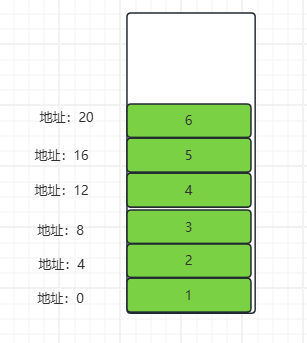

如此，就完成了整个insert操作。伪代码如下

```java
public void insert_at(i,x) {
    // 第一步 移动元素 注意从后往前移动
    for (j = len - 1; j >= i; j--) {
        array[j + 1] = array[j];
    }
    // 第二步 插入
    array[i] = x;
}
```

细心的你，一定发现了上面的代码缺少边界检查，这些都留给你的具体实现了，都是比较简单的东西。

那么，对于`delete_at(i)`和`insert_at(i,x)`来说，我们的时间复杂度相当于O(n).

而剩下的`delete_first()`和`delete_last()`，以及`insert_first(x)`和`insert_last(x)`都是上方的一个真子集，所以时间复杂度同样是O(n)。就不再重复演示了。


| 操作          | Build  | Len  | Get_at、Set_at| delete_at、insert_at |  delete_last、insert_last |  delete_first、insert_first |
|-----------    |--------|-------|--------|--------|--------|--------|
| 静态数组的复杂度| O(n)   | O(1)  | O(1)   | O(n)   | O(n)   | O(n)   |

## 链表的实现

除了直接用一个`Array`去实现以外，还可以用`链表`这个数据结构去实现List接口。也就是Java中的`LinkedList`实现。

我们首先看一下链表是如何实现build的。可以通过for去构建一个链表。其时间复杂度为O(n)
```java
public void build(x) {
    Node node = new Node(x[x.length - 1]);
    for(int i = x.length - 2; i >= 0; i--) {
        Node current = new Node(x[i]);
        current.next = node;
        node = current;
    }
    // 记录链表的长度
    len = x.lenght;
}
```

因为上面在构建的时候已经记录了长度，因此，可以直接返回。len的时间复杂度就是O(1)
```java 
public int len() {
    return len;
}
```

看一下链表这个数据结构的逻辑形式，如下图所示。一个一个指针把数据连接起来
- 优点：不用连续的空间，长度不固定
- 缺点：查询慢

val代表具体的内容，Next代表下一个节点的指针，内容是下一个节点的地址。最后一个节点的Next指针是null。
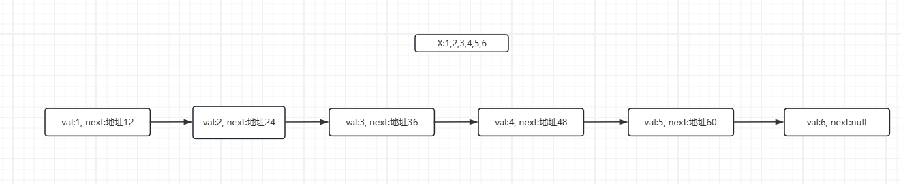

而在实际内存中的表现形式则是下图所示。这里是连续的，仅仅是巧合，也可能是不连续的。在这里我们忽略class头的占用，this指针的占用空间，val占据空间是4个字节，next做为指针是64位，占用8个字节。
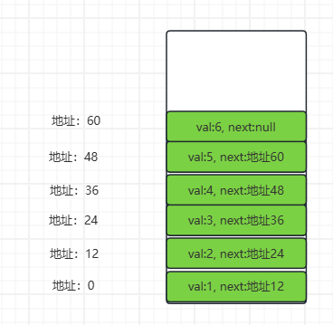

由于链表的地址不连续，所以没办法通过首地址直接计算出每个元素的地址，而需要通过`next`属性来获取下一个元素的地址。

整个`get_at(i)`的获取步骤如下
1. 获取首个元素的地址
2. 获取该元素的next属性
3. 重复第2步，直到重复了i次
4. 返回该元素内容

整个步骤如图所示。假设是`get_at(2)`，代表获取第三个元素。也就是3这个内容。因为是从0开始。

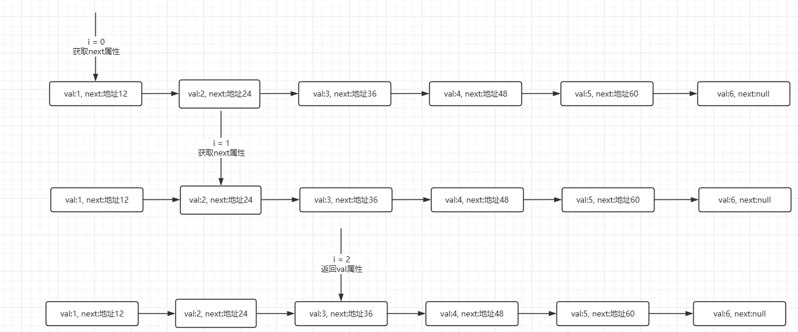

伪代码如下
```java
public E get_at(i) {
    Node node = head;
    while(node != null && i > 0) {
        node = node.next;
        i--;
    }
    if (node == null) {
        return null;
    }
    return node.val;
}
```

可以看到，因为每次都要从头找，所以时间复杂度是O(n)

再看一下`set_at(i, x)`。也基本上是同样的步骤，找到这个元素，然后更新它的val属性内容。步骤图和上面是一样的。所以时间复杂度同样是O(n)。直接看一下伪代码吧。
```java
public void set_at(i, x) {
    Node node = head;
    while(node != null && i > 0) {
        node = node.next;
        i--;
    }
    if (node != null) {
        node.val = x;
    }
}
```

可以看到几乎是一样的。

再来看一下`insert_at(i, x)`和`delete_at(i)`。首先看一下`delete_at(i)`。

比如`delete_at(2)` 分为两步，第一步查询，和上面的步骤是一样的。


第二步是删除。删除分为2步
1. 将上一个指针的next指向第i+1个元素。可以看到图里更新成36了
2. 将第i个元素的next指针更新成null

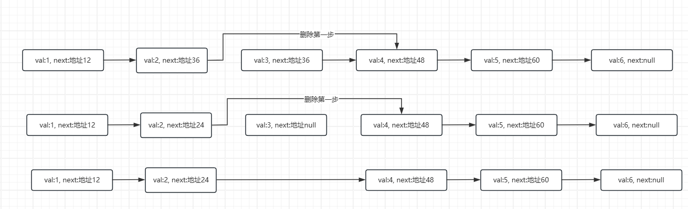

整个伪代码如下：
```java
public void delete_at(i) {
    // 第一步 找到i-1的元素
    Node node = head;
    while(node != null && i > 1) {
        node = node.next;
        i--;
    }
    // 第二步删除
    // 2.1 将i-1个元素的next指向i+1
    inode = node.next;
    node.next = node.next.next;
    // 2.2 将第i个元素的next指针更新成null
    inode.next = null;
}
```

大家在想一想，如果是`delete(x)`的话，该如何实现呢？

> 提示：仅仅修改获取元素即可，修改成x == node.val，就是找到了。可以使用双向链表实现。

再看一下`insert_at(i,x)`的执行步骤，分为两步。

第一步是查询，和上面也是一样的。


第二步是插入，插入分为两步
1. 修改插入节点的next指向当前i节点的next
2. 修改当前i-1节点的next指向插入节点

我们以`insert_at(2,3)`为例。首先找到i=0，再找到i=1的位置就是要插入的位置，因为要插入的位置是2，所以我们要把i=1的元素的next指向插入的节点。所以找到i=1的元素就可以停止了。

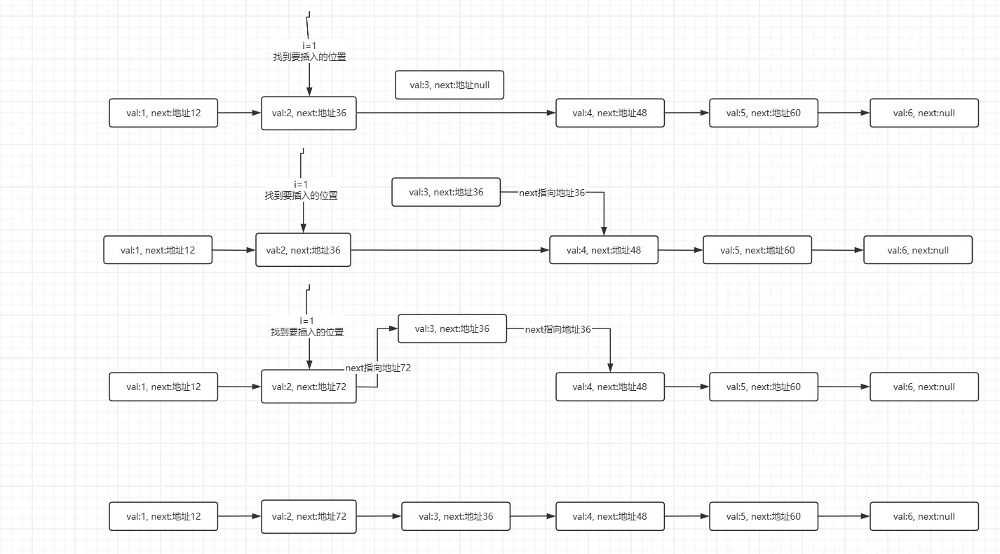

整个伪代码实现

```java
public void insert_at(i,x) {
    // 第一步 找到i-1的元素
    Node node = head;
    while(node != null && i > 1) {
        node = node.next;
        i--;
    }
    // 第二步插入
    // 2.1 修改插入节点的next指向当前i节点的next
    Node insertNode = new Node(x);
    insertNode.next = node.next;
    // 2.2 修改当前i-1节点的next指向插入节点
    node.next = insertNode;
}
```

上述两个操作对于`链表`数据结构来说，实现的时间复杂度都是O(n)。

但是链表相对于静态数组来说，其优势再于剩下的操作的实现。

比如`insert_first(x)`和`delete_first()`。对于这两个来说，不需要查找，因为删除的是第一个元素。所以省去了查找时间，插入和删除时间仅仅是O(1)。

看一下`insert_first(10)`。
- 创建插入节点insertNode
- 修改插入节点的next指向当前head节点的next:insertNode.next = head.next;
- 修改当前head节点的next指向插入节点

从伪代码也能看出来，完全就是上面伪代码的第二步插入。
```java
public void insert_first(x) {
    // 第二步插入
    // 2.1 修改插入节点的next指向当前i节点的next
    Node insertNode = new Node(x);
    insertNode.next = head.next;
    // 2.2 修改当前i-1节点的next指向插入节点
    head.next = insertNode;
}
```

对于`delete_first()`来说，是一样的，就是第二步删除。这里是从0开始，head原来是指向元素0，删除元素0，就是指向元素1.
1. 将head指针的next指向第1个元素。
2. 将第0个元素的next指针更新成null

伪代码。
```java
public void delete_first() {
    // 第二步删除
    // 2.1 将head指针的next指向第1个元素。
    inode = head;
    head = head.next;
    // 2.2 将第0个元素的next指针更新成null
    inode.next = null;
}
```

如果我们还记录了`tail`指针来指向链表的尾部，那么`delete_last()`和`insert_last(x)`也是O(1)复杂度。

如果没有的话，那么就是O(n)复杂度。这里不再赘述。

整个链表数据结构，也就是常说的`LinkedList`实现，复杂度表如下。

| 操作          | Build  | Len  | Get_at、Set_at| delete_at、insert_at |  delete_last、insert_last |  delete_first、insert_first |
|-----------    |--------|-------|--------|--------|--------|--------|
| 链表的复杂度| O(n)   | O(1)  | O(n)   | O(n)   | O(1)   | O(1)   |

## 动态数组的实现

什么是动态数组呢？
- 融合了上面两个的优点
- 既保证了查询的高效，也保证了插入和删除的高效。

如何做到的呢？这也就是JAVA中`ArrayList`做到的事情。一起来看一下吧。

对于build和len，就不再重复了，可以直接参考静态数组的实现。

这里主要看一下其余的操作。

对于`get_at(i)`来说，由于使用的是数组，所以同样的O(1)复杂度，ArrayList数据结构也是一块连续的内存空间，可以通过公式直接计算出i元素的内存位置。
```
第i个元素的地址 = 首地址 + （4 * i）
i = 0的地址 = 0 + 0 = 0
i = 1的地址 = 0 + 4 = 4
```

伪代码如下
```java 
public E get_at(i) {
    // 因为java语言会自动计算i这个下标对应的地址
    return array[i];
}
```

对于`set_at(i,x)`这个操作来说，同样的O(1)复杂度。
```java
public void set_at(i,x) {
    array[i] = x;
}
```

重点在接下来。敲黑板了！！！

对于`insert_last(x)`和`delete_at(i)`来说。我们看一下实现。

以`insert_last(1)`来说吧。由于是动态数组，是可以扩容的。假设当前内存是空.然后我们插入1.

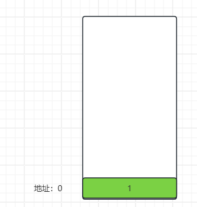

在接下来我们要插入2.也就是`insert_last(2)`。但是这个数组没有空间了，我们需要扩容，比如我们扩容一倍，也就是申请两个内存，现在的内存首地址就不是1了，可能是10-17.

然后再把原来数组的内容复制过去，在插入新的元素2.

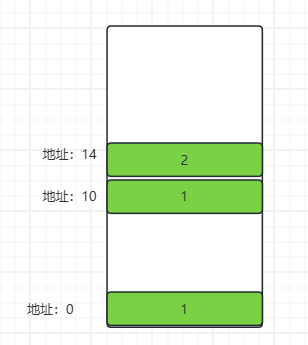

接下来又插入了元素3.再次扩容，内存地址是20-35。同样把内容复制过去，在插入元素3.

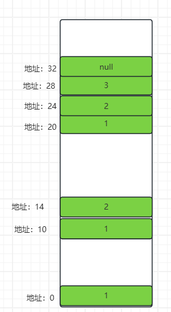

至于原来那些不用的数组的内存空间，会被JAVA的内存垃圾回收机制，给回收掉。所以不用管。

接下来计算一下它的时间复杂度吧。

因为我们是每次扩容一倍，所以分别是在1、2、4、8、...、n的时候扩容。
因此，当我们插入n个元素的时候，时间复杂度是
```
O(1+2+4+8...+n)
```

它可以看成是一个级数。i=i 到 i=n，2的i次方相加。

这个结果，基本上是O(n)的一个复杂度。

这个时候有人说了，这个复杂度不还是O(n)吗，可是我们插入了n个元素，复杂度是O(n)，平均下来，插入1个元素的复杂度就是O(1)了啊。

对于`delete_last`来说，和上面是一样的。

因此动态数组，`ArrayList`。的复杂度如下。

| 操作          | Build  | Len  | Get_at、Set_at| delete_at、insert_at |  delete_last、insert_last |  delete_first、insert_first |
|-----------    |--------|-------|--------|--------|--------|--------|
| 动态数组的复杂度| O(n)   | O(1)  | O(1)   | O(n)   | O(1)   | O(n)   |


## 总结

可以看到最常用的几个操作里面，ArrayList这个数据结构的复杂度是最低的。

因此，ArrayList几乎一直都比LinkedList好用。

整体的复杂度表格如下。

| 操作          | Build  | Len  | Get_at、Set_at| delete_at、insert_at |  delete_last、insert_last |  delete_first、insert_first |
|-----------    |--------|-------|--------|--------|--------|--------|
| 静态数组的复杂度| O(n)   | O(1)  | O(1)   | O(n)   | O(n)   | O(n)   |
| 链表的复杂度| O(n)   | O(1)  | O(n)   | O(n)   | O(1)   | O(1)   |
| 动态数组的复杂度| O(n)   | O(1)  | O(1)   | O(n)   | O(1)   | O(n)   |


get_at就是List接口中常用的get()，insert_last就是List接口中常用的add操作，而delete_at就是List接口中常用的remove操作。

来看一下LinkedList和ArrayList的对比吧。可以看到，对于LinkedList来说，get和remove都是O(n)，而ArrayList来说，只有remove是O(n)。

| 操作          | Build  | Len  | get | remove |  add |
|-----------    |--------|-------|--------|--------|--------|
| LinkedList的复杂度| O(n)   | O(1)  | O(n)   | O(n)   | O(1)   |
| ArrayList的复杂度| O(n)   | O(1)  | O(1)   | O(n)   | O(1)   |

