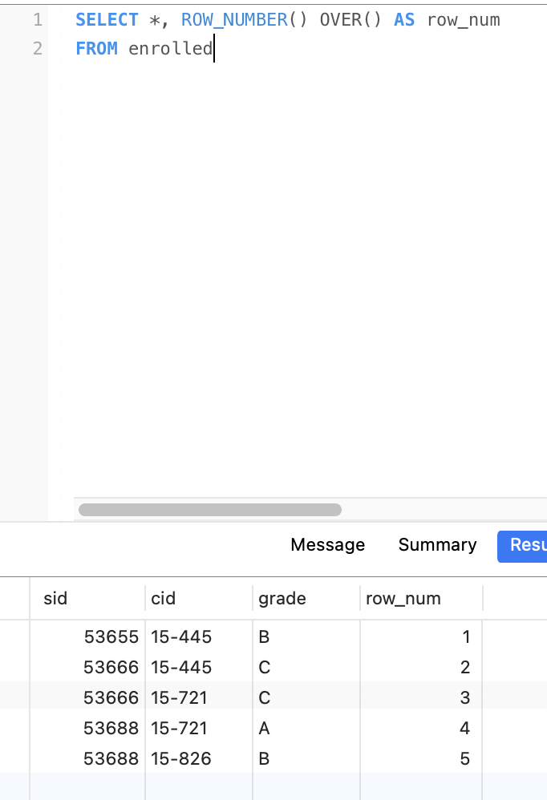
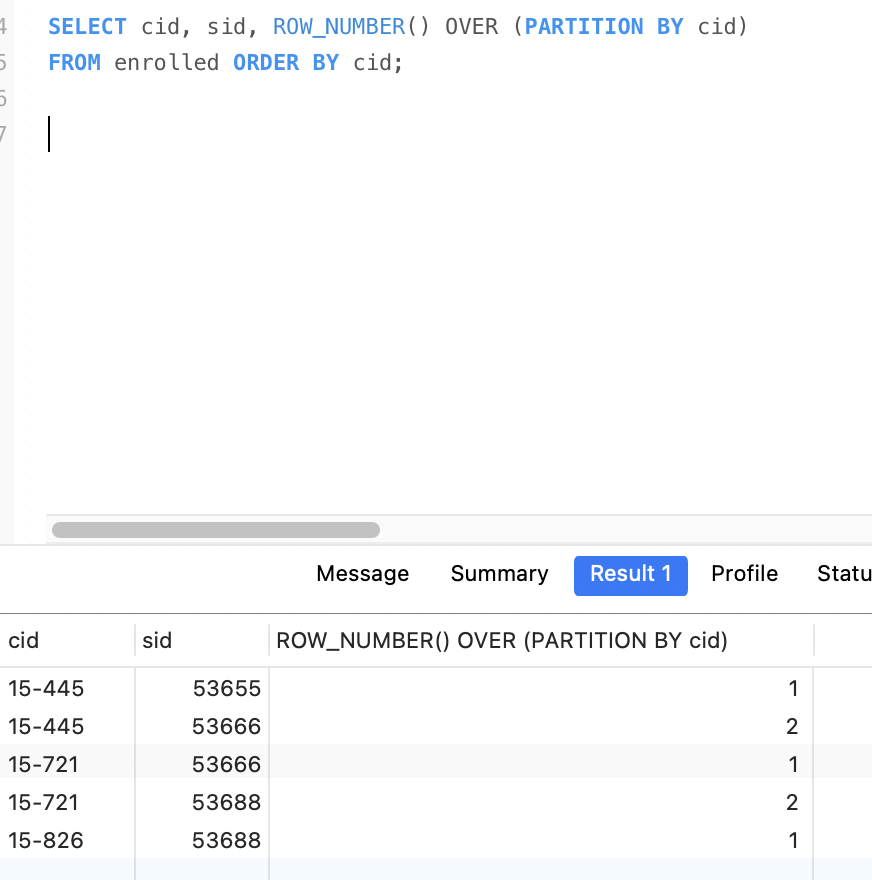
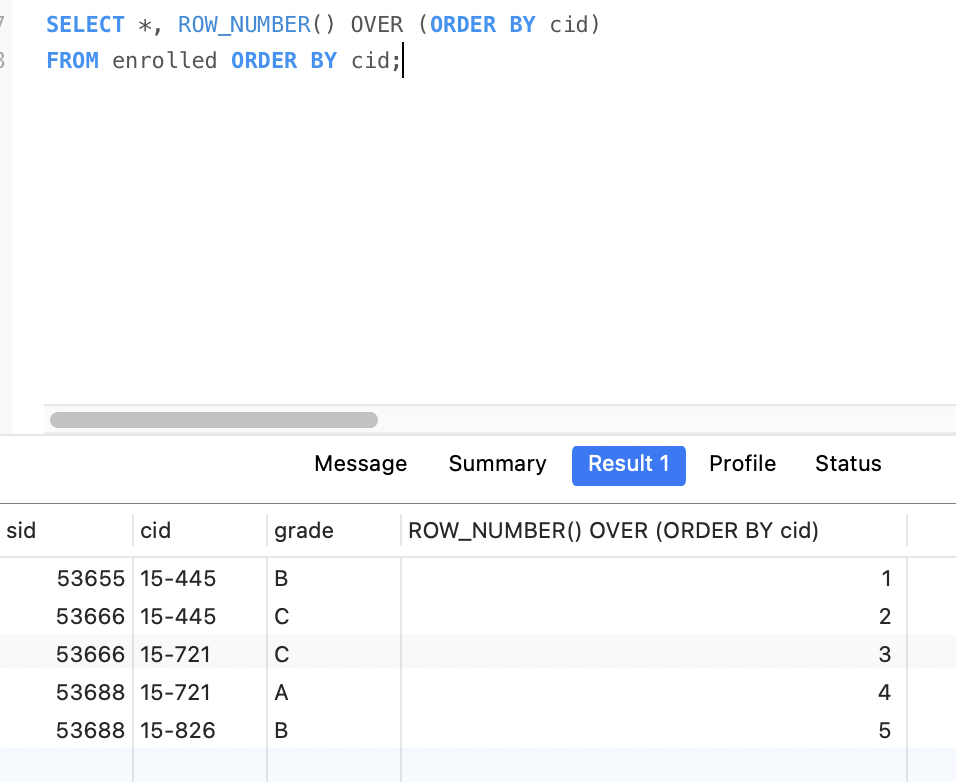
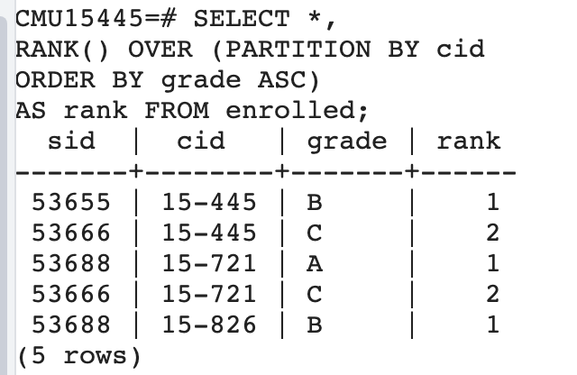
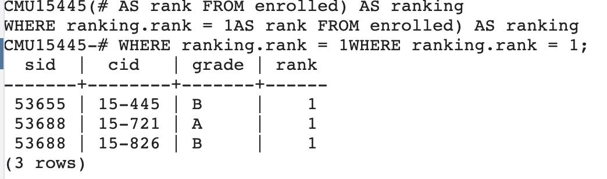
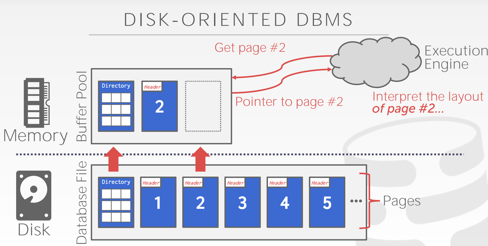
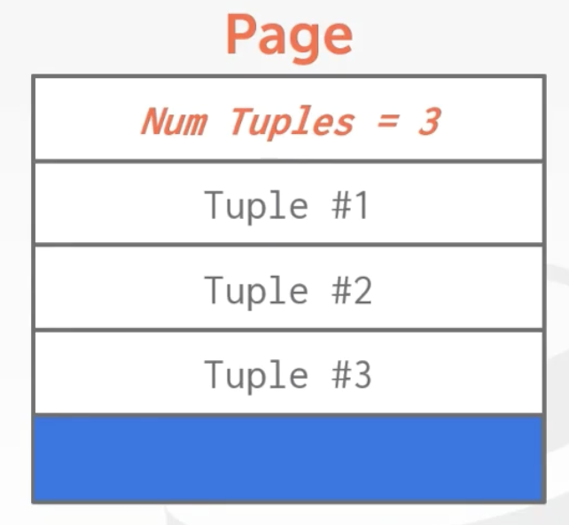
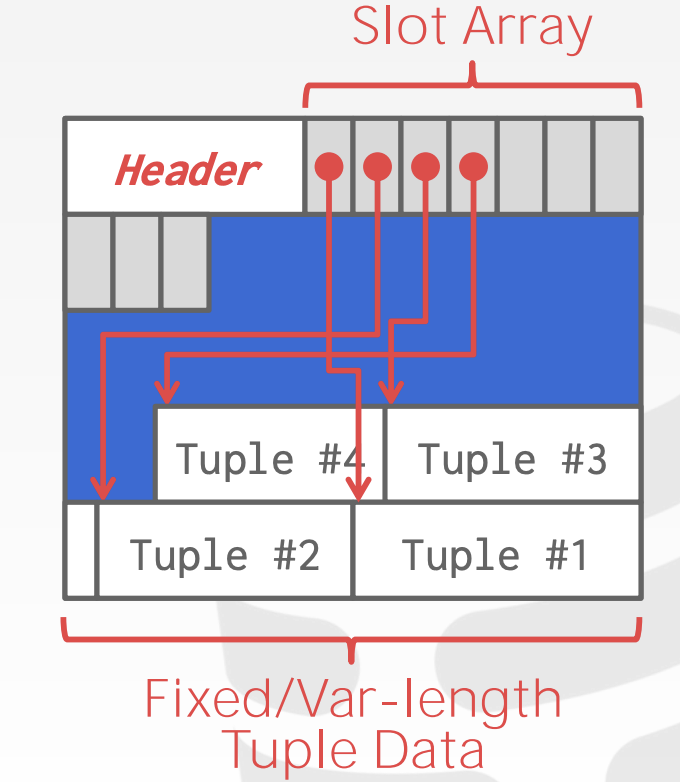
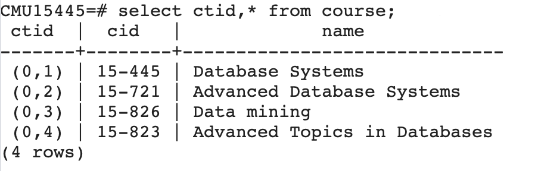

# CMU15445笔记

## 高级SQL

PostegreSQL:由伯克利大学开发，是之前开发Ingres的人开发的。

IBM的DB2支持SQL,所以SQL成为了标准。

数据库支持SQL,最低要支持SQL-92标准。

下面的sql在postgreSQL中会报错，mysql中如果`sql_mode`是`ansi`也会报错，如果`sql_mode`是`traditional`就不会报错，而是会随机选一个cid展示出来。

```SQL
select avg(s.gpa), e.cid from enrolled as e,student as s
where e.sid = s.sid;
```

### 字符串处理

|名称|大小写|引号|字符串拼接|
|:---|:----|:----|:----|
|SQL-92| 敏感的 | 单引号| \|\| |
|PostgreSQL| 敏感的 | 单引号| + |
|mysql| 不敏感的 | 单引号/双引号 | concat / 空格 |
|SQLite| 敏感的 | 单引号/双引号 | + |
｜DB2| 敏感的 | 单引号|  \|\| |
| Oracle| 敏感的 | 单引号| \|\| |


### 时间日期处理

|名称|当前日期 NOW() | 当前日期 CURRENT_TIMESTAMP() | 当前日期 CURRENT_TIMESTAMP | 日期差值 |
|:---|:----|:----|:----|:----|
|PostgreSQL| 2023-04-26 14:27:01.790522+08 | 不支持|2023-04-26 14:27:32.280334+08 | select DATE('2018-08-29') - DATE('2018-01-01'); 结果240  |
|mysql| 2023-04-26 14:28:36 | 2023-04-26 14:28:44 | 2023-04-26 14:28:56 | select DATEDIFF(DATE("2018-08-29"),DATE("2018-01-01")); 结果240 |
|SQLite| 不支持 | 不支持 | 2023-04-26 06:30:47 | select CAST((julianday('2018-08-29') - julianday('2018-01-01')) as INT) as days; 结果 240 |

### 复制表数据

create table会创建表，insert into需要表已经存在。
```SQL
create table student2 (
    select * from student
);

insert into student2(
    select * from student
);
```

### 获取id最大的一个学生数据

下面的是错误做法，因为不知道id最大的name是谁，会报错，如果sql_mode=tranditional，会执行成功，但是name是随机的。
```SQL
select MAX(e.sid),s.name from enrolled as e,student as s
where e.sid = s.sid
```

下面的在postgresql和mysql都可以执行成功，并获取到id最大的name数据。
```SQL
select sid, name from student
where sid in (select max(sid) from enrolled)
```

下面的SQL在postgresql中可以执行成功，结果和上面的一样，而在mysql8中报错`This version of MySQL doesn't yet support 'LIMIT & IN/ALL/ANY/SOME subquery'`

```SQL
select sid, name from student
where sid in (select sid from enrolled order by sid desc limit 1);
```

### 获取没有学生报名的课程

下面的sql在postgresql 和 mysql 中都可以得到正确的结果
```SQL
select * from course 
where not exists(select * from enrolled where course.cid = enrolled.cid);
```

### window窗口

`ROW_NUMBER`和`RANK`都需要和`OVER`一起使用。

- ROW_NUMBER(): 显示当前行号
- RANK() : 显示排序后的排名，如果没有排序，都是1
- OVER()
    - PARTITION BY 进行分组
    - GROUP BY 进行分组
    - ORDER BY 排序







#### 获取每个课程中分数最高的学生信息

下面的SQL，在postgresql中执行成功，mysql8执行报错。

首先查询所有课程信息，并按照课程分组，按照分数排序。

```SQL
SELECT *,
RANK() OVER (PARTITION BY cid ORDER BY grade ASC)
AS rank FROM enrolled
```



接着搜索上表中分数为1，也就是分数最高的学生。也就是每个课分数最高的学生信息。

```SQL
SELECT * FROM (
    SELECT *,
    RANK() OVER (PARTITION BY cid
    ORDER BY grade ASC)
    AS rank FROM enrolled) AS ranking
WHERE ranking.rank = 1
```




### CTE(common table expressions)

使用`CTE`实现获取每个课程中分数最高的学生信息。

通过`WITH`语句来声明一个临时表。表名`cteSource`，表的内容就是最的sid，通过`SELECT MAX(sid) FROM enrolled`查询出来的结果。字段名叫`maxId`。

然后在查询语句里面就可以连接`cteSource`表，然后通过sid = cteSource.maxId 来获取到sid最大的用户信息。

```SQL
WITH cteSource (maxId) AS (
    SELECT MAX(sid) FROM enrolled
)
SELECT name FROM student, cteSource
WHERE student.sid = cteSource.maxId
```

还有一些其他的用法，比如:

```SQL
WITH cte1 (col1) AS (
SELECT 1
),
cte2 (col2) AS (
SELECT 2
)
SELECT * FROM cte1, cte2;
```

## 数据存储1

页的三个概念
1. 硬件上的页面(通常是4KB)
2. 操作系统上的页面(4KB)
3. 数据库页面(1-16KB)

系统设计目标：给应用程序一个错觉，能提供足够的内存将整个数据库存入内存中。
实现：谨慎的最小化每次从磁盘读取内容或运行查询时所带来的影响。
流程：
- 查询执行器：向内存中的`buffer pool`请求查询内容。
- buffer pool: 如果数据所在的页已经在buffer pool中，就直接返回。如果数据所在的页不在buffer pool中，就向磁盘中的`database file`请求。
- database file: 有页目录，还有具体的页，数据存在页中，查询页目录找到对应的页返回给`buffer pool`。



上面的步骤操作系统本身就可以实现，比如使用`mmap`，但是操作系统是统一的动作，遇到一些问题不知道该如何处理，而DBMS则可以根据不同的情况做不同的处理，进行优化。像主流的`mysql`,`SqlServer`,`Oracle`都没有用`mmap`。`mongoDB`早期使用的`mmap`，后面也是用`WiredTiger`替换掉了`mmap`。

DBMS自己实现的话，主要关心的两个问题:
1. 如何表示磁盘上文件的数据
2. 如何管理内存以及在硬盘间移动数据

### 如何表示磁盘上文件的数据

数据库的数据最终以文件的形式放在磁盘中。通过文件读写将数据读写到文件中。文件有特定的格式，具体的内容有数据库进行解析然后展示在数据库中。这就是`storage manager` or `storage engine`。

`storage manager`负责文件的读写工作。所有的文件（不管是一个或者多个）以 `page` 的形式存储，管理多个 `page` 组成的集合。

一个`page`就是一个固定大小的数据块。`page` 可以保存任何东西，`tupe`, `metadata`, `indexes`, `log`等等。每个`page`有唯一的ID.

有些`page`要求是独立的，自包含的(self-contained)。比如`mysql的InnoDB`。因为这样的话一个表的元数据和本身的数据内容在一起，如果发生问题的话，可以找回元数据和数据。如果元数据和数据在不同的`page`中，如果发生问题导致元数据的`page`丢失，那么数据则恢复不了了。

`indirection`层记录page ID的相对位置，方便找到对应的偏移量。这样page目录就能找到对应的page。 

堆存储
- 无序的，保存的顺序和存储的顺序无关。
- 需要读写page
- 遍历所有的page
- 需要元数据记录哪些是空闲的page,哪些是已经使用的page。
- 使用 `page directory` 方式来表示文件。


page directory
- 存储page ID和所在位置的关系
- 存储page的空闲空间信息

page header
- page 大小
- checksum 校验和
- DBMS版本信息
- 事务可见性
- 压缩信息

page内部，通常使用的是slotted pages
- tupe storage
    - 记录page数，也就是page内部可插入的偏移量
    - 一个一个tupe按照顺序存储



- slotted pages
    - slot array 存储插槽信息的偏移量，通过他找到对应的tuple
    - 支持可变长度的 tuple
    - 但是会产生一些碎片空间，因为太小，tuple放不下。




不同的DBMS有不同的名称，来表示数据的唯一位置，比如`postgresql`的`ctid`,`oracle`的`rowid`。`ctid`由`page id`和`slot number`组成。



tuple
- header
- 列1
- 列2
- 列n

## 数据存储2

可变长度的数据`varchar`,`varbinary`,`text`,`blob`,他们的长度存在header里面。

日期时间类型存储的是时间戳。

float/real: 是浮点数，cpu支持浮点数运算，优点是速度快，但是会精度缺失
decimal: 是定点数，运算速度慢，但是精度高。

large values，应该避免这样，因为维护overflow page很麻烦。
- tuple中存储另外一个page页的指针，将具体数据存放到另外一个page页中。
- postgresql中叫`toast`，如果数据大于2KB，就会放到toast中，tuple中只存储指针。
- mysql中叫`overflow page`，如果数据大于1/2的page大小，就会放进去，tuple中只存储指针。

外部存储
- tuple中存储指向外部文件的指针或者文件地址。

catalogs 用来存储数据库元信息，大多数数据库将这些信息存到一张表里面
- 表，字段，索引，视图等
- 用户，权限，安全等
- 内部数据统计等
- infomation schemal api 通过这个来获取catalogs信息
    - mysql
        - show tables 获取所有的表
        - describe table_name 获取表的信息
    - postgresql
        - \d or \d+ 获取所有的表
        - \d table_name 获取表信息

OLTP
- 通常是业务侧使用的传统数据库，比如oracle,postgresql,mysql
- 小的业务多次执行，比如多个简单的插入，更新，查询

OLAP
- 通常是大数据，数据分析来使用，比如Hbase等，支持复杂的数据查询
- OLAP位于OLTP的后方

HTAP
- OLTP和OLAP的混合，两个都可以做

N-ary 模型
- 行存储模型
- page里面是按行存储的，每个tuple就是一行
- 查找数据的弊端是会加载一个page的时候会加载不需要的行数据
- 查找的优势是数据都在一起

Decomposition 模型
- 列存储模型
- 一个page里面是一列数据
- 优势是查找的时候不会加载不需要的数据
- 劣势是查找的数据不在一起，需要去各个page里面找

## buffer pool 和内存管理

时间管理
- 将数据写入磁盘的何处
- 目标是经常被一起使用的pages放在磁盘中也是一起的地方。

空间管理
- 何时将pages读入内存，何时将pages写入磁盘
- 目标是最小化的解决必须从磁盘读取数据这个事

frame
- buffer pool中的一块内存区域
- 相当于page里面的slot

page table
- 记录pages在当前buffer pool中的位置,通过page table 和 page id可以知道在哪个frame中。

page 里面记录一些元数据
- dirty flag: 记录是否被修改过，也就是常说的"脏数据标记"
- 引用计数器： 记录有多少线程在使用这个数据

lock and latch
- lock在数据库中指high-level的东西，可以保护数据库，数据表，数据
- latch保护内部的东西，数据结构，内存区域

全局策略
- 针对所有的查询或者事务的策略

局部策略
- 针对单个查询或者事务的策略
- 可以对单个优化，虽然对全局可能不好

多buffer pool
- 通过使用多个buffer pool可以根据不同的table放入不同的buffer pool进行不同的优化。也可以通过其他的策略使用多个buffer pool
- 由于有多个buffer pool,减少了锁争抢和锁等待的时间。
- mysql中通过hash确定数据是否在buffer pool，然后通过取余确定在哪个buffer pool

预取数据
- 顺序扫描的时候预先把后面的page取到buffer pool中。这一步mmap也可以实现
- 索引扫描的时候预先把索引中需要用到的后面的page取到buffer pool中。这一步mmap实现不了，这也是数据库自己实现buffer pool的优势。

扫描共享
- 共享扫描到的page内容
- 如果查询1需要扫描page1,page2,page3,page4的内容并且已经扫描到了page3,这个时候page1已经扫描完了被从buffer pool中丢弃了
- 这时候有一个查询2也需要扫描所有的pages，如果从page1开始扫描，就会把page1再次读入buffer pool，但是这样是低效率的，所以可以先共享查询1的page数据，先扫描page3,然后page4，这时候查询1执行完毕，在回头扫描page1,page2。
- mysql不支持

buffer pool绕过
- 单独开辟一个本地内存区域来用，而不是使用buffer pool
- 可以避免操作page table带来的开销（latch锁住的开销）
- 可以避免污染buffer pool
- 适合数据量不大的情况
- mysql5.7不支持

os page cache
- 操作系统的文件缓存，当使用fopen,fread,fwrite的时候会先从操作系统缓存中读取文件内容。
- 只有postgresql使用了这个。
- 通过 direct IO可以不使用这个
- 使用它会导致有两个缓存，buffer pool 和 os page cache。不好控制。

内存替换策略
- LRU 最近最少使用
- Clock 把所有的page放成一个圈，每个page有一个标志位，如果为0表示没有被使用过，1被使用过，淘汰的时候淘汰0的，再把1改成0.
- LRUK 记录使用的次数k，达到次数才放到缓存里面，淘汰的时候比对两次的时间间隔，间隔长的认为是最近最少使用

两种写出方案需要做权衡，取舍
- 如果写出dirty flag的数据然后读取新数据，就会产生2次IO。通常会有一个定时任务线程去将dirty flag的数据写入磁盘，写入之前必须要先将操作日志写入磁盘。
- 如果直接读取新数据就只有1次IO，但是这样有可能把下次会用到的数据丢弃。

## hash table

hash function
- 最快的是facebook 的 xxhash

hash schema
- liner probe hashing
    - 如果要插入的位置有值了，就往下扫描，扫描到空的位置插入
    - 删除的时候可以增加一个`墓碑`标记，这样就知道这里是有数据的不是空，查找的时候就会继续往下扫描而不会是没找到
    - 删除的时候还可以把后面的数据往前移动，但是这样有的数据就不再原来的位置了，就找不到了。因为只会往下扫描不会往上扫描
- robin hood hashing
    - 记录`距离数`，表示插入的位置和应该插入的位置的距离。从0开始。
    - 插入的时候判断距离数，进行`劫富济贫`，如果你向下扫描到距离数为3的地方插入，而在距离数为2的地方的数据x，x的距离数比你小，比如是0，1.那么你就占据这里，你插入距离数为2的地方，而将x插入你下面，x的距离数会+1.
    - 从整体来看，这个方法牺牲了插入的效率，将数据的距离数变得更加平均
- cuckoo hashing
    - 该方法使用两个或多个`hash table`来记录数据，对A进行两次hash，得出两个hash table中的插入位置，随机选择一个进行插入
    - 如果选择的插入位置已经有数据了，就选择另一个插入
    - 如果两个都有数据了，就占据一个，然后对这个位置上之前的数据B再次hash选择其余位置。

动态hash table
- chained hashing
    - 把所有相同hash的组成一个bucket链表，然后一直往后面增加
    - java的hash table默认就是这样的
- extendible hashing
    - 对 chained hashing 的扩展
    - 有一个slot array，在slot array上有一个 counter, 如果counter = 2，代表看hash以后的数字的前两个bit,slot array就有4个位置，分别是00,01,10,11
    - 每个slot指向一个bucket
    - hash以后找到前两位对应的slot指向的bucket，将数据放进去，如果满了，放不下了就进行拆分
    - 将slot array的counter扩容为3，看前3个bit，slot array变成了8个位置
    - 只将这个满了的bucket拆分成2个，其余的不变，重新进行slot的映射
    - 再次hash这个值，看前3个bit找到对应的slot,在找到对应的bucket，然后插入进去
- linear hashing
    - 对 extendible hashing 的扩展
    - 去掉了 conter，因为他每次加1，都会扩容一倍
    - 增加了`split point`，一开始指向0，然后每次`overflow`需要拆分的时候就拆分split point指向的那个bucket，然后slot array只扩容一个，这个时候出现第二个hash函数并将split point+1
    - 查询的时候如果slot array的位置小于split point，就使用第二个hash函数，因为被拆分了
    - 如果大于等于split point，就使用第一个hash函数

## tree index

- b tree(1971)
- b+ tree (1973)
- b* tree (1977)
- b link tree (1981)

b+ tree 删除和插入的复杂度都是`O(log n)`， b 是 `balance (平衡)`，paper: `the ubiquitous B-tree`

B+ tree,保证每个节点都必须是半满的，对于存放在节点中的key数量来说，key数量至少为`M/2 - 1`个，M为树的高度，key的数量必须小于 `M - 1`,如果当删除数据以后导致key数量小于M/2 - 1个，就会进行平衡，使他满足M/2 - 1个。
> M/2 - 1 ≤ key数量 ≤ M - 1

如果一个中间节点有k个key,那你就会有k+1个非空孩子节点，也就是k+1个指向下方节点的指针。每个节点的内容是一个`指针`和一个`key`

叶子节点之间有连接叶子节点的兄弟指针，这个想法来源于b link tree。每个节点的内容是一个`数据`和一个`key`，数据可以是一个`record id` 也可以是一个 `tuple`

叶子节点的内容，通常key和value是分开存储的，因为搜索的时候并不需要加载value数据
- 元数据
    - isleaf 是否是叶子节点
    - slots 有多少空闲的slot
    - prev 前一个叶子节点的指针
    - next 后一个叶子节点的指针
- key数据
- value数据

b tree 和 b+ tree 的区别
- b tree的中间节点也可以存数据，所以key是不重复的
- b+ tree的中间节点没有数据，所有数据都在叶子节点，所以key有可能既存在中间节点也存在叶子节点。会重复
- b tree的性能在并行处理上更差，因为修改以后需要向上传播也需要向下传播修改，这个时候两边都要增加`latch`
- b+ tree的性能更好，因为只修改叶子节点，所以只需要向上传播，只需要增加一个`latch`

b+ tree 插入
1. 向下扫描，找到对应的叶子节点
2. 如果可以插入就直接插入
3. 如果不可以插入，那么从中间分开，变成两个叶子节点，并将中间的key传递给父节点，插入父节点。
4. 如果父节点可以插入就直接插入并分出一个指针指向新的叶子节点
5. 如果父节点不可以插入重复上述操作3

b+ tree 删除
1. 向下扫描，找到对应的叶子节点，这个时候就会增加`latch`，因为不知道需不需要合并，操作以后才会释放
2. 如果可以删除就直接删除
3. 如果删除后导致key数量 < `M/2 - 1`,那么就会出发合并，因为不满足key数量啦
4. 进行合并的时候删除这个key，然后先查看左右的兄弟节点，是否能直接把数据插入过来，如果可以的话就掠夺一个key过来，然后向上传播
5. 如果不能掠夺，那么就合并到兄弟节点，然后向上传播。

b+ tree 标准填充容量大概是67% - 69%，对于一个大小是8kb的page来说，如果高度为4，大约能记录30 0000个键值对。

b+ tree的查找
- 对于<a,b,c>,查找a=5 and b=3也是可以走索引的，但是hash索引就不行，有些数据库还支持b=3的搜索走索引，比如oracle和sql server

b+ tree的节点大小，机械硬盘的大小最好在1M,ssd的大小在10KB

> 推荐书籍 Modern B-Tree Techniques

对于非唯一索引
- 重复存储，需要注意两个相同的key存储在不同的page中
- value list,key只存储一个，然后所有的value存储成value list

节点内部的搜索
- 线性搜索
- 二分搜索
- interpolation
    - 通过数学计算出线性搜索的起点，提升搜索速度

优化方法
- 前缀压缩
    - 比后缀截断用的更多
    - 存储在page中的key,如果前缀一样的可以提取出来存储一次，然后剩余的数据在存储在key里面
- 后缀截断
    - 存储在中间节点的，用来寻路的key，可以只存储前面的部分，如果后面的不需要可以截断
    - 更新的时候需要进行维护
- 批量插入
    - 如果已经有数据了再建立索引，这个时候不需要从头开始一个个建立，只需要先排序
    - 然后建立所有的叶子节点
    - 在一层层向上建立中间节点
    - 非常普遍的方法，主流数据库都支持
- point willizeing
    - 将节点固定在内存中
    - 对于page来说，直接存储page指针而不是page id，就不需要请求buffer pool了

b+ tree的重复key，通常使用增加`record id`的方式，这种方式影响更小。
- 增加`record id`,`record id`是`page id` + `offset`用来确定tuple的位置。
- 垂直扩展叶子节点，将数据存在里面

部分索引
- 在创建索引的时候添加where条件，只有符合条件的才会进入索引。
- 查询的时候只有符合条件的才会走索引

覆盖索引
- 在创建索引的时候添加联合索引
- 查询的时候所需数据都在索引中，就不需要在找对应的tuple信息了。

函数索引
- 创建索引的时候添加函数信息，比如 MONTH(date), 只对月份创建索引
- 查询的时候 MONTH(date) 就会走索引了，而date就不会走索引了
- 如果创建的时候只创建 date 索引，那么查询的时候 MONTH(date) 就不会走索引

trie index(前缀树)
- 把每个单词建立成树，一层放一个字母

radix tree
- trie index的升级版
- 对于trie index进行了横向的压缩和纵向的压缩

## 索引并发控制

并发控制
- 逻辑正确性
    - 获取id = 5的数据，能正确返回id = 5的数据
- 物理正确性
    - 保护page指针指向正确的page数据，不会触发 segfualt

latch 模式
- 读模式
    - 可以多个线程读取
- 写模式
    - 只有一个线程可以写模式，这个时候其他线程不能读取也不能写入

latch
- blocking os mutex
    - std::mutex m;
    - m.lock();
    - m.unlock();
- test and set spin latch
    - std::atomic_flag latch
    - while(latch.test_and_set()){} // 如果获取到锁就跳出循环
- read - write latch
    - 读锁，获取的时候线程数队列，等待队列，如果能获取就进入线程数队列，不能就进入等待队列
    - 写锁，线程数队列，等待队列，如果能获取就进入线程队列，不能就进入等待队列
    - 如果有一个写锁在等待队列，这个时候在获取读锁也放入等待队列，要不然一直读，写锁就获取不到了

latch crabbing/coupling
- 
