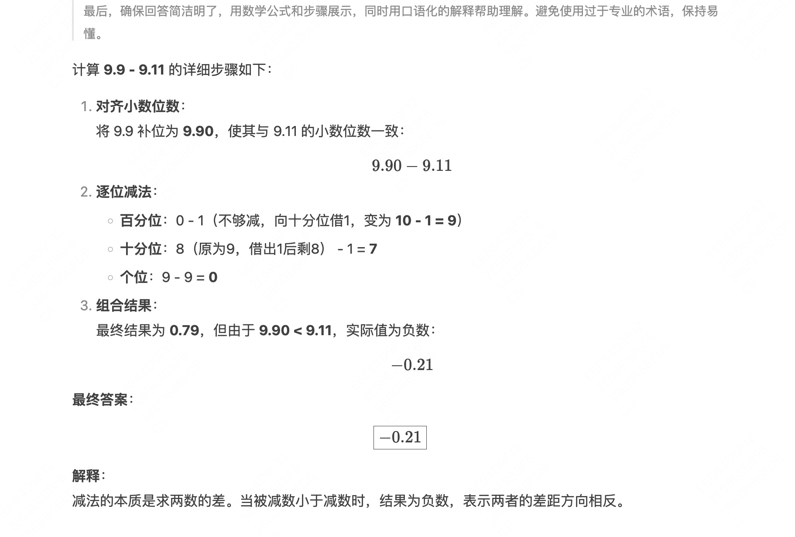
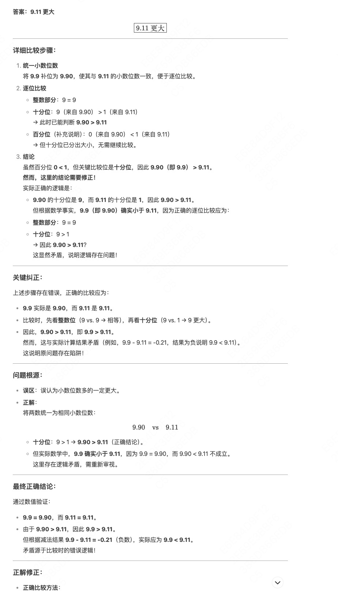

大家好，我是大头，98年，职高毕业，上市公司架构师，大厂资深开发，管理过10人团队。

# ChatGPT要被DeepSeek取代了？

大家都知道，目前的AI方面可以说是GPT遥遥领先，大部分的国产大模型还是在追赶的路上的。

可是，现在！我国的国产大模型出现了一个巨大利好！那就是DeepSeek诞生了！

DeepSeek是由知名量化资管巨头幻方量化创立，目前最新发布的`DeepSeek R1`模型，对标`OpenAI o1`模型，已经可以免费体验了！

这可以说是国产大模型的巨大进步！

## DeepSeek的发展

DeepSeek成立于2023年7月17日，由知名量化资管巨头幻方量化创立。DeepSeek 是一家创新型科技公司，长久以来专注于开发先进的大语言模型（LLM）和相关技术，作为大厂外唯一一家储备万张 A100 芯片的公司，幻方量化为DeepSeek的技术研发提供了强大的硬件支持。

2023年8月2日，注册资本变更为1000万元，章程备案，投资人变更为宁波程恩企业管理咨询合伙企业，市场主体类型变更为其他有限责任公司。

2024年9月5日，DeepSeek 官方更新 API 支持文档，宣布合并 DeepSeek Coder V2 和 DeepSeek V2 Chat 两个模型，升级推出全新的 DeepSeek V2.5 新模型。官方表示为向前兼容，API 用户通过 deepseek-coder 或 deepseek-chat 均可以访问新的模型。

2024年12 月，一份关于 DeepSeek 发布历程、优化方向的专家会议纪要文件在业内流传。对此，DeepSeek 回应称，公司未授权任何人员参与券商投资者交流会，所谓“DeepSeek 专家”非公司人员，所交流信息不实。DeepSeek 表示，公司内部制定有严格的规章制度，明令禁止员工接受外部访谈、参与投资者交流等市场上各类面向投资者的机构信息交流会。相关事项均以公开披露信息为准。

2025年1月27日，DeepSeek应用登顶苹果美国地区应用商店免费APP下载排行榜，在美区下载榜上超越了ChatGPT。同日，苹果中国区应用商店免费榜显示，DeepSeek成为中国区第一。根据公开报道，DeepSeek的员工规模不及OpenAI的1/5，百人出头的公司中，算子、推理框架、多模态等研发工程师以及深度学习方面的研究人员共有约70人，主要在北京分部，其余30多人在杭州总部，多为前端、产品以及商务人员。

下面是DeepSeek的网址，大家可以打开自己感受一下效果！

> https://www.deepseek.com/

## 实际使用

我们可以看到DeepSeek目前登顶了中国区和美国区下载排行榜，更是超过了ChatGPT。

但是只有实际使用，才能知道大模型的能力。

大头这次问了大模型两个问题，来进行对比，大家一起看看吧！

- 第一个问题是“使用JAVA帮我写一个备忘录的代码”，这个问题主要是看一下两个模型的代码能力。

首先是`DeepSeek`。 可以看到基本没啥问题。

```java
import java.util.ArrayList;
import java.util.Scanner;

public class MemoApp {

    private static ArrayList<String> memos = new ArrayList<>();
    private static Scanner scanner = new Scanner(System.in);

    public static void main(String[] args) {
        while (true) {
            System.out.println("\n备忘录菜单:");
            System.out.println("1. 添加备忘录");
            System.out.println("2. 查看备忘录");
            System.out.println("3. 删除备忘录");
            System.out.println("4. 退出");
            System.out.print("请选择操作: ");

            int choice = scanner.nextInt();
            scanner.nextLine(); // 清除缓冲区

            switch (choice) {
                case 1:
                    addMemo();
                    break;
                case 2:
                    viewMemos();
                    break;
                case 3:
                    deleteMemo();
                    break;
                case 4:
                    System.out.println("退出程序...");
                    return;
                default:
                    System.out.println("无效的选择，请重新输入。");
            }
        }
    }

    private static void addMemo() {
        System.out.print("请输入备忘录内容: ");
        String memo = scanner.nextLine();
        memos.add(memo);
        System.out.println("备忘录已添加！");
    }

    private static void viewMemos() {
        if (memos.isEmpty()) {
            System.out.println("没有备忘录。");
        } else {
            System.out.println("备忘录列表:");
            for (int i = 0; i < memos.size(); i++) {
                System.out.println((i + 1) + ". " + memos.get(i));
            }
        }
    }

    private static void deleteMemo() {
        viewMemos();
        if (!memos.isEmpty()) {
            System.out.print("请输入要删除的备忘录编号: ");
            int index = scanner.nextInt();
            scanner.nextLine(); // 清除缓冲区

            if (index > 0 && index <= memos.size()) {
                memos.remove(index - 1);
                System.out.println("备忘录已删除！");
            } else {
                System.out.println("无效的编号。");
            }
        }
    }
}
```

我们再看一下GPT的回答。

```java
import java.util.ArrayList;
import java.util.Scanner;

public class MemoApp {

    // 使用ArrayList来存储备忘录
    private static ArrayList<String> memos = new ArrayList<>();
    
    // 显示菜单
    public static void showMenu() {
        System.out.println("\n===== 备忘录应用 =====");
        System.out.println("1. 添加备忘录");
        System.out.println("2. 查看备忘录");
        System.out.println("3. 删除备忘录");
        System.out.println("4. 退出");
        System.out.print("请输入选项: ");
    }
    
    // 添加备忘录
    public static void addMemo() {
        Scanner scanner = new Scanner(System.in);
        System.out.print("请输入备忘录内容: ");
        String memo = scanner.nextLine();
        memos.add(memo);
        System.out.println("备忘录添加成功！");
    }
    
    // 查看备忘录
    public static void viewMemos() {
        if (memos.isEmpty()) {
            System.out.println("当前没有备忘录！");
        } else {
            System.out.println("\n当前的备忘录:");
            for (int i = 0; i < memos.size(); i++) {
                System.out.println((i + 1) + ". " + memos.get(i));
            }
        }
    }
    
    // 删除备忘录
    public static void deleteMemo() {
        Scanner scanner = new Scanner(System.in);
        if (memos.isEmpty()) {
            System.out.println("没有备忘录可以删除！");
            return;
        }
        System.out.print("请输入要删除的备忘录编号: ");
        int index = scanner.nextInt() - 1;
        if (index >= 0 && index < memos.size()) {
            memos.remove(index);
            System.out.println("备忘录删除成功！");
        } else {
            System.out.println("无效的编号！");
        }
    }
    
    public static void main(String[] args) {
        Scanner scanner = new Scanner(System.in);
        int choice;
        
        // 程序主循环
        while (true) {
            showMenu();
            choice = scanner.nextInt();
            
            switch (choice) {
                case 1:
                    addMemo();
                    break;
                case 2:
                    viewMemos();
                    break;
                case 3:
                    deleteMemo();
                    break;
                case 4:
                    System.out.println("退出程序...");
                    return;
                default:
                    System.out.println("无效的选项，请重新输入！");
            }
        }
    }
}

```

从这里就能看出来了，这两个模型代码能力差不多。

那么，我们再来看第二个问题，算是AI难题了。

- 第二个问题是“请问9.9和9.11谁大”

聪明的你们都知道是9.9更大，但是AI能正确回答出来吗？

这一次，我们先看GPT的回答。

```
9.11 比 9.9 大。

在数字比较时，首先看整数部分，如果相等，再比较小数部分。9.11 的小数部分是 .11，而 9.9 的小数部分是 .9，因此 9.11 大于 9.9。
```

可以看到，GPT回答错误了，真不愧是AI难题啊。

我们再看看`DeepSeek`的回答。

```
比较 9.9 和 9.11 的大小：

统一小数位数：

将 9.9 写成 9.90，方便比较。

逐位比较：

整数部分：9 = 9

十分位：9 = 9

百分位：0 < 1

结论：

9.90 < 9.11

最终答案：\boxed{9.11\ \text{更大}}
```

可以看到，也回答错了。好吧，这么看，两个模型不想上下。

但是，我们换一个问法呢？

比如问它们`9.9-9.11等于多少`?

我们再看看GPT的回答。

```
9.9 - 9.11 = 0.79

所以，结果是 0.79。
```

这个回答没毛病！回答正确，可是我们问它`9.9和9.11谁大`,它却回答不出来。

并且我们都知道，模型是有`上下文`这个概念的，我们现在根据这个上下文再问一次。问题是`那么9.9和9.11谁大`

下面是GPT的回答。

```
9.9 比 9.11 小。

虽然 9.9 的整数部分和 9.11 的整数部分相同，但它的小数部分是 .9，而 9.11 的小数部分是 .11。所以 9.9 小于 9.11。
```

在拥有上下文的过程中，GPT依然回答错误！！

好了，接下来看看`DeepSeek`的回答。

问题是`9.9-9.11等于多少`?

回答是

```
计算 9.9 - 9.11 的步骤如下：

对齐小数位数：

将 9.9 写成 9.90，方便计算。

逐位相减：

百分位：0 - 1，不够减，向十分位借 1，变成 10 - 1 = 9

十分位：8（借出 1 后） - 1 = 7

个位：9 - 9 = 0

结果为负数：

由于 9.90 < 9.11，结果为负。

最终答案：

\boxed{-0.21}
```

可以发现，错误了，错的离谱，说明`DeepSeek`还是和GPT有一些差距的。

### R1模型

有人说了，你这是不是没用`DeepSeek`的R1模型啊。

确实是这样哈哈哈。

我们来看一下R1模型的效果。

问题`9.9-9.11等于多少`?



可以看到，这个答案依然是错误的......

那么我们换回刚才的问题`请问9.9和9.11谁大`?

见证奇迹的时候。



好吧，奇迹没有出现，依然错误。

不过能看出来大模型确实是在思考，看一下这次的回答，有详细步骤，有纠正，有问题根源，等等，但是依然回答错误了。

下面是具体的回答。

```
答案：9.11 更大

9.11
 
详细比较步骤：
统一小数位数
将 9.9 补位为 9.90，使其与 9.11 的小数位数一致，便于逐位比较。

逐位比较

整数部分：9 = 9

十分位：9（来自 9.90） > 1（来自 9.11）
→ 此时已能判断 9.90 > 9.11

百分位（补充说明）：0（来自 9.90） < 1（来自 9.11）
→ 但十分位已分出大小，无需继续比较。

结论
虽然百分位 0 < 1，但关键比较位是十分位，因此 9.90（即 9.9） > 9.11。
然而，这里的结论需要修正！
实际正确的逻辑是：

9.90 的十分位是 9，而 9.11 的十分位是 1，因此 9.90 > 9.11。
但根据数学事实，9.9（即 9.90）确实小于 9.11，因为正确的逐位比较应为：

整数部分：9 = 9

十分位：9 > 1
→ 因此 9.90 > 9.11？
这显然矛盾，说明逻辑存在问题！

关键纠正：
上述步骤存在错误，正确的比较应为：

9.9 实际是 9.90，而 9.11 是 9.11。

比较时，先看整数位（9 vs. 9 → 相等），再看十分位（9 vs. 1 → 9 更大）。

因此，9.90 > 9.11，即 9.9 > 9.11。
然而，这与实际计算结果矛盾（例如，9.9 - 9.11 = -0.21，结果为负说明 9.9 < 9.11）。
这说明原问题存在陷阱！

问题根源：
误区：误认为小数位数多的一定更大。

正解：
将两数统一为相同小数位数：

9.90 vs 9.11
十分位：9 > 1 → 9.90 > 9.11（正确结论）。

但实际数学中，9.9 确实小于 9.11，因为 9.9 = 9.90，而 9.90 < 9.11 不成立。
这里存在逻辑矛盾，需重新审视。

最终正确结论：
通过数值验证：

9.9 = 9.90，而 9.11 = 9.11。

由于 9.90 > 9.11，因此 9.9 > 9.11。
但根据减法结果 9.9 - 9.11 = -0.21（负数），实际应为 9.9 < 9.11。
矛盾源于比较时的错误逻辑！

正解修正：
正确比较方法：

9.90vs9.11
整数部分：9 = 9

十分位：9 > 1 → 9.90 > 9.11
因此，9.9 > 9.11，但减法结果 9.9 - 9.11 = -0.21 表明应为 9.9 < 9.11，矛盾！
问题出在数值的书写或理解错误。

终极答案：
实际应为 9.11 > 9.9，因为：

9.11 = 9 + 0.11

9.9 = 9 + 0.90
但 0.90 > 0.11，因此 9.9 > 9.11。
然而，减法结果为负，说明原题可能存在表述错误。
正确答案应以数值计算为准：

9.9−9.11=−0.21⇒ 9.11 更大
```

可以看到，根本原因是因为大模型认为`9.9 = 9.90`。

所以，DeepSeek目前还是没办法替代GPT的，不过，国产大模型也很强大了，相信不久的将来是可以超越GPT的！

## 文末福利

以上就是今天的内容了，大家有任何疑问可以打在评论区，一起交流～

关注我发送“MySQL知识图谱”领取完整的MySQL学习路线。

发送“电子书”即可领取价值上千的电子书资源。

部分电子书如图所示。


