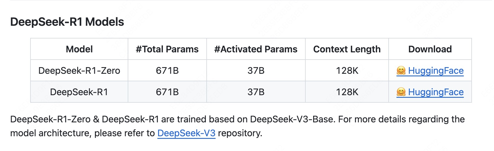
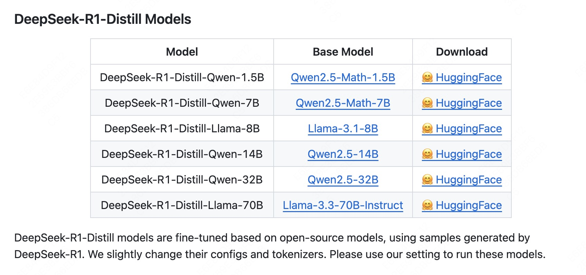
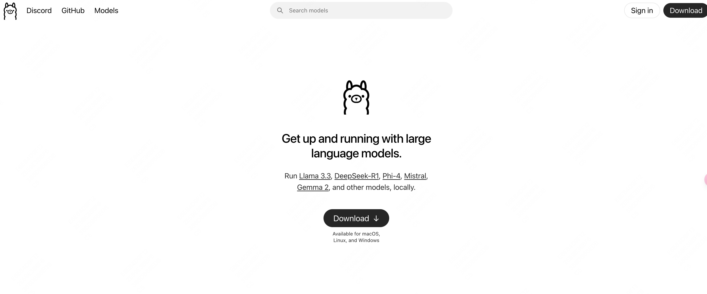
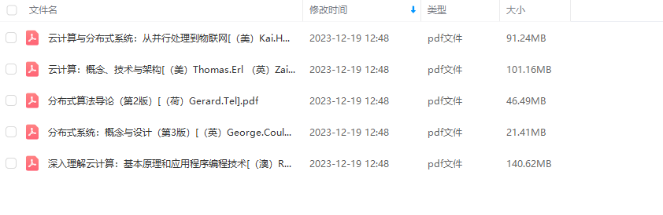

# DeepSeek R1本地部署

## DeepSeek大火,但天下苦服务器繁忙，请稍后再试久矣.

近期,DeepSeek大模型大火,一举超越ChatGPT登顶下载榜首.

DeepSeek从很少人知道一下子变成了人尽皆知的大厂,招聘薪资更是开出了年薪百万的价格,应届生都可以去.可谓是梦中情厂.

但是,就连DeepSeek自己可能都没想到自己这么火.因此招架不住大家的热情,频繁的出现`服务器繁忙，请稍后再试`.

使用体验实在糟糕.

好在,DeepSeek开源了自己的大模型,我们可以将DeepSeek部署到本地进行使用,这样的话就可以不再担心服务器繁忙了.可以尽情的蹂躏DeepSeek了!!!

关于DeepSeek的技术有兴趣的可以看看他们的论文.
[DeepSeekR1论文](https://github.com/deepseek-ai/DeepSeek-R1/blob/main/DeepSeek_R1.pdf)

- DeepSeek-R1 遵循 MIT License，允许用户通过蒸馏技术借助 R1 训练其他模型。
- DeepSeek-R1 上线 API，对用户开放思维链输出，通过设置 model='deepseek-reasoner' 即可调用。
- DeepSeek 官网与 App 即日起同步更新上线。

DeepSeek-R1 在后训练阶段大规模使用了强化学习技术，在仅有极少标注数据的情况下，极大提升了模型推理能力。在数学、代码、自然语言推理等任务上，性能比肩 OpenAI o1 正式版。

## 环境准备

1. **硬件要求**
   - 需要至少一个 CPU 核心（推荐使用多核处理器）。
   - 内存建议至少 4GB，具体内存可以根据实际需求调整。
   - 磁盘空间建议至少 20GB 可用空间。

2. **操作系统**
   - Windows、Linux 或 macOS 均可支持。

## 蒸馏模型

DeepSeek本地部署的基本是蒸馏模型,简单理解为阉割版.

为什么?因为本地无法支持真正大模型的算力.

蒸馏模型虽然无法和完整版一样,但是胜在我们可以本地部署,自己玩.还避免了服务器繁忙的苦恼.毕竟,东西再好,你用不了也是白搭啊.

`DeepSeek` 在开源 `DeepSeek-R1-Zero` 和 `DeepSeek-R1` 两个 660B 模型的同时，通过 `DeepSeek-R1` 的输出，蒸馏了 `6个小模型`开源给社区，其中 32B 和 70B 模型在多项能力上实现了对标 `OpenAI o1-mini` 的效果。

满血版DeepSeek 671B的要求:
- 显存需求：完整版（未量化）的显存需求极高，`BF16`精度下需 `1342GB`显存，即使使用`FP16`精度也需约 `350GB`显存
- 硬件配置：需多节点分布式计算，例如8张NVIDIA A100/H100（每卡80GB显存）并行运行，或更高端的超算集群
- 性能限制：单卡无法支持，即使最新RTX 5090（32GB显存）也无法有效运行，推理速度极低（低于每秒10个token）

看一下蒸馏版的要求和推荐配置.

| 版本名称 | 参数数量 | 显存需求 (FP16) | 内存需求 | 推荐Mac配置 | 推荐Windows配置 |
|----------|----------|-----------------|----------|-------------|-----------------|
| DeepSeek-R1-1.5B | 1.5B | ~3GB | 8GB+ | M1/M2芯片，8GB统一内存[^2^] | GTX 1650/RTX 2060，4GB+显存[^5^] |
| DeepSeek-R1-7B | 7B | ~14GB | 16GB+ | M1 Pro/M2 Pro，16GB统一内存[^2^] | RTX 3060/4070 Ti，12GB显存[^2^] |
| DeepSeek-R1-14B | 14B | ~28GB | 32GB+ | M1 Max/M2 Max，32GB统一内存[^2^] | RTX 4090/A100 40G，24GB+显存[^2^] |
| DeepSeek-R1-32B | 32B | ~64GB | 64GB+ | M1 Ultra/M2 Ultra，64GB统一内存[^2^] | 2x RTX 4090/A100 80G，48GB+显存[^2^] |
| DeepSeek-R1-70B | 70B | ~140GB | 128GB+ | 需要更高配置的Mac Pro[^6^] | 4x RTX 4090/A100 80G[^6^] |

## 安装

介绍完以后,开始安装吧.

安装相对来说比较简单,可以使用`Ollama`这个东西.

直接在[Ollama官网](https://ollama.com)下载就可以了.

在如下界面,直接点击`DownLoad`就可以了.

接下来选择版本,Mac、Linux或者Windows.

等待下载完成以后,运行`Ollama`.这个东西可以理解为大模型的运行环境.

## 总结
通过以上步骤，您可以在本地部署 DeepSeek。请根据实际需求调整配置并确保所有依赖项已正确安装。如果在运行过程中遇到问题，请参考官方文档或联系技术支持团队。

希望这份指南对您有所帮助！

## 文末福利

关注我发送“MySQL知识图谱”领取完整的MySQL学习路线。

发送“电子书”即可领取价值上千的电子书资源。

发送“大厂内推”即可获取京东、美团等大厂内推信息，祝你获得高薪职位。

部分电子书如图所示。

