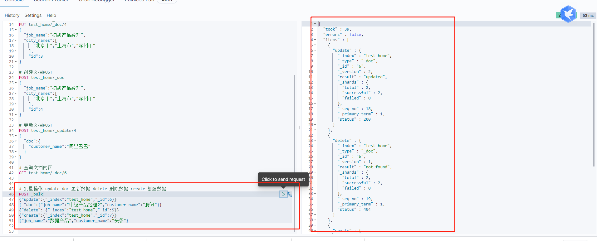

# 基本操作

## 文档的CRUD

- Create 如果id 已经存在，会失败
- Index 如果id不存在，创建新的文档。否则先删除在创建新的，版本会增加
- Update 文档必须已经存在，更新只会对相应字段做增量修改

### Create

指令
```
PUT {index}/_doc/{id}?op_type=create  //只是创建
{JSON}

PUT {index}/_doc/{id} //创建或更新
{JSON}

PUT {index}/_create/{id} //只是创建
{JSON}

POST {index}/_doc/  //只是创建 自动生成id
```

- 如果通过op_type参数指定`create`那么就只会创建，如果存在会报错
- 支持自动生成文档ID，和指定ID两种方式
- 通过调用 `POST /index/_doc`.不指定ID系统就会自动生成
- 使用 HTTP PUT index/_create/1 创建，URI中显式指定 `_create`,如果该ID的文档已经存在，则操作失败。


### GET

指令
```
GET {index}/{type}/{id} index/_doc/1
```

找到文档。HTTP 200,找不到就返回 404

元信息
- _index/_type
- 版本信息，同一个ID的文档，即使被删除，Version也会不断增加
- _source 中默认包含了文档的所有原始信息


### Index

指令
```
PUT {index}/{type}/{id} index/_doc/1
{JSON}
```

Index和Create不一样的地方就在于存在就删除在创建，并且版本号增加。

 ### Update

 Update 是直接更新

 指令
 ```
 POST {index}/_update/{id}
 {
     "doc":{JSON}
 }
 ```

 

 ### Delete

 Delete是删除操作

 指令
 ```
 DELETE {index}/_doc/{id}
 ```


 ## 批量操作 Bulk API

 支持一次调用，对不同的索引进行操作
 支持
 - Index
 - Create
 - Update
 - Delete

 只有一次网络请求，单条失败不会影响其他操作结果

 返回结果包括每一条的执行结果


 指令
 ```
 POST _bulk
 { "index":{"_index":"test", "_id":"1"} }  //指定index和_id
 { "field1":"value1" }                     //index 的数据
 { "delete" : {"_index":"test" "_id":"2"}} //delete 的 index 和id
 { "create": {"_index":"test2","_id":1}}              //create 的index id
 { "field1":"value3"}                      //create 的数据
 { "update":{"_id":1,"_index":"test"}}     //update 的id index
 { "doc":{"field2":"value2"}}              //update 的数据
 ```

  

## 批量获取 mget

批量操作，可减少网络开销

指令
```
POST _mget
{
    "docs":[
        {
            "_index":"user"
            "_id":1
        }
    ]
}
```

  

## 批量查询 msearch

指令
```
POST {index}/_msearch
{}                             //注意这里需要加上这个 不加会报错
{"query": {"match_all":{}},"size":1}
{"index": user }
{"query": {"match_all":{}},"size":1}
```

  


## 常见错误返回

|问题 | 原因 |
|:----|:-----|
| 无法连接 | 网络故障或集群挂了 |
| 连接无法关闭| 网络故障或节点出错|
|429 | 集群过于繁忙|
| 4xx | 请求体格式有错|
| 500 | 集群内部错误|


> 极客时间 ES 学习笔记


