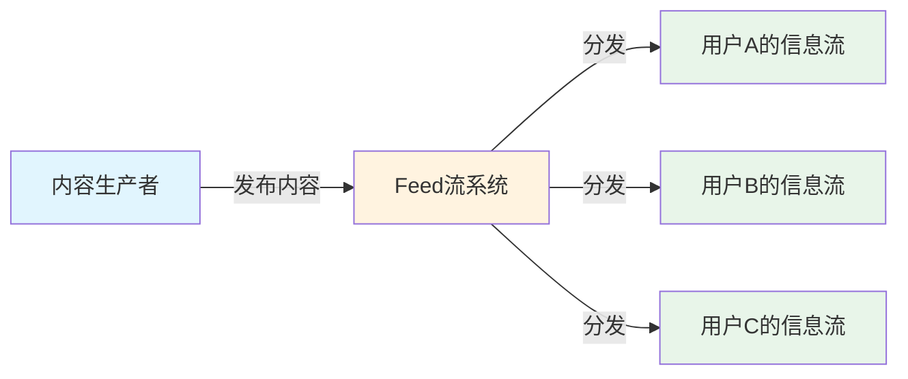
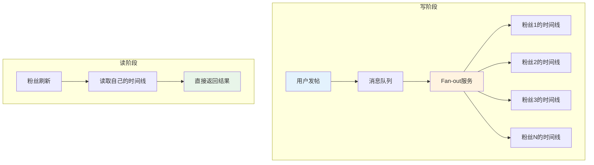
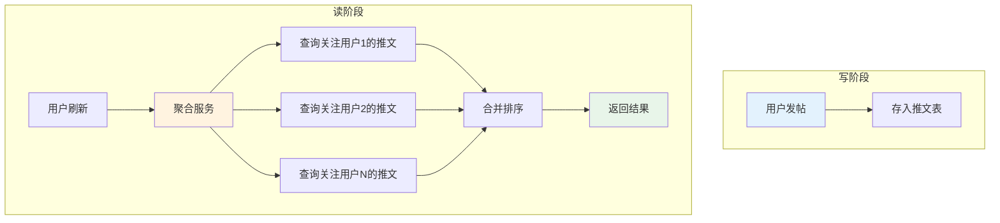
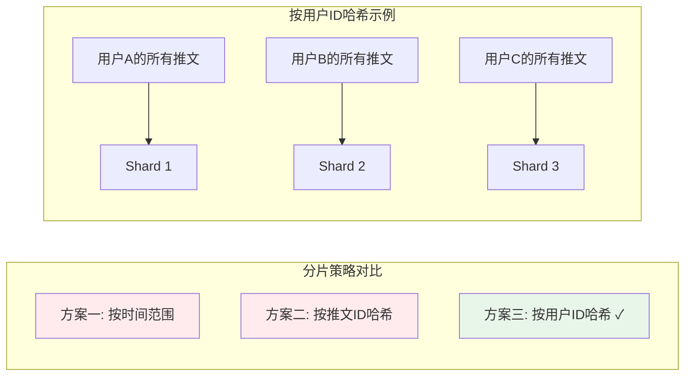
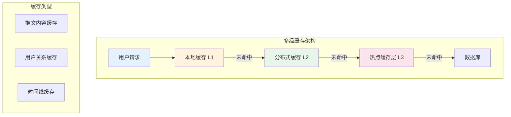
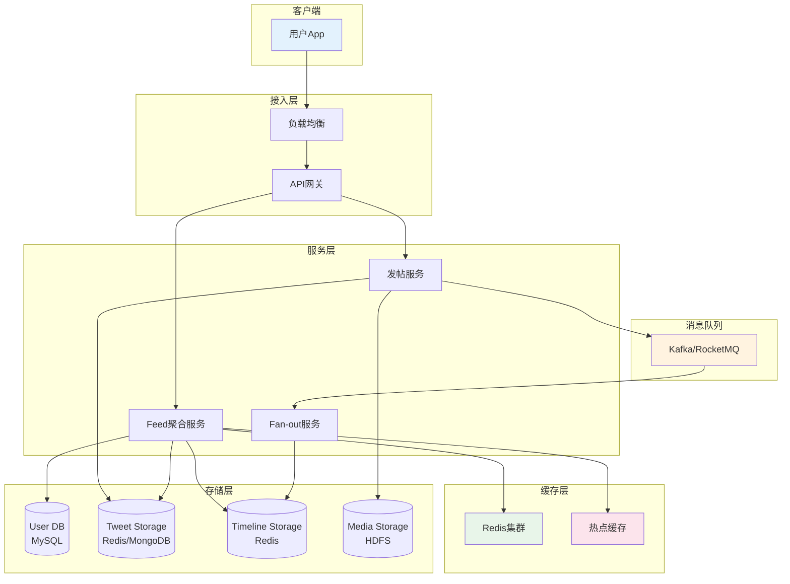

你有没有想过，为什么你刷微博、刷抖音、刷朋友圈，总是停不下来？

每当你打开这些App，手指轻轻往下滑，一条条内容就源源不断地涌现出来。就像给牲畜喂饲料一样，吃完了就再添加——所以叫"Feed"（饲养）流。

这背后，是一个精妙绝伦的分布式系统设计。

<!-- more -->

## 一、什么是Feed流？

**Feed流**，简单来说，就是信息流。解决的是信息生产者与信息消费者之间的信息传递问题。

典型的Feed流场景：
- **微博**：你关注的人发了什么
- **朋友圈**：好友的动态更新
- **今日头条**：算法推荐给你看的内容
- **抖音**：一个接一个的短视频

核心特点：**每个用户看到的内容都不同**，取决于你关注了谁、你的兴趣偏好。

## 二、Push还是Pull？这是个问题

Feed流系统有两种经典模式：

### 2.1 Push模式（写扩散）

发帖时，把内容"推"给所有粉丝的时间线。

**优点**：读的时候直接取，速度极快

**缺点**：明星发一条微博，要推给几千万粉丝，压力巨大

**适用场景**：朋友圈这种双向关注、粉丝数有限的情况

### 2.2 Pull模式（读扩散）

读的时候，去所有关注对象那里"拉"最新内容。

**优点**：发帖轻量，不存在写压力

**缺点**：读的时候要聚合多个数据源，延迟较高

**适用场景**：Twitter、微博这种大V粉丝众多的平台

### 2.3 实战难题与解法

**Push模式的经典问题**：某明星发微博，数据库瞬间爆炸怎么办？

**解法**：
- 只给活跃用户推送
- 粉丝时间线只存推文ID，减少存储压力

**Pull模式的经典问题**：某大V突然火了，机器扛不住怎么办？

**解法**：
- 热点内容单独缓存层
- 加流控保护，丢掉部分请求，尽最大能力服务

## 三、存储怎么分？Sharding的艺术

Feed流的数据量极其庞大，单机存不下，必须分片。

### 方案一：按时间范围分

Twitter早期做法。

**问题**：老数据没人看，新数据火得要命，机器负载严重不均。

### 方案二：按推文ID哈希

**问题**：找某人的推文要查所有机器，IO浪费严重。

### 方案三：按用户ID哈希（推荐）

同一用户的推文在同一台机器。

**问题1**：某些用户太火怎么办？**用缓存缓解**

**问题2**：发帖量差异大怎么办？**改进路由算法**

## 四、缓存的生死时速

Feed流系统，缓存是命门。

**为什么？**

假设你关注了100个人，每次刷新要查100台机器，延迟无法接受。缓存能把这100次请求，变成几次内存读取。

### 缓存策略

- **集中式缓存集群**：减少冗余，提高命中率
- **多级缓存**：本地缓存 + 分布式缓存
- **热点内容单独缓存层**：专门扛住流量洪峰

## 五、系统架构全景图

### 核心组件说明

| 组件 | 说明 | 技术选型 |
|------|------|----------|
| User DB | 用户关系（关注/粉丝） | MySQL |
| Tweet Storage | 推文内容 | Redis/MongoDB/MySQL |
| Timeline Storage | 用户时间线 | Redis |
| Media Storage | 图片视频 | 分布式文件系统（HDFS等） |
| Queue | 异步处理发帖事件 | Kafka/RocketMQ |

## 六、架构师的思考

Feed流看似简单的"刷一刷"，背后是：

- **高并发**：每秒百万级请求
- **高可用**：挂了用户就跑
- **低延迟**：刷不出来就卸载
- **海量数据**：每天新增亿级推文

### 设计核心原则

> 没有完美的架构，只有最适合场景的选择。

朋友圈选Push，微博选Pull+Push混合，抖音选算法推荐——不同的业务形态，决定了不同的技术路线。

## 七、面试必问

如果你在面试中被问到Feed流系统设计，记住这几个关键点：

1. **明确场景**：是微博类（单向关注）还是朋友圈类（双向关注）
2. **选对模式**：粉丝多用Pull，粉丝少用Push
3. **存储分片**：优先按用户ID哈希
4. **缓存为王**：多级缓存是性能保障
5. **异步处理**：发帖进队列，削峰填谷

## 总结

Feed流系统是分布式系统设计的经典案例，涵盖了：

- 数据分片策略
- 缓存设计
- 消息队列
- 读写分离
- 推拉模式选择

掌握Feed流系统设计，你就能举一反三，理解更多互联网核心系统的架构精髓。

---

## 文末福利

> 关注我发送“MySQL知识图谱”领取完整的MySQL学习路线。
> 发送“电子书”即可领取价值上千的电子书资源。
> 发送“大厂内推”即可获取京东、美团等大厂内推信息，祝你获得高薪职位。
> 发送“AI”即可领取AI学习资料。
> 部分电子书如图所示。

