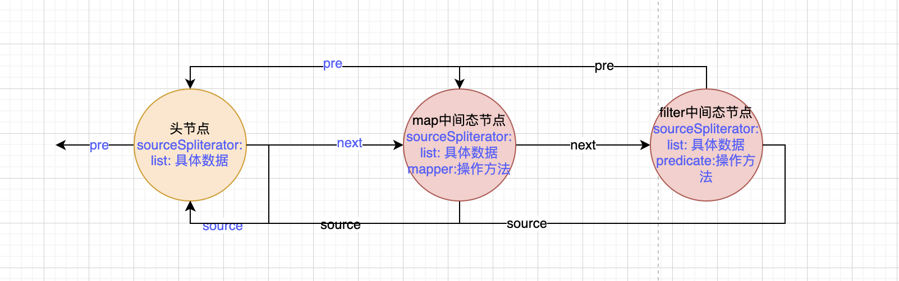
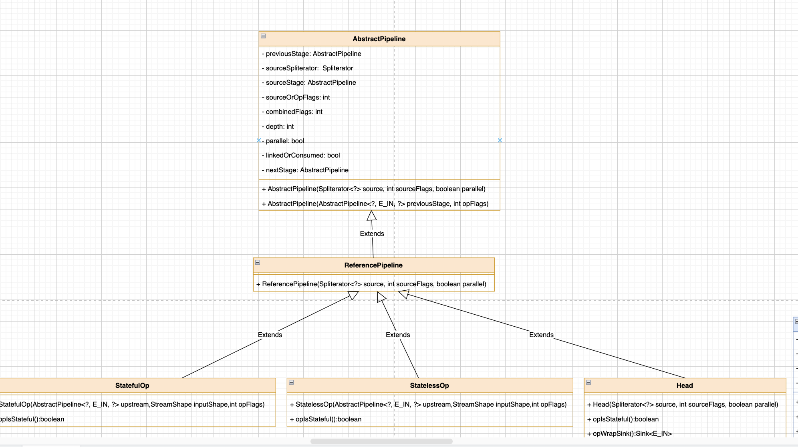
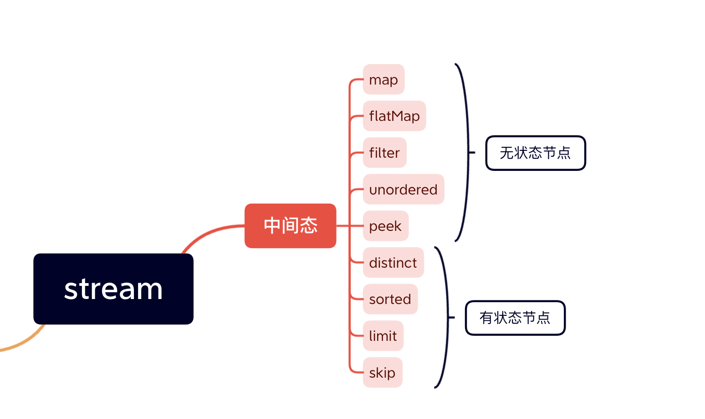
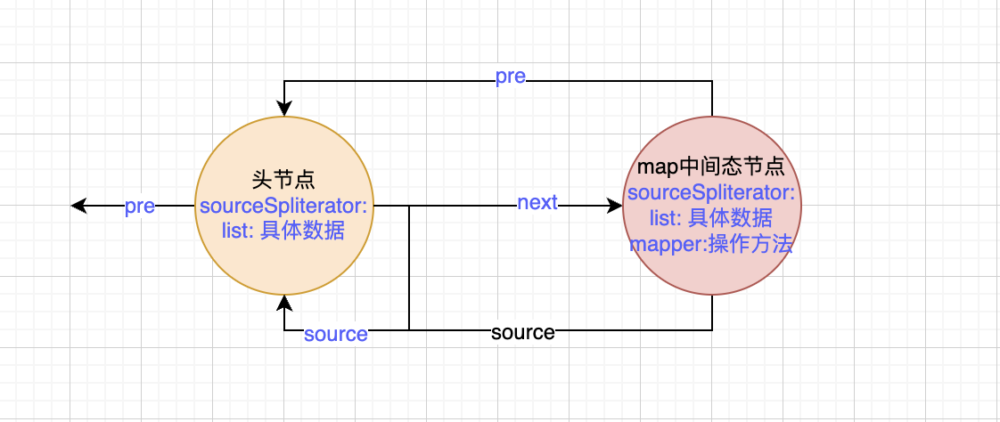
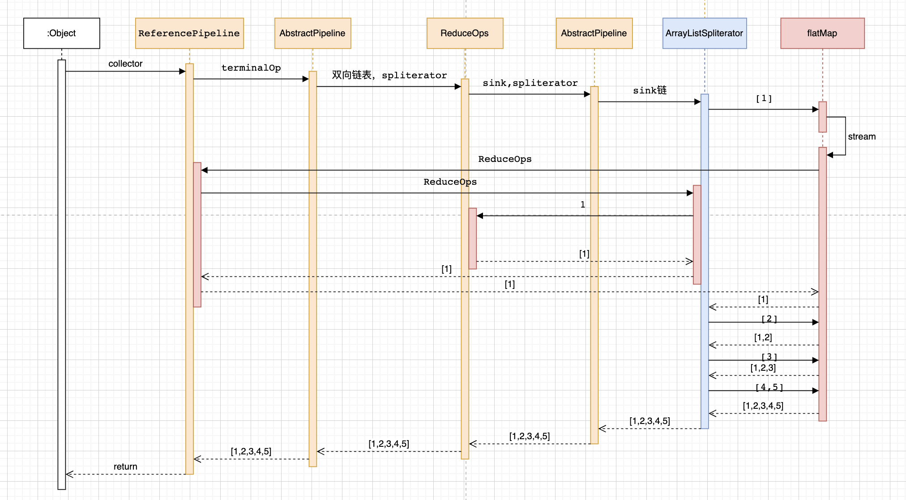
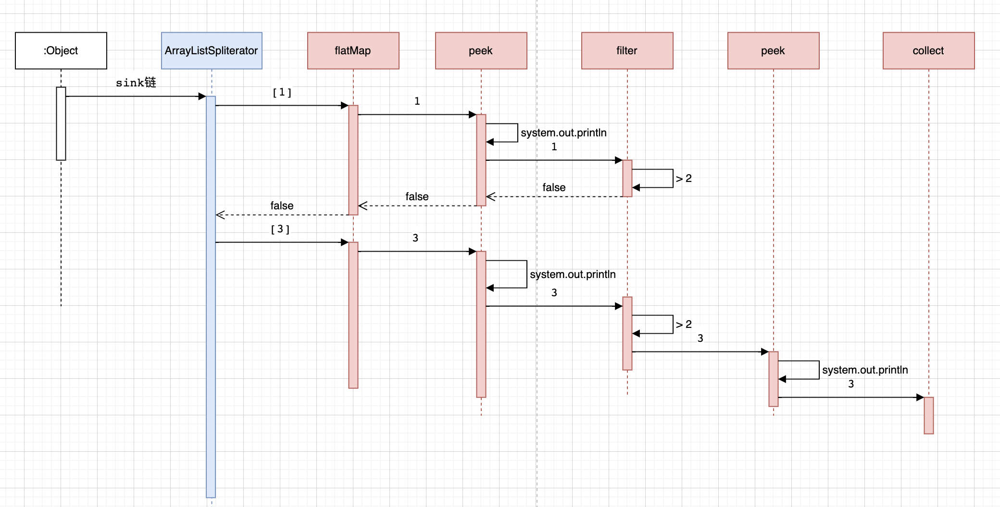
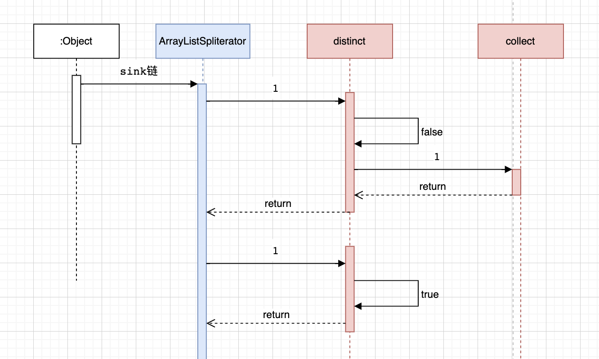
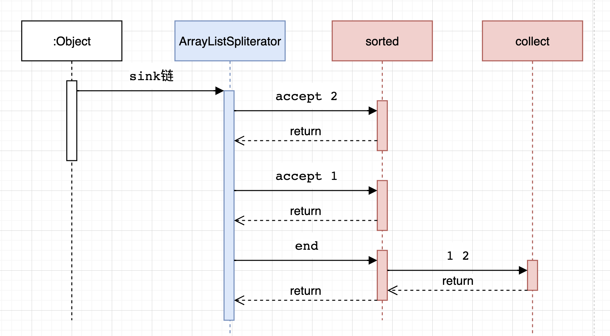

# stream

### stream的中间态

中间态的主要作用是构建双向链表的中间节点。一个操作对应一个节点。比如map，就会创建一个节点。其中pre指针指向前一个节点也就是头节点。而头节点的next指针指向map节点。

filter操作的时候同样创建一个节点，pre指针指向上一个操作也就是map节点。map节点的next指针指向filter节点。

每个中间态节点中都存储了操作，也就是中间态的时候传入的函数。而数据则全部在头节点中。

比如下面这样：



每个中间态节点其实又分成两种
- 有状态节点
- 无状态节点

类图如下：



中间态节点的几个操作如下：



我们目前的代码中使用了两个中间态的方法。
- map
- filter

#### map

我们调用的是`ReferencePipeline`类的`map`方法。作为中间态方法，需要链式操作，所以返回值当然是一个stream了。接受一个函数作为入参，可以是一个写好的函数，也可以是一个lambda表达式的函数。

```java

public final <R> Stream<R> map(Function<? super P_OUT, ? extends R> mapper) {
    //参数校验
    Objects.requireNonNull(mapper);
    //创建一个无状态的对象
    //第一个参数是this，也就是刚才初始化好的只有一个头节点的双向链表。
    //第二个参数是一个常量 REFERENCE
    //第三个参数是 8 & 2 = 1000 & 0010 = 1010 = 10
    return new StatelessOp<P_OUT, R>(this, StreamShape.REFERENCE,
                                    StreamOpFlag.NOT_SORTED | StreamOpFlag.NOT_DISTINCT) {

        //增加了opWrapSink方法，第一个参数是标志 = 95，第二个是sink节点
        //这个方法会在结果态的时候调用
        @Override
        Sink<P_OUT> opWrapSink(int flags, Sink<R> sink) {
            //创建一个 Sink.ChainedReference类的对象并返回。具体的放在结果态里面讲。
            return new Sink.ChainedReference<P_OUT, R>(sink) {
                @Override
                public void accept(P_OUT u) {
                    downstream.accept(mapper.apply(u));
                }
            };
        }
    };
}

//无状态节点的构造方法
//第一个参数是this，也就是刚才初始化好的只有一个头节点的双向链表。
//第二个参数是一个常量 REFERENCE
//第三个参数是 8 & 2 = 1000 & 0010 = 1010 = 10
StatelessOp(AbstractPipeline<?, E_IN, ?> upstream,
            StreamShape inputShape,
            int opFlags) {
    //调用父类的构造函数
    super(upstream, opFlags);
    // upstream.getOutputShape() 返回的就是 REFERENCE， inputShape = REFERENCE，
    // 所以返回true
    assert upstream.getOutputShape() == inputShape;
}

//巧了，他的父类也是ReferencePipeline，所以又来到了它的构造方法，不过和上次那个不是同一个了。
//这个作用是构造一个中间态的节点，加入到双向链表也就是加入到流中。
//第一个参数是 双向链表
//第二个是 10
ReferencePipeline(AbstractPipeline<?, P_IN, ?> upstream, int opFlags) {
    //再次调用父类的构造方法
    super(upstream, opFlags);
}

//这里同样来到了AbstractPipeline的构造方法。
//这个方法的作用是构造一个中间态的节点。
//第一个参数是上一个节点，这里上一个就是头节点。
//第二个参数是10
AbstractPipeline(AbstractPipeline<?, E_IN, ?> previousStage, int opFlags) {
    //判断上一个节点是否连接了消费者，如果连接了就报错。
    if (previousStage.linkedOrConsumed)
        //抛出非法状态异常
        throw new IllegalStateException(MSG_STREAM_LINKED);

    //把上一个节点的是否连接消费者 = 1
    previousStage.linkedOrConsumed = true;
    //上一个节点的 next 指针指向当前节点。
    previousStage.nextStage = this;

    //当前节点的头指针指向上一个节点
    this.previousStage = previousStage;
    //10 & 16777407 = 10
    this.sourceOrOpFlags = opFlags & StreamOpFlag.OP_MASK;
    //组合当前节点的标志和上一个节点的标志生成新的标志 生成的新标志 = 90
    this.combinedFlags = StreamOpFlag.combineOpFlags(opFlags, previousStage.combinedFlags);
    //当前节点的数据 = 上一个节点的数据 = list
    this.sourceStage = previousStage.sourceStage;
    //当前节点是否是有状态的节点，这里是false
    if (opIsStateful())
        sourceStage.sourceAnyStateful = true;
    //深度+1 = 1
    this.depth = previousStage.depth + 1;
}

//组合当前节点的标志和上一个节点的标志生成新的标志
//第一个参数10
//第二个参数95
static int combineOpFlags(int newStreamOrOpFlags, int prevCombOpFlags) {
    // 0x01 or 0x10 nibbles are transformed to 0x11
    // 0x00 nibbles remain unchanged
    // Then all the bits are flipped
    // Then the result is logically or'ed with the operation flags.
    // 95 & -16 ｜ 10 = 90
    return (prevCombOpFlags & StreamOpFlag.getMask(newStreamOrOpFlags)) | newStreamOrOpFlags;
}

@Override
final StreamShape getOutputShape() {
    return StreamShape.REFERENCE;
}
```


到这里`map`方法就执行结束了。可以看到这里依然没有真正的执行map方法。只是封装成了一个中间态的节点并加入了双向链表。并将数据list和操作mapper都存入了节点。如下。



#### filter

filter和map一样，作为中间态的方法。来看一下它的源码。

```java
// 同样需要返回一个stream对象。
// 同样接受一个方法或lambda表达式
public final Stream<P_OUT> filter(Predicate<? super P_OUT> predicate) {
    //参数校验
    Objects.requireNonNull(predicate);
    //同样创建一个无状态的节点并返回
    //第一个参数是this，是包含了头节点和map节点的链表。
    //第二个参数是一个常量 REFERENCE
    //第三个参数是 128
    //具体的代码和map的执行是一样的创建。并没有区别。不再赘述。
    return new StatelessOp<P_OUT, P_OUT>(this, StreamShape.REFERENCE,
                                    StreamOpFlag.NOT_SIZED) {
        
        //增加了opWrapSink方法，第一个参数是标志 = 90，第二个是sink节点
        //这个方法会在结果态的时候调用
        Sink<P_OUT> opWrapSink(int flags, Sink<P_OUT> sink) {
            //创建一个 Sink.ChainedReference类的对象并返回。具体的放在结果态里面讲。
            return new Sink.ChainedReference<P_OUT, P_OUT>(sink) {
                @Override
                public void begin(long size) {
                    downstream.begin(-1);
                }

                @Override
                public void accept(P_OUT u) {
                    if (predicate.test(u))
                        downstream.accept(u);
                }
            };
        }
    };
}
```

当filter完成以后，可以得到下面的数据结构。


### 其他的中间态方法

总共有9个中间态方法，除了上面的两个还有
- 无状态
    - flatMap
    - unordered
    - peek
- 有状态
    - distinct
    - sorted
    - limit
    - skip

#### flatMap 

先来看`flatMap`这个。他的作用是把给定的二维数组，转化成一维数组。比如
- 给定输入：[[1],[2],[3],[4,5]]
- 要求输出：[1,2,3,4,5]

来看应用层代码。首先构建一个二维数组，然后调用flatMap方法，传入`Collection::stream`方法进行处理元素，最后通过`collect`变成一个一维的list。

```java
//首先初始化输入列表
List<String> list1 = new ArrayList<>();
List<String> list2 = new ArrayList<>();
List<String> list3 = new ArrayList<>();
List<String > list4 = new ArrayList<>();
list1.add("1");
list2.add("2");
list3.add("3");
list4.add("4");
list4.add("5");
List<List<String>> list = new ArrayList<>();
list.add(list1);
list.add(list2);
list.add(list3);
list.add(list4);

//开始执行操作
List<String> listT = list.stream().flatMap(Collection::stream).collect(Collectors.toList());

return listT;
```

看一下具体的执行流程。橙色的是stream的通用执行流程，不管你中间态用哪个方法，这里是不变的，蓝色的是`ArrayListSpliterator`分割器。红色的执行流程是flatMap的执行流程。



可以看到`ArrayListSpliterator`先取出第一个元素`[1]`这个一维数组传递给`flatMap`，然后flatMap执行了我们传入的`Collection::stream`方法，该方法我们之前说过是初始化一个stream头节点。也就是再生成了一个stream

重点就是这里了。再次把[1]这个一维数组放入了新的stream里面。然后把结果态节点`ReduceOps`传递给了新的stream作为新的stream的结果态节点。

这个时候新的stream开始执行`ArrayListSpliterator`。从而把[1]一维数组进行for循环，取出了其中的`1`这个元素，然后把1传入了同一个`ReduceOps`进行处理从而组成了一个结果list->[1]。

把步骤总结如下：
1. 取出二维数组的第一个一维数组
2. 把一维数组和结果态节点重新创建一个stream
3. 执行stream把一维数组的元素循环放入结果态的list

循环二维数组，不断重复上述步骤，就可以把二维数组展开成一维数组了。

##### 源码分析

来看方法的源码，可以看到接受一个方法，返回一个stream，标准的中间态处理。

可以看到参数校验以后就创建了一个无状态节点，节点的具体创建上面说过了。是一样的，不同的就是`accpet`这个方法。

这个处理逻辑，接受一个参数，这个参数就是上面传入的一维数组，第一次是[1]，第二次是[2]，第三次是[3]，第四次是[4,5]。因为我们传入的方法是 Collection.stream方法，所以会生成一个新的stream并返回给result。

这个时候的result就是一个只有一个头节点的stream。头节点中包含了一维数组[1]。然后判断stream不为空，则调用stream顺序流进行处理，并把collect结果态节点传入。

当`forEach`处理完以后，该`accept`方法处理完成。回到当前流也就是二维数组的流中。然后取出下一个一维数组[2]再次进入`accept`方法执行。直到当前二维数组的流处理完成。

```java
@Override
public final <R> Stream<R> flatMap(Function<? super P_OUT, ? extends Stream<? extends R>> mapper) {
    //参数校验
    Objects.requireNonNull(mapper);
    // We can do better than this, by polling cancellationRequested when stream is infinite
    // 创建无状态节点并返回
    return new StatelessOp<P_OUT, R>(this, StreamShape.REFERENCE,
                                    StreamOpFlag.NOT_SORTED | StreamOpFlag.NOT_DISTINCT | StreamOpFlag.NOT_SIZED) {
        @Override
        Sink<P_OUT> opWrapSink(int flags, Sink<R> sink) {
            return new Sink.ChainedReference<P_OUT, R>(sink) {
                @Override
                // 初始化数据
                public void begin(long size) {
                    downstream.begin(-1);
                }

                @Override
                // 执行逻辑处理
                public void accept(P_OUT u) {
                    // 调用传入的方法进行处理元素 u ，u可能是 [1] [2] [3] [4,5]
                    // 并将执行结果新的stream赋值给 result
                    try (Stream<? extends R> result = mapper.apply(u)) {
                        // We can do better that this too; optimize for depth=0 case and just grab spliterator and forEach it
                        // 如果执行成功 返回了一个有效的 stream，则调用stream顺序流循环处理 downstream
                        // 这里的 downstream就是 结果态节点 ReduceOp 也就是 collect 收集方法
                        if (result != null)
                            result.sequential().forEach(downstream);
                    }
                }
            };
        }
    };
}
```

来看一下`forEach`方法，这个方法很简单。如果不是并行流，那么调用`ArrayListSpliterator`的`forEachRemaining`进行处理，传入结果态节点collect。

而`forEachRemaining`这个方法我们很熟悉了，无非就是循环流中的元素并传入sink链处理。要注意的是这个时候的流是上面新创建的流，这个流里面的元素是[1]这个一维数组。而这个流里面是没有中间态节点的，只有一个传入的collect结果态节点组成的sink链。所以这个流处理完以后就会把[1]里面的`1`这个元素收集到collect结果态节点中。

当这个forEach处理完这个一维数组以后，返回到上面的accept方法中。

```java
@Override
public void forEach(Consumer<? super E_OUT> action) {
    //判断不是并行流
    if (!isParallel()) {
        //使用ArrayListSpliterator的forEachRemaining方法，传入结果态节点进行处理。
        sourceStageSpliterator().forEachRemaining(action);
    }
    else {
        super.forEach(action);
    }
}
```

#### unordered

这个方法很少使用。主要是不保证流有序，而不是主动打乱流的顺序。直接看当前类中的方法源码吧。

如果有序，直接返回了，如果无序的话会返回一个无状态节点。而这里面并没有accept操作，而是直接返回了传入的sink节点。

比如传入 `reduceOp` 这个结果态的sink，那就返回这个。如果传入 `map` 的 sink 就返回这个sink。

```java
@Override
public Stream<P_OUT> unordered() {
    //判断是否有序，如果无序，直接返回
    if (!isOrdered())
        return this;
    
    //如果有序，创建一个无状态节点，sink链直接返回。
    return new StatelessOp<P_OUT, P_OUT>(this, StreamShape.REFERENCE, StreamOpFlag.NOT_ORDERED) {
        @Override
        Sink<P_OUT> opWrapSink(int flags, Sink<P_OUT> sink) {
            return sink;
        }
    };
}

//判断是否有有序的标志
final boolean isOrdered() {
    //判断标志位里面是否有ordered这个标志位
    return StreamOpFlag.ORDERED.isKnown(combinedFlags);
}
```

#### peek

这个方法很少使用。主要是调试的时候使用来查看元素是否经过流，当然了也有其他的用法，如果你能保证它不出错的情况下。

来看一个debug的例子。他将打印每一个流经`peek`方法的元素，在当前场景下，所有元素都会执行打印操作。

```java
//首先初始化输入列表
List<String> list1 = new ArrayList<>();
List<String> list2 = new ArrayList<>();
List<String> list3 = new ArrayList<>();
List<String > list4 = new ArrayList<>();
list1.add("1");
list2.add("3");
list3.add("2");
list4.add("5");
list4.add("4");
List<List<String>> list = new ArrayList<>();
list.add(list1);
list.add(list2);
list.add(list3);
list.add(list4);

//开始执行操作
List<String> listT = list.stream().flatMap(Collection::stream).peek(e -> System.out.println(e)).collect(Collectors.toList());


return listT;
```

但是如果我们修改一下，比如增加`filter`方法。这个时候，第二个peek方法，就只有>2的元素会流经了，从而只会打印出>2的元素。

```java
//开始执行操作
List<String> listT = list.stream().flatMap(Collection::stream).peek(e -> System.out.println(e)).filter(x -> {
    return x > 2;
}).peek(e -> System.out.println(e)).collect(Collectors.toList());
```

来看一下peek的执行时序图。可以看到第一个元素1执行完filter由于不满足条件所以后面的peek和collect都没有再执行。

而第二个元素3执行完filter以后又执行了peek和collect。所以这就是为什么一般又来debug的原因，因为他不一定执行。



接下来看一下它的源码.接受一个方法进行处理，返回一个stream。

而真正处理的时候，只是把流中的元素作为参数调用了peek的这个方法，然后不管结果，再次流动。相当于在流中间插入了一个方法。

所以理论上，你可以插入任何方法。但是要小心，如果因为某些原因导致流中的元素没有走到你的peek方法中，可能会产生印象不到的问题。

所以官方也更推荐用来debug。

> This method exists mainly to support debugging, where you want to see the elements as they flow past a certain point in a pipeline

```java
@Override
public final Stream<P_OUT> peek(Consumer<? super P_OUT> action) {
    //参数校验
    Objects.requireNonNull(action);
    //创建一个无状态节点并返回
    return new StatelessOp<P_OUT, P_OUT>(this, StreamShape.REFERENCE,
                                    0) {
        @Override
        Sink<P_OUT> opWrapSink(int flags, Sink<P_OUT> sink) {
            return new Sink.ChainedReference<P_OUT, P_OUT>(sink) {
                @Override
                public void accept(P_OUT u) {
                    //接受到流中的一个元素
                    //使用该元素作为参数调用peek传入的方法
                    action.accept(u);
                    //调用完以后不管结果如何 继续流动下去
                    downstream.accept(u);
                }
            };
        }
    };
}
```

#### distinct

`distinct`的作用很明显了，是去重

看一下应用层代码

```java
//首先初始化输入列表
List<String> list1 = new ArrayList<>();
List<String> list2 = new ArrayList<>();
List<String> list3 = new ArrayList<>();
List<String > list4 = new ArrayList<>();
list1.add("1");
list2.add("3");
list3.add("3");
list4.add("5");
list4.add("4");
List<List<String>> list = new ArrayList<>();
list.add(list1);
list.add(list2);
list.add(list3);
list.add(list4);

//开始执行操作
List<String> listT = list.stream().flatMap(Collection::stream).peek(e -> System.out.println(e)).distinct().collect(Collectors.toList());

return listT;
```

接下来看源码。直接返回`DistinctOps`节点。

```java
@Override
public final Stream<P_OUT> distinct() {
    return DistinctOps.makeRef(this);
}
```

看一下`makeRef`这个方法。

他首先是创建了一个有状态节点`stateFulOps`对象。接下来分为三种情况
- 已经是去重的了，不再去重
- 有序去重
- 无序去重

先看无序去重，在这个对象的`begin`初始化中，创建了一个`hashSet`对象。 

`accept`执行方法中。首先判断了流中的这个元素是否存在`hashSet`中，如果存在了就不继续沿着sink链执行了。如果不存在，将元素放入`hashSet`中并继续执行sink链。

通过`hashSet`来达到去重的一个效果。这将输出1,3,5,4

再来看有序去重，在这个对象的`begin`初始化中，创建了`seenNull`和`lastSeen`属性。
- seenNull: 当前元素是否为null
- lastSeen: 上一个元素

在`accept`方法中。判断当前元素是null并且seenNull = false，那么设置seenNull = true 且 lastSeen = null 并执行下一个操作。

否则，判断 lastSeen 是null也就是代表当前元素是`第一个元素`，或者 `当前元素`不等于`上一个元素`，那么自然是不重复的，所以执行下一个操作。

如果都不满足说明重复。那么不执行。

```java
static <T> ReferencePipeline<T, T> makeRef(AbstractPipeline<?, T, ?> upstream) {
    //生成有状态节点。传入stream，标志位传入IS_DISTINCT也就是要去重。
    return new ReferencePipeline.StatefulOp<T, T>(upstream, StreamShape.REFERENCE,
                                                    StreamOpFlag.IS_DISTINCT | StreamOpFlag.NOT_SIZED) {
        @Override
        Sink<T> opWrapSink(int flags, Sink<T> sink) {
            //参数校验
            Objects.requireNonNull(sink);

            //判断标志位是否有DISTINCT标志
            //注意这里的flags是上一个节点的标志位，以我们的代码为例，这个是peek的标志位。所以这里返回false
            //这里的判断相当于如果你已经去重了，就不需要在去重了。比如distinct().distinct()。只会去重一次。
            if (StreamOpFlag.DISTINCT.isKnown(flags)) {
                return sink;
            } else if (StreamOpFlag.SORTED.isKnown(flags)) {
                //判断是否有序的标志位，也就是判断前面是否已经有序 这里是无序，所以不走这里。
                return new Sink.ChainedReference<T, T>(sink) {
                    boolean seenNull;
                    T lastSeen;

                    @Override
                    public void begin(long size) {
                        seenNull = false;
                        lastSeen = null;
                        downstream.begin(-1);
                    }

                    @Override
                    public void end() {
                        seenNull = false;
                        lastSeen = null;
                        downstream.end();
                    }

                    @Override
                    public void accept(T t) {
                        //有序的去重比无序简单很多
                        //因为有序，如果重复那么必然是形如 a a a 这种重复，也就是重复的一定在一起。
                        if (t == null) {
                            if (!seenNull) {
                                seenNull = true;
                                downstream.accept(lastSeen = null);
                            }
                        } else if (lastSeen == null || !t.equals(lastSeen)) {
                            //所以这里只需要判断lastSeen也就是上一个出现的这个元素是null
                            //或者当前元素不等于上一个出现的元素那么就是不重复的
                            //比如 2 1 1，当前元素是第一个1，上一个元素是2，不等于，所以流动下去
                            //当前元素是第二个1，上一个元素也是1,等于，所以重复，不走这里
                            downstream.accept(lastSeen = t);
                        }
                    }
                };
            } else {
                //如果上一个节点没有 DISTINCT 也没有 SORTED 标志，那么走这里。
                return new Sink.ChainedReference<T, T>(sink) {
                    Set<T> seen;

                    @Override
                    public void begin(long size) {
                        //初始化 hashSet
                        seen = new HashSet<>();
                        downstream.begin(-1);
                    }

                    @Override
                    public void end() {
                        seen = null;
                        downstream.end();
                    }

                    @Override
                    public void accept(T t) {
                        // 这里的处理就是创建一个hashSet然后判断这个元素是否在hashSet中存在。
                        if (!seen.contains(t)) {
                            //如果不存在就不重复，放入hashSet
                            seen.add(t);
                            //继续执行
                            downstream.accept(t);
                        }
                    }
                };
            }
        }
    };
}

```

看一下执行的时序图。



#### sorted

`sorted`作用是按照给定的方法进行排序。其实底层就是调用的`List.sort`方法或`Arrays.sort`方法。

如果不传排序方法，将按照自然排序的方法来排序。

看一下应用层代码。
- 输入 1 3 3 5 4
- 输出 1 3 3 4 5

```java
//首先初始化输入列表
List<String> list1 = new ArrayList<>();
List<String> list2 = new ArrayList<>();
List<String> list3 = new ArrayList<>();
List<String> list4 = new ArrayList<>();
list1.add("1");
list2.add("3");
list3.add("3");
list4.add("5");
list4.add("4");
List<List<String>> list = new ArrayList<>();
list.add(list1);
list.add(list2);
list.add(list3);
list.add(list4);

//开始执行操作
List<String> listT = list.stream().flatMap(Collection::stream).sorted(String::compareTo).collect(Collectors.toList());

return listT;
```

接下来看源码。有两个方法，一个是传入给定的排序方法，一个是不传。他们都会通过`SortedOps.makeRef`创建`OfRef`对象，这个是`StateFulOp`的子类。

```java
@Override
public final Stream<P_OUT> sorted(Comparator<? super P_OUT> comparator) {
    return SortedOps.makeRef(this, comparator);
}

@Override
public final Stream<P_OUT> sorted() {
    return SortedOps.makeRef(this);
}
```

看一下SortedOps,就是直接创建`OfRef`对象。

```java
static <T> Stream<T> makeRef(AbstractPipeline<?, T, ?> upstream) {
    return new OfRef<>(upstream);
}

static <T> Stream<T> makeRef(AbstractPipeline<?, T, ?> upstream,
                            Comparator<? super T> comparator) {
    return new OfRef<>(upstream, comparator);
}
```

看这个类。有两个属性。最终根据是否有`SIZED`标志位，来决定使用array处理排序，还是array list处理排序。
- isNaturalSort 是否自然有序
- comparator 排序比较方法

```java
private static final class OfRef<T> extends ReferencePipeline.StatefulOp<T, T> {
/**
    * Comparator used for sorting
    */
private final boolean isNaturalSort;
private final Comparator<? super T> comparator;

/**
    * Sort using natural order of {@literal <T>} which must be
    * {@code Comparable}.
    */
OfRef(AbstractPipeline<?, T, ?> upstream) {
    super(upstream, StreamShape.REFERENCE,
            StreamOpFlag.IS_ORDERED | StreamOpFlag.IS_SORTED);

    // 设置为自然有序
    this.isNaturalSort = true;
    // Will throw CCE when we try to sort if T is not Comparable
    //设置排序方法为自然排序，如果是个不可排序的类型，将抛出异常
    @SuppressWarnings("unchecked")
    Comparator<? super T> comp = (Comparator<? super T>) Comparator.naturalOrder();
    this.comparator = comp;
}

/**
    * Sort using the provided comparator.
    *
    * @param comparator The comparator to be used to evaluate ordering.
    */
OfRef(AbstractPipeline<?, T, ?> upstream, Comparator<? super T> comparator) {
    super(upstream, StreamShape.REFERENCE,
            StreamOpFlag.IS_ORDERED | StreamOpFlag.NOT_SORTED);
    // 非自然排序
    this.isNaturalSort = false;
    // 将传入的排序方法赋值给排序方法
    this.comparator = Objects.requireNonNull(comparator);
}

@Override
public Sink<T> opWrapSink(int flags, Sink<T> sink) {
    Objects.requireNonNull(sink);

    // If the input is already naturally sorted and this operation
    // also naturally sorted then this is a no-op
    // 如果已经是有序的并且是自然排序的，就直接返回sink节点
    if (StreamOpFlag.SORTED.isKnown(flags) && isNaturalSort)
        return sink;
    else if (StreamOpFlag.SIZED.isKnown(flags))
    // 如果标志位有 StreamOpFlag.SIZED，返回 SizedRefSortingSink 对象
        return new SizedRefSortingSink<>(sink, comparator);
    else
        // 如果没有，返回 RefSortingSink 对象
        return new RefSortingSink<>(sink, comparator);
}
```

看一下array流的sink节点。
有两个属性
- array 数据
- offset 大小

```java
private static final class SizedRefSortingSink<T> extends AbstractRefSortingSink<T> {
    private T[] array;
    private int offset;

    SizedRefSortingSink(Sink<? super T> sink, Comparator<? super T> comparator) {
        // 调用父类的构造器，创建一个 sink 节点
        super(sink, comparator);
    }

    @Override
    @SuppressWarnings("unchecked")
    public void begin(long size) {
        // 在流开始的时候处理 如果流太大，就抛出异常，因为这里只处理有限流
        if (size >= Nodes.MAX_ARRAY_SIZE)
            throw new IllegalArgumentException(Nodes.BAD_SIZE);

        // 创建一个Object的数组。
        array = (T[]) new Object[(int) size];
    }

    @Override
    public void end() {
        // 当流结束的时候，就是所有元素都流动完成了
        // 使用给定的比较器对数组进行排序
        Arrays.sort(array, 0, offset, comparator);
        // 这个时候流就是有序的流了，接下来在顺着donstream流动
        downstream.begin(offset);
        // 如果cancellationWasRequested == false
        if (!cancellationWasRequested) {
            // 每个元素调用 downstream 进行流动处理
            for (int i = 0; i < offset; i++)
                downstream.accept(array[i]);
        }
        else {
            // 如果cancellationWasRequested == true
            // 先调用 downstream.cancellationRequested() 返回 false
            // 再执行元素调用 downstream 处理，
            for (int i = 0; i < offset && !downstream.cancellationRequested(); i++)
                downstream.accept(array[i]);
        }
        downstream.end();
        array = null;
    }

    @Override
    public void accept(T t) {
        // 当流元素经过的时候，存储到数组中，且offset++
        array[offset++] = t;
    }
}

// 父类 包含一个比较器，继承自 Sink.ChainedReference
private static abstract class AbstractRefSortingSink<T> extends Sink.ChainedReference<T, T> {
    protected final Comparator<? super T> comparator;
    // @@@ could be a lazy final value, if/when support is added
    protected boolean cancellationWasRequested;

    AbstractRefSortingSink(Sink<? super T> downstream, Comparator<? super T> comparator) {
        // 调用父类的构造方法
        super(downstream);
        // 比较器赋值
        this.comparator = comparator;
    }

    @Override
    public final boolean cancellationRequested() {
        cancellationWasRequested = true;
        return false;
    }
}
```

看一下array list的sink节点

```java
private static final class RefSortingSink<T> extends AbstractRefSortingSink<T> {
    private ArrayList<T> list;

    RefSortingSink(Sink<? super T> sink, Comparator<? super T> comparator) {
        // 调用父类的构造方法
        super(sink, comparator);
    }

    @Override
    public void begin(long size) {
        // 如果流太大就抛出异常
        if (size >= Nodes.MAX_ARRAY_SIZE)
            throw new IllegalArgumentException(Nodes.BAD_SIZE);

        // 使用 array list存储数据
        list = (size >= 0) ? new ArrayList<T>((int) size) : new ArrayList<T>();
    }

    @Override
    public void end() {
        //对array listp排序
        list.sort(comparator);
        //往下流动
        downstream.begin(list.size());
        // 如果cancellationWasRequested == false
        if (!cancellationWasRequested) {
            //循环每个元素进行流动
            list.forEach(downstream::accept);
        }
        else {
            // 如果cancellationWasRequested == true
            // 先调用 downstream.cancellationRequested() 返回 false
            // 再执行元素调用 downstream 处理，
            for (T t : list) {
                if (downstream.cancellationRequested()) break;
                downstream.accept(t);
            }
        }
        downstream.end();
        list = null;
    }

    @Override
    public void accept(T t) {
        // 把数据存入 array list
        list.add(t);
    }
}
```

最后看一下时序图。



#### limit

`limit`的作用是选取多少个元素。常常用在截取流的一部分。

还是以上面的排序代码为例，排序后只取前3个元素，就可以使用limit(3).

```java

List<String> listT = list.stream().flatMap(Collection::stream).sorted(String::compareTo).limit(3).collect(Collectors.toList());

```

简单看一下源码

```java
@Override
public final Stream<P_OUT> limit(long maxSize) {
    // 如果元素个数小于0，抛出异常
    if (maxSize < 0)
        throw new IllegalArgumentException(Long.toString(maxSize));
    // 通过 SliceOps 创建一个 有状态节点
    return SliceOps.makeRef(this, 0, maxSize);
}
```

看一下创建的节点。这个节点里面包含了一个sink节点。

sink节点中有两个属性
- n 也就是skip 跳过哪些，这里是0
- m 也就是limit 取哪些，我们这里是3

首先在初始化的时候限制了接下里节点初始化的大小。

真正处理的时候，如果有跳过的，先进行跳过，没有跳过的，就进行流动，当流动的元素数量达到limit个数量以后，不再流动。


```java
public static <T> Stream<T> makeRef(AbstractPipeline<?, T, ?> upstream,
                                    long skip, long limit) {
    // 这里 skip 是0，检查如果小于0就抛出异常
    if (skip < 0)
        throw new IllegalArgumentException("Skip must be non-negative: " + skip);

    // 返回有状态节点
    return new ReferencePipeline.StatefulOp<T, T>(upstream, StreamShape.REFERENCE,
                                                    flags(limit)) {
        @Override
        Sink<T> opWrapSink(int flags, Sink<T> sink) {
            // 返回sink节点
            return new Sink.ChainedReference<T, T>(sink) {
                //两个属性
                long n = skip;
                long m = limit >= 0 ? limit : Long.MAX_VALUE;

                @Override
                public void begin(long size) {
                    // 流的初始化 计算大小
                    // 这里size是流的大小，我们这里是5,skip是0，m是3 calcSize 返回的是 3
                    // 代表经过limit以后元素只有3个了，所以接下来节点的初始化只需要按3的大小来初始化就行了
                    downstream.begin(calcSize(size, skip, m));
                }

                @Override
                public void accept(T t) {
                    // 如果跳过0个
                    if (n == 0) {
                        // 要取的元素 > 0个
                        if (m > 0) {
                            // 按照顺序把每个元素流动
                            // m--，当3个元素流动完成以后，m == 0，就不再流动了。
                            m--;
                            downstream.accept(t);
                        }
                    }
                    else {
                        // 如果有要跳过的元素，n--，一直跳过，当全部跳过以后 n == 0 ，就不再跳过了
                        n--;
                    }
                }

                @Override
                public boolean cancellationRequested() {
                    return m == 0 || downstream.cancellationRequested();
                }
            };
        }
    };
}


private static int flags(long limit) {
    // 返回 NOT_SIZED 标志位 和 IS_SHORT_CIRCUIT 标志位
    return StreamOpFlag.NOT_SIZED | ((limit != -1) ? StreamOpFlag.IS_SHORT_CIRCUIT : 0);
}


// 计算大小
private static long calcSize(long size, long skip, long limit) {
    // size >=0就 先取 size - skip 和 limit中最小的
    // 我们这里 5-0 = 5,和3比，最小的是3，这里的意思就是如果流的大小比limit小，就返回全部流
    // 然后 -1 和 5比，取大的，返回5
    return size >= 0 ? Math.max(-1, Math.min(size - skip, limit)) : -1;
}
```


#### skip

`skip`就是跳过多少个元素。可以和`limit`结合起来一起截取流。

还是以上面的代码为例.skip 1 , limit 3就代表取第2个元素到第4个元素。

```java
List<String> listT = list.stream().flatMap(Collection::stream).sorted(String::compareTo).skip(1).limit(3).collect(Collectors.toList());
```

简单看一下源码。如果skip小于0就抛出异常，如果==0就直接返回，相当于不跳过。

创建节点的时候用的和上面`limit`的是一样的方法。只是参数变成了传skip，不传limit.

```java
@Override
public final Stream<P_OUT> skip(long n) {
    if (n < 0)
        throw new IllegalArgumentException(Long.toString(n));
    if (n == 0)
        return this;
    else
        //和limit一样
        return SliceOps.makeRef(this, n, -1);
}
```

### 总结

好了，到这里为止，就分析完了`stream`所有的`中间操作`。

从源码的角度分析了他们是如何运行的，都有什么作用。

总结一下。这些操作主要分为两大类
- 有状态
- 无状态

作为中间操作，他们的返回类型全部是 stream。