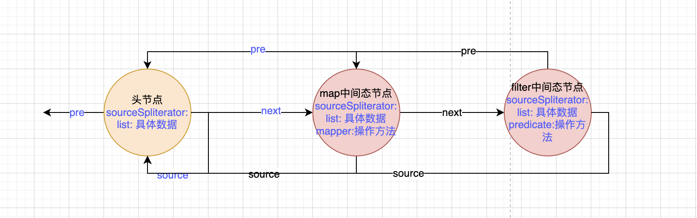
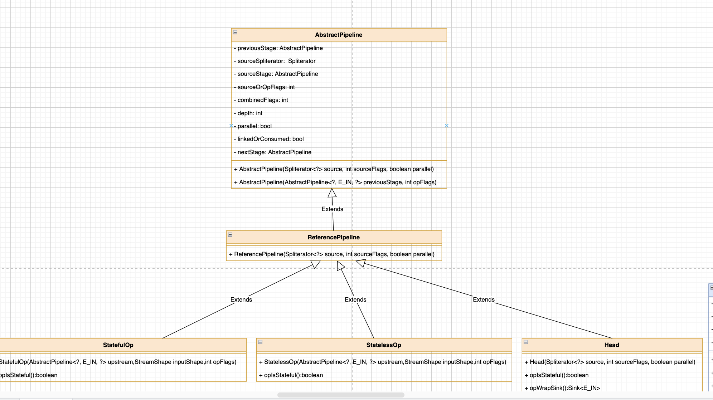

# stream

stream是java8新增的非常重要的一个特性。并且非常的常用。它实现了`函数式编程`。具体函数式编程的概念已经很久了，比如js中的`箭头函数`。java中也通过stream做出了支持。想深入理解的可以参考cmu的课程[15-150](http://www.cs.cmu.edu/~./15150/index.html)或者stanford的[CS 95SI]()。

它可以帮助我们方便的处理很多东西。处理分为两种，中间态和结果态。


下面是一些中间态操作。他们位于链式操作的中间，当调用他们的时候并没有真正执行。只有当调用结果态的方法的时候才会真正的执行操作，也就是所谓的`延迟执行`。
|方法名| 说明 |
|:----|:----|
| map |  循环。可以简单理解为foreach |
| flatMap | 将二维数据展开成一维 |
| filter | 过滤数据 |
| distinct | 去重 |
| sorted | 排序 |
| limit | 限制只取n个元素 |
| skip | 跳过n个元素 |

### stream的初始化

看一个例子，假设我们有一个需求。输出大于5的所有数。
- 期望输入：2，5，7，1，3，2，8
- 期望输出：7，8

```java
//首先初始化输入列表
List<String> list = new ArrayList<>();
list.add("2");
list.add("5");
list.add("7");
list.add("1");
list.add("3");
list.add("2");
list.add("8");

//开始执行操作
List<Integer> list2 = list.stream().map(Integer::valueOf).filter(x -> {
            return x > 5;
        }).collect(Collectors.toList());

//输出
System.out.println(list2);
```

接下来看一下stream是如何执行的。下面是stream的一个类图。可以看到初始化需要使用到一个接口和6个类。主要分为三大类。


#### 类介绍

第一类是`ArrayList`类和`ArrayListSpliterator`类。这两个类是核心类。毕竟我们输入类型是ArrayList，这个就不用说了。

主要在于`ArrayListSpliterator`这个类，这个类是ArrayList的一个内部类。最主要的操作方法和数据都在里面。看一下几个属性
- list 我们要进行stream操作的list
- fence 大小
- expectedModCount 期望的处理数量
- index 

最主要的循环处理方法同样在这个类里面。处理逻辑全部在`forEachRemaining`这个方法中。

第二大类是`StreamSupport`流的支持类，算是一个单独的类，提供了对stream的一些操作方法，比如初始化一个stream。

第三大类是`AbstractPipeline`抽象类为主的3个类，还有两个是继承自`AbstractPipeline`的`ReferencePipeline`类，主要负责处理引用类的流。和继承`ReferencePipeline`的`Head`类，实现了双向链表的头节点。他们的主要功能就是构造为流的双向链表数据结构。


#### 执行流程介绍

这几个类的执行时序图如下。


可以清晰的看到，通过`Collection`类的stream方法调用到了`ArrayList`的方法然后调用到了`ArrayListSpliterator`的方法，来初始化了`ArrayListSpliterator`对象，并存储到流中。

接下来`Collection`类将初始化好的`ArrayListSpliterator`对象传递给了`StreamSupport`类用来初始化stream。

StreamSupport将会创建一个双向链表的头节点。并将`ArrayListSpliterator`对象放入头节点。初始化以后的流如下图所示：


#### 流介绍

流分为两种，顺序流和并行流。

##### 顺序流

顺序流顾名思义就是按照顺序执行。可以直接的类比为for循环。如下图，如果1，2，3三个元素，进入流以后，依然是1,2,3三个元素。


##### 并行流

并行流是充分的利用现代多核计算机的性能而出的。它可以把流分散到各个进程/线程中去执行。来达到并行执行的效果。如下图，1，2，3三个元素，可能会进入2个流中。


#### 源码分析 

list的stream方法调用的是Collection类的stream方法。所以首先来看这个方法，该方法返回一个顺序流，顺序流中包含了list中的所有元素。

```java
//该方法返回一个顺序流，顺序流中包含了list中的所有元素。
default Stream<E> stream() {
    //调用了StreamSupport.stream方法，传入了一个分割迭代器，第二个参数false代表是顺序流，true是平行流。
    return StreamSupport.stream(spliterator(), false);
}

//生成一个分割迭代器，该方法是ArrayList类中的方法。
@Override
public Spliterator<E> spliterator() {
    //返回一个ArrayListSpliterator类的实例。
    //实例中包含4个属性
    //list = list
    //index = 0
    //fence = -1
    //expectedModCount = 0
    return new ArrayListSpliterator<>(this, 0, -1, 0);
}

```

接下来来到StreamSupport类的stream方法。通过spliterator来创建一个顺序流。只有当结果态操作开始后，spliterator才会真正开始运行

```java
/**
*  通过spliterator来创建一个顺序流或者并行流，如果parallel=1就是并行流
*  只有当结果态操作开始后，spliterator才会真正开始运行
*  spliterator需要具有不可变性，并发性或延迟绑定性。
*  当前的spliterator就是上面生成的ArrayListSpliterator对象。且包含上面说的4个属性。
**/
public static <T> Stream<T> stream(Spliterator<T> spliterator, boolean parallel) {
    //参数校验
    Objects.requireNonNull(spliterator);
    //返回一个ReferencePipeline.Head类型的头节点
    return new ReferencePipeline.Head<>(spliterator,
                                        StreamOpFlag.fromCharacteristics(spliterator),
                                        parallel);
}
```

在生成Head对象的时候，第二个参数调用了`StreamOpFlag`类的`fromCharacteristics`方法。来看一下这个方法。
可以看到有一个判断是否是自然排序的，如果不是自然排序就会走到if里面，也就是不会将spliterator标记为已排序状态。
最终返回结果为80

```java
//将spliterator的characteristic bit转换为stream flags
//当前的spliterator就是上面生成的 ArrayListSpliterator 对象。且包含上面说的4个属性。
static int fromCharacteristics(Spliterator<?> spliterator) {
    //调用spliterator对象的characteristics方法。具体看下面 返回的characteristics = 16464
    int characteristics = spliterator.characteristics();
    // 16464和4做按位与，即两个都是1才是1，100 0000 0101 0000 & 100 = 000 0000 0000 0000 = 0说明不满足第一个条件，触发短路，走else
    if ((characteristics & Spliterator.SORTED) != 0 && spliterator.getComparator() != null) {
        // Do not propagate the SORTED characteristic if it does not correspond
        // to a natural sort order
        // 如果不是自然排序的，则不传播有序状态。
        return characteristics & SPLITERATOR_CHARACTERISTICS_MASK & ~Spliterator.SORTED;
    }
    else {
        //将16464和85做按位与，100 0000 0101 0000 & 0101 0101 = 000 0000 0101 0000 = 80
        //返回80
        return characteristics & SPLITERATOR_CHARACTERISTICS_MASK;
    }
}

//ArrayListSpliterator类的characteristics方法。
//三个数做按位或，即有1就是1，结果是 100 0000 0101 0000 = 16464
public int characteristics() {
    //Spliterator.ORDERED = 16 = 1 0000
    //Spliterator.SIZED = 64 = 100 0000
    //Spliterator.SUBSIZED = 16384 = 100 0000 0000 0000
    return Spliterator.ORDERED | Spliterator.SIZED | Spliterator.SUBSIZED;
}

```

接下来看`Head`类，它是`ReferencePipeline`类的一个内部类。主要作用是头节点的一些属性和操作。包括生成头节点等。

```java

static class Head<E_IN, E_OUT> extends ReferencePipeline<E_IN, E_OUT> {
    //这个是双向链表的头节点。也就是把最先创建的初始流作为头节点。
    //三个参数，第一个参数source = ArrayListSpliterator对象
    //第二个参数是流的标志，80
    //第三个参数是否并行流 0
    Head(Spliterator<?> source,
            int sourceFlags, boolean parallel) {
        //调用了父类的构造函数，就是ReferencePipeline的构造方法。在下面。
        super(source, sourceFlags, parallel);
    }
}


//ReferencePipeline的构造方法。参数同上，不再描述。
ReferencePipeline(Spliterator<?> source,
                    int sourceFlags, boolean parallel) {
    //再次调用了父类的构造方法。ReferencePipeline的父类是AbstractPipeline类，放在下面了。
    super(source, sourceFlags, parallel);
}

//AbstractPipeline类的构造方法。构造一个stream的头节点。
AbstractPipeline(Spliterator<?> source,
                     int sourceFlags, boolean parallel) {
    //头节点的头指针为空。
    this.previousStage = null;
    //数据 = ArrayListSpliterator对象
    this.sourceSpliterator = source;
    //头节点的数据 指向自己。
    this.sourceStage = this;
    //标志位 = 80 & 85 = 80 二进制 0101 0000 & 0101 0101 = 0101 0000 = 80
    this.sourceOrOpFlags = sourceFlags & StreamOpFlag.STREAM_MASK;
    // The following is an optimization of:
    // StreamOpFlag.combineOpFlags(sourceOrOpFlags, StreamOpFlag.INITIAL_OPS_VALUE);
    //sourceOrOpFlags << 1 = 160  左移一位就是 * 2
    //～160 = -161  按位去反
    // -161 & 255 = 95
    // combinedFlags = 95
    this.combinedFlags = (~(sourceOrOpFlags << 1)) & StreamOpFlag.INITIAL_OPS_VALUE;
    // 双向链表深度 = 0 ，因为现在只有头节点。
    this.depth = 0;
    // 是否并行流 = 0 不是
    this.parallel = parallel;
}
```

list.stream()函数的源码就完了。主要调用了构造函数，构造了一个含有list数据的头节点，头指针指向空，next指针指向自己。完成了流的初始化。当前数据结构如下。


### stream的中间态

中间态的具体源码和流程在后面介绍，这里只介绍中间态的作用。

中间态的主要作用是构建双向链表的中间节点。一个操作对应一个节点。比如map，就会创建一个节点。其中pre指针指向前一个节点也就是头节点。而头节点的next指针指向map节点。

filter操作的时候同样创建一个节点，pre指针指向上一个操作也就是map节点。map节点的next指针指向filter节点。

每个中间态节点中都存储了操作，也就是中间态的时候传入的函数。而数据则全部在头节点中。

比如下面这样：



每个中间态节点其实又分成两种
- 有状态节点
- 无状态节点

类图如下：




### stream的结果态

结果态的具体源码和流程在后面介绍，这里只介绍结果态的作用。

结果态的主要作用有三个
1. 构造结果态节点
2. 构造sink链表
3. 执行流。

先说第一个，结果态节点是`ReduceOp`对象。这个结果态节点中包含了一个`makeSink`方法，用来构建结果态的sink节点。结果态的sink节点是一个`ReducingSink`对象。

第二个，当结果态节点和结果态的sink节点构造完成以后。接下来会根据之前构建好的双向链表来生成对应的sink链表。

一开始的双向链表我们知道是这样的


而sink链表则是反过来了，根据双向链表从后向前通过pre指针不断向前，把每个节点包裹在sink节点中并通过`downstream`指针来指向下个节点。这里因为在第一步的时候把源数据取出来了，所以sink中不包含头节点。创建完后如图所示：


第三步才是真正的执行流。根据sink链表来执行，每次把元素传递给第一个sink也就是map操作，当第一个sink节点处理完以后通过downstream流动到下一个sink节点执行。不断通过downsteram流动，直到最后到结果态的sink执行完以后。再次把第二个元素进行流动执行。直至所有元素执行完毕。

### 总结

因为是通过自顶向下的方式来了解stream。所以这里主要介绍了stream的执行流程和初始化的源码分析。中间态和结果态的源码分析放在了后面。

在执行流程中可以看到。首先创建了一个双向链表，然后在根据双向链表创建了sink链表。最后通过sink链表进行执行流的操作。也可以看出来确实是流动，传播，充满了stream的味道。

从这里也能看出来为何一开始是双向链表而不是单向的，因为要通过pre指针构造sink链表。

但是这里就有一个问题了，为什么不直接用一开始的双向链表，而要在创建一个sink链表呢？

我个人觉得有几个原因：
1. 因为当前处于结果态节点，想从头流动执行，需要当前指针先指向头节点，所以必须遍历一遍。
2. 重新构建一个纯净的sink链表，来达到`不变性`的性质。保持之前的数据和节点等不可变。
3. 双向链表只负责存储数据和操作。真正的执行通过sink链表来执行，达到`单一职责`和`分层清晰`。
4. 其中或许还有并行流并发的问题。


