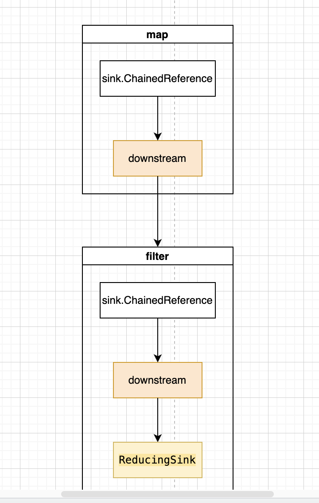

# stream

### stream的结果态

当前使用的结果态方法是`collect`。主要作用是收集。看一下源码。作为结果态方法，不再返回stream类型的对象。接受一个`Collector`类型的对象作为参数。

```java
public final <R, A> R collect(Collector<? super P_OUT, A, R> collector) {
    //声明一个变量
    A container;
    //判断是否并行流。短路，直接走else
    if (isParallel()
            && (collector.characteristics().contains(Collector.Characteristics.CONCURRENT))
            && (!isOrdered() || collector.characteristics().contains(Collector.Characteristics.UNORDERED))) {
        container = collector.supplier().get();
        BiConsumer<A, ? super P_OUT> accumulator = collector.accumulator();
        forEach(u -> accumulator.accept(container, u));
    }
    else {
        //调用evaluate方法
        container = evaluate(ReduceOps.makeRef(collector));
    }
    return collector.characteristics().contains(Collector.Characteristics.IDENTITY_FINISH)
            ? (R) container
            : collector.finisher().apply(container);
}
```

先看一下`ReduceOps` 类的 `makeRef`方法。构造一个结果态对象，对引用类型的值执行可变的计算，规约。

```java

/** Constructs a TerminalOp that implements a mutable reduce on reference values.
    形参:
    collector – a Collector defining the reduction
    返回值:
    a ReduceOp implementing the reduction
*/
public static <T, I> TerminalOp<T, I> makeRef(Collector<? super T, I, ?> collector) {

    //参数校验不为空并且获取到collector的 supplier
    Supplier<I> supplier = Objects.requireNonNull(collector).supplier();
    // 获取到 collector的 accumulator
    BiConsumer<I, ? super T> accumulator = collector.accumulator();
    // 获取到 collector的 combiner
    BinaryOperator<I> combiner = collector.combiner();
    // 内部类 
    class ReducingSink extends Box<I>
            implements AccumulatingSink<T, I, ReducingSink> {
        @Override
        public void begin(long size) {
            state = supplier.get();
        }

        @Override
        public void accept(T t) {
            accumulator.accept(state, t);
        }

        @Override
        public void combine(ReducingSink other) {
            state = combiner.apply(state, other.state);
        }
    }
    //创建一个 ReduceOp 的对象
    return new ReduceOp<T, I, ReducingSink>(StreamShape.REFERENCE) {
        @Override
        public ReducingSink makeSink() {
            return new ReducingSink();
        }

        @Override
        public int getOpFlags() {
            return collector.characteristics().contains(Collector.Characteristics.UNORDERED)
                    ? StreamOpFlag.NOT_ORDERED
                    : 0;
        }
    };
}

```

看一下`ReduceOp`类。他根据指定的流类型创建ReduceOp对象。 使用指定的`supplier`创建 accumulating sinks。 对流进行预估并将结果发送至 accumulating sinks。然后执行计算操作。

```java

private static abstract class ReduceOp<T, R, S extends AccumulatingSink<T, R, S>>
            implements TerminalOp<T, R> {
    private final StreamShape inputShape;

    /**
        * Create a {@code ReduceOp} of the specified stream shape which uses
        * the specified {@code Supplier} to create accumulating sinks.
        *
        * @param shape The shape of the stream pipeline
        */
    ReduceOp(StreamShape shape) {
        //这里 shape 是 REFERENCE 也就是引用类型
        inputShape = shape;
    }
}

```

创建完结果态对象以后，将结果态对象传入`evaluate`方法。预估管道的结果态操作并产生一个结果。
- container = evaluate(ReduceOps.makeRef(collector));

```java
/**
* Evaluate the pipeline with a terminal operation to produce a result.
*
* @param <R> the type of result
* @param terminalOp the terminal operation to be applied to the pipeline.
* @return the result
*/
//这里的参数就是上面刚生成的结果态对象。
final <R> R evaluate(TerminalOp<E_OUT, R> terminalOp) {
    //断言类型是否是引用类型
    //getOutputShape是ReferencePipeline类的方法，直接返回的就是 REFERENCE, 刚才生成的结果态的shape也是 REFERENCE
    assert getOutputShape() == terminalOp.inputShape();
    //判断是否已经消费 如果已经消费了 抛出非法状态异常。
    if (linkedOrConsumed)
        throw new IllegalStateException(MSG_STREAM_LINKED);
    //标记为已消费
    linkedOrConsumed = true;
    //如果是并行流调用结果态的并行流方法，否则调用顺序流方法。
    return isParallel()
            ? terminalOp.evaluateParallel(this, sourceSpliterator(terminalOp.getOpFlags()))
            : terminalOp.evaluateSequential(this, sourceSpliterator(terminalOp.getOpFlags()));
}
```

调用顺序流处理方法之前，参数先调用了`sourceSpliterator`方法。而在调用`sourceSpliterator`之前，还调用了结果态的`getOpFlags`方法。

`getOpFlags`方法在创建结果态的时候增加的，代码在下面，一起回顾一下。这个方法很简单，就是看collector的characteristics是否无序。
- 如果无序，返回StreamOpFlag.NOT_ORDERED标志，即32
- 否则返回0

我们这里返回的是0，因为list并不需要有序。

```java

//创建一个 ReduceOp 的对象
return new ReduceOp<T, I, ReducingSink>(StreamShape.REFERENCE) {
    @Override
    public ReducingSink makeSink() {
        return new ReducingSink();
    }

    @Override
    public int getOpFlags() {
        return collector.characteristics().contains(Collector.Characteristics.UNORDERED)
                ? StreamOpFlag.NOT_ORDERED
                : 0;
    }
};
```

接下来看`sourceSpliterator`方法。作用如下：
- 如果是一个顺序流或无状态并行流，返回初始化的spliterator对象。
- 如果是一个有状态并行流，返回一个spliterator对象，包含所有最近状态操作的计算结果。


```java
    /**
     * Get the source spliterator for this pipeline stage.  For a sequential or
     * stateless parallel pipeline, this is the source spliterator.  For a
     * stateful parallel pipeline, this is a spliterator describing the results
     * of all computations up to and including the most recent stateful
     * operation.
     */
    @SuppressWarnings("unchecked")
    //参数是0
    private Spliterator<?> sourceSpliterator(int terminalFlags) {
        // Get the source spliterator of the pipeline
        //声明 spliterator = null
        Spliterator<?> spliterator = null;
        //判断 sourceStage指针的sourceSpliterator是否为null
        //sourceStage指针指向头节点，所以是判断 头节点的 sourceSpliterator是否为null。
        //在最开始初始化的时候，头节点的 sourceSpliterator 指向了一个 ArrayListSpliterator 对象，所以这里不是null
        //不是null的话我们会取出 头节点的 sourceSpliterator
        if (sourceStage.sourceSpliterator != null) {
            // 本地变量 spliterator = 头节点的 ArrayListSpliterator 对象 里面包含我们的源数据 list。
            spliterator = sourceStage.sourceSpliterator;
            // 删除头节点的 sourceSpliterator
            sourceStage.sourceSpliterator = null;
        }
        //这里在初始化的时候并没有 初始化 头节点的 sourceSupplier ，所以这里是null，并不会走到这里
        else if (sourceStage.sourceSupplier != null) {
            spliterator = (Spliterator<?>) sourceStage.sourceSupplier.get();
            sourceStage.sourceSupplier = null;
        }
        else {
            throw new IllegalStateException(MSG_CONSUMED);
        }

        //判断是否是并行流，触发短路。
        if (isParallel() && sourceStage.sourceAnyStateful) {
            // Adapt the source spliterator, evaluating each stateful op
            // in the pipeline up to and including this pipeline stage.
            // The depth and flags of each pipeline stage are adjusted accordingly.
            int depth = 1;
            for (@SuppressWarnings("rawtypes") AbstractPipeline u = sourceStage, p = sourceStage.nextStage, e = this;
                 u != e;
                 u = p, p = p.nextStage) {

                int thisOpFlags = p.sourceOrOpFlags;
                if (p.opIsStateful()) {
                    depth = 0;

                    if (StreamOpFlag.SHORT_CIRCUIT.isKnown(thisOpFlags)) {
                        // Clear the short circuit flag for next pipeline stage
                        // This stage encapsulates short-circuiting, the next
                        // stage may not have any short-circuit operations, and
                        // if so spliterator.forEachRemaining should be used
                        // for traversal
                        thisOpFlags = thisOpFlags & ~StreamOpFlag.IS_SHORT_CIRCUIT;
                    }

                    spliterator = p.opEvaluateParallelLazy(u, spliterator);

                    // Inject or clear SIZED on the source pipeline stage
                    // based on the stage's spliterator
                    thisOpFlags = spliterator.hasCharacteristics(Spliterator.SIZED)
                            ? (thisOpFlags & ~StreamOpFlag.NOT_SIZED) | StreamOpFlag.IS_SIZED
                            : (thisOpFlags & ~StreamOpFlag.IS_SIZED) | StreamOpFlag.NOT_SIZED;
                }
                p.depth = depth++;
                p.combinedFlags = StreamOpFlag.combineOpFlags(thisOpFlags, u.combinedFlags);
            }
        }

        //直接到这里，由于传进来的是0，所以直接返回了
        if (terminalFlags != 0)  {
            // Apply flags from the terminal operation to last pipeline stage
            // 合并结果态操作到最后一个流操作的标志
            combinedFlags = StreamOpFlag.combineOpFlags(terminalFlags, combinedFlags);
        }

        //直接到这里返回 头节点的 ArrayListSpliterator
        return spliterator;
    }
```

回到上面`evaluate`方法的这段代码`terminalOp.evaluateSequential(this, sourceSpliterator(terminalOp.getOpFlags()));`
- 第一个参数是this
- 第二个参数是刚才返回的 头节点的 ArrayListSpliterator
- 复习一下ArrayListSpliterator的属性
    - list = list
    - index = 0
    - fence = -1
    - expectedModCount = 0

接下来走到了 结果态 对象的 `evaluateSequential` 方法。

```java
@Override
public <P_IN> R evaluateSequential(PipelineHelper<T> helper,
                                    Spliterator<P_IN> spliterator) {
    //调用stream流的wrapAndCopyInto方法
    //第一个参数是 makeSink 方法生成的 ReducingSink 对象，第二个参数是 ArrayListSpliterator
    return helper.wrapAndCopyInto(makeSink(), spliterator).get();
}

//makeSink是上面生成 结果态 对象的时候在 ReduceOp 对象里面加的
@Override
public ReducingSink makeSink() {
    // 返回了一个 ReducingSink 对象。
    return new ReducingSink();
}

// 这个类，提供了三个方法。等用到的时候说。
class ReducingSink extends Box<I>
        implements AccumulatingSink<T, I, ReducingSink> {
    @Override
    public void begin(long size) {
        state = supplier.get();
    }

    @Override
    public void accept(T t) {
        accumulator.accept(state, t);
    }

    @Override
    public void combine(ReducingSink other) {
        state = combiner.apply(state, other.state);
    }
}
```

看一下流的`wrapAndCopyInto`方法。这个方法在 `AbstractPipeline` 类里面。
- 第一个参数是 ReducingSink 对象
- 第二个参数是 ArrayListSpliterator 对象

```java
@Override
final <P_IN, S extends Sink<E_OUT>> S wrapAndCopyInto(S sink, Spliterator<P_IN> spliterator) {
    //调用过来 copyInfo 方法，第一个参数又调用了 wrapSink方法
    copyInto(wrapSink(Objects.requireNonNull(sink)), spliterator);
    return sink;
}

//参数是 ReducingSink 对象
@Override
@SuppressWarnings("unchecked")
final <P_IN> Sink<P_IN> wrapSink(Sink<E_OUT> sink) {
    //参数校验
    Objects.requireNonNull(sink);

    // for循环 p = 当前节点，如果p的深度 > 0, 就循环，然后p = p的前一个节点
    // 也就是从当前节点往前遍历，一直到头节点。
    // 当前节点按照我们写的就是 filter 节点。
    for ( @SuppressWarnings("rawtypes") AbstractPipeline p=AbstractPipeline.this; p.depth > 0; p=p.previousStage) {
        // 调用每个节点的 opWrapSink 方法，传入前一个节点的标志位和 sink 对象。第一次是 ReducingSink
        // 调用 filter 节点的结束后 把包装好的 sink链 也就是 ChainedReference 对象赋值给 sink。
        // 调用 map 节点的时候，传入的sink变成了 filter 返回的 ChainedReference 对象。
        sink = p.opWrapSink(p.previousStage.combinedFlags, sink);
    }
    return (Sink<P_IN>) sink;
}
```

回顾一下 `filter` 节点的 `opWrapSink` 方法 。这是在中间态节点生成的时候，创建无状态对象的时候添加的。

```java
return new StatelessOp<P_OUT, P_OUT>(this, StreamShape.REFERENCE, StreamOpFlag.NOT_SIZED) {
    //增加了opWrapSink方法，第一个参数是标志 = 90，第二个是 ReducingSink 对象
    //这个方法会在结果态的时候调用
    Sink<P_OUT> opWrapSink(int flags, Sink<P_OUT> sink) {
        //创建一个 Sink.ChainedReference类的对象并返回。传入 ReducingSink 对象
        //简单来说就是包装 sink 对象，并创建出一个 sink 执行链。
        return new Sink.ChainedReference<P_OUT, P_OUT>(sink) {
            @Override
            //这里重写了 ChainedReference 的 begin 方法
            public void begin(long size) {
                //调用 ReducingSink 的 begin 并传入 -1
                downstream.begin(-1);
            }

            //重写了 accept 方法
            @Override
            public void accept(P_OUT u) {
                if (predicate.test(u))
                    downstream.accept(u);
            }
        };
    }
};

static abstract class ChainedReference<T, E_OUT> implements Sink<T> {
    protected final Sink<? super E_OUT> downstream;
    
    //这里的 downstream = ReducingSink 赋值给对象的 downstream 属性。
    public ChainedReference(Sink<? super E_OUT> downstream) {
        this.downstream = Objects.requireNonNull(downstream);
    }

    @Override
    public void begin(long size) {
        downstream.begin(size);
    }

    @Override
    public void end() {
        downstream.end();
    }

    @Override
    public boolean cancellationRequested() {
        return downstream.cancellationRequested();
    }
}
```

看一下现在的 sink 链


回顾一下 `map` 节点的 `opWrapSink` 方法 。这是在中间态节点生成的时候，创建无状态对象的时候添加的。

```java

return new StatelessOp<P_OUT, R>(this, StreamShape.REFERENCE,StreamOpFlag.NOT_SORTED | StreamOpFlag.NOT_DISTINCT) {

    //增加了opWrapSink方法，第一个参数是标志 = 95，第二个是 ChainedReference 对象
    //这个方法会在结果态的时候调用
    @Override
    Sink<P_OUT> opWrapSink(int flags, Sink<R> sink) {
        //再次创建一个 Sink.ChainedReference类的对象并返回。传入一个 ChainedReference 对象
        return new Sink.ChainedReference<P_OUT, R>(sink) {

            //这里重写了 accpet方法
            @Override
            public void accept(P_OUT u) {
                downstream.accept(mapper.apply(u));
            }
        };
    }
};

static abstract class ChainedReference<T, E_OUT> implements Sink<T> {
    protected final Sink<? super E_OUT> downstream;
    
    //这里的 downstream = ChainedReference 赋值给对象的 downstream 属性。
    public ChainedReference(Sink<? super E_OUT> downstream) {
        this.downstream = Objects.requireNonNull(downstream);
    }

    @Override
    public void begin(long size) {
        downstream.begin(size);
    }

    @Override
    public void end() {
        downstream.end();
    }

    @Override
    public boolean cancellationRequested() {
        return downstream.cancellationRequested();
    }
}

```

看一下现在的 sink 链。



现在来到 `copyInto` 方法。这个方法两个参数
- 第一个是包装好的 sink 链。
- 第二个是 ArrayListSpliterator 对象

```java
@Override
final <P_IN> void copyInto(Sink<P_IN> wrappedSink, Spliterator<P_IN> spliterator) {
    //参数校验
    Objects.requireNonNull(wrappedSink);

    //getStreamAndOpFlags方法获取标志位 154
    //isKnown返回false
    if (!StreamOpFlag.SHORT_CIRCUIT.isKnown(getStreamAndOpFlags())) {
        // getExactSizeIfKnown = 7 因为list的大小是 7
        // 调用了 sink 的 begin。现在的 sink 是 map 的 sink，没有重写 begin
        // 所以 begin 是 downstream.begin(size); size = 7
        // 而map sink的 downstream指向了 filter 的 sink，所以调用了filter sink 的 begin
        // filter 重写了，是 downstream.begin(-1); 调用了 ReducingSink 的 begin
        // ReducingSink 的 begin 是给 state 赋值 supplier.get()的值 是 0
        wrappedSink.begin(spliterator.getExactSizeIfKnown());
        // 循环剩余的数据，传入 sink 链
        spliterator.forEachRemaining(wrappedSink);
        // 执行结束方法
        // 先调用 map sink, 然后 filter sink 然后 collect 的end
        wrappedSink.end();
    }
    else {
        copyIntoWithCancel(wrappedSink, spliterator);
    }
}

//判断这个标志是否在流上设置，是否在操作上设置。是否在流和操作的组合上设置。
boolean isKnown(int flags) {
    // 154 & 50331648 == 16777216
    // 返回 false
    return (flags & preserve) == set;
}

//如果能获取到size 就返回 size，不然返回 -1
default long getExactSizeIfKnown() {
    return (characteristics() & SIZED) == 0 ? -1L : estimateSize();
}

//获取大小
public long estimateSize() {
    return (long) (getFence() - index);
}
```

看循环方法

```java
public void forEachRemaining(Consumer<? super E> action) {
    //声明变量
    int i, hi, mc; // hoist accesses and checks from loop
    ArrayList<E> lst; Object[] a;
    //参数校验，空指针
    if (action == null)
        throw new NullPointerException();
    
    //list 是我们的数据 不为空并且取出一个元素也不为空
    if ((lst = list) != null && (a = lst.elementData) != null) {
        //把大小赋值给hi = 7
        if ((hi = fence) < 0) {
            mc = lst.modCount;
            hi = lst.size;
        }
        else
            // mc = 7
            mc = expectedModCount;

        // index >=0 并且 hi <= list的数量
        // i = 0 index = hi = 7
        if ((i = index) >= 0 && (index = hi) <= a.length) {
            //开始循环 0 < 7, 执行完循环后 ++i, i = 1
            for (; i < hi; ++i) {
                //取出一个元素
                @SuppressWarnings("unchecked") E e = (E) a[i];
                //调用 sink 链的 accpet方法 传入 该元素。
                action.accept(e);
            }
            //循环完以后判断一下是否全部都处理完了 完成就返回
            if (lst.modCount == mc)
                return;
        }
    }
    //抛出异常
    throw new ConcurrentModificationException();
}


//map的 accpet方法
@Override
public void accept(P_OUT u) {
    //先进行处理 mapper.apply相当于调用了我们map传入的方法
    //将结果沿着sink链传播
    downstream.accept(mapper.apply(u));
}

//filter的 accept 方法
@Override
public void accept(P_OUT u) {
    //predicate.test就相当于调用了我们 filter 的时候传入的方法。
    //看过滤结果是否成功，如果成功继续沿着sink链流动。
    //不成功则不流动。
    if (predicate.test(u))
        downstream.accept(u);
}

//结果态的collect的 accept 方法
class ReducingSink extends Box<I> implements AccumulatingSink<T, I, ReducingSink> {
    @Override
    public void begin(long size) {
        // 初始化
        state = supplier.get();
    }

    @Override
    public void accept(T t) {
        // 执行累加器的 accpet
        // 这个就是 state.add(t) 具体后面会讲
        accumulator.accept(state, t);
    }
}

```


最后，回到开始的collect方法中。evaluate会返回我们刚才一系列操作以后收集到的满足条件的list

```java
public final <R, A> R collect(Collector<? super P_OUT, A, R> collector) {
    //声明一个变量
    A container;
    //判断是否并行流。短路，直接走else
    if (isParallel()
            && (collector.characteristics().contains(Collector.Characteristics.CONCURRENT))
            && (!isOrdered() || collector.characteristics().contains(Collector.Characteristics.UNORDERED))) {
        container = collector.supplier().get();
        BiConsumer<A, ? super P_OUT> accumulator = collector.accumulator();
        forEach(u -> accumulator.accept(container, u));
    }
    else {
        //调用evaluate方法
        container = evaluate(ReduceOps.makeRef(collector));
    }
    //判断标志位，collector.characteristics() = IDENTITY_FINISH
    // 所以这里直接返回 收集的 list
    return collector.characteristics().contains(Collector.Characteristics.IDENTITY_FINISH)
            ? (R) container
            : collector.finisher().apply(container);
}
```

