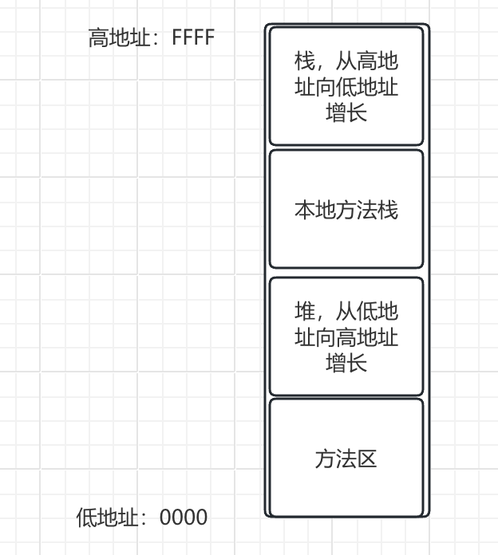
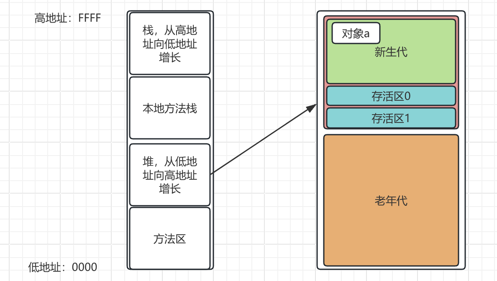
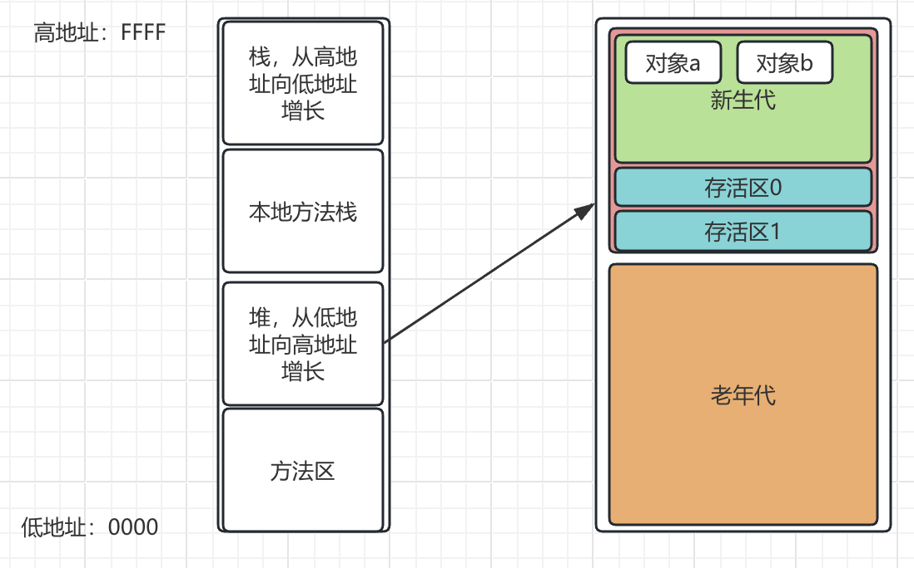
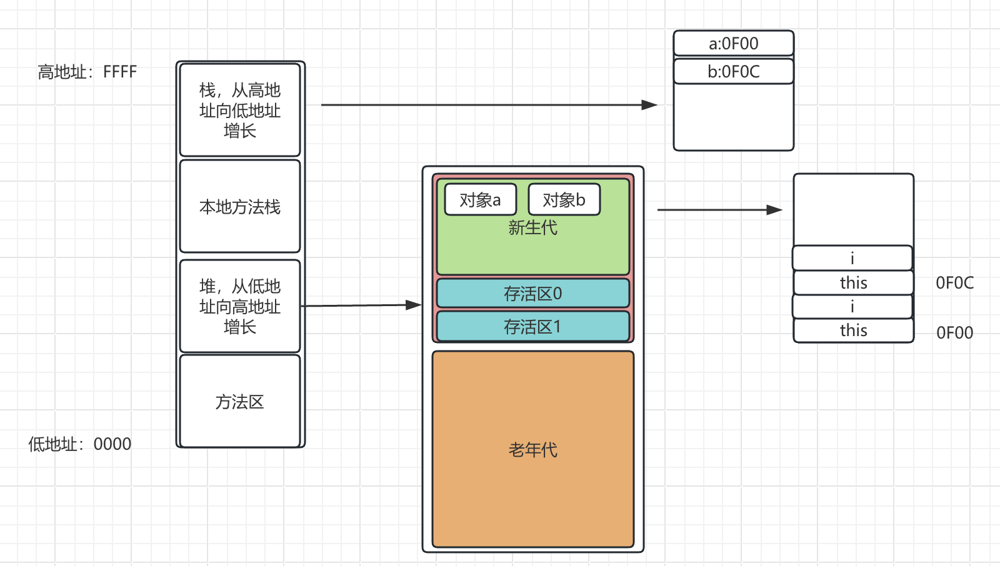
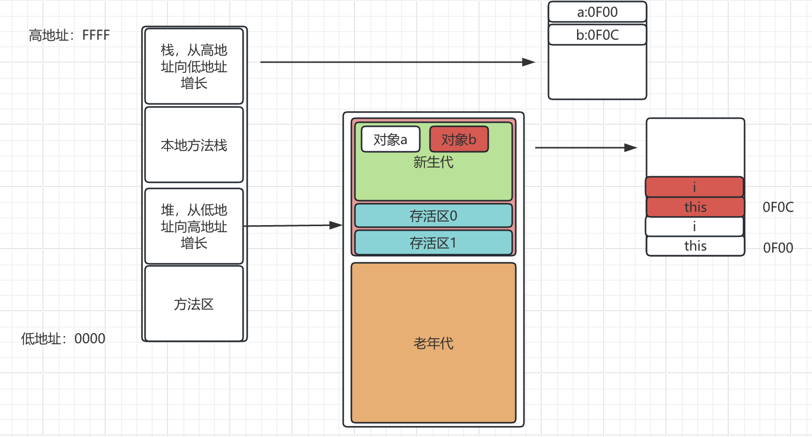
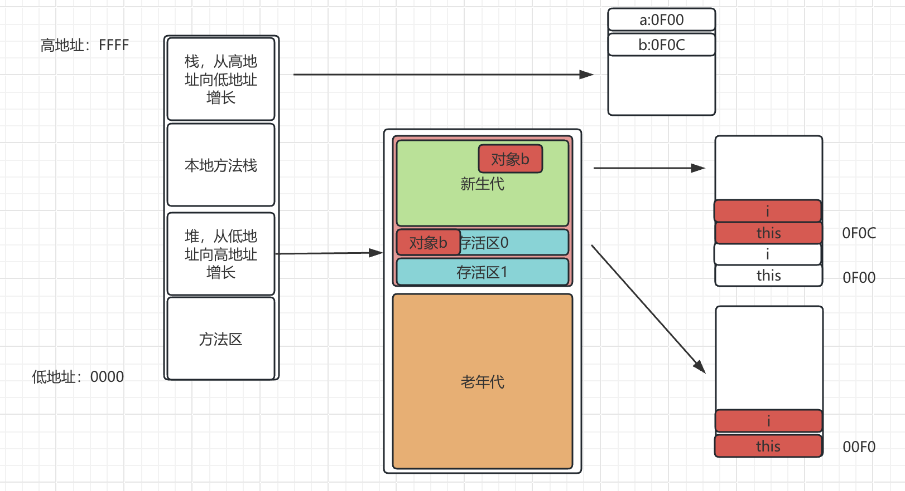
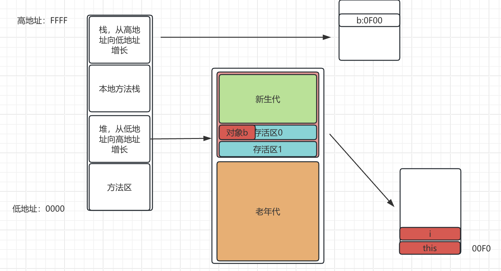
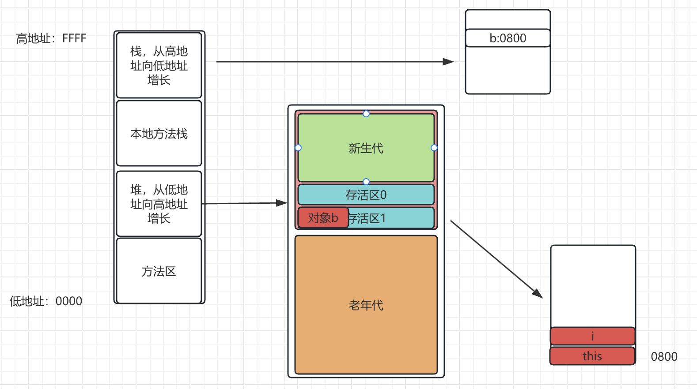
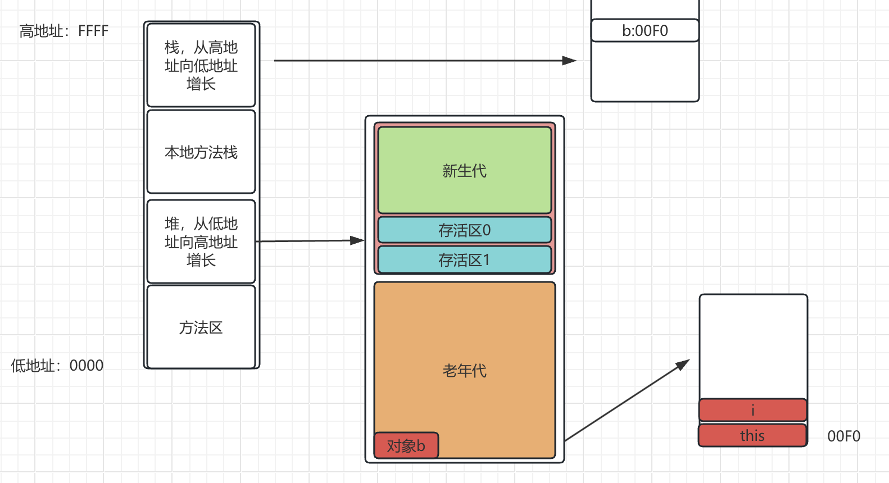
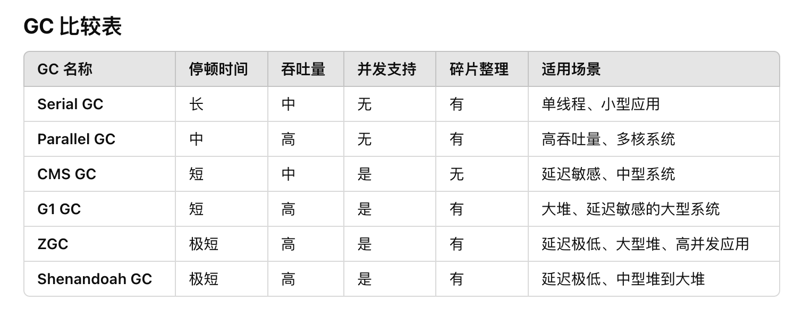

# java

## JVM

### jvm基础知识

什么是JVM,这个大家应该都知道，就是java虚拟机，全称`java vitual mechainm`。

既然是虚拟机，自然要仿照正常电脑运行，要有内存模型，就跟电脑虚拟内存一样，要有指令集，也就是字节码。

### java字节码

Java bytecode由单字节的指令组成，类似汇编，java使用了200多个操作码

- 栈操作指令
- 程序流程控制指令
- 对象操作指令
- 算术运算以及类型转换指令

javap可以看到字节码文件
```java
javap -c -verbose ...
```

astore_1 代表store 本地变量表的slot 1，a代表引用类型。istore代表int store。

算数操作
- iadd：栈顶两个int类型数值相加，并将结果压入栈顶。
- isub：栈顶两个int类型数值相减。
- imul：栈顶两个int类型数值相乘。
- idiv：栈顶两个int类型数值相除。
- iinc：对局部变量表中的int类型变量自增或自减。

类型转换
- i2f：将int类型转换为float类型。
- f2i：将float类型转换为int类型。
- i2b：将int类型转换为byte类型。
- i2c：将int类型转换为char类型。

方法调用指令
- invokestatic: 调用静态方法
- invokespecial: 用来调用构造函数，或同一个类中的private方法，以及超类方法
- invokevirtual: 调用公共，受保护和package级的私有方法类似c的虚函数
- invokeinterface: 调用接口方法
- invokedynamic: lambda实现基础
- new 创建对象
- getfield: 获取对象的实例字段
- putfield: 设置对象的实例字段

栈操作指令
- pop：将栈顶的一个数值弹出（丢弃）。
- dup：复制栈顶的一个数值。
- swap：交换栈顶的两个数值。

条件跳转指令
- if_icmpeq：如果栈顶两个int值相等，则跳转。
- if_icmpne：如果栈顶两个int值不相等，则跳转。
- goto：无条件跳转到指定位置。
- tableswitch：根据值选择跳转位置，用于switch语句。

同步指令
- monitorenter：进入同步代码块。
- monitorexit：退出同步代码块。


### JVM类加载器

引导类加载器
- 引导类加载器是最顶层的类加载器，负责加载 Java 核心库中的类（例如 java.lang.* 包中的类）。这些类一般位于 JRE 目录下的 rt.jar 文件中。
- 它是由 C++ 编写的，直接由操作系统加载，因此没有 Java 类的实现。
- 它默认从 JRE/lib 路径下加载类。

扩展类加载器
- 扩展类加载器负责加载 Java 扩展库中的类。这些类通常位于 JRE/lib/ext 目录下，或者由 java.ext.dirs 系统属性指定的其他路径。
- 它是由 Java 编写的，属于标准的类加载器。
- 它默认从 JRE/lib/ext 目录和 java.ext.dirs 属性指定的路径加载类

系统类加载器
- 系统类加载器负责加载应用程序的类，也就是由用户编写的类。它通常从类路径（classpath）中加载类。
- 它是由 Java 编写的，通常是 ClassLoader 类的一个实例。用户可以指定 classpath 来告诉系统类加载器从哪里加载类。
- 它根据环境变量 CLASSPATH 或 -cp 命令行参数指定的路径加载类。

自定义类加载器
- Java 还允许程序员创建自定义类加载器，来自定义类加载的行为。自定义类加载器可以扩展 ClassLoader 类并重写其 findClass() 方法，来实现从不同的数据源加载类，比如从数据库、网络等加载类。
- 自定义类加载器在很多场景中有用，比如在应用服务器中动态加载插件，或者从不常规的源（如数据库、网络等）加载类。

类的生命周期
- 加载： 找class文件，类加载器通过 findClass() 方法从指定的位置查找 .class 文件。加载器会将 .class 文件转化为二进制字节流。
- 验证： 验证格式，依赖。验证阶段确保加载的 .class 文件格式正确，并且不包含任何有可能危害虚拟机安全的代码。
- 准备： 静态字段，方法表。准备阶段分配内存并为类变量（静态字段）设置默认值（如 0、null 等）。
- 解析： 符号解析为引用。解析阶段将类中的符号引用（例如字段、方法、类的名字等）解析为实际的内存地址或方法引用。
- 初始化： 构造器，静态变量赋值，静态代码块。初始化阶段是类加载过程的最后一步，它会执行类的静态初始化块（static 块）和静态字段的初始化。
- 使用
- 卸载


JVM 中的类加载器采用了父子委托机制（Parent Delegation Model）。当一个类加载器收到加载某个类的请求时，它不会直接去加载类，而是首先将请求委托给父类加载器。如果父类加载器无法加载，则再由当前加载器进行加载。这种机制的好处是可以保证 Java 核心类库不会被用户定义的类覆盖。

### JVM内存模型

内存模型，这里是重点，如何理解内存模型。内存模型主要其实就是栈、堆、方法区。
- 栈：包括java线程栈，每个线程有自己的栈，主要存储局部变量。本地方法栈，就是调用一些c++代码之类的，非java代码用的。所谓的调用栈其实就是栈的一个使用列表。
- 堆：堆里面存放的是动态数据，通常就是`new`出来的就放在堆里。
- 方法区：既不是局部变量，也不是new出来的动态数据，就是存储常量，静态变量，全局变量之类的。

java栈
- 线程私有：存储线程的本地变量信息等
- 每个线程在执行方法时，都会在栈中创建一个栈帧（stack frame）。栈帧包含方法的局部变量、操作数栈、动态链接、方法返回地址等信息。栈的大小通常由 -Xss 参数进行控制。
- 局部变量的作用范围仅限于当前方法，存储在栈帧中。 

本地方法栈
- 用于执行本地方法（即通过 JNI 调用的 C/C++ 等语言编写的代码）。和 Java 栈类似，本地方法栈也包含栈帧，但栈帧里存储的是本地方法的相关信息。
- 每个线程有自己的本地方法栈。

java堆
- 共有
- 存储动态信息，如对象数据，包括对象的成员变量，成员函数，静态变量。因此多线程访问堆中的数据时需要进行同步，以保证数据的一致性和可见性。
- 堆是垃圾回收的主要区域。
- 垃圾回收器负责堆内存的管理，通过标记清除、复制回收、分代回收等算法来回收无用对象的内存。

方法区
- 方法区用于存储类信息、常量、静态变量、即时编译器（JIT）编译后的代码等数据。在 Java 7 之前，方法区和永久代（PermGen）是一个概念，但在 Java 8 中，永久代被 Metaspace（元空间）替代，Metaspace 位于本地内存中，而非堆中。
- 方法区是所有线程共享的，因此多线程访问时也需要注意同步。
- 存储类的元数据（类的结构、常量池等）、静态变量、方法等。

运行时常量池
- 运行时常量池是方法区的一部分，用于存储编译期间生成的字面量和符号引用（例如字符串常量和类、方法、字段的引用）。
- 常量池是所有线程共享的，所有类共享相同的常量池。

直接内存
- 直接内存并不是 JVM 内存模型的一部分，但它是通过 java.nio 包提供的 ByteBuffer 类实现的内存区域。直接内存可以绕过 JVM 的堆和垃圾回收机制，直接与操作系统的内存交互，用于提高 I/O 性能。
- 直接内存可以由多个线程共享，但需要开发者手动管理。

那么这些都是逻辑上的，如何映射到内存中呢？首先，内存可以理解为一个巨大的连续的数组空间。看下图。栈在最顶上，往下增长，堆在最下面，往上增长，中间是本地方法栈，如果堆增长到本地方法栈了，那么堆就满了，栈也一样。



堆内存。堆里的东西都是new出来的，放在c++里面就是需要手动delete的，当然了，现代c++也可以通过其他的来自动delete。而java则是通过垃圾回收来自动delete。所以java为了方便自动回收，就在堆里面又划分了年轻代，老年代，年轻代里面还细分了新生代，存活区。
- 年轻代：占1/3
  - 新生代：占年轻代的8/10
  - 存活区： 一般有两个，每个占1/10
- 老年代：占2/3

示例代码如下
```java
class Main{
  public void function main() {
    {
      A a = new A();
    }
    A b = new B();
    Thread.Sleep(10000);
  }
}

class A{
  private int i;
}

```

一开始，老年代和存活区全部是空的，当第一个对象a创建的时候，会出现在年轻代。如下图



接下来对象b创建，对象b也进入年轻代。如下图



从内存上看，则如图所示，栈中存储变量a和变量b，内容分别是0F00,0F0C，指向堆中两个对象的地址。堆中对象里面有一个隐含的this变量和一个变量i。



接下来执行第一次GC，也可以说是yongGC。首先标记存活对象b，对象a将别回收，因此不标记。



接下来将对象b复制到存活区0。



最后删除新生代和存活区1的内容。这个时候对象a也就被删除了。



第二次GC，假设对象b还可以存活，那么对象b将移动到存活区1，然后清空新生代和存活区0。



如果经过多次GC,默认是15次，那么对象b就会移动到老年代。



接下来在进行yongGC就和对象b没有关系了，只有进行oldGC或者FullGC才有关系。

非堆
- 元数据：以前是永久代
- CCS: 存放class信息，和元数据有交叉
- code cache: 存放JIT编译后的本地机器代码

可见性
- 当多个线程访问同一个共享变量时，一个线程对变量的修改可能对其他线程不可见。JMM 规定了变量的可见性，确保一个线程对共享变量的修改能够及时地被其他线程看到。
- 通过 volatile 关键字、锁（如 synchronized 或 ReentrantLock）以及 final 关键字来保证变量的可见性。

原子性
- 原子性保证某些操作在执行时不被中断。JMM 的目标之一是确保对某些变量的操作是原子的。例如，增加操作（i++）并不是原子操作。
- JMM 通过锁、synchronized 块、java.util.concurrent 包中的并发类（如 AtomicInteger）来保证原子性。

有序性
- 指令重排序可能导致执行顺序和程序代码中的顺序不一致，尤其是在多核 CPU 环境中。JMM 规定了操作的执行顺序。
- Java 提供了 volatile 关键字来防止指令重排序，在同步块中通过 synchronized 保证指令的顺序性。此外，java.util.concurrent 包中的类（如 CountDownLatch、CyclicBarrier 等）也帮助确保线程间的顺序性。

Happens-Before 原则。JMM 使用 happens-before 规则来确保内存操作的有序性。它描述了操作之间的相对顺序，确保前一个操作对后一个操作的可见性和顺序性。常见的 happens-before 规则有：
- 在同一个线程中，代码的执行顺序是按程序顺序进行的。
- 对于 volatile 变量的写操作，发生在后续对该变量的读操作之前。
- 在 synchronized 代码块的释放锁之前的所有操作，都会发生在锁被获得之后。

### JVM启动参数

-开头是标准参数，如-server
-D设置系统属性，如-Dfile.encoding=UTF-8
-X开头是非标准参数，基本都传给JVM的，默认JVM实现这些参数的功能。可以jvm -X查看支持的参数。如-Xmx8g
-XX开头是非稳定参数，专门控制jvm的行为，根具体的jvm实现有关
  - -XX:+-Flags形式，+-是对布尔值进行开关。+代表开，-代表关。如-XX:_UseG1GC
  - -XX:key=value形式，指定某个选项的值.如-XX:MaxPermSize=256m

### GC

分代假设：大部分新生对象很快无用，存活较长时间的对象，可能存活更长时间。经历了15次GC还存在的就放在老年代.新生代80%，S0,S1各10%新生代到存活区是复制，到老年代是移动。

-XX: +MaxTenuringThreshold=15 表示15次后放到老年代。

可以做为GC ROOT的对象
1. 当前正在执行的方法里的局部变量和输入参数
2. 活动线程
3. 所有类的静态字段
4. JNI引用

#### Serial GC/ParNewGC

-XX: +UseSerialGC开启

对年轻代使用mark-copy算法，对老年代使用mark-sweep-compact算法

串行GC不能并行处理，所以触发全部暂停(STW)

ParNewGC可以配合CMSGC使用

适用场景：
- 单线程应用或资源有限的环境（如嵌入式系统）。
- 小型应用，不需要频繁的垃圾回收。

#### Parallel GC

目标是最大化应用程序运行时间（吞吐量），最小化 GC 时间。还是会短暂的暂停业务。需要业务能接受短暂的暂停。

-XX: +UseParallelGC
-XX: +UseParallelOldGC

年轻代和老年代GC都会触发STW事件。

对年轻代使用mark-copy算法，对老年代使用mark-sweep-compact算法

-XX: ParallelGCThreads=N 来指定GC线程数，默认值为CPU核心数。

优点：
- 多线程回收显著提高了回收效率，适合多核环境。
- 停顿时间较 Serial GC 短。
- 两次GC之间不消耗系统资源。

缺点：
- GC 停顿仍然是全暂停（STW）。
- 不适合对延迟要求苛刻的场景。

适用场景：
- 需要高吞吐量的大型后台任务（如批处理、数据分析）。
- 多核 CPU 环境。

#### CMS GC

-XX: +UseConcMarkSweepGC

对年轻代使用STW的mark-copy算法，对老年代主要使用并发的mark-sweep算法

设计目标:专为老年代设计，目标是最小化 GC 停顿时间。
1. 不对老年代进行整理，而是使用空闲列表来管理内存空间的回收
2. 在mark-and-sweep的工作和业务线程并发执行。

默认并发线程数等于CPU核心数的1/4

6个阶段
1. 初始标记
2. 并发标记
3. 并发预清理
4. 最终标记
5. 并发清楚
6. 并发重制

MaxHeapSize是系统的1/4内存
MaxNewSize是MaxHeapSize的1/3
NewSize是系统的1/64

优点：
- 只有yongGC暂停业务。GC 停顿时间短，适合延迟敏感的应用。
- 并发回收利用多核资源减少 STW 时间。

缺点：
- 内存碎片化：CMS 不会整理内存，可能导致分配大对象失败（触发 Full GC）。
- CPU 开销较高：并发阶段可能与用户线程争抢资源。
- 容易产生 "Concurrent Mode Failure"：若老年代空间不足，回退到 Serial GC。

适用场景：
- 延迟敏感的应用（如 Web 服务、在线交易系统）。
- 多核环境下的中大型应用。

#### G1 GC
分区堆内存：将堆划分为若干独立的固定大小的区域（Region），每个 Region 可充当年轻代、老年代或其他用途。混合回收：通过优先回收包含最多垃圾的 Region（Garbage-First）。并行和并发回收：减少 STW 时间。内置碎片整理机制，避免了 CMS 的碎片化问题。一般一个Region是1M。一部分 Region 保留为 Humongous（H） 区，用于存储超过单个 Region 大小一半的巨型对象。


-XX: +UseG1GC -XX: MaxGCPauseMillis=50

将STW的时间和分布变成可预期和可配置的，可设置某项特定的性能指标，为了达成可预期的指标，有独特的实现。增量方式，每次处理一部分，称为回收集合，每次处理所有的年轻代和部分老年代。能看到哪个块的垃圾多，优先回收他们

处理步骤
1. 年轻代模式转移暂停
2. 并发标记
3. 转移暂停：混合模式

G1GC可能退化成串行GC
1. 并发模式失败：增加堆大小
2. 晋升失败：
3. 巨型对象分配失败：增加内存或增大Region大小


优点：
- 减少内存碎片化。
- 更好地控制 GC 停顿时间，可通过 -XX:MaxGCPauseMillis 调整。
- 自动调节年轻代和老年代的大小。

缺点：
- 实现复杂，配置选项多。
- 内存占用较高，CPU 开销大。

适用场景：
- 需要低延迟的中大型应用。
- 堆内存较大的环境（如 >4GB）。
- 替代 CMS 的推荐选择。

Mixed GC
- 老年代内存使用率达到一定阈值（默认 45%，可通过 -XX:InitiatingHeapOccupancyPercent 调整）。
- 同时回收年轻代和部分老年代。
- 执行
  - 标记 GC Roots 直接引用的对象。
  - 并发扫描老年代，标记存活对象。
  - 处理标记期间新产生的引用变化。
- 根据垃圾优先（Garbage-First）的原则，优先选择包含最多垃圾的 Region。


#### ZGC

专注于低延迟，目标是将 GC 停顿时间控制在 10ms 以下。支持非常大的堆内存（TB 级）。使用多线程并发回收，避免长时间的 STW。基于标记-整理算法，避免内存碎片化。使用指针染色（Pointer Coloring）来实现并发标记和引用更新。

-XX: +UnlockExpermentalVMOptions
-XX: +UseZGC
-XX: -Xmx16g

优点：
- 极低的 GC 停顿时间。
- 支持超大堆，扩展性好。
- 减少内存碎片。
- 与G1相比，应用吞吐量下降不超过15%

缺点：
- 内存占用较高：由于需要染色指针和写屏障。
- 不适合资源紧张的环境。

-XX: +UseShenandoahGC

立项比ZGC早，暂停时间与堆大小无关

适用场景：
- 延迟敏感的大型应用（如金融交易、高并发系统）。
- 超大堆应用（TB 级别内存）。

#### Shenandoah GC

目标是极低延迟，尽可能减少 STW 时间。采用并发压缩技术（Concurrent Compaction），避免碎片化问题。大部分回收工作与应用线程并发执行。

优点：
- GC 停顿时间低。
- 内存整理避免碎片化。
- 对堆内存的需求比 ZGC 更低。

缺点：
- 较新的 GC，生态和调优支持可能不如 G1 和 ZGC。
- CPU 开销高。

适用场景：
- 延迟敏感的应用。
- 中大型堆内存的场景。

#### GC总结

从GC的发展历史来看，目标是两个
1. 尽可能减少停顿时间，不影响业务。
2. 尽可能减少GC时间，让GC更快。

基本上G1 GC是通用的，如果条件允许上ZGC或Shenandoah。JDK8的默认GC是Parallel GC，JDK9后一直都是G1 GC。从这里也能看出G1 GC性能更好。更通用。



1. 如果系统考虑吞吐优先，CPU资源用来处理业务，用Parallel GC
2. 如果系统考虑低延迟优先，每次GC时间尽量短，用CMS GC
3. 如果系统内存堆大，平均GC时间可控，使用G1 GC
