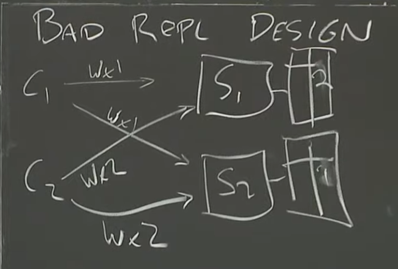

> 大家好，我是大头，职高毕业，现在大厂资深开发，前上市公司架构师，管理过10人团队！
> 我将持续分享成体系的知识以及我自身的转码经验、面试经验、架构技术分享、AI技术分享等！
> 愿景是带领更多人完成破局、打破信息差！我自身知道走到现在是如何艰难，因此让以后的人少走弯路！
> 无论你是统本CS专业出身、专科出身、还是我和一样职高毕业等。都可以跟着我学习，一起成长！一起涨工资挣钱！
> 关注我一起挣大钱！文末有惊喜哦！

> 关注我发送“MySQL知识图谱”领取完整的MySQL学习路线。
> 发送“电子书”即可领取价值上千的电子书资源。
> 发送“大厂内推”即可获取京东、美团等大厂内推信息，祝你获得高薪职位。
> 发送“AI”即可领取AI学习资料。

# MIT6.824

你在尝试构建分布式系统之前，应该先尝试单机系统，如果能满足的话不要搞分布式。

因为单机系统比分布式简单的多。

分布式的原因是需要获得更高的性能、某种并行性、大量的CPU、大量的内存、大量的磁盘。另一个原因是容忍故障，一个机器挂了还有别的机器提供服务。
还有些可能是自然的物理分布式，比如银行多个地方的转账。还有安全性，可以隔离出环境运行代码。来保证主环境的安全。

分布式系统的挑战
- 并发性
- 部分故障
- 性能

本课程的目标是构建面向应用程序的基础设施：
- 存储
- 网络通信
- 计算

> 主要目的为抽象这些能力给外部应用提供接口，隐藏内部的分布式实现。

一些已有的实现示例：
- RPC：隐藏了通信能力
- Thread：隐藏了多核操作系统的并发能力

构建分布式系统的`高层次`的目标，这也解释了为什么构建分布式系统很难：
1. 可扩展性（）：系统的横向扩展能力，理想情况是加n台机器可以获得n台机器的性能。
2. 容错性（Fault Rable）：
    - 可用性：系统的高可用能力，如果有多个机器的话，当一个机器挂了，还有其他机器可以提供服务，保证系统可用。
    - 故障恢复性：当故障恢复以后，系统可以和故障恢复之前一样运行，没有数据损失等。可以通过`复制`的能力实现，存储多个数据副本。
3. 一致性（Consistency）：语义是当put(k,v)以后，一定会get(k)能得到v。但是对于分布式系统来说这是不一定的。
    - 强一致性
    - 弱一致性

## MapReduce

最开始是Google提出的MapReduce，这篇论文可以追溯到2004年。有兴趣的可以阅读这个论文：http://nil.csail.mit.edu/6.824/2020/papers/mapreduce.pdf

当时Google面临的问题是要对数TB的数据进行计算。因为他们要从海量的数据中找出优先级最高的页面展示出来。

他们迫切的希望用数千台计算机来共同完成，来加速这个工作，而不是用一台计算机独立完成。

MapReduce希望开发者只需要编写`Map`函数和`Reduce`函数，其他的交给MapReduce框架来做。将这些函数放到无数的计算机上执行。

核心思想：将输入分成多份，产生多个输入。并对每个输入调用Map函数。

### Map

Map函数将输入内容进行处理，输出一组key=>value结构。你可以把 Map 理解成`分类处理`的过程。

示例1：Map将从输入中统计每个英文字母出现的次数。

```
Input1 => Map => 输出：a:1, b:2, c:0
Input2 => Map => 输出：a:0, b:1, c:1
Input3 => Map => 输出：a:1, b:0, c:0
```

简化的Map函数如下：
Map函数接收两个参数，k是文件名称，v是文件内容
```java
split file // 拆分文件内容
Map(k, v){
    // 循环输出每个字母
    for(w:words) {
        //3. 输出格式同样是k=》v，k是字母，v是出现次数。
        // emit函数是输出函数，由MapReduce框架提供
        // 为什么输出1？因为是简单的计数，每个字母出现1次
        emit(w,1);
    }
}

// 实际输出结果：a:1, b:1, b:1
```

### Reduce

对 `Map` 阶段产生的键值对，按 `key` 分组并聚合处理，得到最终的结果。

你可以把 `Reduce` 理解成`对同一类的东西做总结`的过程。

而Reduce函数同样接收输入，在这个示例中，我们的Reduce函数可以接收某一个字母和出现的次数做为输入，输出总的出现次数。比如：

```
Input1 (a:1, a:0, a:1) => Reduce => 输出：a:2
Input2 (b:2, b:1, b:0) => Reduce => 输出：b:3
Input3 (c:0, c:1, c:0) => Reduce => 输出：c:1
```

简化的Reduce函数如下：
Reduce函数同样接收文件做为输入。
```java
// reduce函数的输入，k是用来聚合的key，在这里，这个k就是字母，可能是a,b,c。对于计算来说，用不到这个k，v是map输出的值的list。
// 比如a:1, a:0, a:1, k是a, v是[1,1]
Reduce(k, v) {
    // 直接输出计数即可 因为list的长度就是计数，这是因为每个值都是1.
    emit(len(v));
}
```

这样就计算出了所有输出中，abc三个字母出现的次数。

最妙的设计在于，按照上述的例子，我们可以部署6个机器来同时完成任务。

而且，对于Map和Reduce函数来说，优点有两个：
1. 逻辑简单，仅仅是简单的计算逻辑。因此运行速度快
2. 可以方便的横向扩展。

最关键的点在于
```
程序员只需关心逻辑，不用操心分布、容错、调度等复杂细节
```

### 整体执行流程

[执行流程图片]

1. 输入数据被分片（Split）
- 原始的大数据（比如 1TB 的日志）被切分成多个小片（通常 64MB 或 128MB 一片）。
- 每个数据片（split）会由一个 Map Task 处理。

👉 比喻：像把一本厚书分成一页一页，由多个读者同时阅读处理。

2. Map 阶段执行（并行执行）

- 系统在多台机器上启动多个 Map Worker，每个负责一个 split。
- 每个 Map Worker：
    - 读取数据片
    - 执行用户定义的 Map() 函数
    - 输出一组键值对 (key, value)
    - 把输出缓存在本地磁盘上，并根据 key 做分区（为接下来的 Reduce 做准备）

👉 比喻：每位工人处理一摞原材料，并将成果放入不同颜色的桶（按 key 分类）。

3. 分区与 Shuffle（洗牌阶段）
- 系统自动将所有 Map 的输出，按 `key` 分发给不同的 `Reduce Worker`。
- 这个过程称为 `shuffle`，是 `MapReduce` 的核心。
- Reduce Worker 从各个 Map Worker 取自己负责的那一部分 key。

👉 比喻：每个桶被送到对应的收集员手里，收集员只关心自己那种颜色的桶。

4. Reduce 阶段执行

每个 Reduce Worker：
- 接收所有属于自己负责 key 的 (key, [value list])
- 执行 Reduce() 函数，输出最终结果

👉 比喻：每个收集员把收到的同一类物品合并、统计或总结。

5. 结果输出

- Reduce 结果被写入分布式文件系统（如 GFS 或 HDFS）
- 每个 Reduce Worker 写一个文件，形成最终的输出集合。

 6. 容错机制（Fault Tolerance）

- MapReduce 最大的优势之一是它对机器故障有强大容错支持：
- 任务失败了？——Master 会把任务重新分配给另一台机器。
- 机器宕机？——系统检测心跳超时，把任务转移。

`Reduce` 不会从内存里读数据，而是从 `Map` 的本地磁盘拉，这样更安全。

👉 比喻：如果一个工人累了/走了，另一个人接手继续干，不影响整体结果。

### 容错机制

这是 `MapReduce` 的亮点之一，它自动处理各种失败情况：

🧯 Map 或 Reduce 任务失败
    - Worker 崩了？任务失败？
    - ✅ Master 重新调度任务，由其他空闲 Worker 重做

💀 Worker 节点宕机
    - Master 检测不到心跳信号（比如 10 秒没回应）
    - ✅ 所有该节点上的任务都会被视为失败，重新调度

📉 Reduce 不会因为 Map 崩了而挂掉
    - 因为 Map 的中间结果会写入磁盘，且 Reduce 是拉数据

| 优化点                    | 说明                                                            |
| ---------------------- | ------------------------------------------------------------- |
| **数据本地性**              | 尽量将 Map 任务调度到数据所在的机器，减少网络传输                                   |
| **备份任务**（Backup Tasks） | 在任务快结束时，为剩余最慢的任务启动副本，避免尾部拖慢整个任务（称为“**straggler mitigation**”） |
| **流水线执行**              | Reduce Worker 可以在 Map 未完全结束时，开始拉部分数据                          |

| 特性                  | 好处             |
| ------------------- | -------------- |
| 主从架构（Master/Worker） | 易于调度和管理        |
| 本地磁盘缓存中间结果          | 提高容错性和效率       |
| Shuffle 自动进行        | 程序员无需处理网络传输    |
| 容错机制完备              | 任意节点失败不会影响整体任务 |
| 自动调度和重试             | 解放程序员双手        |

### 性能

🧪 案例1：构建倒排索引（Inverted Index）
🌟 应用背景：
Google 搜索引擎需要知道每个词在哪些网页中出现。这个操作就叫“构建倒排索引”。

📦 处理规模：
- 输入数据：约 20TB（网页内容）
- Map 任务数：1万个
- Reduce 任务数：2千个

⏱ 执行时间：
整个任务在几百台机器上并行，只花了几小时

✅ 意义：
传统方式实现这样的任务要花几周甚至几个月，而 MapReduce 能快速完成，还能处理节点故障。

🧪 案例2：分析网页连接图（PageRank 计算）
🌟 应用背景：
PageRank 是 Google 搜索排名的核心算法，需要处理整个互联网的网页链接关系。

📦 处理规模：
- 输入数据：超过 1TB 的链接图
- 运行多个 MapReduce 迭代（每一轮都读取+写入）

⏱ 执行时间：
单轮耗时在几十分钟到几小时之间，取决于迭代次数

✅ 意义：
MapReduce 适合这种需要反复运行、聚合中间结果的图算法。

#### 可扩展性实验

论文还专门做了 实验测试 MapReduce 的可扩展性，结果非常亮眼：

实验设置：
- 任务：排序 1TB 的数据（标准大数据计算任务）
- 测试变量：机器数量（从几十台到几百台）

| 机器数量  | 执行时间    |
| ----- | ------- |
| 100 台 | \~60 分钟 |
| 200 台 | \~35 分钟 |
| 400 台 | \~20 分钟 |

✅ 说明：机器数量翻倍 → 执行时间几乎减半
这叫做“近线性扩展性”，是分布式系统性能的理想状态。

#### 容错能力实验

论文还测试了在有机器故障的情况下系统能否稳住：

实验方法：
- 在运行中故意杀掉部分 Worker
- 查看任务是否恢复 + 时间是否增加很多

结果：
- 系统能成功恢复失败任务
- 整体执行时间仅略有增加（因为失败重试带来小延迟）

✅ 意义：说明 MapReduce 的容错机制在实践中可靠，不会因为单点失败拖垮整个任务。

#### 一些优化细节

| 优化策略                 | 效果                      |
| -------------------- | ----------------------- |
| 本地性调度（Data Locality） | 避免 Map 任务跨机器读取数据，减轻网络负担 |
| Map 输出写入本地磁盘         | 避免 Reduce 拉取失败，提高稳定性    |
| Backup Task（备份任务）    | 减少 straggler 影响，加快尾部执行  |
| Reduce 端部分排序         | 避免 Reduce 端内存爆炸，提高聚合效率  |

#### 小结：为什么 MapReduce 性能优秀？

| 方面     | 优势               |
| ------ | ---------------- |
| 并行计算   | 成千上万台机器并发执行任务    |
| 任务分片合理 | 拆成很多小任务，调度灵活     |
| 自动容错   | 节点失败不会拖垮任务       |
| IO 优化好 | 避免不必要的网络流量       |
| 扩展性强   | 机器越多，速度越快，效率不降反升 |


### 经验

1. 编程模型简单但表达力强
作者观点：
> MapReduce 的接口非常简单（就两个函数：Map() 和 Reduce()），但几乎可以表达大部分并行数据处理逻辑。

实际例子：
- 排序、去重、合并日志
- 构建索引、计算网页权重、图处理
- 数据挖掘任务如聚类、统计分析

🧠 体会：
你不需要了解线程、锁、通信协议这些“硬核分布式知识”，也能写出能在几千台机器上跑的大数据程序。

2. 对“失败”高度容忍是必须的
作者观点：
> 在几百上千台机器上运行任务，机器故障是常态，不是例外。系统设计要“默认它会失败”。

做法：
- Map/Reduce Task 自动重试
- Master 负责监控和再调度
- 中间结果写磁盘、持久化，方便恢复

🧠 体会：
不要去“防止失败”，要“拥抱失败”，让失败变得对用户透明，这才是工业级分布式系统。

3. 数据本地性是性能关键
作者观点：
> 尽量把计算调度到数据所在机器，可以显著减少网络压力。

原因：
- 在 Google 文件系统（GFS）中，数据有副本
- Master 可以根据副本位置，把 Map 任务调到数据“身边”

🧠 体会：
在分布式系统中，“移动计算”比“移动数据”更高效

4. Straggler 问题是真实存在的
作者观点：
> 在成百上千个任务中，总会有几个“掉队者”（straggler），它们可能因为磁盘慢、CPU 抢占等原因拖慢整个作业。

解决方案：
- 启动 Backup Task（备份任务）
- 哪个先完成就用哪个，放弃另一个

🧠 体会：
在大规模并发中，整体速度由“最慢的少数人”决定（这就是“长尾延迟”问题）

5. 开发调试工具非常重要
作者观点：
> 运行成千上万个任务后，你很难靠肉眼看日志找问题，需要专门的 监控与调试工具。

Google 实践：
- 为每个任务生成详细的 web 页面
- 可以追踪任务状态、失败原因、数据流向
- 所有任务的标准输出也会被收集并存档

🧠 体会：
好的工具不仅能“看见”问题，更能“预防”问题。

6. 通用性强，支持跨部门复用
作者观点：
> 最开始 MapReduce 是为构建索引设计的，后来被应用于：

- 日志分析
- 机器学习数据预处理
- 图结构计算
- 分布式 Grep、排序、压缩
- 多语言支持（C++、Java、Python 等）

🧠 体会：
一个简单的思想，配上良好封装与容错机制，就能成为全公司的“生产力工具”

✅ 最后，作者对读者说了什么？
他们希望告诉大家：

> “MapReduce 的核心思想是抽象：程序员只需要关注如何写 Map 和 Reduce，不需要去处理分布式的复杂性。”

这种思想不仅影响了后来的 Hadoop/Spark/Flink，也启发了很多 “让人类专注业务逻辑，其余交给系统” 的工程思维。

总结：
| 教训/反思           | 含义              |
| --------------- | --------------- |
| 简单接口胜过复杂灵活      | 简单更易学更普及        |
| 容错不是加上去的，是设计进来的 | 面向失败编程          |
| 调度比你想象的重要       | 数据本地性和长尾问题会拖垮系统 |
| 工具让大规模系统可维护     | 千万别忽视监控、调试界面    |
| 通用性不是副产物，是目标    | 抽象设计时就考虑不同场景    |

### 和其他的对比

🧭 MapReduce 提出前，世界在干什么？
在 MapReduce 出现之前，**“处理海量数据”**是非常痛苦的事情，常常需要：
- 自己手写分布式代码（多线程、RPC、容错逻辑）
- 手动分片、调度、失败重试
- 大量系统调优

也就是说：门槛高、出错多、效率低。

🧓 1. 前辈系统（先驱者）
MapReduce 借鉴并超越了很多已有的系统。作者提到了几个重要的前辈：

🧱 Parallel Databases（并行数据库系统）
比如：Teradata, Gamma, Volcano

- 通过 SQL 自动并行执行、查询优化

但局限性明显：
- 灵活性低，只适合结构化数据
- 编程模型不够通用（不能表达复杂业务逻辑）
- 扩展性不足（难以横向扩展到上千台机器）

MapReduce 与之不同：

- 不需要预定义 schema
- 可处理任意数据（文本、图像、日志）
- 扩展性和容错机制是核心设计点

🧑‍🔧 Message Passing Systems（消息传递系统）
比如 MPI（Message Passing Interface）
- 程序员手动控制数据传输、任务调度
- 常用于科学计算、模拟类应用

缺点：
- 编程复杂（需要手动处理并发、同步）
- 容错性差（一个节点挂掉，全盘失败）
- 不适合动态大规模分布式系统

MapReduce 优势：
- 自动分发任务与数据
- 自动重试失败任务
- 容错、调度机制隐藏在框架里

🧑‍🏫 2. 编程模型的灵感来源
📚 Lisp、Functional Programming 的 Map 和 Reduce
“Map”和“Reduce”其实来自函数式编程语言 Lisp 的标准操作：
- map(f, list)：对列表中每个元素应用函数 f
- reduce(f, list)：将列表聚合为一个值（如求和）

作者把这个小而美的思想推广到了分布式系统中：
- 把一个“大列表”切成几千块，每块并发 map
- 最后汇总（reduce）各部分结果

创新点在于：

> 不是函数名的新瓶装旧酒，而是加上了调度、分布式运行、容错、持久化、分区等“工程魂”。
> 把“函数式思想”变成了“工业级工具”。

MapReduce 是在 Google 内部“全家桶式架构”中运行的，依赖以下底层支撑：

| 系统                      | 作用                |
| ----------------------- | ----------------- |
| GFS（Google File System） | 存储海量数据块，支持副本、高可用  |
| Bigtable                | 类似 NoSQL 的结构化数据存储 |
| Scheduler + Monitoring  | 提供任务调度与健康监控能力     |

一些其他的系统：

| 系统                   | 简介          | 特点                          |
| -------------------- | ----------- | --------------------------- |
| **Hadoop MapReduce** | Apache 开源实现 | 模仿 Google MapReduce，支持 HDFS |
| **Dryad（微软）**        | 更灵活的数据流图模型  | 支持 DAG，但复杂度也更高              |
| **Spark**            | 更快的内存计算模型   | 适合交互式、大规模迭代任务               |
| **Flink**            | 强实时数据处理     | 支持流+批，语义更强                  |
| **Beam**             | 通用数据处理 API  | 可部署到 Spark/Flink 等系统之上      |

对比：

| 角度        | MapReduce 相比如何？    |
| --------- | ------------------ |
| 与并行数据库相比  | 更灵活、可扩展、面向通用计算     |
| 与消息传递系统相比 | 更易用、具备自动容错         |
| 与函数式编程相比  | 加入工程实现，能在真实集群跑     |
| 与后续系统相比   | 是“大数据系统”的思想源头，影响深远 |

> MapReduce 的贡献不是提出了什么新理论，而是把“分布式计算”这件复杂的事做得像“写两个函数”那么简单，并真正让它在几千台机器上跑起来。

## 为什么这门课要使用GO语言

这门课之前使用过C++进行。

使用GO的原因如下：
1. GO有现成的RPC包，而C++没有。
2. GO有线程和垃圾回收的支持。而C++需要自己管理内存进行垃圾回收。
    - 因此，GO更加安全。
    - GO更加简单。
    - GO更不容易出错。
3. GO更加简单，错误处理也更加容易，C++的错误信息很难看出来是什么错误。

这里指的线程是GO的协程。GO Routine。

线程是分布式最大的难题。

使用线程的原因：
- IO并发：不同的程序可以处于不同的状态。比如A线程在读取磁盘信息，而B线程在执行计算。比如很多线程发送了RPC请求，等待请求响应后进行处理。
- 多核并行性：当遇到大量的计算任务时，使用多线程同时计算会显著提高效率。两个线程会同时运行在不同的CPU上面。
- 便捷性：可能你就是希望在后台执行某些操作，或者定时执行某些操作。比如master用来确认其他的线程的存活状态，定时每秒发送一个请求这样。

事件驱动：除了使用线程以外，还可以使用事件驱动来实现。
- 优点：事件驱动的实现比线程更加高效，更好调试，可以用顺序的方式来编程。
- 缺点：事件驱动只能实现并发性，而不能实现多核的并行性。无法发挥多核性能。
    - 当然了，可以通过在每个核心上启动一个线程来实现事件驱动来发挥多核性能。

线程开发的挑战：
1. 内存共享：多个线程共享同样的内存数据，会产生`数据竞争`。
    - 解决办法1：使用锁，但是这会导致锁开销，还要解决可能得死锁问题。有些内部的数据结构可能并不需要锁，但是你不得不支付锁的开销。这并不总是一个好主意。
    - 解决办法2：使数据不共享。
2. 协调：当我们使用锁的时候，涉及的不同线程可能不知道其他线程的存在，他们只是想不在`任何人干扰`的情况下获取数据。但也有时候，你希望线程知道其他线程的存在，比如一个线程等待另一个线程完成后读取它的数据。
    - 可以使用Channels来通信
    - 使用条件变量来通信
    - 使用Wait Group来通信
3. 死锁：两个线程互相等待对方释放锁。

## GFS(谷歌文件系统)

主要是`Big Storage`大型分布式存储系统。为分布式系统提供底层的存储功能。

将存储的数据放到多个机器上面。

有趣的循环：
- 性能：将数据分散到多个机器上面。通常叫做`分片`。
- 错误：当数据分散到多个机器上面，其中一个机器就有可能宕机，因此需要`容错性`
- 容错性：可以通过存储多个`副本`来解决容错性的问题。
- 副本：存储多个副本又会引入数据`不一致`的问题。
- 一致性：如果需要数据强一致性。又会需要牺牲性能。

### 强一致性

来一个小示例：

对于一个简单的服务器来说，没有分布式的功能。

这个时候两个客户端同时发来了请求。
- C1 写入x的值为1
- C2 写入x的值为2

请问，这个时候服务器的x值应该是多少？
- 答案是不确定。

但是对于后面的所有读请求来说，x的值要么都是1，要么都是2.

对于分布式系统来说，只要能达到这个效果即可。

### 复制版本1（不好的复制设计）

对于最简单的复制来说，就是直接启动两个服务器，S1和S2。

对于所有客户端来说，都分别请求S1和S2进行写入，但是读的时候只读S1.当S1宕机以后读取S2.

这个时候两个客户端同时发来了请求。
- C1 请求S1 写入x的值为1
- C2 请求S2 写入x的值为2
- C1 请求S2 写入x的值为1
- C2 请求S1 写入x的值为2



那么最终，S1存储x的值为2.S2存储x的值为1.也就产生了`数据不一致`。所以这是个最简单但也不好的复制设计。

### GFS架构

GFS将一个文件分成多个`块`，每个块是64MB大小。每个块都可以存在不同的服务器上面。

有一个`主服务器`，主服务器负责分发请求，记录了`文件名称`和`文件块`的映射。

还有多个`块服务器`。块服务器存储了实际的块数据。

主服务器存储了以下数据：
- 文件名称和`chunk handles数组`的映射。也就是每个文件分成了哪些块。这个数据是需要持久化的。
- chunk handles和`chunk servers数组`的映射，也就是每个块存在哪些块服务器上。这是因为每个块都是有副本的，所以是一个服务器数组。并且客户端可以选择最近的服务器进行获取。
- 服务器版本，需要持久化。
- 是否是主服务器。
- 任期结束时间。

#### GFS的持久化

GFS使用`Log`来记录持久化的信息，并通过`check point`来进行辅助。恢复的时候只需要从`check point`恢复就可以了。

其实大多数的存储系统都是这么干的。

#### GFS读取过程

读取过程
- 

## 文末福利

> 关注我发送“MySQL知识图谱”领取完整的MySQL学习路线。
> 发送“电子书”即可领取价值上千的电子书资源。
> 发送“大厂内推”即可获取京东、美团等大厂内推信息，祝你获得高薪职位。
> 发送“AI”即可领取AI学习资料。
> 部分电子书如图所示。


