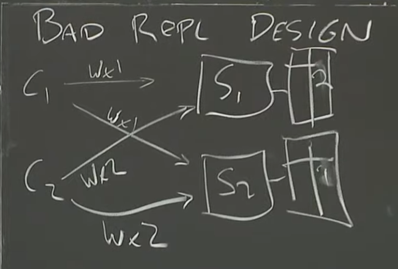

> 大家好，我是大头，职高毕业，现在大厂资深开发，前上市公司架构师，管理过10人团队！
> 我将持续分享成体系的知识以及我自身的转码经验、面试经验、架构技术分享、AI技术分享等！
> 愿景是带领更多人完成破局、打破信息差！我自身知道走到现在是如何艰难，因此让以后的人少走弯路！
> 无论你是统本CS专业出身、专科出身、还是我和一样职高毕业等。都可以跟着我学习，一起成长！一起涨工资挣钱！
> 关注我一起挣大钱！文末有惊喜哦！

> 关注我发送“MySQL知识图谱”领取完整的MySQL学习路线。
> 发送“电子书”即可领取价值上千的电子书资源。
> 发送“大厂内推”即可获取京东、美团等大厂内推信息，祝你获得高薪职位。
> 发送“AI”即可领取AI学习资料。

# MIT6.824

你在尝试构建分布式系统之前，应该先尝试单机系统，如果能满足的话不要搞分布式。

因为单机系统比分布式简单的多。

分布式的原因是需要获得更高的性能、某种并行性、大量的CPU、大量的内存、大量的磁盘。另一个原因是容忍故障，一个机器挂了还有别的机器提供服务。
还有些可能是自然的物理分布式，比如银行多个地方的转账。还有安全性，可以隔离出环境运行代码。来保证主环境的安全。

分布式系统的挑战
- 并发性
- 部分故障
- 性能

本课程的目标是构建面向应用程序的基础设施：
- 存储
- 网络通信
- 计算

> 主要目的为抽象这些能力给外部应用提供接口，隐藏内部的分布式实现。

一些已有的实现示例：
- RPC：隐藏了通信能力
- Thread：隐藏了多核操作系统的并发能力

构建分布式系统的`高层次`的目标，这也解释了为什么构建分布式系统很难：
1. 可扩展性（）：系统的横向扩展能力，理想情况是加n台机器可以获得n台机器的性能。
2. 容错性（Fault Rable）：
    - 可用性：系统的高可用能力，如果有多个机器的话，当一个机器挂了，还有其他机器可以提供服务，保证系统可用。
    - 故障恢复性：当故障恢复以后，系统可以和故障恢复之前一样运行，没有数据损失等。可以通过`复制`的能力实现，存储多个数据副本。
3. 一致性（Consistency）：语义是当put(k,v)以后，一定会get(k)能得到v。但是对于分布式系统来说这是不一定的。
    - 强一致性
    - 弱一致性

## MapReduce

最开始是Google提出的MapReduce，这篇论文可以追溯到2004年。有兴趣的可以阅读这个论文：http://nil.csail.mit.edu/6.824/2020/papers/mapreduce.pdf

当时Google面临的问题是要对数TB的数据进行计算。因为他们要从海量的数据中找出优先级最高的页面展示出来。

他们迫切的希望用数千台计算机来共同完成，来加速这个工作，而不是用一台计算机独立完成。

MapReduce希望开发者只需要编写`Map`函数和`Reduce`函数，其他的交给MapReduce框架来做。将这些函数放到无数的计算机上执行。

核心思想：将输入分成多份，产生多个输入。并对每个输入调用Map函数。

### Map

Map函数将输入内容进行处理，输出一组key=>value结构。你可以把 Map 理解成`分类处理`的过程。

示例1：Map将从输入中统计每个英文字母出现的次数。

```
Input1 => Map => 输出：a:1, b:1, c:0
Input2 => Map => 输出：a:0, b:1, c:1
Input3 => Map => 输出：a:1, b:0, c:0
```

简化的Map函数如下：
Map函数接收两个参数，k是文件名称，v是文件内容
```java
split file // 拆分文件内容
Map(k, v){
    // 循环输出每个字母
    for(w:words) {
        //3. 输出格式同样是k=》v，k是字母，v是出现次数。
        // emit函数是输出函数，由MapReduce框架提供
        // 为什么输出1？因为是简单的计数，每个字母出现1次
        emit(w,1);
    }
}

// 实际输出结果：a:1, b:1, b:1
```

### Reduce

对 `Map` 阶段产生的键值对，按 `key` 分组并聚合处理，得到最终的结果。

你可以把 `Reduce` 理解成`对同一类的东西做总结`的过程。

而Reduce函数同样接收输入，在这个示例中，我们的Reduce函数可以接收某一个字母和出现的次数做为输入，输出总的出现次数。比如：

```
Input1 (a:1, a:0, a:1) => Reduce => 输出：a:2
Input2 (b:1, b:1, b:1) => Reduce => 输出：b:3
Input3 (c:0, c:1, c:0) => Reduce => 输出：c:1
```

简化的Reduce函数如下：
Reduce函数同样接收文件做为输入。
```java
// reduce函数的输入，k是用来聚合的key，在这里，这个k就是字母，可能是a,b,c。对于计算来说，用不到这个k，v是map输出的值的list。
// 比如a:1, a:0, a:1, k是a, v是[1,1]
Reduce(k, v) {
    // 直接输出计数即可 因为list的长度就是计数，这是因为每个值都是1.
    emit(len(v));
}
```

这样就计算出了所有输出中，abc三个字母出现的次数。

最妙的设计在于，按照上述的例子，我们可以部署6个机器来同时完成任务。

而且，对于Map和Reduce函数来说，优点有两个：
1. 逻辑简单，仅仅是简单的计算逻辑。因此运行速度快
2. 可以方便的横向扩展。

最关键的点在于
```
程序员只需关心逻辑，不用操心分布、容错、调度等复杂细节
```

### 整体执行流程

[执行流程图片]

1. 输入数据被分片（Split）
- 原始的大数据（比如 1TB 的日志）被切分成多个小片（通常 64MB 或 128MB 一片）。
- 每个数据片（split）会由一个 Map Task 处理。

👉 比喻：像把一本厚书分成一页一页，由多个读者同时阅读处理。

2. Map 阶段执行（并行执行）

- 系统在多台机器上启动多个 Map Worker，每个负责一个 split。
- 每个 Map Worker：
    - 读取数据片
    - 执行用户定义的 Map() 函数
    - 输出一组键值对 (key, value)
    - 把输出缓存在本地磁盘上，并根据 key 做分区（为接下来的 Reduce 做准备）

👉 比喻：每位工人处理一摞原材料，并将成果放入不同颜色的桶（按 key 分类）。

3. 分区与 Shuffle（洗牌阶段）
- 系统自动将所有 Map 的输出，按 `key` 分发给不同的 `Reduce Worker`。
- 这个过程称为 `shuffle`，是 `MapReduce` 的核心。
- Reduce Worker 从各个 Map Worker 取自己负责的那一部分 key。

👉 比喻：每个桶被送到对应的收集员手里，收集员只关心自己那种颜色的桶。

4. Reduce 阶段执行

每个 Reduce Worker：
- 接收所有属于自己负责 key 的 (key, [value list])
- 执行 Reduce() 函数，输出最终结果

👉 比喻：每个收集员把收到的同一类物品合并、统计或总结。

5. 结果输出

- Reduce 结果被写入分布式文件系统（如 GFS 或 HDFS）
- 每个 Reduce Worker 写一个文件，形成最终的输出集合。

 6. 容错机制（Fault Tolerance）

- MapReduce 最大的优势之一是它对机器故障有强大容错支持：
- 任务失败了？——Master 会把任务重新分配给另一台机器。
- 机器宕机？——系统检测心跳超时，把任务转移。

`Reduce` 不会从内存里读数据，而是从 `Map` 的本地磁盘拉，这样更安全。

👉 比喻：如果一个工人累了/走了，另一个人接手继续干，不影响整体结果。

### 容错机制

这是 `MapReduce` 的亮点之一，它自动处理各种失败情况：

🧯 Map 或 Reduce 任务失败
    - Worker 崩了？任务失败？
    - ✅ Master 重新调度任务，由其他空闲 Worker 重做

💀 Worker 节点宕机
    - Master 检测不到心跳信号（比如 10 秒没回应）
    - ✅ 所有该节点上的任务都会被视为失败，重新调度

📉 Reduce 不会因为 Map 崩了而挂掉
    - 因为 Map 的中间结果会写入磁盘，且 Reduce 是拉数据

| 优化点                    | 说明                                                            |
| ---------------------- | ------------------------------------------------------------- |
| **数据本地性**              | 尽量将 Map 任务调度到数据所在的机器，减少网络传输                                   |
| **备份任务**（Backup Tasks） | 在任务快结束时，为剩余最慢的任务启动副本，避免尾部拖慢整个任务（称为“**straggler mitigation**”） |
| **流水线执行**              | Reduce Worker 可以在 Map 未完全结束时，开始拉部分数据                          |

| 特性                  | 好处             |
| ------------------- | -------------- |
| 主从架构（Master/Worker） | 易于调度和管理        |
| 本地磁盘缓存中间结果          | 提高容错性和效率       |
| Shuffle 自动进行        | 程序员无需处理网络传输    |
| 容错机制完备              | 任意节点失败不会影响整体任务 |
| 自动调度和重试             | 解放程序员双手        |

### 性能

🧪 案例1：构建倒排索引（Inverted Index）
🌟 应用背景：
Google 搜索引擎需要知道每个词在哪些网页中出现。这个操作就叫“构建倒排索引”。

📦 处理规模：
- 输入数据：约 20TB（网页内容）
- Map 任务数：1万个
- Reduce 任务数：2千个

⏱ 执行时间：
整个任务在几百台机器上并行，只花了几小时

✅ 意义：
传统方式实现这样的任务要花几周甚至几个月，而 MapReduce 能快速完成，还能处理节点故障。

🧪 案例2：分析网页连接图（PageRank 计算）
🌟 应用背景：
PageRank 是 Google 搜索排名的核心算法，需要处理整个互联网的网页链接关系。

📦 处理规模：
- 输入数据：超过 1TB 的链接图
- 运行多个 MapReduce 迭代（每一轮都读取+写入）

⏱ 执行时间：
单轮耗时在几十分钟到几小时之间，取决于迭代次数

✅ 意义：
MapReduce 适合这种需要反复运行、聚合中间结果的图算法。

#### 可扩展性实验

论文还专门做了 实验测试 MapReduce 的可扩展性，结果非常亮眼：

实验设置：
- 任务：排序 1TB 的数据（标准大数据计算任务）
- 测试变量：机器数量（从几十台到几百台）

| 机器数量  | 执行时间    |
| ----- | ------- |
| 100 台 | \~60 分钟 |
| 200 台 | \~35 分钟 |
| 400 台 | \~20 分钟 |

✅ 说明：机器数量翻倍 → 执行时间几乎减半
这叫做“近线性扩展性”，是分布式系统性能的理想状态。

#### 容错能力实验

论文还测试了在有机器故障的情况下系统能否稳住：

实验方法：
- 在运行中故意杀掉部分 Worker
- 查看任务是否恢复 + 时间是否增加很多

结果：
- 系统能成功恢复失败任务
- 整体执行时间仅略有增加（因为失败重试带来小延迟）

✅ 意义：说明 MapReduce 的容错机制在实践中可靠，不会因为单点失败拖垮整个任务。

#### 一些优化细节

| 优化策略                 | 效果                      |
| -------------------- | ----------------------- |
| 本地性调度（Data Locality） | 避免 Map 任务跨机器读取数据，减轻网络负担 |
| Map 输出写入本地磁盘         | 避免 Reduce 拉取失败，提高稳定性    |
| Backup Task（备份任务）    | 减少 straggler 影响，加快尾部执行  |
| Reduce 端部分排序         | 避免 Reduce 端内存爆炸，提高聚合效率  |

#### 小结：为什么 MapReduce 性能优秀？

| 方面     | 优势               |
| ------ | ---------------- |
| 并行计算   | 成千上万台机器并发执行任务    |
| 任务分片合理 | 拆成很多小任务，调度灵活     |
| 自动容错   | 节点失败不会拖垮任务       |
| IO 优化好 | 避免不必要的网络流量       |
| 扩展性强   | 机器越多，速度越快，效率不降反升 |


### 经验

1. 编程模型简单但表达力强
作者观点：
> MapReduce 的接口非常简单（就两个函数：Map() 和 Reduce()），但几乎可以表达大部分并行数据处理逻辑。

实际例子：
- 排序、去重、合并日志
- 构建索引、计算网页权重、图处理
- 数据挖掘任务如聚类、统计分析

🧠 体会：
你不需要了解线程、锁、通信协议这些“硬核分布式知识”，也能写出能在几千台机器上跑的大数据程序。

2. 对“失败”高度容忍是必须的
作者观点：
> 在几百上千台机器上运行任务，机器故障是常态，不是例外。系统设计要“默认它会失败”。

做法：
- Map/Reduce Task 自动重试
- Master 负责监控和再调度
- 中间结果写磁盘、持久化，方便恢复

🧠 体会：
不要去“防止失败”，要“拥抱失败”，让失败变得对用户透明，这才是工业级分布式系统。

3. 数据本地性是性能关键
作者观点：
> 尽量把计算调度到数据所在机器，可以显著减少网络压力。

原因：
- 在 Google 文件系统（GFS）中，数据有副本
- Master 可以根据副本位置，把 Map 任务调到数据“身边”

🧠 体会：
在分布式系统中，“移动计算”比“移动数据”更高效

4. Straggler 问题是真实存在的
作者观点：
> 在成百上千个任务中，总会有几个“掉队者”（straggler），它们可能因为磁盘慢、CPU 抢占等原因拖慢整个作业。

解决方案：
- 启动 Backup Task（备份任务）
- 哪个先完成就用哪个，放弃另一个

🧠 体会：
在大规模并发中，整体速度由“最慢的少数人”决定（这就是“长尾延迟”问题）

5. 开发调试工具非常重要
作者观点：
> 运行成千上万个任务后，你很难靠肉眼看日志找问题，需要专门的 监控与调试工具。

Google 实践：
- 为每个任务生成详细的 web 页面
- 可以追踪任务状态、失败原因、数据流向
- 所有任务的标准输出也会被收集并存档

🧠 体会：
好的工具不仅能“看见”问题，更能“预防”问题。

6. 通用性强，支持跨部门复用
作者观点：
> 最开始 MapReduce 是为构建索引设计的，后来被应用于：

- 日志分析
- 机器学习数据预处理
- 图结构计算
- 分布式 Grep、排序、压缩
- 多语言支持（C++、Java、Python 等）

🧠 体会：
一个简单的思想，配上良好封装与容错机制，就能成为全公司的“生产力工具”

✅ 最后，作者对读者说了什么？
他们希望告诉大家：

> “MapReduce 的核心思想是抽象：程序员只需要关注如何写 Map 和 Reduce，不需要去处理分布式的复杂性。”

这种思想不仅影响了后来的 Hadoop/Spark/Flink，也启发了很多 “让人类专注业务逻辑，其余交给系统” 的工程思维。

总结：
| 教训/反思           | 含义              |
| --------------- | --------------- |
| 简单接口胜过复杂灵活      | 简单更易学更普及        |
| 容错不是加上去的，是设计进来的 | 面向失败编程          |
| 调度比你想象的重要       | 数据本地性和长尾问题会拖垮系统 |
| 工具让大规模系统可维护     | 千万别忽视监控、调试界面    |
| 通用性不是副产物，是目标    | 抽象设计时就考虑不同场景    |

### 和其他的对比

🧭 MapReduce 提出前，世界在干什么？
在 MapReduce 出现之前，**“处理海量数据”**是非常痛苦的事情，常常需要：
- 自己手写分布式代码（多线程、RPC、容错逻辑）
- 手动分片、调度、失败重试
- 大量系统调优

也就是说：门槛高、出错多、效率低。

🧓 1. 前辈系统（先驱者）
MapReduce 借鉴并超越了很多已有的系统。作者提到了几个重要的前辈：

🧱 Parallel Databases（并行数据库系统）
比如：Teradata, Gamma, Volcano

- 通过 SQL 自动并行执行、查询优化

但局限性明显：
- 灵活性低，只适合结构化数据
- 编程模型不够通用（不能表达复杂业务逻辑）
- 扩展性不足（难以横向扩展到上千台机器）

MapReduce 与之不同：

- 不需要预定义 schema
- 可处理任意数据（文本、图像、日志）
- 扩展性和容错机制是核心设计点

🧑‍🔧 Message Passing Systems（消息传递系统）
比如 MPI（Message Passing Interface）
- 程序员手动控制数据传输、任务调度
- 常用于科学计算、模拟类应用

缺点：
- 编程复杂（需要手动处理并发、同步）
- 容错性差（一个节点挂掉，全盘失败）
- 不适合动态大规模分布式系统

MapReduce 优势：
- 自动分发任务与数据
- 自动重试失败任务
- 容错、调度机制隐藏在框架里

🧑‍🏫 2. 编程模型的灵感来源
📚 Lisp、Functional Programming 的 Map 和 Reduce
“Map”和“Reduce”其实来自函数式编程语言 Lisp 的标准操作：
- map(f, list)：对列表中每个元素应用函数 f
- reduce(f, list)：将列表聚合为一个值（如求和）

作者把这个小而美的思想推广到了分布式系统中：
- 把一个“大列表”切成几千块，每块并发 map
- 最后汇总（reduce）各部分结果

创新点在于：

> 不是函数名的新瓶装旧酒，而是加上了调度、分布式运行、容错、持久化、分区等“工程魂”。
> 把“函数式思想”变成了“工业级工具”。

MapReduce 是在 Google 内部“全家桶式架构”中运行的，依赖以下底层支撑：

| 系统                      | 作用                |
| ----------------------- | ----------------- |
| GFS（Google File System） | 存储海量数据块，支持副本、高可用  |
| Bigtable                | 类似 NoSQL 的结构化数据存储 |
| Scheduler + Monitoring  | 提供任务调度与健康监控能力     |

一些其他的系统：

| 系统                   | 简介          | 特点                          |
| -------------------- | ----------- | --------------------------- |
| **Hadoop MapReduce** | Apache 开源实现 | 模仿 Google MapReduce，支持 HDFS |
| **Dryad（微软）**        | 更灵活的数据流图模型  | 支持 DAG，但复杂度也更高              |
| **Spark**            | 更快的内存计算模型   | 适合交互式、大规模迭代任务               |
| **Flink**            | 强实时数据处理     | 支持流+批，语义更强                  |
| **Beam**             | 通用数据处理 API  | 可部署到 Spark/Flink 等系统之上      |

对比：

| 角度        | MapReduce 相比如何？    |
| --------- | ------------------ |
| 与并行数据库相比  | 更灵活、可扩展、面向通用计算     |
| 与消息传递系统相比 | 更易用、具备自动容错         |
| 与函数式编程相比  | 加入工程实现，能在真实集群跑     |
| 与后续系统相比   | 是“大数据系统”的思想源头，影响深远 |

> MapReduce 的贡献不是提出了什么新理论，而是把“分布式计算”这件复杂的事做得像“写两个函数”那么简单，并真正让它在几千台机器上跑起来。

## 为什么这门课要使用GO语言

这门课之前使用过C++进行。

使用GO的原因如下：
1. GO有现成的RPC包，而C++没有。
2. GO有线程和垃圾回收的支持。而C++需要自己管理内存进行垃圾回收。
    - 因此，GO更加安全。
    - GO更加简单。
    - GO更不容易出错。
3. GO更加简单，错误处理也更加容易，C++的错误信息很难看出来是什么错误。

这里指的线程是GO的协程。GO Routine。

线程是分布式最大的难题。

使用线程的原因：
- IO并发：不同的程序可以处于不同的状态。比如A线程在读取磁盘信息，而B线程在执行计算。比如很多线程发送了RPC请求，等待请求响应后进行处理。
- 多核并行性：当遇到大量的计算任务时，使用多线程同时计算会显著提高效率。两个线程会同时运行在不同的CPU上面。
- 便捷性：可能你就是希望在后台执行某些操作，或者定时执行某些操作。比如master用来确认其他的线程的存活状态，定时每秒发送一个请求这样。

事件驱动：除了使用线程以外，还可以使用事件驱动来实现。
- 优点：事件驱动的实现比线程更加高效，更好调试，可以用顺序的方式来编程。
- 缺点：事件驱动只能实现并发性，而不能实现多核的并行性。无法发挥多核性能。
    - 当然了，可以通过在每个核心上启动一个线程来实现事件驱动来发挥多核性能。

线程开发的挑战：
1. 内存共享：多个线程共享同样的内存数据，会产生`数据竞争`。
    - 解决办法1：使用锁，但是这会导致锁开销，还要解决可能得死锁问题。有些内部的数据结构可能并不需要锁，但是你不得不支付锁的开销。这并不总是一个好主意。
    - 解决办法2：使数据不共享。
2. 协调：当我们使用锁的时候，涉及的不同线程可能不知道其他线程的存在，他们只是想不在`任何人干扰`的情况下获取数据。但也有时候，你希望线程知道其他线程的存在，比如一个线程等待另一个线程完成后读取它的数据。
    - 可以使用Channels来通信
    - 使用条件变量来通信
    - 使用Wait Group来通信
3. 死锁：两个线程互相等待对方释放锁。

## GFS(谷歌文件系统)

主要是`Big Storage`大型分布式存储系统。为分布式系统提供底层的存储功能。

将存储的数据放到多个机器上面。

有趣的循环：
- 性能：将数据分散到多个机器上面。通常叫做`分片`。
- 错误：当数据分散到多个机器上面，其中一个机器就有可能宕机，因此需要`容错性`
- 容错性：可以通过存储多个`副本`来解决容错性的问题。
- 副本：存储多个副本又会引入数据`不一致`的问题。
- 一致性：如果需要数据强一致性。又会需要牺牲性能。

### 强一致性

来一个小示例：

对于一个简单的服务器来说，没有分布式的功能。

这个时候两个客户端同时发来了请求。
- C1 写入x的值为1
- C2 写入x的值为2

请问，这个时候服务器的x值应该是多少？
- 答案是不确定。

但是对于后面的所有读请求来说，x的值要么都是1，要么都是2.

对于分布式系统来说，只要能达到这个效果即可。

### 复制版本1（不好的复制设计）

对于最简单的复制来说，就是直接启动两个服务器，S1和S2。

对于所有客户端来说，都分别请求S1和S2进行写入，但是读的时候只读S1.当S1宕机以后读取S2.

这个时候两个客户端同时发来了请求。
- C1 请求S1 写入x的值为1
- C2 请求S2 写入x的值为2
- C1 请求S2 写入x的值为1
- C2 请求S1 写入x的值为2



那么最终，S1存储x的值为2.S2存储x的值为1.也就产生了`数据不一致`。所以这是个最简单但也不好的复制设计。

### GFS架构

GFS将一个文件分成多个`块`，每个块是64MB大小。每个块都可以存在不同的服务器上面。

有一个`主服务器`，主服务器负责分发请求，记录了`文件名称`和`文件块`的映射。

还有多个`块服务器`。块服务器存储了实际的块数据。

主服务器存储了以下数据：
- 文件名称和`chunk handles数组`的映射。也就是每个文件分成了哪些块。这个数据是需要持久化的。
- chunk handles和`chunk servers数组`的映射，也就是每个块存在哪些块服务器上。这是因为每个块都是有副本的，所以是一个服务器数组。并且客户端可以选择最近的服务器进行获取。
- 服务器版本，需要持久化。
- 是否是主服务器。
- 任期结束时间。

#### GFS的持久化

GFS使用`Log`来记录持久化的信息，并通过`check point`来进行辅助。恢复的时候只需要从`check point`恢复就可以了。

其实大多数的存储系统都是这么干的。

#### GFS读取过程

读取过程
- 

## 第四讲 Primary-Backup Replication

本讲主要内容为容错、高可用性。

如果出现网络故障、硬件故障，我们仍然可以继续提供服务，我们采用的是`Replication(复制)`来实现的。

本讲基于论文《The Design of a Practical System for Fault-Tolerant Virtual Machines》，实现的是一个单核CPU的VM级复制。

### Replication FT（Fault-Tolerant）

复制可以处理哪些故障：
- 单台计算机的Fail-stop
- Fail-Stop指的是一些硬件和网络故障，这些故障会导致你的计算机停止运行，而不是输出错误。比如：拔掉你的电源插头、拔掉你的网线、你的电脑风扇坏了导致CPU过热等
- 一些硬件故障可能会从Bug变成可以处理的Fail-Stop，比如网络传输中某些数据发送了错误，会通过校验和发现这种错误。

复制不可以处理哪些故障：
- 软件或者硬件设计缺陷之类的东西，简称Bug。这是因为复制会将这些Bug造成的内容一起复制到其他服务器，因此所有服务器运算的结果依然是错误的。
- 如果Primary服务器和Backup服务器之间的错误是有关联的，那么也没办法处理。比如你购买了同一种服务器无数台，那么它们可能有相同的缺陷，因此复制到其他服务器上也没办法解决，还有比如发生了地震，那么所有服务器都会损坏，复制也没有办法，当然，可以通过多机房放在不同地方来解决。

对于复制需要其他服务器的开销来说，复制究竟值不值？

这是一个`经济问题`而不是`技术问题`。如果你的应用是企业级的，有很多人在使用，出现故障的后果将导致用户流失、资金损失等等，那么复制就是值得的，如果你只是自己玩玩，或者使用用户很少，对于出现故障的后果可以接受，那么就可以不需要复制。

`deterministic（确定性）`是指程序是按照内部的一条条指令来顺序执行的，因此所有服务器只要顺序执行这些指令，总能产生确定的结果。
`non-deterministic(不确定性)`是指来自外部的指令，比如网络包的到达时间是随机的，这将产生不确定的结果。

在论文中提到了两种复制类型
- State Transfer(状态转移)：也可以叫做Passive replication
    - 故障后从主机（primary）将整个内存状态传给备机（backup）。
    - 简单直观，但代价高，尤其是应用程序状态大、更新频繁时。
    - 缺点：传输开销大，恢复延迟可能很高。
    - 因为每次都同步全量内存开销很大，因此可以进行增量同步：发送的内存状态包括了上次发送以来产生变化的内存部分。
- Replicated State Machine(状态机复制)：也可以叫做Active Replication
    - 把应用视为一个确定性状态机。
    - 主机和备机接收同样的输入请求，并保证以相同的顺序执行。
    - 如果实现完全确定性，那么即使发生故障，备机也能恢复并继续提供服务。
    - 缺点：需要保证应用的确定性执行，否则会出现状态分歧。
    - 只需要复制那些来自外部的指令就可以了。这样就把不确定性记录了下来，变成了确定性的事件。所有的服务器重放这些外部指令即可。

这个论文是基于`State Machine`来实现的。`State Transfer`的复制是复制内存，而`State Machine`的复制是复制外部操作。

大家更倾向于使用`State Machine`的原因是通常来说，外部操作的数量是要远远小于内存的。

提问：如果这里的方法出现了问题，导致Primary和Backup并不完全一样，会有什么问题？[1]
```
假设我们对GFS的Master节点做了多副本，其中的Primary对Chunk服务器1分发了一个租约。但是因为我们这里可能会出现多副本不一致，所以Backup并没有向任何人发出租约，它甚至都不知道任何人请求了租约，现在Primary认为Chunk服务器1对于某些Chunk有租约，而Backup不这么认为。当Primary挂了，Backup接手，Chunk服务器1会认为它对某些Chunk有租约，而当前的Primary（也就是之前的Backup）却不这么认为。当前的Primary会将租约分发给其他的Chunk服务器。现在我们就有两个Chunk服务器有着相同的租约。这只是一个非常现实的例子，基于不同的副本不一致，你可以构造出任何坏的场景和任何服务器运算出错误结果的情形。我之后会介绍VMware的方案是如何避免这一点的。[1]
```

提问：随机操作在复制状态机会怎么处理？[1]

```
我待会会再说这个问题，但是这是个好问题。只有当没有外部的事件时，Primary和Backup都执行相同的指令，得到相同的结果，复制状态机才有意义。对于ADD这样的指令来说，这是正确的。如果寄存器和内存都是相同的，那么两个副本执行一条ADD指令，这条指令有相同的输入，也必然会有相同的输出。但是，如你指出的一样，有一些指令，或许是获取当前的时间，因为执行时间的略微不同，会产生不同的结果。又或者是获取当前CPU的唯一ID和序列号，也会产生不同的结果。对于这一类问题的统一答案是，Primary会执行这些指令，并将结果发送给Backup。Backup不会执行这些指令，而是在应该执行指令的地方，等着Primary告诉它，正确的答案是什么，并将监听到的答案返回给软件。[1]
```

本次论文是基于`单个CPU`的，这是因为`多核CPU`实现起来很复杂，来自两个CPU的指令的交错是不确定的。而且对于性能也是有影响的，根据论文中的实验结果表明，单核CPU的性能下降大约5-10%。多核的复杂度更高，因此性能会下降更多，可能`>=30%`

多核CPU的复制通常是基于`State Transfer`的，因为这个实现在多核和并行性方面更加稳健，毕竟只需要同步内存即可。

### State Machine

如果想实现一个`State Machine`的复制方案，有很多问题需要回答：
- 在什么级别上复制状态机？
    - 本论文中提到的复制状态机是独一无二的，因为它运行在很低的级别上，运行在机器级别上。
    - 这意味着主备服务器是完全一样的，哪怕是在机器级别上也是完全一样的。
    - 大部分的复制方案都是应用程序级别的复制，比如上面的GFS。
    - 优点是你的机器上可以运行任何程序，都可以使用这个复制，因为机器级别是完全一样的
    - 缺点是实现起来比应用复制更加困难。
- 什么是状态？
    - 这里的状态包括（CPU、内存、IO设备）。
- 主备服务器之间的同步程度如何？
    - 主服务器一定比备服务器先执行
    - 如果主服务器故障了，备服务器可能无法赶上主服务器的进度
    - 也可以使用强一致性，但是会影响速度，这就需要取舍
- 如果主服务器挂了，需要一种切换方案
    - 并且客户端也需要知道，现在应该和新的主服务器通信，而不是旧的主服务器
    - 理想情况下，主备服务器的切换应该是对于客户端来说无感知的，但是这个很难实现
- 如果备服务器挂了，那么需要一个新的备服务器
    - State Machine只是一种更廉价的同步方案，但是如果我们需要一个新的备服务器，那么它需要追上现在的主服务器，我们只能使用State Transfer来实现。

上面的这些问题都是需要解决的。

### VMware FT

`VMware`是一家虚拟机公司，主要业务是售卖虚拟机。虚拟机的意思是，你买一台计算机，通常只能在硬件上启动一个操作系统。但是如果在硬件上运行一个`虚拟机监控器（VMM，Virtual Machine Monitor）`或者`Hypervisor`，Hypervisor会在同一个硬件上模拟出多个虚拟的计算机。所以通过VMM，可以在一个硬件上启动一到多个Linux虚机，一到多个Windows虚机。[1]

`VMware FT`至少需要两个物理机，一个作为主服务器，一个作为备服务器，使用两个虚拟机在同一个物理机上的话，这毫无意义，因为物理机一挂就全完了。

[tu1]()

假设两个服务器都连接到网络上，并且网络上有一些客户端，根据论文的描述，两个服务器使用的是一个共享的文件存储系统，例如GFS这样的系统。

[tu2]()

系统由三类主要实体组成：主机侧 VM（Primary）、备机侧 VM（Backup），以及共享存储（Shared Disk）和日志/控制通道。核心在于 FT hypervisor（在主备两侧分别运行）——它拦截 VM 与虚拟设备/CPU 的交互，捕获所有非确定性事件（比如外部中断、时间读取、网络/磁盘 I/O 完成、性能计数器触发等），把这些事件封装为日志项并通过日志通道发送给备机。备机 FT hypervisor 在收到日志后，以相同的指令计数或事件点“中断”备机并注入相同事件，从而使备机按相同顺序“重放”主机执行。为避免因为 DMA 或 I/O 竞争而导致主备读取不同数据，系统采用 bounce buffer：I/O 先拷贝到 hypervisor 专用缓冲区，完成后再同时（以相同虚拟时间点）复制到主/备 guest 内存。输出规则（Output Rule）要求在主发出外部输出前必须等待备机 ack 到位，以保证主失败后备机可以继续且不会丢失外部可见输出。共享磁盘的 test-and-set 提供了仲裁器，防止网络分区下的 split-brain。系统还包含管理层以在故障后自动在集群其他主机上重新创建备。

整体架构图如下

```Mermaid
flowchart TD
  subgraph PrimaryHost
    PVM[Primary VM]
    PFT[FT Hypervisor Primary side]
    PLogChannel[Logging Channel Sender]
  end

  subgraph BackupHost
    BVM[Backup VM lagging]
    BFT[FT Hypervisor Backup side]
    BAckChannel[Logging Channel Ack]
  end

  SharedDisk[Shared Storage Network Disk w/ test-and-set]
  Network[External Network / Clients]

  PVM -->|I/O, interrupts| PFT
  PFT -->|log non-deterministic events| PLogChannel
  PLogChannel ---|send logs| BAckChannel
  BAckChannel -->|ack| PFT
  BFT -->|replay events| BVM
  PVM -->|network packets| Network
  PFT -->|Output Rule: wait for ack before output| Network
  PFT --- SharedDisk
  BFT --- SharedDisk
```

#### 各组件功能与职责（输入/输出、状态机、生命周期）

- PFT / BFT（FT Hypervisor）
    - 输入：来自 guest 的指令流、设备事件、I/O 完成、时间读取请求；来自日志通道的日志项（备侧）。
    - 输出：日志项（主侧发送）、ack（备侧发送）、控制动作（在 guest 上注入中断或事件）、外部输出放行控制（Output Rule）。
    - 状态机：{Running, LoggingPending, WaitingForAck, PausedForReplay, GoLive}。
    - 生命周期：初始化 -> 维持日志通道与备机同步 -> 在主失败后触发 GoLive -> 完成恢复与通知管理层 -> 可能被替换/重建备机。
- Logging Channel
    - 输入：非确定性事件序列（序号、类型、数据）。
    - 输出：日志发送（主->备）与 ack（备->主）。
    - 属性：可靠性优先（需保证日志到达或重传）；低延迟以限制主备延迟。
- Shared Disk（含 test-and-set）
    - 输入：test-and-set 请求、磁盘 I/O。
    - 输出：test-and-set 返回值、磁盘读写完成信号。
    - 职责：仲裁在网络分区时哪个节点可以 go-live（避免双活）。

流程图如下：

```Mermaid
sequenceDiagram
  participant Client
  participant PrimaryFT
  participant PrimaryVM
  participant LogChannel
  participant BackupFT
  participant BackupVM
  participant SharedDisk

  Client->>PrimaryVM: request
  PrimaryVM->>PrimaryFT: exec (causes non-determ event)
  PrimaryFT->>LogChannel: send(logEntry)
  LogChannel->>BackupFT: deliver(logEntry)
  BackupFT->>BackupVM: inject(event)  -- replay
  BackupFT-->>LogChannel: ack(logEntry)
  LogChannel-->>PrimaryFT: ack
  PrimaryFT->>PrimaryVM: allow output (Output Rule satisfied)
  PrimaryVM->>Client: response
```

关键节点说明：
- 当主 VM 产生非确定性事件（如中断或 DMA 完成）时，主 FT 先把事件封装到日志发送到备；在收到备的 ack 之前，主 FT 不允许与该事件相关的外部可见输出生效（Output Rule）。
- 备收到日志后必须把备机停在与主相同的指令计数点注入相同事件，完成后发回 ack。两侧以 instruction-count 或 CPU performance counter 来对齐“中断点”。

数据流与控制流（完整请求的处理路径）
1. 请求到达主 VM → VM 在 guest OS 内执行产生设备/内核调用 → hypervisor 拦截非确定性点（time, IO complete）并记录日志项。
2. 日志发送 → log channel 将事件推送至备。
3. 备侧重放 → 备 FT 在合适的 instruction-count 中断点插入事件并重放到备 VM。
4. ack 返回 → 备确认后返回 ack。
5. Output Rule 检查通过 → 主 FT 允许主 VM 的输出（网络包或磁盘提交）被真正发送/提交。
6. 若主失败 → 备已经包含所有产生外部输出的前置事件，执行 go-live，继续对外提供服务；必要时重发/重新提交未完成的 I/O。

### Logging Channel

主服务器到备服务器之间的数据流同步的通道被称为`Log Channel`。同步的数据事件被称为`Log Event/Log Entry`。

当主服务器遇到故障停止的时候，就不会再往Log Channel中发送消息了，备服务器发现没有消息了，就知道主服务器挂了。主服务有一个定时器中断，每秒会往Log Channel中发送消息。因此，当1s以后备服务器没有收到消息，就知道主服务器挂了。

当备服务器发现主服务器挂了，备服务器就会变成主服务器。备服务器不再接受主服务器的`Log Entry`。可以自由行动，并且通知客户端请求这个新的主服务器。

提问：Backup怎么让其他客户端向自己发送请求？[1]
```
魔法。。。取决于是哪种网络技术。从论文中看，一种可能是，所有这些都运行在以太网上。每个以太网的物理计算机，或者说网卡有一个48bit的唯一ID（MAC地址）。下面这些都是我（Robert教授）编的。每个虚拟机也有一个唯一的MAC地址，当Backup虚机接手时，它会宣称它有Primary的MAC地址，并向外通告说，我是那个MAC地址的主人。这样，以太网上的其他人就会向它发送网络数据包。不过这只是我（Robert教授）的解读。学生提问：随机数生成器这种操作怎么在Primary和Backup做同步？Robert教授：VMware FT的设计者认为他们找到了所有类似的操作，对于每一个操作，Primary执行随机数生成，或者某个时间点生成的中断（依赖于执行时间点的中断）。而Backup虚机不会执行这些操作，Backup的VMM会探测这些指令，拦截并且不执行它们。VMM会让Backup虚机等待来自Log Channel的有关这些指令的指示，比如随机数生成器这样的指令，之后VMM会将Primary生成的随机数发送给Backup。论文有暗示说他们让Intel向处理器加了一些特性来支持这里的操作，但是论文没有具体说是什么特性。[1]
```

提问：随机数生成器这种操作怎么在Primary和Backup做同步？[1]

```
VMware FT的设计者认为他们找到了所有类似的操作，对于每一个操作，Primary执行随机数生成，或者某个时间点生成的中断（依赖于执行时间点的中断）。而Backup虚机不会执行这些操作，Backup的VMM会探测这些指令，拦截并且不执行它们。VMM会让Backup虚机等待来自Log Channel的有关这些指令的指示，比如随机数生成器这样的指令，之后VMM会将Primary生成的随机数发送给Backup。论文有暗示说他们让Intel向处理器加了一些特性来支持这里的操作，但是论文没有具体说是什么特性。[1]
```

### Non-Deterministic Event

`non-deterministic(不确定性)`是指来自外部的指令，比如网络包的到达时间是随机的，这将产生不确定的结果。

- 客户端的请求就是一个不确定性事件，因为客户端请求的到达时间是随机的，不可预测的。

从客户端输入到达，数据包里的数据将会被拿出来，触发IO中断，通过`NIC DMA`将数据包内容写入内存。然后引发操作系统感知到中断。

所以，真正的问题是`中断发生的时间`和`中断恰好发生在哪个指令上`。最好在主服务器和备服务器上是相同的。

- 一些指令也是不确定性事件，比如随机数生成、获取当前时间、获取计算机唯一ID这些。
- 还有就是多核CPU并行程序（所以本论文不考虑）

多核CPU交错执行指令，可能在主服务器上是CPU1获取到lock，而在备服务器上执行的时候确是CPU2获取到lock来执行操作，那么结果就有可能不同了。这是不可预测的结果。

### Log Entry

对于一个`Log Entry`来说，可能包含以下内容：
- 事件发生时候的指令序号。因为如果要同步中断或者客户端输入数据，最好是Primary和Backup在相同的指令位置看到数据，所以我们需要知道指令序号。这里的指令号是自机器启动以来指令的相对序号，而不是指令在内存中的地址。比如说，我们正在执行第40亿零79条指令。所以日志条目需要有指令序号。对于中断和输入来说，指令序号就是指令或者中断在Primary中执行的位置。对于怪异的指令（Weird instructions），比如说获取当前的时间来说，这个序号就是获取时间这条指令执行的序号。这样，Backup虚机就知道在哪个指令位置让相应的事件发生。[1]
- Log Entry的类型，可能是普通指令，或者怪异指令，如获取时间。
- 网络包中的数据，如果是怪异指令，那么将是怪异指令的执行结果，这样备服务器就会直接使用这个结果。

主服务器和备服务器两个虚拟机内部的guest操作系统需要在模拟的硬件里有一个定时器，注意，是模拟的虚拟机里面的硬件。每执行1000条指令，就会触发一次中断。这样操作系统才可以通过对这些中断进行计数来跟踪时间。因此，这里的定时器必须在主服务器和备服务器虚拟机的完全相同位置产生中断，否则这两个虚拟机不会以相同的顺序执行指令，进而可能会产生分歧。

所以，在运行了主服务器的物理服务器上，有一个定时器，这个定时器会计时，生成定时器中断并发送给VMM。在适当的时候，VMM会停止主服务器的指令执行，并记下当前的指令序号，然后在指令序号的位置插入伪造的模拟定时器中断，并恢复主服务器的运行。

之后，VMM将指令序号和定时器中断再发送给备服务器。虽然备服务器的VMM也可以从自己的物理定时器接收中断，但是它并没有将这些物理定时器中断传递给备服务器的guest操作系统，而是直接忽略它们。这是因为备服务器并不需要记录并发送这些，只有主服务器才需要感知并发送。

当来自于主服务器的`Log Entry`到达时，备服务器的VMM配合`特殊的CPU特性`支持，会使得物理服务器在相同的指令序号处产生一个定时器中断，之后VMM获取到这个中断，并伪造一个假的定时器中断，并将其送入备服务器的guest操作系统，并且这个定时器中断会出现在与主服务器相同的指令序号位置。

> `特殊的CPU特性`指的是，VMM会告诉CPU，执行1000条指令以后就中断一次，方便VMM将伪造的中断注入，这样主备服务器就会在相同的指令位置触发相同的中断。在当时看来特殊的CPU特性，现在已经很普遍了。现在这个功能还有很多其他用途，比如说做CPU时间性能分析，可以让处理器每1000条指令中断一次，这里用的是相同的硬件让微处理器每1000条指令产生一个中断。所以现在，这是CPU中非常常见的一个小工具。

问：如果备服务器领先了主服务器会咋样？
```
我们不能允许这样的情况发生，因为这样会出现问题。
VMware FT的做法是在备服务器中有一个`缓冲区`。当Log Entry到达以后，会进入这个缓冲区，如果缓冲区不为空，那么它可以根据Log的信息知道主服务器对应的指令序号，并且会强制备服务器最多执行指令到这个位置。
所以，只有在主服务器将Log Entry发送到缓冲区以后，备服务器才会开始执行，这样，备服务器就会落后于主服务器。
```

网络数据包送达时，有一个细节会比较复杂。当网络数据包到达网卡时，如果我们没有运行虚拟机，网卡会将网络数据包通过DMA的方式送到计算机的关联内存中。现在我们有了虚拟机，并且这个网络数据包是发送给虚拟机的，在虚拟机内的操作系统可能会监听DMA并将数据拷贝到虚拟机的内存中。因为VMware的虚拟机设计成可以支持任何操作系统，我们并不知道网络数据包到达时操作系统会执行什么样的操作，有的操作系统或许会真的监听网络数据包拷贝到内存的操作。

我们不能允许这种情况发生。如果我们允许网卡直接将网络数据包DMA到Primary虚机中，我们就失去了对于Primary虚机的时序控制，因为我们也不知道什么时候Primary会收到网络数据包。所以，实际中，物理服务器的网卡会将网络数据包拷贝给VMM的内存，之后，网卡中断会送给VMM，并说，一个网络数据包送达了。这时，VMM会暂停Primary虚机，记住当前的指令序号，将整个网络数据包拷贝给Primary虚机的内存，之后模拟一个网卡中断发送给Primary虚机。同时，将网络数据包和指令序号发送给Backup。Backup虚机的VMM也会在对应的指令序号暂停Backup虚机，将网络数据包拷贝给Backup虚机，之后在相同的指令序号位置模拟一个网卡中断发送给Backup虚机。这就是论文中介绍的`Bounce Buffer`机制.

问：怪异的指令（Weird instructions）会有多少呢？
```
怪异指令非常少。只有可能在Primary和Backup中产生不同结果的指令，才会被封装成怪异指令，比如获取当前时间，或者获取当前处理器序号，或者获取已经执行的的指令数，或者向硬件请求一个随机数用来加密，这种指令相对来说都很少见。大部分指令都是类似于ADD这样的指令，它们会在Primary和Backup中得到相同的结果。每个网络数据包未做修改直接被打包转发，然后被两边虚拟机的TCP/IP协议栈解析也会得到相同的结果。所以我预期99.99%的Log Channel中的数据都会是网络数据包，只有一小部分是怪异指令。所以对于一个服务于客户端的服务来说，我们可以通过客户端流量判断Log Channel的流量大概是什么样子，因为它基本上就是客户端发送的网络数据包的拷贝。
```

### output

假设主服务器和备服务器上现在的数据库里面的数据都是10.

[tu]

1. 客户端请求主服务器，要求数据+1。
2. 主服务器接收到请求，将10更新为11
3. 主服务器将Log Entry发送到备服务器
4. 主服务器将结果返回给客户端
5. 备服务器将10更新为11

如果出现故障了怎么办？这门课程中，你需要始终考虑，故障的最坏场景是什么，故障会导致什么结果？
- 如果主服务器回复客户端以后崩溃了
- 更糟糕的是主备服务器网络挂掉了，备服务器没有收到主服务器的这个Log Entry

如果这个时候客户端再次发送+1请求到主服务器（这个时候的主服务器是原来的备服务器，因为原来的主服务器崩溃了）
1. 客户端请求主服务器，要求数据+1。
2. 主服务器接收到请求，将10更新为11。（因为备服务器没有收到Log Entry，所以备服务器数据还是10）
3. 主服务器将结果返回给客户端

这个时候就有问题了，因为客户端两次+1，期望结果是12，但是实际结果确是11.

因为VMware FT的优势就是在不修改软件，甚至软件都不需要知道复制的存在的前提下，就能支持容错，所以我们也不能修改客户端让它知道因为容错导致的副本切换触发了一些奇怪的事情。在VMware FT场景里，我们没有修改客户端这个选项，因为整个系统只有在不修改服务软件的前提下才有意义。所以，前面的例子是个大问题，我们不能让它实际发生。[1]

论文中的解决思路是`Output Rule（输出规则）`

#### Output Rule

我们来看一下什么是输出规则。

假设主服务器和备服务器上现在的数据库里面的数据都是10.我们改变一下执行顺序。
1. 客户端请求主服务器，要求数据+1。
2. 主服务器接收到请求，将10更新为11
3. 主服务器将Log Entry发送到备服务器，备服务器将Log Entry放倒缓冲区，就可以返回一个ACK给主服务器
4. 主服务器将结果返回给客户端（这里需要同步等待，VMM会等待，直到备服务器的VMM发送一个ACK，表示备服务器已经收到了Log Entry。主服务器的VMM才会将结果返回给客户端）
5. 备服务器将10更新为11

这样的话就实现了主备服务器的强一致性，避免了上面的问题。
- 如果主服务器回复客户端以后崩溃了：那么备服务器接管以后，数据也会变成11，再次+1变成12，符合预期。
- 如果网络崩溃了，那么因为备服务器没有接收到Log Entry，也没有返回ACK，所以主服务器不会返回给客户端结果。客户端再次发送请求+1，结果为11，符合预期。

所以，Primary会等到Backup已经有了最新的数据，才会将回复返回给客户端。这几乎是所有的复制方案中对于性能产生伤害的地方。这里的同步等待使得Primary不能超前Backup太多，因为如果Primary超前了并且又故障了，对应的就是Backup的状态落后于客户端的状态。[1]

这个解决方案，会随着网络的消耗增涨而增长。根据论文的描述，对于性能的影响大概在5-10%。

所以，条件允许的话，人们更喜欢使用在更高层级做复制的系统。这就需要一些应用层的复制机制。

#### 重复输出

假设备服务器的缓冲区积累了大量的Log，这个时候主服务器崩溃了，那么备服务器就需要消耗这些Log以后达到和主服务器相同的状态然后变成主服务器。

这个时候，其中有的Log是客户端的请求，这个时候备服务器会将结果，比如11返回给客户端。但是对于客户端来说，这是一个重复的结果。

> 巧妙的是，备服务器会使用和主服务器相同的TCP序号，而对于客户端来说，在TCP层面会发现这是一个重复消息，并丢弃。客户端的应用层对此是不感知的。

重复输出对于`复制`来说，基本是不可避免的，所以我们一定要实现`幂等`

#### Split Brain(脑裂)

`Split Brain`是指，主服务器并不是挂掉了，可能只是因为某些网络原因导致备服务器错误的认为主服务器挂掉了。

如果这个时候备服务器变成主服务器，就会产生两个主服务器。

论文的解决方案是，有一个`test and set`服务器，这是一个外部的服务器，并且应该是一个高可用的服务器，不然会产生单点故障。

`test and set`服务器假设内存中有一个标志，当你向它发送一个Test-and-Set请求，它会设置标志位，并且返回旧的值。

这样的话，当主服务器实际上没有挂掉，备服务器请求`test and set`服务器的时候，会被告知，已经有主服务器了，你不能成为主服务器。

## 第五讲 GO Threads and Raft

这节课讲的内容如下：
- Go memory model（go 内存模型）
- Concurrency primitives（并发原语）
- Concurrency patterns（并发模式）
- Debugging

本节课基于【go memery model】官方文档。

> 如果你需要阅读这个官方文档，那说明你太聪明了。。因为我们只应该关心程序的正确性，而不是过多的去关注 Happens Before

### closures(闭包)

闭包可以用在`go routines`，闭包可以使用外部的变量。比如

```go
package main

import "sync"

func main() {
	var a string
	var wg sync.WaitGroup
	wg.Add(1)
	go func() {
		a = "hello world"
		wg.Done()
	}()
	wg.Wait()
	println(a)
}
```

通过`go`来开启了一个`go routines`，并使用了一个闭包，闭包里面使用了外部定义的变量a和wg。

要注意的一点是，如果要在循环中使用闭包，千万不要直接使用循环中的变量，因为循环会修改这个变量，被外部修改的变量，在闭包里面也会被修改，因为底层是同一个变量。比如

```go
package main

import "sync"

func main() {
	var wg sync.WaitGroup
	for i := 0; i < 5; i++ {
		wg.Add(1)
		go func() {
			sendRPC(i)
			wg.Done()
		}()
	}
	wg.Wait()
}

func sendRPC(i int) {
	println(i)
}
```

这个程序可能会打印出`55555`而不是我们期望的`01234`。这是因为打印的时候，可能i已经变成了5.

正确的写法如下，应该把变量传递给闭包，这样的话，就是传值而不是传址。比如

```go
package main

import "sync"

func main() {
	var wg sync.WaitGroup
	for i := 0; i < 5; i++ {
		wg.Add(1)
        // 传递变量i，接收变量x
		go func(x int) {
			sendRPC(x)
			wg.Done()
		}(i)
	}
	wg.Wait()
}

func sendRPC(i int) {
	println(i)
}
```

### 并发原语

并发原语包括以下几种方法：
- Mutex（锁）
- Condition variables(条件变量)
- Channel

#### Mutexes

下面的示例是一个计数程序，通过多个`go routines`进行计数，如果没有加上`并发原语`，那么就会出现错误。这是因为出现了共享数据`counter`。
```go
package main

import "time"

func main() {
	counter := 0
	for i := 0; i < 1000; i++ {
		go func() {
			counter = counter + 1
		}()
	}

	time.Sleep(1 * time.Second)
	println(counter)
}
```

正确的做法是加上并发原语，我们通过`锁`这个并发原语来解决这个问题。

```go
package main

import "sync"
import "time"

func main() {
	counter := 0
	var mu sync.Mutex
	for i := 0; i < 1000; i++ {
		go func() {
			mu.Lock()
			defer mu.Unlock()
			counter = counter + 1
		}()
	}

	time.Sleep(1 * time.Second)
	mu.Lock()
	println(counter)
	mu.Unlock()
}
```

加上锁以后，可以看到结果正常了。

下面是一个银行转账的示例，这个示例表示我们对于锁的应用原则应该是`保护不变量`，而不是简单的保护`共享数据`。

下面的代码是使用锁来保护`共享数据alice和bob`，结果是发现账户总额有时候不对。这是因为中间锁释放的时候，我们预期的不变量total产生了变化。
```go
package main

import "sync"
import "time"
import "fmt"

func main() {
	alice := 10000
	bob := 10000
	var mu sync.Mutex

	total := alice + bob

	go func() {
		for i := 0; i < 1000; i++ {
			mu.Lock()
			alice -= 1
			mu.Unlock()
			mu.Lock()
			bob += 1
			mu.Unlock()
		}
	}()
	go func() {
		for i := 0; i < 1000; i++ {
			mu.Lock()
			bob -= 1
			mu.Unlock()
			mu.Lock()
			alice += 1
			mu.Unlock()
		}
	}()

	start := time.Now()
	for time.Since(start) < 1*time.Second {
		mu.Lock()
		if alice+bob != total {
			fmt.Printf("observed violation, alice = %v, bob = %v, sum = %v\n", alice, bob, alice+bob)
		}
		mu.Unlock()
	}
}
```

正确的方式如下：我们应该保护不变量，所以应该等待转账完成以后再释放锁。

```go
package main

import "sync"
import "time"
import "fmt"

func main() {
	alice := 10000
	bob := 10000
	var mu sync.Mutex

	total := alice + bob

	go func() {
		for i := 0; i < 1000; i++ {
			mu.Lock()
			alice -= 1
			bob += 1
			mu.Unlock()
		}
	}()
	go func() {
		for i := 0; i < 1000; i++ {
			mu.Lock()
			bob -= 1
			alice += 1
			mu.Unlock()
		}
	}()

	start := time.Now()
	for time.Since(start) < 1*time.Second {
		mu.Lock()
		if alice+bob != total {
			fmt.Printf("observed violation, alice = %v, bob = %v, sum = %v\n", alice, bob, alice+bob)
		}
		mu.Unlock()
	}
}
```

#### Condition variables

`条件变量`是另外一个可以使用的`并发原语`.

下面的一个例子表示在Raft的选举过程中，我们需要获取其他节点的投票，使用`count`记录获取到的投票数量，`finished`表示投票的节点数量。

我们使用多个`go routines`同时请求其他节点，获取投票信息。

按照锁的使用来说，我们需要用锁来保护不变量，如下所示：

```go
package main

import "sync"
import "time"
import "math/rand"

func main() {
	rand.Seed(time.Now().UnixNano())

	count := 0
	finished := 0
	var mu sync.Mutex

	for i := 0; i < 10; i++ {
		go func() {
			vote := requestVote()
			mu.Lock()
			defer mu.Unlock()
			if vote {
				count++
			}
			finished++
		}()
	}

	for {
		mu.Lock()

		if count >= 5 || finished == 10 {
			break
		}
		mu.Unlock()
	}
	if count >= 5 {
		println("received 5+ votes!")
	} else {
		println("lost")
	}
	mu.Unlock()
}

func requestVote() bool {
	time.Sleep(time.Duration(rand.Intn(100)) * time.Millisecond)
	return rand.Int() % 2 == 0
}
```

上面的代码是可以运行的，但是一个不断的for循环几乎占满全部的CPU，这是一个极大的CPU浪费，并且如果总是for循环获取到锁，那么上面的投票代码就没有办法执行了。

对于这种情况，我们就可以使用条件变量。定义一个条件变量`cond`。在for循环中使用`Wait`等待条件变量被唤醒。当投票结果出来以后，使用`Broadcast`来唤醒所有的条件变量。这样就避免了无休止的for循环。

```go
package main

import "sync"
import "time"
import "math/rand"

func main() {
	rand.Seed(time.Now().UnixNano())

	count := 0
	finished := 0
	var mu sync.Mutex
	cond := sync.NewCond(&mu)

	for i := 0; i < 10; i++ {
		go func() {
			vote := requestVote()
			mu.Lock()
			defer mu.Unlock()
			if vote {
				count++
			}
			finished++
			cond.Broadcast()
		}()
	}

	mu.Lock()
	for count < 5 && finished != 10 {
		cond.Wait()
	}
	if count >= 5 {
		println("received 5+ votes!")
	} else {
		println("lost")
	}
	mu.Unlock()
}

func requestVote() bool {
	time.Sleep(time.Duration(rand.Intn(100)) * time.Millisecond)
	return rand.Int() % 2 == 0
}
```

#### Channel

通道也是一种`并发原语`。

通道类型：
- 无缓冲通道
- 有缓冲通道

推荐使用无缓冲通道。

通道使用方法如下：
```go
package main

import "time"
import "math/rand"

func main() {
	c := make(chan int)

	for i := 0; i < 4; i++ {
		go doWork(c)
	}

	for {
		v := <-c
		println(v)
	}
}

func doWork(c chan int) {
	for {
		time.Sleep(time.Duration(rand.Intn(1000)) * time.Millisecond)
		c <- rand.Int()
	}
}
```

通道是一个同步的方法，是一个`同步原语`。是会阻塞的，因此需要在不同的`go routines`中使用，如果在同一个线程中使用，就会出现死锁。

代码永远会阻塞在`c <- true`这一行，因为没有一个接收的通道等待。
```go
package main

func main() {
	c := make(chan bool)
	c <- true
	<-c
}
```

当然了，有缓冲通道可以避免上面的问题，但是并不推荐使用，因为这样可能会导致无法发现上面的问题。因为在不同的`go routines`中也有可能因为某些原因导致死锁。对于上面这种，go可以检测出来，但是如果在多个`go routines`中就不会被检测出来了。

有缓冲通道代码如下：
```go
package main

import "time"
import "fmt"

func main() {
	c := make(chan bool, 1)
	go func() {
		time.Sleep(1 * time.Second)
		<-c
	}()
	start := time.Now()
	c <- true
	fmt.Printf("send took %v\n", time.Since(start))

	start = time.Now()
	c <- true
	fmt.Printf("send took %v\n", time.Since(start))
}
```

### 死锁

这里讨论了当Raft选举时候的一些死锁问题。

比如：不要在RPC请求选举的时候加锁，因为请求选举的时候加锁，但是同时你可能还需要处理选举。
- 节点0开始选举
- 节点2投票给节点0
- 节点1也开始选举
- 节点2投票给节点1
- 节点0等待节点1的投票结果
- 节点1等待节点0的投票结果

这里就出现了死锁，因为节点0在等待投票结果的时候不会处理投票，节点1也是，因此互相等待。

> 这里给出的解决方案是不要在RPC请求加锁，而是在更高层级加锁保护数据。

这引出了别的问题，比如同时节点0和节点1被选举成为了领导者，这是错误的，所以需要增加一些判断条件。


### Debug

可以使用下面的命令来检查数据竞争。
``` shell
go test -race -run
```

Go 的默认 `SIGQUIT` 处理器为所有 `go routine` 打印堆栈跟踪（然后退出） 
- `Ctrl+\` 将向当前进程发送 `SIGQUIT`

## 第六讲 Fault Tolerace: Raft(1)

回顾一下之前讲过的几个具备容错性的系统
- MapReduce复制了计算，但是复制这个动作，只有一个Master主节点，容易出现单点故障
- GFS以主备方式复制数据，同样依赖单个主节点，容易出现单点故障
- VMware FT出现故障的时候，备服务器需要请求`test and set`服务器来进行升级到主服务器，但是test and set服务器确是一个单点故障

这三个系统都需要一个单节点来决定谁是主节点，这样有好处，就是`一言堂`，我说啥就是啥。

但是坏处就是单点故障了，上面的三个系统具备了容错性，但是容错依赖这个单点。这个单点会出现单点故障。

### 脑裂

但是为什么`test and set`需要是一个单点，而不是一个服务器集群呢？

这是为了避免`脑裂`问题。假设`test and set`服务器是一个集群。

我们来看一个示例：

假设有两个VMware FT的服务器。称作C1和C2。同样有两个test and set服务器，称作S1和S2。假设这个时候出现了网络故障，导致S1和S2无法通信。同样的C1也无法和S2通信，只能和S1通信了，C2只能和S2通信了。

那么后果就是，当C1想成为主服务器的时候，S1允许了，因为S1这里的标志位是0.当C2想成为主服务器的时候，S2允许了，因为S2这里的标志位也是0.那么就出现了C1和C2同时成为主服务器的情况，这就坏了。所以才需要使用单个test and set服务器。

如图所示
[tu4]

总结一下
> 要么会有单点故障，要么会有脑裂问题

### Raft

`Raft`解决了脑裂问题和单点故障问题。

采用的是一种`Majority Vote(多数投票)`方式，这种方式要求服务器数量必须是`奇数`个，只有这样才能保证有多数，也就是最低需要三个服务器。只要其中的2个服务器投票出一个leader就可以了，所有的操作由leader来决定。

另一个比较有趣的点在于，假设现在有服务器ABC三个，A是leader，因为A获取了AB的投票。当A失去连接的时候，C成为了leader，因为C获取了BC的投票。

> 对于A的投票和C的投票来说，其中一定有B服务器的一票，用数学概念来说，就是上一个leader的投票者是一个集合a，当前leader的投票者是一个集合b，集合b一定和集合a相交。因此当前leaderC一定知道上一个leaderA的任期是什么时候。因为B作为投票者是知道A的任期的。

`Raft`实际上是一个偏低层的`library(库)`。它的上面是应用层序代码，Raft只复制操作日志，并保持日志的一致性。

如图所示。上面是一个KV应用程序，下方代表Raft。并且因为Raft最少需要三个服务器，因此应用程序需要有三个服务器。

[tu5]

除了`Raft`以外，还有早期的`Paxos`和`ViewStamped Replication`也可以做到这个，但是Paxos难以理解并且难以实际的去实现。Raft解决了Paxos难以理解和实现的问题，当然了，Raft从设计上来讲也更接近`ViewStamped Replication`。ViewStamped Replication是由MIT发明的。

#### Raft执行流程

假设现在有一些客户端，客户端会将请求发送给Leader服务器来处理，对于客户端来说，并不感知服务器的容错能力，不需要知道有副本的存在，多个服务器在客户端眼里就像单个服务器一样。

传统单点服务请求流程
1. 客户端发送PUT（a,1）请求给KV服务器
2. KV服务器处理请求，保存a:1
3. KV服务器返回处理成功
4. 客户端发送GET(a)请求
5. KV服务器返回1给客户端

对于加上Raft进行容错的应用来说，请求流程就变了。
1. 客户端发送PUT（a,1）请求给KV服务器
2. KV服务器将请求给Raft层。
3. Raft层将操作放入`复制日志`中，和其他Raft服务器同步该日志，当大多数Raft服务器同步成功以后，Raft层返回KV服务器成功
4. KV服务器执行PUT请求，保存a:1
5. KV服务器返回处理成功
6. 客户端发送GET(a)请求
7. KV服务器返回1给客户端

[tu6]

> 这里只需要拷贝到过半服务器即可。为什么不需要拷贝到所有的节点？因为我们想构建一个容错系统，所以即使某些服务器故障了，我们依然期望服务能够继续工作。所以只要过半服务器有了相应的拷贝，那么请求就可以提交。

提问：除了Leader节点，其他节点的应用程序层会有什么样的动作？

> 哦对，抱歉。当一个操作最终在Leader节点被提交之后，每个副本节点的Raft层会将相同的操作提交到本地的应用程序层。在本地的应用程序层，会将这个操作更新到自己的状态。所以，理想情况是，所有的副本都将看到相同的操作序列，这些操作序列以相同的顺序出现在Raft到应用程序的upcall中，之后它们以相同的顺序被本地应用程序应用到本地的状态中。假设操作是确定的（比如一个随机数生成操作就不是确定的），所有副本节点的状态，最终将会是完全一样的。我们图中的Key-Value数据库，就是Raft论文中说的状态（也就是Key-Value数据库的多个副本最终会保持一致）。

执行的时序图如下

[tu7]

提问：S2和S3的状态怎么保持与S1同步？

> 我的天，我忘了一些重要的步骤。现在Leader知道过半服务器已经添加了Log，可以执行客户端请求，并返回给客户端。但是服务器2还不知道这一点，服务器2只知道：我从Leader那收到了这个请求，但是我不知道这个请求是不是已经被Leader提交（committed）了，这取决于我的响应是否被Leader收到。服务器2只知道，它的响应提交给了网络，或许Leader没有收到这个响应，也就不会决定commit这个请求。所以这里还有一个阶段。一旦Leader发现请求被commit之后，它需要将这个消息通知给其他的副本。所以这里有一个额外的消息。

当多数副本确认消息以后，leader还需要发送`确认更新`的消息给其他副本，其他副本才会真正的执行操作。

实际上Raft没有一个单独的`确认更新`消息，而是将确认更新的操作放到了下一次的RPC请求中，比如心跳或者下一次的日志同步请求。

提问：这里的内部交互有点多吧？

> 是的，这是一个内部需要一些交互的协议，它不是特别的快。实际上，客户端发出请求，请求到达某个服务器，这个服务器至少需要与一个其他副本交互，在返回给客户端之前，需要等待多条消息。所以，一个客户端响应的背后有多条消息的交互。学生提问：也就是说commit信息是随着普通的AppendEntries消息发出的？那其他副本的状态更新就不是很及时了。
> 是的，作为实现者，这取决于你在什么时候将新的commit号发出。如果客户端请求很稀疏，那么Leader或许要发送一个心跳或者发送一条特殊的AppendEntries消息。如果客户端请求很频繁，那就无所谓了。因为如果每秒有1000个请求，那么下一条AppendEntries很快就会发出，你可以在下一条消息中带上新的commit号，而不用生成一条额外的消息。额外的消息代价还是有点高的，反正你要发送别的消息，可以把新的commit号带在别的消息里。
> 实际上，我不认为其他副本（非Leader）执行客户端请求的时间很重要，因为没有人在等这个步骤。至少在不出错的时候，其他副本执行请求是个不太重要的步骤。例如说，客户端就没有等待其他副本执行请求，客户端只会等待Leader执行请求。所以，其他副本在什么时候执行请求，不会影响客户端感受的请求时延。

#### Log

Log可以起到排序的作用，我有10个客户端同时向Leader发出请求，Leader必须对这些请求确定一个顺序，并确保所有其他的副本都遵从这个顺序。实际上，Log是一些按照数字编号的槽位（类似一个数组），槽位的数字表示了Leader选择的顺序。

Log的另一个用途是，在一个Follower副本收到了操作，但是还没有执行操作时。该副本需要将这个操作存放在某处，直到收到了Leader发送的新的commit号才执行。所以，对于Raft的Follower来说，Log是用来存放临时操作的地方。Follower收到了这些临时的操作，但是还不确定这些操作是否被commit了。我们将会看到，这些操作可能会被丢弃。

Log还可以用在Leader节点上，Leader需要在它的Log中记录操作，因为这些操作可能需要重传给Follower。如果一些Follower由于网络原因或者其他原因短时间离线了或者丢了一些消息，Leader需要能够向Follower重传丢失的Log消息。所以，Leader也需要保存Log。

所有节点都需要保存Log还有一个原因，就是它可以帮助重启的服务器恢复状态。你可能的确需要一个故障了的服务器在修复后，能重新加入到Raft集群，要不然你就永远少了一个服务器。

总结一下，Log的作用：
- 排序所有的操作，使所有节点按照相同的顺序来完成这些操作
- Follower节点临时存储操作，直到Commit信号到来
- Leader节点用来重复传送Log信息
- 所有节点需要把Log持久化，以便崩溃以后通过Log进行恢复

提问：假设Leader每秒可以执行1000条操作，Follower只能每秒执行100条操作，并且这个状态一直持续下去，会怎样？

> 这里有一点需要注意，Follower在实际执行操作前会确认操作。所以，它们会确认，并将操作堆积在Log中。而Log又是无限的，所以Follower或许可以每秒确认1000个操作。如果Follower一直这么做，它会生成无限大的Log，因为Follower的执行最终将无限落后于Log的堆积。 所以，当Follower堆积了10亿（不是具体的数字，指很多很多）Log未执行，最终这里会耗尽内存。之后Follower调用内存分配器为Log申请新的内存时，内存申请会失败。Raft并没有流控机制来处理这种情况。所以我认为，在一个实际的系统中，你需要一个额外的消息，这个额外的消息可以夹带在其他消息中，也不必是实时的，但是你或许需要一些通信来（让Follower）告诉Leader，Follower目前执行到了哪一步。这样Leader就能知道自己在操作执行上领先太多。所以是的，我认为在一个生产环境中，如果你想使用系统的极限性能，你还是需要一条额外的消息来调节Leader的速度。

提问：如果其中一个服务器故障了，它的磁盘中会存有Log，因为这是Raft论文中图2要求的，所以服务器可以从磁盘中的Log恢复状态，但是这个服务器不知道它当前在Log中的执行位置。同时，当它第一次启动时，它也不知道那些Log被commit了。

> 所以，对于第一个问题的答案是，一个服务器故障重启之后，它会立即读取Log，但是接下来它不会根据Log做任何操作，因为它不知道当前的Raft系统对Log提交到了哪一步，或许有1000条未提交的Log。

问题：如果Leader出现了故障会怎样？

> 如果Leader也关机也没有区别。让我们来假设Leader和Follower同时故障了，那么根据Raft论文图2，它们只有non-volatile状态（也就是磁盘中存储的状态）。这里的状态包括了Log和最近一次任期号（Term Number）。如果大家都出现了故障然后大家都重启了，它们中没有一个在刚启动的时候就知道它们在故障前执行到了哪一步。所以这个时候，会先进行Leader选举，其中一个被选为Leader。如果你回顾一下Raft论文中的图2有关AppendEntries的描述，这个Leader会在发送第一次心跳时弄清楚，整个系统中目前执行到了哪一步。Leader会确认一个过半服务器认可的最近的Log执行点，这就是整个系统的执行位置。另一种方式来看这个问题，一旦你通过AppendEntries选择了一个Leader，这个Leader会迫使其他所有副本的Log与自己保持一致。这时，再配合Raft论文中介绍的一些其他内容，由于Leader知道它迫使其他所有的副本都拥有与自己一样的Log，那么它知道，这些Log必然已经commit，因为它们被过半的副本持有。这时，按照Raft论文的图2中对AppendEntries的描述，Leader会增加commit号。之后，所有节点可以从头开始执行整个Log，并从头构造自己的状态。但是这里的计算量或许会非常大。所以这是Raft论文的图2所描述的过程，很明显，这种从头开始执行的机制不是很好，但是这是Raft协议的工作流程。下一课我们会看一种更有效的，利用checkpoint的方式。


#### Raft层接口

假设我们现在有一个KV服务器，下面是一个Raft层。如图所示

[tu8]

Raft层会提供一个`Start`接口，参数是客户端的请求，Start接口会开始执行Raft的工作，比如写入日志，并且同步给其他的副本。等待多数副本返回成功。

同样的，KV服务器也需要给Raft层提供一个接口，这里采用的不是一个接口，而是一个`Channel`，通过这个Channel，Raft可以通知KV服务器一些消息。

提问：为什么不在Start函数返回的时候就响应客户端请求呢？

> 我们假设客户端发送了任意的请求，我们假设这里是一个Put或者Get请求，是什么其实不重要，我们还是假设这里是个Get请求。客户端发送了一个Get请求，并且等待响应。当Leader知道这个请求被（Raft）commit之后，会返回响应给客户端。所以这里会是一个Get响应。所以，（在Leader返回响应之前）客户端看不到任何内容。这意味着，在实际的软件中，客户端调用key-value的RPC，key-value层收到RPC之后，会调用Start函数，Start函数会立即返回，但是这时，key-value层不会返回消息给客户端，因为它还没有执行客户端请求，它也不知道这个请求是否会被（Raft）commit。一个不能commit的场景是，当key-value层调用了Start函数，Start函数返回之后，它就故障了，所以它必然没有发送Apply Entry消息或者其他任何消息，所以也不能执行commit。所以实际上，Start函数返回了，随着时间的推移，对应于这个客户端请求的ApplyMsg从applyCh channel中出现在了key-value层。只有在那个时候，key-value层才会执行这个请求，并返回响应给客户端。[1]

Log的内容不一定是一直都一样的，它们中间有可能不一致，但是Raft保证所有日志的最终一致性。

#### Leader Election

为什么我们需要一个Leader？
- 这里有很多原因，但是最重要的原因是这样做更加高效，所有节点服从Leader的安排。
- 原始的Paxos就是无leader的模式，通过所有节点协商来决定，但是这样非常耗时。
- 使用Leader的速度可能提升两倍，也更容易理解整个系统

Raft的生命周期中会有多个leader，这些leader也有自己的生命周期，被称为`term（任期）`。通过`term number(任期编号)`来表示一个任期，每一次新的任期都会+1.

对于Follower来说，不需要知道谁是leader，只需要知道当前的任期编号就可以了。

对于每个任期来讲，只会有0-1个leader，不可能在同一个任期内出现两个leader。

> 打个比方，你创建了一个小人国(Raft)，大家选举你成为小人国第一任国王(term number = 1的leader)。你的国民就是你的追随者(Follower).每一任国王的任期，你规定为1年。
> 当你挂掉了或者任期到了，那么小人国就变成了一个拥有0个leader的小人国，这个时候，会有其他的国民竞选成为第二任国王（term number = 2的leader）
> 但是，不可能同时有两任国王一起出现。每一个国王在位的时候，他负责管理整个王国。

对于Raft来说，每一个节点都会有一个`Election Time（任期定时器）`，当定时器到了，当前节点没有收到有leader的消息，这个节点就会变成一个Candidate，任期+1，从而开始竞选成为leader。

> 打个比方，小人国的第一个国王任期是一年(Election Time = 1年)，当1年到了，国王卸任了，国民发现没有国王了，就会开始竞选成为下一任国王。

如果网络很慢，丢了几个心跳，或者其他原因，这时，尽管Leader还在健康运行，我们可能会有某个选举定时器超时了，进而开启一次新的选举。在考虑正确性的时候，我们需要记住这点。

所以这意味着，如果有一场新的选举，有可能之前的Leader仍然在运行，并认为自己还是Leader。

例如，当出现网络分区时，旧Leader始终在一个小的分区中运行，而较大的分区会进行新的选举，最终成功选出一个新的Leader。这一切，旧的Leader完全不知道。所以我们也需要关心，在不知道有新的选举时，旧的Leader会有什么样的行为？

> 打个比方，小人国的第一任国王带着几个国民出去打猎了，到了第二天还没有回来，就有其他人开始了竞选，选出了第二任国王，而第一任国王还带着人在外面打猎呢，根本不知道这个事。

提问：有没有可能出现极端的情况，导致单向的网络出现故障，进而使得Raft系统不能工作？

> 我认为是有可能的。例如，如果当前Leader的网络单边出现故障，Leader可以发出心跳，但是又不能收到任何客户端请求。它发出的心跳被送达了，因为它的出方向网络是正常的，那么它的心跳会抑制其他服务器开始一次新的选举。但是它的入方向网络是故障的，这会阻止它接收或者执行任何客户端请求。这个场景是Raft并没有考虑的众多极端的网络故障场景之一。我认为这个问题是可修复的。我们可以通过一个双向的心跳来解决这里的问题。在这个双向的心跳中，Leader发出心跳，但是这时Followers需要以某种形式响应这个心跳。如果Leader一段时间没有收到自己发出心跳的响应，Leader会决定卸任，这样我认为可以解决这个特定的问题和一些其他的问题。你是对的，网络中可能发生非常奇怪的事情，而Raft协议没有考虑到这些场景。[1]

每个Raft节点，在一个任期内，只能投出一个选票，这样的话，就不会有两个人同时获取到多数选票而成为leader。

如果出现了脑裂，那么只要有一个网络分区中有多数节点，那么依然可以选出一个leader来进行工作。

但是如果不存在多数节点的网络分区，那么就永远不可能选出一个leader，因此，服务是不可用的。

如果一次选举成功了，那么获胜的leader还需要通知其他的Follower，通知的方法是发送一个RPC请求。这里有一个巧妙的点，在于，Follower是不可能发送RPC请求的，能发送的只有Leader，因此，其他的Follower收到请求，就知道有人成为新的Leader了，但是具体是谁，它们是不知道的。也不需要知道。

当发送RPC请求的时候，会重置任期定时器。这样，leader在位的时候，就可以避免其他节点进行竞选。

##### Split Vote（分割选票）

`Split Vote`指的是：假设所有的节点同一时间发起竞选，并且都给自己投了一票，后果就是它们无法给其他人投票，因为每一个人只有一张选票。同样的，所有的节点都只获得了一个选票，没有任何一个节点获取了`多数的选票`，因此，无法选举出leader节点。

为了尽量避免这个问题，Raft采取了`随机任期定时时间`的方法。这样避免了同一时间，有多个节点进行竞选。如果每个节点开始竞选的时间不一样，就可以最大限度的避免`Split Vote`了。

在某个时间，所有的节点收到了最后一条RPC消息。之后，Leader就故障了。我们这里假设Leader在发出最后一次心跳之后就故障关机了。所有的Followers在同一时间重置了它们的选举定时器，因为它们大概率在同一时间收到了这条AppendEntries消息。它们都重置了自己的选举定时器，这样在将来的某个时间会触发选举。但是这时，它们为选举定时器选择了不同的超时时间。

因为不同的服务器都选取了随机的超时时间，总会有一个选举定时器先超时，而另一个后超时。

这里对于选举定时器的超时时间的设置，需要注意一些细节。

一个明显的要求是，选举定时器的超时时间需要至少大于Leader的心跳间隔。这里非常明显，假设Leader每100毫秒发出一个心跳，你最好确认所有节点的选举定时器的超时时间不要小于100毫秒，否则该节点会在收到正常的心跳之前触发选举。

所以，选举定时器的超时时间下限是一个心跳的间隔。实际上由于网络可能丢包，这里你或许希望将下限设置为多个心跳间隔。所以如果心跳间隔是100毫秒，你或许想要将选举定时器的最短超时时间设置为300毫秒，也就是3次心跳的间隔。

最大超时时间影响了系统能多快从故障中恢复。因为从旧的Leader故障开始，到新的选举开始这段时间，整个系统是瘫痪了。尽管还有一些其他服务器在运行，但是因为没有Leader，客户端请求会被丢弃。
- 所以，这里的上限越大，系统的恢复时间也就越长。这里究竟有多重要，取决于我们需要达到多高的性能，以及故障出现的频率。
- 不同节点的选举定时器的超时时间差必须要足够长，使得第一个开始选举的节点能够完成一轮选举。这里至少需要大于发送一条RPC所需要的往返（Round-Trip）时间。

或许需要10毫秒来发送一条RPC，并从其他所有服务器获得响应。如果这样的话，我们需要设置超时时间的上限到足够大，从而使得两个随机数之间的时间差极有可能大于10毫秒。

> 这里还有一个小点需要注意，每一次一个节点重置自己的选举定时器时，都需要重新选择一个随机的超时时间。也就是说，不要在服务器启动的时候选择一个随机的超时时间，然后反复使用同一个值。因为如果你不够幸运的话，两个服务器会以极小的概率选择相同的随机超时时间，那么你会永远处于分割选票的场景中。所以你需要每次都为选举定时器选择一个不同的随机超时时间。

## 第七讲 Raft（2）

假设如下场景：
我们有`S1`、`S2`、`S3`三个服务器，S3服务器是`Leader`，S1和S2是`Follower`。每个服务器有自己的Log。
S1的Log: 
```go
// Log前面的数据隐藏掉，Log[10]的内容是第3个term插入的
...
Log[10] = 3
```

S2的Log：
```go
// Log前面的数据隐藏掉，Log[10]的内容是第3个term插入的，11的内容也是，12的内容是第4个term插入的，并且没有得到多数节点确认只有S2确认了。
...
Log[10] = 3
Log[11] = 3
Log[12] = 4
```

S3的Log：
```go
// Log前面的数据隐藏掉，Log[10]的内容是第3个term插入的，11的内容也是，12的内容是第5个term插入的
...
Log[10] = 3
Log[11] = 3
Log[12] = 5
```

如图所示：

[tu9]

接下来S3服务器在term=6的时候插入了一个数据，发送`AppendEntries`RPC请求给其他的服务器。消息中还会附带`prevLogIndex`代表S3服务器上一个LogIndex，也就是12.因为新插入的下标是13.`prevLogTerm`代表S3服务器上一个下标12的term也就是5.
- Log[13] = 6
- prevLogIndex = 12
- prevLogTerm = 5

Followers在写入Log之前，会检查本地的前一个Log条目，是否与Leader发来的有关前一条Log的信息匹配。
- S1服务器接收到请求，因为S1服务器的下标12里面没有数据，因此拒绝该请求。
- S2服务器接收到请求，因为S2服务器的下标12里面的数据的term是4不是5，因此不匹配，拒绝该请求。

S3服务器发现两个Followers都拒绝了，继续重发。重发的时候下标会-1，也就是11，Term=3
- S1服务器接收到请求，因为S1服务器的下标11里面没有数据，因此拒绝该请求。
- 对于S2服务器接收到请求，发现下标11里面的数据term为3，能匹配上，因此采纳该请求，更新下标11的数据，和下标12的数据为最新的数据。

S2服务器更新后如下：
```go
...
Log[10] = 3
Log[11] = 3
Log[12] = 5
Log[13] = 6
```

S3服务器发现S1服务器还是失败了，因此再次重发请求，下标-1，也就是10，term=3
- S1服务器接收到请求，因为S1服务器的下标10里面的数据term为3，能匹配上，因此更新最新的数据放到Log里面。

S1服务器更新后如下：
```go
...
Log[10] = 3
Log[11] = 3
Log[12] = 5
Log[13] = 6
```

这里有个注意的点，我们删除了S2服务器中原来的下标12的term=4的数据，为什么？
- 因为那个数据不是来自Leader的，因此那是一个少数节点确认，而不是多数节点确认，也就是没有成功的数据，因此可以安全的删除，并最终以Leader的数据为准。

提问：前面的过程中，为什么总是删除Followers的Log的结尾部分？
> 一个备选的答案是，Leader有完整的Log，所以当Leader收到有关AppendEntries的False返回时，它可以发送完整的日志给Follower。如果你刚刚启动系统，甚至在一开始就发生了非常反常的事情，某个Follower可能会从第一条Log 条目开始恢复，然后让Leader发送整个Log记录，因为Leader有这些记录。如果有必要的话，Leader拥有填充每个节点的日志所需的所有信息。[1]

### leader选举

首先，要明确一点，不是所有的节点都可以成为Leader的。

那我们为什么不使用Log最长的节点作为Leader？

我们来看这个场景：
假设有S1、S2、S3这三个服务器，一开始S1服务器是leader，任期是5.同步了一些log给S2和S3.
1. 接下来S1进入了任期6，又成为了Leader。再次接收到请求，并同步Log给S2和S3，但是还没有同步就挂掉了。因此这些日志是没有执行成功的。
2. 进入任期7，S1又好了，又成为了Leader。再次接收到请求，同步给S2和S3，还没同步又挂掉了，因此这些日志也是没有执行成功的。
3. 进入任期8，S2服务器成为了Leader，并且同步数据给了S3服务器
4. 进入任期9选举，S1服务器回来了。

这个时候S1服务器能成为Leader吗？

> 很显然是不行的，因为它都落后一个任期的数据了。可是S1服务器是Log最长的节点。因此我们不能使用Log最长的节点作为Leader。

[tu10]

根据论文中的描述，对于Leader选举的要求如下，满足任意一条即可：
- Candidate节点的最后一个Log Entry的任期号大于本地最后一个Log Entry的任期号，也就是说Leader的Log必须是最新的，要比我本地的新才行。
- Candidate节点的最后一个Log Entry的任期号等于本地最后一个Log Entry的任期号，并且Log的长度要大于等于本地Log的长度。如果Leader的Log和我本地的一样新，那数量至少要和我本地的数量一样才行。

只有满足了上述2个条件中的一个，才能获得选票，要不然还不如我来当选呢。

### 快速恢复

在上面的过程中，每次Follower节点同步失败以后，主节点都会回退一下日志的下标再次重试，但是这样很慢，如果要回退几百上千次甚至更多次呢？

因此，就有了`快速恢复`这个优化的方法。

Raft论文在论文的5.3结尾处，对一种方法有一些模糊的描述。原文有些晦涩，在这里我会以一种更好的方式尝试解释论文中有关快速恢复的方法。

我们之前回退的方法是以Log为维度，每次回退一个Log Entry，优化的思想是以Term为维度回退，每次回退一个Term，Follower将上一个Term返回给Leader。

可以让Follower在回复Leader的AppendEntries消息中，携带3个额外的信息，来加速日志的恢复。这里的回复是指，Follower因为Log信息不匹配，拒绝了Leader的AppendEntries之后的回复。这里的三个信息是指：
- XTerm：这个是Follower中与Leader冲突的Log对应的任期号。在之前有介绍Leader会在prevLogTerm中带上本地Log记录中，前一条Log的任期号。如果Follower在对应位置的任期号不匹配，它会拒绝Leader的AppendEntries消息，并将自己的任期号放在XTerm中。如果Follower在对应位置没有Log，那么这里会返回 -1。[1]
- XIndex：这个是Follower中，对应任期号为XTerm的第一条Log条目的下标。
- XLen：如果Follower在对应位置没有Log，那么XTerm会返回-1，XLen表示空白的Log下标。

场景1:S1服务器是Follower，没有任期6的Log，只有任期4、5的Log。

[tu11](../images/6824/2-11.png)

S1服务器会返回XTerm=5，XIndex=2。S2服务器发现自己没有任期5的日志，它会将自己本地记录的，S1的nextIndex设置到XIndex，也就是S1中，任期5的第一条Log对应的槽位号。所以，如果Leader完全没有XTerm的任何Log，那么它应该回退到XIndex对应的位置（这样，Leader发出的下一条AppendEntries就可以一次覆盖S1中所有XTerm对应的Log）。

场景2：S1收到了任期4的旧Leader的多条Log，但是作为新Leader，S2只收到了一条任期4的Log。所以这里，我们需要覆盖S1中有关旧Leader的一些Log。

[tu12]

S1服务器会返回XTerm=4，XIndex=1。S2服务器发现自己其实有任期4的日志，它会将自己本地记录的S1的nextIndex设置到本地在XTerm位置的Log条目后面，也就是槽位2。下一次Leader发出下一条AppendEntries时，就可以一次覆盖S1中槽位2和槽位3对应的Log

场景3: S1与S2的Log不冲突，但是S1缺失了部分S2中的Log。

[tu13]

S1服务器会返回XTerm=-1，XLen=2。这表示S1中日志太短了，以至于在冲突的位置没有Log条目，Leader应该回退到Follower最后一条Log条目的下一条，也就是槽位2，并从这开始发送AppendEntries消息。槽位2可以从XLen中的数值计算得到。

提问：这里是线性查找，可以使用类似二分查找的方法进一步加速吗？

> 我认为这是对的，或许这里可以用二分查找法。我没有排除其他方法的可能，我的意思是，Raft论文中并没有详细说明是怎么做的，所以我这里加工了一下。或许有更好，更快的方式来完成。如果Follower返回了更多的信息，那是可以用一些更高级的方法，例如二分查找，来完成。为了通过Lab2的测试，你肯定需要做一些优化工作。我们提供的Lab2的测试用例中，有一件不幸但是不可避免的事情是，它们需要一些实时特性。这些测试用例不会永远等待你的代码执行完成并生成结果。所以有可能你的方法技术上是对的，但是花了太多时间导致测试用例退出。这个时候，你是不能通过全部的测试用例的。因此你的确需要关注性能，从而使得你的方案即是正确的，又有足够的性能。不幸的是，性能与Log的复杂度相关，所以很容易就写出一个正确但是不够快的方法出来。

提问：能在解释一下这里的流程吗？
> 这里，Leader发现冲突的方法在于，Follower会返回它从冲突条目中看到的任期号（XTerm）。在场景1中，Follower会设置XTerm=5，因为这是有冲突的Log条目对应的任期号。Leader会发现，哦，我的Log中没有任期5的条目。因此，在场景1中，Leader会一次性回退到Follower在任期5的起始位置。因为Leader并没有任何任期5的Log，所以它要删掉Follower中所有任期5的Log，这通过回退到Follower在任期5的第一条Log条目的位置，也就是XIndex达到的。

### 持久化

Raft服务器当前的状态需要进行持久化存储，只有这样，当崩溃以后才可以恢复状态。

需要持久化的信息有
- Log数据，这是最重要的数据，肯定要持久化
- Term：任期，这也是比较重要的。
- votedFor：需要保存当前任期投票给谁了，要不然就有可能重复投票。毕竟，每个任期，服务器只有一张选票

剩下的一些数据都是不需要持久化的

对于持久化的数据来说，应该每次变更都需要持久化，要不然就有可能丢失数据。这也是一种权衡。

如果你发现，直到服务器与外界通信时，才有可能持久化存储数据，那么你可以通过一些批量操作来提升性能。例如，只在服务器回复一个RPC或者发送一个RPC时，服务器才进行持久化存储，这样可以节省一些持久化存储的操作。

众所周知，写入磁盘是一个很耗时的操作。

如果你想构建一个能每秒处理超过100个请求的系统，这里有多个选择。其中一个就是，你可以使用SSD硬盘，或者某种闪存。

所以，`synchronous disk updates`是为什么数据要区分持久化和非持久化（而非所有的都做持久化）的原因（越少数据持久化，越高的性能）。Raft论文图2考虑了很多性能，故障恢复，正确性的问题。

提问：当你写你的Raft代码时，你实际上需要确认，当你持久化存储一个Log或者currentTerm，这些数据是否实时的存储在磁盘中，你该怎么做来确保它们在那呢？

> 在一个UNIX或者一个Linux或者一个Mac上，为了调用系统写磁盘的操作，你只需要调用write函数，在write函数返回时，并不能确保数据存在磁盘上，并且在重启之后还存在。几乎可以确定（write返回之后）数据不会在磁盘上。所以，如果在UNIX上，你调用了write，将一些数据写入之后，你需要调用fsync。在大部分系统上，fsync可以确保在返回时，所有之前写入的数据已经安全的存储在磁盘的介质上了。之后，如果机器重启了，这些信息还能在磁盘上找到。fsync是一个代价很高的调用，这就是为什么它是一个独立的函数，也是为什么write不负责将数据写入磁盘，fsync负责将数据写入磁盘。因为写入磁盘的代价很高，你永远也不会想要执行这个操作，除非你想要持久化存储一些数据。

另一个常见方法是，批量执行操作。如果有大量的客户端请求，或许你应该同时接收它们，但是先不返回。等大量的请求累积之后，一次性持久化存储（比如）100个Log，之后再发送AppendEntries。如果Leader收到了一个客户端请求，在发送AppendEntries RPC给Followers之前，必须要先持久化存储在本地。因为Leader必须要commit那个请求，并且不能忘记这个请求。实际上，在回复AppendEntries 消息之前，Followers也需要持久化存储这些Log条目到本地，因为它们最终也要commit这个请求，它们不能因为重启而忘记这个请求。[1]

### 日志快照

这也是一种优化手段，使用快照可以快速恢复Raft服务器，要不然总不能从日志的一开始进行恢复吧，那么如果日志有非常多，恢复的速度就会很慢了。

快照背后的思想是，要求应用程序将其状态的拷贝作为一种特殊的Log条目存储下来。我们之前几乎都忽略了应用程序，但是事实是，假设我们基于Raft构建一个key-value数据库，Log将会包含一系列的Put/Get或者Read/Write请求。假设一条Log包含了一个Put请求，客户端想要将X设置成1，另一条Log想要将X设置成2，下一条将Y设置成7。

Log日志如下：
- x = 1
- x = 2
- y = 7

对于Raft上面的KV数据库来说，内容如下：
- x = 2
- y = 7

因为Log是所有命令的集合，因此对于x这个key，可能有N多次修改，因此，就会有N条Log，但是上层的KV数据库里面只有一个数据而已。

所以，当Log非常大以后，Raft会将Log当前的状态做一个快照，有了快照以后，就可以删除这些无用的Log了。我们还需要为快照标注Log的槽位号.

[tu14]

这样的话，服务器崩溃恢复以后，就不再是依赖Log了，而是会`先加载快照`，然后再恢复快照之后的Log。

提问：快照的创建是否依赖应用程序？

> 肯定依赖。快照生成函数是应用程序的一部分，如果是一个key-value数据库，那么快照生成就是这个数据库的一部分。Raft会通过某种方式调用到应用程序，通知应用程序生成快照，因为只有应用程序自己才知道自己的状态（进而能生成快照）。而通过快照反向生成应用程序状态的函数，同样也是依赖应用程序的。但是这里又有点纠缠不清，因为每个快照又必须与某个Log槽位号对应。[1]

提问：如果RPC消息乱序该怎么处理？

> 是在说Raft论文图13的规则6吗？这里的问题是，你们会在Lab3遇到这个问题，因为RPC系统不是完全的可靠和有序，RPC可以乱序的到达，甚至不到达。你或许发了一个RPC，但是收不到回复，并认为这个消息丢失了，但是消息实际上送达了，实际上是回复丢失了。所有这些都可能发生，包括发生在InstallSnapshot RPC中。Leader几乎肯定会并发发出大量RPC，其中包含了AppendEntries和InstallSnapshot，因此，Follower有可能受到一条很久以前的InstallSnapshot消息。因此，Follower必须要小心应对InstallSnapshot消息。我认为，你想知道的是，如果Follower收到了一条InstallSnapshot消息，但是这条消息看起来完全是冗余的，这条InstallSnapshot消息包含的信息比当前Follower的信息还要老，这时，Follower该如何做？Raft论文图13的规则6有相应的说明。我认为正常的响应是，Follower可以忽略明显旧的快照。其实我（Robert教授）看不懂那条规则6。


### Linear ability （线性能力）

`线性能力`你可能比较陌生，但是如果我说`可串行化`呢？其实这两个是一个东西。

`线性能力`的意思就是说，我们有多个服务器，在多个时刻里面，所执行的操作，需要和线形执行的是一致的，这样就是正确的，否则，就是错误的。

如果执行历史整体可以按照一个顺序排列，且排列顺序与客户端请求的实际时间相符合，那么它是对的。

一个具备线性能力的例子如下：

在某个时刻t1，客户端写入x=1，某个时刻t2，写入x=2，某个时刻t3，读取x=2,某个时刻t4，读取x=1，这里的t1，t2,t3,t4不代表前后关系。

它们真正的前后关系应该是t1 < t4 < t2 < t3。如果满足的话就是对的。如图。

[tu15]

每个读操作，得到的值，都必须是顺序中的前一个写操作写入的值。在上面的例子中，这个顺序是没问题的，因为这里的读看到的值的确是前一个写操作。读操作不能获取旧的数据，如果我写了一些数据，然后读回来，那么我应该看到我写入的值。

另一个反面教材如下：

在某个时刻t1，客户端写入x=1，某个时刻t2，写入x=2，某个时刻t3，读取x=2,某个时刻t4，读取x=1，这里的t1，t2,t3,t4不代表前后关系。

它们真正的前后关系 t1 < t3 < t2 < t4 ，很显然是错误的前后关系，因为t4不能发生在t2之后，已经读取x=2了，怎么又有客户端获取x=1呢？

如图，可以看到依赖产生了一个环，因此，这是一个错误的，不具有`线性能力`的系统。

[tu16]


## 文末福利

> 关注我发送“MySQL知识图谱”领取完整的MySQL学习路线。
> 发送“电子书”即可领取价值上千的电子书资源。
> 发送“大厂内推”即可获取京东、美团等大厂内推信息，祝你获得高薪职位。
> 发送“AI”即可领取AI学习资料。
> 部分电子书如图所示。


## 参考资料

[1] https://www.zhihu.com/column/c_1273718607160393728


