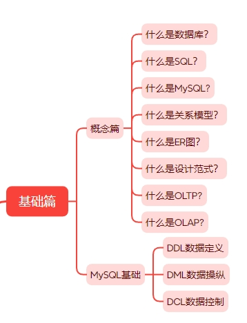
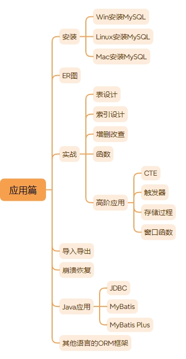

# MySQL学习路线

大家好，我是大头，98年，职高毕业，上市公司架构师，大厂资深开发，管理过10人团队，我是如何做到的呢？

这离不开持续学习的能力，而其中最重要的当然是数据库技术了！

对于所有开发来说，都离不开数据库，因为所有的数据都是要存储的。

其他的技能可能会变，比如业务开发、算法开发、基础设施开发，也不管你是用Java、php、golang、C++等等。你都会用到数据库，因此，学好数据库对于我们来说就至关重要了。

接下来大头将分享自己学习数据库的路线以及心得。

后续也会根据这个路线分享所有的学习方法以及实操案例。关注我一起学习！文末有惊喜哦！

## 如何学好数据库

如何学好数据库？我相信这是一个老生常谈的问题了，如何学好XXX，这里我觉得最重要的是`实践`。

相信大家都知道这句话。`实践是检验真理的唯一标准`。因此，当分享结束以后，大头还会分享完整的实操应用，完全免费分享，放在外面至少价值大几百的实操应用训练营。

在现在这个AI发展迅速的时代，你不用点AI好像就被社会淘汰了一样。所以，我们来看一下AI给出的回答。

```
学好数据库需要系统的学习方法和实践相结合，以下是一些建议：
1. 基础知识积累
理解数据库概念：首先明确数据库的定义，它是存储、管理和检索数据的系统。了解其基本功能，如数据存储、查询、更新和删除等。
学习数据库类型：常见的数据库有关系型数据库（如MySQL、Oracle、SQL Server）和非关系型数据库（如MongoDB、Redis）。了解它们的特点和适用场景。
掌握数据库模型：重点学习关系型数据库的表结构、字段类型、主键、外键等概念，以及非关系型数据库的键值存储、文档存储、列存储等模型。
2. 理论学习
学习SQL语言：SQL是数据库的核心语言，用于操作关系型数据库。学习SQL的基本语法，包括数据定义语言（DDL）、数据操纵语言（DML）和数据控制语言（DCL）。
DDL：创建、修改和删除数据库对象（如表、索引）。
DML：插入、更新、删除和查询数据。
DCL：控制用户对数据的访问权限。
理解数据库设计原则：学习如何设计合理的数据库结构，包括范式理论（如第一范式、第二范式、第三范式），以减少数据冗余和提高数据一致性。
学习事务管理：了解事务的ACID特性（原子性、一致性、隔离性、持久性），以及事务的提交和回滚机制。
掌握索引和优化：学习索引的原理和类型（如B树索引、哈希索引），以及如何通过索引优化查询性能。
3. 实践操作
安装和配置数据库：选择一种主流的数据库（如MySQL、SQLite），在本地安装并进行配置。熟悉数据库的启动、停止和基本管理操作。
动手操作SQL：通过实际操作来巩固SQL语言的学习。可以使用在线数据库平台（如SQLFiddle）或本地数据库进行练习，编写和执行SQL语句，完成数据的增删改查操作。
进行数据库设计：尝试设计一个小型的数据库项目，如学生管理系统或图书管理系统。从需求分析开始，设计表结构，确定字段类型和关系，然后实现数据库的创建和数据的插入。
参与项目实践：如果有机会，参与实际的数据库项目开发，或者在开源项目中学习和实践。通过实际项目，了解数据库在真实场景中的应用和优化方法。
4. 进阶学习
学习高级SQL技术：如子查询、连接查询（内连接、外连接）、分组查询、窗口函数等。
了解数据库架构设计：学习如何设计高可用、高性能的数据库架构，包括主从复制、读写分离、分库分表等技术。
掌握数据库安全：学习如何保护数据库的安全，包括用户认证、授权、数据加密、备份和恢复等。
学习数据库性能优化：了解如何分析和优化数据库性能，包括查询优化、存储优化、硬件优化等。
5. 持续学习和拓展
关注新技术：数据库领域不断发展，新的技术和工具不断涌现。关注NoSQL数据库、分布式数据库（如Cassandra、HBase）、云数据库（如AWS RDS、阿里云数据库）等新技术的发展。
阅读经典书籍和文档：推荐一些经典书籍，如《数据库系统概念》《SQL必知必会》《高性能MySQL》等。同时，阅读数据库官方文档，深入了解其特性和最佳实践。
参加培训和认证：如果条件允许，可以参加数据库相关的培训课程或考取相关认证（如Oracle认证、MySQL认证），提升自己的专业水平。
加入技术社区：加入数据库相关的技术社区（如Stack Overflow、CSDN、知乎等），与其他开发者交流经验和问题，拓宽视野。
总之，学好数据库需要理论学习和实践操作相结合，通过不断的学习和实践，逐步提升自己的数据库技能。
```

可以看到AI给出的回答相当不错了。看起来也是那么回事。

对于学习一种新事物来说，我觉得要分为几个阶段吧，对于所有新事物都适用。
1. 新概念学习：逐步了解这个东西的概念，是什么？能做什么？什么时候用？如何使用？
2. 基础学习：学习这个东西的一些基础使用，并实践应用。
3. 实战应用：当了解概念和基础以后，可以自己开始实践了，最好能完整的实践每一个功能。一般来说到这一步就可以说熟练使用这个东西了。
4. 深入学习原理：开始深入学习相关的原理性知识，了解这个东西是如何实现的，它当时为什么要这么做？有没有其他替代的方案呢？我们可以尝试自己去实现这个东西。一般来说这一步完成就可以说精通了。
5. 扩展学习：扩展学习其他同类的产品，了解使用场景，优劣等。

那么回到我们的话题上，如何学好数据库？
1. 概念学习：数据库是什么？能做什么？什么时候用？如何使用？
2. 基础学习：数据库的基础操作，增删改查，DDL、DCL、DML语言。
3. 实战应用：自己去使用数据库的各个功能，包括增删改查、函数、触发器、存储过程、视图等。
4. 学习原理：深入学习数据库的原理，包括事务的实现、锁的实现、增删改查的实现、索引的实现等。
5. 扩展学习：学习不同类型的数据库，如列式数据库、内存数据库、文档数据库等。

那么再详细一些呢？如何学好MySQL数据库？
1. 概念学习：MySQL数据库是什么？能做什么？什么时候用？如何使用？
2. 基础学习：MySQL数据库的基础操作，增删改查，DDL、DCL、DML语言。
3. 实战应用：自己去使用MySQL数据库的各个功能，包括增删改查、函数、触发器、存储过程、视图等。
4. 学习原理：深入学习MySQL数据库的原理，包括事务的实现、锁的实现、增删改查的实现、索引的实现等。
5. 扩展学习：学习一些其他的数据库，如PostgreSQL、ES、ClickHouse、MongoDB等。

## 概念学习

首先，我们应该知道什么是数据库？很多人都会搞混一个概念，那就是数据库和数据库管理系统。

数据库的英文是`DataBase`。它的概念是
```
数据库是一个长期存储在计算机内的、有组织的、可共享的数据集合，它具有以下特点
1. 数据的集合性
2. 数据的共享性
3. 数据的冗余度低
4. 数据的独立性
5. 数据的安全性
6. 数据的完整性
7. 数据的可维护性
```

而数据库管理系统的英文是`DataBase Management System`。它的概念是：

```
数据库管理软件（Database Management System，简称DBMS）是用于创建、管理、维护和操作数据库的软件系统。它在用户和数据库之间提供了一个接口，使得用户能够方便地存储、检索、更新和管理数据。
```

因此，我们要明白，`MySQL`是一个数据库管理系统，而不是一个数据库。

虽然我们老说`MySQL数据库`，但这个是因为大家已经习惯了，大家都明白MySQL是什么，因此省略了一些。

`MySQL`是用来管理数据库的一个系统。

那么问题来了，`SQL`又是什么呢？

这里给出基础篇的概念学习路线。大家可以根据这些去了解具体的概念。



这一个部分1-2小时就差不多了。

## 实战应用

学会了概念以后，我们就要应用，进行实践。只有这样才能将知识转化成我们自己的。

对于实战来说，首先肯定要进行MySQL的安装，可以直接到官网进行安装，这里给出连接。
> https://www.mysql.com/

安装完成以后，根据上面学习的概念，首先执行一遍DCL、DML、DDL。

接下来需要学习`ER图`。如何学习ER图呢？同意的，先了解一下概念，在进行实战应用。自己画一画ER图。

画ER图的工具，这里推荐几个
- visio，可以自己去网上买一些key，不贵，要注意买key，而不是破解机。
- [processOn](https://www.processon.com/)，强烈推荐，网页版，使用方便，免费的一般也够用了。
- [drwa.io](https://app.diagrams.net/)，强烈推荐，同样有网页版，使用方便，免费。
- [dbdiagram](https://dbdiagram.io/)，不同于自己画图，这个网站可以进行数据库建模，支持导入导出。缺点是需要使用`DBML`进行建模，需要学习一下。

接下来进行一些高级的应用、包括CTE、窗口函数、存储过程、视图、触发器等等。

还可以进行导入导出。

还可以使用你熟悉的语言进行操作。Java的使用可以使用MyBatis Plus。



## 深入学习原理

MySQL原理性的东西就比较多了。

## 架构学习

## 扩展学习


