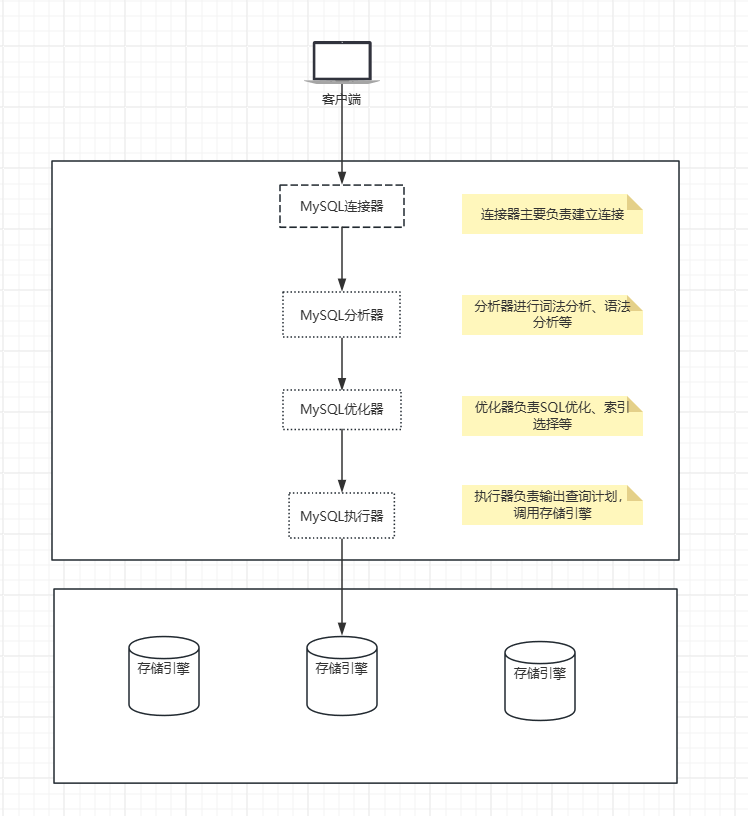
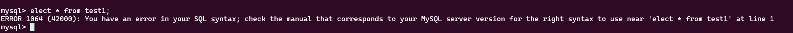
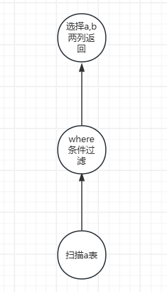
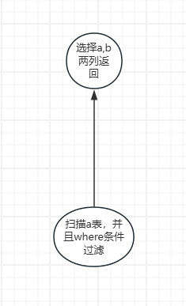
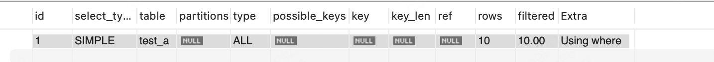
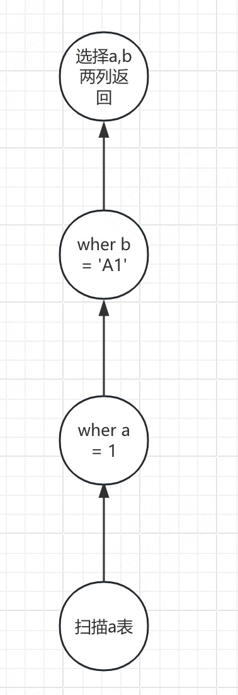
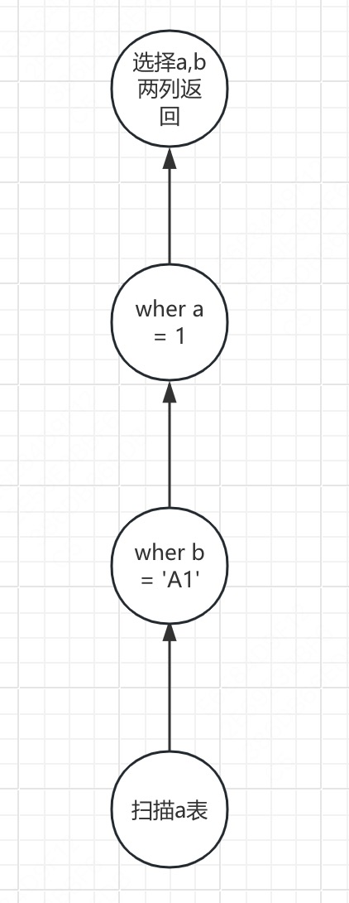
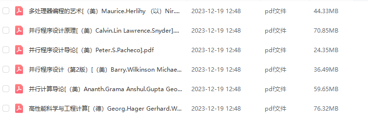

# MySQL查询路径选择

大家好，我是大头，98年，职高毕业，上市公司架构师，大厂资深开发，管理过10人团队，我是如何做到的呢？

这离不开持续学习的能力，而其中最重要的当然是数据库技术了！

对于所有开发来说，都离不开数据库，因为所有的数据都是要存储的。

关注我一起学习！文末有惊喜哦！

## 什么是MySQL查询路径？

MySQL查询路径是指查询优化器在执行查询时所选择的具体执行步骤和顺序。查询优化器的目标是找到最高效的方式来执行查询，以最小化资源消耗（如CPU、I/O、内存等）和查询响应时间。查询路径包括以下几个关键阶段：
1. 解析（Parsing）：
  - 将SQL语句解析成内部的逻辑结构，如语法树（Syntax Tree）。
  - 检查SQL语句的语法是否正确。
2. 预处理（Preprocessing）：
  - 检查用户是否有权限执行该查询。
  - 检查表和列是否存在。
  - 重写查询，如展开视图、处理子查询等。
3. 优化（Optimization）：
  - 查询优化器评估不同的执行计划，选择最优的执行路径。
  - 优化器会考虑索引、表的大小、数据分布等因素。
  - 生成执行计划，决定如何访问表、如何连接表、如何过滤数据等。
4. 执行（Execution）：
  - 按照优化器生成的执行计划，实际执行查询。
  - 包括表扫描、索引扫描、连接操作、过滤操作等。
5. 结果返回（Result Returning）：
  - 将查询结果返回给客户端。

### 查询路径的详细分析

1. 解析（Parsing）

解析阶段将SQL语句转换为内部的逻辑结构。例如，对于查询SELECT a, b FROM test_a WHERE a = 1 AND b = 'A1';，解析器会将其解析为一个查询树，包含以下信息：

- 查询类型：SELECT
- 查询的列：a, b
- 查询的表：test_a
- 查询的条件：a = 1 AND b = 'A1'

2. 预处理（Preprocessing）

预处理阶段会检查用户是否有权限执行该查询，表和列是否存在，以及是否需要重写查询。例如：

- 如果test_a表不存在，查询会失败。
- 如果用户没有权限访问test_a表，查询会失败。
- 如果查询中包含子查询或视图，预处理器会将其展开。

3. 优化（Optimization）

优化阶段是查询路径中最关键的部分。查询优化器会评估不同的执行计划，选择最优的执行路径。优化器考虑的因素包括：

- 索引：是否有可用的索引，以及索引是否能有效过滤数据。
- 表的大小：表的大小会影响全表扫描的成本。
- 数据分布：数据的分布情况会影响过滤条件的效率。
- 连接顺序：如果有多个表连接，优化器会决定最佳的连接顺序。

优化器会生成一个执行计划，描述如何执行查询。例如，对于查询SELECT a, b FROM test_a WHERE a = 1 AND b = 'A1';，优化器可能会生成以下执行计划：

- 使用a列上的索引idx_a来定位满足条件a = 1的行。
- 在这些行中进一步过滤满足条件b = 'A1'的行。

4. 执行（Execution）

执行阶段按照优化器生成的执行计划，实际执行查询。例如：

- 如果优化器选择使用a列上的索引idx_a，执行器会先扫描索引，找到满足条件a = 1的行。
- 然后在这些行中进一步过滤满足条件b = 'A1'的行。
- 最终将结果返回给客户端。

5. 结果返回（Result Returning）

执行器将查询结果返回给客户端。客户端可以是MySQL客户端工具、应用程序等。

### mysql架构

这里就要介绍一下MySQL的整体架构了。



- 连接器：MySQL连接器（MySQL Connector）是用于连接MySQL数据库的客户端库，它允许应用程序与MySQL数据库进行通信。这些连接器提供了API（应用程序编程接口），使得开发者可以在各种编程语言中轻松地执行SQL语句、管理数据库连接、处理查询结果等。
- 分析器：MySQL分析器才算真正进入了MySQL里面。它会分析词法和语法，如果你的SQL语句不对，就会看到一些报错，例如语法错误。
- 优化器：MySQL优化器是本文的重点内容，因为这里涉及了MySQL的一些优化，其中就包括了索引选择，也是导致索引失效的重要原因。在这一步也就确定了查询计划。
- 执行器：MySQL执行器会根据优化器输出的查询计划来执行这个查询计划，会调用底层的存储引擎进行执行。
- 存储引擎：MySQL支持多种存储引擎，每个存储引擎有不同的特点。其中InnoDB引擎因为支持事务等优点，现在是MySQL的默认存储引擎。

### 连接器

MySQL连接器（MySQL Connector）是用于连接MySQL数据库的客户端库，它允许应用程序与MySQL数据库进行通信。这些连接器提供了API（应用程序编程接口），使得开发者可以在各种编程语言中轻松地执行SQL语句、管理数据库连接、处理查询结果等。

当我们最开始连接数据库实例的时候，我们要输入用户名密码，这时候连接器会从数据库的用户信息中判断你是否有权限连接数据库进行操作，有哪些权限。

如果你输入的用户名密码错误或者没有权限，那么你会收到下面的报错信息。

```sql
Access denied for user 'root'@'localhost'(using password: YES)
```


### 分析器

连接成功以后。分析器会分析这个语句的词法，语法，语义这些信息。

通俗来讲就是看到select,update这些关键字，知道你要来干啥，看看你是不是来搞破坏的，来捣蛋的。

看看你是查询哪个表啊，有什么条件啊，这些玩意。

最后会输出一个词法树。

当然了这一步还会分析你的语法有没有错误，比如你把select打错试试。打成elect，会出现下面的报错信息

> You have an error in your SQL syntax: check the maual that corresponds to your MySQL server version for the right syntax to use near 'elect * from users' at line 1



### 优化器

优化器负责几个事情
- 优化SQL：比如你写了一个很不友好的SQL，如`select * from a where 1 =1`,优化器会将1=1去掉。还有比如括号的删除，如`select * from a where ((a AND b) AND c OR (((a AND b) AND (c AND d))))`改写成`select * from a where (a AND b AND c) OR (a AND b AND c AND d)`。等等。
- 一些内部的优化器：下面列出的是部分，更多的可以参考[MySQL官方文档优化器部分](https://dev.mysql.com/doc/refman/8.4/en/optimization.html)
    - 谓词下推：即where条件下推到扫描表的时候执行，而不是扫描表之后执行。
    - 范围优化：对于BTREE和HASH索引，当使用=、<=>、IN（）、IS NULL或IS NOT NULL运算符时，键部分与常量值的比较是范围条件。此外，对于BTREE索引，当使用>，<，>=，<=，BETWEEN，！= 、或<>运算符，或者LIKE比较（如果LIKE的参数是不以小写字符开头的常量字符串）。对于所有索引类型，多个范围条件与OR或AND组合形成范围条件。
    - index merge优化：index merge就是多个索引并发扫描，再将扫描结果合并。
    - hash join优化：使用hash join来代替Nested Loop Join算法，能大幅度提升join速度。
    - Is Null优化：可以对`where a is null`这种条件进行优化，比如该字段设置了`not null`，那么这个条件就会被删除。
    - order by + limit优化：使用`Top N`排序
    - group by 优化：优化group by语句。
    - 子查询物化：将子查询的内容物化保存起来。
- 通过成本模型、直方图等信息生成不同的执行路径。
- 对比执行路径的内容，如取样等，进行选择最终的执行路径。生成查询计划。

这里简单的介绍一些mysql内部的优化器，以了解mysql内部做了哪些优化手段。

最后会介绍mysql的成本模型、直方图信息等。结合实际的例子来给大家展示索引选择的问题。

#### 谓词下推优化

谓词下推优化（Predicate Pushdown Optimization）是一种查询优化技术，它将查询中的过滤条件（谓词）尽可能地推送到数据访问的早期阶段，以减少数据扫描的范围，从而提高查询性能。
在数据库查询中，谓词通常是指WHERE子句中的条件。谓词下推优化的目的是让这些条件在数据被读取或处理的早期阶段就发挥作用，避免不必要的数据处理和传输。

在没有谓词下推优化的情况下，数据库会先读取所有数据，然后在内存中应用过滤条件。这可能导致大量的数据被加载到内存中，增加了I/O操作和内存使用。
通过谓词下推优化，数据库会在数据读取阶段就应用过滤条件，只加载满足条件的数据，从而减少数据的读取量和处理量。

假设存在`table_a`表，表里面有10条数据，`a = 1`的数据有一个，具体什么意思呢，我们来看一个SQL语句。
```sql
select a,b from table_a where a = 1;
```

如果没有谓词下推优化的话，执行树如下。



其执行顺序如下：
1. 扫描`table_a`表的10条数据，将10条数据传递给where过滤节点。
2. where过滤操作进行过滤，过滤出`a = 1`条件的1条数据，将这个数据传递给列选择节点。
3. 列选择节点选择这条数据的2列，将结果返回。

其内存中要存储10条数据。

而有了谓词下推优化以后，执行树如下。



执行顺序如下：
1. 扫描`table_a`表的10条数据，过滤出符合`a = 1`条件的这一个数据。将这个数据传给列选择节点。
2. 列选择节点选择这条数据的2列，将结果返回。

#### 范围优化

对于BTREE和HASH索引，当使用=、<=>、IN（）、IS NULL或IS NOT NULL运算符时，键部分与常量值的比较是范围条件。此外，对于BTREE索引，当使用>，<，>=，<=，BETWEEN，！= 、或<>运算符，或者LIKE比较（如果LIKE的参数是不以小写字符开头的常量字符串）。对于所有索引类型，多个范围条件与OR或AND组合形成范围条件。

给定数据

```
key_part1  key_part2  key_part3
  NULL       1          'abc'
  NULL       1          'xyz'
  NULL       2          'foo'
   1         1          'abc'
   1         1          'xyz'
   1         2          'abc'
   2         1          'aaa'
```

执行where key_part1= 1，其扫描范围为 1,负无穷，负无穷到 1,正无穷，正无穷
```
(1,-inf,-inf) <= (key_part1,key_part2,key_part3) < (1,+inf,+inf)
```
即覆盖了这三行
```
   1         1          'abc'
   1         1          'xyz'
   1         2          'abc'
```

index dives，优化器在范围的两端进行dives, 可以帮助优化器更准确的评估扫描的行数，index dives提供了更准确的行估计，但是随着比较值数量的增加，更加耗时，使用统计信息的准确性不如index dives，但允许对大值列表进行更快的行估计。

eq_range_index_dive_limit系统变量使您能够配置优化器从一个行估计策略切换到另一个行估计策略时的值数量。要允许使用索引潜水来比较最多N个相等范围，请将eq_range_index_dive_limit设置为N+ 1。要禁用统计信息并始终使用索引潜水而不管N，请将eq_range_index_dive_limit设置为0。

若要更新表索引统计信息以获得最佳估计值，请使用ANALYZE TABLE。

skip scan,比如有索引(f1,f2)，都知道最左前缀原则，所以一般where f2 > 40是不走索引的，skip scan可以让他走索引，通过构造f1 = 1 and f2 > 40，扫描完以后再扫描 f1 = 2 and f2 > 40，以此类推，可以通过explain来看extra列是否有skip scan

in优化，in查询可以用如下形式
```
SELECT ... FROM t1 WHERE ( col_1, col_2 ) IN (( 'a', 'b' ), ( 'c', 'd' ));
```

range_optimizer_max_size_size系统变量可以设置优化器使用的内存

#### index merge 优化

index merge就是多个索引并发扫描，再将扫描结果合并

索引合并不适用于全文索引。

索引合并访问方法检索具有多个范围扫描的行，并将其结果合并为一个。此访问方法只合并单个表的索引扫描，而不合并多个表的扫描。合并可以产生其底层扫描的并集、交集或交集的并集。

可以使用索引合并的查询示例：
```
SELECT * FROM tbl_name WHERE key1 = 10 OR key2 = 20;

SELECT * FROM tbl_name
  WHERE (key1 = 10 OR key2 = 20) AND non_key = 30;

SELECT * FROM t1, t2
  WHERE (t1.key1 IN (1,2) OR t1.key2 LIKE 'value%')
  AND t2.key1 = t1.some_col;

SELECT * FROM t1, t2
  WHERE t1.key1 = 1
  AND (t2.key1 = t1.some_col OR t2.key2 = t1.some_col2);
```

> 如果你的查询有一个带有深度AND/OR嵌套的复杂WHERE子句，并且MySQL没有选择最佳计划，请尝试使用以下恒等转换来分发术语：

```
(x AND y) OR z => (x OR z) AND (y OR z)
(x OR y) AND z => (x AND z) OR (y AND z)
```

在EXPLAIN输出中，Index Merge方法在type列中显示为index_merge。在本例中，key列包含使用的索引列表，key_len包含这些索引的最长键部分列表。

索引合并访问方法有几种算法，它们显示在EXPLAIN输出的Extra字段中：
- intersect：对多个and条件生效
- union：对多个or条件生效
- sort_union：sort-union算法和union算法之间的区别在于，sort-union算法必须首先获取所有行的行ID，并在返回任何行之前对其进行排序。

索引合并的使用取决于optimizer_switch系统变量的index_merge、index_merge_intersection、index_merge_union和index_merge_sort_union标志的值。默认情况下，所有这些标志都是打开的。

#### hash join

默认情况下，MySQL尽可能使用哈希连接。可以使用BNL和NO_BNL优化器提示之一来控制是否使用散列连接。

hash join比嵌套join快的多，首先创建hash表，在循环另一个表进行hash，判断是否相等

可以使用join_buffer_size系统变量控制哈希连接的内存使用量;哈希连接使用的内存量不能超过此值。当哈希连接所需的内存超过可用量时，MySQL会使用磁盘上的文件来处理。如果发生这种情况，您应该注意，如果哈希连接无法容纳内存并且它创建的文件比为open_files_limit设置的文件多，则连接可能不会成功。要避免此类问题，请进行以下更改之一：
- 增加join_buffer_size，使哈希连接不会溢出到磁盘。
- 增加open_files_limit。

#### 成本模型

MySQL成本模型（Cost Model）是MySQL查询优化器（Query Optimizer）用来评估不同查询执行计划的成本（Cost）的一种机制。成本模型通过估算每种执行计划所需的资源（如CPU、I/O、内存等）来选择最优的执行计划。

MySQL的成本模型主要考虑以下几个方面：
1. CPU成本：
    - 评估执行计划中每个操作（如比较、计算、排序等）所需的CPU时间。
    - 例如，WHERE子句中的条件计算、JOIN操作中的匹配等。
2. I/O成本：
    - 评估执行计划中每个操作所需的磁盘I/O操作次数。
    - 例如，全表扫描、索引扫描、数据页的读取等。
    - I/O成本通常是最主要的成本因素之一，因为磁盘I/O操作相对较慢。
3. 内存成本：
    - 评估执行计划中每个操作所需的内存使用量。
    - 例如，排序操作、临时表的创建等。
4. 网络成本：
    - 评估执行计划中每个操作所需的网络传输量。
    - 例如，分布式查询中跨节点的数据传输。
5. 数据分布：
    - 评估数据的分布情况，如表的大小、索引的覆盖率等。
    - 数据分布会影响I/O操作的次数和效率。

其中大部分的成本都是固定的，比如CPU成本、IO成本、内存成本。这个是根据你服务器的配置决定的。

所以，主要关注的是数据分布。

MySQL的数据分布使用`直方图`来记录。

#### 直方图

`column_statistics数据字典表`存储有关列值的`直方图`统计信息，供优化器在构造查询执行计划时使用。要执行直方图管理，请使用`ANALYZE TABLE`语句。
- 该表包含除几何类型（空间数据）和JSON之外的所有数据类型的列的统计信息。
- 该表是持久的，因此不必在每次服务器启动时都创建列统计信息。
- 服务器对表执行更新，用户不执行。

用户不能直接访问`column_statistics`表，因为它是`数据字典`的一部分。直方图信息可使用 `INFORMATION_SCHEMA.COLUMN_STATISTICS` 获得，它是作为数据字典表上的视图实现的。`COLUMN_STATISTICS`包含以下列：
- SCHEMA_NAME、TABLE_NAME、COLUMN_NAME：应用统计信息的模式、表和列的名称。
- HISTORIO：描述列统计信息的JSON值，存储为直方图。

直方图实例
```
{
  "buckets": [
    [
      1,
      0.3333333333333333
    ],
    [
      2,
      0.6666666666666666
    ],
    [
      3,
      1
    ]
  ],
  "null-values": 0,
  "last-updated": "2017-03-24 13:32:40.000000",
  "sampling-rate": 1,
  "histogram-type": "singleton",
  "number-of-buckets-specified": 128,
  "data-type": "int",
  "collation-id": 8
}
```

- buckets：直方图桶。桶结构取决于直方图类型。
- null-values：一个介于0.0和1.0之间的数字，表示`SQL NULL`值的列值的分数。如果为0，则该列不包含NULL值。
- last-updated：直方图生成时，以 `YYYY-MM-DD hh:mm:ss.uuuuuu` 格式的UTC值表示。
- sampling-rate：0.0到1.0之间的数字，表示为创建直方图而采样的数据比例。值为1表示已读取所有数据（无采样）。
- histogram-type：直方图类型：
  - singleton：一个bucket表示列中的一个值。当列中的非重复值数量小于或等于生成直方图的`ANALYZE TABLE`语句中指定的存储桶数量时，将创建此直方图类型。
  - equi-height：一个桶表示一个值范围。当列中的非重复值数量大于生成直方图的`ANALYZE TABLE`语句中指定的存储桶数量时，将创建此直方图类型。
- number-of-buckets-specified：生成直方图的`ANALYZE TABLE`语句中指定的`桶数`。
- data-type：此直方图包含的数据类型。在将直方图从持久性存储器阅读和解析到内存中时，这是需要的。该值是int、uint（无符号整数）、double、decimal、datetime或string（包括字符和二进制字符串）之一。
- collation-id：直方图数据的归类ID。当数据类型值是字符串时，它最有意义。值对应于信息架构`COLLATIONS`表中的ID列值。

直方图统计信息主要用于非索引列。将索引添加到直方图统计信息适用的列还可以帮助优化器进行行估计。

优化器更喜欢范围优化器的行估计，而不是从直方图统计信息中获得的行估计。如果优化器确定范围优化器适用，则不使用直方图统计信息。

对于已建立索引的列，可以使用索引潜水(index dives)获得行估计值以进行相等比较。

在某些情况下，使用直方图统计信息可能不会改善查询执行（例如，如果统计信息过期）。要检查是否是这种情况，请使用`ANALYZE TABLE`重新生成直方图统计信息，然后再次运行查询。

这么看这些概念内容，可能很难理解直方图到底是干啥的，下面给出一个例子方便理解。

##### 直方图示例

虽然直方图的字段很多，但其核心的字段只有几个
-

创建一个测试表。
```sql
create table test_a(id int auto_increment,a int not null default 0, b varchar(255) not null default '', primary key(id));
```

接下来我们插入几个数据。
```sql
INSERT INTO test_a (a, b) VALUES
(1, 'A1'),
(2, 'B2'),
(3, 'C3'),
(4, 'D4'),
(5, 'E5'),
(6, 'F6'),
(7, 'G7'),
(8, 'H8'),
(9, 'I9'),
(10, 'J10');
```

接下来生成直方图信息。
```sql
ANALYZE TABLE test_a update  HISTOGRAM ON a WITH 5 BUCKETS;
```

查询直方图信息。这里的`SCHEMA_NAME`是数据库的名称，TABLE_NAME是数据表的名称。
```sql
SELECT * FROM INFORMATION_SCHEMA.COLUMN_STATISTICS where SCHEMA_NAME = 'test1' and TABLE_NAME = 'test_a';
```

查询结果：

```sql
+-------------+------------+-------------+------------------------------------------------------------------------------------------------------------------------------------------------------------------------------------------------------------------------------------------------------------------------------------------------------------------------+
| SCHEMA_NAME | TABLE_NAME | COLUMN_NAME | HISTOGRAM
                                                                                                                                                   |
+-------------+------------+-------------+------------------------------------------------------------------------------------------------------------------------------------------------------------------------------------------------------------------------------------------------------------------------------------------------------------------------+
| test1       | test_a     | a           | {"buckets": [[1, 2, 0.2, 2], [3, 4, 0.4, 2], [5, 6, 0.6, 2], [7, 8, 0.8, 2], [9, 10, 1.0, 2]], "data-type": "int", "auto-update": false, "null-values": 0.0, "collation-id": 8, "last-updated": "2025-01-25 13:01:57.129967", "sampling-rate": 1.0, "histogram-type": "equi-height", "number-of-buckets-specified": 5} |
+-------------+------------+-------------+------------------------------------------------------------------------------------------------------------------------------------------------------------------------------------------------------------------------------------------------------------------------------------------------------------------------+
1 row in set (0.00 sec)
```

我们来看一下直方图的信息。

```json
{
"buckets": [[1, 2, 0.2, 2], [3, 4, 0.4, 2], [5, 6, 0.6, 2], [7, 8, 0.8, 2], [9, 10, 1.0, 2]], 
"data-type": "int", 
"auto-update": false, 
"null-values": 0.0, 
"collation-id": 8, 
"last-updated": "2025-01-25 13:01:57.129967", 
"sampling-rate": 1.0, 
"histogram-type": "equi-height", 
"number-of-buckets-specified": 5
}
```

- buckets：直方图桶。桶结构取决于直方图类型。
- null-values：0.0,表示没有null值，这是因为我们使用了`not null`声明字段。
- last-updated：更新时间，没啥好说的。
- sampling-rate：1.0 获取了所有数据，因为我们只有10条数据，很少。
- histogram-type：直方图类型：equi-height，因为`a`列有10个值，都不重复，而桶数量我们用的是5，所以生成了这个类型。
- number-of-buckets-specified：生成直方图的`ANALYZE TABLE`语句中指定的`桶数`。
- data-type：列a是int类型
- collation-id：直方图数据的归类ID。当数据类型值是字符串时，它最有意义。值对应于信息架构`COLLATIONS`表中的ID列值。

桶里面有4个数据
- 最小值
- 最大值
- 密度
- 高度

比如，查询语句
```sql
select * from test_a where a = 5
```

`a = 5`的数据在第三个桶里面，最小值5，最大值6，密度0.6，高度2.

根据计算公式`预估行数 = 密度 * 高度`来计算0.6 * 2，预估行数就是1.2，也就是1-2行。



可以看到查询计划里面的rows是10行，这是因为类型是全表扫描，但是后面的`filtered`字段是10，表示的意思是会过滤出来 `10 * 10% = 10 * 0.1 = 1`行。

也就是最终会查出1行结果。

通常来说，对于没有索引的列，MySQL就是这样来预估行数的，并且通过这个结果来进行选择执行路线。

### 执行路线选择

什么叫路线选择呢，还是上面那个表，我们现在有如下SQL语句。

```sql
select a,b from test_a where a = 1 and b = 'A1';
```

根据表数据，其实我们知道，查出来的结果还是1条。但是对于mysql来说，却有不同的执行方式。

第一种执行方式，先查`a=1`在查询`b='A1'`的数据。执行树如下。



第二种执行方式，先查`b='A1'`在查询 `a=1`。执行树如下。



目前看着这两种方式都没啥问题。

但是，我们再插入一条数据呢？
```sql
INSERT INTO test_a (a, b) VALUES
(11, 'A1');
```

这样我们就知道了，方案1， 会直接过滤出1行数据，然后在过滤，这样显然比方案2更好。

因为方案2会先查出2条数据，再次过滤。

这就是不同的执行路线带来的性能区别。当然了，我们这里的例子只是打个比方，实际上`谓词下推`优化以后，这两个条件都是和扫描表一起执行的。

这个例子只是让你明白不同的路线选择而已。

对于`join`查询来说，会有更多的选择。

## 文末福利

以上就是今天的内容了，大家有任何疑问可以打在评论区，一起交流～

关注我发送“MySQL知识图谱”领取完整的MySQL学习路线。

发送“电子书”即可领取价值上千的电子书资源。

部分电子书如图所示。





