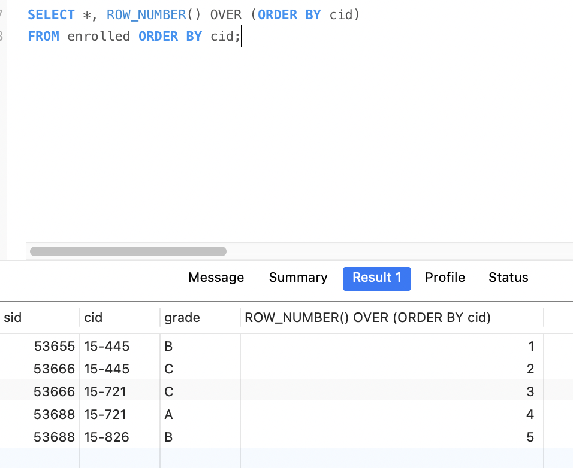
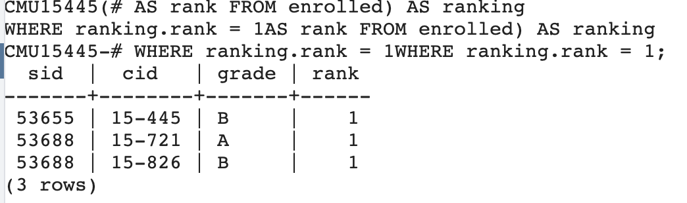

# MySQL零基础教程基础篇

大家好，我是大头，98年，职高毕业，上市公司架构师，大厂资深开发，管理过10人团队，我是如何做到的呢？

这离不开持续学习的能力，而其中最重要的当然是数据库技术了！

对于所有开发来说，都离不开数据库，因为所有的数据都是要存储的。

关注我一起学习！文末有惊喜哦！

基础篇的内容大致如下图所示。


## 概念学习

首先，我们应该知道什么是数据库？很多人都会搞混一个概念，那就是数据库和数据库管理系统。

数据库的英文是`DataBase`。它的概念是
```
数据库是一个长期存储在计算机内的、有组织的、可共享的数据集合，它具有以下特点
1. 数据的集合性
2. 数据的共享性
3. 数据的冗余度低
4. 数据的独立性
5. 数据的安全性
6. 数据的完整性
7. 数据的可维护性
```

而数据库管理系统的英文是`DataBase Management System`。它的概念是：

```
数据库管理系统（Database Management System，简称DBMS）是用于创建、管理、维护和操作数据库的软件系统。它在用户和数据库之间提供了一个接口，使得用户能够方便地存储、检索、更新和管理数据。
```

因此，我们要明白，`MySQL`是一个数据库管理系统，而不是一个数据库。

虽然我们老说`MySQL数据库`，但这个是因为大家已经习惯了，大家都明白MySQL是什么，因此省略了一些。

`MySQL`是用来管理数据库的一个系统。

那么问题来了，`SQL`又是什么呢？

### SQL

SQL（Structured Query Language，结构化查询语言）是一种用于管理和操作关系数据库的标准编程语言。它允许用户定义、查询、更新和管理数据库中的数据。SQL 是关系数据库管理系统（RDBMS）的核心语言，广泛应用于各种数据库系统。

这里又出现了一个新的概念，就是`关系数据库管理系统（RDBMS）`。

上面已经介绍了`数据库管理系统`。那什么是关系数据库管理系统呢？

### 关系数据库

这里就需要先说明一下什么是`关系数据库`。

关系数据库（Relational Database）
关系数据库是一种基于关系模型的数据库管理系统（DBMS），它使用表格（表）来组织和存储数据。每个表由行（记录）和列（字段）组成，每一行代表一个数据记录，每一列代表一个数据属性。关系数据库的核心概念是关系模型，它由数学家埃德加·弗兰克·科德（E.F. Codd）在1970年提出。

#### 关系模型

Ted Codd在1969年设计了关系模型。发表了[A relational model of data for large shared data banks](https://dl.acm.org/doi/pdf/10.1145/362384.362685) 

关系模型将物理层和逻辑层分离，当数据的内部表示发生变化时，甚至当外部表示的某些方面发生变化时，用户在终端和大多数应用程序上的活动应该不受影响。

关系模型提供了一种仅用数据的自然结构来描述数据的方法，因此，它为高级数据语言提供了一个基础，这种语言将一方面在程序之间产生最大的独立性，另一方面在机器表示和数据组织之间产生最大的独立性。另一个优点是，它为处理关系的可导出性、冗余性和一致性提供了坚实的基础。

仍然需要消除的三种主要数据依赖是：顺序依赖、索引依赖和访问路径依赖。
- 顺序依赖：程序展示的顺序和文件内容的存储顺序并不一致，需要各自独立。
- 索引依赖：如果程序使用索引的时候，索引被删除那么程序将出错。
- 访问路径依赖：访问数据的时候依赖数据的物理结构。

`关系`指的是数学意义上的关系，对于给定集合S1,S2,S3...Sn，R是n个集合上的关系，如果它是n个元组的集合，每个元组的第一个元素来自S1,第二个来自S2，以此类推。我们称Sj是R上的第j个定义域。R的阶为n(degree n)，阶为1的时候称为一元关系，2的时候称为二元关系，阶为n称为n元关系。

关键原则：
- 将数据存储在简单的数据结构(关系)中
- 物理存储留给DBMS实现
- 通过高级语言访问数据，DBMS确定最佳策略。

结构采用关系。确保数据库内容满足完整性约束。程序通过接口来访问和修改数据库内容。

关系是无序的，n元关系就是n个列的表。一个元组是一行记录。

关系数据库就是基于`关系模型`的数据库。

其具体的体现形式就是我们通常说的`表`。

建表语句如下。

```SQL
CREATE TABLE employees (
    id INT AUTO_INCREMENT PRIMARY KEY,
    name VARCHAR(100),
    department VARCHAR(50),
    salary DECIMAL(10, 2)
);
```

除此之外，还有一些`关系完整性约束`。以确保数据的准确性和一致性。常见的完整性约束包括：
- 主键约束（Primary Key）：确保表中每一行的唯一性。
- 外键约束（Foreign Key）：确保表之间的关系完整性。
- 唯一约束（Unique）：确保某一列或一组列的值是唯一的。
- 非空约束（NOT NULL）：确保某一列的值不能为空。
- 检查约束（CHECK）：确保某一列的值满足特定条件。

这里面主键约束是必须的。`外键约束`通常不使用，因为保证这些约束，会降低数据库的性能。因此外键约束通常由代码层实现。

唯一约束有的时候是可以使用的，来限制唯一性，同样也可以通过代码层实现。

非空约束也是推荐使用的，因为`NULL`在数据库里面处理起来也有一些麻烦，也会影响性能。

检查约束实际上也基本不使用。

支持SQL标准，实现了SQL标准，最低要求实现SQL92标准。

关系数据库支持事务（Transaction），事务是一组操作的集合，要么全部成功，要么全部失败。事务的四个基本特性（ACID）包括：
- 原子性（Atomicity）：事务中的所有操作要么全部成功，要么全部失败。
- 一致性（Consistency）：事务执行前后，数据库的状态保持一致。
- 隔离性（Isolation）：并发事务之间相互隔离，不会相互干扰。
- 持久性（Durability）：事务一旦提交，其结果是永久性的，即使系统故障也不会丢失。

### SQL标准

SQL标准是一系列由国际标准化组织（ISO）和美国国家标准协会（ANSI）制定的规范，旨在确保SQL语言的统一性和兼容性。这些标准定义了SQL语言的语法、语义和行为，使得不同的数据库管理系统（DBMS）能够以一致的方式实现和使用SQL。

主要的SQL标准：
1. SQL-86（1986年）：
  - 第一个SQL标准，奠定了SQL语言的基础。
  - 定义了基本的SQL语法和功能，包括数据定义语言（DDL）和数据操纵语言（DML）。
2. SQL-89（1989年）：
  - 对SQL-86的修订和扩展，增加了对嵌套查询和子查询的支持。
  - 也称为SQL1，是第一个广泛接受的SQL标准。
3. SQL-92（1992年）：
  - 也称为SQL2，是SQL标准的重大更新。
  - 引入了大量新功能，包括：
    - 外键约束（Foreign Key Constraints）
    - 多表连接（JOIN）
    - 嵌套查询（Subqueries）
    - 集合操作（Set Operations）
    - 视图（Views）
    - 完整性约束（Integrity Constraints）
  - SQL-92 是目前大多数数据库系统支持的基础标准。
4. SQL:1999（1999年）：
  - 引入了对大型对象（LOBs）、窗口函数（Window Functions）、递归查询（Recursive Queries）等的支持。
  - 也称为SQL3，是SQL标准的进一步扩展。
5. SQL:2003（2003年）：
  - 引入了对XML数据类型和操作的支持。
  - 增加了对存储过程、触发器、用户定义类型（UDTs）等的支持。
6. SQL:2006（2006年）：
  - 主要关注XML数据的处理和查询。
  - 引入了对XQuery的支持。
7. SQL:2008（2008年）：
  - 引入了对时间数据类型和操作的支持。
  - 增加了对分区表、数据加密等的支持。
8. SQL:2011（2011年）：
  - 引入了对多版本并发控制（MVCC）的支持。
  - 增加了对分区表的进一步扩展。
9. SQL:2016（2016年）：
  - 引入了对JSON数据类型和操作的支持。
  - 增加了对窗口函数的进一步扩展。
10. SQL:2019（2019年）：
  - 引入了对机器学习和数据分析的支持。
  - 增加了对时间序列数据、地理空间数据等的支持。

尽管SQL标准提供了统一的规范，但不同的数据库系统在实现上存在差异。主要的数据库系统（如MySQL、PostgreSQL、Oracle、SQL Server等）都支持SQL标准的核心功能，但在某些高级功能和扩展上可能有所不同。例如：
- MySQL：支持SQL:2003标准，但在某些高级功能（如窗口函数）上支持较晚。
- PostgreSQL：支持SQL:2011标准，对SQL标准的兼容性较好。
- Oracle：支持SQL:2011标准，但在某些功能上有自己的扩展。
- SQL Server：支持SQL:2008标准，但在某些功能上有自己的扩展。

SQL标准是一系列由ISO和ANSI制定的规范，旨在确保SQL语言的统一性和兼容性。不同的数据库系统在实现上存在差异，但都支持SQL标准的核心功能。了解数据库系统对SQL标准的支持情况，可以帮助开发者更好地编写跨数据库的SQL代码，提高代码的可移植性和兼容性。


### 数据模型

- 关系模型：大多数数据库使用的
- 键值对模型：NOSql使用的，比如redis
- 图模型：NOSql使用的
- 文档模型：NOSql使用的，比如mongoDB
- 列存储模型
- 数组，向量模型：向量数据库，如Fassi
- 分组模型，网络模型，多值模型：已经很少使用的模型

### 函数依赖

设R为任一给定关系，如果对于R中属性X的每一个值，R中的属性Y只有唯一值与之对应，则称X函数决定Y或称Y函数依赖于X，记作X->Y.其中X称为`决定因素`

分类：
- 完全函数依赖
- 部分函数依赖
- 传递函数依赖

 完全函数依赖：
 设R为任一给定关系，X,Y为其属性集，若X->Y，且对X中的任何真子集X'，都有X'不依赖Y,则称Y完全函数依赖于X

 部分函数依赖：
 设R为任一给定关系，X,Y为其属性集，若X->Y,且X中存在一个真子集X',都有X'->Y，则称Y部分依赖于X

 传递函数依赖：
 设R为任一给定关系，X,Y,Z为其不同属性子集，若X->Y,Y不决定X,Y->Z,则有X->Z，称为Z传递函数依赖于X。

### 设计范式

一个低一级范式的关系模式通过`模式分解`可以转换为若干个高一级范式的关系模式的集合，这种过程就叫`规范化`

第一范式1NF:
设R为任一给定关系，如果R中每个列与行的交点处的取值都是不可再分的基本元素，则R为第一范式

第二范式2NF:
设R为任一给定关系，若R为1NF
且其所有非主属性都完全函数依赖于候选关键字，则R为第二范式。

候选关键字：能唯一表示一行数据的就是候选关键字，比如主键，比如唯一索引等。

第三范式3NF:
设R为任一给定关系，若R为2NF
且其每一个非主属性都不传递函数依赖于候选关键字，则R为第三范式。

第三范式的改进形式BCNF:
设R为任意给定关系，X,Y为其属性集，F为其函数依赖集，若R为3NF
且其F中所有函数依赖X->Y(Y不属于X)中的X比包含候选关键字，则R为BCNF


有部分函数依赖就是1NF，没有就是2NF，没有传递函数依赖就是3NF

1NF->2NF
找到候选关键字，看其余的属性是否完全函数依赖候选关键字
是的，与候选关键字一同抄下来形成一个表格
不是的，抄下来，形成第二个表格，并且将候选关键字里能够唯一决定表格2的属性组抄在第一列

2NF->3NF
找到表格中的传递函数依赖关系的三个属性组，设为X,Y,Z
将这三个属性组拆成两个表格
第一个表格为X,Y
第二个表格为Y,Z

3NF->BCNF
列出表格中的所有函数依赖关系
每个关系拆出一个表格


### ER图

ER图是一种图形化的表示方法，用于描述数据库中的实体、实体之间的关系以及实体的属性。它是一种强大的工具，广泛应用于数据库设计和概念建模阶段，帮助开发者和分析师理解数据结构和数据之间的关系。

ER图的主要组成部分
- 实体（Entity）：
  - 实体是数据库中具有相同属性集合的对象。例如，学生、课程、教师等。
  - 在ER图中，实体通常用矩形表示，矩形内写上实体的名称。
- 属性（Attribute）：
  - 属性是实体的特征或性质。例如，学生的属性可以包括学号、姓名、年龄等。
  - 在ER图中，属性通常用椭圆表示，椭圆内写上属性的名称，并用线连接到对应的实体。

下图就是一个`ER图`，`实体`是`管理员用户`。`属性`有头像、密码、登录名、ID、邮箱、手机号。


- 关系（Relationship）：
  - 关系描述了实体之间的联系。例如，学生和课程之间的关系可以是选修。
  - 在ER图中，关系通常用菱形表示，菱形内写上关系的名称，并用线连接到相关的实体。
- 关系的类型：
  - 一对一关系（1:1）：一个实体与另一个实体之间存在一对一的联系。例如，一个学生对应一个学号。
  - 一对多关系（1:N）：一个实体与多个实体之间存在联系。例如，一个教师可以教授多个课程。
  - 多对多关系（M:N）：多个实体与多个实体之间存在联系。例如，一个学生可以选修多个课程，一个课程也可以被多个学生选修。

下图就是一个ER图，`实体`是管理员用户和角色两个。`关系`是`拥有`，表示管理员用户拥有角色的关系。关系的类型用`m和n`表示`多对多关系`。意思是一个管理员用户可以拥有多个角色，一个角色也可以被多个管理员用户拥有。


画ER图可以使用[processOn](https://www.processon.com/i/637308dd762131535d6884f7?full_name=osgpjw20iEaJn-L)

### OLTP

OLTP（Online Transaction Processing，联机事务处理）数据库是一种用于支持日常事务处理和业务操作的数据库系统。它旨在快速处理大量的在线事务，确保数据的完整性和一致性。OLTP数据库广泛应用于各种需要实时数据处理的场景，如银行系统、电子商务平台、企业资源规划（ERP）系统等。

OLTP数据库
- 通常是业务侧使用的传统数据库，比如oracle,postgresql,mysql
- 小的业务多次执行，比如多个简单的插入，更新，查询

#### OLTP数据库的主要特点

事务性：
- OLTP数据库的核心是事务处理。事务是一组操作的集合，要么全部成功，要么全部失败。OLTP系统支持ACID（原子性、一致性、隔离性、持久性）特性，确保事务的可靠性。
- 原子性（Atomicity）：事务中的所有操作要么全部成功，要么全部失败。
- 一致性（Consistency）：事务执行前后，数据库的状态保持一致。
- 隔离性（Isolation）：并发事务之间相互隔离，不会相互干扰。
- 持久性（Durability）：事务一旦提交，其结果是永久性的，即使系统故障也不会丢失。

高性能：
- OLTP数据库设计用于快速处理大量的在线事务。它们通常具有高效的索引、优化的查询计划和低延迟的响应时间。
- 例如，银行系统需要在几毫秒内完成交易，OLTP数据库能够满足这种高性能要求。

数据完整性：
- OLTP数据库通过各种完整性约束（如主键、外键、唯一约束、非空约束等）确保数据的准确性和一致性。
- 例如，一个订单表中的订单号必须是唯一的，客户表中的客户ID必须存在。

并发处理：
- OLTP数据库支持高并发访问，允许多个用户同时进行事务操作。它们通过锁机制和事务隔离级别来管理并发事务，确保数据的一致性和完整性。
- 例如，多个用户可以同时在电子商务平台上下单，OLTP数据库能够处理这些并发请求。

实时性：
- OLTP数据库提供实时数据处理，用户可以即时看到事务的结果。这使得OLTP系统适用于需要即时反馈的业务场景，如在线支付、库存管理等。
- 例如，用户在电子商务平台上下单后，系统立即更新库存信息并生成订单。

#### OLTP数据库的常见应用场景

银行系统：
- 用于处理日常的银行交易，如存款、取款、转账等。这些交易需要快速、准确地完成，确保数据的一致性和完整性。
电子商务平台：
- 用于处理用户的订单、支付、库存管理等。这些系统需要支持高并发访问，确保用户能够实时看到订单状态和库存信息。
企业资源规划（ERP）系统：
- 用于管理企业的各种资源，如人力资源、财务资源、生产资源等。这些系统需要处理大量的事务，确保数据的准确性和一致性。
客户关系管理（CRM）系统：
- 用于管理客户信息、销售机会、客户服务等。这些系统需要支持实时数据处理，确保客户信息的准确性和及时性。

OLTP数据库是一种用于支持日常事务处理和业务操作的数据库系统。它具有事务性、高性能、数据完整性、并发处理和实时性等特点，广泛应用于银行系统、电子商务平台、企业资源规划（ERP）系统等。常见的OLTP数据库管理系统包括MySQL、PostgreSQL、Oracle Database、Microsoft SQL Server和SQLite。


### OLAP

OLAP（Online Analytical Processing，联机分析处理）数据库是一种用于支持复杂的数据分析和报告的数据库系统。它旨在快速处理大量的数据，提供多维度的数据分析能力，帮助用户从不同角度理解数据。OLAP数据库广泛应用于数据仓库、商业智能（BI）和决策支持系统。

OLAP数据库
- 通常是大数据，数据分析来使用，比如Hbase等，支持复杂的数据查询
- OLAP位于OLTP的后方

#### OLAP数据库的主要特点

多维数据分析：
- OLAP数据库支持多维数据分析，允许用户从不同角度（如时间、地区、产品等）查看数据。这种多维视图有助于用户发现数据中的模式和趋势。
- 例如，用户可以按季度、地区和产品类别分析销售数据。

高性能查询：
- OLAP数据库优化了对大量数据的读取操作，能够快速响应复杂的查询请求。它们通常使用预计算的聚合数据和索引技术来提高查询性能。
- 例如，数据仓库中的销售数据可以按季度、地区和产品类别预计算，以便快速生成报告。

数据聚合：
- OLAP数据库支持数据的聚合操作，如求和、平均、最大值、最小值等。这些聚合操作通常在数据加载时预先计算，以便快速生成报告。
- 例如，销售数据可以按季度、地区和产品类别进行汇总，以便快速生成销售报告。

数据立方体（Data Cube）：
- OLAP数据库使用数据立方体（Data Cube）来组织数据。数据立方体是一个多维数据结构，允许用户从不同维度查看数据。
- 例如，一个销售数据立方体可以包含时间维度（年、季度、月）、地区维度（国家、城市）和产品维度（类别、品牌）。

数据更新：
- OLAP数据库通常不需要实时更新，数据通常在定期的时间间隔内批量加载。这使得OLAP数据库能够优化读取操作，提高查询性能。
- 例如，销售数据可以在每天晚上批量加载到数据仓库中。

#### OLAP数据库的常见应用场景

数据仓库：
- 用于存储和管理企业的历史数据，支持复杂的查询和报告。数据仓库通常从多个数据源（如事务处理系统）提取数据，进行清洗和转换，然后加载到数据仓库中。
- 例如，企业可以使用数据仓库来分析销售趋势、客户行为等。

商业智能（BI）：
- 用于支持企业的决策支持系统，提供数据驱动的决策支持。商业智能工具通常与OLAP数据库集成，提供交互式的报告和分析功能。
- 例如，企业可以使用商业智能工具生成销售报告、市场分析报告等。

决策支持系统（DSS）：
- 用于支持企业的决策过程，提供数据驱动的决策支持。决策支持系统通常使用OLAP数据库来存储和分析数据。
- 例如，企业可以使用决策支持系统来优化生产计划、资源分配等。

OLAP数据库是一种用于支持复杂的数据分析和报告的数据库系统。它具有多维数据分析、高性能查询、数据聚合、数据立方体和数据更新等特点，广泛应用于数据仓库、商业智能（BI）和决策支持系统。常见的OLAP数据库管理系统包括HBase,ClickHouse等。

### 高级概念

接下来在介绍一下MySQL中会用到的高级概念，这些能更好的帮助大家理解除了正常的表以外的其他东西。

#### 视图

在MySQL中，**视图（View）**是一种虚拟表，其内容由SQL查询定义。视图并不存储实际的数据，而是根据定义的查询动态生成数据。视图可以简化复杂的SQL操作，提供数据的逻辑抽象，并且可以限制对某些数据的访问，从而增强数据的安全性。

MySQL中的视图是虚拟视图，说白了就是一条SQL语句，当查询视图的时候执行SQL语句而已。

除此之外，还有一个东西叫做`物化视图`，MySQL并没有实现这个东西，物化视图就是一张真的表，而不是一个SQL语句，因此查询效率更好。

##### 视图的主要特点

虚拟表：
- 视图是一个虚拟表，其内容由SQL查询定义。视图本身并不存储数据，而是根据定义的查询动态生成数据。

简化复杂查询：
- 视图可以简化复杂的SQL操作，将复杂的查询逻辑封装起来，使用户可以像查询普通表一样查询视图。

数据抽象：
- 视图提供数据的逻辑抽象，隐藏了底层表的复杂性，使用户可以更直观地访问数据。

安全性：
- 视图可以限制对某些数据的访问，增强数据的安全性。通过视图，用户只能访问视图定义的特定数据，而不能访问底层表的全部数据。

更新限制：
- 视图可以是可更新的，也可以是不可更新的。可更新视图允许用户通过视图插入、更新或删除数据，但需要满足一定的条件。不可更新视图则不允许用户通过视图修改数据。

创建一个视图。下面的语句，创建一个视图，视图名称是`sales_employees`，内容就是后面的Select语句的结果。当原始表`employees`变化以后，视图的内容也会跟着变化。
```sql
CREATE VIEW sales_employees AS
SELECT name, salary
FROM employees
WHERE department = 'Sales';
```

#### 触发器

在MySQL中，**触发器（Trigger）**是一种特殊的存储过程，它在特定的数据库操作（如INSERT、UPDATE、DELETE）发生时自动执行。触发器可以用于实现复杂的业务逻辑，确保数据的完整性和一致性，以及自动维护数据的同步。

##### 触发器的主要特点

自动执行：
- 触发器在特定的数据库操作发生时自动执行，无需显式调用。这使得触发器可以用于实现自动化的数据处理和维护。

数据完整性：
- 触发器可以用于确保数据的完整性和一致性。例如，可以在插入或更新数据时自动检查数据的有效性，或者在删除数据时自动清理相关数据。

业务逻辑：
- 触发器可以用于实现复杂的业务逻辑。例如，可以在插入或更新数据时自动计算某些字段的值，或者在删除数据时自动更新相关表的数据。

数据同步：
- 触发器可以用于自动维护数据的同步。例如，可以在插入或更新数据时自动更新相关表的数据，或者在删除数据时自动清理相关表的数据。

##### 触发器的类型

- BEFORE INSERT：
  - 在插入数据之前执行触发器逻辑。
- AFTER INSERT：
  - 在插入数据之后执行触发器逻辑。
- BEFORE UPDATE：
  - 在更新数据之前执行触发器逻辑。
- AFTER UPDATE：
  - 在更新数据之后执行触发器逻辑。
- BEFORE DELETE：
  - 在删除数据之前执行触发器逻辑。
- AFTER DELETE：
  - 在删除数据之后执行触发器逻辑。

##### 触发器的限制

性能影响：
- 触发器的执行会增加数据库操作的开销，可能会影响性能。因此，应谨慎使用触发器，避免在高频操作的表上定义过多的触发器。
复杂性：
- 触发器的逻辑可以非常复杂，但过多的复杂逻辑可能导致触发器难以维护和调试。因此，应尽量保持触发器的逻辑简单明了。
调试困难：
- 触发器的调试相对困难，因为它们在特定的操作发生时自动执行，难以直接观察和调试。因此，建议在开发和测试阶段充分测试触发器的逻辑。

因此，实际开发中基本不使用触发器。

#### 存储过程

在MySQL中，**存储过程（Stored Procedure）**是一种预编译的SQL语句集合，它存储在数据库中，可以通过调用其名称并传递参数来执行。存储过程可以包含复杂的逻辑和多个SQL语句，用于完成特定的任务。它们类似于其他编程语言中的函数或方法。

可以把存储过程想成一个函数。只不过是在MySQL中的函数，这个函数可以实现各种功能。可以实现一些复杂的SQL处理，这样可以简化调用。

##### 存储过程的主要特点

预编译：
- 存储过程在创建时被预编译并存储在数据库中，这使得它们的执行速度比单独的SQL语句更快。
代码重用：
- 存储过程可以被多次调用，减少了代码重复，提高了开发效率。
减少网络流量：
- 存储过程在服务器端执行，减少了客户端和服务器之间的网络流量，因为只需要发送存储过程的名称和参数，而不是大量的SQL语句。
安全性：
- 存储过程可以限制用户对底层数据的直接访问，只允许通过存储过程进行数据操作，从而增强数据的安全性。
事务管理：
- 存储过程可以包含事务控制语句，如COMMIT和ROLLBACK，确保数据操作的完整性和一致性。

创建一个存储过程get_employee_details，用于根据员工ID获取员工的详细信息：

DELIMITER用来设置结束符，比如正常的句子结束符是句号。代码结束符是分号；

IN代表输入参数，也就是这个函数有一个输入参数emp_id，是int类型。
还有out代表输出参数，用于返回结果。
INOUT代表既可以输入参数也可以是输出参数。

```sql
DELIMITER //

CREATE PROCEDURE get_employee_details(IN emp_id INT)
BEGIN
    SELECT name, department, salary
    FROM employees
    WHERE id = emp_id;
END //

DELIMITER ;
```

上面这个存储过程的函数体，就是一段select查询语句。

##### 存储过程的限制
性能影响：
- 存储过程的执行会增加数据库操作的开销，可能会影响性能。因此，应谨慎使用存储过程，避免在高频操作的表上定义过多的存储过程。
复杂性：
- 存储过程的逻辑可以非常复杂，但过多的复杂逻辑可能导致存储过程难以维护和调试。因此，应尽量保持存储过程的逻辑简单明了。
调试困难：
-   存储过程的调试相对困难，因为它们在服务器端执行，难以直接观察和调试。因此，建议在开发和测试阶段充分测试存储过程的逻辑。

#### 存储函数

在MySQL中，**存储函数（Stored Function）**是一种预编译的SQL语句集合，类似于存储过程，但它返回一个值。存储函数可以被SQL语句直接调用，就像调用普通的函数一样。存储函数通常用于封装复杂的逻辑，并在查询中重用这些逻辑。

存储函数同样是一个函数，和上面的存储过程差不多。

##### 存储过程和存储函数的区别

返回值的区别
- 存储过程
  - 存储过程可以返回多个值，这些值通过OUT或INOUT参数返回。
  - 存储过程可以执行多个SQL语句，但不直接返回一个单一的值。
- 存储函数
  - 存储函数必须返回一个单一的值。
  - 存储函数可以被SQL语句直接调用，就像调用普通的函数一样。

调用方式的区别
- 存储过程
  - 存储过程通过CALL语句调用。
  - 存储过程可以执行复杂的逻辑，包括多个SQL语句和事务控制。
- 存储函数
  - 存储函数可以直接在SQL语句中调用，就像调用普通的函数一样。
  - 存储函数通常用于封装复杂的逻辑，并在查询中重用这些逻辑。

##### 存储函数的主要特点

返回值：
- 存储函数必须返回一个值，这使得它们可以被SQL语句直接调用。
代码重用：
- 存储函数可以被多次调用，减少了代码重复，提高了开发效率。
减少网络流量：
- 存储函数在服务器端执行，减少了客户端和服务器之间的网络流量，因为只需要发送函数的名称和参数，而不是大量的SQL语句。
安全性：
- 存储函数可以限制用户对底层数据的直接访问，只允许通过函数进行数据操作，从而增强数据的安全性。
事务管理：
- 存储函数可以包含事务控制语句，如COMMIT和ROLLBACK，确保数据操作的完整性和一致性。

创建一个存储函数get_employee_salary，用于根据员工ID获取员工的薪资：

可以看到和上面存储过程的区别，声明了一个返回值，类型是DECIMAL,最后通过return返回了，并且声明了一个变量。参数也没有IN、OUT这种了。
```sql
DELIMITER //

CREATE FUNCTION get_employee_salary(emp_id INT)
RETURNS DECIMAL(10, 2)
BEGIN
    DECLARE emp_salary DECIMAL(10, 2);
    SELECT salary INTO emp_salary
    FROM employees
    WHERE id = emp_id;
    RETURN emp_salary;
END //

DELIMITER ;
```

#### window窗口函数

窗口函数（Window Function）是SQL标准中的一种功能强大的工具，它允许在查询中对一组行进行计算，而不会像聚合函数那样消除行的个数。窗口函数在MySQL 8.0及更高版本中得到了支持，它们可以用于计算移动平均值、累积和、排名等复杂的分析任务。

##### 窗口函数的主要特点
行级计算：
- 窗口函数在每一行上执行计算，同时可以访问同一组中的其他行。
- 这与聚合函数不同，聚合函数会将多行数据合并为一行。
分区和排序：
- 窗口函数可以使用PARTITION BY子句将数据分成多个分区，每个分区独立计算。
- 可以使用ORDER BY子句在每个分区内对数据进行排序。
灵活的范围定义：
- 窗口函数可以定义计算的范围，如当前行的前几行或后几行。
- 使用ROWS或RANGE子句可以指定计算的范围。
多种功能：
- 窗口函数提供了多种功能，如ROW_NUMBER()、RANK()、DENSE_RANK()、NTILE()、SUM()、AVG()、LEAD()、LAG()等。

`ROW_NUMBER`和`RANK`都需要和`OVER`一起使用。

- ROW_NUMBER(): 显示当前行号
- RANK() : 显示排序后的排名，如果没有排序，都是1
- OVER()
    - PARTITION BY 进行分组
    - GROUP BY 进行分组
    - ORDER BY 排序




#### 获取每个课程中分数最高的学生信息

下面的SQL，在postgresql中执行成功，mysql8执行报错。

首先查询所有课程信息，并按照课程分组，按照分数排序。

```SQL
SELECT *,
RANK() OVER (PARTITION BY cid ORDER BY grade ASC)
AS rank FROM enrolled
```


接着搜索上表中分数为1，也就是分数最高的学生。也就是每个课分数最高的学生信息。

```SQL
SELECT * FROM (
    SELECT *,
    RANK() OVER (PARTITION BY cid
    ORDER BY grade ASC)
    AS rank FROM enrolled) AS ranking
WHERE ranking.rank = 1
```




#### CTE(common table expressions)

在MySQL中，**CTE（Common Table Expressions，公共表表达式）**是一种临时的结果集，可以在查询中被引用。CTE通常用于简化复杂的查询，使查询更易于理解和维护。CTE在MySQL 8.0及更高版本中得到了支持。

##### CTE的主要特点
临时结果集：
- CTE是一个临时的结果集，可以在查询中被引用。它类似于子查询，但更易于阅读和维护。
简化复杂查询：
- CTE可以将复杂的查询分解为多个简单的部分，使查询更易于理解和维护。
可重用性：
- CTE可以被多次引用，减少了代码重复，提高了开发效率。
递归查询：
- CTE支持递归查询，可以用于处理层次结构或递归数据。

使用`CTE`实现获取每个课程中分数最高的学生信息。

通过`WITH`语句来声明一个临时表。表名`cteSource`，表的内容就是最的sid，通过`SELECT MAX(sid) FROM enrolled`查询出来的结果。字段名叫`maxId`。

然后在查询语句里面就可以连接`cteSource`表，然后通过sid = cteSource.maxId 来获取到sid最大的用户信息。

```SQL
WITH cteSource (maxId) AS (
    SELECT MAX(sid) FROM enrolled
)
SELECT name FROM student, cteSource
WHERE student.sid = cteSource.maxId
```

还有一些其他的用法，比如:

```SQL
WITH cte1 (col1) AS (
SELECT 1
),
cte2 (col2) AS (
SELECT 2
)
SELECT * FROM cte1, cte2;
```

#### 索引

## 总结

介绍了上面的概念，我们现在明白了MySQL数据库是什么了吧。

MySQL数据库是
- OLTP数据库
- 基于关系模型的关系数据库管理系统
- 实现了SQL标准，可以使用SQL进行控制，并扩展了自己的东西。
- 可以使用ER图来设计关系模型
- 具有一些高级特性


## 文末福利

以上就是整体的MySQL学习路线了。

关注我发送“MySQL知识图谱”领取完整的MySQL学习路线。

发送“电子书”即可领取价值上千的电子书资源。

部分电子书如图所示。


