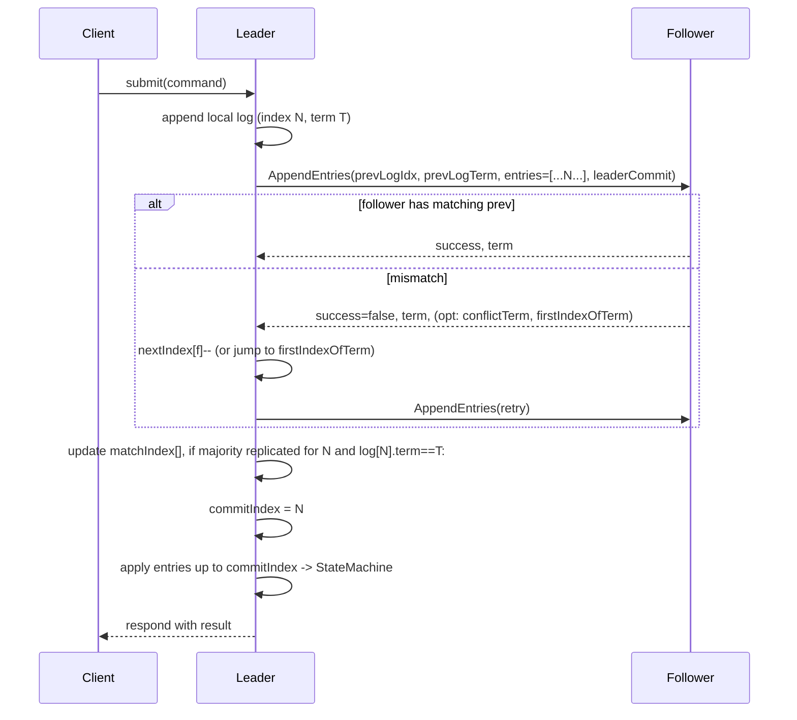

> 大家好，我是大头，职高毕业，现在大厂资深开发，前上市公司架构师，管理过10人团队！
> 我将持续分享成体系的知识以及我自身的转码经验、面试经验、架构技术分享、AI技术分享等！
> 愿景是带领更多人完成破局、打破信息差！我自身知道走到现在是如何艰难，因此让以后的人少走弯路！
> 无论你是统本CS专业出身、专科出身、还是我和一样职高毕业等。都可以跟着我学习，一起成长！一起涨工资挣钱！
> 关注我一起挣大钱！文末有惊喜哦！

> 关注我发送“MySQL知识图谱”领取完整的MySQL学习路线。
> 发送“电子书”即可领取价值上千的电子书资源。
> 发送“大厂内推”即可获取京东、美团等大厂内推信息，祝你获得高薪职位。
> 发送“AI”即可领取AI学习资料。

# 分布式共识领域经典论文Raft详解

分布式领域大名鼎鼎的`Raft`，大家应该都听过吧，Raft实际上是`Paxos`的简化版本，而`Paxos`这个东西，在区块链领域也是经常被使用的。

很多人也管Raft叫分布式一致性协议，都是一个意思，我个人觉得`Consensus`翻译成`共识`更合理一些。

`Raft`解决了脑裂问题和单点故障问题。

采用的是一种`Majority Vote(多数投票)`方式，这种方式要求服务器数量必须是`奇数`个，只有这样才能保证有多数，也就是最低需要三个服务器。只要其中的2个服务器投票出一个leader就可以了，所有的操作由leader来决定。

另一个比较有趣的点在于，假设现在有服务器ABC三个，A是leader，因为A获取了AB的投票。当A失去连接的时候，C成为了leader，因为C获取了BC的投票。

> 对于A的投票和C的投票来说，其中一定有B服务器的一票，用数学概念来说，就是上一个leader的投票者是一个集合a，当前leader的投票者是一个集合b，集合b一定和集合a相交。因此当前leaderC一定知道上一个leaderA的任期是什么时候。因为B作为投票者是知道A的任期的。

`Raft`实际上是一个偏低层的`library(库)`。它的上面是应用层序代码，Raft只复制操作日志，并保持日志的一致性。

简单了解下本次论文的基本信息
- 论文标题：In Search of an Understandable Consensus Algorithm (Extended Version).
- 作者：Diego Ongaro, John Ousterhout.
- 发表/发布时间：Extended tech report / ATC’14 / Published May 20, 2014. 
- 实现/开源参考：作者实现用于 RAMCloud，约 2000 行 C++ 实现；并有若干第三方实现（LogCabin 等）。
- 引用次数 / 影响指标：论文在分布式系统领域影响极大（被广泛采用于分布式系统教材、工业实现以及后续研究，论文自身及后续工作/实现众多）。论文中给出用户研究（43 名学生）和若干实测数据作为影响性证据（见下）。
- 论文的重要性与影响力
    - 可读性/教学：作者做了用户研究，43 名学生中多数在 Raft 的测试中得分更高（平均比 Paxos 高 4.9 分 / 60 分）。33/43 的学生在 Raft 测验得分高于 Paxos。论文因此在教学与普及上有明确证据。
    - 工程采用：作者实现（RAMCloud）与多个开源/商用实现（LogCabin 等）均基于 Raft，说明工业采用度高。
    - 证明与形式化：作者提供了 TLA+ 规格与（部分）机械证明（Log Completeness 已用 TLA 证明），增强可信度。

本次论文使用的是一种`replicated state machine`的复制模型，关于这种复制模型，在上一次`VMWare FT`的论文中也有提到。

研究背景：复制状态机（replicated state machine）需要一致的顺序复制日志。传统 `Paxos` 虽然正确但难以理解与工程实现复杂；工业系统需要更易实现、易推理且便于扩展/运维的算法。

给出两个使用场景：

场景 1（配置管理/元数据服务）
> 一个分布式文件系统（如 GFS/HDFS/RAMCloud）需要一个可靠且可移植的配置/leader 管理服务。要求：在任意非拜占庭故障下保证安全（state machine safety）并在多数可达时可用。Raft 用 leader+复制日志来满足该需求。

场景 2（在线扩容与替换节点）
> 在不停止服务的情况下替换/扩容集群（例如从 3 节点扩到 5 节点）且保证在迁移期间不会出现两个并行的多数形成导致 split-brain。Raft 提出 joint consensus（联合配置） 的两阶段变更方案来解决此类问题。

技术难度等级与复现难度评估
- 技术难度（理解/实现）：中等偏高（概念比 Paxos更易理解，但要正确实现诸如持久化、日志一致性修复、配置迁移与快照仍需细心）。
- 复现难度：较低到中等（论文给出完整协议描述、RPC 消息定义、快照与 reconfiguration 机制；辅以作者的实现与 TLA+，复现可行，但工程细节如持久化顺序、并发、性能调优仍需工程工作）。

## 核心贡献与创新点

主要技术贡献
1. 强主领导 `(Strong Leader)` 设计
    - 效果：将所有日志写入/流动都由 `leader` 单向下推，简化协议。
    - 量化：消息类型少（论文指出比 VR/其它少），常见写操作在 `leader` 存储后到过半节点只需 1 个远程往返（`1 RTT to majority`）完成复制确认的条件，性能与 `multi-Paxos` 类似。
2. 简洁的一致性检查与冲突恢复（AppendEntries prevLogIndex/prevLogTerm）
    - 效果：通过 `prevLogIndex/prevLogTerm` 的一致性检查——若不匹配， `follower` 拒绝并 `leader` 递减 `nextIndex retry`，直至找到匹配点，最终保证日志匹配性。
    - 量化：在正常（一致）情况下0 次拒绝，在异常情况下最多按`term`数量而非条目数量进行冲突修复（可通过优化告知冲突 term & firstIndex，减少 RPC 次数）。
3. 基于投票的选举限制以保证安全（Election restriction）
    - 效果：`RequestVote` 含 `lastLogIndex/lastLogTerm`，只有日志`至少同样新`的候选人才会被投票，从而保证 `Leader Completeness`（已提交的 entry 必在后继 leader 中）。
    - 量化保证：最多 一个 `leader per term`（Election Safety），已被论文证明（证明概要在 §5.4）。
4. 成员变更的 joint consensus（双阶段）
    - 效果：通过在日志中加入 Cold,new 的联合配置来保证在迁移时两个配置的多数重叠，避免 C_old 与 C_new 在迁移中各自选 leader 导致不安全。
    - 量化：迁移期间需要满足两个多数同时确认（cold 和 new），故在迁移阶段系统仍可继续服务（没有停机）。
5. 可实用的快照（InstallSnapshot RPC 与 chunking）
    - 效果：支持把日志前缀压缩为 `snapshot`，并用 `InstallSnapshot chunk` 传输给 lagging follower，chunk 提供 liveness 以重置 follower 选举定时器。
    - 量化：InstallSnapshot 包含 lastIncludedIndex/term、offset、data[]、done 标志；快照允许 leader 丢弃 log 到 lastIncludedIndex，从而控制磁盘占用。

与现有方案的创新之处

| 比较项     |                                      Raft（本论文） |                 Multi-Paxos / Paxos | Viewstamped Replication (VR) |
| ------- | ---------------------------------------------: | ----------------------------------: | ---------------------------: |
| 核心思想    |                 强 leader + 日志复制（AppendEntries） |       基于 single-decree Paxos 组合为多决议 |     leader-based，但允许选举期间交换日志 |
| 领导选举    | 随机化 election timeout + RequestVote（包含 lastLog） |                  leader 机制是优化，基础较隐晦 |         leader 选举包含更多步骤与状态转移 |
| 日志一致性检查 |         prevLogIndex + prevLogTerm（一致则 append） |                    通常靠 Paxos 多轮阶段保证 |                 允许双向流动，复杂度更高 |
| 配置变更    |          joint consensus（两阶段、overlap majority） |                        有方案但多依赖工程化修改 |               多数实现停止正常处理或更复杂 |
| 消息类型    | 少（RequestVote, AppendEntries, InstallSnapshot） |                较多（prepare/accept 等） |                           较多 |
| 教学/理解难度 |                                  明显降低（实验 43 人） |                        难以直接理解、需多次解读 |                       介于两者之间 |
| 性能（写操作） |              1 RTT to majority（类似 multi-Paxos） | 1 RTT to majority（优化后的 multi-Paxos） |                     类似但实现更复杂 |

> 结论：Raft 在可理解性 + 工程实现两方面优于 Paxos；在性能上与成熟 multi-Paxos 可比。

解决了哪些此前未解决的问题（before/after）
- Before（Paxos/其它）：难以将 single-decree 描述扩展为实用 multi-decree 实现；实现差异大且容易有安全漏洞。
- After（Raft）：通过把“选举/复制/安全/变更”分离、引入明确的 RPC 与数据模型，降低实现难度与错误几率（并且论文给出 TLA+ 规格与实际实现）。

## 系统架构深度解析

- 客户端 → Leader：客户端请求写命令发送到 leader。若联系到 follower，follower 会 redirect（返回 leaderId）或客户端重试。
- Leader 管理日志：Leader 在本地 append entry（带当前 term），并以 AppendEntries RPC 并行发送到每个 follower（作为心跳也使用空 entries）。AppendEntries 包含 prevLogIndex、prevLogTerm、entries[]、leaderCommit。
- Follower 行为：若 AppendEntries 一致（prev term/index 匹配），follower append new entries 并回复 success；否则拒绝，leader 递减 nextIndex 并重试，直至匹配点。
- Commit 规则：Leader 若发现某 index N 满足：N > commitIndex 且 多数 matchIndex[i] ≥ N 且 log[N].term == currentTerm，则 leader 将 commitIndex 置为 N（仅当前 term 的 entry 能被 count 成 commit）。这保证了安全性。
- Snapshot / Log compaction：服务器会在本地做 snapshot（保存 lastIncludedIndex/term），leader 使用 InstallSnapshot RPC 分块传输给 lagging follower 并在完成后 follower 丢弃相应前缀 log。

```Mermaid
flowchart LR
  subgraph Client
    C[Client]
  end

  subgraph Cluster
    L[Leader]
    F1[Follower1]
    F2[Follower2]
    F3[Follower3]
    SnapshotStore[Snapshot Store]
  end

  C -->|Requests| L
  L -->|AppendEntries RPC (prevLogIdx/term + entries)| F1
  L -->|AppendEntries RPC| F2
  L -->|AppendEntries RPC| F3
  F1 -->|reply (success/term)| L
  F2 -->|reply| L
  F3 -->|reply| L

  L -->|InstallSnapshot RPC (chunks)| F3
  F3 -->|write snapshot| SnapshotStore
```

### 各组件功能和职责

1) PersistentStore（持久化）
- 职责：持久化 currentTerm, votedFor, log[], snapshots。必须在响应某些 RPC 前将 currentTerm & votedFor 写盘（论文要求“Updated on stable storage before responding to RPCs”）。
- 输入：写请求（appendEntry、snapshot）、更新 currentTerm/votedFor。
- 输出：读取 log / term / votedFor。
- 生命周期：与节点一致；恢复时加载。实现要求顺序写 (WAL) 或直接 fsync 确保耐久性。

2) RaftNode（协议状态机）
- 职责：维护 Raft 状态（persistent + volatile + leader volatile arrays），处理 RequestVote/AppendEntries/InstallSnapshot RPC；执行选举与日志复制逻辑。
- 输入：RPC 请求（RequestVote, AppendEntries, InstallSnapshot）、客户端命令。
- 输出：RPC 响应；当 commitIndex 前进时，将日志 entry 交给应用 StateMachine 执行。
- 状态：Follower / Candidate / Leader；转换规则在 §5.1–5.3。
- 生命周期：启动→加载持久化→成为 follower→基于定时器转换/选举/领导→崩溃恢复。

3) NetworkRPCLayer

- 职责：可靠地（重试/并行）发送 RPCs，记录 response errors/latency，支持 chunked InstallSnapshot。
- 输入：RPC 消息（序列化 bytes）。
- 输出：RPC responses；超时/重试。
- 实现建议：异步 RPC（Netty/Netty-like），连接池和并行调用。论文指出并行发 RPC 以提高效率。

4) StateMachine（应用层）

- 职责：应用已 commit 的命令；做 snapshot（可选）并返回命令执行结果给客户端。
- 输入：已提交的 log entries（按 index 顺序）。
- 输出：操作结果；当做 snapshot 时输出 snapshot blob + lastIncludedIndex/term。

组件间交互流程


### 数据流与控制流

1. 接收：Client → Leader：command。Leader append 本地 log（index N, term T），持久化（append、fsync 根据 durability 策略）。
2. 复制：Leader 并行对所有 followers 发送 AppendEntries (包含 prevLogIndex/prevLogTerm 和 entries[N])。网络层负责重试超时。
3. 确认：多数 followers 返回 success → leader 更新 matchIndex[] 与 nextIndex[]。Leader 判断若 N > commitIndex 且 多数 matchIndex ≥ N 且 log[N].term == currentTerm → 将 commitIndex=N。（只有当前 term 的 entry 可直接通过多数计数提交）。
4. 应用：Leader 触发将 commitIndex 前的 entries 交给 StateMachine 逐条执行（lastApplied 前进）。Follower 在收到 leaderCommit 的 AppendEntries 或心跳时更新自己的 commitIndex，并按顺序 apply。
5. 响应客户端：Leader 在本地 apply 后返回执行结果给客户端（或在某些实现中在 commit 到多数后立即返回取决于语义与性能权衡，Raft 推荐在 apply 后返回结果以保证 linearizability）。

## 数据结构与算法详解

定义一个Log Entry
```go
// Go 风格（方便阅读）
type LogEntry struct {
    Index uint64      `json:"index"`       // log 索引（1-based）
    Term  uint64      `json:"term"`        // 时期号（term） — 用来做一致性判断
    Cmd   []byte      `json:"command"`     // 状态机命令的序列化字节
}
```

定义一个Raft 节点

```go
type Raft struct {
	mu        sync.Mutex          
	peers     []*labrpc.ClientEnd 
	persister *Persister          
	me        int                 
	dead      int32               

	logger *Logger // 结构化日志记录器

	// 需要持久化
	currentTerm int        //当前任期
	votedFor    int        // 投票给谁
	log         []LogEntry // log信息

	// 不需要持久化
	commitIndex int // 已提交的最大索引
	lastApplied int // 已应用到状态机的最大索引

	// leader的属性
	nextIndex  []int // 对每个 follower，下次要发送给每个follower的日志索引
	matchIndex []int // 对每个 follower，对端已复制的最大日志索引

	// 节点状态
	status RaftStatus
	// 心跳时间
	lastHeartBeatTime atomic.Value
	// 条件变量用于心跳控制
	heartbeatCond *sync.Cond
	// 标记是否需要立即发送心跳
	needHeartbeat bool
	// 标记心跳goroutine是否应该停止
	stopHeartbeat bool
	// 通道
	applyCh chan ApplyMsg
}
```

实现Leader选举的部分代码,这是一个选举定时器，定时触发，触发以后会开启选举
- 变成Candidate
- 投自己一票
- term++
- 请求其他服务器获取投票

```go
// 选举定时器
func (rf *Raft) runElectionTimer() {
	// Sleep 随机毫秒数
	// 创建一个计时器
	// 定义随机超时范围（论文推荐 150-300ms）
	minTimeout := 150 * time.Millisecond
	maxTimeout := 600 * time.Millisecond
	// 生成定时器追踪ID
	timerTraceID := fmt.Sprintf("TIMER_%d", rf.me)
	trace := TraceContext{
		TraceID: timerTraceID,
		From:    -1, // 内部定时器事件
		To:      rf.me,
	}
	for !rf.killed() {
		timeout := randomTimeout(minTimeout, maxTimeout)
		since := time.Since(rf.lastHeartBeatTime.Load().(time.Time))
		if since > timeout {
			rf.mu.Lock()
			if rf.status == Leader {
				rf.mu.Unlock()
				return
			}
			rf.becomeCandidate()
			me := rf.me
			currentTerm := rf.currentTerm
			lastLogIndex := rf.log[len(rf.log)-1].Index
			lastLogTerm := rf.log[len(rf.log)-1].Term
			// 超过超时时间
			rf.logger.LogWithTrace(TIMER_EVENT, trace, "超时选举 since:%v threshold:%v", since, timeout)
			// 重置选举定时器
			rf.lastHeartBeatTime.Store(time.Now())
			rf.mu.Unlock()
			// 给其他节点发送请求投票 RPC
			rf.broadcastVote(me, currentTerm, lastLogIndex, lastLogTerm)
		}
		time.Sleep(10 * time.Millisecond) // 优化选举定时器检查频率，减少CPU消耗
	}
}
```

实现Leader投票逻辑的部分代码,主要内容为检查候选人日志是否满足最新的条件
- 要么term比我大
- 要么term一样，日志比我长

```go
func (rf *Raft) RequestVote(args *RequestVoteArgs, reply *RequestVoteReply) {
	rf.mu.Lock()

	currentTerm := rf.currentTerm
	me := rf.me
	lastLogIndex := rf.log[len(rf.log)-1].Index
	lastLogTerm := rf.log[len(rf.log)-1].Term
	status := rf.status
	defer rf.mu.Unlock()
	// 检查是否满足条件 满足就投票
	// 创建追踪上下文
	trace := TraceContext{
		TraceID: args.TraceID,
		From:    args.From,
		To:      me,
	}

	rf.logger.LogWithTrace(RPC_RECV, trace,
		"RequestVote 接受 term:%d candidateId:%d lastLogIndex:%d lastLogTerm:%d currentTerm:%d status:%s",
		args.Term, args.CandidateId, args.LastLogIndex, args.LastLogTerm, currentTerm, getStatusString(status))
	// 如果 RPC 的 term < currentTerm，立即回复 false（拒绝），并返回自己的 currentTerm。
	if args.Term < currentTerm {
		reply.Term = currentTerm
		reply.VoteGranted = false
		return
	}
	// currentTerm := rf.currentTerm
	if args.Term > currentTerm {
		// 如果 RPC 包含更大的 term，要更新并退化为 follower
		rf.becomeFollower(args.Term)
	}
	currentTerm = rf.currentTerm
	votedFor := rf.votedFor
	// 否则（term >= currentTerm）需要检查两点：
	// 本节点尚未在该 term 投票（votedFor == -1 或已投给 candidateId）；
	rf.logger.LogWithTrace(RPC_RECV, trace, "投票信息 votedFor:%d lastLogTerm:%d lastLogIndex:%d commitIndex:%d", votedFor, lastLogTerm, lastLogIndex, rf.commitIndex)
	if votedFor == -1 || votedFor == args.CandidateId {
		// 检查候选人是否包含所有已提交的日志条目
		// 候选人的日志至少跟接收者的日志一样新（比较 lastLogTerm，若相同则比较 lastLogIndex）。
		if args.LastLogTerm > lastLogTerm || (args.LastLogTerm == lastLogTerm && args.LastLogIndex >= lastLogIndex) {
			// 满足这两点则授予投票（voteGranted = true），并把 votedFor = candidateId（并在稳定存储上持久化）。
			rf.logger.LogWithTrace(RPC_RECV, trace, "投票给 candidate:%d term:%d", args.CandidateId, args.Term)
			rf.grantVote(args.CandidateId)
			reply.VoteGranted = true
			reply.Term = currentTerm
			// 重置选举定时器
			rf.lastHeartBeatTime.Store(time.Now())
			return
		}
	}
	rf.logger.LogWithTrace(RPC_RECV, trace, "投票失败兜底 candidate:%d term:%d", args.CandidateId, args.Term)
	reply.Term = currentTerm
	reply.VoteGranted = false
}
```

### 并发安全设计

- 单线程事件循环（推荐）：将 RaftNode 的核心 state 在单一 goroutine / single-thread event loop 中操作（避免细粒度锁），RPC handler 将请求放入消息队列，由该线程串行处理。此设计在多个 Raft 实现中常见，简化并发错误。
- R/W 锁方案：若必须多线程，可用 ReentrantReadWriteLock（Java）/sync.RWMutex（Go）保护 PersistentState 的读写，写路径（append / update currentTerm/votedFor）必须获得写锁并在完成持久化后释放。
- 无锁优化：对 nextIndex[] / matchIndex[] 可使用原子操作（atomic longs）以减少阻塞；不过须小心与持久化一致性交互。论文强调稳定性优先于复杂无锁微优化。

### 缓存与持久化策略

- 缓存：内存保存最近 N 个 log entries（热区），log 存储做 segment（按大小切分）并在后台合并/压缩。
- 持久化策略：currentTerm 与 votedFor 需在相关 RPC 响应前写盘（写入 WAL 并 fsync），log append 可批量 flush（batching）以换取吞吐。论文指出 RPC 通常需要持久化，broadcastTime 受持久化技术影响（0.5ms – 20ms）。

### 算法复杂度分析

- 写操作时间复杂度：正常情形为 O(1) RTT to majority（leader→多数 follower 的并行 RPC，单个网络往返）。本地开销包含持久化 fsync（取决于存储）。
- 空间复杂度：每个节点保存完整日志（或 snapshot + suffix），因此 O(L)（L = log length）。使用 snapshot 后可把前缀丢弃。
- 通信复杂度：leader 向所有 followers 广播 AppendEntries（O(n) 消息），但成功确认只需 majority。在不一致修复场景，可能需多次重试（按冲突 term 数量）。

### 算法优化技巧与实现细节

- 批处理 + pipeline：批量发送多个 entries、并在网络层 pipeline（并发发送下一个 AppendEntries）以提高吞吐。论文建议这类优化易实现。
- 冲突跳跃优化：follower 回报冲突的 term 与 firstIndexOfTerm，leader 能跳过整个冲突 term，减少 RPC 次数。
- copy-on-write snapshot：snapshot 写入时使用 COW 或 fork 技术，以避免阻塞正常请求（论文实现使用 fork）。

## 容错与一致性机制详解

故障模型定义
- 假设：非拜占庭（fail-stop）节点崩溃、网络分区、消息延迟/丢失/重传、节点重启且能从 stable storage 恢复。论文假设服务器 crash-stop model（non-Byzantine）。

一致性算法（Raft 具体实现要点）
- Leader election（RequestVote）：候选人 increment term、vote for self、并行 send RequestVote。投票规则：如果 candidate.lastLog 至少跟 voter 的 log 一样新，则 voter 授票（同时确保 voter 在该 term 只投一次）。若接收到 AppendEntries with ≥ term 则退回 follower。
- 日志复制（AppendEntries）：Leader 包含 prevLogIndex/prevLogTerm 以一致性检查；若 follower 不匹配则拒绝并可能回报冲突信息。leader 递减 nextIndex 并重试直至达到匹配点。
- 提交（commit）：leader 只通过检查自己当前 term的 entry 的多数复制来直接 commit；这种设计避免了 Figure 8 类的安全问题。

容错恢复流程（故障检测、leader 选举、数据恢复）
- 故障检测：follower 通过 election timeout 未收到 heartbeat 将发起选举。论文建议 election timeout 远大于 broadcastTime（broadcastTime ≪ electionTimeout ≪ MTBF）。
- Leader 选举：候选人获多数投票成为 leader，发送空 AppendEntries 来稳定集群。选举冲突的概率由随机 election timeout 降低。
- 数据恢复（lagging follower）：leader 对 lagging follower 递减 nextIndex 并发送 AppendEntries，若 leader 已丢弃该 follower 所需条目则发送 InstallSnapshot。Follower 在完成 snapshot 安装后保留 log suffix 并继续复制。

一致性级别与权衡（强一致性 vs 最终一致性）
- Raft 提供强一致性（linearizability）：通过 leader commit 策略 + leader completeness + read precautions（leader 在本 term commit no-op 或 heartbeats to majority）来确保线性一致的读/写语义。
- 权衡：在 Leader election 期间系统不可用（短暂），选举时间受 election timeout 控制（paper 给出推荐 150–300ms）。降低 election timeout 可以缩短恢复时间但增加错误选举概率。

## 性能优化策略详解

性能瓶颈分析
- 磁盘 fsync（持久化）：每次写入 currentTerm / log append 的 fsync 会增加 broadcastTime（论文估计 0.5ms–20ms 取决于存储）。
- 网络延迟：AppendEntries 是主通路；网络 RTT 与丢包会直接影响写延迟。
- 单 leader 的吞吐限制：leader 必须处理所有写请求并广播，会成为吞吐瓶颈（可以通过 batching/pipelining 缓解）。

具体优化技术（可直接实现）
- 批处理（batching）：在 leader 汇总多条 client 请求为单个 AppendEntries batch，减少 per-entry overhead。
- 流水线（pipelining）：leader 对 follower pipeline 多个 AppendEntries 请求（不等待单个请求完成再发送下一批），提高吞吐。
- 冲突 term 跳跃：follower 在拒绝时回报冲突 term/firstIndex，leader 能跳跃回退，减少多次单条回退。
- 异步持久化：对于非强持久（tradeoff），可以把某些持久性延迟到后台 flush，但需要在设计中考虑丢盘恢复时的安全边界。论文默认倾向于在 RPC 响应前持久化以保证 safety。

负载均衡算法（任务分配）
- Raft 本身是强 leader 模型，不直接提供跨 leader 的负载分散；系统通常将读流量分散到 followers（需注意 linearizability）或在单 leader 内做水平分片（每 shard 一套 Raft）。论文讨论 read-only 的安全处理（leader 需 commit no-op 或向多数发送心跳保证）。

资源调度策略（优先级队列等）
- 建议对 replication 重试/InstallSnapshot 等 I/O 操作使用独立的线程池，避免阻塞主处理 loop；对客户端请求使用优先级队列（读 vs 写区分）以减少读请求等待写提交的延迟（实现细节超出论文范畴，但工程常用）。

## 实验评估深度分析

实验设置与测试环境（论文中给出的）
- 实现语言：C++（作者实现 ~2000 LOC），源代码公开（LogCabin 等为第三方实现）。
- leader election 测试：在 5 节点集群上测量 leader crash → 新 leader 选举时间分布；测试 varying election timeout 随机化（例如 150–155ms, 150–300ms 等）并绘制 CDF。论文中给出实验图和采样（1000 trials / line）。实验中 broadcast time ≈ 15ms（用于计算 timeout 与 elect timing）。

关键性能指标（论文中确切给出的数值）
- 用户研究（可理解性）：43 人参与，Raft 平均得分 25.7/60，Paxos 20.8/60，平均 Raft 比 Paxos 高 4.9 分。
- leader election downtime（示例数据）：
    - 随机化 5ms 时，median downtime ≈ 287 ms；50ms 随机时 worst-case 513 ms（1000 trials）。
    - 若 election timeout 设置为 12–24 ms，平均选举耗时 ≈ 35 ms（最长 152 ms）。论文同时建议保守 timeout 150–300 ms 以避免不必要 leader churn。
- 实现规模：作者实现约 2000 行 C++（不含测试/注释）。

> 注意：论文没有给出明确的 QPS / P99 延迟数值（以 requests/sec 或具体 P99 ms）作为可比基准（只说明 Raft 与 Paxos 同量级、并容易支持 batching/pipelining）。因此若需要 QPS/P99 指标，你需要在复现平台上跑基准（我在下面给出可执行的测量建议）。


性能曲线分析（扩展性、负载影响）
- 扩展性：Raft 是 leader-based，单个 leader 作为瓶颈；水平扩展通常通过 sharding（每个 shard 一套 Raft）或读分流（慎用）实现。论文表明 5/9 节点测试选举结果相似（选举延迟对节点数有影响但与 election timeout/ broadcastTime 更相关）。


故障注入测试结果（论文摘要）
- 论文对 leader crash 的实验展示了不同 election timeout & randomization 的影响，指出合理随机化与 timeout 设置可显著降低 downtime。没有给出大量网络分区或磁盘损坏的定量数据。

与 baseline 的详细对比（性能提升 %）
- 论文并未给出与 Paxos 在同平台下的直接 QPS/P99 数值对比（主要比较的是理解性与实现复杂度）。因此无法给出精确“提升百分比”。我建议若需要数字化对比，你可复现 multi-Paxos 与 Raft 的同一实现（相同持久化/序列化/网络栈）并测量吞吐/延迟。

系统局限性与适用范围（明确边界）
- 适合：需要强一致性、可以容忍单 leader 瓶颈的配置管理、元数据服务、分片式系统的每个 shard。
- 不适合：拜占庭环境（需 PBFT 类算法）；对超低延迟、极高吞吐（需要 multi-leader 或无中心架构）的单一服务（除非水平分片）。
- 边界条件：如果广播时间(broadcastTime) 接近 electionTimeout，会导致 leader churn，需调整超参数或更换同步机制。

## 实现指导：代码级别

技术栈建议（可直接用）
- 语言：Java（示例与生产可用），也可用 Go/C++。作者实现为 C++（2000 LOC）。
- 网络框架：Netty（Java，异步高效）、gRPC（with protobuf）— 推荐 Netty + protobuf。
- 持久化引擎：直接文件 + WAL segments；对于高性能持久化可配 RocksDB/LevelDB 存储 command payloads 并将 metadata 写入 WAL。
- 消息队列：不必（Raft 本身管理复制）；如需要异步任务可接 Kafka 做上层消息缓冲（非必需）。
- 监控：Prometheus metrics：currentTerm, commitIndex, lastApplied, leaderId, nextIndex[], matchIndex[], appliedQPS, commitLatency P50/P95/P99, electionCount。
- 测试框架：JUnit/Testcontainers（Java），Chaos 工具如 Jepsen 或自写故障注入脚本。

关键配置参数（推荐）
- electionTimeoutMin = 150 ms, electionTimeoutMax = 300 ms（论文建议 conservative）。
- heartbeatInterval = electionTimeoutMin / 2（heartbeat 频率应小于 electionTimeout）。
- snapshotThreshold = X bytes（根据服务状态体大小调整；常设为几百 MB 以避免频繁 snapshot）。

分阶段实现计划（不含时间估算 — 因为我不能给未来时间估计）

第一阶段：核心引擎（Deliverables: PersistentState, RaftNode 单机）
- 实现 PersistentState（WAL）与 LogEntry 类（Java 实现）。
- 实现 RequestVote / AppendEntries handler + RPC layer（本地 loop 测试）。
- 实现 leader election 测试用例（单节点崩溃/恢复）。
- 单机验证：用单机多进程/线程模拟 3 节点 cluster。

第二阶段：分布式扩展（Deliverables: Networked cluster）
- 网络层稳定（Netty + protobuf）；并行 RPC 与重试机制。
- 实现 leader replication（nextIndex/matchIndex 更新）、commit 判定逻辑。
- 引入 snapshot/InstallSnapshot 机制（chunk 传输）。
- 集群级别集成测试（故障注入：kill leader / network partition）。

第三阶段：性能优化与运维（Deliverables: Benchmark + monitoring）
- 批处理、pipeline、冲突跳跃优化实现。
- 集成监控指标（Prometheus）、日志/追踪（OpenTelemetry）。
- 基准测试套件（通过put/get workloads 测量吞吐、P99、选举 downtime）。

## 开源参考与学习资源

- LogCabin（GitHub，作者后续实现之一，基于 Raft）：https://github.com/logcabin/logcabin（论文中提到）。 
- Raft 官方网站 / 实现合集：raftconsensus.github.io（集合多个实现与资源）。
- TLA+ 规格与证明：作者提供的 TLA+ 规范（用于证明 Log Completeness）。

### 学习路径（优先级）

- 分布式系统基础：阅读 Schneider 的 tutorial（replicated state machine），Lamport 的 TLA+ 入门章节。
- Raft 论文与实现：阅读本论文 + 查看 LogCabin 源码。
- 并发/网络编程：掌握 Netty/async RPC 与持久化 WAL 设计。
- 形式化：TLA+ basics（有助于理解并证明 invariants）。

## 总结

Raft最重要的其实就三个点
- Leader选举
- 日志复制
- 安全性实现

但是真要实现一个Raft有很多细节问题需要处理
- 如何初始化，一开始都是Follower然后触发选举，还是自动第一个Leader，另外两个Follower呢？
- AppendEntries如何区分心跳和真正的日志复制
- 如何重置选举定时器

非常推荐大家尝试自己实现一个，会遇到非常多的细节问题，将这些问题解决会加深对Raft的理解～

大家阅读论文的时候更关心什么呢？论文的核心思想？具体实现？可以评论区留言讨论～

## 文末福利

> 关注我发送“MySQL知识图谱”领取完整的MySQL学习路线。
> 发送“电子书”即可领取价值上千的电子书资源。
> 发送“大厂内推”即可获取京东、美团等大厂内推信息，祝你获得高薪职位。
> 发送“AI”即可领取AI学习资料。
> 部分电子书如图所示。


