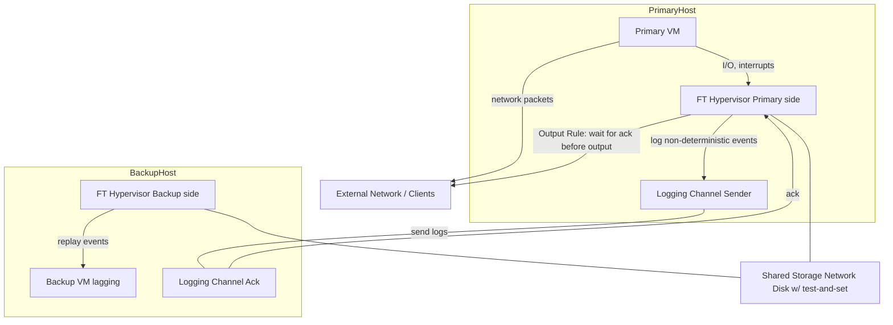
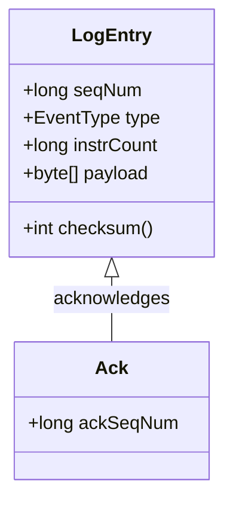

> 大家好，我是大头，职高毕业，现在大厂资深开发，前上市公司架构师，管理过10人团队！
> 我将持续分享成体系的知识以及我自身的转码经验、面试经验、架构技术分享、AI技术分享等！
> 愿景是带领更多人完成破局、打破信息差！我自身知道走到现在是如何艰难，因此让以后的人少走弯路！
> 无论你是统本CS专业出身、专科出身、还是我和一样职高毕业等。都可以跟着我学习，一起成长！一起涨工资挣钱！
> 关注我一起挣大钱！文末有惊喜哦！

> 关注我发送“MySQL知识图谱”领取完整的MySQL学习路线。
> 发送“电子书”即可领取价值上千的电子书资源。
> 发送“大厂内推”即可获取京东、美团等大厂内推信息，祝你获得高薪职位。
> 发送“AI”即可领取AI学习资料。

# 分布式容错论文VMWareFT论文详解

如果出现网络故障、硬件故障，我们仍然可以继续提供服务，我们采用的是`Replication(复制)`来实现的。

复制可以处理哪些故障：
- 单台计算机的Fail-stop
- Fail-Stop指的是一些硬件和网络故障，这些故障会导致你的计算机停止运行，而不是输出错误。比如：拔掉你的电源插头、拔掉你的网线、你的电脑风扇坏了导致CPU过热等
- 一些硬件故障可能会从Bug变成可以处理的Fail-Stop，比如网络传输中某些数据发送了错误，会通过校验和发现这种错误。

复制不可以处理哪些故障：
- 软件或者硬件设计缺陷之类的东西，简称Bug。这是因为复制会将这些Bug造成的内容一起复制到其他服务器，因此所有服务器运算的结果依然是错误的。
- 如果Primary服务器和Backup服务器之间的错误是有关联的，那么也没办法处理。比如你购买了同一种服务器无数台，那么它们可能有相同的缺陷，因此复制到其他服务器上也没办法解决，还有比如发生了地震，那么所有服务器都会损坏，复制也没有办法，当然，可以通过多机房放在不同地方来解决。

我们先看一下这个论文的大概，这是一篇讲解分布式容错算法的论文，对于理解`容错`非常有帮助。实现的是一个单核CPU的VM级复制。

- 论文标题：The Design of a Practical System for Fault-Tolerant Virtual Machines
- 作者：Daniel J. Scales, Mike Nelson, Ganesh Venkitachalam (VMware, Inc.)
- 发表年份 / 出处：2010（VMware / 学术/工程报告，常见镜像存放在 MIT 6.824 课程资源与多处讲义中）。
- 引用次数（近似）：此论文在云/虚拟化与容错领域被广泛引用（参见学术与课程引用列表，论文在课程资源中作为案例广泛使用）
- 要解决的技术问题（一句话）：为任意 x86 单核 VM 提供透明、低开销的主/备（primary/backup）故障转移，使备机能够在主机故障时无缝接管、并保证对外可见操作不丢失或产生不一致。
- 研究背景与两个具体场景：
    - 企业级应用（如传统 SMTP、数据库守护进程）希望在硬件或物理服务器故障时“零停机”或最小中断。把原有服务改造成本地冗余/复制成本高或改造复杂，VM-FT 的思路是“对整个虚拟机做透明复制”，对上层应用完全透明。
    - 在数据中心里，某台宿主机宕机需快速恢复：假设有一个邮件服务器 VM 在主机 S1 上运行，S1 崩溃，备机 S2 需在毫秒/秒级别接管并对外继续提供服务，而不会丢失或重复产生不一致的外部可见输出（或至少能由 TCP 等协议吞掉重复）。
- 论文重要性与影响力：
    - 领域价值：把`确定性重放 + 主/备复制`工程化并商用化（VMware vSphere FT），展示“在 `hypervisor` 层做确定性复制”的可行性与工程细节——这是虚拟化容错方向的里程碑式工程论文。
    - 实践影响：论文给出了工程实现细节（日志、输出规则、bounce buffers、共享磁盘协调、恢复流程等），对研究与工业实现均有直接借鉴价值。
- 技术难度等级与复现难度（量化评估）：
    - 技术难度（1-10）：8/10（需要对 x86 指令语义、hypervisor 内部、设备模拟、时序与中断、DMA 与 I/O race 有深入理解）。
    - 复现难度（1-10）：8/10（论文涉及大量与虚拟化平台紧耦合的工程细节；需要修改/扩展 hypervisor，获取/控制精确的 instruction-count 中断或性能计数器，且要处理多种设备行为的不确定性）。

## 核心贡献与创新点

- 工程化的确定性重放（Deterministic Replay）在 Hypervisor 层的实现
    - 说明：捕获并记录主 VM 的所有非确定性事件（例如外部中断、時間讀取、I/O 完成事件、某些设备 DMA 交互），并在备机上按相同顺序/时刻重放。
    - 可量化指标：主/备保持“虚拟锁步”所需的额外带宽通常 < 20 Mbit/s（论文在若干真实应用下测得）。主机性能开销通常 < 10%。
- 输出规则（Output Rule）与系统安全边界
    - 说明：在主发送任何对外部可见的输出（网络发送或存储提交）之前，必须确保备已经确认处理并记录了导致该输出的所有日志项，从而避免在主失败后输出丢失或未同步。
    - 量化：通过采样（表格）显示即便遵守 Output Rule，吞吐率下降有限（论文给出表格数据，整体开销低）。
- 工程细节以解决 I/O 竞态（bounce buffers、测试与重发机制）
    - 说明：引入 bounce buffer，避免 DMA 直接进入 guest 内存导致主备在时序上读到不同数据而产生分歧。使用共享磁盘的 test-and-set 作为 “最后的仲裁器” 避免分裂脑（split-brain）。
- 自动恢复与冗余重建机制（自动在集群其他主机上启动新备）
    - 说明：系统不仅复制执行，而是包含管理层组件来在备失败/主失败后自动再次创建备，恢复冗余。
    - 量化：系统设计支持在少数秒级内重新建立备（论文给出实现细节与流程，但“具体秒数”依硬件/资源情况而变）。
- 可商用的低开销实现
    - 说明：把科研概念（deterministic replay + primary/backup）打磨成可在 vSphere 产品上运行的工程系统，兼顾可用性与性能。
    - 量化：论文 micro/real-app benchmark 显示对多类应用多数场景中性能下降 < 10%，日志带宽需求常 < 20 Mbit/s。

和现有的一些方案的对比

| 维度         |                            VM-FT（论文） |       传统状态转移（state transfer） | 应用层复制（app-specific replication） |
| ---------- | -----------------------------------: | ---------------------------: | ------------------------------: |
| 复制对象       |                    非确定性事件日志 -> 重放指令流 | 传输/同步全量/增量状态（内存页、checkpoint） |                     应用数据结构/消息级别 |
| 带宽需求       | 低（通常 < 20 Mbit/s） |               高（传输内存修改差异或快照） |                     低（仅应用状态/操作） |
| 透明性        |                    高（对 guest / 应用透明） |               中等（需要应用/OS 兼容） |                   低到中（通常需要应用改造） |
| 可复现性 / 一致性 |                       高（备机按相同输入顺序重放） |                    高（如果完整传输） |                  视设计而定（常保证操作顺序） |
| 多核支持       |                    仅单核/单处理器 VM（论文时代） |                       可（按设计） |                          可（依实现） |
| 工程复杂度      |                   高（需 hypervisor 改动） |               中高（需要内存/设备级迁移） |                       中（应用改造成本） |

## 解决了哪些此前未解决的问题

在本论文之前，容错都是对整台机器级别的透明复制或“热备”要么代价很高（传输大量内存/状态），要么需要应用改造。多来源非确定性让“低带宽的主备锁步”难以实现。

本论文通过在 hypervisor 捕获和控制非确定性事件（如中断、时间、设备 DMA），能用较低日志量保持主备同步，并做到对上层完全透明（对应用无改造）。性能开销小于预期（论文给出 <10% 的典型值）。

## 技术突破的关键洞察

把“deterministic replay”从科研概念推进到 hypervisor 层的工程实现——关键在于 hypervisor 可以拦截并规范化所有非确定性事件（包括时间读取、外部中断、设备 DMA 等），这就把“服务器的非确定性”变成了“可记录并重放的事件流”。这比在物理机器上做同样事情要容易得多。

在论文中提到了两种复制类型
- State Transfer(状态转移)：也可以叫做Passive replication
    - 故障后从主机（primary）将整个内存状态传给备机（backup）。
    - 简单直观，但代价高，尤其是应用程序状态大、更新频繁时。
    - 缺点：传输开销大，恢复延迟可能很高。
    - 因为每次都同步全量内存开销很大，因此可以进行增量同步：发送的内存状态包括了上次发送以来产生变化的内存部分。
- Replicated State Machine(状态机复制)：也可以叫做Active Replication
    - 把应用视为一个确定性状态机。
    - 主机和备机接收同样的输入请求，并保证以相同的顺序执行。
    - 如果实现完全确定性，那么即使发生故障，备机也能恢复并继续提供服务。
    - 缺点：需要保证应用的确定性执行，否则会出现状态分歧。
    - 只需要复制那些来自外部的指令就可以了。这样就把不确定性记录了下来，变成了确定性的事件。所有的服务器重放这些外部指令即可。

大家更倾向于使用`Replicated State Machine`的原因是通常来说，外部操作的数量是要远远小于内存的。

## 系统架构深度解析

论文中所描述的整体架构图



系统由三类主要实体组成：
- 主机侧 VM（Primary）
- 备机侧 VM（Backup）
- 共享存储（Shared Disk）和日志/控制通道。

核心在于 FT hypervisor（在主备两侧分别运行）
- 它拦截 VM 与虚拟设备/CPU 的交互，捕获所有`非确定性事件`（比如外部中断、时间读取、网络/磁盘 I/O 完成、性能计数器触发等），把这些事件封装为日志项并通过日志通道发送给备机。
- 备机 FT hypervisor 在收到日志后，以相同的指令计数或事件点“中断”备机并注入相同事件，从而使备机按相同顺序“重放”主机执行。
- 为避免因为 DMA 或 I/O 竞争而导致主备读取不同数据，系统采用 `bounce buffer`：I/O 先拷贝到 hypervisor 专用缓冲区，完成后再同时（以相同虚拟时间点）复制到主/备 guest 内存。
- 输出规则（Output Rule）要求在主发出外部输出前必须等待备机 ack 到位，以保证主失败后备机可以继续且不会丢失外部可见输出。- 共享磁盘的 `test-and-set` 提供了仲裁器，防止网络分区下的 `split-brain`。系统还包含管理层以在故障后自动在集群其他主机上重新创建备。

`deterministic（确定性）`是指程序是按照内部的一条条指令来顺序执行的，因此所有服务器只要顺序执行这些指令，总能产生确定的结果。
`non-deterministic(不确定性)`是指来自外部的指令，比如网络包的到达时间是随机的，这将产生不确定的结果。


### 各组件功能与职责（输入/输出、状态机、生命周期）

- PFT / BFT（FT Hypervisor）
    - 输入：来自 guest 的指令流、设备事件、I/O 完成、时间读取请求；来自日志通道的日志项（备侧）。
    - 输出：日志项（主侧发送）、ack（备侧发送）、控制动作（在 guest 上注入中断或事件）、外部输出放行控制（Output Rule）。
    - 状态机：{Running, LoggingPending, WaitingForAck, PausedForReplay, GoLive}。
    - 生命周期：初始化 -> 维持日志通道与备机同步 -> 在主失败后触发 GoLive -> 完成恢复与通知管理层 -> 可能被替换/重建备机。
- Logging Channel
    - 输入：非确定性事件序列（序号、类型、数据）。
    - 输出：日志发送（主->备）与 ack（备->主）。
    - 属性：可靠性优先（需保证日志到达或重传）；低延迟以限制主备延迟。
- Shared Disk（含 test-and-set）
    - 输入：test-and-set 请求、磁盘 I/O。
    - 输出：test-and-set 返回值、磁盘读写完成信号。
    - 职责：仲裁在网络分区时哪个节点可以 go-live（避免双活）。

流程图如下：

```Mermaid
sequenceDiagram
  participant Client
  participant PrimaryFT
  participant PrimaryVM
  participant LogChannel
  participant BackupFT
  participant BackupVM
  participant SharedDisk

  Client->>PrimaryVM: request
  PrimaryVM->>PrimaryFT: exec (causes non-determ event)
  PrimaryFT->>LogChannel: send(logEntry)
  LogChannel->>BackupFT: deliver(logEntry)
  BackupFT->>BackupVM: inject(event)  -- replay
  BackupFT-->>LogChannel: ack(logEntry)
  LogChannel-->>PrimaryFT: ack
  PrimaryFT->>PrimaryVM: allow output (Output Rule satisfied)
  PrimaryVM->>Client: response
```

关键节点说明：
- 当主 VM 产生非确定性事件（如中断或 DMA 完成）时，主 FT 先把事件封装到日志发送到备；在收到备的 ack 之前，主 FT 不允许与该事件相关的外部可见输出生效（Output Rule）。
- 备收到日志后必须把备机停在与主相同的指令计数点注入相同事件，完成后发回 ack。两侧以 instruction-count 或 CPU performance counter 来对齐“中断点”。

数据流与控制流（完整请求的处理路径）
1. 请求到达主 VM → VM 在 guest OS 内执行产生设备/内核调用 → hypervisor 拦截非确定性点（time, IO complete）并记录日志项。
2. 日志发送 → log channel 将事件推送至备。
3. 备侧重放 → 备 FT 在合适的 instruction-count 中断点插入事件并重放到备 VM。
4. ack 返回 → 备确认后返回 ack。
5. Output Rule 检查通过 → 主 FT 允许主 VM 的输出（网络包或磁盘提交）被真正发送/提交。
6. 若主失败 → 备已经包含所有产生外部输出的前置事件，执行 go-live，继续对外提供服务；必要时重发/重新提交未完成的 I/O。

分层设计与模块划分策略
- 设备/指令捕获层（Hypervisor trap/VM-exit handlers）：负责捕获所有非确定性事件并序列化为日志。
- 日志与网络层（Log channel，Ack）：负责可靠、低延迟传送日志与确认。
- 同步/对齐层（instruction-count 中断、bounce buffer）：将主备在指令级对齐，处理 DMA/内存 race。
- 管理与恢复层（冗余重建、test-and-set 仲裁）：管理 VM 的备份位置、重新创建备、对抗 split-brain。
模块之间以明确接口（log entry 格式、ack 语义、test-and-set 协议）耦合，便于替换日志传输机制或存储后端。

### Logging Channel

主服务器到备服务器之间的数据流同步的通道被称为`Log Channel`。同步的数据事件被称为`Log Event/Log Entry`。

当主服务器遇到故障停止的时候，就不会再往`Log Channel`中发送消息了，备服务器发现没有消息了，就知道主服务器挂了。主服务有一个定时器中断，每秒会往`Log Channel`中发送消息。因此，当1s以后备服务器没有收到消息，就知道主服务器挂了。

当备服务器发现主服务器挂了，备服务器就会变成主服务器。备服务器不再接受主服务器的`Log Entry`。可以自由行动，并且通知客户端请求这个新的主服务器。

### Non-Deterministic Event

`non-deterministic(不确定性)`是指来自外部的指令，比如网络包的到达时间是随机的，这将产生不确定的结果。

- 客户端的请求就是一个不确定性事件，因为客户端请求的到达时间是随机的，不可预测的。

从客户端输入到达，数据包里的数据将会被拿出来，触发IO中断，通过`NIC DMA`将数据包内容写入内存。然后引发操作系统感知到中断。

所以，真正的问题是`中断发生的时间`和`中断恰好发生在哪个指令上`。最好在主服务器和备服务器上是相同的。

- 一些指令也是不确定性事件，比如随机数生成、获取当前时间、获取计算机唯一ID这些。
- 还有就是多核CPU并行程序（所以本论文不考虑）

多核CPU交错执行指令，可能在主服务器上是CPU1获取到lock，而在备服务器上执行的时候确是CPU2获取到lock来执行操作，那么结果就有可能不同了。这是不可预测的结果。

### Log Entry

对于一个`Log Entry`来说，可能包含以下内容：
- 事件发生时候的指令序号。因为如果要同步中断或者客户端输入数据，最好是Primary和Backup在相同的指令位置看到数据，所以我们需要知道指令序号。这里的指令号是自机器启动以来指令的相对序号，而不是指令在内存中的地址。比如说，我们正在执行第40亿零79条指令。所以日志条目需要有指令序号。对于中断和输入来说，指令序号就是指令或者中断在Primary中执行的位置。对于怪异的指令（Weird instructions），比如说获取当前的时间来说，这个序号就是获取时间这条指令执行的序号。这样，Backup虚机就知道在哪个指令位置让相应的事件发生。
- Log Entry的类型，可能是普通指令，或者怪异指令，如获取时间。
- 网络包中的数据，如果是怪异指令，那么将是怪异指令的执行结果，这样备服务器就会直接使用这个结果。

主服务器和备服务器两个虚拟机内部的guest操作系统需要在模拟的硬件里有一个定时器，注意，是模拟的虚拟机里面的硬件。每执行1000条指令，就会触发一次中断。这样操作系统才可以通过对这些中断进行计数来跟踪时间。因此，这里的定时器必须在主服务器和备服务器虚拟机的完全相同位置产生中断，否则这两个虚拟机不会以相同的顺序执行指令，进而可能会产生分歧。

所以，在运行了主服务器的物理服务器上，有一个定时器，这个定时器会计时，生成定时器中断并发送给VMM。在适当的时候，VMM会停止主服务器的指令执行，并记下当前的指令序号，然后在指令序号的位置插入伪造的模拟定时器中断，并恢复主服务器的运行。

之后，VMM将指令序号和定时器中断再发送给备服务器。虽然备服务器的VMM也可以从自己的物理定时器接收中断，但是它并没有将这些物理定时器中断传递给备服务器的guest操作系统，而是直接忽略它们。这是因为备服务器并不需要记录并发送这些，只有主服务器才需要感知并发送。

当来自于主服务器的`Log Entry`到达时，备服务器的VMM配合`特殊的CPU特性`支持，会使得物理服务器在相同的指令序号处产生一个定时器中断，之后VMM获取到这个中断，并伪造一个假的定时器中断，并将其送入备服务器的guest操作系统，并且这个定时器中断会出现在与主服务器相同的指令序号位置。

> `特殊的CPU特性`指的是，VMM会告诉CPU，执行1000条指令以后就中断一次，方便VMM将伪造的中断注入，这样主备服务器就会在相同的指令位置触发相同的中断。在当时看来特殊的CPU特性，现在已经很普遍了。现在这个功能还有很多其他用途，比如说做CPU时间性能分析，可以让处理器每1000条指令中断一次，这里用的是相同的硬件让微处理器每1000条指令产生一个中断。所以现在，这是CPU中非常常见的一个小工具。

网络数据包送达时，有一个细节会比较复杂。当网络数据包到达网卡时，如果我们没有运行虚拟机，网卡会将网络数据包通过DMA的方式送到计算机的关联内存中。现在我们有了虚拟机，并且这个网络数据包是发送给虚拟机的，在虚拟机内的操作系统可能会监听DMA并将数据拷贝到虚拟机的内存中。因为VMware的虚拟机设计成可以支持任何操作系统，我们并不知道网络数据包到达时操作系统会执行什么样的操作，有的操作系统或许会真的监听网络数据包拷贝到内存的操作。

我们不能允许这种情况发生。如果我们允许网卡直接将网络数据包DMA到Primary虚机中，我们就失去了对于Primary虚机的时序控制，因为我们也不知道什么时候Primary会收到网络数据包。所以，实际中，物理服务器的网卡会将网络数据包拷贝给VMM的内存，之后，网卡中断会送给VMM，并说，一个网络数据包送达了。这时，VMM会暂停Primary虚机，记住当前的指令序号，将整个网络数据包拷贝给Primary虚机的内存，之后模拟一个网卡中断发送给Primary虚机。同时，将网络数据包和指令序号发送给Backup。Backup虚机的VMM也会在对应的指令序号暂停Backup虚机，将网络数据包拷贝给Backup虚机，之后在相同的指令序号位置模拟一个网卡中断发送给Backup虚机。这就是论文中介绍的`Bounce Buffer`机制.

### output

假设主服务器和备服务器上现在的数据库里面的数据都是10.


1. 客户端请求主服务器，要求数据+1。
2. 主服务器接收到请求，将10更新为11
3. 主服务器将Log Entry发送到备服务器
4. 主服务器将结果返回给客户端
5. 备服务器将10更新为11

如果出现故障了怎么办？这门课程中，你需要始终考虑，故障的最坏场景是什么，故障会导致什么结果？
- 如果主服务器回复客户端以后崩溃了
- 更糟糕的是主备服务器网络挂掉了，备服务器没有收到主服务器的这个Log Entry

如果这个时候客户端再次发送+1请求到主服务器（这个时候的主服务器是原来的备服务器，因为原来的主服务器崩溃了）
1. 客户端请求主服务器，要求数据+1。
2. 主服务器接收到请求，将10更新为11。（因为备服务器没有收到Log Entry，所以备服务器数据还是10）
3. 主服务器将结果返回给客户端

这个时候就有问题了，因为客户端两次+1，期望结果是12，但是实际结果确是11.

因为VMware FT的优势就是在不修改软件，甚至软件都不需要知道复制的存在的前提下，就能支持容错，所以我们也不能修改客户端让它知道因为容错导致的副本切换触发了一些奇怪的事情。在VMware FT场景里，我们没有修改客户端这个选项，因为整个系统只有在不修改服务软件的前提下才有意义。所以，前面的例子是个大问题，我们不能让它实际发生。

论文中的解决思路是`Output Rule（输出规则）`

#### Output Rule

我们来看一下什么是输出规则。

假设主服务器和备服务器上现在的数据库里面的数据都是10.我们改变一下执行顺序。
1. 客户端请求主服务器，要求数据+1。
2. 主服务器接收到请求，将10更新为11
3. 主服务器将Log Entry发送到备服务器，备服务器将Log Entry放倒缓冲区，就可以返回一个ACK给主服务器
4. 主服务器将结果返回给客户端（这里需要同步等待，VMM会等待，直到备服务器的VMM发送一个ACK，表示备服务器已经收到了Log Entry。主服务器的VMM才会将结果返回给客户端）
5. 备服务器将10更新为11

这样的话就实现了主备服务器的强一致性，避免了上面的问题。
- 如果主服务器回复客户端以后崩溃了：那么备服务器接管以后，数据也会变成11，再次+1变成12，符合预期。
- 如果网络崩溃了，那么因为备服务器没有接收到Log Entry，也没有返回ACK，所以主服务器不会返回给客户端结果。客户端再次发送请求+1，结果为11，符合预期。

所以，Primary会等到Backup已经有了最新的数据，才会将回复返回给客户端。这几乎是所有的复制方案中对于性能产生伤害的地方。这里的同步等待使得Primary不能超前Backup太多，因为如果Primary超前了并且又故障了，对应的就是Backup的状态落后于客户端的状态。

这个解决方案，会随着网络的消耗增涨而增长。根据论文的描述，对于性能的影响大概在5-10%。

所以，条件允许的话，人们更喜欢使用在更高层级做复制的系统。这就需要一些应用层的复制机制。

#### 重复输出

假设备服务器的缓冲区积累了大量的Log，这个时候主服务器崩溃了，那么备服务器就需要消耗这些Log以后达到和主服务器相同的状态然后变成主服务器。

这个时候，其中有的Log是客户端的请求，这个时候备服务器会将结果，比如11返回给客户端。但是对于客户端来说，这是一个重复的结果。

> 巧妙的是，备服务器会使用和主服务器相同的TCP序号，而对于客户端来说，在TCP层面会发现这是一个重复消息，并丢弃。客户端的应用层对此是不感知的。

重复输出对于`复制`来说，基本是不可避免的，所以我们一定要实现`幂等`

#### Split Brain(脑裂)

`Split Brain`是指，主服务器并不是挂掉了，可能只是因为某些网络原因导致备服务器错误的认为主服务器挂掉了。

如果这个时候备服务器变成主服务器，就会产生两个主服务器。

论文的解决方案是，有一个`test and set`服务器，这是一个外部的服务器，并且应该是一个高可用的服务器，不然会产生单点故障。

`test and set`服务器假设内存中有一个标志，当你向它发送一个Test-and-Set请求，它会设置标志位，并且返回旧的值。

这样的话，当主服务器实际上没有挂掉，备服务器请求`test and set`服务器的时候，会被告知，已经有主服务器了，你不能成为主服务器。

## 数据结构与算法详解

核心数据结构设计（Java 示例）

下面给出关键数据结构的 Java 定义（简化版，偏工程实现风格），用于表示日志项、日志通道消息与 I/O 元数据。

```java
// 日志条目：描述非确定性事件
public class LogEntry {
    // 全局单调序号
    public final long seqNum;           // 8 bytes
    // 事件类型，例如 INTERRUPT, TIMER, NET_PACKET, DISK_IO, TIME_READ
    public final EventType type;        // enum, 4 bytes
    // 指令计数：主机在此计数后发生该事件（用于对齐）
    public final long instrCount;       // 8 bytes
    // 事件的具体数据（payload）
    public final byte[] payload;        // variable length
    // checksum/CRC for integrity
    public final int checksum;          // 4 bytes

    public LogEntry(long seqNum, EventType type, long instrCount, byte[] payload) {
        this.seqNum = seqNum;
        this.type = type;
        this.instrCount = instrCount;
        this.payload = payload;
        this.checksum = computeChecksum();
    }

    private int computeChecksum() {
        // 简单示例
        int cs = (int)(seqNum ^ instrCount ^ type.ordinal());
        for (byte b : payload) cs = cs * 31 + b;
        return cs;
    }
}

public enum EventType {
    INTERRUPT,
    TIMER,
    NET_PACKET,
    DISK_IO_START,
    DISK_IO_COMPLETE,
    TIME_READ,
    PERF_COUNTER
}

// 记录备机 ack 的结构
public class Ack {
    public final long ackSeqNum;  // 对应已经成功 replay 的最大 seq
    public Ack(long s){ this.ackSeqNum = s; }
}
```

数据结构关系（类图/ER）



内存布局与序列化
- 对网络传输采用紧凑二进制序列化（头部固定字段：seqNum(8) | type(4) | instrCount(8) | payloadLen(4) | payload(variable) | checksum(4)）。
- 推荐用 Protocol Buffers 或自定义 TLV（Type-Length-Value）以节省带宽与解析成本（论文实现为高性能二进制协议）。

并发安全设计（锁策略）
- 日志生成端（主 FT）使用单生产者队列（append-only），采用无锁环形缓冲或基于 CAS 的 append 指针以减少同步开销。
- 日志发送/重传使用单独 IO 线程，避免阻塞主执行路径。
- 备侧重放需要将日志按 seq 顺序应用到备 VM，此处采用顺序处理（single-threaded replay loop）保证 determinism。
- 对于共享缓冲（bounce buffer），采用双缓冲机制 + 内存屏障（memory barrier）确保数据在复制前不被 guest 访问。

缓存与持久化策略
- 日志短期缓存在主内存/环形 buffer；必要时持久化到本地或网络存储以供离线分析或在管理组件重建备时使用。
- 共享磁盘用于持久化 VM 磁盘状态（确保磁盘操作在备机 go-live 时可从共享盘恢复）；test-and-set 借助共享磁盘服务维护单活标志。

## 容错与一致性机制详解

故障模型
- 假设：主要处理 fail-stop failures（主机崩溃或网络不可达）。论文不处理 Byzantine（恶意或任意错误）场景。

一致性算法（实现细节）
- 核心思想：主/备采用 deterministic replay（状态机复制），通过日志与输出规则来保证对外可见操作在主失败后不会丢失。
- Output Rule（关键一致性保证）：主在对外输出前，要求备 ack 所有会影响该输出的日志项。这样，若主失败，备能承接并继续产生与主一致的输出（可能重复输出，由底层协议如 TCP 处理）。

容错恢复流程（故障检测、选举、恢复）
- 检测：通过心跳与日志 ack 超时检测主或备失联。
- 仲裁（避免 split-brain）：使用共享磁盘上的 test-and-set 服务作为仲裁器（谁先获得标志可 go-live）。这是一个轻量的单点仲裁服务但部署在可用的共享存储上。
- 备机 go-live：备在确认已包含所有导致输出的日志后，设置自己为 live，并可能重发尚未完成的 I/O（论文讨论了如何检测并重发未完成 I/O）。
- 重建备：管理组件在集群上选择另一台主机并启动新的备，初始化其状态（通过最新日志或从共享磁盘同步必要状态），重新建立日志通道。

一致性级别与权衡
- 强一致性（对外可见）：通过 Output Rule 保证外部事件不会在主失败时丢失（满足“外部可见操作一致性”）。
- 权衡：严格遵守 Output Rule 会引入输出延迟，依赖网络及备的处理速度。论文实验显示在合理配置下延迟与带宽开销都在可接受范围（<10% 性能下降）。

## 性能优化策略详解

潜在性能瓶颈
- CPU：hypervisor 拦截与日志处理（序列化/反序列化）会占 CPU。
- 内存：日志 buffer 占用。
- 网络：日志通道带宽/延迟成为主备同步瓶颈。
- 磁盘 I/O：共享磁盘延迟影响 go-live 与 I/O 重发。


具体优化技术（论文与工程实践）
- 批量发送与批量 ack：减少每事件的网络开销。
- bounce buffer：避免 DMA race，减少必须记录的复杂性（从而提高准确性并降低重放成本）。
- 异步日志记录与并行发送线程：避免阻塞主执行路径。
- 流控与 backpressure：当 log buffer 满或备慢时对 guest 施压，防止无限增长。
- 差异化记录与压缩：对 payload 做差分与压缩以节省带宽。

负载均衡与资源调度
- 管理层按主机负载、网络拓扑、可用资源来选备机，尽量把主/备放在不同故障域（不同机架/供电/交换）以提高可靠性。自动选择能尽快 restore 冗余的位置。

## 总结

本次论文是基于`单个CPU`的，这是因为`多核CPU`实现起来很复杂，来自两个CPU的指令的交错是不确定的。而且对于性能也是有影响的，根据论文中的实验结果表明，单核CPU的性能下降大约5-10%。多核的复杂度更高，因此性能会下降更多，可能`>=30%`

多核CPU的复制通常是基于`State Transfer`的，因为这个实现在多核和并行性方面更加稳健，毕竟只需要同步内存即可。

## 文末福利

> 关注我发送“MySQL知识图谱”领取完整的MySQL学习路线。
> 发送“电子书”即可领取价值上千的电子书资源。
> 发送“大厂内推”即可获取京东、美团等大厂内推信息，祝你获得高薪职位。
> 发送“AI”即可领取AI学习资料。
> 部分电子书如图所示。


