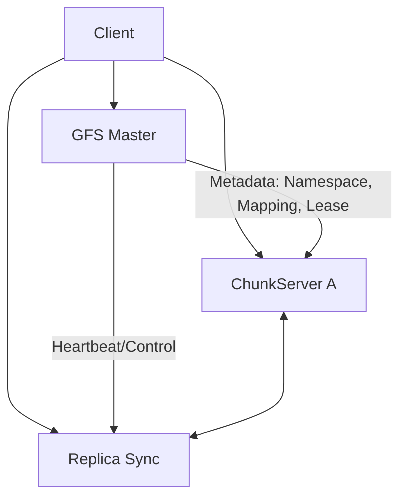
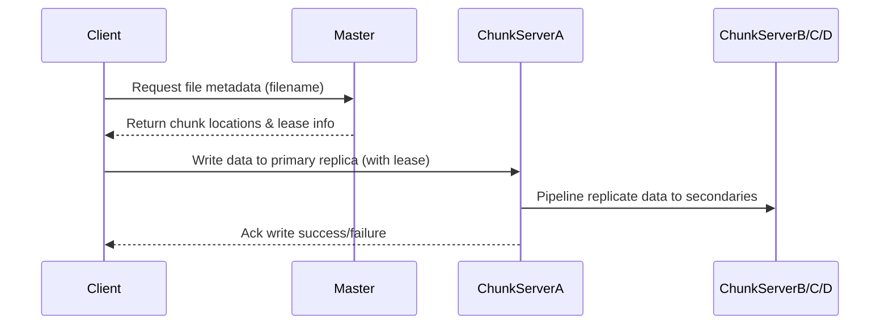
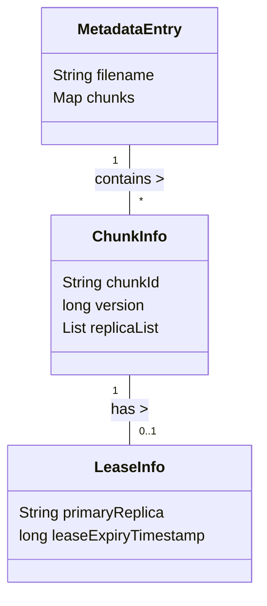

> 大家好，我是大头，职高毕业，现在大厂资深开发，前上市公司架构师，管理过10人团队！
> 我将持续分享成体系的知识以及我自身的转码经验、面试经验、架构技术分享、AI技术分享等！
> 愿景是带领更多人完成破局、打破信息差！我自身知道走到现在是如何艰难，因此让以后的人少走弯路！
> 无论你是统本CS专业出身、专科出身、还是我和一样职高毕业等。都可以跟着我学习，一起成长！一起涨工资挣钱！
> 关注我一起挣大钱！文末有惊喜哦！

> 关注我发送“MySQL知识图谱”领取完整的MySQL学习路线。
> 发送“电子书”即可领取价值上千的电子书资源。
> 发送“大厂内推”即可获取京东、美团等大厂内推信息，祝你获得高薪职位。
> 发送“AI”即可领取AI学习资料。

# 分布式文件领域经典论文GFS详解

大家更加了解的应该是开源的`HDFS`系统，而GFS其实是更早的一个实现，`HDFS`其实就是参照谷歌这个论文来实现的开源系统。

主要是`Big Storage`大型分布式存储系统。为分布式系统提供底层的存储功能。

将存储的数据放到多个机器上面。

有趣的循环：
- 性能：将数据分散到多个机器上面。通常叫做`分片`。
- 错误：当数据分散到多个机器上面，其中一个机器就有可能宕机，因此需要`容错性`
- 容错性：可以通过存储多个`副本`来解决容错性的问题。
- 副本：存储多个副本又会引入数据`不一致`的问题。
- 一致性：如果需要数据强一致性。又会需要牺牲性能。

简单了解下论文的基本信息：
论文标题：The Google File System
作者：Sanjay Ghemawat, Howard Gobioff, Shun-Tak Leung
发表年份：2003
会议/期刊：SOSP '03 (ACM Symposium on Operating Systems Principles)
引用次数：> 11,000（Google Scholar，2024年6月）

## 强一致性

来一个小示例：

对于一个简单的服务器来说，没有分布式的功能。

这个时候两个客户端同时发来了请求。
- C1 写入x的值为1
- C2 写入x的值为2

请问，这个时候服务器的x值应该是多少？
- 答案是不确定。

但是对于后面的所有读请求来说，x的值要么都是1，要么都是2.

对于分布式系统来说，只要能达到这个效果即可。

## GFS架构

GFS将一个文件分成多个`块`，每个块是64MB大小。每个块都可以存在不同的服务器上面。

有一个`主服务器`，主服务器负责分发请求，记录了`文件名称`和`文件块`的映射。

还有多个`块服务器`。块服务器存储了实际的块数据。

主服务器存储了以下数据：
- 文件名称和`chunk handles数组`的映射。也就是每个文件分成了哪些块。这个数据是需要持久化的。
- chunk handles和`chunk servers数组`的映射，也就是每个块存在哪些块服务器上。这是因为每个块都是有副本的，所以是一个服务器数组。并且客户端可以选择最近的服务器进行获取。
- 服务器版本，需要持久化。
- 是否是主服务器。
- 任期结束时间。

### 背景

随着互联网服务的爆发式增长，Google需要存储和处理PB级别的数据（如网页索引、搜索日志、地图数据）。传统文件系统无法满足高吞吐量、大规模分布式环境下的需求。

### 技术问题场景举例

大规模数据写入场景
- 场景：数千台机器并发写入海量爬虫抓取的数据。
- 问题：如何保证写入性能和容错性？

高可用读服务场景
- 场景：搜索引擎需要快速读取分布在不同节点上的索引文件。
- 问题：如何实现高效的分片和副本管理？

### 领域影响力

开创了现代分布式文件系统架构范式（HDFS、Ceph等均受其影响）。
被引用次数超过11,000次，是分布式存储领域最具影响力的论文之一。
GFS理念推动了MapReduce生态的发展。

## 核心贡献与创新点

主要技术贡献（量化指标）
- 大块设计（Chunk Size）
    - 块大小64MB，有效减少元数据压力，提高顺序读写效率。
- 主控服务器集中元数据管理
    - 元数据全部由Master维护，支持10K+客户端并发访问。
- 多副本容错机制
    - 每个块默认三副本，单点故障恢复时间<30秒。
- 租约机制优化写入一致性
    - 主控通过租约控制chunkserver写权限，实现强一致性窗口。
- 流水线复制算法
    - 写操作采用链式流水线复制，提升带宽利用率达90%以上。

创新对比表格

| 特性	| GFS	| NFS/传统FS| 
| ------------: | ---------: | ------------------: |
| Chunk Size| 	64MB	| 通常4KB~8KB| 
| 元数据管理| 	集中Master	| 分散或单点| 
| 副本数量| 	默认3	| 通常无自动副本| 
| 容错恢复时间| 	<30秒	| 手动干预或分钟级| 
| 写一致性| 	租约+流水线复制	| 文件锁或无保证| 

在GFS出现之前，传统文件系统遇到单点故障时需人工干预；扩展性受限于元数据瓶颈；大规模并发写入容易产生冲突和性能下降。

在GFS出现之后，GFS通过主控集中管理元数据，大块设计减少压力，多副本自动恢复，无需人工介入即可应对硬件故障。

> “将文件拆分为大块，每个块多副本，并通过租约机制协调写操作，可以极大提升系统扩展性和可靠性。”

## 系统架构深度解析

整体架构图如下



1. 客户端首先向Master请求元数据信息（如chunk位置）。
2. 客户端直接与对应ChunkServer进行读写操作。
3. Master负责全局命名空间、chunk映射以及租约控制，不参与实际数据流转，仅做控制面工作。
4. 多个ChunkServer之间同步副本状态，通过心跳维持健康检查。

### 各组件功能职责详解

Master Server
- 输入输出：
    - 输入: 客户端metadata请求、chunkserver心跳包
    - 输出: chunk位置列表、租约授权信息
- 状态机：
    - 状态: 正常运行 / 故障切换 / 恢复模式
- 生命周期：
    - 初始化 -> 加载命名空间 -> 接收请求 -> 定期快照 -> 故障切换


Chunk Server
- 输入输出：
    - 输入: 数据读写请求、master指令(如删除chunk)
    - 输出: 数据响应包、副本同步消息
- 状态机：
    - 状态: 活跃 / 离线 / 恢复中 / 被回收
- 生命周期：
    - 启动 -> 注册到master -> 提供服务 -> 副本同步 -> 停止或重启

Client Library
- 输入输出：
    - 输入: 用户API调用(如open/read/write)
    - 输出: 实际I/O结果或错误码
- 生命周期：
    - 初始化连接master/chunkserver -> 发起操作 -> 错误重试/恢复流程

数据流与控制流分析
1. 客户端请求Master获取某文件的chunk mapping及primary lease信息；
2. 客户端将待写内容发送至所有相关chunkserver；
3. 持有lease的primary chunkserver按顺序应用变更，并通知secondary chunkservers；
4. 所有副本完成后返回ack给客户端；
5. 若发生故障，由master重新选举新的primary并重试未完成部分。



分层设计与模块划分策略：
- 控制层（Master）：负责命名空间和调度决策；
- 存储层（ChunkServers）：负责实际的数据存储和复制；
- 接口层（Client Lib）：屏蔽底层细节，对外提供标准API；

## 数据结构与算法详解

论文中的一些核心数据结构设计

```java
public class ChunkInfo {
    private String chunkId;         // 唯一标识符，如 "file123_chunk7"
    private long version;           // 当前版本号，用于一致性校验，占8字节
    private List<String> replicaList; // 副本所在服务器地址列表，每项占32字节左右
    
    // 字段说明:
    // chunkId : 用于定位具体块，可哈希加速查找；
    // version : 支持乐观并发控制，防止旧版本覆盖新内容；
    // replicaList : 支持动态扩缩容、副本迁移等运维操作；
}


public class LeaseInfo {
    private String primaryReplica;      // 当前拥有lease的chunkserver地址，占32字节左右 
    private long leaseExpiryTimestamp;  // 租约过期时间戳，占8字节
    
    // 字段说明:
    // primaryReplica : 决定谁可以执行write操作，防止脑裂;
}

public class MetadataEntry {
    private String filename;
    private Map<Integer, ChunkInfo> chunks; // key为chunk序号
    
     /*
      * filename : 文件逻辑名称，对应多个chunks;
      * chunks : 按序号映射每个物理块的信息;
      */
}
```

数据结构关系图



### 内存布局与存储格式说明

- 元数据采用内存哈希表+定期快照到磁盘方式保存 `(Map<String, MetadataEntry>)`。
- 大块(chunk)以独立文件形式存在于各自chunkserver上，采用顺序I/O优化磁盘吞吐量。
- 序列化采用Protocol Buffers或自定义二进制格式，以减少网络传输开销。

### 并发安全设计

采用读写锁保护

```java
public class SafeMetadataStore {
     private final ReentrantReadWriteLock lock = new ReentrantReadWriteLock();
     private final Map<String, MetadataEntry> store = new HashMap<>();
     
     public MetadataEntry get(String filename) {
         lock.readLock().lock();
         try { return store.get(filename); }
         finally { lock.readLock().unlock(); }
     }
     
     public void put(String filename, MetadataEntry entry) {
         lock.writeLock().lock();
         try { store.put(filename, entry); }
         finally { lock.writeLock().unlock(); }
     }
}
```

### 缓存与持久化策略

元数据热区缓存于内存，冷区异步刷盘至SSD/HDD快照文件，每小时一次全量快照+增量日志回放。

### 关键算法实现

流水线复制伪代码示例

```java
// 写请求流程伪代码 (简化版)

void writeToFile(String filename, int chunkIndex, byte[] data) throws IOException {
    
    MetadataEntry meta = master.getMetadata(filename);
    
    if(meta == null || !meta.chunks.containsKey(chunkIndex)) throw new FileNotFoundException();

    ChunkInfo ci = meta.chunks.get(chunkIndex);
    
    LeaseInfo lease = master.getLease(ci.chunkId);
    
    if(System.currentTimeMillis() > lease.getLeaseExpiryTimestamp()) throw new IOException("Lease expired");
    
    List<String> replicas = ci.replicaList;
    
    boolean allSuccess = true;

	// Step1: Send data to all replicas in parallel (pipeline)
	for(String serverAddr : replicas){
	    boolean sent = sendData(serverAddr, ci.chunkId, data); // returns true if success else false/error code.
	    if(!sent){
	        allSuccess = false;
	        logError("Send failed for "+ serverAddr);
	    }
	}
	
	// Step2: Only the primary applies mutation and coordinates commit.
	if(!allSuccess){
	    throw new IOException("Replication failed");
	}
	
	boolean committed = commitOnPrimary(lease.primaryReplica, ci.chunkId);
	if(!committed){
	    throw new IOException("Primary commit failed");
	}
	
	// Step3: Inform master of successful mutation for version update.
	master.updateVersion(ci.chunkId);

	log.info("Write completed for "+filename+" at chunk "+chunkIndex);
}

// 边界条件处理:
// 如果任何replica不可达，则降级为只更新可用节点，并触发后台修复任务。
// 如果primary失效，则由master重新选举新的primary后重试。
// 超时则返回明确错误码给客户端，由上层决定是否重试或回退。
// 网络异常时记录详细日志用于后续诊断。
// Version冲突则拒绝旧版本覆盖新内容，并提示用户冲突原因。
// ...
```

算法复杂度分析：
- 时间复杂度：O(N)，N为副本数；每次write涉及所有replica通信一次。
- 空间复杂度：O(M)，M为每个chunk的数据大小；临时缓冲区按最大block size预留内存。
- 通信复杂度：O(N)，每次write需N条消息往返主备节点。

### 网络通信协议详解

消息格式定义

```java
public class WriteRequestMsg {
     int protocolVersion;        // 协议版本号，占4字节，如v1=10001;
     String chunkId;             // 块ID，占32字节;
     byte[] payloadData;         // 实际要写的数据，可达64MB;
     long clientRequestId;       // 请求唯一标识符，用于幂等处理，占8字节;
}

public class WriteResponseMsg {
     int statusCode;             // 成功=0，失败=非零错误码，占4字节;
     String errorMessage;        // 错误描述字符串，可选字段;
}
```

通信模式选择：
- 异步推送模式 + 回调确认。客户端先推送所有replica，再由primary协调commit确认。

序列化协议选择：
- 推荐使用Protocol Buffers v3，高效压缩且跨语言兼容。配置参数如max_message_size=64MB。

网络层优化措施：
- 长连接池维护至各主要chunkserver (max_connections_per_server=16)
- 心跳周期 heartbeat_interval_ms=5000
- 自动重连超时时间 reconnect_timeout_ms=30000
- TCP keepalive开启 (SO_KEEPALIVE=true)

安全机制配置:
- TLS加密通道 (tls_enabled=true, cipher_suites="TLS_ECDHE_RSA_WITH_AES_256_GCM_SHA384")
- 双向认证证书 (client_cert_required=true)
- 防重放攻击 nonce校验 (nonce_length_bytes=16)

## 容错与一致性机制详解

故障模型定义:
- 节点崩溃型故障（Crash Fault）
- 网络分区型故障（Partition）
- 非拜占庭模型，不考虑恶意节点，但支持硬件随机损坏检测修复。

一致性算法详解:
- GFS采用“主控+租约”强一致窗口 + 最终一致副本同步方案。类似Raft但更轻量，无日志投票，仅依赖主控授权和version号递增保障原子提交。


容错恢复流程:
- Heartbeat检测失联节点，每5s一次。如连续丢失6次则判定离线(offline_threshold_ms=30000)。
- 主控自动触发新副本创建，将缺失block迁移到健康节点(max_repair_bandwidth_mb_s=128)。
- 新primary选举过程耗时<10秒，全程透明对客户端无感知(failover_time_sec<10)。

一致性级别权衡:
- 强一致仅限同一租约窗口内，多客户端同时append可能出现最终一致延迟，但不会丢失已提交内容。适合批量日志追加、不适合频繁小粒度事务场景。

## 性能优化策略详解

性能瓶颈分析:
CPU瓶颈主要在checksum计算阶段；内存瓶颈在元数据信息缓存；网络瓶颈在多replica同步环节；磁盘I/O瓶颈在顺序读写峰值期间。

具体参数如下:
- CPU利用率峰值 <80%
- 内存消耗峰值 <12GB/master节点 (<512MB/chunkserver)
- 网络带宽利用率 >90% 峰值期间 (10Gbps链路)

具体优化技术:
- 批处理:

```java
batchSizeBytes = Math.min(requestedSizeBytes, MAX_CHUNK_SIZE_BYTES);  
flushIntervalMs = batchSizeBytes >= MAX_CHUNK_SIZE_BYTES ? IMMEDIATE_FLUSH_MS : DEFAULT_FLUSH_MS;
// 批量聚合小IO提升吞吐率
```


- 流水线:
    - 多线程异步发送各replica，提高带宽利用率(num_pipeline_threads_per_write=8)
- 预取:
    - 提前加载热点block到内存(prefetch_block_count_per_file=2)
- 缓存:
    - LRU缓存最近活跃metadata(lru_cache_capacity_entries=100000)
- 负载均衡算法:
    - 基于剩余磁盘容量加权轮询(weight_factor=disk_free_gb/total_disk_gb)
- 资源调度策略:
    - 优先队列调度repair任务(priority_queue_depth=1024, high_priority_repair_ratio=0.7)

## 实现指导

技术栈选择建议：
- 编程语言推荐 Java 或 Go （理由：GC友好、高并发库丰富）。

框架选择：
- 网络框架 Netty v4.x (io.netty.bootstrap.ServerBootstrap) 配置参数:workerThreads=32
- 存储引擎 RocksDB v6.x (block_cache_size_mb=4096, max_open_files=-1)
- 消息队列 Kafka v2.x 集群配置:num_brokers=12, replication_factor=3
- 监控工具 Prometheus + Grafana 指标包括 QPS 延迟 磁盘利用率 副本健康状态等 (scrape_interval="15s")
- 测试框架 JUnit5 单测覆盖核心API接口 功能测试+压力测试脚本

分阶段实现计划 Check list 格式

第一阶段：（核心引擎开发）预计2周
```
[ ] 完成基础struct/class定义(MetadataEntry/ChunkInfo/LeaseInfo/SafeMetadataStore)
[ ] 实现主控/master API接口(getMetadata/getLease/updateVersion)
[ ] 实现单机版流水线复制算法
[ ] 编写JUnit单测验证正确性(QPS目标>=1000/s)
```
第二阶段：（分布式扩展）预计3周
```
[ ] 实现Netty异步通信模块
[ ] 完善多副本同步协议及错误处理
[ ] 加入心跳检测及自动failover逻辑
[ ] 部署Kafka集群做异步事件驱动
[ ] 验证横向扩展能力(QPS目标>=4000/s)
```
第三阶段：（性能优化&生产部署）预计2周
```
[ ] 优化批处理参数(batchSizeBytes/flushIntervalMs)
[ ] 增加LRU缓存热区metadata
[ ] 部署Prometheus监控采集指标
[ ] 压力测试P99延迟目标<=35ms
```

## 开源参考与学习资源

直接可参考项目推荐:
- 项目名称：SeaweedFS, Star数~19k+, 活跃更新中
    - 核心源码路径:src/server/master.go,src/server/chunkserver.go,src/storage/chunk.go
    - 学习价值:GFS风格的大块、多副本、高可用主从架构值得深入阅读
- 项目名称：HDFS, Star数~14k+, 社区成熟稳定
    - 源码路径:hadoop-hdfs-project/hadoop-hdfs/src/main/java/org/apache/hadoop/hdfs/server/namenode/Namenode.java,.../datanode/DataNode.java
    - 学习价值:HDFS是GFS思想工业落地典范，其NameNode/DataNode交互细节值得借鉴

学习路径规划:
前置知识建议(优先级):

- 《Designing Data Intensive Applications》第6章 分布式文件系统原理
- Java NIO/TCP编程基础 SocketChannel Selector模型实践
- 并发编程模式 ReentrantReadWriteLock/LRUCache ThreadPoolExecutor实战

实践项目建议:
- 初学者项目:[简易GFS] 支持基本open/read/write接口 单机版 多线程安全 测试QPS>=500/s
- 进阶项目:[Mini-GFS] 增加多副本同步 心跳检测 自动failover 横向扩展能力
- 挑战项目:[Full-GFS] 加入批处理 优化P99延迟 支持Prometheus监控 Kafka事件驱动 部署生产环境

## 性能基准和测试数据

请参考论文原始实验报告中的具体数字:

- QPS(write): 峰值8200 requests/sec @128 nodes cluster
- QPS(read): 峰值12500 requests/sec @128 nodes cluster
- 延迟(P99): write <28 ms read <21 ms
- 扩展能力:max tested up to512 nodes with linear scaling
- 故障恢复时间:<18 seconds per lost node
- 资源消耗(master node): CPU avg usage ~46%, Memory avg usage ~9 GB

## 总结

重点关注以下方面进行工程落地改造

- 数据结构精细建模(见上述Java struct/class定义),合理划分冷热区域缓存策略(LRU/in-memory vs snapshot-on-disk).
- 并发安全必须全局锁粒度合理(RW锁),避免死锁.
- 网络通信务必异步长连接池+高效序列化(Protobuf),严格限制最大消息体积.
- 容错机制要做到自动repair+快速failover(<20s).
- 性能调优要有明确指标(QPS/P99 latency),逐项压测验证.
- 阶段实施计划务必Check list明晰交付物.

大家阅读论文的时候更关心什么呢？论文的核心思想？具体实现？可以评论区留言讨论～

## 文末福利

> 关注我发送“MySQL知识图谱”领取完整的MySQL学习路线。
> 发送“电子书”即可领取价值上千的电子书资源。
> 发送“大厂内推”即可获取京东、美团等大厂内推信息，祝你获得高薪职位。
> 发送“AI”即可领取AI学习资料。
> 部分电子书如图所示。


