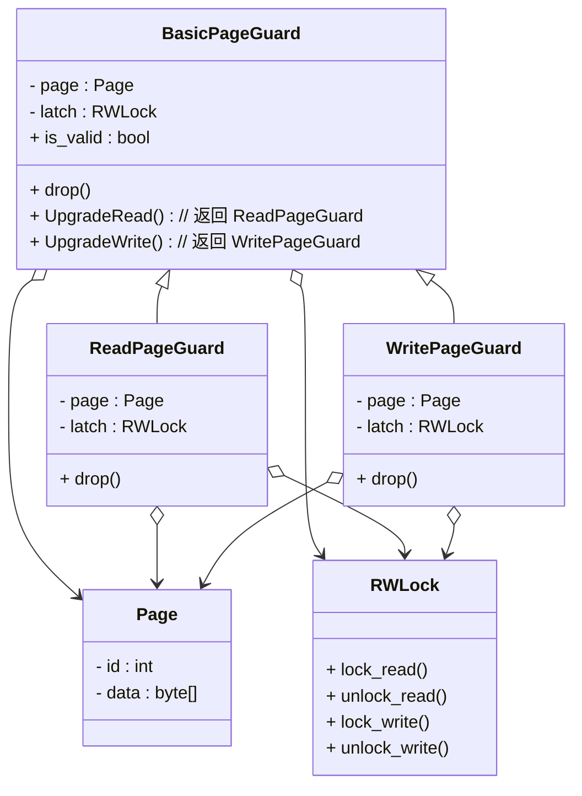

> 大家好，我是大头，职高毕业，现在大厂资深开发，前上市公司架构师，管理过10人团队！
> 我将持续分享成体系的知识以及我自身的转码经验、面试经验、架构技术分享、AI技术分享等！
> 愿景是带领更多人完成破局、打破信息差！我自身知道走到现在是如何艰难，因此让以后的人少走弯路！
> 无论你是统本CS专业出身、专科出身、还是我和一样职高毕业等。都可以跟着我学习，一起成长！一起涨工资挣钱！
> 关注我一起挣大钱！文末有惊喜哦！

> 关注我发送“MySQL知识图谱”领取完整的MySQL学习路线。
> 发送“电子书”即可领取价值上千的电子书资源。
> 发送“大厂内推”即可获取京东、美团等大厂内推信息，祝你获得高薪职位。
> 发送“AI”即可领取AI学习资料。

# MySQL零基础教程

本教程为零基础教程，零基础小白也可以直接学习。
基础篇和应用篇已经更新完成。
接下来是原理篇，原理篇的内容大致如下图所示。


 
## 零基础MySQL教程原理篇之hash索引实现

MySQL中的`索引`是一个非常重要的组件，面试中最常问的一个问题就是`你是如何优化索引的？`

> 一天，小美遇到了张三，小美说她老公嫌弃她们家衣柜衣服多又乱，早上出门找衣服要找半天！小美问张三有没有好男人介绍一下，哭诉生活太难了
> 张三当即表示我张三就是个好男人啊，能文能武，还会收拾衣柜！
> 张三告诉小美，要想保持衣柜整洁，一定要记得以下三点。。。

我们本次要讲解就是`hash索引`。

我们要实现的是`动态hash`，`extendible hashing`的一种实现，像Java的HashMap类型使用的是`chained hashing`来实现的。

### extendible hashing

- 对 chained hashing 的扩展
- 有一个slot array，在slot array上有一个 counter, 如果counter = 2，代表看hash以后的数字的前两个bit,slot array就有4个位置，分别是00,01,10,11
- 每个slot指向一个bucket
- hash以后找到前两位对应的slot指向的bucket，将数据放进去，如果满了，放不下了就进行拆分
- 将slot array的counter扩容为3，看前3个bit，slot array变成了8个位置
- 只将这个满了的bucket拆分成2个，其余的不变，重新进行slot的映射
- 再次hash这个值，看前3个bit找到对应的slot,在找到对应的bucket，然后插入进去

下图展示了一个可扩展的哈希表，其头部页最大深度为 2，目录页最大深度也为 2，桶页最多可容纳两个条目。图中省略了具体值，桶页中显示的是键的哈希值，而不是键本身。


该索引无需搜索数据库表中的每一行即可快速检索数据，从而实现快速随机查找。您的实现应支持线程安全的搜索、插入和删除操作（包括目录的扩展/缩小以及存储桶的拆分/合并）。

### 任务1 读/写页面保护

在之前，已经实现过了缓冲池管理器，`FetchPage` 和 `NewPage` 函数返回指向已锁定页面的指针。锁定机制确保页面只有在不再有读写操作时才会被释放。要表明页面不再需要保留在内存中，程序员必须手动调用 `UnpinPage` 。

另一方面，如果程序员忘记调用 `UnpinPage` ，页面将永远不会从缓冲池中移除。由于缓冲池实际处理的帧数较少，页面在磁盘内外的交换次数会更多。这不仅会降低性能，而且这种错误也很难被发现。

你需要实现 `BasicPageGuard` ，它存储指向 `BufferPoolManager` 和 `Page` 对象的指针。`BasicPageGuard`确保在对应的 `Page` 对象超出作用域时立即调用 `UnpinPage` 方法。请注意，它仍然应该提供一个方法，供程序员手动取消页面锁定。

由于 `BasicPageGuard` 隐藏了底层的 `Page` 指针，它还可以提供只读/写数据 API，这些 API 提供编译时检查，以确保 `is_dirty` 标志针对每个用例都正确设置。

在本项目及后续项目中，多个线程将对同一页面进行读写操作，因此需要读写锁存器来确保数据的正确性。请注意， `Page` 类中提供了相关的锁存方法。与页面解锁类似，程序员可能会忘记在使用后解锁页面。为了缓解这个问题，您需要实现 `ReadPageGuard` 和 `WritePageGuard` 接口，以便在页面超出作用域时自动解锁它们。

我们可以得到下面的类图关系，`BasicPageGuard`是一个无锁的页面守卫，他可以加读锁升级成`ReadPageGuard`，也可以加写锁升级成`WritePageGuard`。



构造函数和`operator=`函数实现基本一样，都是简单的赋值，清空page和bpm_就可以了。

析构函数和`Drop`函数的实现也是一样的，调用`UnpinPage`方法并清空page和bpm_就可以了。

`UpgradeRead`方法是先加读锁，然后创建一个`ReadPageGuard`对象返回就可以了。

`UpgradeWrite`方法是先加写锁，然后创建一个`WritePageGuard`对象返回就可以了。

对于`ReadPageGuard`类来说，在析构函数和Drop里面释放读锁，构造函数和`operator=`函数实现基本一样。

对于`WritePageGuard`类来说，在析构函数和Drop里面释放写锁，构造函数和`operator=`函数实现基本一样。

### 任务2 Extendible Hash Table Pages

您必须实现三个 Page 类来存储可扩展哈希表的数据。
- Header Page: 位于可扩展哈希表的第一层，一个hash table只有一个 header page，存储指向 directory page的逻辑指针。
    - directory_page_ids_：directory page 的 ID数组
    - max_depth_：header page 可以处理的最大深度
- Directory Page: 位于可扩展哈希表的第二层， 存储指向bucket page的逻辑指针，用于处理存储桶映射和动态目录增长与收缩的元数据。
    - max_depth_：header page 可以处理的最大深度
    - global_depth_：当前目录全局深度
    - local_depths_：存储桶页面本地深度数组
    - bucket_page_ids_：bucket page ID 数组
- Bucket Page: 位于可扩展哈希表的第三层。实际存储键值信息。
    - size_：桶中保存的键值对数量
    - max_size_：存储桶可以处理的最大键值对数量
    - array_：存储桶页面本地深度数组

#### Header Page

初始化，将`max_depth_`初始化成给定大小，`directory_page_ids_`全部初始化成`INVALID_PAGE_ID`.

因为这个里面存储的是一个个的`page id`。

`GetDirectoryPageId`和`SetDirectoryPageId`就是简单的getter和 setter 方法。

`HashToDirectoryIndex`方法是我们给定一个hash值，然后返回我们对应的`directory page id`.

看下图：我们有三个page，第一个page id是0，存储的是`header page`，这个`header page`的`max depth`是1，代表下面有两个`directory page`。如果`max depth`是2，代表有4个`directory page`。


我们上面对于可扩展哈希的描述如下：
- 有一个slot array，在slot array上有一个 counter, 如果counter = 2，代表看hash以后的数字的前两个bit,slot array就有4个位置，分别是00,01,10,11
- 每个slot指向一个bucket
- hash以后找到前两位对应的slot指向的bucket，将数据放进去，如果满了，放不下了就进行拆分

这里的 `counter` 就是我们的 `max depth`，因此，1就代表最首位的`0`和`1`两个位置，因此有两个`directory page`。2就代表前两位的00,01,10,11,因此有4个`directory page`。

所以，我们的思路就很简单了，获取hash中的前n位bit。hash是32位的。n其实就是`max depth`。

```c++
// 获取hash max depth位 bit
// 创建一个掩码，其最低的 max depth 位设置为 1
uint32_t mask = 0;
for (uint32_t i = 0; i < max_depth_; ++i) {
mask |= (1U << i);
}

// 右移 32 - n 位，然后与掩码进行与操作
return (hash >> (32 - max_depth_)) & mask;
```

#### Directory Page

`max_depth_`的初始化一样，`bucket_page_ids_`的初始化也一样，初始化成`INVALID_PAGE_ID`就可以了。`global_depth_`和`local_depth`初始化成0.

`HashToBucketIndex`这个方法和`HashToDirectoryIndex`也差不多，基本是一个意思。

这个掩码使用`global_depth`代替`max_depth`。

```c++
auto ExtendibleHTableDirectoryPage::GetGlobalDepthMask() const -> uint32_t {
  return global_depth_ <= 1 ? 1 : (1 << global_depth_) - 1;
}
```

然后进行验码操作

```c++
global_depth_ == 0 ? 0 : hash & GetGlobalDepthMask();
```

还需要实现`globa_depth`的增减。因为它会影响到`bucket_page`的数量，因此每次增减还需要更新`bucket_page_ids_`和`local_depths_`。

```c++
void ExtendibleHTableDirectoryPage::IncrGlobalDepth() {
  if (global_depth_ < max_depth_) {
    auto mod = global_depth_ == 0 ? 1 : global_depth_ << 1;
    global_depth_++;
    auto size = Size();
    // 重新指向每个Bucket page
    for (uint32_t i = mod; i < size; i++) {
      bucket_page_ids_[i] = bucket_page_ids_[i % mod];
      local_depths_[i] = local_depths_[i % mod];
    }
  }
}

void ExtendibleHTableDirectoryPage::DecrGlobalDepth() {
  if (global_depth_ > 0) {
    auto mod = global_depth_ == 1 ? 1 : (global_depth_ - 1) << 1;
    auto size = Size();
    // 重新指向每个Bucket page
    for (uint32_t i = mod; i < size; i++) {
      bucket_page_ids_[i] = INVALID_PAGE_ID;
      local_depths_[i] = 0;
    }
    global_depth_--;
  }
}
```

`local_depths_`的增减相当简单。

```c++
void ExtendibleHTableDirectoryPage::IncrLocalDepth(uint32_t bucket_idx) { local_depths_[bucket_idx]++; }

void ExtendibleHTableDirectoryPage::DecrLocalDepth(uint32_t bucket_idx) {
  if (local_depths_[bucket_idx] > 0) {
    local_depths_[bucket_idx]--;
  }
}
```

对于缩容，我们需要实现一个判断，是否能缩容。

```c++
auto ExtendibleHTableDirectoryPage::CanShrink() -> bool {
  auto size = Size();
  for (uint32_t i = 0; i < size; i++) {
    if (global_depth_ == local_depths_[i]) {
      return false;
    }
  }
  return true;
}
```


## 结论

本实现基于CMU15445课程的Fall2023的Lab3实现，详细介绍了实现思路，对于了解数据库的查询实现有着重要的意义。

## 文末福利

> 关注我发送“MySQL知识图谱”领取完整的MySQL学习路线。
> 发送“电子书”即可领取价值上千的电子书资源。
> 发送“大厂内推”即可获取京东、美团等大厂内推信息，祝你获得高薪职位。
> 发送“AI”即可领取AI学习资料。
> 部分电子书如图所示。


