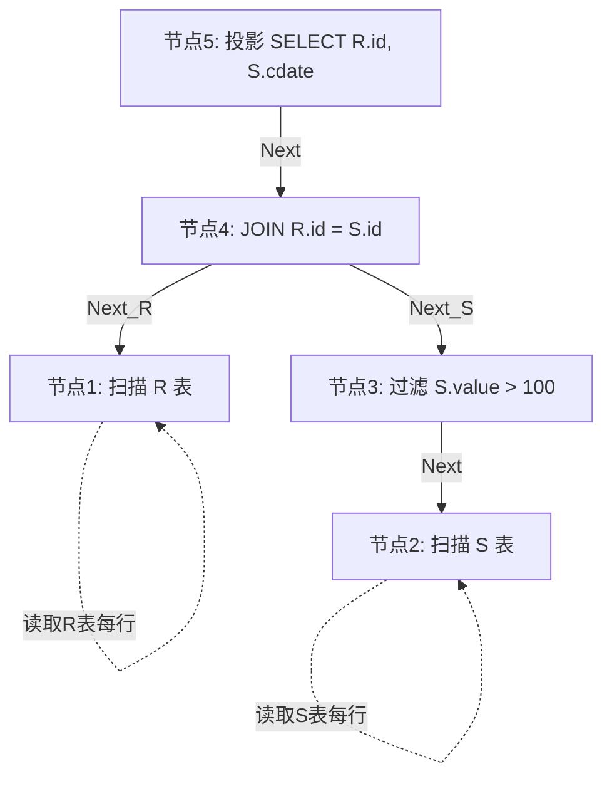
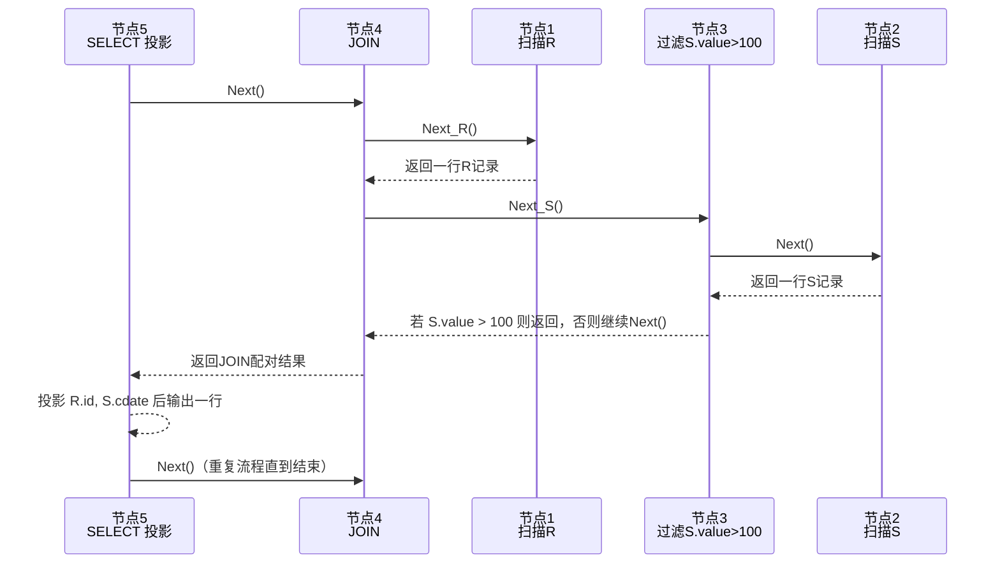
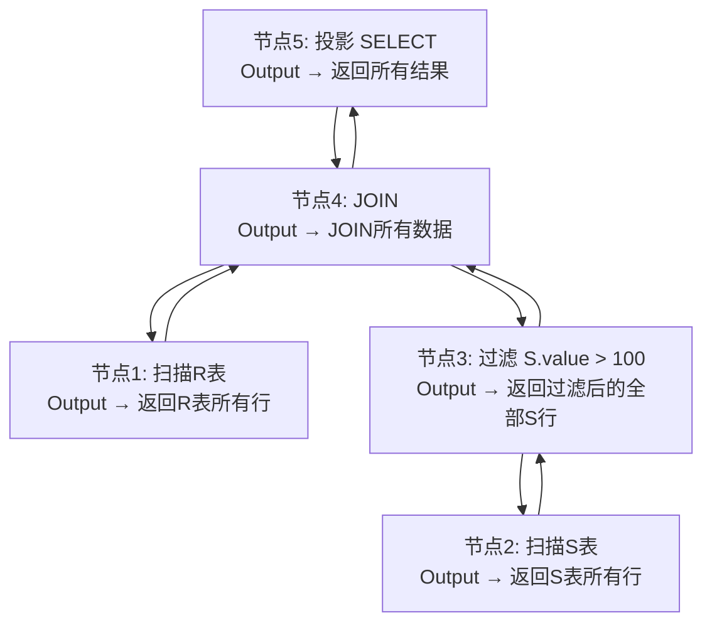
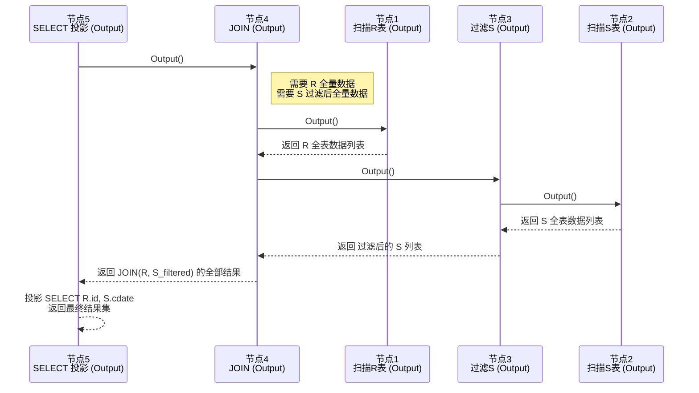
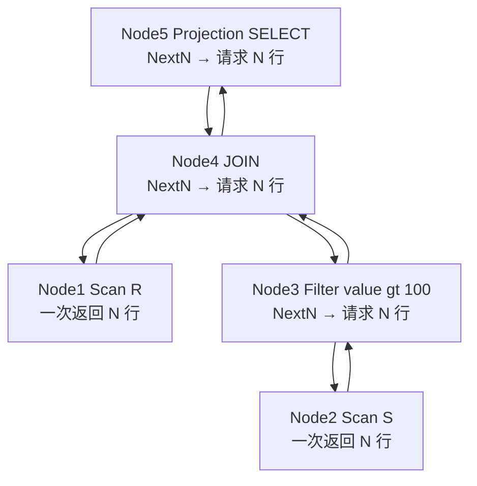
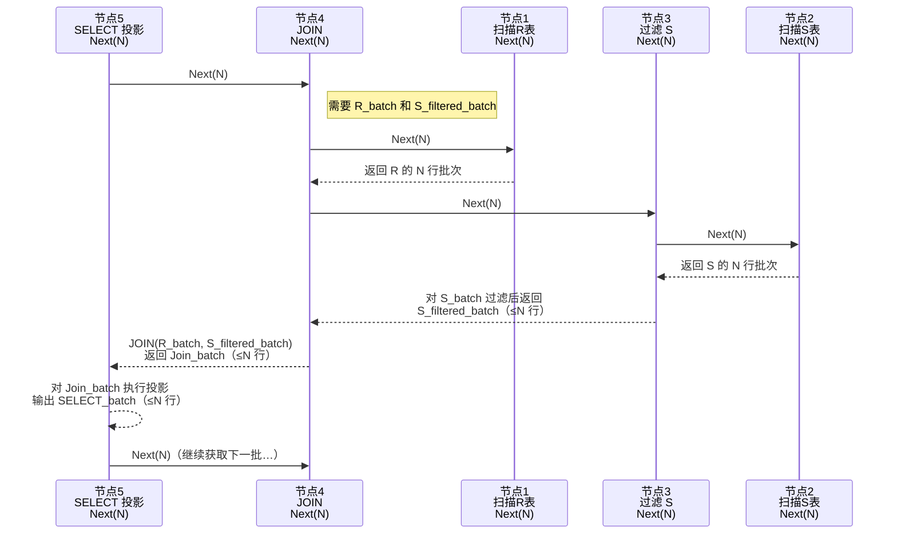

> 大家好，我是大头，职高毕业，现在大厂资深开发，前上市公司架构师，管理过10人团队！
> 我将持续分享成体系的知识以及我自身的转码经验、面试经验、架构技术分享、AI技术分享等！
> 愿景是带领更多人完成破局、打破信息差！我自身知道走到现在是如何艰难，因此让以后的人少走弯路！
> 无论你是统本CS专业出身、专科出身、还是我和一样职高毕业等。都可以跟着我学习，一起成长！一起涨工资挣钱！
> 关注我一起挣大钱！文末有惊喜哦！

> 关注我发送“MySQL知识图谱”领取完整的MySQL学习路线。
> 发送“电子书”即可领取价值上千的电子书资源。
> 发送“大厂内推”即可获取京东、美团等大厂内推信息，祝你获得高薪职位。
> 发送“AI”即可领取AI学习资料。

# MySQL零基础教程

本教程为零基础教程，零基础小白也可以直接学习。
基础篇和应用篇已经更新完成。
接下来是原理篇，原理篇的内容大致如下图所示。


 
## 零基础MySQL教程原理篇之执行器原理，SQL如何执行

> 一天，小美突然肚子疼，原来是亲戚来了，小美只能躺在床上耍手机了。小美发了一个朋友圈。
> 张三看到了小美的朋友圈，立马自告奋勇过来照顾小美，要给小美做一个红糖姜茶。
> 张三到了小美的家里，张三找到了家里的红糖还有姜
> 第一步，倒出适量红糖，将姜洗净切丝
> 第二步，锅中放入水，开火，将水烧开
> 最后，将红糖和姜倒入锅中，等待片刻即可。
> 小美喝完以后发现浑身舒畅，当即对张三表示很满意。

### 执行器是什么？

`执行器`是数据库架构中的核心组件之一，负责具体的执行操作，就如何故事中的张三一样，负责具体`煮红糖姜茶`。

大部分的八股文都会告诉你，当SQL进入到数据库中，要经历解析器、优化器、执行器等等，但是他们不会告诉你的是，执行器到底怎么执行的呢？

面试官：说一下数据库吧，你对数据库了解的如何？这是一个开放式的问题。
候选人A：按照八股文背了一遍
候选人B：详细的解释了数据库中每一步的执行流程，优化手段，MySQL和其他数据库的一些对比

看到这里，相信你也明白候选人B获得Offer的机会更大吧。

执行器就是一个苦力，真正负责干活的人，他会接受到一份`执行计划`。相当于厨师拿到了菜谱，只需要照着做就行了。

### 执行器模型

执行器模型大致可以分成下面三种：
- Iterator Model: 大多数数据库使用的，也是MySQL数据库使用的一个模型，也叫 `Volcano / pull-based`
- Materialization Model：`Iterator Model`的一个特定版本，用在内存型数据库
- Vectorized/Batch Model：`Iterator Model`差不多，要传入一大堆东西， 分析型数据库用的多

#### Iterator Model

MySQL使用的这种执行模型来完成SQL的执行流程。这种模型像java的`stream`， 用流的方式执行。如果是做Java的同学应该很熟悉。

核心思想：通过每个`执行节点`暴露一个 `Next()（或 getNext()）`接口，调用者从下游不断向上游拉取一条一条的行（tuple）。`执行节点`按需产生单行数据并返回，形成管道式逐行处理。

优点
- 管道化，低内存（不必把中间结果全部物化）。
- 支持早停（例如 LIMIT、EXISTS），能在满足条件后立即结束。
- 实现简单、易于组合与优化（迭代器链）。

缺点
- 每行的函数调用/控制开销比较高（上下文切换、分支预测负担）。
- 对现代 CPU 的向量化 / 缓存利用不友好（逐行处理导致大量分散访问）。

通过一个示例进行讲解，假设执行如下SQL语句
> SELECT R.id,S.cdate FROM R JOIN S ON R.id = S.id WHERE S.value > 100

首先，根据执行计划，我们会生成一些执行节点
- 节点1:负责扫描R表数据
- 节点2：负责扫描S表数据
- 节点3: 负责执行`WHERE S.value > 100`，也就是对节点2的输出做过滤
- 节点4: 负责执行`R JOIN S`，也就是执行JOIN算法，是对节点1和节点3的输出做JOIN
- 节点5: 负责执行`SELECT R.id,S.cdate`也就是对节点4的输出做过滤，只取其中的R.id和S.date字段。

这样，我们还可以将这5个节点化成一个树的形式，如下图


每个节点会暴露一个`Next()`接口，执行流程如下：
1. 节点5会通过节点4的Next接口获取数据
2. 节点4会通过节点1的Next接口和节点3的Next接口获取数据
3. 节点1会扫描R表，获取到一条数据然后返回
4. 节点3会通过节点2的Next接口获取数据
5. 节点2会扫描S表，获取到一条数据然后返回
6. 节点3拿到节点2的返回值，执行过滤，如果过滤以后有数据，就返回，没有数据，继续第4步
7. 节点4获取到节点1和节点3的返回值，执行JOIN操作，并将结果返回给节点5
8. 节点5拿到数据以后执行SELECT操作，并重复第1步，直到没有数据为止。

执行流程图如下：


时序图如下：


生活故事：
想象一个传统小饭馆：服务员（下游）每来一个客人就去厨房（上游）拿一份菜。厨房现做现给，一份一份端出来。优点是不用提前占用很多桌子空间，也能马上停单；缺点是每次去拿都要来回跑，效率受人力往返影响。

#### Materalization Model

`Iterator Model`的特点是每次返回一行数据，而`Materalization Model`则是每次返回所有数据。因此，这种模型取消了`Next`方法，而是使用`Output`方法。

核心思想：某些`执行节点`将其输出完整“物化”为中间结构（数组、临时表、磁盘文件），下游`执行节点`再一次性读取/随机访问这个中间结果。常见于需要多次访问、排序、哈希构建等场景。

优点
- 便于随机访问、多次读取（例如 hash join 的 build 阶段、聚合后多次扫描）。
- 可以把中间数据放到磁盘/临时表以突破内存限制。
- 有利于用批量算法对中间结果做集中优化（比如一次性排序、一次性写盘）。

缺点
- 需要额外内存或 I/O（内存不足时会溢写到磁盘，开销大）。
- 增加了延迟（必须等物化完成，下游才能消费）。

通过一个示例进行讲解，假设执行如下SQL语句
> SELECT R.id,S.cdate FROM R JOIN S ON R.id = S.id WHERE S.value > 100

节点还是上面那些，不再说明。

每个节点会暴露一个`Output()`接口，执行流程如下：
1. 节点5会通过节点4的Output接口获取所有数据
2. 节点4会通过节点1的Output接口和节点3的Output接口获取所有数据
3. 节点1会循环扫描R表，获取到R表的所有数据一次行返回
4. 节点3会通过节点2的Output接口获取所有数据
5. 节点2会循环扫描S表，获取到S表的所有数据一次行返回
6. 节点3拿到节点2的返回值，循环执行过滤，如果循环过滤以后有数据，就返回所有过滤后的数据，没有数据，返回空。
7. 节点4获取到节点1和节点3的返回值，循环执行JOIN操作，并将结果返回给节点5
8. 节点5拿到数据以后循环执行SELECT操作，并将结果返回。

这个模型的流程图如下，注意其中的区别：



时序图如下 



生活故事：
把它想成自助餐（buffet）准备：厨房先把所有菜都做好、摆到台子上（物化）。顾客来时可以随意取，便于多个人同时取、重复取同一道菜。缺点是需要大的台面和提前准备时间，浪费食材或占地方。

#### Vectorized Model

这个模型同样进行了一些修改，不再是一行一行的获取数据，但是也不是一下获取所有数据，类似于中间的一个模型，一下子获取部分数据，同样使用`Next`方法，但是一次性返回一堆 `tuples`, 数量取决于 `Buffer pool` 大小

OLAP数据库基本上使用的是这个处理模型。

核心思想：`执行节点`按“批”（batch）或“向量”（columnar vectors）处理多行数据一次性做操作，而不是每次一行。批里通常是连续的列或行，能更好利用 CPU 缓存、分支预测、SIMD 指令、以及减少函数调用开销。

优点
- 高吞吐：每批次 amortize 函数调用与调度开销。
- 极佳的 CPU & 缓存利用（尤其是列式存储配合向量化运算）。
- 更容易实现并行/向量化优化（SIMD、流水线）。

缺点
- 批量带来一定的延迟（小查询或需要低延迟的 OLTP 不友好）。
- 对非均匀数据/分支较多的操作优化有限（每批中仍需处理空值/分支）。
- 较复杂的实现（需要设计批接口、内存布局）。

节点还是上面那些，不再说明。

每个节点会暴露一个`Next()`接口，执行流程如下：
1. 节点5会通过节点4的Next接口获取`N行`数据
2. 节点4会通过节点1的Next接口和节点3的Next接口获取`N行`数据
3. 节点1会循环扫描R表，获取到R表的`N行`数据返回
4. 节点3会通过节点2的Next接口获取`N行`数据
5. 节点2会循环扫描S表，获取到S表的`N行`数据返回
6. 节点3拿到节点2的`N行`返回值，循环执行过滤，如果循环过滤以后有数据，就返回所有过滤后的数据，没有数据，就继续重复第4步。
7. 节点4获取到节点1和节点3的`N行`返回值，循环执行JOIN操作，并将结果返回给节点5
8. 节点5拿到`N行`数据以后循环执行SELECT操作，并重复第1步，最后数据处理完成，将结果返回。

执行流程图如下：


时序图如下：


生活故事：
想象快餐连锁的生产线：厨房把同一种汉堡按批次一起做（比如一次做 20 个），装箱后一起送到窗口分发。这样每个环节都能流水作业，效率高，但如果只来一个客人，需要等一小批做完才拿到（稍有延迟）。

执行器模型的对比表格，一目了然，可以参照一下。

| 特性   | Iterator（逐行/拉） |        Materialization（物化） | Vectorized/Batch（向量/批） |
| ---- | -------------: | -------------------------: | ---------------------: |
| 典型接口 |  `Next()` 每次一行 | 完整生成中间结果（array/temp table） |   `NextBatch()` / 批量数组 |
| 内存占用 |          低（流式） |                    高（可能很大） |             中等（批次大小决定） |
| 延迟   |          低（单行） |                    高（等待物化） |           中等 — 批大小影响延迟 |
| 吞吐量  |              中 |                  中高（取决于IO） |                  高（最好） |
| 适用场景 |   OLTP、早停、复合操作 |      需要随机访问/多次复用/排序、外部Join |         OLAP、大表扫描、列式引擎 |
| 优化方向 |      减少函数开销、内联 |                  减少 I/O、压缩 |         SIMD、缓存局部性、批处理 |


### 节点类型

从上面可以发现，我们会按照节点去进行执行，那么每个节点其实都负责一个具体的任务。这也是软件设计原则中的`单一职责`。

比如上面的示例中，有：
- select节点
- where节点
- join节点
- 扫描表节点

其实，SQL中的每一个操作都是一个不同的节点类型，除了上面那些，还有：
- limit节点
- order by节点
- group by节点
- sort 节点
- 其他操作节点

当然了，每个节点其实都可以有不同的实现，每种实现可能会导致不同的执行速度。

在后续的文章中，我们会详细讲解每种节点的具体代码实现。本篇文章的重点还是聚焦在执行器上面。

### 进程线程模型

上面介绍了执行模型，那执行模型具体如何处理呢？单进程？单线程？多线程？多进程？

这里介绍一下`进程线程模型`，分为下面几种：

- Process per DBMS Worker：每个 `Worker` 一个进程，相当于一个节点一个进程来执行。可以说是多进程 + 共享内存的方式执行。
- Process Model：和上面那个差不多，但是增加了 `worker pool`，有多个worker进行调度处理。
- Thread per DBMS Worker：每个 `Worker` 一个线程，相当于一个节点一个线程来执行。由数据库自己控制线程。
- Embedded DBMS：嵌入式数据库，与应用在同一进程内

#### Process per DBMS Worker

每个进程是一个worker,负责执行任务。通过`共享内存`进行buffer pool的通信，要不然每个进程都会有一个buffer pool。老得数据库大部分使用的这个，因为当时没有统一的线程API,像DB2,oracle,postgraSQL等。

特点：
- 稳定，功能隔离（进程级别隔离，不会相互崩）
- 上下文切换昂贵
- 增加连接数时压力大

#### Process Model

和 `Process per DBMS Worker`一样.但是增加了 `worker pool`，有多个`worker`,有一个主进程进行调度处理。像DB2,postgraSQL（2015）使用的是这种方式。相当于上面那种方式的一个优化版本吧，可以看到PostgraSQL一开始用上面的模型，后来切换到这个模型了。

#### Thread per DBMS Worker

一个进程，多个线程执行，由数据库自己控制线程。现在的数据库几乎都使用这种，像DB2, MSSQL, MySQL, Oracle(2014)。

线程的开销比进程小的多，因此，当线程出现以后，现代数据库基本都使用了这种方式。

特点：
- 线程切换便宜（上下文切换轻量）
- 所有线程共享进程内存
- 一个线程崩掉可能拖垮整个 DBMS → 可靠性较低
- 吞吐能力强，适合高并发

#### Embedded DBMS

数据库不是独立的`服务器进程`，而是嵌入到应用程序内部，比如一个链接库`（.so / .dll）`。应用程序与数据库运行在同一个进程中，没有网络开销。一些小型的嵌入式数据库就是这种的，比如著名的SQLite。

特点：
- 极快（没有 IPC 或网络交互）
- 轻量（没有独立服务器）
- 通常不支持高并发连接（适合单用户/轻量多线程）
- 适用于本地系统、移动端、嵌入式设备

进程线程模型的对比表格，可以参考一下

| 模型                 | 单位      | 性能        | 稳定性          | 内存共享   | 典型数据库              | 类比         |
| ------------------ | ------- | --------- | ------------ | ------ | ------------------ | ---------- |
| Process per Worker | 每连接一个进程 | 较慢（进程切换重） | 很高           | 需要共享内存 | PostgreSQL         | 每客一个包间     |
| Process Model      | 多进程协作   | 中等        | 高            | 有限共享   | PostgreSQL/Oracle  | 多炒菜间+共享大冰箱 |
| Thread per Worker  | 每连接一个线程 | 高         | 较低（线程崩会影响全局） | 完全共享   | MySQL / SQL Server | 一个大厨房所有人共用 |
| Embedded DBMS      | 与应用同一进程 | 极高        | 中等           | 全共享    | SQLite / DuckDB    | 家里的咖啡机     |

### 并行化查询

并行化查询可以加速执行器的执行速度，并行化也是现代很多程序使用的一个方式。对于数据库而言，通常有下面三种并行化方式：
- Intra operator(水平)
- Inter operator(垂直)
- Bushy(上面两种的组合)

#### Intra operator

通过水平拆分数据，由多个线程执行，比如3个线程，一个线程处理一个page，以此类推。处理完成以后通过`exchange operator`来进行合并，拆分也是通过它。

通过水平拆分来将一个任务分成多个子任务，每个子任务单独在一个CPU上执行，这样可以利用多核CPU来加速处理。

比如一个表有6个Page，将一个扫描表的任务分成3个子任务，CPU1扫描表的前面2个Page，CPU2扫描表的中间2个Page，CPU3扫描表的最后2个Page。

这里要注意的一点是，并行化是执行器级别的并行，而不是节点级别的，也就意味着3个子任务，是整个执行器的3个子任务。

通过一个示例进行讲解，假设执行如下SQL语句
> SELECT R.id,S.cdate FROM R JOIN S ON R.id = S.id WHERE S.value > 100

我们在上面已经给出了执行图了，接下来会将整个执行图水平拆分成3个子任务。

如下图


Exchange operator
- Gather:从多个线程的结果合并成一个输出流，PostgreSQL用这个
- Repartition: 重新组织多个输入流到多个输出流的数据，像group by，BigQuery用这个
- Distribute: 拆分一个输入流到多个输出流

很多数据库都使用了`Exchange Operator`的概念，其实不光数据库，很多数据处理中也使用了，如果你使用过其他数据库或者一些大数据处理经验的话，应该会感觉到熟悉。

这种水平拆分是非常常用的场景，很多数据库都是使用这个方式，比如PostgreSQL、Oracle、Snowflake、DuckDB 等。

#### Inter operator

这是一种`垂直拆分`的并行方式，通常在 流水线执行模型（pipelining） 内使用。重叠的操作从一个阶段到下一个阶段的pipeline数据，没有具体化。workers同时执行多个operators从一个查询计划的不同部分。也需要用到exchange operator。像Spark,Kafka常用这个方式。

这个就是多个节点并行的，比如扫描表的节点在CPU1执行，Where节点在CPU2执行，JOIN节点在CPU3执行，如此并行。


#### Bushy Parallelism

这种并行方式是结合了水平和垂直的方式，是并行度最高的一种，但也是复杂度最高的一种。

既可以水平拆分到多个CPU中，也将部分内容垂直拆分到多个CPU中。

假设我们有SQL
```sql
select * from A JOIN B JOIN C JOIN D
```

我们将`A JOIN B`拆分到CPU1中，`C JOIN D`拆分到CPU2中，这是水平拆分。

然后将JOIN操作进行垂直拆分。如图所示


许多数据库（Snowflake、Presto、Greenplum、Redshift）支持 bushy这种方式。

关于三种方式的对比可以参考下表

| 并行类型               | 含义                   | 并行维度                   | 类比         |
| ------------------ | -------------------- | ---------------------- | ---------- |
| Intra-operator（水平） | 单个算子内部并行             | 横向拆分数据                 | 多人一起切西瓜    |
| Inter-operator（垂直） | pipeline 中的算子串行但并行执行 | 上下游算子同时工作              | 工厂流水线      |
| Bushy              | 多分支、多算子、多层并行         | 多 pipeline + 多算子 + 多任务 | 多厨房同时做不同菜系 |

## 结论

本次分享了MySQL中重要的组件之一执行器，理解了执行器是如何进行工作的，它的执行模型以及一些节点的类型。最后还提到了并行化查询，通过并行化可以使用现代的多核CPU性能来加速数据处理。

## 文末福利

> 关注我发送“MySQL知识图谱”领取完整的MySQL学习路线。
> 发送“电子书”即可领取价值上千的电子书资源。
> 发送“大厂内推”即可获取京东、美团等大厂内推信息，祝你获得高薪职位。
> 发送“AI”即可领取AI学习资料。
> 部分电子书如图所示。


