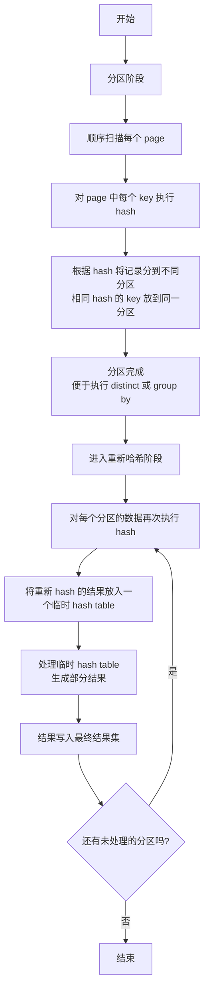

> 大家好，我是大头，职高毕业，现在大厂资深开发，前上市公司架构师，管理过10人团队！
> 我将持续分享成体系的知识以及我自身的转码经验、面试经验、架构技术分享、AI技术分享等！
> 愿景是带领更多人完成破局、打破信息差！我自身知道走到现在是如何艰难，因此让以后的人少走弯路！
> 无论你是统本CS专业出身、专科出身、还是我和一样职高毕业等。都可以跟着我学习，一起成长！一起涨工资挣钱！
> 关注我一起挣大钱！文末有惊喜哦！

> 关注我发送“MySQL知识图谱”领取完整的MySQL学习路线。
> 发送“电子书”即可领取价值上千的电子书资源。
> 发送“大厂内推”即可获取京东、美团等大厂内推信息，祝你获得高薪职位。
> 发送“AI”即可领取AI学习资料。

# MySQL零基础教程

本教程为零基础教程，零基础小白也可以直接学习。
基础篇和应用篇已经更新完成。
接下来是原理篇，原理篇的内容大致如下图所示。


 
## 零基础MySQL教程原理篇之执行节点的具体实现

在此之前，我们已经实现了数据库中的缓冲池和Hash索引。本次需要实现的是各个执行节点，包括增删改查、join操作等等。并实现一些优化器来对查询进行优化。

实现这个以后，就相当于一个真实的数据库了，可以支持所有数据库的操作。

在这里，使用的是MySQL使用的`Iterator Model`执行器模型。

### insert实现

假设我们有下面的SQL语句
```sql
INSERT INTO t1 VALUES (1, 'a'), (2, 'b');
```

会生成如下执行树


插入节点会通过节点1来获取我们要插入的两行数据。调用节点1的Next方法，每次获取一行数据。
- 调用子节点，也就是节点1的Next方法，循环调用，会循环2次
- 第一次的结果是(1, 'a')
- 第二次的结果是(2, 'b')

```c++
// 传入的第一个参数tuple用来承接返回的内容
// 第一次tuple就是(1, 'a')
// rid代表这个tuple的唯一ID
while (child_executor_->Next(tuple, rid)) {
}
```

插入相对简单，如果返回了数据，那么我们就执行插入。
- 首先，我们要初始化这一行要插入的数据的元数据。元数据有2个
    - isDelete: 代表这个数据是否删除，初始化为false
    - timestamp：时间戳，用来进行事务操作
- 调用底层的数据存储接口，将这一行数据插入到page中。
- 如果插入失败，继续获取下一行数据
- 如果插入成功，那么还需要更新索引，因为索引可能会有多个，因此更新索引是一个循环操作，循环更新每个索引
    - 根据数据的内容获取到索引的key
    - 调用索引的接口，将这个数据插入到索引，key是根据数据和索引来的，比如索引在id上，key就是id的值，然后索引的value就是rid，也就是数据的唯一标识。

还有一些细节，比如何时停止插入，因为上层也是调用的insert节点的Next方法进行插入的，所以还需要增加一个标识，初始化false，当while循环结束，插入完成以后，更新成true，每次Next方法被调用，先判断是否插入完成，没有插入完成才执行操作。

### 顺序扫描实现

顺序扫描也就是查询操作，当数据插入以后，就可以通过查询语句来查询出来了，查询的时候会进行顺序扫描表，一行一行数据返回给上层。

比如下面的SQL
```sql
select * from a
```

扫描节点一般就是最下面的节点，上面插入的时候，最下面的那个节点也可以看成是一个扫描节点，它扫描的是插入的数据，而查询的时候扫描的是表数据。

首先，在初始化节点的时候，需要初始化一个迭代器，这样，当迭代器循环结束，也就代表没有数据了。

```c++
// 初始化迭代器
rid_iter_ = rids_.begin();
```

在Next方法中，循环迭代器即可，因为扫描节点位于最底层，没有其他节点提供Next方法了。

```c++
while (rid_iter_ != rids_.end()) {
}
```

在循环中的流程如下
- 调用存储数据接口，通过rid来获取这一行数据。
- 判断数据的元数据中的isDelete，如果删除了，就获取下一行数据
- 没有删除，将我们获取到的rid和数据返回给上层

### delete实现

删除实现，看到这里，你应该也明白了，删除就是更新元数据中的isDelete标识。

这里为什么使用元数据来进行逻辑删除而不是直接物理删除呢？这是因为有事务的存在，物理删除需要放在事务提交的时候进行，在事务的处理中，只能使用逻辑删除。

假设下面的SQL：
```sql
DELETE FROM a;
```

其实会生成下面的执行树


我们和插入的时候一样，循环调用节点1的Next方法

```c++
while (child_executor_->Next(tuple, rid)) {
}
```

执行流程
- 获取tuple的元数据
- 修改isDelete为true
- 更新tuple的元数据
- 循环删除索引，这里跟插入基本一样，就是插入索引变成删除索引

### update实现

我们这里更新操作是通过扫描节点获取数据以后，将数据删除，然后再插入一个新的数据。来达到更新的效果。

获取到数据以后
- 更新元数据的isDelete来删除数据
- 将老数据包装成一个新的数据
- 将新数据以及新的元数据调用底层数据接口插入
- 插入成功以后需要更新索引，更新索引同样循环更新
    - 删除原来的索引
    - 插入新的索引

### 索引扫描实现

索引扫描同样位于所有执行节点的最下层，和顺序扫描的区别就是一个是全表扫描，一个是索引扫描。

在初始化的时候不再初始化迭代器，而是初始化索引信息。这里以hash索引为例。
```c++
htable_ = dynamic_cast<HashTableIndexForTwoIntegerColumn *>(index_info_->index_.get());
```

在之前实现索引的时候，我们就实现了根据key查询value的接口，因此这里直接调用这个接口就可以了。
```c++
std::vector<RID> result;
std::vector<Value> value = {plan_->pred_key_->val_};
Tuple index = {value, index_info_->index_->GetKeySchema()};
htable_->ScanKey(index, &result, exec_ctx_->GetTransaction());
```

如果没有查找到数据就返回false。

找到了就通过索引中找到的rid，去获取tuple的完整数据，看到这里发现了吗，这就是`回表`。

如果找到的数据没有被删除，就返回给上层。

### 顺序扫描优化成索引扫描

这是一个优化器级别的代码优化，它决定了何时使用索引，何时进行全表扫描。

我们可以先做一个判断，只针对顺序扫描做优化。

```c++
if (optimized_plan->GetType() == PlanType::SeqScan)
```

首先将节点转化成顺序扫描节点，因为我们判断了，因此转化是安全的。

```c++
// 转化成 seq scan
const auto &seq_scan_plan = dynamic_cast<const SeqScanPlanNode &>(*optimized_plan);
```

首先我们需要判断是否有where条件，毕竟没有的话，肯定是全表扫描了。

```c++
// where里面是个true，直接判断孩子不是空，就代表有where条件
if (seq_scan_plan.filter_predicate_ != nullptr && seq_scan_plan.filter_predicate_->children_.empty())

// 查看where条件里面是否有and or,有的话代表多个，不走索引
if (std::dynamic_pointer_cast<LogicExpression>(seq_scan_plan.filter_predicate_))
```

接下来查看是否相等，hash索引只能处理equal。如果是其他的索引，那么同样可以根据索引类型去做判断。

```c++
auto comparison_expr = std::dynamic_pointer_cast<ComparisonExpression>(seq_scan_plan.filter_predicate_);
if (comparison_expr->comp_type_ == ComparisonType::Equal)
```

如果相等，接下来查询索引有没有这个列。如果这个列没有建立索引，那么也走全表扫描

```c++
// 如果相等，接下来查询索引有没有这个列
// 获取 where a = 1 中的 a
auto column_expr = dynamic_cast<const ColumnValueExpression &>(*comparison_expr->GetChildAt(0));
// 根据谓词的列，获取表的索引信息
auto column_index = column_expr.GetColIdx();
```

接下来获取到所有的索引信息，循环，判断我们这个列是否命中了索引。命中以后，我们将它转化成索引扫描节点返回。

```c++
// 可以走index scan
// 获取where a = 1中的1
auto value_expr = std::dynamic_pointer_cast<ConstantValueExpression>(comparison_expr->GetChildAt(1));
ConstantValueExpression *raw_pred_key = value_expr ? value_expr.get() : nullptr;
return std::make_shared<IndexScanPlanNode>(seq_scan_plan.output_schema_, seq_scan_plan.table_oid_,
                                            index_info->index_oid_, seq_scan_plan.filter_predicate_,
                                            raw_pred_key);
```

### 聚合实现

聚合是指我们通常会使用的一些函数，比如
- count
- min
- max
- avg
- sum
- DISTINCT

还有比如`group by`和`having`操作。

聚合的实现，通常有两种方法
- 排序
- 哈希，通常哈希更好，因为都在内存中

> group by 和 distinct 本身执行的时候也是需要排序的

hash的具体实现如下
1. 分区
    - 可以顺序扫描每个page
    - 对于每个page的key进行hash，然后分区，hash相同的说明key相同，分到一个区里面
    - 这个时候不管distinct还是group by都可以方便的执行了
2. 重新哈希
    - 对于分区以后的数据再次进行hash
    - 再次hash的数据放入一个临时的hash table
    - 处理完一个临时的hash table就把结果写入结果集

具体的流程图如下：



排序的聚合实现，以distinct为例：
1. 先执行where条件筛选出符合的`tuple`
2. 再次根据列筛选出符合的列
3. 对于需要排序的列进行排序
4. 顺序扫描排序结果，实现去重，并生成最终结果

哈希的聚合实现，以distinct为例：
1. 先执行where条件筛选出符合的`tuple`
2. 再次根据列筛选出符合的列
3. 对于需要排序的列进行hash，先分区，再重新哈希。
4. 重新哈希的时候生成最终结果。

重新哈希的时候
- avg的话，需要再临时hash table里面存储key的数量和要求平均数的总数。在生成最终结果的时候进行计算平均数
- min的话，临时hash table里面存入最小数，生成最终结果直接取
- max同上
- sum同上
- count同上

我们可以使用`hash`来实现聚合操作。

因此，第一步，我们要进行分区。因为分区是一次行的，所以分区操作要放在聚合节点的初始化中。

```c++
// 在init里面构建hash table
child_executor_->Init();
aht_->Clear();
Tuple tuple{};
RID rid{};
aht_->GenerateInitialAggregateValue();
// 顺序扫描每个数据
while (child_executor_->Next(&tuple, &rid)) {
// 对于每个数据的key进行hash MakeAggregateKey(&tuple)
// 放到一个新的hash里面
aht_->InsertCombine(MakeAggregateKey(&tuple), MakeAggregateValue(&tuple));
}
// 创建hash table的iterator
aht_iterator_ = std::make_unique<SimpleAggregationHashTable::Iterator>(aht_->Begin());
```

分区主要流程如下：
- 初始化子节点也就是比如扫描a表
- 循环调用子节点，比如扫描a表，拿到一行一行的数据
- 将结果进行hash拿到key和聚合的值
- 循环结束以后，创建一个新的hash的迭代器

然后当上层节点调用聚合节点的Next函数的时候，就可以直接查询了。

首先可以判断一下，是否使用了group by并且hash中有数据，如果没有，就返回空或者返回错误等。

```c++
if (plan_->GetGroupBys().empty() && aht_->Begin() == aht_->End() && !is_exec_) {
    // 代表空的，返回一个默认tuple
    *tuple = {aht_->GenerateInitialAggregateValue().aggregates_, &GetOutputSchema()};
    is_exec_ = true;
    return true;
}
```

通过hash的迭代器进行循环，然后找到对应的数据，返回即可。

```c++
while (*aht_iterator_ != aht_->End()) {
    // hash table有值 emit出去
    // 是否有group by
    auto agg_key = aht_iterator_->Key();
    auto agg_val = aht_iterator_->Val();
    std::vector<Value> values{};
    for (auto &group_values : agg_key.group_bys_) {
        LOG_INFO("group values %s", group_values.ToString().c_str());
        values.emplace_back(group_values);
    }
    for (auto &agg_value : agg_val.aggregates_) {
        LOG_INFO("agg_value %s", agg_value.ToString().c_str());
        values.emplace_back(agg_value);
    }
    *tuple = {values, &GetOutputSchema()};
    ++(*aht_iterator_);
    return true;
}
```

### JOIN实现

join输出：数据
- 在join的时候把两张表的数据全部输出给下一个处理器，这包括了表的所有字段
- 好处是，接下来的处理不需要再拿其他字段了，所有字段都有了
- 坏处是，Join的时候数据量很大，因为有所有字段
- 可以进行优化，在join的时候只获取需要的字段

join输出：`record id`
- 在join的时候，只获取on的字段和`record id`，然后需要其他字段的时候在通过 `record id`去获取，这个很适合列存储数据库
- 第一个使用的是`vertica`列存储数据库，不过现在已经不用了

如何判断两个join算法的好坏？
- 通过IO来计算
- 假设左表R有M个page,m个tuple
- 右表S有N个page,n个tuple

join算法
- Nested Loop Join
    - simple/stupid
    - block
    - index
- Sort-Merge Join
- Hash Join
    - simple
    - GRACE(Externally partitioned)
    - Hybird

#### Nested Loop Join

##### Simple Nested Loop Join

- 通过两层for循环，然后符合条件的进行输出
- IO计算：因为外层循环要读取 M 个 page,循环的tuple 是 m,内存循环要读取N个page，所以内层循环的IO数是 m * N,总的IO：M + (m * N)
- 假设 M = 1000, m = 10 0000, N = 500, n = 40000, 总的IO = 1000 + (10 0000 * 500) = 5000 1000
- 假设 SSD 执行速度 0.1ms 一次IO，大概需要1.3个小时
- 如果N是左表，那么总IO = 500 + (4000 * 1000) = 400 0500,大概需要1.1个小时
- 所以如果左表是小表，性能更好

```java
for (Tuple r: R) {
    for (Tuple s: S) {
        if (s.id == r.id) {
            // 输出
        }
    }
}
```

##### Block Nested Loop Join

- 对simple的优化，不在循环tuple，而是循环page，将page打包成block，然后循环block
- 这样的话对于内层循环来说IO就是 M * N，总的IO就是 M + (M * N)
- 假设 M = 1000, m = 10 0000, N = 500, n = 40000, 总的IO = 1000 + (1000 * 500) = 50 1000
- 假设 SSD 执行速度 0.1ms 一次IO，大概需要50s

```java
// 这个看上去循环多了，不过因为预先读取了两个block才循环，所以循环是在内存中，IO次数少了
for (Block br: R) {
    for (Block bs: S) {
        for (Tuple r: br) {
            for (Tuple s: bs) {
                if (s.id == r.id) {
                    // 输出
                }
            }
        }
    }
}
```

###### Block Nested Loop Join优化

- 假设buffer pool容量是B,可以先获取B - 2个左表的Block,剩下2个位置，一个是获取右表的 Block 的，一个是输出的。
- 这样的话总的IO次数：M + ([M/(B-2)] * N), M/(B - 2)向上取整
- 最好的情况是 B > M + 2，代表一次性能获取所有的左表的Block
- 这样总的IO就变成 M + N
- 假设 M = 1000, m = 10 0000, N = 500, n = 40000, 总的IO = 1000  + 500 = 1500
- 假设 SSD 执行速度 0.1ms 一次IO，大概需要0.15s

##### Index Nested Loop Join

假设s.id有索引，那么就可以根据索引进行匹配，加快速度.
- 总的成本将是`M + (m * C)` C是索引需要的时间

```java
for (Tuple r: R) {
    for (Tuple s: Index(r = s)) {
        if (s.id == r.id) {
            // 输出
        }
    }
}
```

#### Sort Merge Join

- Sort：先对要join的字段进行排序
- Merge: 用两个指针进行匹配，如果数据匹配就输出，因为数据已经排序好了，所以只需要扫描一次就行了
- 这样的话总IO就是 sort io + merge io, merge io = M + N, sort io看具体的排序算法
- 最好的情况是要join的key本身已经是有序的了，那么只需要merge io = M + N,比如有索引，比如查询的时候使用了order by 

```java
sort R,S on join keys
cursorR = RSorted, cursorS = Ssorted;
while (cursorR && cursorS) {
    if (cursorR > cursorS) {
        // 相当于内层循环指向下一个
        cursorS++;
    }
    if (cursorR < cursorS) {
        // 相当于外层循环指向下一个
        cursorR++;
    }
    if (cursorR == cursorS) {
        // 输出 && 内层循环指向下一个
        cursorS++;
    }
}
```

#### Hash Join

- Build: 先对左表要join的key进行hash，构建一个hash table
- probe: 在对右表要join的key进行hash, hash相同的会放入同一个 bucket,也就完成了匹配

```java
for (Tuple r: R) {
    insert hash(r) into hash table ht
}
for (Tuple s: S) {
    insert hash(s) into hash tbale ht
}
```

Hash Join优化
- 可以添加 `布隆过滤器` 来优化，这样的话在probe阶段，对右表的key， hash以后先查询布隆过滤器，如果false，就不需要在放入hash table去匹配了
- 如果true在去hash table里面匹配数据完成输出

Grace Hash Join
- 在 hash join中，只构建一个hash table来存储左表数据，右表的hash完成直接匹配
- Grace hash join中，构建两个hash table，然后进行 nested loop join
- 总的IO： 3(M + N),大约0.45s

hash 几乎总是好的。
排序是好的情况有两种
- non-uniform数据，排序更好
- 对于需要排序的数据，比如order by,排序更好


#### 我们先实现一个最简单的NestedLoopJoin

首先循环右表

```c++
while (right_executor_->Next(&right_tuple, &right_rid))
```

接下来判断是否满足JOIN条件。

```c++
auto join_value = plan_->Predicate()->EvaluateJoin(&left_tuple_, left_schema_, &right_tuple, right_schema_);
if (!join_value.IsNull() && join_value.GetAs<bool>())
```

满足join条件 将两个tuple变成一个tuple，返回出去，比如左表a,b,c三列，右表d,e两列，合并成a,b,c,d,e一共五列。

```c++
// 满足join条件 将两个tuple变成一个tuple，返回出去
std::vector<Value> value = {};
for (uint32_t i = 0; i < left_count_; i++) {
    // 把左表的列全放进去
    Value temp_value = left_tuple_.GetValue(&left_schema_, i);
    value.push_back(temp_value);
}

// 把右表的列全放进去
for (uint32_t i = 0; i < right_count_; i++) {
    // 把左表的列全放进去
    value.push_back(right_tuple.GetValue(&right_schema_, i));
}

// 创建tuple
is_join_ = true;
*tuple = {value, &schema_};
return true;
```

如果是Left JOIN呢，我们就还需要判断一下进行处理。因为对于 left join 来说，以左表为准，所以需要把左表的数据放进去，右表对应的数据放null就可以了。

```c++
if (plan_->GetJoinType() == JoinType::LEFT) {
    if (!is_join_) {
        is_join_ = true;
        // 如果右表都扫描完了还是没有join，那么就算空
        std::vector<Value> value = {};
        for (uint32_t i = 0; i < left_count_; i++) {
          // 把左表的列全放进去
          value.push_back(left_tuple_.GetValue(&left_schema_, i));
        }
        // 右表的全放null
        for (uint32_t i = 0; i < right_count_; i++) {
          // 把左表的列全放进去
          Value null_value = ValueFactory::GetNullValueByType(TypeId::INTEGER);
          value.push_back(null_value);
        }
        *tuple = Tuple(value, &schema_);
        return true;
    }
}
```

#### 再实现一个效果更好的Hash JOIN

上面已经说过了，Hash Join分成两步
- Build: 先对左表要join的key进行hash，构建一个hash table
- probe: 在对右表要join的key进行hash, hash相同的会放入同一个 bucket,也就完成了匹配

Build这一步实际上是一个一次行的，跟聚合那个差不多，因此要放在节点初始化中。循环获取左表的数据，然后构建一个Hash Table放进去。

```c++
while (left_executor_->Next(&left_tuple, &left_rid)) {
    // 获取左表数据 build hash table
    JoinValue jv{};
    jv.join_values_.push_back(left_tuple);
    jv.is_matched_ = false;
    jht_->Insert(MakeJoinLeftKey(&left_tuple), jv);
}
```

在上层调用Hash Join的Next方法的时候，进行第二步`probe`。

首先循环获取右表的值，然后进行hash，对这个hash的key进行获取，如果从hash table中获取到了，那么说明这两个key是一样的。

那么就可以进行JOIN操作了。

```c++
// 右表执行探测
RID right_rid{};
while (right_executor_->Next(&right_tuple_, &right_rid)) {
    // 右表
    // hash
    JoinValue jv{};
    if (jht_->Get(MakeJoinRightKey(&right_tuple_), &jv)) {
        // 里面left有数据 匹配成功
        left_tuples_ = jv.join_values_;
        left_tuple_iter_ = std::make_unique<std::vector<bustub::Tuple>::iterator>(left_tuples_.begin());
        // 合并两个tuple
        std::vector<Value> value = {};
        for (uint32_t i = 0; i < left_count_; i++) {
            // 把左表的列全放进去
            Value temp_value = (*left_tuple_iter_)->GetValue(&left_schema_, i);
            value.push_back(temp_value);
        }

        // 把右表的列全放进去
        for (uint32_t i = 0; i < right_count_; i++) {
            // 把左表的列全放进去
            value.push_back(right_tuple_.GetValue(&right_schema_, i));
        }

        // 创建tuple
        *tuple = {value, &schema_};
        ++(*left_tuple_iter_);
        return true;
    }
}
```

同样，在下面要对left JOIN做出一些处理。

```c++
// left join
  if (plan_->GetJoinType() == JoinType::LEFT) {
    left_tuples_ = {};
    jht_->Remaind(&left_tuples_);
    if (!left_tuples_.empty()) {
        // 把剩下的emit出去
        left_tuple_iter_ = std::make_unique<std::vector<bustub::Tuple>::iterator>(left_tuples_.begin());
        // 如果右表都扫描完了还是没有join，那么就算空
        std::vector<Value> value = {};
        for (uint32_t i = 0; i < left_count_; i++) {
            // 把左表的列全放进去
            value.push_back((*left_tuple_iter_)->GetValue(&left_schema_, i));
        }
        // 右表的全放null
        for (uint32_t i = 0; i < right_count_; i++) {
            // 把左表的列全放进去
            Value null_value = ValueFactory::GetNullValueByType(TypeId::INTEGER);
            value.push_back(null_value);
        }
        *tuple = Tuple(value, &schema_);
        ++(*left_tuple_iter_);
        is_null_ = true;
        return true;
    }
    return false;
}
```

这里最大的不同在于需要在执行probe的前面增加一个判断剩余的代码。如果最后的时候，坐表数据还有剩余，那么就把剩余的这些数据返回，右表数据按照null处理。

```c++
while (left_tuple_iter_ != nullptr && *left_tuple_iter_ != left_tuples_.end()) {
    //直接返回emit
    // 合并两个tuple
    std::vector<Value> value = {};
    for (uint32_t i = 0; i < left_count_; i++) {
      // 把左表的列全放进去
      Value temp_value = (*left_tuple_iter_)->GetValue(&left_schema_, i);
      value.push_back(temp_value);
    }

    if (is_null_) {
      // 右表的全放null
      for (uint32_t i = 0; i < right_count_; i++) {
        // 把左表的列全放进去
        Value null_value = ValueFactory::GetNullValueByType(TypeId::INTEGER);
        value.push_back(null_value);
      }
    } else {
      // 把右表的列全放进去
      for (uint32_t i = 0; i < right_count_; i++) {
        // 把左表的列全放进去
        value.push_back(right_tuple_.GetValue(&right_schema_, i));
      }
    }

    // 创建tuple
    *tuple = {value, &schema_};
    ++(*left_tuple_iter_);
    return true;
}
```

### 将 NestedLoopJoin 优化成 Hash JOIN

这个优化可以参考上面的那个优化实现，同样需要先判断类型，然后转化成 NestedLoopJoin 执行节点。

```c++
if (optimized_plan->GetType() == PlanType::NestedLoopJoin) {
// 转化成 nlj join
const auto &nlj_join_plan = dynamic_cast<const NestedLoopJoinPlanNode &>(*optimized_plan);
}
```

因为JOIN的where其实是on，因此where里面其实就是个true，直接判断孩子不是空，就代表有where条件

```c++
auto predicate = nlj_join_plan.Predicate();
if (predicate != nullptr && predicate->children_.empty())
```

查看where条件里面是否是`=`， 是的话代表可以`hash join`,基本上所有的JOIN条件应该都是等于，因此都可以使用Hash JOIN来实现。

因此，重点看一下如何判断是否能使用Hash JOIN的代码。

首先，要进行递归判断左边和右边的条件是否满足Hash Join。然后就是看，是否是`=`了，如果是，那么还需要做一些处理。

```c++
if (logic_expr != nullptr && logic_expr->logic_type_ == LogicType::And) {
    // 递归
    if (!IsHashJoin(predicate->children_[0], left_exprs, right_exprs)) {
      return false;
    }
    if (!IsHashJoin(predicate->children_[1], left_exprs, right_exprs)) {
      return false;
    }
    return true;
}
// 不是and 看是否 =
auto comparison_expr = std::dynamic_pointer_cast<ComparisonExpression>(predicate);
if (comparison_expr != nullptr && comparison_expr->comp_type_ == ComparisonType::Equal) {
    // 到叶子节点了
    if (const auto *left_expr = dynamic_cast<const ColumnValueExpression *>(comparison_expr->children_[0].get());
        left_expr != nullptr) {
      if (const auto *right_expr = dynamic_cast<const ColumnValueExpression *>(comparison_expr->children_[1].get());
          right_expr != nullptr) {
        // 判断 left.a = right.b 和 right.b = left.a的情况
        if (left_expr->GetTupleIdx() == 0) {
          // 取左边的列
          left_exprs->emplace_back(std::move(comparison_expr->children_[0]));
          right_exprs->emplace_back(std::move(comparison_expr->children_[1]));
        } else {
          // 取左边的列
          left_exprs->emplace_back(std::move(comparison_expr->children_[1]));
          right_exprs->emplace_back(std::move(comparison_expr->children_[0]));
        }
        return true;
      }
    }
}
```

### 排序实现

排序的好处
- 有序的数据创建索引的时候可以快速的先创建叶子节点，在创建父结点
- 有序的数据在`order by`分组的时候可以更快的分组
- 有序的数据在`distinct`去重的时候可以更快的去重

排序算法
- 在内存中
    - 可以使用各种算法
    - 但是有的数据内存放不下，就需要在磁盘上排序
    - 需要先知道`可以用内存的大小`，这样就知道该内存排序还是磁盘排序
- 在磁盘上
    - 快排会产生更多的随机IO,会更慢
    - 使用`归并排序`更好，分成多个`runs`,对每个run排序，然后在通过`二路归并`生成总的排序，这可以减少随机IO
    - 外部归并排序，需要3个`buffer pool`，2个用来排序run，1个用来二路归并。 
    - 次数：1 + log(n)
    - 总的IO数: 2N * (# of passes)
    - 可以通过`预取`来优化，当对page排序的时候，另外一个线程先取出下次要排序的page。

聚簇索引
- 排序的字段如果建立了聚簇索引，就不需要在排序了，直接可以走聚簇索引拿到排序好的数据

#### top-N heap sort

比如下面的sql
```sql
select * from a
order by id ASC
limit 2;
```

那么首先创建一个大小为2的有序数组或优先级队列之类的。假设我们的数据是
```
{id:3, name: xxx}, {id:4, name:xxx}, {id:5, name:xxx}, {id:2, name:xxx}
```
这个时候优先级队列是空的
```
{}
```

然后扫描id为3的数据，放入优先级队列，再扫描id为4的数据，放入优先级队列。这个时候队列数据是
```
{id:3, name: xxx}, {id:4, name:xxx}
```

接下来扫描id5的数据，放不进优先级队列，因为id大，最后扫描id2的数据，放入优先级队列，队列就排好序了
```
{id:2, name:xxx},{id:3, name: xxx}
```


#### external merge sort

当数据太大，无法放在内存中的时候，需要借助外部的文件来进行排序
- 先排序小块的数据，然后写入文件
- 在将文件的内容合并

early materialization
- 将数据放在排序的数据里面，排序以后可以直接返回数据，行数据库一般用这个

late materialization
- 排序的数据里存的是tuple id or record id, 排序以后再根据id查询数据返回


优化方法
- 增加buffer pool在排序中可用的内存，当一个输出page进行写入IO的时候，CPU处理另一个输出page。
- 多线程，一个线程进行page排序，另外一个线程进行二路归并。

实际的实现上，不可能每次Next的时候进行排序，因此，排序操作放在排序节点的初始化上，将排序结果保存，每次Next只是获取排序后的结果即可。

```c++
while (child_executor_->Next(&tuple, &rid)) {
    tuples_.emplace_back(tuple);
}
auto order_bys = plan_->GetOrderBy();
// 排序
std::sort(tuples_.begin(), tuples_.end(), Comparator(&plan_->OutputSchema(), order_bys));
```

### Limit实现

limit实现其实是非常简单的，我们可以看下面的SQL

```sql
select * from a limit 2
```

会生成下面的执行树


因此，limit要做的就是进行一个计数，如果数量达到2，就停止调用节点1的Next方法就可以了。

```c++
if (current_limit_ == plan_->GetLimit()) {
    return false;
}
while (child_executor_->Next(tuple, rid)) {
    ++current_limit_;
    return true;
}
return false;
```

### TopN优化

topN其实是一种排序+limit的优化，实现的过程上面已经讲过了，来看一下具体的代码实现。

首先，要根据`order by`来判断是升序还是降序，升序是构建最大堆，降序是构建最小堆。并且在优先级队列中，只保留N个元素即可。

```c++
while (child_executor_->Next(&tuple, &rid)) {
    priority_queue.push(tuple);
    if (priority_queue.size() > plan_->GetN()) {
      priority_queue.pop();
    }
}
```

最后，可以构建一个stack用来倒序输出元素，这样就完成TopN算法。

在优化器阶段，也需要进行一些操作，当遇到排序+limit逻辑的时候，不再使用排序节点+limit节点来实现，而是直接使用TopN节点来实现。

```c++
if (optimized_plan->GetType() == PlanType::Limit) {
    // 转化成 limit scan
    const auto &limit_plan = dynamic_cast<const LimitPlanNode &>(*optimized_plan);
    // 子节点是 sort plan
    if (limit_plan.GetChildPlan() != nullptr && limit_plan.GetChildPlan()->GetType() == PlanType::Sort) {
        // 转成 sort plan
        const auto &sort_plan = dynamic_cast<const SortPlanNode &>(*limit_plan.GetChildPlan());
        bustub::SchemaRef schema = std::make_shared<Schema>(limit_plan.OutputSchema());
        return std::make_shared<TopNPlanNode>(std::move(schema), sort_plan.GetChildPlan(), sort_plan.GetOrderBy(),limit_plan.GetLimit());
    }
}
```

## 结论

本实现基于CMU15445课程的Fall2023的Lab3实现，详细介绍了实现思路，对于了解数据库的查询实现有着重要的意义。

## 文末福利

> 关注我发送“MySQL知识图谱”领取完整的MySQL学习路线。
> 发送“电子书”即可领取价值上千的电子书资源。
> 发送“大厂内推”即可获取京东、美团等大厂内推信息，祝你获得高薪职位。
> 发送“AI”即可领取AI学习资料。
> 部分电子书如图所示。


