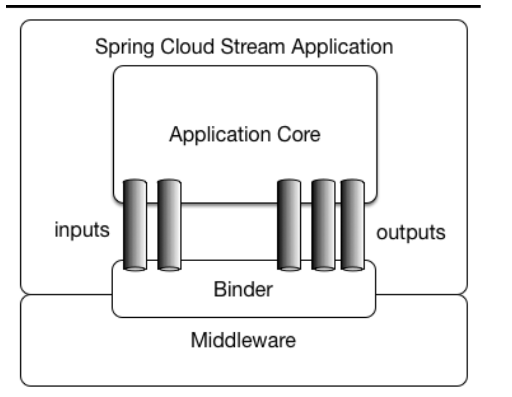
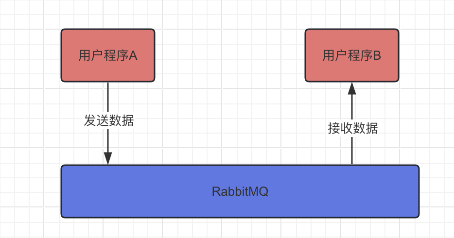
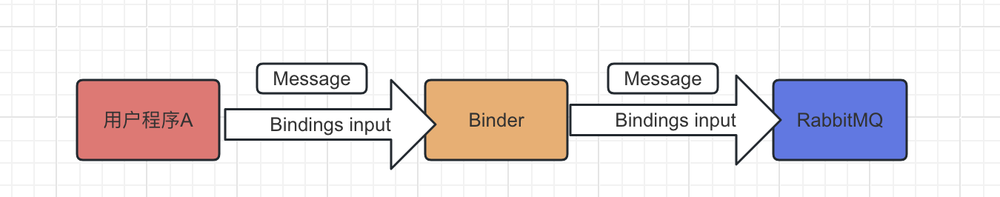
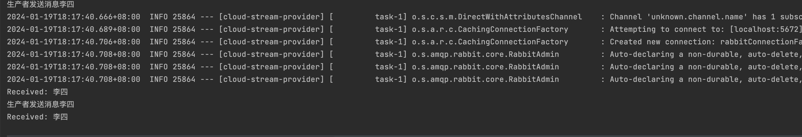

# springCloudStream

## 简介

`Spring Cloud Stream`是一个框架，用于构建与共享消息传递系统连接的高度可扩展的事件驱动微服务。

该框架提供了一个灵活的编程模型，该模型建立在已经建立和熟悉的 Spring 习惯用语和最佳实践之上，包括对持久发布/订阅语义、消费者组和有状态分区的支持。

核心模块
- Destination Binders： 负责提供与外部消息系统集成的组件
- Destination Bindings： 外部消息系统和用户程序代码之间的桥梁(生产者-使用者之间的桥梁)
- Message：生产者和消费者用于与Destination Binders（以及通过外部消息系统与其他应用程序）通信的规范数据结构。

### 历史

Spring 的数据集成之旅始于 Spring Integration。通过其编程模型，它提供了一致的开发人员体验来构建应用程序，这些应用程序可以采用企业集成模式来连接外部系统，例如数据库、消息代理等。

快进到云时代，微服务在企业环境中变得突出。Spring Boot 改变了开发人员构建应用程序的方式。借助 Spring 的编程模型和 Spring Boot 处理的运行时职责，可以无缝开发独立的、基于 Spring 的生产级微服务。

为了将其扩展到数据集成工作负载，Spring Integration 和 Spring Boot 被放在一个新项目中。Spring Cloud Stream 诞生了。

### 架构模型



这张图是spring-stream官网的，里面的`Middleware`指的就是`RabbitMQ`或者`KafKa`这些消息队列。

下图是我们原来和消息队列通信的方式。我们的程序直接发送数据给MQ或者监听到MQ的数据。



通过`spring stream`来做的话，就增加了`Binder`层来做统一调度，我们的程序只需要和Binder层通信，不需要关注底层的MQ是`RabbitMQ`还是`Kafka`。

目前官方提供了两个`Binder`，分别是`RabbitMQ`的和`Kafka`的，其余队列的有一些第三方维护的。同时我们也可以自己实现`Binder`。

一开始图中的`Input`和`Output`是对于`spring stream`来说的，input就是输入消息到stream中，output就是输出消息到我们的程序中。

简单介绍一下Binder，其实就是`策略模式`，统一接口实现，比如MQ1里面发送消息到MQ的方法叫`Publish`，MQ2里面发送消息到MQ的方法叫`Release`，但是在Binder接口里面提供了一个方法，就叫做`add`。也只需要提供一个Message消息。

```java
public interface Binder{
    function add(Message msg);
}

// 连接MQ1的Binder
public class Binder1 implements Binder{
    public function add(Message msg){
        // 消息处理
        // 发送到MQ1
        publish(msg);
    }
}

// 连接MQ2的Binder
public class Binder2 implements Binder{
    public function add(Message msg){
        // 消息处理
        // 发送到MQ2
        release(msg);
    }
}
```

当我们使用的时候只需要自己决定使用哪个Binder就可以了。就是就和连接数据库一样，不需要关心连接的是Mysql还是PostgreSql。

```java
public class main{
    public static function main() {
        Binder binder = new Binder1();
        Message msg = new Message();
        binder.add(msg);
    }
}
```

#### Bindings

Bindings作为一个桥梁，负责连接MQ和用户代码。比如绑定一个代码作为input往某一个Queue里面输入信息，绑定一个代码作为output从某个Queue里面接收信息。然后我们使用Binder来实现推送消息到MQ和消费消息。

```
这里是官网原文：The application communicates with the outside world by establishing bindings between destinations exposed by the external brokers and input/output arguments in your code. Broker specific details necessary to establish bindings are handled by middleware-specific Binder implementations.
```

下图为Bindings和Binder的关系



#### source 和 sink

source其实就是发送方的发送的Message. sink就是接收方接受的Message

## 注解实现

```
注解的实现已经被彻底删除,只有之前低版本的还能使用
```

## 函数式编程实现示例

### 依赖引入

将下面的代码加入`pom`文件，然后使用`maven`导入相关依赖即可。

```
// 引入spring cloud stream依赖
<dependency>
    <groupId>org.springframework.cloud</groupId>
    <artifactId>spring-cloud-stream</artifactId>
</dependency>
// 引入spring cloud stream的rabbit binder依赖
// 如果是kafka，那么把这个换成kafka的binder
// 在这个binder里面已经引入了 rabbit MQ依赖，所以不需要再单独引入rabbit MQ了
<dependency>
    <groupId>org.springframework.cloud</groupId>
    <artifactId>spring-cloud-stream-binder-rabbit</artifactId>
</dependency>
```

### 配置文件

```yml
server:
  port: 8801

spring:
  application:
    name: cloud-stream-provider
  cloud:
    stream: # stream的配置
      binders: # 在此处配置要绑定的rabbitmq的服务信息；
        defaultRabbit: # 表示定义的名称，用于于binding整合
          type: rabbit # 消息组件类型
          environment: # 设置rabbitmq的相关的环境配置
            spring:
              rabbitmq:
                host: localhost
                port: 5672
                username: guest
                password: guest
```

### 生产者

##### 配置文件修改

对于函数式编程来说，`spring cloud stream`有一些`约定`或者说`规定`。比如我们注册了一个`logPub`的`Bean`，那么它对应的`bindings`配置的名称就是`logPub-in-0`或者`logPub-out-0`，前面是我们的方法名，中间表示生产者或消费者，`in`表示消费者，`out`表示生产者。这里的in or out是对于我们的代码来说的。后面的0就是一个序号。

写生产者之前我们需要加上对应的`bindings`配置。如果注册了多个`Bean`作为生产者或消费者，那么还需要配置哪些`Bean`是生产者和消费者。

```yml

spring:
  cloud:
    function: # 配置哪些Bean是Stream可以用的
        definition: log;logPub;sendLog
    stream: # stream的配置
        bindings: # 服务的整合处理
            logPub-out-0:
                destination: log # 表示要使用的Exchange名称定义,不存在会自动创建
                content-type: application/json # 设置消息类型，本次为json，文本则设置“text/plain”
```

##### 写代码

随便新建一个类，并标记为`@Component`，主要是要让spring知道这个类。类名可以随便起。

```java
@Component
public class logProducer {

}
```

然后开始编写生产者的代码。加入主要的方法`log`，方法名可以随便起，只需要记得把这个方法注册为一个`Bean`就可以了。一定要在上面加`@Bean`注解。

方法的返回值只能是`Supplier`函数接口类型。不能是其他的。

方法里面可以写生产者的具体代码。会注册一个名为`logPub`的`Bean`作为生产者。

```java
@Component
public class logListener {
    @Bean
    public Supplier<logListener.Person> logPub() {
        return () -> {
            Person person = new Person();
            person.setName("张三");
            System.out.println("生产者:"+person);
            return person;
        };
    }

    public static class Person {
        private String name;
        public String getName() {
            return name;
        }
        public void setName(String name) {
            this.name = name;
        }
        @Override
        public String toString() {
            return this.name;
        }
    }
}
```

关于`Supplier`，这个是java提供的`函数式编程的接口`。从java8开始提供的，java8里面的stream功能也用到了函数式编程。

下面是`Supplier`的注释和定义

```java
//Represents a supplier of results.
//There is no requirement that a new or distinct result be returned each time the supplier is invoked.
//This is a functional interface whose functional method is get().

public interface Supplier<T>
```
翻译过来大概就是：`一个结果的提供者`或者`一个结果的生产者`。正好对应我们的生产者。该接口只有一个方法`T get()`，没有参数并且仅返回一个结果。

##### 运行

运行的话会发现控制台一直在打印。我们的队列里面也一直在新增。


##### StreamBridge

当前的运行方式是当写完生产者以后，`spring cloud stream`会1/s次来调用我们的生产者，但是我们一般是自己来控制生产者的调用。就可以使用下面的方法。

我们可以通过`StreamBridge`来做到这一点。他有四个`send`方法。
- public boolean send(String bindingName, Object data)：第一个参数是bindingName，我们输入的是sendLog,就需要增加sendLog的配置，我们也可以用之前的`logPub-out-0`。第二个参数是发送的数据。
- public boolean send(String bindingName, Object data, MimeType outputContentType)：比上面的多了一个数据类型。
- public boolean send(String bindingName, @Nullable String binderName, Object data)：还可以指定Binder的name
- public boolean send(String bindingName, @Nullable String binderName, Object data, MimeType outputContentType): 四个参数放在一起了。

```java
@RestController
public class logController {

    @Autowired
    private StreamBridge streamBridge;

    @GetMapping("/sendLog")
    public void sendLog() {
        logListener.Person person = new logListener.Person();
        person.setName("李四");
        System.out.println("生产者发送消息"+person);
        streamBridge.send("sendLog", person);
    }
}

```

### 消费者

随便新建一个类，并标记为`@Component`，主要是要让spring知道这个类。类名可以随便起。

```java
@Component
public class logListener {

}
```

然后开始编写消费者的代码。加入主要的方法`log`，方法名可以随便起，只需要记得把这个方法注册为一个`Bean`就可以了。一定要在上面加`@Bean`注解。

方法的返回值可以是`Consumer`，也可以是`Function`。不能是其他的。

方法里面就可以写消费的具体代码了。

```java
@Component
public class logListener {
    @Bean
    public Consumer<logListener.Person> log() {
        return person -> {
            System.out.println("Received: " + person);
        };
    }

    public static class Person {
        private String name;
        public String getName() {
            return name;
        }
        public void setName(String name) {
            this.name = name;
        }
        @Override
        public String toString() {
            return this.name;
        }
    }
}
```

关于`Consumer`和`Function`，这两个是java提供的`函数式编程的接口`。从java8开始提供的，java8里面的stream功能也用到了函数式编程。

下面是`Consumer`接口的注释和接口的定义。
```java
//Represents an operation that accepts a single input argument and returns no result. Unlike most other functional interfaces, Consumer is expected to operate via side-effects.
//This is a functional interface whose functional method is accept(Object).

public interface Consumer<T>
```
翻译过来大概就是说Consumer接口`仅接收一个参数`并且没有返回值，我们的代码里面也可以看到，接收了一个person参数，没有return。

该接口只有一个方法`void accept(T t)`，T类型就是我们的Person类型。

下面是`Function`接口的注释和定义
```java
//Represents a function that accepts one argument and produces a result.
//This is a functional interface whose functional method is apply(Object).
public interface Function<T, R>
```
翻译过来大概就是说`Function`接口`仅接收一个参数`并且`返回一个结果`。该接口只有一个方法`R apply(T t)`，接收一个T类型的参数，返回一个R类型的结果。




##### 手动ACK

通过禁止使用死信队列来执行手动的ACK,这个时候如果抛出异常，则会重试。如果开启了死信队列，那么抛出异常以后则会进入死信队列。

```yml
log-in-0:
    consumer:
        auto-bind-dlq: false
```

### 队列持久化

上面可以看出来，创建的都是`匿名队列`，当程序启动的时候自动创建，当程序关闭的时候自动删除。

但是正常开发中，很少使用这种，都会指定一个持久化的队列，不管程序是否运行，队列都存在。

我们可以在`bindings`的配置里面增加`group`配置来显式指定哪个队列，我们指定`log123`队列。

```yml
log-in-0:
    destination: log
    content-type: application/json # 设置消息类型，本次为json，文本则设置“text/plain”
    group: log123
sendLog:
    destination: log
    content-type: application/json # 设置消息类型，本次为json，文本则设置“text/plain”
    group: log123
```

再次运行程序，可以看到该队列被创建。接下来停止程序，可以看到队列还存在那里。

### bindings重命名

默认约定的名称为`log-in-0`这种形式

但是我们也可以将它重命名。通过配置文件可以将`log-in-0`重命名为`input`，不过这样的话，所有的log-in-0的bindings配置都需要修改成input，使用上也是。注意官方并不推荐这种做法，他们认为在大多数情况下，这有点矫枉过正。

```yml
spring:
    cloud:
        stream:
            function:
                bindings:
                    log-in-0: input
```


### 显式绑定创建

默认约定的是`log-in-0`负责输入，`log-out-0`负责输出，我们也可以显式的创建这些。

通过配置文件
```yml
spring:
    cloud:
        stream:
            input-bindings: login;fooin
            output-bindings: logout;fooout
```

### 轮询配置属性

```yml
spring:
    integration:
        poller:
            # 全局配置
            fixedDelay: 1000L # 默认轮询器的延迟 单位毫秒，默认1000L 
            maxMessagesPerPoll: 1L # 默认轮询器的每个轮询事件的最大消息数。默认 1L
            cron: none # Cron 触发器的 Cron 表达式值。默认 none
            initialDelay: 0 # 周期性触发的初始延迟。 默认0
            timeUnit: MILLISECONDS # 要应用于延迟值的 TimeUnit。默认 MILLISECONDS
```

也可以单独为某个bindings来配置

```yml
spring:
    cloud:
        stream:
            bindings:
                log-out-0:
                    producer:
                        poller:
                            # log-out-0的单独配置
                            fixedDelay: 1000L # 默认轮询器的延迟 单位毫秒，默认1000L 
                            maxMessagesPerPoll: 1L # 默认轮询器的每个轮询事件的最大消息数。默认 1L
                            cron: none # Cron 触发器的 Cron 表达式值。默认 none
                            initialDelay: 0 # 周期性触发的初始延迟。 默认0
                            timeUnit: MILLISECONDS # 要应用于延迟值的 TimeUnit。默认 MILLISECONDS
```

### 函数组合

假设我们有两个处理`Bean`,`enrich`负责检查header，如果缺少foo,就添加为foo,bar。然后第二个echo则负责检查是否包含foo这个Header然后输出消息内容。

```java
@Bean
public Function<Message<String>, Message<String>> enrich() {
    return message -> {
        Assert.isTrue(!message.getHeaders().containsKey("foo"), "Should NOT contain 'foo' header");
        return MessageBuilder.fromMessage(message).setHeader("foo", "bar").build();
    };
}

@Bean
public Function<Message<String>, Message<String>> echo() {
    return message -> {
        Assert.isTrue(message.getHeaders().containsKey("foo"), "Should contain 'foo' header");
        System.out.println("Incoming message " + message);
        return message;
    };
}
```

通过配置将这两个bean组合起来,组合之后，这个bean名称就编程了`enrich|echo`,后续的配置都需要这种冗长的名称，所以这里官方推荐使用重命名的方式将它变成简单的名称。

```yml
spring:
    cloud:
        function:
            definition: enrich|echo # 函数组合
        stream:
            function: 
                bindings:
                    enrich|echo-in-0: input # 重命名
```
