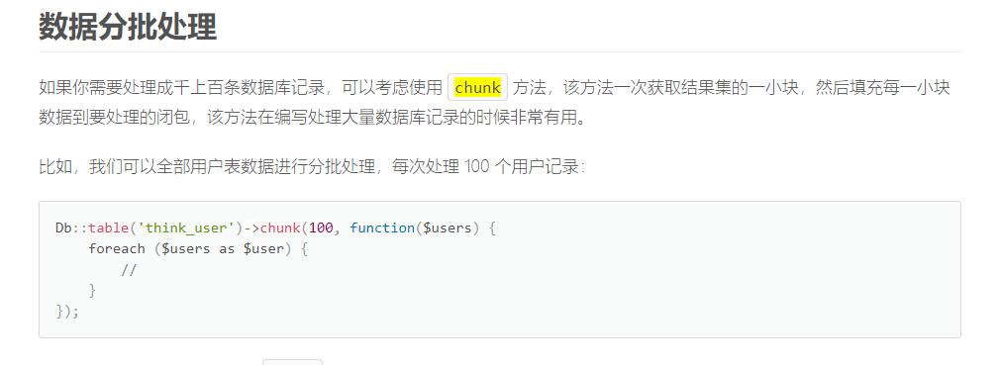
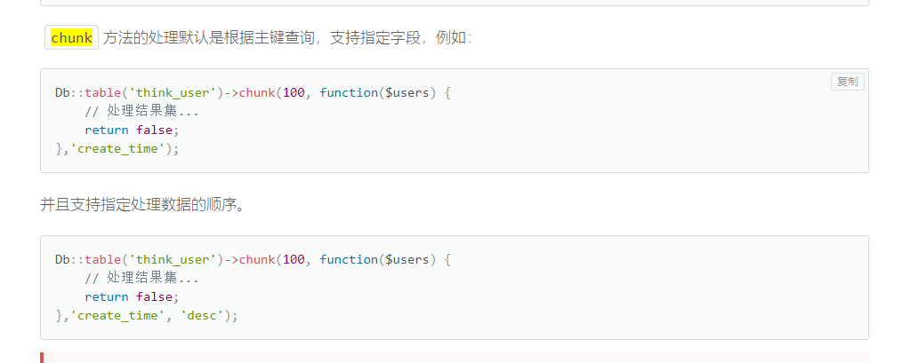

# thinkphp-tp6使用chunk分块操作数据的坑

有的时候我们会遇到需要定时操作数据的需求，比如定时更新所有用户的权益，徽章等等。这个时候你不能一次性取出所有数据来进行操作，因为数据量太大了，我们一次取出全部，先不说mysql数据库会很慢，就算取出来传给你，网络开销也很大。这时候你通过网络接收到数据以后，会把这些数据放到一个变量里面。这个变量是存在内存中的，如果过大还会导致内存溢出，内存不足的问题。

所以我们就需要分页取出数据来进行操作，比如每次取出100条，操作完了再取出下100条。而tp框架提供了一个方便的`chunk`方法来供我们使用，免去了我们需要手动`limit`分页的麻烦。

我之前使用过laravel的chunk，以为两个差不多，看了文档也觉得差不多。下图是tp6文档的描述。



其实单表这么写也没有什么问题，不过一旦你使用了连表查询，就出现问题了。。而他的文档并没有说连表的问题。

虽然他的文档有这么一段也说明了主键和排序的问题。



但是，没想到连表的时候是必须，注意，必须！！！传主键，不然他不知道是哪个表的主键。而laravel就没有这个问题。。

我当时写的时候去找了他的源码，才看到这个问题，因为我正常写完后一直报错。。

看一下他的源码。源码位置在`./vendor/topthink/think-orm/src/db/query.php`里面的`chunk`方法。


从这里可以看到他有4个参数。

- count 每次处理的数量
- callback 处理的回调函数
- column 处理的字段名 默认 null
- order 字段排序 默认asc

前两个我们必传，后面的可选。

他的第二行代码，如果你传了第三个参数，那么使用你传的，不然调用getPk这个函数。这个函数在源码里面也有，就是获取主键。假设你不传，你的主键是id，那么`column`这个变量就是id。

```php
$column  = $column ?: $this->getPk();
```

接下来的代码你会发现你的`column`参数，还可以传一个数组。如果是一个数组，那么他在这里不使用这个参数。

如果你传的不是一个数组，那么看有没有`.`也就是连不连表。因为连表你传的是`a.id`。如果连表那么`explode`分割成数组[a,id]的形式。

如果你传的就是`id`那么直接赋值给变量`key`。

```php

if (is_array($column)) {
    $times = 1;
    $query = $this->options($options)->page($times, $count);
} else {
    $query = $this->options($options)->limit($count);

    if (strpos($column, '.')) {
        [$alias, $key] = explode('.', $column);
    } else {
        $key = $column;
    }
}
```

接下来就是真正获取数据，然后调用回调函数，再重复获取数据的过程了。

```php
$resultSet = $query->order($column, $order)->select();
```

这里可以看到，我们传数组，那么数组就会直接给`order`函数，如果是连表的主键`a.id`，那么就会把[a,id]给`order`函数，如果是单表，那么默认`id`主键给`order`函数。


