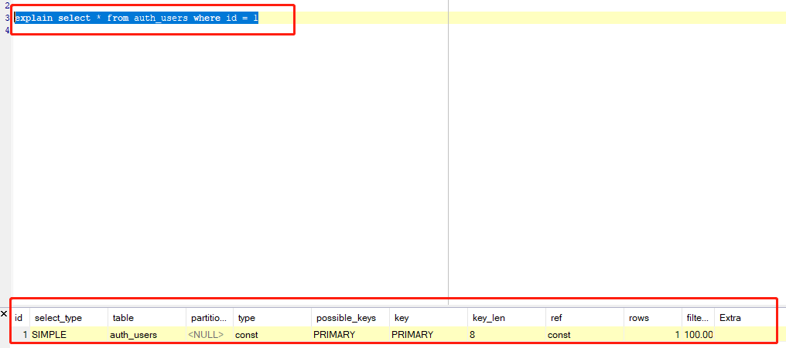

# 一条mysql语句的奇幻之旅

我们平常都会用到mysql，但是你真的知道sql语句是怎么执行的吗？

比如下面的sql

```sql
select * from users;
```

这条sql语句大致会经过下面的阶段：
1. 连接器 -- 连接器负责建立，管理mysql的连接，你首先要连接到mysql服务器，才能操作mysql。
2. 分析器 -- 分析器会进行词法分析和语法分析，语法错误会在这个阶段被返回。
3. 优化器 -- 优化器会自动优化我们的sql语句，如果它发现你的sql语句可以进行优化的话。优化器选择是否使用索引，索引怎么用。优化器还会选择更优的执行计划，最后会输出一个执行计划。
4. 执行器 -- 执行器会根据输出的执行计划进行最终的执行。他会调用底层存储引擎的接口，比如innoDB引擎。

当我们最开始连接数据库实例的时候，我们要输入用户名密码，这时候连接器会从数据库的用户信息中判断你是否有`权限`连接数据库进行操作，有哪些权限。

如果你输入的用户名密码错误或者没有权限，那么你会收到下面的报错信息

```sql
Access denied for user 'root'@'localhost'(using password: YES)
```

这里我们要搞清楚一个概念，数据库和数据库实例，我们使用的都是数据库实例，用实例来操作数据库。

连接成功以后开始执行上面的查询语句。`分析器`会分析这个语句的词法，语法，语义这些信息。通俗来讲就是看到`select`,`update`这些关键字，知道你要来干啥，看看你是不是来搞破坏的，来捣蛋的。看看你是查询哪个表啊，有什么条件啊，这些玩意。最后会输出一个词法树。当然了这一步还会分析你的语法有没有错误，比如你把`select`打错试试。打成`elect`，会出现下面的报错信息

```sql
You have an error in your SQL syntax: check the maual that corresponds to your MySQL server version for the right syntax to use near 'elect * from users' at line 1
```

遇到这种`sql`语法错误，他会告诉你在哪出现了错误，其实就是分析器往后分析的时候发现，这不对啊，这不是我要的东西啊，你这偷梁换柱啊。

当这一步的考验你也通过了，那么骚年，你离飞升不远了。。。

进入优化器阶段，优化器接过语法树，会调整你的语法，比如他觉得你这么写它执行起来慢，执行的不爽，那么他会换个姿势再来一次。包括你的语法，执行的顺序，使用的索引，连表怎么连。最终优化完成会输出一个执行计划。

这个执行计划我们可以通过`explain`关键字查看，比如执行下面的语句

```sql

explain select * from users;
```

他会输出下面的信息。我们可以看到`type`这一列是`all`。这代表全表扫描。


我们现在在执行另外一个看看。

```sql

explain select * from users where id = 1;

```

看看这个执行结果。可以看到`type`这一列是`const`。这代表是常量。还有`key`这一列是`primary`，这代表我们这次使用了主键索引。而主键索引是聚簇索引，他的`page`页里面存储的就是这一行信息，所以只会查询一次。




上面输出的执行计划会最终由执行器来执行，执行器会调用`存储引擎`层的接口。

### 缓存

其实，在这中间还有一个缓存组件。最开始查询的时候会先查询缓存组件的信息，如果没有缓存，才会走到分析器，然后往下走。如果命中缓存，那么直接返回，也就没后面什么事情了。