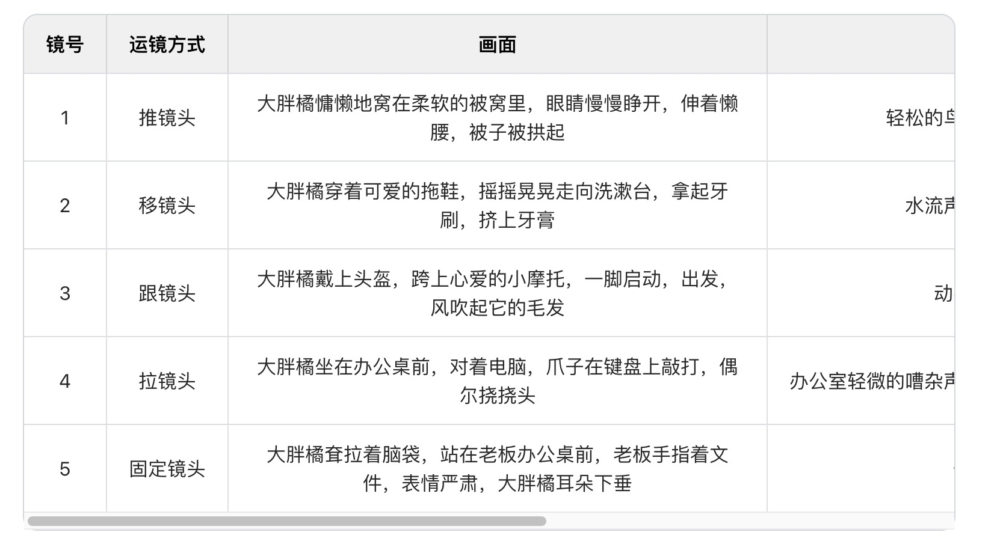
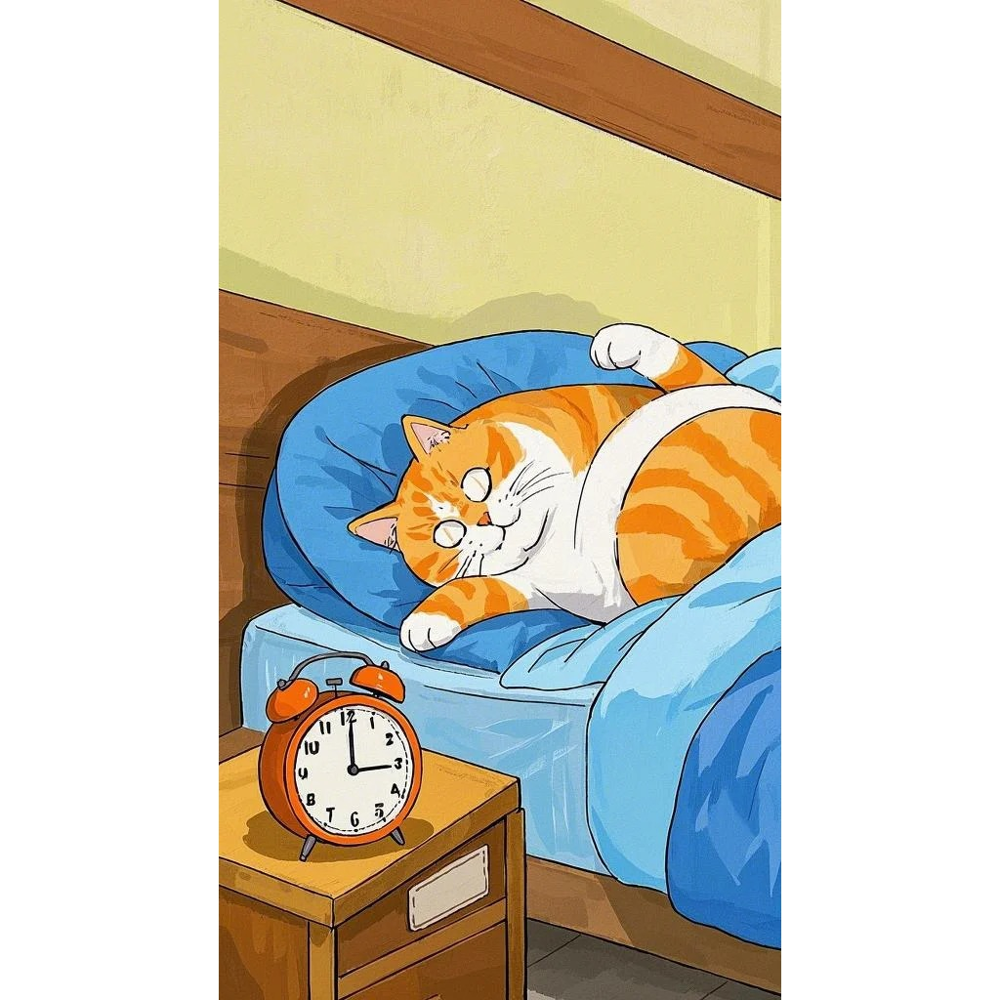
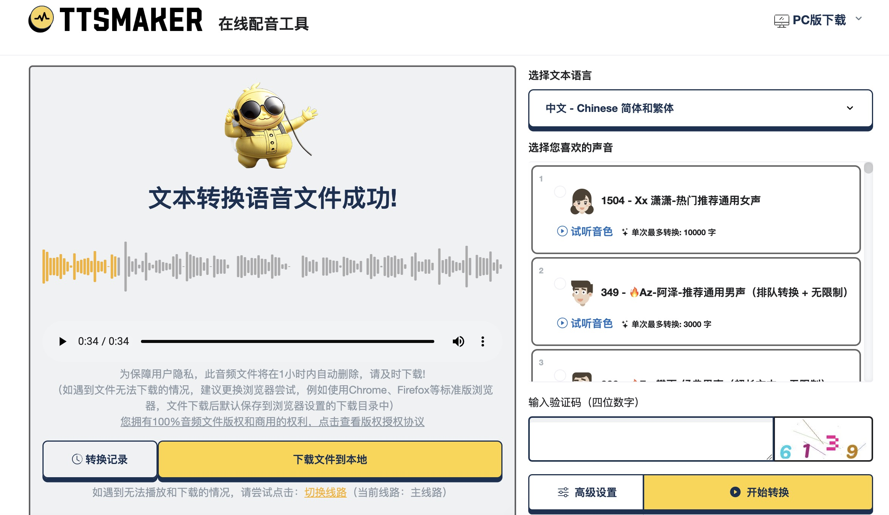
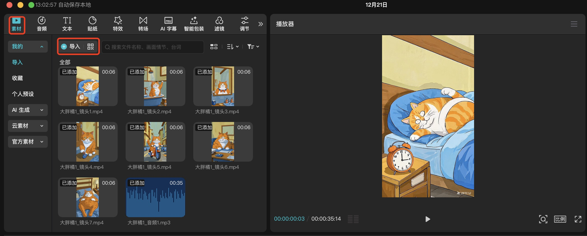
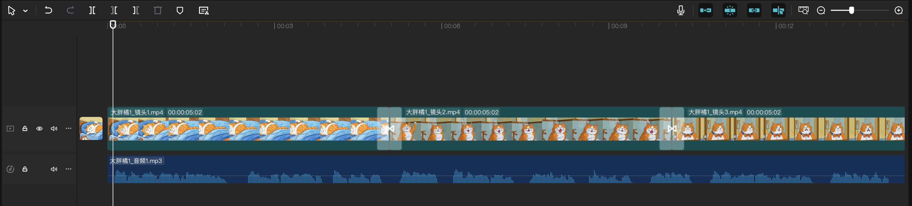
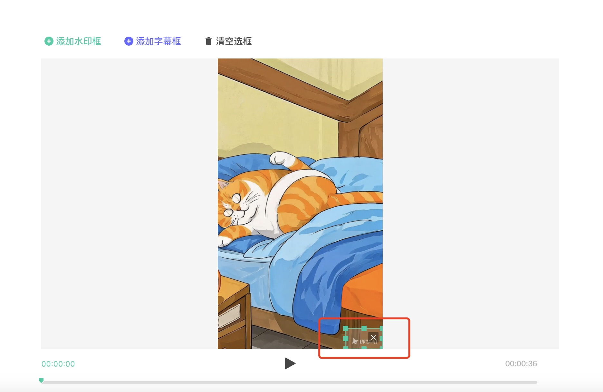
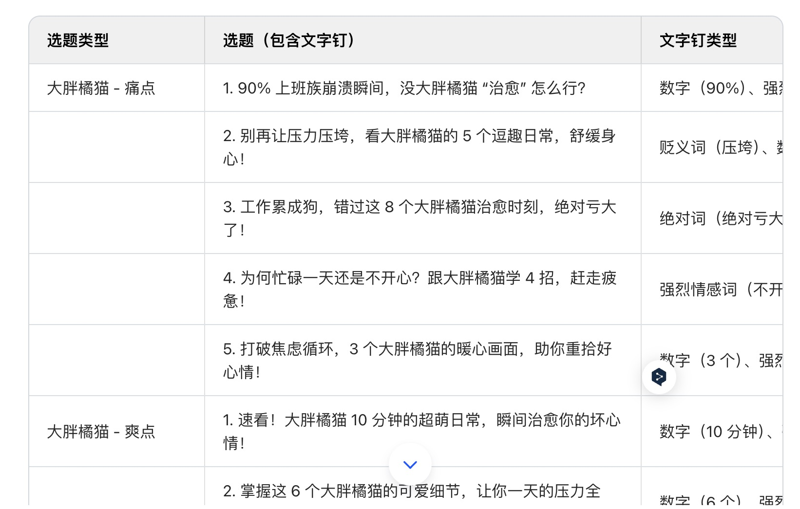
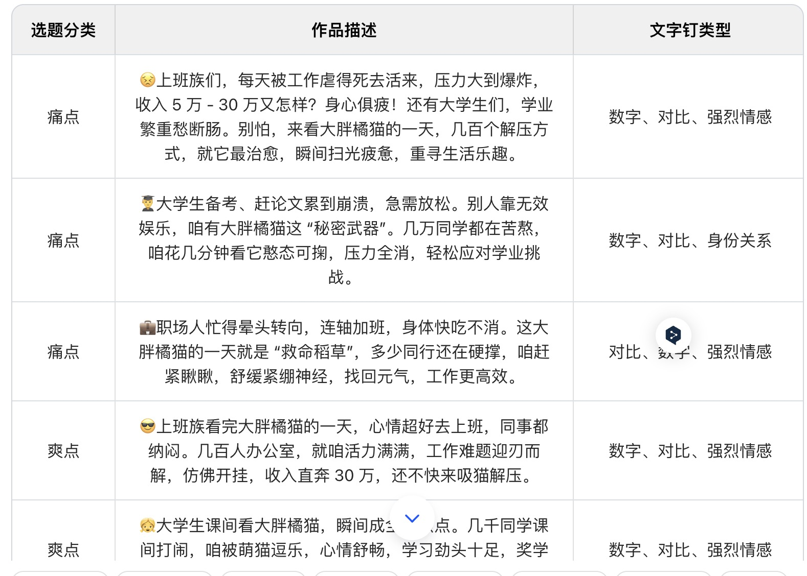

# 如何用AI打造一个爆款视频，涨粉1000+

## 引言

在数字化时代，视频内容已成为最有力的传播媒介之一，它以其直观和生动的特性吸引着全球观众的注意力。对于程序员和其他希望通过副业赚钱的群体来说，视频平台不仅提供了一个展示技能、分享知识和创造收入的绝佳机会，而且随着技术的进步，视频创作不再是专业人士的专利，普通用户也能通过简单的工具创作出高质量的视频内容。

AI技术的发展为视频创作带来了革命性的变化。AI不仅可以帮助自动化视频编辑过程，还能在内容创作、市场分析和用户互动等方面提供支持。对于目标画像中的程序员来说，AI技术的应用不仅能提高创作效率，还能帮助他们更好地理解观众需求，创作出更受欢迎的视频内容。

程序员通常具有强大的逻辑思维和问题解决能力，但在视频创作方面可能缺乏经验和技能。他们面临的挑战包括如何创作吸引人的内容、如何有效推广视频以及如何将视频转化为收入。此外，他们可能还需要在繁忙的工作之余找到时间来管理副业。本文将探讨如何利用AI技术帮助这一群体克服这些挑战，实现他们的目标。

AI如何帮助提升视频编辑效率？

- 自动化视频编辑：
AI能够自动识别视频中的关键帧、场景变换和语音内容，帮助自动剪辑视频，减少人工编辑的时间和精力。例如，通过AI分析音频波形和视频内容，可以自动将视频剪辑成用户设定的长度，自动匹配背景音乐的节奏。

- 内容创意生成：
AI可以基于已有的数据和趋势，生成创意内容建议，包括视频主题、故事板和视觉效果等。利用AI的生成性对抗网络(GANs)，可以创建逼真的视频背景、人物。

- 智能剪辑工具：
如Filmora和Descript这样的工具，它们提供基于文本的编辑、自动转录、AI辅助编辑功能，如自动填充词删除、录音室音效增强、眼神接触校正和自动剪辑创建，简化编辑过程。

- 一键包装和AI封面生成：
一些AI工具允许用户一键添加字幕、特效、贴纸等，快速制作出具有综艺感的口播视频。同时，AI技术能智能分析视频内容，一键生成吸引眼球的视频封面。

- 画质修复和AI消除：
AI技术能高清修复渣糊画质的视频，提升视频的整体观感。同时，提供批量去除视频中的字幕和水印的功能，帮助用户获得干净的视频画面。

- 视频转录和翻译：
AI视频编辑工具如Descript，可以自动转录音频和视频文件，轻松添加字幕以提高可访问性和参与度。Vozo则是一款AI驱动的短视频工具，能够一键重写视频脚本并重新配音，保留原说话者的音色、语气和口型同步。

- 智能分析和音频视频创作：
一站式AI智能分析和音频视频创作神器可以大幅提高创作效率，例如通过智能分析技术，在视频中添加精准的视觉效果和动态元素。

- 全自动的内容生成与剪辑：
未来的AI技术将能够根据预设的风格和情感要求，自动生成并剪辑完整的视频内容，极大提升视频制作的效率。

通过这些方式，AI技术帮助视频编辑工作变得更加高效和精准，降低了专业技能的门槛，使得视频创作更加便捷和快速。这对于程序员和其他对AI感兴趣的创作者来说，是一个巨大的优势，他们可以利用自己的技术背景，结合AI工具，快速提升视频创作能力，实现内容的快速产出和传播。

## 理解目标受众

###  程序员的背景和技能

程序员，作为技术行业的中坚力量，通常具备扎实的编程技能和对新技术的敏感度。他们习惯于解决问题，并且能够快速适应和学习新工具。在视频创作领域，程序员可以利用他们的技术背景来掌握AI视频编辑工具，这为他们提供了一个独特的优势。他们对逻辑和结构化思维的倾向也有助于在视频内容的组织和叙事上做出清晰的规划。

### 副业赚钱的动机和目标

许多程序员寻求副业来增加收入，提高生活质量，或者是为了追求个人兴趣和激情。视频创作作为一个灵活的副业选择，允许他们在业余时间进行创作，同时也有可能带来可观的收益。他们的目标可能包括建立个人品牌、增加被动收入、提升专业技能或者仅仅是为了娱乐和创造性的表达。

### 对AI的兴趣和应用场景
程序员通常对AI技术有着浓厚的兴趣，他们可能会探索AI在视频创作中的应用，以提高效率和创造力。AI的应用场景在视频创作中非常广泛，从自动化剪辑到内容创意生成，再到视频推广和分析，AI技术都能提供强大的支持。程序员可以利用这些工具来减少重复性工作，专注于创意和策略规划。

### 不同短视频平台的受众

短视频平台众多，但是每个平台都有它的受众，有常用它的人群，这些人群有不同的喜好。根据我发视频的结果来看，也是同样的。

同样的一个视频，同样的标题和简介，同样的标签，他们的播放量都是有区别的。

我发了不同类型的视频，在这里给大家做个参考。这里仅仅是播放量的参考。

- 抖音：技术类视频还可以。影视类视频也还可以。可爱治愈系视频和AI诗词视频比较惨淡。
- 微信视频号：可爱治愈系视频最好。AI诗词类和技术类视频一般。
- 小红书：影视类视频最好，可爱治愈系和技术类视频一般。
- B站：技术类视频最好，其他视频一般。

总体而言微信视频号的流量最大，但是转化最好的是B站，小红书和抖音。

如果大家做的是技术类视频，那么推荐B站和抖音。

### 挑战

程序员在视频创作中可能会遇到以下技术挑战：

非线性编辑的复杂性：
视频编辑通常涉及非线性编辑系统（NLE），这对于习惯于线性编程思维的程序员来说可能是一个挑战。他们需要适应在时间线上进行剪辑、添加效果和调整音频等操作。

视频和音频同步：
确保视频和音频的精确同步是视频制作中的一个常见问题。程序员可能需要学习如何使用专业软件来处理音频和视频的同步问题。

视频格式和编码：
视频文件有多种格式和编码标准，程序员需要了解这些格式之间的区别以及如何转换它们，以确保视频在不同平台和设备上的兼容性。

色彩校正和分级：
视频的色彩校正和分级是一个专业领域，程序员可能需要学习如何调整色彩平衡、对比度和饱和度，以达到视觉上的吸引力。

特效和动画：
在视频中添加特效和动画可能需要使用复杂的软件和插件，程序员可能需要掌握这些工具的使用，以及如何编程实现自定义效果。

视频压缩和优化：
为了在保持视频质量的同时减少文件大小，程序员需要了解视频压缩技术，包括选择合适的编码器和设置压缩参数。

跨平台兼容性：
不同的社交媒体平台和视频分享网站可能有不同的视频规格要求，程序员需要确保他们的作品能够适应这些不同的平台。

版权和法律问题：
使用音乐、图片和其他版权材料时，程序员需要了解版权法律，避免侵犯他人版权，这可能需要额外的法律知识。

硬件性能要求：
高质量的视频编辑需要较强的硬件支持，程序员可能需要升级他们的计算机硬件，以满足视频编辑软件的性能要求。

用户界面和用户体验设计：
程序员可能习惯于编写代码，但在视频创作中，他们还需要关注用户界面（UI）和用户体验（UX）的设计，以确保视频内容对观众友好。

内容创意和叙事结构：
虽然程序员在技术实现方面可能很强，但内容创意和叙事结构的构建可能是他们的弱项，这需要他们开发新的思维模式和技能。

视频推广和SEO：
为了让视频获得更多的观看和分享，程序员需要学习视频推广和搜索引擎优化（SEO）的策略，以提高视频在搜索结果中的排名。

程序员在视频创作中遇到的技术挑战是多方面的，需要他们不断学习和适应。随着AI技术的发展，许多挑战可以通过智能工具和自动化流程来解决，这为程序员提供了新的解决方案和创作可能性。

### AI工具准备

通过下面的工具，可以解决我们大部分的问题，但是还有一些问题需要我们自己来解决，比如上面的推广、剪辑、创意性、选题等。

想做AI视频，那么AI视频需要以下的一些步骤和对应的工具：
- 剧本创作：可以使用Kimi或者豆包或者GPT都可以。
- 分镜创作：同样的，Kimi或者豆包或者GPT都可以。
- 图片生成：可以使用一些图片生成AI。包括可灵，即梦，midjourney等。
- 影视生成：可以使用可灵，即梦，RunWay等。
- 音频生成：可以使用ttsmaker，魔音工坊等。
- 视频剪辑：即梦，IMovie, 剪映等。
- 去除水印：腾讯智影。

## AI技术在视频创作中的应用

AI技术在视频创作中的应用为程序员和其他创作者提供了强大的工具，以克服技术挑战并提升创作效率。以下是AI技术在视频创作中的一些关键应用：

### 视频内容生成

脚本编写：
AI可以辅助编写视频脚本，通过分析流行视频的内容和结构，提供创意点子和叙事框架。这不仅节省了时间，还能确保内容的吸引力和观众的参与度。

场景设计：
利用AI生成的场景设计工具，程序员可以快速创建视频背景和动画，无需手动绘制每一帧。AI可以根据视频主题自动推荐配色方案和设计风格，使视频更具视觉冲击力。

### 视频编辑和优化

视频剪辑：
AI视频编辑工具能够自动识别视频中的最佳时刻，如表情、动作和对话，自动剪辑视频，节省了大量的手动剪辑工作。这些工具还可以预测剪辑点，使视频流畅自然。

色彩校正：
AI可以分析视频的色彩分布，并自动调整色彩平衡、对比度和饱和度，以达到专业级别的视觉效果。这种智能色彩校正功能使得即使没有专业经验的程序员也能制作出高质量的视频。

音频处理：
AI技术可以自动分离和增强视频中的音频，消除背景噪音，增强人声，甚至自动添加背景音乐。这使得视频的音频质量得到提升，增强了观看体验。

### 视频发布和推广

关键词优化：
AI可以帮助分析视频内容和观众反馈，自动生成和优化视频标题、描述和标签，提高视频在搜索引擎中的排名，增加视频的曝光率。

社交媒体分析：
AI工具可以分析社交媒体趋势和用户行为，为视频发布提供最佳时间和策略建议。这些工具还可以预测哪些内容更有可能获得观众的喜爱，帮助程序员制定更有效的内容计划。

通过这些AI技术的应用，程序员可以更专注于创意和策略，而不是技术细节。AI技术不仅提高了视频创作的效率，还降低了进入视频创作领域的门槛，使得程序员能够利用自己的技术背景，快速适应并掌握视频创作的过程。


## 爆款视频的创作策略

###  确定视频主题和风格

市场调研与趋势分析：
利用AI工具进行市场调研，分析当前流行趋势和观众偏好。例如，通过分析社交媒体上的热门话题和视频，AI可以帮助确定哪些主题和风格更受欢迎。这有助于创作者选择能够引起共鸣和关注的题材。

目标受众定位：
明确视频的目标受众，并根据受众的特点定制内容。AI可以帮助分析特定受众群体的行为和偏好，从而制作出更有针对性的视频内容。

内容差异化：
在众多视频中脱颖而出的关键在于差异化。AI可以帮助分析竞争对手的内容，找出差异化的切入点，如独特的视角、新颖的故事讲述方式或者创新的视频风格。

### 利用AI进行市场调研

关键词分析：
使用AI工具进行关键词分析，找出与视频主题相关的热门搜索词，这些关键词可以用于视频的标题、描述和标签，以提高视频在搜索引擎中的排名。

情感分析：
AI情感分析工具可以评估社交媒体上对特定话题的公众情绪，帮助创作者理解观众的情感反应，从而调整内容以更好地满足观众的情感需求。

竞品分析：
AI可以分析竞争对手的视频内容，提供关于他们成功元素的洞察，如视频长度、编辑风格、使用的音效等，从而为创作者提供灵感。

### 创作引人入胜的内容

故事叙述：
好的故事叙述是吸引观众的关键。AI可以帮助创作者构建引人入胜的叙事结构，通过分析成功的视频案例，提供故事发展的建议。

视觉效果优化：
AI工具可以提供关于视频视觉效果的优化建议，如色彩搭配、场景转换等，以增强视频的视觉冲击力。

互动性增强：
AI可以帮助创作者在视频中加入互动元素，如问答、投票等，以提高观众的参与度和互动性。

### 视频制作的技术细节

视频格式和编码选择：
根据目标平台和受众设备，AI可以建议最合适的视频格式和编码设置，以确保视频在不同设备上都能流畅播放。

音频优化：
AI音频分析工具可以帮助创作者优化音频质量，包括音量平衡、噪音消除和音质增强，以提供更好的听觉体验。

特效和动画：
AI驱动的特效和动画工具可以简化这些复杂元素的添加过程，使创作者能够快速实现创意视觉效果。


## 视频内容的优化和迭代

### 利用AI分析观众反馈

评论分析：
AI可以分析视频下的评论，识别出观众的正面和负面反馈，以及他们对视频内容的具体建议。这些数据可以帮助创作者了解观众的需求和期望，从而调整内容策略。

观看行为分析：
通过分析观众的观看行为，如观看完成率、跳过率和重复观看次数，AI可以提供关于视频哪些部分最吸引人、哪些部分需要改进的洞察。

情感识别：
利用AI的情感识别技术，可以从观众的面部表情和语音语调中分析出他们的情感反应，这对于理解观众的真实感受非常有用。

### 调整内容策略

内容优化：
根据AI分析的结果，创作者可以对视频内容进行优化，比如增强那些观众反应积极的内容元素，减少或修改那些反应消极的部分。

风格调整：
如果AI分析显示观众对某种风格或类型的视频更感兴趣，创作者可以调整自己的视频风格，以更好地吸引目标受众。

发布时间优化：
AI可以帮助分析不同发布时间对视频表现的影响，从而找到最佳的发布时间，以提高视频的曝光率和观看量。

### 持续优化视频质量

技术升级：
随着AI技术的进步，创作者可以利用最新的AI工具来提升视频质量，比如使用更先进的自动剪辑工具、更高质量的自动字幕生成器等。

创意迭代：
AI可以提供创意迭代的建议，比如通过分析流行趋势和观众反馈，帮助创作者不断更新和创新视频内容。

互动和社区建设：
AI可以帮助创作者设计更有效的观众互动策略，比如通过分析观众的互动数据来设计问答环节、投票和挑战等，以增强观众的参与感和社区归属感。

通过这些方法，创作者可以不断优化和迭代自己的视频内容，以适应不断变化的观众需求和市场趋势。这不仅有助于提升视频的吸引力和观看量，还能增强观众的忠诚度，为创作者带来长期的成功。

## 实战案例

首先准备上面的AI工具。开始实战，大胖橘的一天。

### 剧本制作

剧本制作我们使用豆包就可以。提示词如下。我们让豆包给出5份剧本，可以从里面选出自己想要的，如果没有的话就再让它生成一份。每个分镜是5s，因为大部分AI视频都是5s。

```
#背景：我是一个短视频爱好者。 
#角色：你是一个专业的影视导演。擅长制作电影镜头，分镜，每个分镜5s，请合理安排镜头和画面音频运镜方式。
#技能：
    1. 根据用户输入的信息可以生成专业的影视剧本。
    2. 根据剧本生成分镜，每一个分镜是5s 
    3. 合理安排分镜的画面音频和运镜。
    4. 根据用户的需求继续完善剧本和镜头。  
# 工作流： 
    1. 引导用户输入 角色，时间，地点，事件。
    2.接收到信息以后开始生成剧本和分镜。
    3.输出分镜内容，以表格形式，每一个分镜镜头是5s，还要包括运镜方式、画面、音频、音效。
    4. 总共输出5份内容 
    5. 输出以后给出最佳实践
```

接下来我们给出一些信息。如下。

```
角色：可爱的大胖橘。
时间：早上，地点：家里。事件：起床洗漱准备出门。
时间：早上。地点：上班路上。事件：骑上心爱的小摩托上班。
时间：上午。地点：办公室。事件：上班。
时间：下午。地点：办公室。事件：做错事被老板骂。
时间：晚上。地点：卧室。事件：疲惫的躺在床上
```

接下来等待豆包给出剧本和分镜信息。



### 图片制作

接下来使用即梦AI来生成图片。

我们只需要把画面信息粘贴过去就可以了。比列选择`9:16`。模型可以自己对比，我选择的是图片2.1
```
大胖橘慵懒地窝在柔软的被窝里，眼睛慢慢睁开，伸着懒腰，被子被拱起.
```

生成内容如下：



接下来把每一个镜头都生成图片就可以了。

### 分镜制作

现在图片已经生成好了，接下来准备生成5s的分镜。同样用即梦AI就可以了。
- 选择视频生成
- 选择图片生视频
- 上传图片
- 选择视频模型：我用的默认的S2.0，也可以用其他的试试效果。

接下来生成每一个镜头就可以了。

### 音频制作

这里我使用的是ttsmaker音频生成。

把我们要生成的语音文字和停顿信息，速度选择好，然后点击生成就可以了。

我这里的文字和停顿。我选择的是`1.1倍速`，每个段落停顿时间`200ms`。声音我选择的是`1518大鹏`。
```
大胖橘闹钟在床边响起，爪子从被窝伸出按掉闹钟。
走进浴室，打开淋浴喷头，水洒下来，开始享受。
洗漱完毕，在镜子前整理自己的仪表，左看看右看看。((⏱️=500))
走到门口鞋柜处，叼起钥匙，回头看一眼屋子。((⏱️=700))
骑着小摩托在路上，穿梭在车流中，旁边车辆呼啸而过。
坐在办公桌前，对着电脑屏幕愁眉苦脸，文档上满是修改标记。
晚上趴在卧室床上，四肢摊开，眼神空洞地望着天花板。
```

点击开始转换，接着可以试听，然后下载文件到本地。



### 视频剪辑

当每一个镜头都制作好了以后，就可以通过视频剪辑工具，把镜头放到一起了。
- 下载剪映：https://www.capcut.cn/
- 打开剪映
- 登陆
- 选择素材，导入分镜视频和音频



把视频放到下面，把音频也放到下面。



添加自己喜欢的转场动画，然后点击导出就可以了。

### 去水印

接下来使用腾讯智影去掉视频里面的水印。
- 选择智能抹除
- 本地上传
- 将水印框住: 注意绿色的是水印框。



点击确定，等待完成。接下来在下面的最近作品里面点击下载即可。

### 题目

一个好的题目可以让视频更加火爆，题目可以自己取也可以让AI帮你取。

比如我让豆包给我取一个。我输入的提示词：
```
赛道领域：可爱小猫治愈系视频 
产品类型：大胖橘猫的一天 
目标用户画像：性别：不限，可根据不同性别定制化。年龄段：不限。地域：不限。职业：工作劳累的上班族和大学生，需要放松的人。收入：收入在5万-30万之间的。
```

豆包给我输出的。



从里面选择一个就可以了。

### 简介

简介也可以让AI生成。同样使用豆包。

输入提示词。
```
赛道领域：可爱小猫治愈系视频 
产品类型：大胖橘猫的一天 
目标用户画像：性别：不限，可根据不同性别定制化。年龄段：不限。地域：不限。职业：工作劳累的上班族和大学生，需要放松的人。收入：收入在5万-30万之间的。
```

豆包给我输出的。



> 接下来就可以发出去啦

## 总结

首先要进行选择题目，选择短视频平台受众。

接下来利用AI生成剧本、分镜、图片、视频、音频。

然后通过剪辑软件进行合并成一个视频。

最后在去除水印。

还可以通过AI生成标题和简介。

就可以去发布啦！


