# netty

### socket

今天，小白的老师让小白写一个服务器，小白学艺不精，过来向大头求救了。

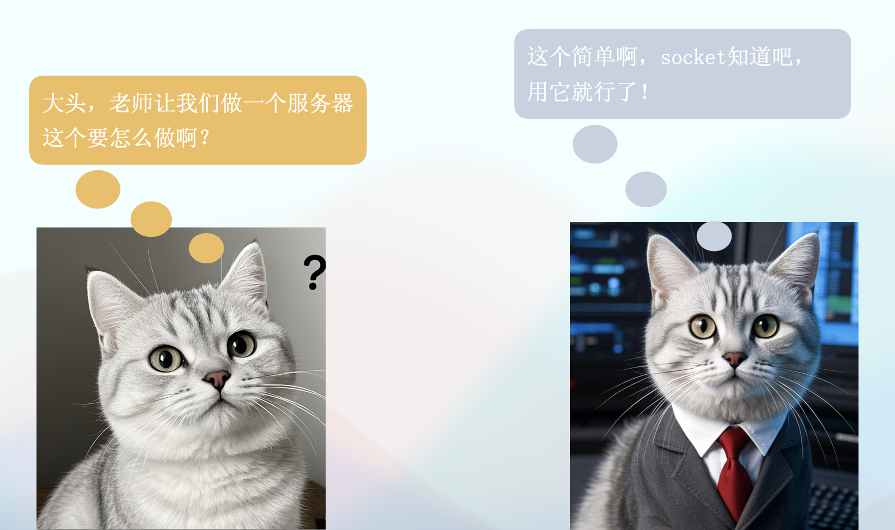

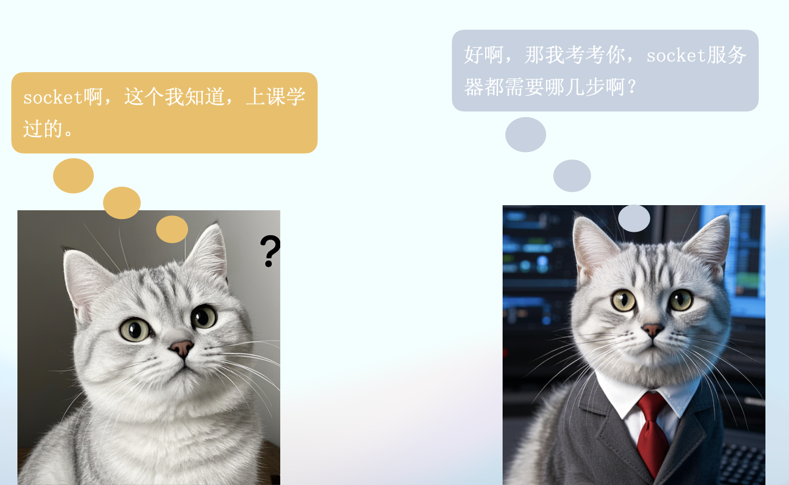

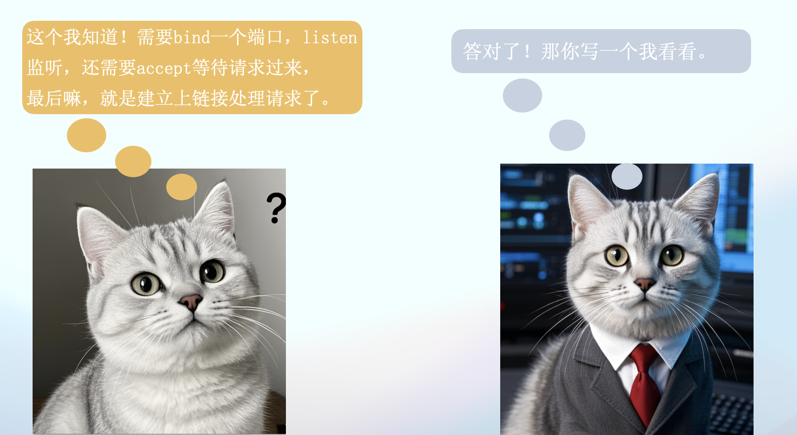

那么socket究竟是什么呢？套接字接口(socket interface)是一组函数，它们和Unix I /O函数结合起来，用以创建网络应用。从Linux内核的角度来看， 一个套接字就是通信的一个端点。从Linux程序的角度来看，套接字就是一个有相应描述符的打开文件。

下图来源于CSAPP的书。


这张图清晰的表明了socket是个啥，从逻辑上说，这玩意就是个接口，从这个接口能发送和接收数据，从物理上说，这玩意就是个文件，发送数据就是往这个文件里面写入数据，接收数据就是从这个文件里面读取数据。所以Socket也是个IO操作。只不过这个文件的数据不存储在你电脑的硬盘里面，而是通过网络发送出去了。

通过`socket`函数可以打开一个文件，返回一个文件描述符。文件描述符可以简单的理解为文件的ID，唯一标识，一般默认打开的3个文件描述符就是标准输入，标准输出，错误输出，对应0、1、2.假设我们打开了一个socket文件，描述符是3.

接下来通过服务器通过`bind`函数，可以将这个socket文件，和一个IP还有端口号进行绑定。绑定以后写入这个文件的数据就会从这个IP端口读取出来或者发送出去。

socket分为客户端和服务器，客户端主动发起请求，服务器被动接受请求，`listen`函数就是告诉Linux内核，我这个socket是一个服务器，而不是一个客户端。

最后通过`accept`函数，来等待客户端的连接.accept函数会返回一个新的文件描述符，通过这个新的文件进行传递数据，而老的文件仅仅负责建立连接。

下图为accept的时候服务器的状态，这个时候等待连接。
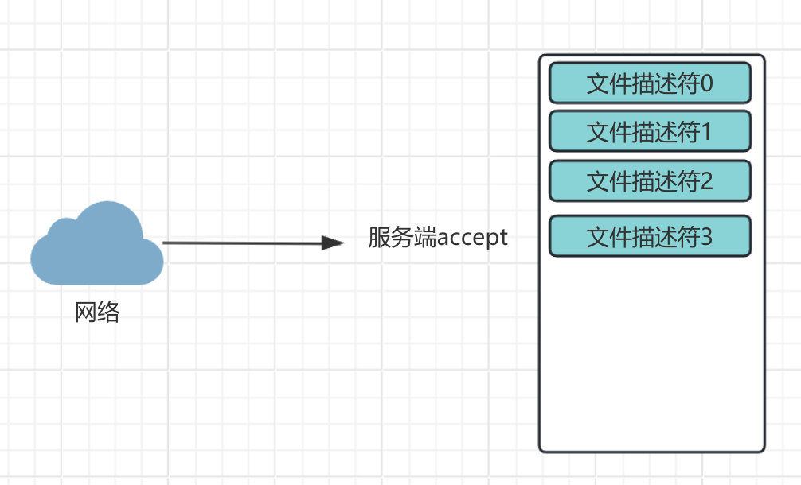

当连接建立以后，会通过新的文件描述符4进行通信。

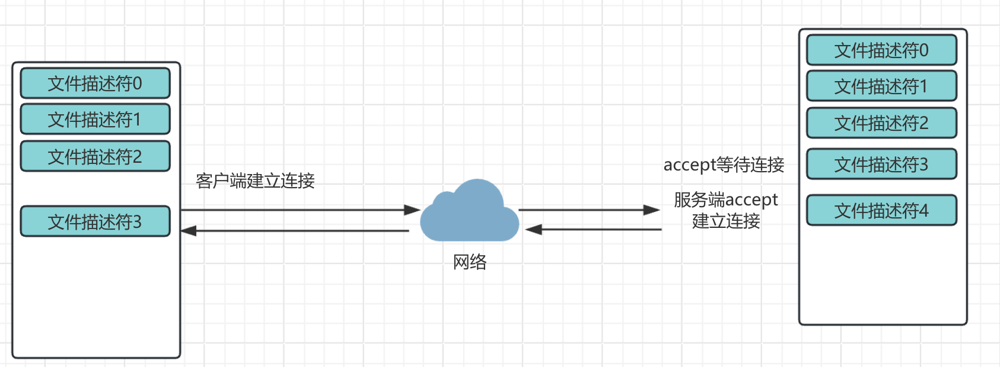

基于上述理论知识，学过哲学的都知道，`实践是检验真理的唯一标准`。所以小白用java实现了第一版socket服务器。端口号是8888，祝看到这里的兄弟们发发发发。

```java
import java.io.*;
import java.net.ServerSocket;
import java.net.Socket;

public class SocketServer {

    private static final String FILE_PATH = "HelloWorld.java";
    private static String readFileAsString(String filePath) throws IOException {
        StringBuilder contentBuilder = new StringBuilder();
        try (BufferedReader br = new BufferedReader(new FileReader(filePath))) {
            String currentLine;
            while ((currentLine = br.readLine()) != null) {
                System.out.println(currentLine); // 打印读取的每一行
                contentBuilder.append(currentLine).append("\n");
            }
        }
        return contentBuilder.toString();
    }
    public static void main(String[] args) {
        int port = 8888; // 服务器监听的端口号
        try {
            // 创建服务器端的ServerSocket，绑定端口号
            ServerSocket serverSocket = new ServerSocket(port);
            System.out.println("Server is running and listening on port " + port);

            // 服务器无限循环，等待客户端连接
            while (true) {
                // 服务器调用accept()方法，阻塞并等待客户端连接
                Socket clientSocket = serverSocket.accept();
                System.out.println("Client connected.");

                try {
                    // 读取HTTP请求
                    BufferedReader in = new BufferedReader(new InputStreamReader(clientSocket.getInputStream()));
                    String inputLine;
                    StringBuilder request = new StringBuilder();
                    while ((inputLine = in.readLine()) != null && !inputLine.isEmpty()) {
                        request.append(inputLine).append("\n");
                    }
                    
                    // 发送HTTP响应
                    PrintWriter out = new PrintWriter(clientSocket.getOutputStream(), true);
                    String fileContent = readFileAsString(FILE_PATH);
                    long contentLength = fileContent.getBytes().length;
                    String response = "HTTP/1.1 200 OK\r\n" +
                            "Content-Type: application/json\r\n" +
                            "Content-Length: " + contentLength + "\r\n" +
                            "Connection: close\r\n" +
                            "\r\n" +
                            fileContent;
                    out.println(response);

                    // 关闭连接
                    clientSocket.close();
                } catch (IOException e) {
                    e.printStackTrace();
                }
                System.out.println("Client says: hello world!");

                // 关闭连接
                clientSocket.close();
            }
        } catch (IOException e) {
            e.printStackTrace();
        }
    }
}
```

这个代码里面没有`bind`和`listen`。这是因为被java封装起来了。如果看看`ServerSocket`里面的代码就能看见这两个函数。

```java
public ServerSocket(int port) throws IOException {
    //调用了另外一个构造函数
    this(port, 50, null);
}

public ServerSocket(int port, int backlog, InetAddress bindAddr) throws IOException {
  // 参数检测
  if (port < 0 || port > 0xFFFF)
      throw new IllegalArgumentException("Port value out of range: " + port);
  if (backlog < 1)
      backlog = 50;

  // 创建了一个实现类
  this.impl = createImpl();
  try {
      // 调用了bind方法
      bind(new InetSocketAddress(bindAddr, port), backlog);
  } catch (IOException | SecurityException e) {
      close();
      throw e;
  }
}
```

上面能看到调用了`bind`方法。再看看`bind`里面呢。能看到这个里面有`getImpl().bind`和`getImpl().listen`。这就是上面说的`bind`和`listen`函数了。

```java
/**
 * 将服务器Socket绑定到指定的端点地址并设置监听队列长度
 * 此方法确保Socket未关闭且未绑定，并验证端点地址和backlog参数的合法性
 * 如果满足所有条件，则进行绑定和监听设置
 * 
 * @param endpoint 要绑定的端点地址，如果为null，则创建一个未指定端口的InetSocketAddress实例
 * @param backlog 监听队列的长度，如果小于1，则使用默认值50
 * @throws IOException 如果绑定或监听过程中发生I/O错误
 * @throws SocketException 如果Socket已关闭、已绑定、地址未解析或不支持的地址类型
 * @throws IllegalArgumentException 如果端点地址类型不受支持
 */
public void bind(SocketAddress endpoint, int backlog) throws IOException {
    // 检查Socket是否已关闭
    if (isClosed())
        throw new SocketException("Socket is closed");
    // 检查Socket是否已绑定
    if (isBound())
        throw new SocketException("Already bound");
    // 如果未指定端点地址，则创建一个未指定端口的InetSocketAddress实例
    if (endpoint == null)
        endpoint = new InetSocketAddress(0);
    // 检查端点地址是否为InetSocketAddress类型
    if (!(endpoint instanceof InetSocketAddress epoint))
        throw new IllegalArgumentException("Unsupported address type");
    // 检查端点地址是否已解析
    if (epoint.isUnresolved())
        throw new SocketException("Unresolved address");
    // 检查backlog参数是否合法
    if (backlog < 1)
        backlog = 50;

    // 安全检查，确保有权限监听指定端口
    @SuppressWarnings("removal")
    SecurityManager security = System.getSecurityManager();
    if (security != null)
        security.checkListen(epoint.getPort());

    // 同步块，确保线程安全
    synchronized (stateLock) {
        // 再次检查Socket是否已关闭或绑定
        if (closed)
            throw new SocketException("Socket is closed");
        if (bound)
            throw new SocketException("Already bound");
        // 调用实现类的方法进行实际的绑定和监听设置
        getImpl().bind(epoint.getAddress(), epoint.getPort());
        getImpl().listen(backlog);
        // 设置绑定状态为true
        bound = true;
    }
}

```


让我们用`wrk`压测一下。可以发现很垃圾。仅仅处理了4个请求，虽然响应时间很快。可是吞吐量太低了。

```
Running 30s test @ http://localhost:8888
  10 threads and 10000 connections
  Thread Stats   Avg      Stdev     Max   +/- Stdev
    Latency    55.33ms  326.77us  55.72ms   50.00%
    Req/Sec    40.00      0.00    40.00    100.00%
  Latency Distribution
     50%   55.44ms
     75%   55.72ms
     90%   55.72ms
     99%   55.72ms
  4 requests in 30.10s, 852.00B read
  Socket errors: connect 7967, read 196512, write 14, timeout 0
Requests/sec:      0.13
Transfer/sec:      28.30B
```


接下来，上线程池，小白实现了第二版代码。这次的代码加入了线程池，所有的客户端请求建立以后通过线程池的线程进行处理。建立10个线程。

```java
import java.io.*;
import java.net.*;
import java.util.concurrent.ExecutorService;
import java.util.concurrent.Executors;

public class SimpleHttpServer {
    private static final int PORT = 8888;
    private static final String FILE_PATH = "HelloWorld.java";

    public static void main(String[] args) {
        ExecutorService threadPool = Executors.newFixedThreadPool(10);
        try (ServerSocket serverSocket = new ServerSocket(PORT)) {
            System.out.println("Server is running at http://localhost:" + PORT);

            while (true) {
                Socket clientSocket = serverSocket.accept();
                threadPool.execute(new ClientHandler(clientSocket));
            }
        } catch (IOException e) {
            e.printStackTrace();
        }
    }

    private static class ClientHandler implements Runnable {
        private final Socket clientSocket;

        public ClientHandler(Socket clientSocket) {
            this.clientSocket = clientSocket;
        }

        @Override
        public void run() {
            try {
                // 读取HTTP请求
                BufferedReader in = new BufferedReader(new InputStreamReader(clientSocket.getInputStream()));
                String inputLine;
                StringBuilder request = new StringBuilder();
                while ((inputLine = in.readLine()) != null && !inputLine.isEmpty()) {
                    request.append(inputLine).append("\n");
                }

                // 发送HTTP响应
                PrintWriter out = new PrintWriter(clientSocket.getOutputStream(), true);
                String fileContent = readFileAsString(FILE_PATH);
                long contentLength = fileContent.getBytes().length;
                    String response = "HTTP/1.1 200 OK\r\n" +
                            "Content-Type: application/json\r\n" +
                            "Content-Length: " + contentLength + "\r\n" +
                            "Connection: close\r\n" +
                            "\r\n" +
                            fileContent;
                    out.println(response);

                // 关闭连接
                clientSocket.close();
            } catch (IOException e) {
                e.printStackTrace();
            }
        }

        private String readFileAsString(String filePath) throws IOException {
            StringBuilder contentBuilder = new StringBuilder();
            try (BufferedReader br = new BufferedReader(new FileReader(filePath))) {
                String currentLine;
                while ((currentLine = br.readLine()) != null) {
                    System.out.println(currentLine); // 打印读取的每一行
                    contentBuilder.append(currentLine).append("\n");
                }
            }
            return contentBuilder.toString();
        }
    }
}
```


接下来在看压测结果。同样30s，处理了13个请求，处理时间虽然略有上升，但是整体性能提升了很多。

```
Running 30s test @ http://localhost:8888
  10 threads and 10000 connections
  Thread Stats   Avg      Stdev     Max   +/- Stdev
    Latency   118.94ms   32.73ms 148.30ms   53.85%
    Req/Sec    17.50     21.62    60.00     83.33%
  Latency Distribution
     50%  147.83ms
     75%  148.02ms
     90%  148.25ms
     99%  148.30ms
  13 requests in 30.10s, 2.70KB read
  Socket errors: connect 7967, read 198469, write 1, timeout 0
Requests/sec:      0.43
Transfer/sec:      91.99B
```

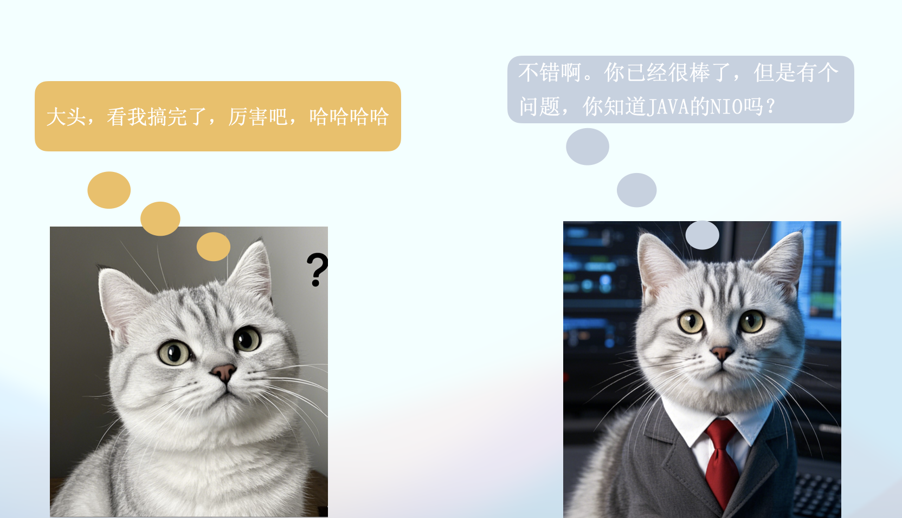


### IO

在 Java 中，BIO、NIO 和 AIO 是三种不同的 I/O 模型，它们各自的工作原理和使用场景有所不同。下面简要说明这三种 I/O 模型：

#### BIO（Blocking I/O，阻塞 I/O）

BIO就类似于你去胖东来，但是人太多了，要排队进去，而且你这个时候走了，那么你的位置就没了，需要重新排队，所以你不能离开，你只能排队等着！！！这就是所谓的同步阻塞。

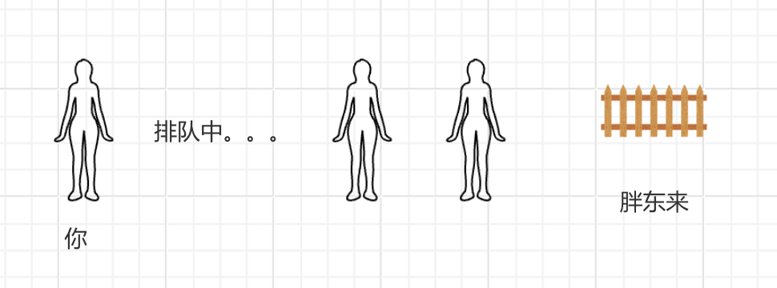

原理：
BIO 是传统的 I/O 模型，在这个模型中，每次读取或写入数据时，线程都会被阻塞，直到操作完成。
每个连接对应一个线程，线程会一直阻塞，直到 I/O 操作完成后才能继续执行其他任务。

特性：
- 阻塞：每次读写操作都会等待数据的到来或写入完成，阻塞当前线程。
- 线程绑定：每个客户端连接都会占用一个独立的线程。
- 简单直观：编程模型简单，适合小规模应用，但不适合高并发的场景。

优缺点：
- 优点：实现简单，编程模型直观。
- 缺点：性能差，尤其是在高并发场景下，线程过多导致资源浪费（线程上下文切换开销大）。

使用场景：
适合低并发、连接数不多的应用场景，例如小型 Web 服务。

#### NIO（New I/O，新 I/O）

NIO通过操作系统提供的IO多路复用机制，可以实现多线程的性能，因为IO多路复用，本质上是单线程的，所以省去了操作系统线程切换的开销。

拿胖东来说，BIO你只能等着，但如果你是NIO，那么胖东来说，我给你发个号吧，你是88号，接下来你爱干啥干啥去，等我叫88号了，你过来就行了。但是呢，我只负责叫号，你离远了听不见那是你的事，你的时不时的过来问我一下，到88号了吗？到了你就进去，没到你就等着。

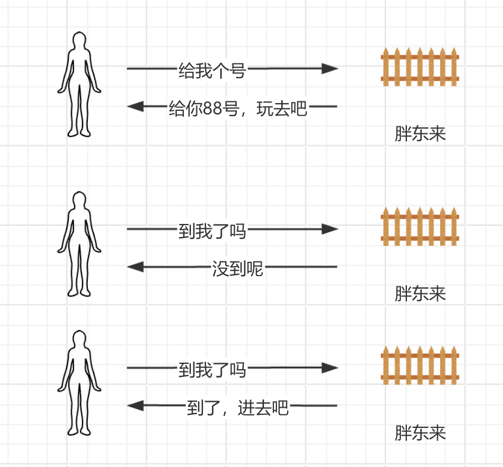

从代码来说，就是通过select进行订阅。比如select订阅文件描述符3号的状态，操作系统如果发现有数据从网络中传输过来，那么就写入3号文件，写完以后，操作系统就改变3号文件的状态，这个时候select如果过来判断3号的状态，发现变了，就知道可以执行对应的操作了，比如服务器开始运行，然后读取文件内容发送给客户端。

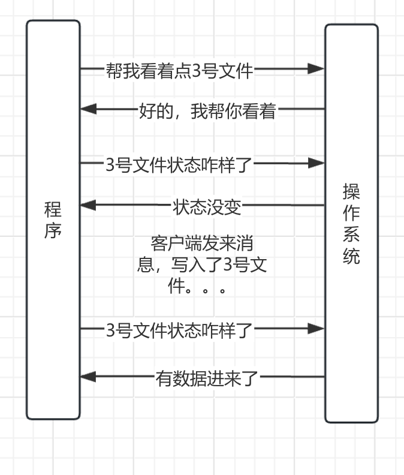

原理：
NIO 提供了 非阻塞 I/O 的能力，支持多路复用技术，允许一个线程同时处理多个 I/O 操作。
通过使用 Selector 和 Channel，NIO 可以在一个线程中处理多个客户端的 I/O 请求。
非阻塞：读取和写入操作不会阻塞线程，如果没有数据可用，线程会继续执行其他任务。

特性：
- 非阻塞 I/O：可以通过轮询和事件通知的方式处理 I/O 请求，而不必阻塞等待。
- 多路复用：通过 Selector 实现一个线程管理多个 Channel，处理多个连接。
- 高效：减少了线程的开销，适用于高并发场景。

优缺点：
- 优点：比 BIO 更高效，适合高并发、高负载的应用。
- 缺点：编程模型较为复杂，需要理解 Selector、Channel、Buffer 的使用方式，开发成本较高。

使用场景：
高并发、大规模连接的网络应用，如服务器（HTTP、Chat Server 等）、数据库连接池、文件上传下载等。

#### AIO（Asynchronous I/O，异步 I/O）

AIO就是说，在胖东来排队的时候，你找他要号的时候，还留了个手机号码，告诉他，到我了你就给我打电话，他给你88号，等叫到88号了，他就给你打电话说，到你了，过来吧。和NIO的区别就是你不用老过来问了，到了我打电话叫你。

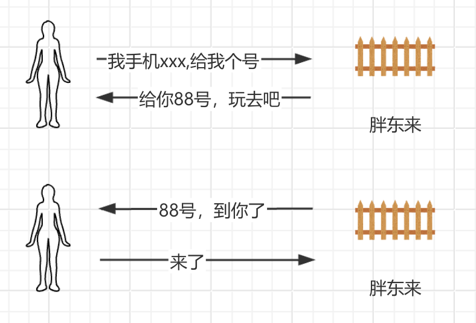

原理：
AIO 是 Java 7 引入的异步 I/O 模型，它的关键特性是完全异步，即操作完成后系统会通过回调通知应用程序。
在 AIO 中，线程发起 I/O 请求后，不会阻塞等待，而是返回，等 I/O 操作完成时，操作系统会通知 Java 程序，程序再通过回调函数获取结果。

特性：
- 异步：I/O 操作发起后，线程立即返回，不会等待操作完成。
- 事件驱动：操作完成后，系统通过回调通知应用程序处理结果。
- 无需轮询：不同于 NIO，AIO 不需要手动轮询 Selector，操作完成后直接通过回调处理结果。

优缺点：
- 优点：可以进一步减少线程和上下文切换，性能非常高，适合超高并发的应用。
- 缺点：复杂度最高，需要理解回调和事件处理机制，调试较为困难。

使用场景：
适用于极高并发的应用场景，如实时数据流处理、大规模分布式系统等。

| **特性**      | **BIO**                  | **NIO**                     | **AIO**                       |
|---------------|--------------------------|-----------------------------|-------------------------------|
| **阻塞方式**  | 阻塞（每个操作阻塞当前线程） | 非阻塞（通过轮询和事件驱动） | 异步（操作完成后通过回调通知） |
| **线程管理**  | 每个连接一个线程          | 一个线程处理多个连接        | 一个线程发起请求，回调通知结果 |
| **编程复杂度**| 低                       | 中                          | 高                            |
| **性能**      | 性能差，适用于低并发场景   | 性能优越，适用于高并发场景  | 性能最优，适用于超高并发场景  |
| **适用场景**  | 小规模服务，低并发应用    | 高并发应用，如 Web 服务器   | 极高并发应用，如大数据流处理  |

#### NIO实现

说了这么多，小白也实现了NIO版本的服务器。代码如下

```java
import java.io.IOException;
import java.nio.ByteBuffer;
import java.nio.channels.*;
import java.nio.file.*;
import java.util.Iterator;
import java.util.Set;

public class NIOHttpServer {

    private static final int PORT = 8888;
    private static final String FILE_TO_SERVE = "HelloWorld.java";

    public static void main(String[] args) {
        try {
            // 1. 打开一个 Selector，用于管理多个通道的 I/O 事件
            Selector selector = Selector.open();

            // 2. 打开一个 ServerSocketChannel，用于监听客户端连接
            ServerSocketChannel serverSocketChannel = ServerSocketChannel.open();

            // 3. 绑定到指定端口，并配置为非阻塞模式
            serverSocketChannel.bind(new java.net.InetSocketAddress(PORT));
            serverSocketChannel.configureBlocking(false);

            // 4. 将 ServerSocketChannel 注册到 Selector，监听 ACCEPT 事件
            serverSocketChannel.register(selector, SelectionKey.OP_ACCEPT);

            System.out.println("NIO HTTP Server started on port " + PORT);

            while (true) {
                // 5. 阻塞等待事件发生（或超时返回）
                selector.select();

                // 6. 获取所有准备好的事件
                Set<SelectionKey> selectedKeys = selector.selectedKeys();
                Iterator<SelectionKey> iterator = selectedKeys.iterator();

                while (iterator.hasNext()) {
                    SelectionKey key = iterator.next();
                    iterator.remove(); // 移除已处理的事件

                    if (key.isAcceptable()) {
                        // 处理新的客户端连接
                        handleAccept(key);
                    } else if (key.isReadable()) {
                        // 处理客户端请求
                        handleRead(key);
                    }
                }
            }
        } catch (IOException e) {
            e.printStackTrace();
        }
    }

    // 接受客户端连接
    private static void handleAccept(SelectionKey key) throws IOException {
        ServerSocketChannel serverSocketChannel = (ServerSocketChannel) key.channel();
        SocketChannel clientChannel = serverSocketChannel.accept();
        clientChannel.configureBlocking(false);
        // 注册客户端通道到 Selector，监听 READ 事件
        clientChannel.register(key.selector(), SelectionKey.OP_READ);
        System.out.println("Accepted new connection from " + clientChannel.getRemoteAddress());
    }

    // 读取客户端请求并响应
    private static void handleRead(SelectionKey key) throws IOException {
        SocketChannel clientChannel = (SocketChannel) key.channel();
        ByteBuffer buffer = ByteBuffer.allocate(1024);

        // 读取客户端发送的数据
        int bytesRead = clientChannel.read(buffer);
        if (bytesRead == -1) {
            // 客户端关闭连接
            clientChannel.close();
            return;
        }

        buffer.flip();
        byte[] requestData = new byte[buffer.remaining()];
        buffer.get(requestData);
        String request = new String(requestData);
        System.out.println("Received request:\n" + request);

        // 读取 HelloWorld.java 文件内容
        String fileContent;
        try {
            fileContent = Files.readString(Paths.get(FILE_TO_SERVE));
            System.out.println("Read file content:\n" + fileContent);
        } catch (IOException e) {
            fileContent = "Error reading file: " + e.getMessage();
            System.err.println(fileContent);
        }

        // 构造 HTTP 响应
        String response = "HTTP/1.1 200 OK\r\n" +
                "Content-Type: application/json\r\n" +
                "Content-Length: " + fileContent.length() + "\r\n" +
                "\r\n" +
                fileContent;

        // 将响应写入客户端
        ByteBuffer responseBuffer = ByteBuffer.wrap(response.getBytes());
        clientChannel.write(responseBuffer);
        clientChannel.close(); // 响应完成后关闭连接
    }
}

```

在执行一下压测,结果表明处理了24个请求，吞吐量大大增加了。性能有明显提升，而且更加稳定。

```
Running 30s test @ http://localhost:8888
  10 threads and 10000 connections
  Thread Stats   Avg      Stdev     Max   +/- Stdev
    Latency   145.80ms    9.32ms 170.26ms   87.50%
    Req/Sec    14.88      8.95    30.00     62.50%
  Latency Distribution
     50%  142.46ms
     75%  142.72ms
     90%  168.73ms
     99%  170.26ms
  24 requests in 30.09s, 4.52KB read
  Socket errors: connect 7967, read 192317, write 0, timeout 0
Requests/sec:      0.80
Transfer/sec:     153.92B
```


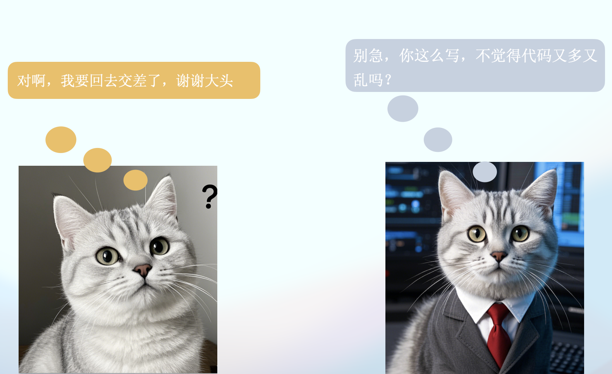


小白又把代码重新改了一遍。

```java
import java.io.IOException;
import java.nio.ByteBuffer;
import java.nio.channels.*;
import java.nio.file.Files;
import java.nio.file.Path;
import java.nio.file.Paths;
import java.util.Iterator;
import java.util.Set;

public class NIOHttpServer {

    private static final int PORT = 8888;
    private static final String FILE_PATH = "HelloWorld.java";

    public static void main(String[] args) {
        try {
            new NIOHttpServer().start();
        } catch (IOException e) {
            System.err.println("Server error: " + e.getMessage());
            e.printStackTrace();
        }
    }

    public void start() throws IOException {
        Selector selector = Selector.open();
        ServerSocketChannel serverChannel = ServerSocketChannel.open();
        serverChannel.bind(new java.net.InetSocketAddress(PORT));
        serverChannel.configureBlocking(false);
        serverChannel.register(selector, SelectionKey.OP_ACCEPT);

        System.out.println("Server started on port " + PORT);

        while (true) {
            selector.select();
            Set<SelectionKey> selectedKeys = selector.selectedKeys();
            Iterator<SelectionKey> keyIterator = selectedKeys.iterator();

            while (keyIterator.hasNext()) {
                SelectionKey key = keyIterator.next();
                keyIterator.remove();

                if (key.isAcceptable()) {
                    handleAccept(key, selector);
                } else if (key.isReadable()) {
                    handleRead(key);
                }
            }
        }
    }

    private void handleAccept(SelectionKey key, Selector selector) throws IOException {
        ServerSocketChannel serverChannel = (ServerSocketChannel) key.channel();
        SocketChannel clientChannel = serverChannel.accept();
        clientChannel.configureBlocking(false);
        clientChannel.register(selector, SelectionKey.OP_READ);
        System.out.println("Accepted connection from " + clientChannel.getRemoteAddress());
    }

    private void handleRead(SelectionKey key) {
        SocketChannel clientChannel = (SocketChannel) key.channel();
        ByteBuffer buffer = ByteBuffer.allocate(1024);

        try {
            int bytesRead = clientChannel.read(buffer);
            if (bytesRead == -1) {
                clientChannel.close();
                return;
            }

            buffer.flip();
            String request = new String(buffer.array(), 0, buffer.limit());
            System.out.println("Received request: \n" + request);

            String fileContent = readFileContent(FILE_PATH);
            String response = constructHttpResponse(fileContent);
            ByteBuffer responseBuffer = ByteBuffer.wrap(response.getBytes());

            while (responseBuffer.hasRemaining()) {
                clientChannel.write(responseBuffer);
            }

            clientChannel.close();
        } catch (IOException e) {
            System.err.println("Error handling client request: " + e.getMessage());
            try {
                clientChannel.close();
            } catch (IOException ex) {
                System.err.println("Error closing client connection: " + ex.getMessage());
            }
        }
    }

    private String constructHttpResponse(String bodyContent) {
        String headers = constructHttpHeaders(bodyContent.length());
        return headers + bodyContent;
    }

    private String constructHttpHeaders(int contentLength) {
        return "HTTP/1.1 200 OK\r\n" +
                "Content-Type: text/plain\r\n" +
                "Content-Length: " + contentLength + "\r\n" +
                "\r\n";
    }

    private String readFileContent(String filePath) {
        try {
            Path path = Paths.get(filePath);
            return Files.readString(path);
        } catch (IOException e) {
            System.err.println("Error reading file: " + e.getMessage());
            return "File not found or error reading file.";
        }
    }
}

```


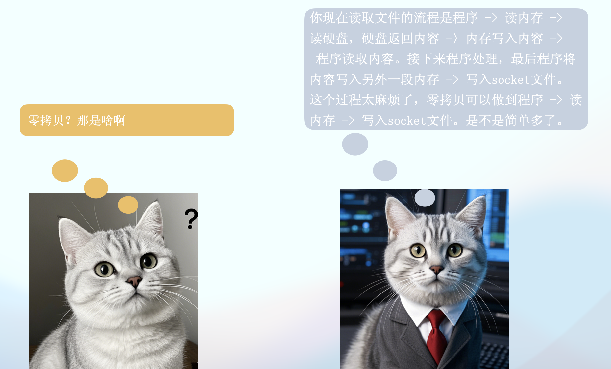

### 零拷贝技术

现在代码中读取文件内容在返回的过程如下图所示。可以看到一共有7步，有多次IO，而且内存里面有两份一样的数据，空间占用大。

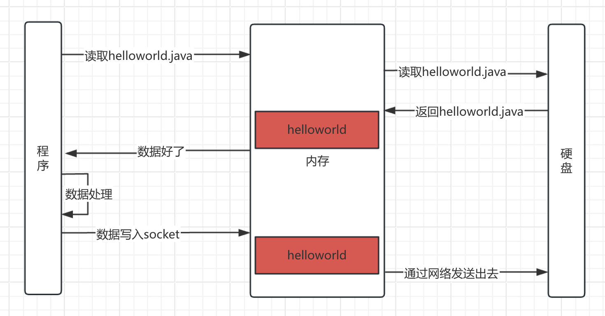

零拷贝是操作系统提供的一种技术，操作系统提供了一个函数，通过这个函数就可以实现零拷贝，看一下零拷贝的过程吧。

零拷贝可以减少IO操作次数，减少内存空间占用，内存里面实际上只有一份内容，网络发送读取的就是那个内容。没有发送内存拷贝动作。

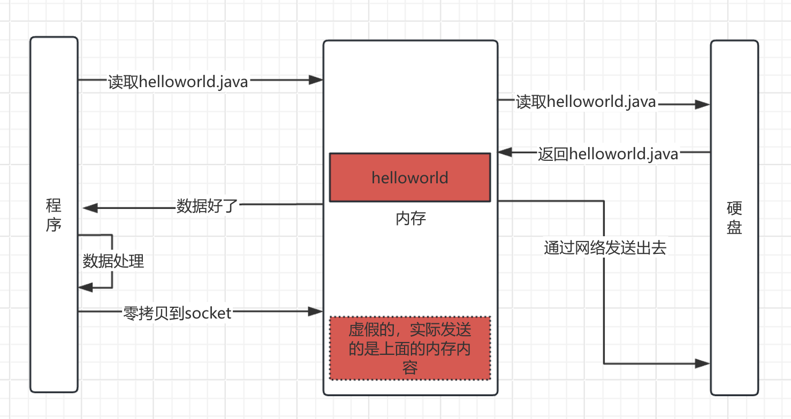

用零拷贝技术重写代码

```java
import java.io.IOException;
import java.nio.ByteBuffer;
import java.nio.channels.*;
import java.nio.file.Path;
import java.nio.file.Paths;
import java.util.Iterator;
import java.util.Set;

public class NIOZeroCopyHttpServer {

    private static final int PORT = 8888;
    private static final String FILE_PATH = "HelloWorld.java";

    public static void main(String[] args) {
        try {
            new NIOZeroCopyHttpServer().start();
        } catch (IOException e) {
            System.err.println("Server error: " + e.getMessage());
            e.printStackTrace();
        }
    }

    public void start() throws IOException {
        Selector selector = Selector.open();
        ServerSocketChannel serverChannel = ServerSocketChannel.open();
        serverChannel.bind(new java.net.InetSocketAddress(PORT));
        serverChannel.configureBlocking(false);
        serverChannel.register(selector, SelectionKey.OP_ACCEPT);

        System.out.println("Server started on port " + PORT);

        while (true) {
            selector.select();
            Set<SelectionKey> selectedKeys = selector.selectedKeys();
            Iterator<SelectionKey> keyIterator = selectedKeys.iterator();

            while (keyIterator.hasNext()) {
                SelectionKey key = keyIterator.next();
                keyIterator.remove();

                if (key.isAcceptable()) {
                    handleAccept(key, selector);
                } else if (key.isReadable()) {
                    handleRead(key);
                }
            }
        }
    }

    private void handleAccept(SelectionKey key, Selector selector) throws IOException {
        ServerSocketChannel serverChannel = (ServerSocketChannel) key.channel();
        SocketChannel clientChannel = serverChannel.accept();
        clientChannel.configureBlocking(false);
        clientChannel.register(selector, SelectionKey.OP_READ);
        System.out.println("Accepted connection from " + clientChannel.getRemoteAddress());
    }

    private void handleRead(SelectionKey key) {
        SocketChannel clientChannel = (SocketChannel) key.channel();
        ByteBuffer buffer = ByteBuffer.allocate(1024);

        try {
            int bytesRead = clientChannel.read(buffer);
            if (bytesRead == -1) {
                clientChannel.close();
                return;
            }

            buffer.flip();
            String request = new String(buffer.array(), 0, buffer.limit());
            System.out.println("Received request: \n" + request);

            sendFileUsingZeroCopy(clientChannel, FILE_PATH);
        } catch (IOException e) {
            System.err.println("Error handling client request: " + e.getMessage());
            try {
                clientChannel.close();
            } catch (IOException ex) {
                System.err.println("Error closing client connection: " + ex.getMessage());
            }
        }
    }

    private void sendFileUsingZeroCopy(SocketChannel clientChannel, String filePath) {
        try (FileChannel fileChannel = FileChannel.open(Paths.get(filePath))) {
            long fileSize = fileChannel.size();
            String headers = constructHttpHeaders(fileSize);
            ByteBuffer headerBuffer = ByteBuffer.wrap(headers.getBytes());

            // Write headers first
            while (headerBuffer.hasRemaining()) {
                clientChannel.write(headerBuffer);
            }

            // 零拷贝
            long position = 0;
            while (position < fileSize) {
                position += fileChannel.transferTo(position, fileSize - position, clientChannel);
            }

            clientChannel.close();
        } catch (IOException e) {
            System.err.println("Error sending file: " + e.getMessage());
        }
    }

    private String constructHttpHeaders(long contentLength) {
        return "HTTP/1.1 200 OK\r\n" +
                "Content-Type: text/plain\r\n" +
                "Content-Length: " + contentLength + "\r\n" +
                "Connection: close\r\n" +
                "\r\n";
    }
}
```

再次使用wrk压测。可以看到同样30s内，处理了48个请求，吞吐量再次提升。性能更加强大了。

```
Running 30s test @ http://localhost:8888
  10 threads and 10000 connections
  Thread Stats   Avg      Stdev     Max   +/- Stdev
    Latency   100.27ms   64.55ms 208.10ms   72.92%
    Req/Sec    36.45     88.79   303.00     90.91%
  Latency Distribution
     50%   62.63ms
     75%  200.92ms
     90%  204.08ms
     99%  208.10ms
  48 requests in 30.10s, 9.66KB read
  Socket errors: connect 7967, read 195016, write 3, timeout 0
Requests/sec:      1.59
Transfer/sec:     328.50B
```


### 零拷贝+线程池

小白又给代码加上了线程池。代码如下

```java
import java.io.IOException;
import java.nio.ByteBuffer;
import java.nio.channels.*;
import java.nio.file.Paths;
import java.util.Iterator;
import java.util.Set;
import java.util.concurrent.ExecutorService;
import java.util.concurrent.Executors;

public class NIOThreadZeroCopyHttpServer {

    private static final int PORT = 8888;
    private static final String FILE_PATH = "HelloWorld.java";
    private static final int THREAD_POOL_SIZE = 10;

    private final ExecutorService threadPool = Executors.newFixedThreadPool(THREAD_POOL_SIZE);

    public static void main(String[] args) {
        try {
            new NIOThreadZeroCopyHttpServer().start();
        } catch (IOException e) {
            System.err.println("Server error: " + e.getMessage());
            e.printStackTrace();
        }
    }

    public void start() throws IOException {
        Selector selector = Selector.open();
        ServerSocketChannel serverChannel = ServerSocketChannel.open();
        serverChannel.bind(new java.net.InetSocketAddress(PORT));
        serverChannel.configureBlocking(false);
        serverChannel.register(selector, SelectionKey.OP_ACCEPT);

        System.out.println("Server started on port " + PORT);

        while (true) {
            selector.select(); // Block until events are available
            Set<SelectionKey> selectedKeys = selector.selectedKeys();
            Iterator<SelectionKey> keyIterator = selectedKeys.iterator();

            while (keyIterator.hasNext()) {
                SelectionKey key = keyIterator.next();
                keyIterator.remove(); // Ensure key is removed to prevent re-processing

                if (!key.isValid()) {
                    continue; // Skip invalid keys
                }

                try {
                    if (key.isAcceptable()) {
                        handleAccept(key, selector);
                    }
                } catch (CancelledKeyException e) {
                    System.err.println("CancelledKeyException: " + e.getMessage());
                }
            }
        }
    }

    private void handleAccept(SelectionKey key, Selector selector) throws IOException {
        ServerSocketChannel serverChannel = (ServerSocketChannel) key.channel();
        SocketChannel clientChannel = serverChannel.accept();
        clientChannel.configureBlocking(false);
        clientChannel.setOption(java.net.StandardSocketOptions.TCP_NODELAY, true);
        clientChannel.register(selector, SelectionKey.OP_READ);

        System.out.println("Accepted connection from " + clientChannel.getRemoteAddress());

        // Submit task to thread pool for processing
        threadPool.submit(() -> handleRequest(clientChannel));
    }

    private void handleRequest(SocketChannel clientChannel) {
        ByteBuffer buffer = ByteBuffer.allocate(1024);
        try {
            int bytesRead = clientChannel.read(buffer);
            if (bytesRead == -1) {
                clientChannel.close();
                return;
            }

            buffer.flip();
            String request = new String(buffer.array(), 0, buffer.limit());
            System.out.println("Received request: \n" + request);

            sendFileUsingZeroCopy(clientChannel, FILE_PATH);
        } catch (IOException e) {
            System.err.println("Error handling client request: " + e.getMessage());
            try {
                clientChannel.close();
            } catch (IOException ex) {
                System.err.println("Error closing client connection: " + ex.getMessage());
            }
        }
    }

    private void sendFileUsingZeroCopy(SocketChannel clientChannel, String filePath) {
        try (FileChannel fileChannel = FileChannel.open(Paths.get(filePath))) {
            long fileSize = fileChannel.size();
            String headers = constructHttpHeaders(fileSize);
            ByteBuffer headerBuffer = ByteBuffer.wrap(headers.getBytes());

            // Write headers first
            while (headerBuffer.hasRemaining()) {
                clientChannel.write(headerBuffer);
            }

            // Use zero-copy to send file content
            long position = 0;
            while (position < fileSize) {
                position += fileChannel.transferTo(position, fileSize - position, clientChannel);
            }

            clientChannel.close();
        } catch (IOException e) {
            System.err.println("Error sending file: " + e.getMessage());
        }
    }

    private String constructHttpHeaders(long contentLength) {
        return "HTTP/1.1 200 OK\r\n" +
                "Content-Type: text/plain\r\n" +
                "Content-Length: " + contentLength + "\r\n" +
                "Connection: close\r\n" +
                "\r\n";
    }
}

```

压测结果如下,整体性能有明显提升

```
Running 30s test @ http://localhost:8888
  10 threads and 10000 connections
  Thread Stats   Avg      Stdev     Max   +/- Stdev
    Latency     7.64ms    8.85ms  27.32ms   82.47%
    Req/Sec   113.30     99.51   300.00     80.00%
  Latency Distribution
     50%    2.09ms
     75%   13.33ms
     90%   23.46ms
     99%   27.32ms
  113 requests in 30.10s, 22.73KB read
  Socket errors: connect 7967, read 191435, write 12, timeout 0
Requests/sec:      3.75
Transfer/sec:     773.29B
```


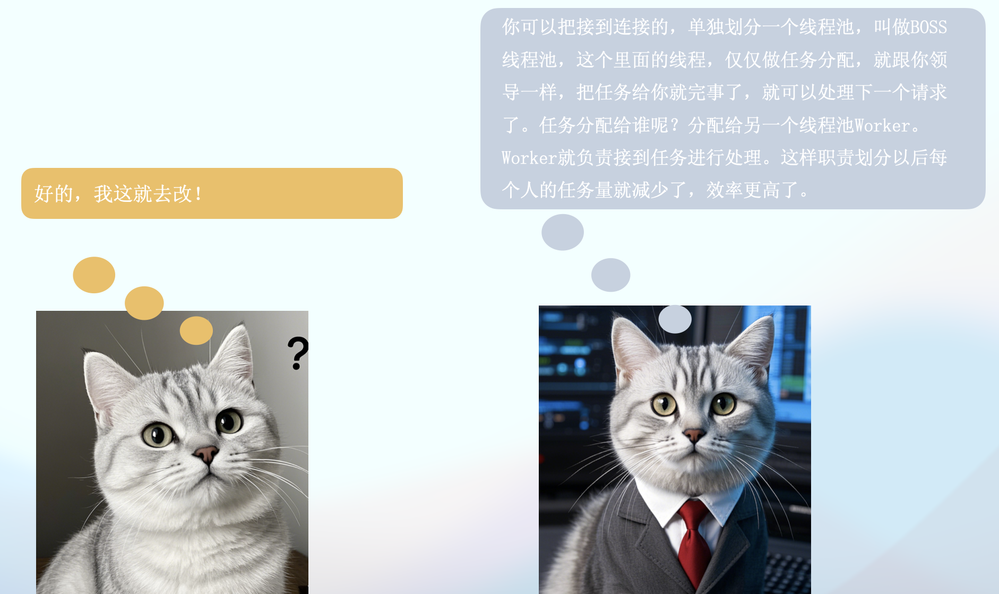

### BOSS-Worker模式

之前的代码里面，Worker线程接收到请求以后进行工作，这个时候就会占用这个请求连接，在工作。就相当于干了两份活
- 接收请求
- 处理任务

将这两个活，分给两个人，就能提升效率，BOSS线程池仅仅接收请求，再把请求分配给Worker线程，Worker线程仅仅需要处理任务。还有一个好处就是，BOSS可以有多个，比如多个领导负责分配任务。

新的代码如下
```java
import java.io.IOException;
import java.net.InetSocketAddress;
import java.nio.ByteBuffer;
import java.nio.channels.*;
import java.nio.file.Paths;
import java.util.Iterator;
import java.util.concurrent.ExecutorService;
import java.util.concurrent.Executors;

public class NIOBossWorkerHttpServer {
    private static final int PORT = 8888;
    private static final int BUFFER_SIZE = 1024;
    private static final int BOSS_THREAD_COUNT = 1;  // Boss 线程数
    private static final int WORKER_THREAD_COUNT = 10; // Worker 线程数
    private static final String FILE_PATH = "HelloWorld.java";

    public static void main(String[] args) throws IOException {
        // Boss 线程池
        ExecutorService bossThreadPool = Executors.newFixedThreadPool(BOSS_THREAD_COUNT);
        // Worker 线程池
        ExecutorService workerThreadPool = Executors.newFixedThreadPool(WORKER_THREAD_COUNT);

        // 创建一个主选择器（Boss Selector）
        Selector bossSelector = Selector.open();
        ServerSocketChannel serverChannel = ServerSocketChannel.open();
        serverChannel.configureBlocking(false);
        serverChannel.bind(new InetSocketAddress(PORT));
        serverChannel.register(bossSelector, SelectionKey.OP_ACCEPT);

        System.out.println("HTTP Server started on port " + PORT);

        // Boss 线程负责分发连接
        bossThreadPool.submit(() -> {
            try {
                while (true) {
                    bossSelector.select(); // 等待事件
                    Iterator<SelectionKey> iterator = bossSelector.selectedKeys().iterator();

                    while (iterator.hasNext()) {
                        SelectionKey key = iterator.next();
                        iterator.remove();

                        if (key.isAcceptable()) {
                            SocketChannel clientChannel = serverChannel.accept();
                            clientChannel.configureBlocking(false);
                            System.out.println("Accepted new connection: " + clientChannel.getRemoteAddress());

                            // 将新连接交给 Worker 线程池处理
                            workerThreadPool.submit(() -> handleClient(clientChannel));
                        }
                    }
                }
            } catch (IOException e) {
                System.err.println("Error in Boss thread: " + e.getMessage());
            }
        });
    }

    /**
     * Worker 线程处理客户端连接的读写操作
     */
    private static void handleClient(SocketChannel clientChannel) {
        try (Selector workerSelector = Selector.open()) {
            clientChannel.register(workerSelector, SelectionKey.OP_READ);
            ByteBuffer buffer = ByteBuffer.allocate(BUFFER_SIZE);

            while (clientChannel.isOpen()) {
                workerSelector.select(); // 等待事件
                Iterator<SelectionKey> iterator = workerSelector.selectedKeys().iterator();

                while (iterator.hasNext()) {
                    SelectionKey key = iterator.next();
                    iterator.remove();

                    if (key.isReadable()) {
                        SocketChannel channel = (SocketChannel) key.channel();
                        buffer.clear();
                        int bytesRead = channel.read(buffer);
                        if (bytesRead == -1) {
                            closeChannel(channel);
                            return;
                        }

                        // 请求解析 (这里只简单返回文件内容作为响应)
                        buffer.flip();
                        sendFile(channel, FILE_PATH);
                    }
                }
            }
        } catch (IOException e) {
            System.err.println("Error in Worker thread: " + e.getMessage());
        } finally {
            closeChannel(clientChannel);
        }
    }

    /**
     * 使用零拷贝技术发送文件
     */
    private static void sendFile(SocketChannel clientChannel, String filePath) {
        try (FileChannel fileChannel = FileChannel.open(Paths.get(filePath))) {
            long fileSize = fileChannel.size();

            // 构造 HTTP 响应头
            String headers = "HTTP/1.1 200 OK\r\n" +
                    "Content-Type: text/plain\r\n" +
                    "Content-Length: " + fileSize + "\r\n" +
                    "\r\n";
            ByteBuffer headerBuffer = ByteBuffer.wrap(headers.getBytes());

            // 发送响应头
            while (headerBuffer.hasRemaining()) {
                clientChannel.write(headerBuffer);
            }

            // 使用零拷贝发送文件内容
            long position = 0;
            while (position < fileSize) {
                position += fileChannel.transferTo(position, fileSize - position, clientChannel);
            }
            System.out.println("File sent successfully to: " + clientChannel.getRemoteAddress());
        } catch (IOException e) {
            System.err.println("Error sending file: " + e.getMessage());
        }
    }

    /**
     * 关闭通道
     */
    private static void closeChannel(Channel channel) {
        if (channel != null && channel.isOpen()) {
            try {
                channel.close();
                System.out.println("Channel closed.");
            } catch (IOException e) {
                System.err.println("Error closing channel: " + e.getMessage());
            }
        }
    }
}

```

当BOSS数量为1个的时候，压测结果。可以看到吞吐量大大提升了一波。整体性能更好了。
```
Running 30s test @ http://localhost:8888
  10 threads and 10000 connections
  Thread Stats   Avg      Stdev     Max   +/- Stdev
    Latency   326.78ms   66.97ms   1.18s    95.07%
    Req/Sec     7.73      9.44    40.00     87.74%
  Latency Distribution
     50%  310.27ms
     75%  340.00ms
     90%  369.37ms
     99%  488.59ms
  912 requests in 30.10s, 166.80KB read
  Socket errors: connect 7967, read 187538, write 0, timeout 0
Requests/sec:     30.30
Transfer/sec:      5.54KB
```

当BOSS数量为4个的时候，压测结果，能看到性能再次提升了。
```
Running 30s test @ http://localhost:8888
  10 threads and 10000 connections
  Thread Stats   Avg      Stdev     Max   +/- Stdev
    Latency   221.00ms   25.30ms 331.05ms   85.11%
    Req/Sec    23.14     14.81    70.00     50.55%
  Latency Distribution
     50%  211.31ms
     75%  226.24ms
     90%  257.96ms
     99%  297.11ms
  1350 requests in 30.10s, 246.66KB read
  Socket errors: connect 7967, read 242633, write 0, timeout 0
Requests/sec:     44.85
Transfer/sec:      8.19KB
```


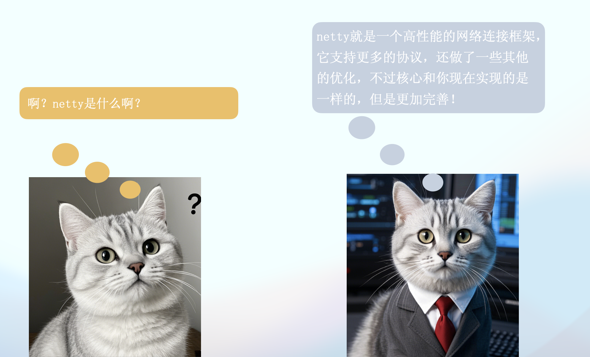


### netty

Netty是一个NIO客户端服务器框架，可以快速轻松地开发网络应用程序，例如协议服务器和客户端。它极大地简化了网络编程，如TCP和UDP套接字服务器。

netty就是基于上述的网络编程实现的，区别就是netty封装的更好，更完善，做了一些优化，支持了更多的协议。参考netty官网的架构图。

可以看到支持TCP、UDP, 支持大文件传输，支持压缩，支持HTTP、HTTPS、SMTP邮件、Google Protobuf一般用来实现RPC，通过事件模型实现，还实现了零拷贝技术。

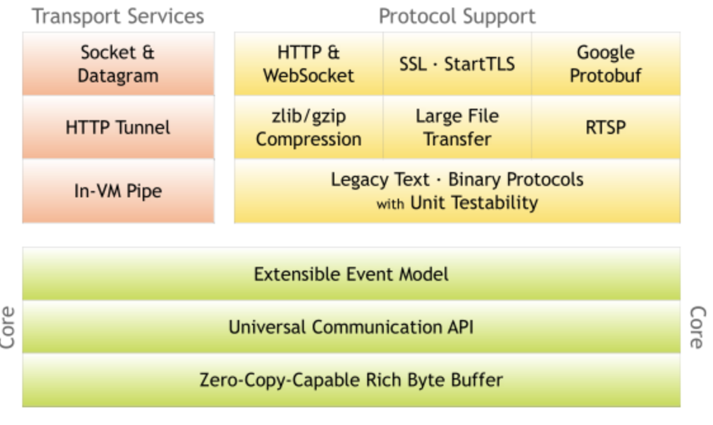

#### 如何使用netty来实现上面的服务器

通过netty实现的话，代码简单了很多，只需要关注读取文件并返回给客户端这个逻辑就可以了。但是其根本模型没有变化，比如BOSS和Worker，还有零拷贝，线程池，NIO技术，这些是netty的核心，他只是增加了更多的逻辑，支持，优化等。

```java
package org.example;

import io.netty.bootstrap.ServerBootstrap;
import io.netty.buffer.Unpooled;
import io.netty.channel.*;
import io.netty.channel.nio.NioEventLoopGroup;
import io.netty.handler.codec.http.*;
import io.netty.handler.codec.http.HttpHeaders;
import io.netty.handler.stream.ChunkedWriteHandler;
import io.netty.util.CharsetUtil;


import java.io.File;
import java.io.IOException;
import java.nio.file.Files;
import java.nio.file.Paths;

public class Main {
    private static final int PORT = 8888;

    public static void main(String[] args) {
        // Boss 线程池: 接收客户端连接
        EventLoopGroup bossGroup = new NioEventLoopGroup(1);
        // Worker 线程池: 处理 I/O 操作
        EventLoopGroup workerGroup = new NioEventLoopGroup(10);

        try {
            // 创建 ServerBootstrap
            ServerBootstrap b = new ServerBootstrap();
            b.group(bossGroup, workerGroup)
                    .channel(io.netty.channel.socket.nio.NioServerSocketChannel.class)
                    .childHandler(new ChannelInitializer<Channel>() {
                        @Override
                        protected void initChannel(Channel ch) {
                            ch.pipeline().addLast(new HttpServerCodec()); // HTTP 编解码
                            ch.pipeline().addLast(new HttpObjectAggregator(65536)); // 处理 HTTP 请求体
                            ch.pipeline().addLast(new ChunkedWriteHandler()); // 支持大文件传输
                            ch.pipeline().addLast(new HelloWorldServerHandler()); // 自定义处理逻辑
                        }
                    });

            // 绑定端口并启动
            ChannelFuture f = b.bind(PORT).sync();
            System.out.println("Server started on port 8888...");

            // 等待服务器关闭
            f.channel().closeFuture().sync();
        } catch (InterruptedException e) {
            e.printStackTrace();
        } finally {
            workerGroup.shutdownGracefully();
            bossGroup.shutdownGracefully();
        }
    }
}

class HelloWorldServerHandler extends SimpleChannelInboundHandler<FullHttpRequest> {

    @Override
    protected void channelRead0(ChannelHandlerContext ctx, FullHttpRequest msg) throws Exception {
        // 读取文件内容
        File file = new File("./HelloWorld.java");

        if (file.exists()) {
            byte[] fileContent = Files.readAllBytes(file.toPath());
            FullHttpResponse response = new DefaultFullHttpResponse(HttpVersion.HTTP_1_1, HttpResponseStatus.OK,
                    Unpooled.copiedBuffer(fileContent));

            // 设置响应头
            response.headers().set(HttpHeaders.Names.CONTENT_TYPE, "text/plain; charset=UTF-8");
            response.headers().set(HttpHeaders.Names.CONTENT_LENGTH, response.content().readableBytes());

            // 发送响应
            ctx.writeAndFlush(response).addListener(ChannelFutureListener.CLOSE);
        } else {
            // 文件不存在时返回 404
            FullHttpResponse response = new DefaultFullHttpResponse(HttpVersion.HTTP_1_1, HttpResponseStatus.NOT_FOUND,
                    Unpooled.copiedBuffer("File Not Found".getBytes(CharsetUtil.UTF_8)));

            response.headers().set(HttpHeaders.Names.CONTENT_TYPE, "text/plain; charset=UTF-8");
            response.headers().set(HttpHeaders.Names.CONTENT_LENGTH, response.content().readableBytes());

            ctx.writeAndFlush(response).addListener(ChannelFutureListener.CLOSE);
        }
    }
}
```


压测结果，性能很高。

```
Running 30s test @ http://localhost:8888
  10 threads and 10000 connections
  Thread Stats   Avg      Stdev     Max   +/- Stdev
    Latency     8.39ms   12.28ms 113.55ms   92.66%
    Req/Sec   192.24    343.10     2.51k    88.08%
  Latency Distribution
     50%    4.41ms
     75%    9.55ms
     90%   17.22ms
     99%   72.18ms
  15693 requests in 30.10s, 3.02MB read
  Socket errors: connect 7967, read 22110, write 1, timeout 0
Requests/sec:    521.32
Transfer/sec:    102.84KB
```

#### 并发测试对比

上面都是10个线程并发10000测试的结果。我们现在改成并发1000，再做个对比。

netty实现的压测结果，和10000没什么区别
```
Running 30s test @ http://localhost:8888
  10 threads and 1000 connections
  Thread Stats   Avg      Stdev     Max   +/- Stdev
    Latency    94.20ms  178.90ms 896.17ms   86.02%
    Req/Sec   324.69    443.24     2.20k    85.19%
  Latency Distribution
     50%   10.05ms
     75%   49.68ms
     90%  365.89ms
     99%  724.64ms
  16390 requests in 30.05s, 3.16MB read
  Socket errors: connect 0, read 36092, write 117, timeout 0
Requests/sec:    545.36
Transfer/sec:    107.58KB
```

我们自己实现的BOSS-Worker代码，压测结果，1000并发的性能提升很明显。因为我们的实现更加原始，而netty的实现更重。更注重高并发，对于低并发而言我们的实现更好，这也说明我们确实实现了netty的核心功能。

```
Running 30s test @ http://localhost:8888
  10 threads and 1000 connections
  Thread Stats   Avg      Stdev     Max   +/- Stdev
    Latency   205.91us  529.03us  75.25ms   99.30%
    Req/Sec    15.51k     5.85k   25.50k    62.44%
  Latency Distribution
     50%  177.00us
     75%  207.00us
     90%  245.00us
     99%  518.00us
  1389306 requests in 30.09s, 247.76MB read
  Socket errors: connect 0, read 10787, write 0, timeout 0
Requests/sec:  46169.43
Transfer/sec:      8.23MB
```

接下来是线程池+NIO+零拷贝的实现压测结果。对于低并发的性能同样很好，但是比BOSS-Worker实现低了很多很多。

```
Running 30s test @ http://localhost:8888
  10 threads and 1000 connections
  Thread Stats   Avg      Stdev     Max   +/- Stdev
    Latency     7.38ms   13.68ms 201.55ms   91.31%
    Req/Sec   102.92    287.63     2.54k    92.41%
  Latency Distribution
     50%    3.65ms
     75%    6.38ms
     90%   18.18ms
     99%   68.71ms
  11677 requests in 30.08s, 2.29MB read
  Socket errors: connect 0, read 454831, write 242, timeout 0
Requests/sec:    388.15
Transfer/sec:     78.09KB
```

接下来试试NIO+零拷贝的实现压测结果。可以看到结果也很棒

```
Running 30s test @ http://localhost:8888
  10 threads and 1000 connections
  Thread Stats   Avg      Stdev     Max   +/- Stdev
    Latency     4.49ms    9.53ms 178.38ms   93.80%
    Req/Sec   127.52    313.84     2.42k    91.95%
  Latency Distribution
     50%    2.21ms
     75%    4.10ms
     90%    8.91ms
     99%   41.68ms
  13680 requests in 30.06s, 2.69MB read
  Socket errors: connect 0, read 80895, write 7, timeout 0
Requests/sec:    455.12
Transfer/sec:     91.56KB
```

再看看NIO的实现压测结果，因为没有零拷贝，所以执行时间增加了很多。尤其是最大延迟，吞吐量也有降低。

```
Running 30s test @ http://localhost:8888
  10 threads and 1000 connections
  Thread Stats   Avg      Stdev     Max   +/- Stdev
    Latency     8.24ms   27.62ms 675.49ms   96.24%
    Req/Sec   125.39    301.56     3.01k    91.31%
  Latency Distribution
     50%    2.22ms
     75%    9.52ms
     90%   24.23ms
     99%   45.71ms
  11657 requests in 30.10s, 2.08MB read
  Socket errors: connect 0, read 87555, write 1308, timeout 0
Requests/sec:    387.33
Transfer/sec:     70.73KB
```

最后看看BIO的实现吧。可以看到吞吐量还是低了不少的。

```
Running 30s test @ http://localhost:8888
  10 threads and 1000 connections
  Thread Stats   Avg      Stdev     Max   +/- Stdev
    Latency    55.22ms   48.14ms 181.62ms   65.71%
    Req/Sec    83.94    221.86     1.33k    93.39%
  Latency Distribution
     50%   48.44ms
     75%   68.44ms
     90%  153.94ms
     99%  170.59ms
  5304 requests in 30.09s, 1.08MB read
  Socket errors: connect 0, read 60714, write 723, timeout 0
Requests/sec:    176.29
Transfer/sec:     36.67KB
```

整体总结而言，主要的提升手段是NIO和BOSS-Worker模型，零拷贝也有一定的性能提升。


