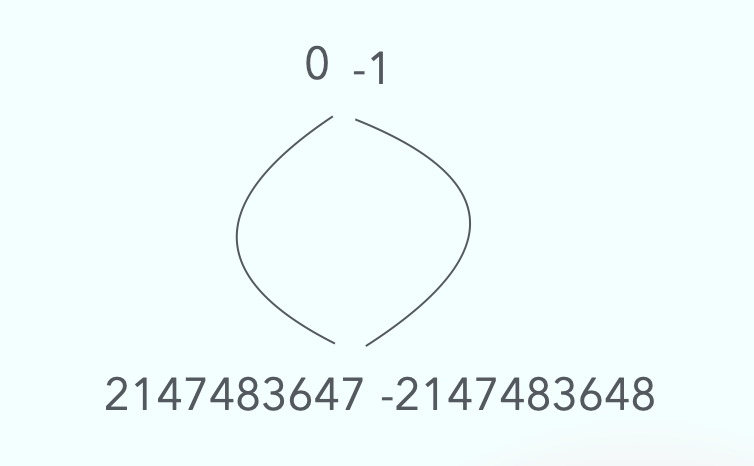

# 黄子韬送车，抖音却出现bug了，又有一个人的年终奖泡汤了

1月10日下午4点，黄子韬发布视频，称晚上7点将直播送车，并再次声明规则：“你只要来了都可以参与。”此前，黄子韬曾在直播中承诺，其短视频账号超过1500万粉丝将赠送国产汽车10台。消息一出，黄子韬的评论区立马成为了网友的许愿池，大家纷纷在评论区留言自己想要的车型。

当晚，黄子稻进行直播，在线观看人数达到了1100多万人，点赞数更是爆了！

## 抖音重大bug

点赞数持续上涨，最终更是超过了Int的最大值`2147483647`。也就是超过了2<sup>31</sup> - 1。

接下来，神奇的一幕发生了，点赞数变成了负数！


大家知道这是怎么回事吗？

在Java中，只存在有符号整数，而没有无符号整数。具体各个类型的大小如下表所示。

| 类型 | 最小值 | 最大值 |
|------|--------|--------|
| byte | -128   | 127    |
| short | -32768 | 32767  |
| int  | -2147483648 | 2147483647 |
| long | -9223372036854775808 | 9223372036854775807 |

什么是`有符号整数`和`无符号整数`呢？

## 有符号整数（Signed Integer）

有符号整数是指可以表示正数、负数和零的整数类型。在计算机中，有符号整数通常使用最高位（即最左边的位）作为符号位来表示正负。最高位为0表示正数，最高位为1表示负数。

### 示例

#### 8位有符号整数（byte）

范围：-128 到 127
二进制表示：
0000 0000 表示 0
0000 0001 表示 1
0111 1111 表示 127
1000 0000 表示 -128
1000 0001 表示 -127
1111 1111 表示 -1

#### 32位有符号整数（int）

范围：-2,147,483,648 到 2,147,483,647
二进制表示：
0000 0000 0000 0000 0000 0000 0000 0000 表示 0
0000 0000 0000 0000 0000 0000 0000 0001 表示 1
0111 1111 1111 1111 1111 1111 1111 1111 表示 2,147,483,647
1000 0000 0000 0000 0000 0000 0000 0000 表示 -2,147,483,648
1000 0000 0000 0000 0000 0000 0000 0001 表示 -2,147,483,647
1111 1111 1111 1111 1111 1111 1111 1111 表示 -1

## 无符号整数（Unsigned Integer）

无符号整数是指只能表示非负数（即零和正数）的整数类型。无符号整数没有符号位，所有位都用于表示数值，因此其范围是从0到最大值。

### 示例

#### 8位无符号整数

范围：0 到 255
二进制表示：
0000 0000 表示 0
0000 0001 表示 1
0111 1111 表示 127
1000 0000 表示 128
1111 1111 表示 255

#### 32位无符号整数

范围：0 到 4,294,967,295
二进制表示：
0000 0000 0000 0000 0000 0000 0000 0000 表示 0
0000 0000 0000 0000 0000 0000 0000 0001 表示 1
0111 1111 1111 1111 1111 1111 1111 1111 表示 2,147,483,647
1000 0000 0000 0000 0000 0000 0000 0000 表示 2,147,483,648
1111 1111 1111 1111 1111 1111 1111 1111 表示 4,294,967,295

| 特性 | 有符号整数 | 无符号整数 |
|------|-------------|-------------|
| **范围** | 包含负数、零和正数 | 只包含零和正数 |
| **最高位** | 用于表示符号 | 用于表示数值 |
| **8位** | -128 到 127 | 0 到 255 |
| **16位** | -32768 到 32767 | 0 到 65535 |
| **32位** | -2,147,483,648 到 2,147,483,647 | 0 到 4,294,967,295 |
| **64位** | -9,223,372,036,854,775,808 到 9,223,372,036,854,775,807 | 0 到 18,446,744,073,709,551,615 |

在Java中，没有原生的无符号整数类型，但可以使用BigInteger类来模拟无符号整数。

```java
import java.math.BigInteger;

public class IntegerExample {
    public static void main(String[] args) {
        // 有符号整数
        byte signedByte = 127;
        short signedShort = 32767;
        int signedInt = 2147483647;
        long signedLong = 9223372036854775807L;

        System.out.println("有符号 byte 最大值: " + signedByte);
        System.out.println("有符号 short 最大值: " + signedShort);
        System.out.println("有符号 int 最大值: " + signedInt);
        System.out.println("有符号 long 最大值: " + signedLong);

        // 无符号整数（使用 BigInteger 模拟）
        BigInteger unsignedByte = BigInteger.valueOf(255);
        BigInteger unsignedShort = BigInteger.valueOf(65535);
        BigInteger unsignedInt = BigInteger.valueOf(4294967295L);
        BigInteger unsignedLong = BigInteger.valueOf(18446744073709551615L);

        System.out.println("无符号 byte 最大值: " + unsignedByte);
        System.out.println("无符号 short 最大值: " + unsignedShort);
        System.out.println("无符号 int 最大值: " + unsignedInt);
        System.out.println("无符号 long 最大值: " + unsignedLong);
    }
}
```

输出结果。

```
有符号 byte 最大值: 127
有符号 short 最大值: 32767
有符号 int 最大值: 2147483647
有符号 long 最大值: 9223372036854775807
无符号 byte 最大值: 255
无符号 short 最大值: 65535
无符号 int 最大值: 4294967295
无符号 long 最大值: 18446744073709551615
```

## 有符号整数溢出

有符号整数溢出是指在进行算术运算时，结果超出了该整数类型所能表示的范围。由于有符号整数有固定的范围，当运算结果超过这个范围时，就会发生溢出。溢出会导致结果“回绕”到范围的另一端，这可能会导致一些意外的行为。

下图展示了有符号整数的整个范围，将范围看作一个圆，我特意切开了这个圆，左边表示`正数`，右边表示`负数`。从这里可以看到，当正数的最大值再加上1，就会变成负数的最大值。



这个是为什么呢，可以从二进制看到答案。

32位最大值是`2147483647`，用二进制表示如下,也就是符号为是0表示正数，剩下31位是1.
```
01111111111111111111111111111111
```

这个数再加1是多少呢，二进制加法和十进制加法是一样的，`逢2进1`。那么一直进位，二进制结果如下。

```
10000000000000000000000000000000
```

可以看到结果是符号位是1，剩下31位是0.这个结果就是`-2147483648`。

## 真实点赞数

接下来，我们可以算一下，真实的点赞数到底是多少呢？

假设当前的点赞数是`-1671321474`。

已知：
1. 当前是有符号整数
2. 当前是Int类型
3. 当Int类型达到最大值`2147483647`以后再加1就会溢出。

所以真实的点赞数 = 0 + Int最大值 + 1（溢出到最小值） + x = -1671321474
                = -2147483648 + x = -1671321474

因此 x = -1671321474 + 2147483648 = 476162174

也就是说真实的点赞数 = 2147483647 + 1 + 476162174 = 2623645822

也就是26亿。千分位表示：2,623,645,822

# 总结

有人说服务端是好的，只是安卓端的老代码使用的是Int，因此造成了这个Bug，这不就是传说中的屎山代码吗？

也不知道又有哪些人要倒霉的没有年终奖啦，大家也要注意这个问题啊～

我相信最开始的程序员也没有想到一场直播的点赞数能干爆Int吧～

