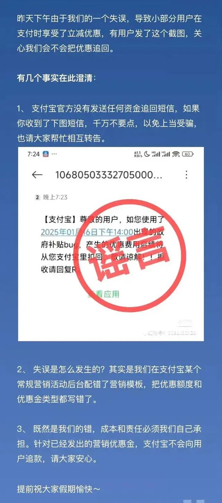

## 支付宝P0事故

大家好，我是大头。
就在2025年1月16号，支付宝平台被曝出现了P0级事故，真可谓是2025年的过年惊喜啊。

怎么回事呢？
有网友晒出，在昨天下午14:40-14:45的这段时间里，通过支付宝支付时，均被提示“政府补贴”，减免优惠20%。


而这些优惠包括支付以及转账，什么概念呢？

也就是说假设你手里有1万块钱，你把1万转给你媳妇，你只需要支付8000，你媳妇收到1万，白嫖2000。你媳妇再转给你，又能白嫖2000.

来钱简直不要太快啊。如果你有100万呢？一次就是20万啊。

不过呢，真这样可能有点刑。。。

那么什么是P0事故呢？在互联网大厂里面，如何对事故定级呢？

为什么支付宝可以如此快的处理这种事故？

如果我们的公司遇到这种事故该如何处理？

### 什么是P0事故

在互联网企业中，P0代表最高级别的事故，通常是核心业务重要功能不可用，且影响范围广泛。以目前这起事故的严重程度来看，绝对是妥妥的P0级别事故了。

除此之外，还会对于涉及到的金额进行资金定损，比如这一次事故中，造成了多少资金损失。

大家别看只是短短的5分钟，对于支付宝这个体量来说，其造成的损失数额绝对不小，不过对于支付宝来说，可能洒洒水啦。

那么除了P0事故来说，还有别的事故等级吗？

当然是有的，还有P1、P2等等，其中P0是最严重的。

相信对于程序员来说，最关心的一点还是，出了这么大的事故，对我有什么影响吗？

不同的事故等级对应的影响也不一样。
- 最低级的事故：可能只是通报批评，下次注意
- 有一定损失或者影响的事故：比如P2事故，可能会影响你的当年绩效了
- 有不少损失或者影响的事故：比如P1事故，那么不仅影响你当年的绩效奖金了，还会影响到你的评优、内部的奖项以及最重要的晋升，还可能影响到你直属leader的绩效奖金。
- 有很大损失或者影响的事故：比如P0事故，那么不光影响上面那些，还包括了你leader的评优、奖项以及晋升。可能还会导致你们团队负责人的绩效、评优、晋升。再严重一些还会收到辞退。

### 为什么支付宝可以如此快的处理这种事故？

大厂通常都有完善的上线流程以及监控处理。

如何监控呢？
- 链路服务监控
- 日志机制
- 报警机制

大厂内部都有自己研发的一整套监控报警系统，所以可以快速的发现事故，并依据一整套完善的事故处理机制进行处理。

那对于我们其他公司来说如何处理呢？

对于链路服务监控，我们可以使用`SkyWalking`来进行监控，以及日志收集，那么当日志收集以后我们还需要进行报警，比如发送报警邮件、短信或者微信提醒。

SkyWalking是什么？

SkyWalking是分布式系统的应用程序性能监控工具，专为微服务、云原生和基于容器（Kubernetes）架构而设计。

下面是SkyWalking官网。
> https://skywalking.apache.org/

那么当发现事故以后，我们第一步该做什么？定位问题，然后修改？不不不....

当然是第一时间回滚止损了。

接下来才是定位问题、修复。

这么一来就会发现，还需要完善的上线流程、回滚方案。事故处理方案。

对于很多小问题的修改或者需求，我们可能会下意识的觉得，就改动这么点东西，没问题，上了吧。

如果这个时候出了问题，你可能就傻了，根本没想过出问题的解决方案。而且出的问题可能和你改动的东西八竿子打不着，你都想不到是因为你上线导致的。

所以大家切记，上线方案很重要！！！

经验主义害死人啊！！！实践才是检验真理的唯一标准！！！

### 如果我们的公司遇到这种事故该如何处理

接下来，如果我们的公司遇到这种事故该如何处理？

首先，像上面说的，我们需要几个方案
1. 完善的监控机制，可以使用SkyWalking
2. 完善的日志机制，可以帮助我们快速定位问题
3. 完善的报警机制，可以帮助我们发现问题
4. 完善的上线流程，这里包括代码Review，回滚方案，git分支管理方案等。可以帮助我们快速的解决问题
5. 完善的事故处理流程，当事故发生以后我们该如何处理

#### 监控机制

使用 SkyWalking 即可，官网已经放在上面了，可以根据官方文档进行学习。

#### 日志机制

不同的日志等级代表不同的日志，并且分开不同的文件，还有在一次请求的时候，需要有唯一ID来检查这一次请求的所有日志。

此外，哪些地方需要记录日志呢？
- 输入
- 输出
- 重要处理节点
- 重要计算结果
- 异常处理
- 其他

根据这些来快速定位问题。

这里要注意：
```
不要在日志中记录一些容易报错的代码，你不能因为日志报错而影响主流程。
```

#### 报警机制

当监控检测到错误的时候，我们可以进行报警通知，通过邮件、微信、短信等手段进行通知相关人员。

这样可以快速的让相关人员知道出现事故了。接下来才能解决。

#### 上线流程

上线流程最重要的几点
- 代码Review
- 完善的测试
- 回滚方案

上线的时候一定要经过这些，哪怕是需求再小 or 改动再小。

因为你永远不知道意外和明天哪一个先来。。。

#### 事故处理流程

当发现事故以后，如何处理就成为了重点。

当报警机制触发以后，我们首先应该根据上线方案进行回滚。

回滚以后，我们需要发送一些通知，让其他成员知道回滚了。以防止有人稀里糊涂的又把代码发布了或者覆盖了。

接下来根据日志信息配合测试一起快速的定位问题。

......

最终将问题修复。

再次上线。

并将这次事故记录，复盘。

## 总结

话说回来了。那么支付宝这次事故。钱会不会追回呢？



答案是不会追回资金，支付宝还是很强大的，选择了自己承担这笔损失，当然了，具体哪些程序员倒霉就不知道了。

如果你收到追回短信等，不要相信，都是骗子！！！


