你有没有好奇过，双十一、618这些大促活动背后，是怎样的系统在支撑？

从你打开App看到的活动弹窗，到领取优惠券、累积积分、最终下单核销，整个过程涉及多个复杂系统的协同作战。

今天，我们来拆解活动系统的架构设计。

<!-- more -->

## 一、活动系统全景架构

活动系统不是单一系统，而是一个完整的营销生态。它连接了用户、流量、奖励、投放四大核心环节。一个活动，最主要的肯定是用户，需要圈选出一部分用户，决定了哪些用户可以参与活动。其次是流量，我们需要将这部分活动推送给目标用户。然后是奖励，用户参加活动肯定是为了获取奖励，奖励可能是优惠券，可能是积分，可能是红包，可能是实物奖品。然后，如何实现投放，一个用户可能会在一个地方命中多个活动，如何解决这个问题？

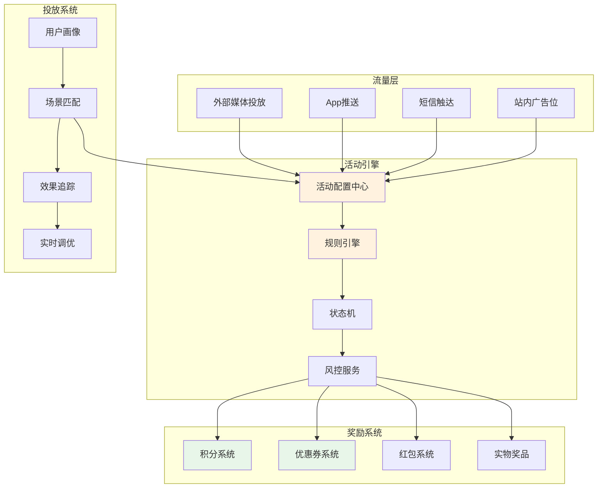

## 二、流量获取：用户从哪里来？

流量是活动的起点。没有流量，再好的活动也没人看到。流量通常来说分为外部流量和内部流量，也分好流量和坏流量。

外部流量是来自自身平台以外的流量，比如说我们将广告投放到视频平台，如爱优腾，短视频平台如抖音，快手等。内容平台如知乎，微博，小红书等。

内部流量是自身平台内的流量。因为对于一个大公司来说，内部是有不同的业务的，所以不同的业务之间可以引流，APP的首页也可以引流。

对于好流量，我的理解是能够带来转化的，是我们真正的目标用户。

坏流量，可能是误点进来的，一下就退出了，或者是那种强迫你看30s广告的这种，但是根本不感兴趣的。

### 2.1 流量渠道矩阵

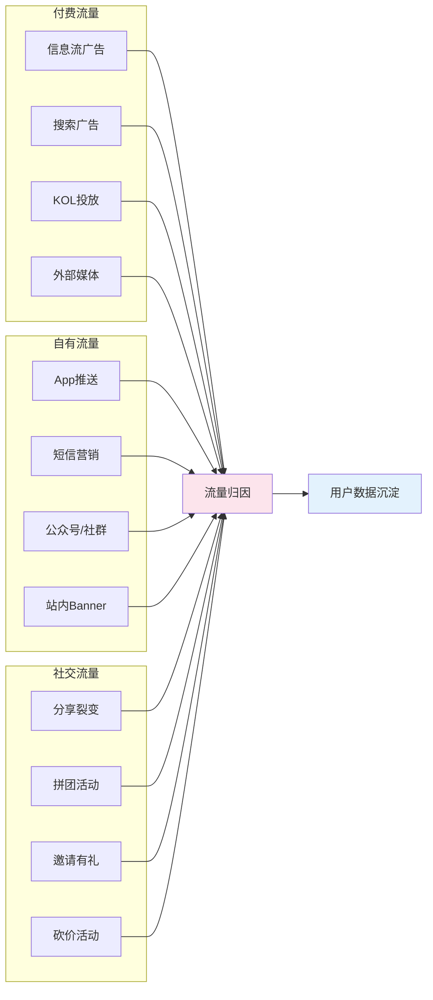

### 2.2 外部媒体投放

大型平台通常自建投放平台，对接字节、腾讯、快手等外部媒体：

**oCPA投放模式**：
- 媒体提供保障效果的oCPA能力
- 转化数据实时回传媒体
- 帮助算法模型优化投放效果

**数据回传流程**：

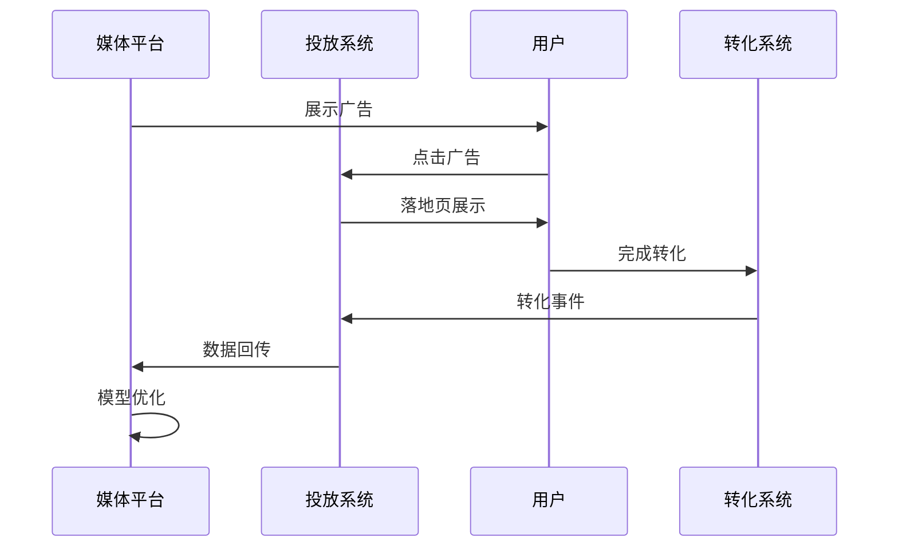

### 2.3 流量归因

流量归因是判断渠道效果的关键：

| 归因模型 | 说明 | 适用场景 |
|---------|------|---------|
| 最后点击归因 | 转化归因于最后一个点击渠道 | 短决策周期产品 |
| 首次点击归因 | 转化归因于第一个接触渠道 | 品牌曝光类投放 |
| 线性归因 | 所有接触渠道均分功劳 | 多触点协同营销 |
| 时间衰减归因 | 越接近转化的触点权重越高 | 长决策周期产品 |

## 三、活动引擎：营销的大脑

活动引擎是整个系统的核心，负责活动的配置、执行和状态管理。

运营需要配置多个活动，这些活动的内容是不一样的，因此，需要适配不同的活动需求。

对于用户视角来说，无非是参加了活动 -》 完成了活动内容-》获取了活动奖励 -》 使用了活动奖励。

因此，关于活动，我们需要配置一些活动内容，比如
- 新手活动 -》完成新手注册
- 拉新活动 -》完成拉新用户注册
- 签到活动 -》完成签到
- 下单活动 -》完成下单

等等，对于活动内容，我们需要抽象出来一些规则，即完成这些规则，我们就认为完成了活动内容。

完成了活动内容就发放一些奖励，比如
- 优惠券
- 积分
- 红包
- 实物奖品

### 3.1 整体架构

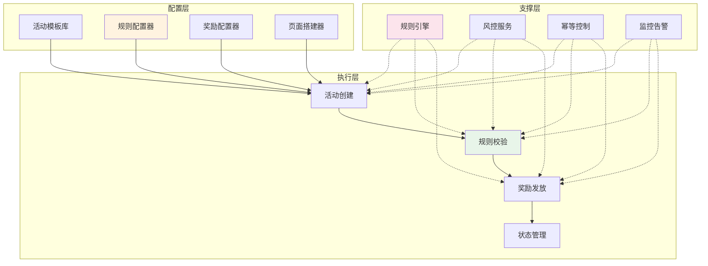

### 3.2 规则引擎设计

营销规则复杂多变，需要配置化的规则引擎：

**规则引擎核心能力**：

```
规则 = 条件 + 动作 + 优先级

条件示例：
- 用户维度：新用户、VIP用户、活跃用户
- 订单维度：订单金额>100、特定品类
- 时间维度：工作日、节假日、特定时段
- 行为维度：浏览次数、加购次数、收藏次数

动作示例：
- 发放优惠券
- 增加积分
- 触发弹窗
- 发送推送
```

**规则引擎伪代码**：

```java
public class RuleEngine {
    
    // 规则执行
    public ActionResult execute(RuleContext context) {
        // 1. 加载匹配的规则
        List<Rule> rules = loadRules(context);
        
        // 2. 按优先级排序
        rules.sort(Comparator.comparing(Rule::getPriority));
        
        // 3. 逐条执行
        for (Rule rule : rules) {
            if (rule.match(context)) {
                ActionResult result = rule.execute(context);
                if (result.isTerminal()) {
                    return result;  // 终止规则
                }
            }
        }
        return ActionResult.empty();
    }
}
```

### 3.3 活动状态机

活动有明确的生命周期，通过状态机管理：

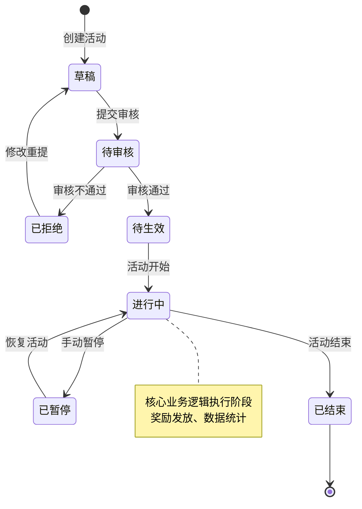

### 3.4 风控集成

营销活动是黑产的重点攻击目标，必须集成风控能力：

**风控维度**：
- **设备指纹**：识别模拟器、刷机设备
- **行为分析**：异常点击、批量操作
- **关联分析**：团伙作弊、羊毛党
- **实时决策**：毫秒级风险判断

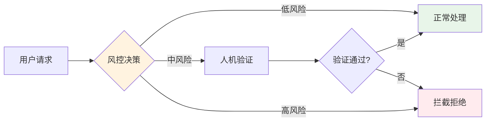

## 四、奖励系统：积分与优惠券

奖励是激励用户参与活动的核心手段。

### 4.1 奖励类型矩阵

| 奖励类型 | 特点 | 成本 | 适用场景 |
|---------|------|------|---------|
| 积分 | 虚拟货币，可累计 | 低 | 用户留存、日常激励 |
| 优惠券 | 抵扣金额，有有效期 | 中 | 促转化、拉复购 |
| 红包 | 现金或抵扣，强感知 | 高 | 大促、拉新 |
| 实物奖品 | 实物发放，物流成本 | 高 | 抽奖、排行奖励 |

### 4.2 积分系统设计

积分系统是最基础的用户激励体系：

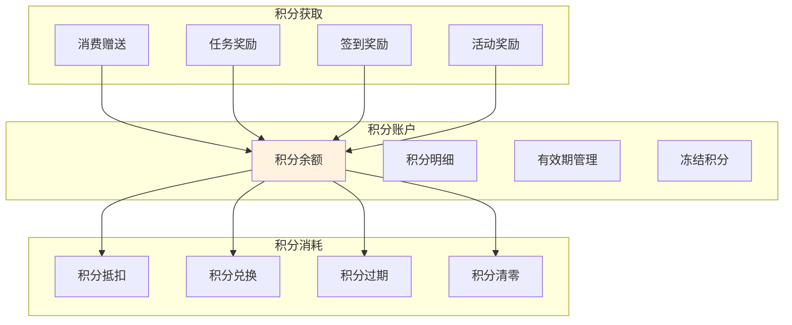

**积分计算模型**：

真实业务中，积分抵扣有复杂的计算逻辑：

```
最大可用积分 = Min(
    Max(
        订单金额 × 积分抵扣比例,
        商家设定的积分抵扣上限,
        单笔订单积分抵扣上限
    ),
    用户积分余额 / 积分汇率,
    订单金额
)
```

**积分有效期管理**：

```java
public class PointExpiryService {
    
    // 滚动过期策略：12个月有效期
    public void processExpiry() {
        // 1. 查询即将过期的积分
        List<PointRecord> expiringPoints = 
            pointRepository.findExpiringSoon();
        
        // 2. 发送过期提醒
        for (PointRecord record : expiringPoints) {
            notificationService.sendExpiryNotice(record);
        }
        
        // 3. 执行过期处理
        LocalDateTime expiryDate = 
            LocalDate.now().minusMonths(12).atTime(23, 59, 59);
        pointRepository.expireBefore(expiryDate);
    }
}
```

### 4.3 优惠券系统设计

优惠券系统比积分更复杂，涉及发放、核销、回收等多个环节。

优惠券的类型同样很多，还可以引入动态券实现不同的用户发放不同的券金额。券的玩法很多，实际上可以实现的非常复杂。

**优惠券类型体系**：

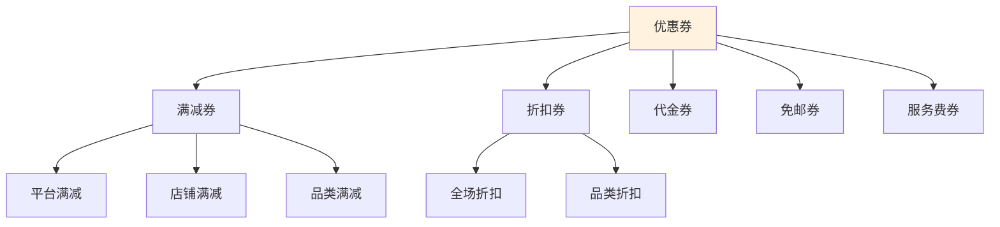

**优惠券核心流程**：

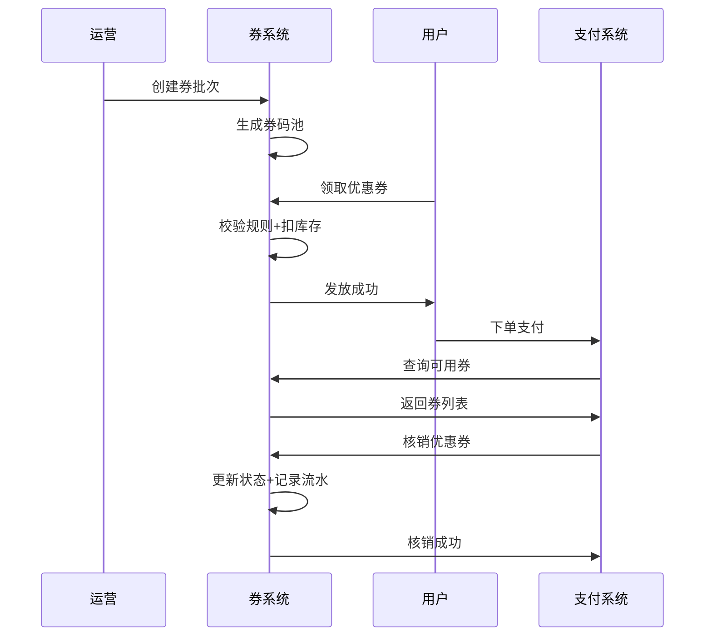

**优惠券发放模式**：

| 模式 | 说明 | 适用场景 |
|-----|------|---------|
| 平台发券 | 平台统一发放 | 新人券、会员券 |
| 商家发券 | 商家自主发放 | 店铺券、活动券 |
| 领取模式 | 用户主动领取 | 限量券、抢券活动 |
| 自动发放 | 满足条件自动发 | 消费返券、生日券 |
| 指定账户 | 定向发放特定用户 | 补偿券、VIP特权 |

**优惠券核销逻辑**：

```java
public class CouponUseService {
    
    @Transactional
    public UseResult useCoupon(UseRequest request) {
        // 1. 校验优惠券有效性
        Coupon coupon = validateCoupon(request.getCouponId());
        
        // 2. 校验使用条件
        if (!checkUseCondition(coupon, request.getOrder())) {
            return UseResult.fail("不满足使用条件");
        }
        
        // 3. 校验互斥规则
        if (checkConflict(coupon, request.getOtherCoupons())) {
            return UseResult.fail("优惠券互斥");
        }
        
        // 4. 标记已使用（幂等）
        if (!markCouponUsed(coupon, request.getOrderId())) {
            return UseResult.fail("优惠券已被使用");
        }
        
        // 5. 计算优惠金额
        BigDecimal discount = calculateDiscount(coupon, request.getOrder());
        
        // 6. 记录核销流水
        recordTransaction(coupon, request, discount);
        
        return UseResult.success(discount);
    }
}
```

### 4.4 奖励发放架构

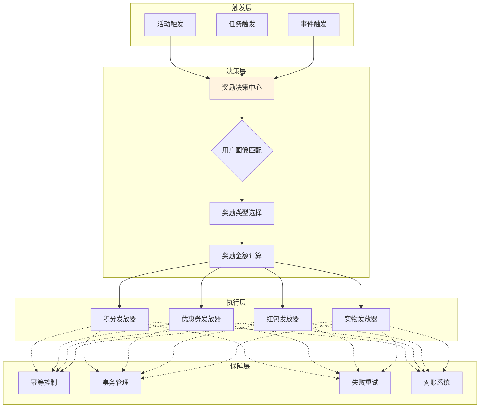

## 五、活动投放：精准触达用户

活动创建好了，如何精准投放到目标用户？

### 5.1 投放系统架构

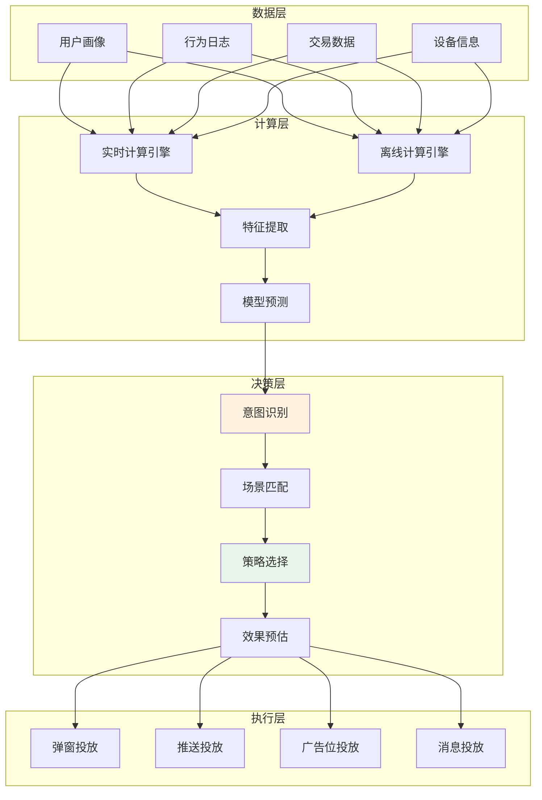

### 5.2 用户意图识别

通过算法识别用户意图，实现精准匹配：

**意图类型**：
- **购买意图**：近期有明确购买需求
- **浏览意图**：兴趣探索阶段
- **比价意图**：决策犹豫阶段
- **流失意图**：长期未活跃

```java
public class IntentRecognizer {
    
    public UserIntent recognize(UserBehavior behavior) {
        // 特征提取
        UserFeatures features = extractFeatures(behavior);
        
        // 多维度判断
        double purchaseScore = calculatePurchaseIntent(features);
        double browseScore = calculateBrowseIntent(features);
        double churnScore = calculateChurnIntent(features);
        
        // 返回最高分意图
        if (purchaseScore > 0.7) {
            return UserIntent.PURCHASE;
        } else if (churnScore > 0.6) {
            return UserIntent.CHURN;
        } else {
            return UserIntent.BROWSE;
        }
    }
}
```

### 5.3 场景匹配与择优

一个用户可能同时满足多个活动场景，需要择优投放：

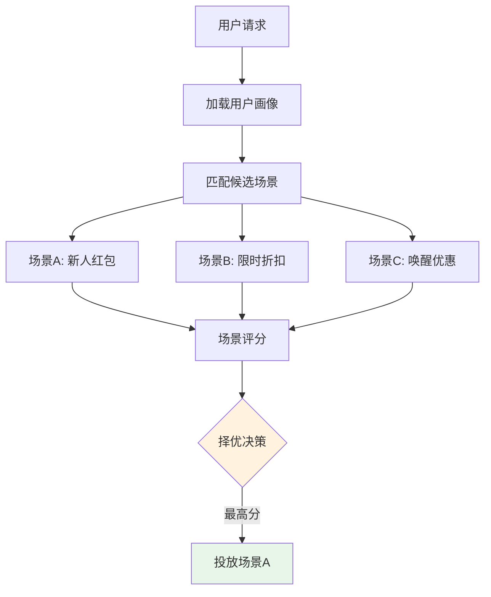

**场景评分维度**：
- **用户匹配度**：用户是否符合场景人群
- **历史转化率**：该场景的历史效果
- **奖励吸引力**：奖励金额/折扣力度
- **时效性**：活动是否即将结束
- **互斥规则**：是否与其他投放冲突

### 5.4 实时投放调优

投放不是一次性的，需要根据效果实时调整：

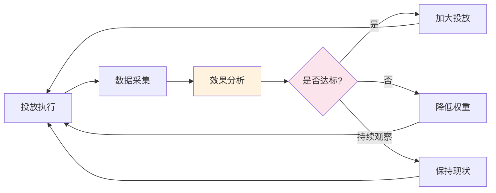

**实时调优策略**：
- **AB测试**：多版本同时投放，选择最优
- **动态出价**：根据转化率调整广告出价
- **智能停止**：ROI低于阈值自动停止
- **预算控制**：按小时/天分配预算

## 六、系统稳定性保障

活动系统直接关系到用户体验和资金安全，稳定性至关重要。

### 6.1 高并发架构

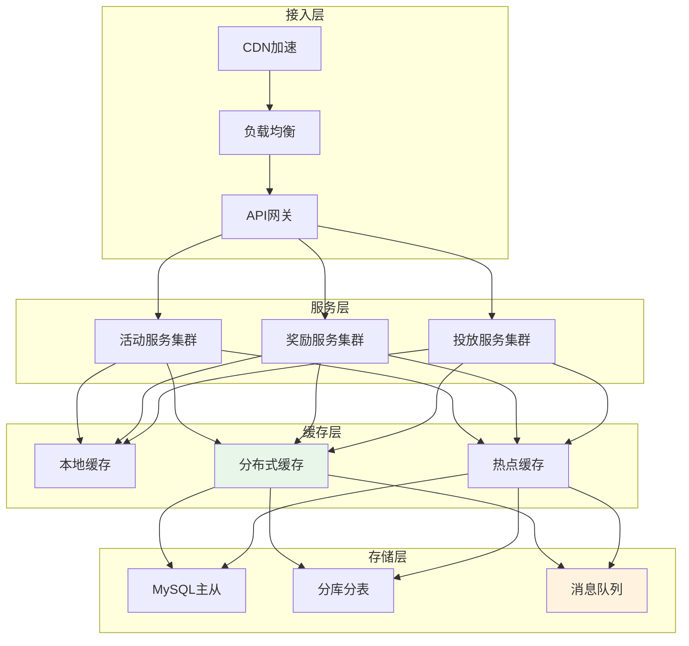

### 6.2 关键保障措施

| 措施 | 说明 |
|-----|------|
| 缓存预热 | 活动开始前预热热点数据 |
| 限流降级 | 超过阈值自动降级非核心功能 |
| 熔断隔离 | 服务异常自动熔断，快速失败 |
| 异步处理 | 发奖等操作异步化，削峰填谷 |
| 幂等设计 | 防止重复发放、重复核销 |
| 对账机制 | 实时对账，发现异常及时处理 |

### 6.3 数据一致性保障

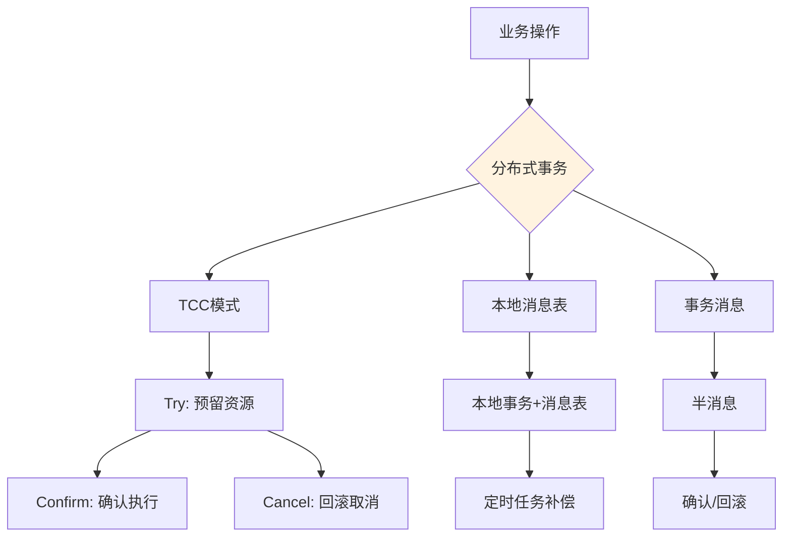

## 七、面试必问

如果你在面试中被问到活动系统设计，记住这几个关键点：

1. **系统分层**：流量层、活动引擎、奖励系统、投放系统
2. **规则引擎**：配置化、灵活扩展
3. **积分设计**：获取、存储、消耗、过期
4. **优惠券设计**：发放、核销、回收、对账
5. **投放策略**：意图识别、场景匹配、实时调优
6. **稳定性**：限流、降级、熔断、幂等、对账

## 总结

活动系统是营销业务的核心基础设施：

- **流量获取**：多渠道引流，精准归因
- **活动引擎**：规则引擎+状态机+风控
- **奖励系统**：积分累计、优惠券核销
- **投放系统**：意图识别、场景择优

核心设计原则：**配置化、模块化、高可用、强风控**。

掌握活动系统设计，你就能理解互联网营销的底层逻辑。

在这个架构设计中，哪些环节可以引入AI大模型做一些决策呢？可以在评论区讨论～

---

## 文末福利

> 关注我发送"MySQL知识图谱"领取完整的MySQL学习路线。
> 发送"电子书"即可领取价值上千的电子书资源。
> 发送"大厂内推"即可获取京东、美团等大厂内推信息，祝你获得高薪职位。
> 发送"AI"即可领取AI学习资料。
> 部分电子书如图所示。


