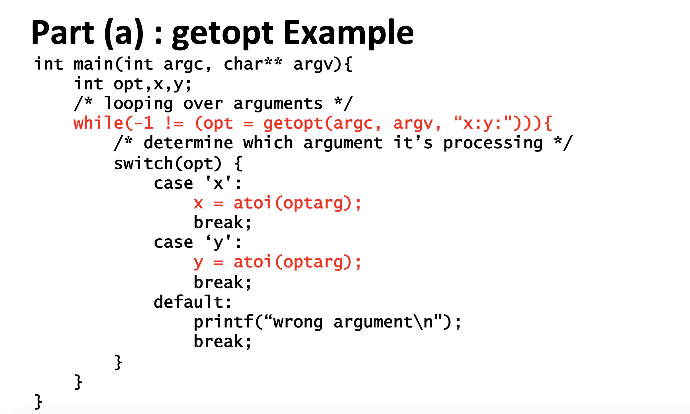
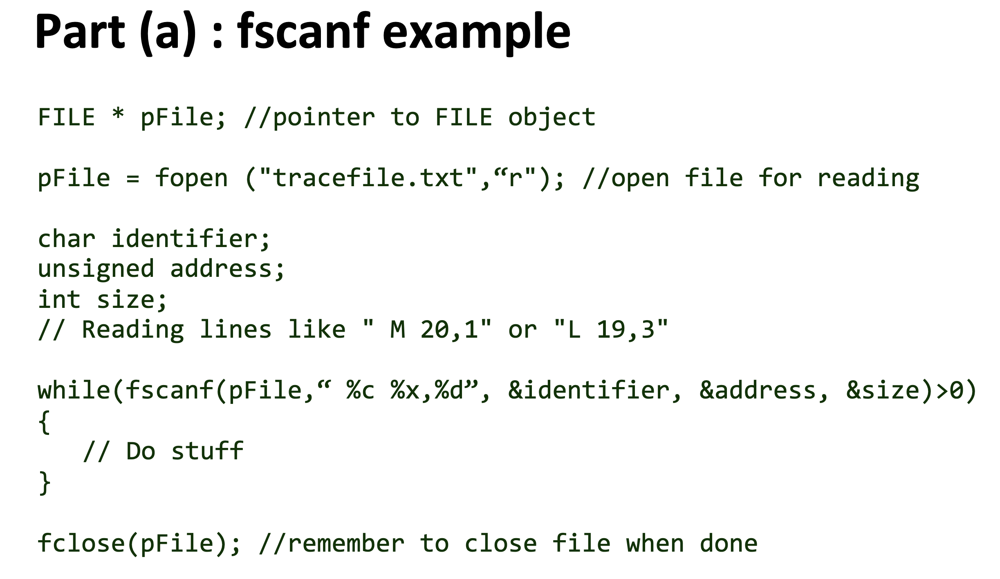
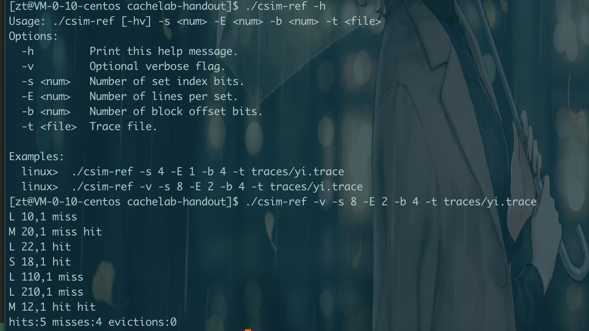

# Cache Lab

cache lab 缓存实验

### 代码下载

从CSAPP上面下载对应的lab代码
> http://csapp.cs.cmu.edu/3e/labs.html

### 环境准备

需要安装 `valgrind`。可以参考文章[Valgrind centos](https://blog.csdn.net/frank_good/article/details/104052768)。

安装好以后执行`valgrind --version`可以看到版本号。

### Cache simulator
- `cache simulator not a cache`。我们不是实现一个真正的缓存，只是实现一个模拟器。
- 不存储内容
- 不使用block offset
- 只计算命中数，不命中数和驱逐数(hit count, miss count,eviction count)
- 缓存模拟器需要在不同的s,b,E下运行。
- 使用LRU替换策略

Hints
- 使用二维数组 struct cache_line cache[S][E];
- S = 2^s
- cache_line //上面说了不需要block offset，所以可以忽略block的内容
  - Valid bit
  - Tag
  - LRU counter
- 通过getopt获取命令行输入
  - 返回-1表示没有输入了
  - 通常在循环里面接收参数
  - 需要包含#include <unistd.h>,#include <getopt.h>
  - 通常使用switch来处理不同的输入
  - 考虑如何处理无效输入
  - 更多信息 man 3 getopt
- fscanf可以指定要读的流(scanf只能读标准输入流)，用来读取trace file
  - 参数
    - 一个流的指针
    - 如何解析文件的信息的格式化字符串
    - 其余部分是指向存储解析数据的变量的指针
  - 通常在循环里使用
  - 当命中EOF或者没有匹配到格式化字符串的时候返回-1
  - 更多信息 man fscanf
- Malloc/free
  - malloc分配数据到heap
  - 记得 free 掉malloc的数据
  - 不要 free 你没有分配的内存





要求我们实现`csim.c`文件，给了一个示例`csim-ref`文件。

输入`./csim-ref -h`可以看到我们要实现的东西。



首先需要接受参数，参数有
- -h 输出帮助信息
- -v 可选详细标志，根据示例程序来，就是输出 `L 10,1 miss`这些信息
- -s [num] set index bit 数
- -E [num] 每个set的行数
- -b [num] block offset bit数
- -t [file] Trace file文件路径

根据上面的提示可以知道，通过`getopt`函数来接收参数，并通过switch来处理。读取文件则通过`fscanf`函数，来读取-t传的文件。

下面是`./traces/yi.trace`文件的内容

```
 L 10,1
 M 20,1
 L 22,1
 S 18,1
 L 110,1
 L 210,1
 M 12,1
```

- L 代表数据载入 
- S 代表数据存储
- M 代表数据修改，需要一次载入 + 一次存储
- 后面的10，20，22这些代表地址
- 最后的1代表操作内存访问的字节数

完整代码
```c
#include "cachelab.h"
#include <unistd.h>
#include <getopt.h>
#include <stdio.h>
#include <stdlib.h>

typedef struct{
        int valid;
        int tag;
        int time_stamp;
} cache_line;

int timestamp = 0;

// 开始匹配到合适的set 找到命中的cache，如果命中返回1,如果没有命中返回0
int find_hit_cache(cache_line *cache_line,int E,int tag, int*hits) {
    int isHit = 0;
    // 循环set中的cache_line 找到是否有匹配tag && valid
    for(int i = 0; i < E; i++) {
        if (cache_line[i].valid == 1 && cache_line[i].tag == tag ) {
            //hit
            printf("hit \n");
            *hits = *hits + 1;
            isHit = 1;
            //刷新时间
            cache_line[i].time_stamp = timestamp;
            return isHit;
        }
    }
    return isHit;
}

// 找到一个空的cache line放进去，找到了就返回1，没有找到就返回0
int find_empty_cache(cache_line *cache_line,int E,int tag) {
    int have_empty_cache = 0;
    for (int i = 0; i< E; i++) {
        if (cache_line[i].valid == 0) {
            // 空的
            // 把当前内存放入cache
            cache_line[i].valid = 1;
            cache_line[i].tag = tag;
            cache_line[i].time_stamp = timestamp;
            // 找到了就不需要替换了
            have_empty_cache = 1;
            return have_empty_cache;
        }
    }
    return have_empty_cache;
}

// 获取要替换的索引
int get_eviction_index(cache_line *cache_line, int E) {
    int max_time_stamp = timestamp;
    int eviction_index = -1;
    for (int i = 0; i< E; i++) {
        if (cache_line[i].time_stamp < max_time_stamp) {
            //找到time_stamp最小的那个
            max_time_stamp = cache_line[i].time_stamp;
            eviction_index = i;
        }
    }
    return eviction_index;
}

// LRU替换
void LRU(cache_line *cache_line, int E,int tag) {
    // 获取要替换的索引
    int eviction_index = get_eviction_index(cache_line, E);
    
    // 替换
    cache_line[eviction_index].valid = 1;
    cache_line[eviction_index].tag = tag;
    cache_line[eviction_index].time_stamp = timestamp; 
}

// L和S操作，M就调用两次这个
int load_and_store(unsigned address,int b,int s,int u_max,int E,cache_line **cache, int *hits,int *misses,int *evications) {
    // 获取set index block offset tag
    int set_index,tag;
    set_index = (address >> b) & u_max;
    tag = (address >> b) >> s;

    // 开始匹配到合适的set 找到命中的cache，如果命中返回1,如果没有命中返回0
    int isHit = find_hit_cache(cache[set_index], E, tag, hits);
    if (isHit == 0) {
        // miss
        printf("miss \n");
        *misses = *misses + 1;
        // 找到一个空的cache line放进去，找到了就返回1，没有找到就返回0
        int have_empty_cache = find_empty_cache(cache[set_index], E, tag);
        // 如果没有找到空的cache,就需要LRU替换
        if (have_empty_cache == 0) {
            printf("evictions \n");
            *evications = *evications + 1;
            //LRU替换
            LRU(cache[set_index], E, tag);
        }
    }
    // 更新全局时间戳
    timestamp++;
    return 0;
}

int main(int argc, char** argv)
{
    // 接受参数 getopt
    int opt,v,s,E,b,S,B;
    // 文件
    FILE        *       pFile;
    while(-1 != (opt = getopt(argc, argv, "h?v?s:E:b:t:"))){
        // opt is h,v,s,E,b,t的ASCII码值
        // 通过switch对不同的参数进行不同的处理
        switch(opt) {
            case 'h':
                printf("./csim: Missing required command line argument \n Usage: ./csim-ref [-hv] -s <num> -E <num> -b <num> -t <file> \n Options: \n -h         Print this help message. \n -v         Optional verbose flag. \n -s <num>   Number of set index bits. \n -E <num>   Number of lines per set. \n -b <num>   Number of block offset bits. \n -t <file>  Trace file. \n\n Examples: \n ./csim -s 4 -E 1 -b 4 -t traces/yi.trace \n ./csim -v -s 8 -E 2 -b 4 -t traces/yi.trace \n");
                // h参数输出帮助内容
                break;
            case 'v':
                // v参数输出详细信息
                v = 1;
                printf("v:%d \n",v);
                break;
            case 's':
                // S is set 2^s 的数量
                // s is Number of set index bits
                s = atoi(optarg);
                S = 1 << s;
                printf("s:%d, S:%d \n",s,S);
                break;
            case 'E':
                // E is cache line 的数量
                // Number of lines per set
                E = atoi(optarg);
                printf("E:%d \n",E);
                break;
            case 'b':
                // B is block data 的字节
                // b is Number of block offset bits
                b = atoi(optarg);
                B = 1 << b;
                printf("b:%d, B:%d \n",b,B);
                break;
            case 't':
                // t is Trace file
                // 读取文件
                //t = atoi(optarg);
                pFile   =       fopen(optarg,"r");
                printf("t:%s, file:%p \n",optarg,pFile);
                break;
            default:
                printf("非法参数 \n");
            break;
        }
    }
    if(s == 0 || E == 0 || b == 0) {
        return 0;
    }
    // cache存储
    cache_line **cache = (cache_line **)malloc(S * sizeof(cache_line *));
    if (cache == NULL) {
        printf("内存分配失败 \n");
    }
    for(int i = 0; i < S; i++) {
        cache[i] = (cache_line *)malloc(E * sizeof(cache_line));
        if(cache[i] == NULL) {
                printf("内存分配失败，开始回滚 \n");
                // 在这里需要释放已分配的内存，然后退出
            for (int j = 0; j < i; ++j) {
                free(cache[j]);
            }
            free(cache);
        }
    }

    int u_max = 1; 
    for(int i = 0; i < s - 1; i++) {
        u_max = (u_max << 1) | 1;
    }

    // 读取文件
    char        identifier;
    unsigned    address;
    int         size;
    int hits,misses,evictions;
//      Reading lines   like    "       M       20,1"   or      "L      19,3"
    while(fscanf(pFile," %c %x,%d",&identifier,&address,&size)>0)
    {
        //      Do      stuff
        // 开始计算 hits,misses,evictions, hits:0 misses:0 evictions:0
        //printf("identifier %c, addr:%x, size:%d \n",identifier,address,size);
        
        //根据identifier来判断动作L load S store M = 一次L 一次S
        if (identifier == 'L' || identifier == 'S'){
        printf("identifier %c, addr:%x, size:%d \n",identifier,address,size);
            load_and_store(address,b,s,u_max,E,cache,&hits,&misses,&evictions);
        } else if (identifier == 'M') {
            // 一次L 一次S
        printf("identifier %c, addr:%x, size:%d \n",identifier,address,size);
            load_and_store(address,b,s,u_max,E,cache,&hits,&misses,&evictions);
            load_and_store(address,b,s,u_max,E,cache,&hits,&misses,&evictions);
        }
    }
    
    fclose(pFile);  //remember      to      close   file    when    done
    printSummary(hits, misses, evictions);

    // 释放数组内存
    for(int i = 0; i< S; i++) {
        free(cache[i]);
    }
    free(cache);
    return 0;
}

```

### Efficient	Matrix	Transpose	


