# Data Lab

data lab 数据实验

这个数据实验请在linux机器上面运行，实测mac m1本跑不起来。windows没试过。

centos上需要安装好gcc运行环境。

如果跑不起来记得安装下面这个东西：

> yum -y install glibc-devel.i686

运行`make btest`的时候可能会有`warning`提示，不用管，这个时候其实已经创建完`btest`了，可以直接运行`btest`。

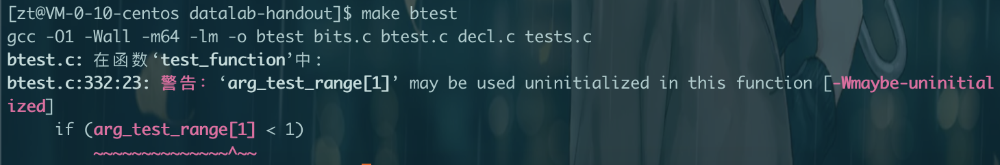

### bitXor

第一个函数是实现`位`的`异或`。

看一下异或的要求，相同为0，不同为1，这个函数里面只能使用`按位与&`和`按位取反~`。

最大操作符号数：14

| x | y | 结果 |
|:----|:----|:----|
|0 | 0 | 0|
|0 | 1 | 1|
|1 | 0 | 1|
|1 | 1 | 0|

假设我们有4 = 100, 5 = 101，异或的结果为1 = 001.

先看按位与的结果。100 & 101 = 100 这个时候能得到 0 0 0这个正确的组合

| x | y | 结果 |
|:----|:----|:----|
|0 | 0 | 0|
|0 | 1 | 0|
|1 | 0 | 0|
|1 | 1 | 1|

100再取反就是011，就可以得到 1 1 0 这个正确的组合。
| x | y | 结果 |
|:----|:----|:----|
|0 | 0 | 1|
|0 | 1 | 1|
|1 | 0 | 1|
|1 | 1 | 0|

先看按位或的结果。100 | 101 = 101 这个时候能得到 0 1 1 和 1 0 1这个正确的组合
| x | y | 结果 |
|:----|:----|:----|
|0 | 0 | 0|
|0 | 1 | 1|
|1 | 0 | 1|
|1 | 1 | 1|

可以看到 ~(x & y) & (x | y) 就可以得出结果了，但是我们不能用 | ，所以我们需要通过 &，～来实现 |。

可以通过 ~(~x & ~y) 来实现 ｜ ,4 = 100 取反 = 011， 5 = 101 取反 = 010, 011 & 010 = 010,取反 = 101. 100 | 101 = 101。

所以 异或就是 ~(x & y) & (~(~x & ~y))

代码
```c
int bitXor(int x, int y) {
  return ~(x & y) & ~(~x & ~y);
}
```

btest 结果：

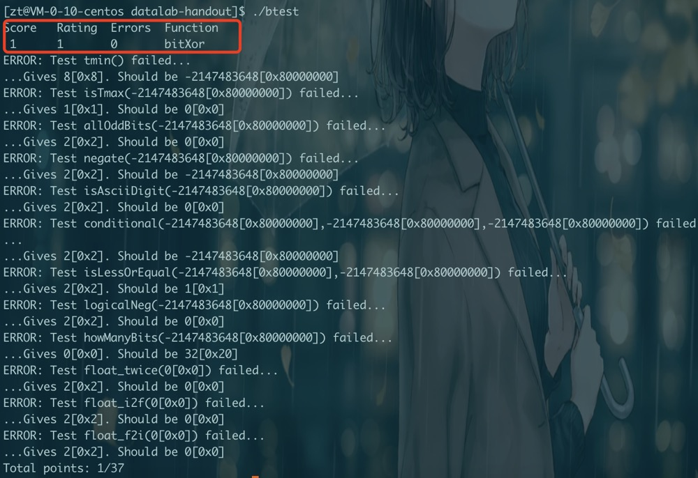

dlc 结果：

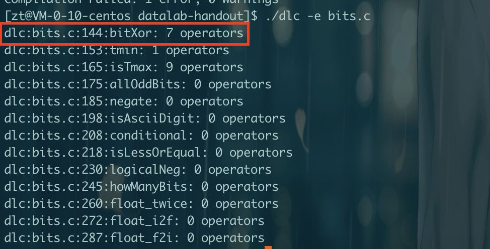

bdd check 结果：

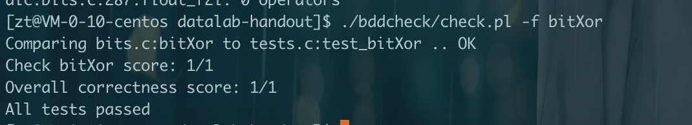


### Tmin

Tmin是`1000 0000`，也就是最小的有符号数，那当然是符号位是1，剩下全0了。

可以使用操作符：! ~ & ^ | + << >>

最大操作符号数量：4

分数：1

返回 1000 0000就可以了。正常的int Tmin就是1后面31个0，也就是1左移动31位

代码：
```c
int tmin(void) {
  return 1 << 31;
}
```

btest 结果：

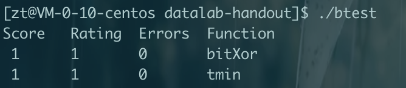

dlc 结果：

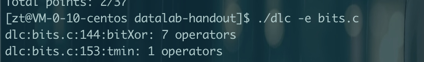

bdd check 结果：

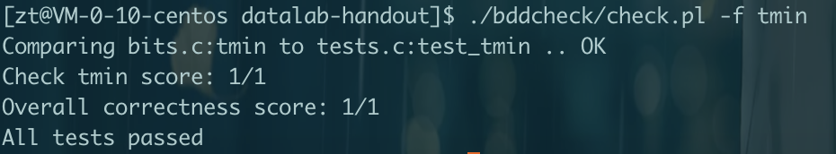

### isTmax

Tmax是`0111`

可以使用操作符: ! ~ & ^ | +
最大操作符号数量: 10

4位的话，Tmax就是7，看一下7的一些操作结果,可以发现，7+1 = ~7

```
7 = 0111
7 + 1 = 1000 = -8
~7 = 1000 = -8
1000 ^ 0000 = 1000 !1000 = 0000
```

但是 -1 + 1 也等于 ~-1,所以我们需要排除-1
```
-1 = 1111
-1 + 1 = 0000
~-1 = 0000
0000 ^ 0000 = 0000 !0000 = 0001
```

可以看到4的话，4 + 1 不等于~4

```
4 = 100
4 + 1 = 0101
~4 = 1011
101 ^ 000 = 101 !101 = 000
```

怎么排除-1呢，观察发现-1+1 = 0，而0^0 = 0,但是tmax ^ 0 不等于0

所以tmax需要满足两个条件
1. x + 1 == ~x
2. x + 1 != 0

可以用`^`操作来实现`==`。如果相等，那么x+1 ^ ~x 就会等于0，!0 == 1，所以第一个条件就是

> !((x+1) ^ ~x)

第二个条件同样通过`^`来实现。

> !!((x+1) ^ 0)

只要这两个都满足就是Tmax了，都满足可以通过`&`来实现，如果都是1，那么`&`以后就是1，有一个不满足`&`以后就是0.

代码：
```c
int isTmax(int x) {
    int xPlus = x + 1;
    return !(xPlus ^ ~x) & !!(xPlus ^ 0);
}
```

btest 结果：

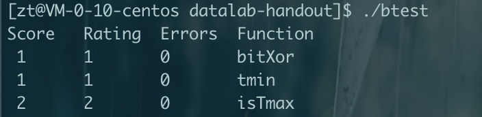

dlc 结果：

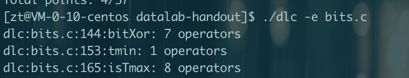

bdd check 结果：

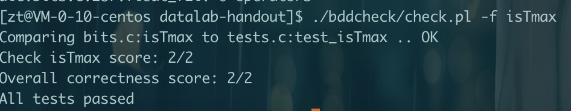

### allOddBits

如果所有的奇数位都是1就返回1，否则返回0

可以使用的操作符: ! ~ & ^ | + << >>
最大数量: 12
分数: 2

比如 `1010 1010`就是奇数位上全1.

所以只要和 `1010 1010` 做 `&` 操作，只要做完以后还是 `1010 1010`的话，那么就返回1，不然就是0.

因为假设 x 奇数位上有一个是0，比如 `1010 1000`，那么结果就会是 `1010 1000`，所以只有奇数位上全1，`&`以后一定是`1010 1010`。

所以需要满足条件
1. x & 1010 1010 == 1010 1010

代码：
```c
int allOddBits(int x) {
  int odd = 0xAA; //1010 1010
  int halfOdd = (odd << 8) + odd; // 1010 1010 0000 0000 + 1010 1010 = 1010 1010 1010 1010
  int allOdd = (halfOdd << 16) + halfOdd;
  return !((allOdd & x)  ^ allOdd );
}
```

btest 结果：

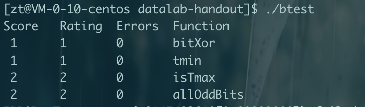

dlc 结果：

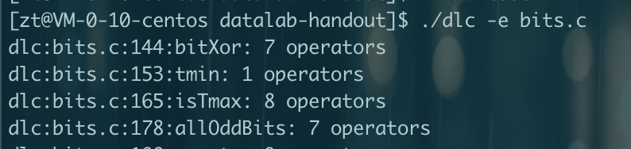

bdd check 结果：

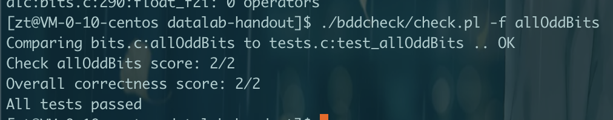

### negate

返回-x
可以使用的操作符: ! ~ & ^ | + << >>
最大数量: 5
分数: 2

这里要分成三部
- 正数，比如 7 = 0111
- 0， 0 = 0000
- 负数，-1 = 1111

如果使用按位取反
- 7 = 0111，～7 = 1000 = -8
- 0 = 0000， ～0 = 1111 = -1
- -1 = 1111， ～-1 = 0000 = 0
- -8 = 1000， ～-8 = 0111 = 7

取反以后的值 + 1就是对应的负数了，-8 + 1 = -7, -1 + 1 = 0, 0 + 1 = 1, 7 + 1 = 8

代码：
```c
int negate(int x) {
  return ~x + 1;
}
```

btest 结果：

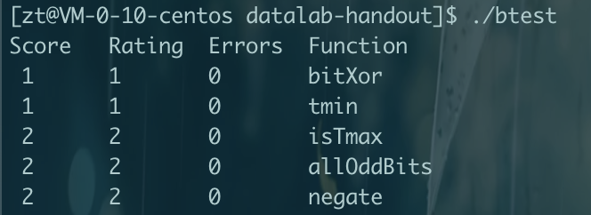

dlc 结果：

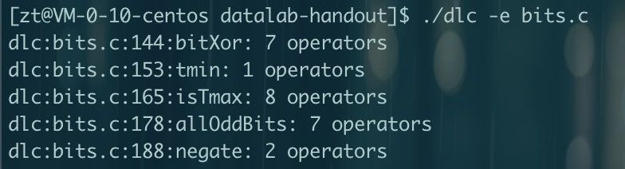

bdd check 结果：

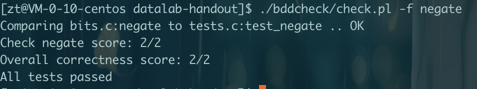

### isAsciiDigit

如果 0x30 <= x <= 0x39，返回1，否则0
可以使用的操作符: ! ~ & ^ | + << >>
最大数量: 15
分数: 3

0x30 = 0011 0000, 0x39 = 0011 1001。
根据题目，也就是判断 0011 0000 <= x <= 0011 1001

首先高位要等于 0011，如果不等于0011，那么肯定不在这个范围。可以通过 >> 4位然后 ^ 0011，如果结果为0，那么高位就是满足的。

低位在0000 到 1001之间,当首位是0的时候，后面是啥都行，首位是1，那么后面两位必须是00，也就是前三位是100.

判断首位是0可以通过 & 0x8 然后 ^ 0来判断，如果结果是0首位就是0，不然首位是1

判断低4位的前3位，先 & 0xE来获取前3位，然后 ^ 0x8来判断是不是 100

所以需要满足条件1并且满足条件2或者3
1. x >> 4 ^ 0011 == 0
2. (x & 0x8) ^ 0 == 0 
3. (x & 0xE) ^ 0x8 == 0 

代码：
```c
int isAsciiDigit(int x) {
    int xh = x >> 4;
    int a3 = 0x3;
    int xlh = x & 0x8;
    int xorxlh = xlh^0;
    int xorxl = (x & 0xE) ^ 0x8;
    return (!(xh ^ a3 ^ 0)) & (!xorxlh | !xorxl);
}
```

btest 结果：

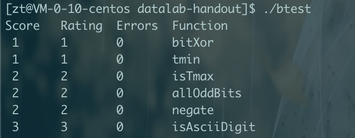

dlc 结果：

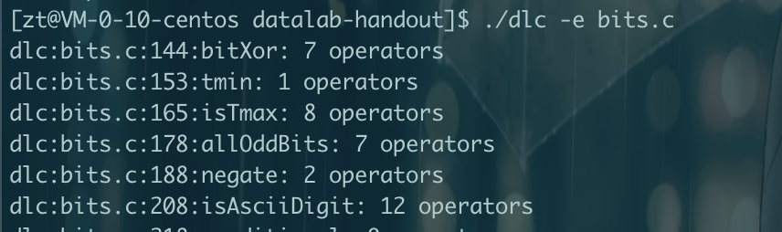

bdd check 结果：

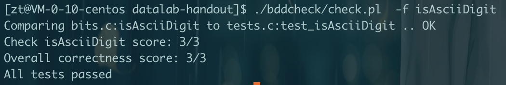

### conditional

实现三元运算 x ? y : z
可以使用的操作符: ! ~ & ^ | + << >>
最大数量: 16
分数: 3

x 为真代表 x & 1 == 1,x 为假代表 x & 1 == 0。
需要满足条件
1. x & 1 == 1时，返回y,所以z需要置为0并且和y一起返回。`!(x & 1) & z`就可以把z置为0，所以应该返回 `(!(x & 1) & z) | y`
2. x & 1 == 0时，返回z,所以y需要置为0并且和z一起返回。`x & 1 & y`就可以把y置为0。所以应该返回 `(x & 1 & y) | z`

把上面的2个条件合并起来。
> (!(x & 1) & z) ｜ (x & 1 & y)

但是发现这样并不行，所以重新思考，发现 x & 1 == 1时候是没错，但是我们应该让 x = 0xFF才行。

所以改进一下子
- 先对x取反。!x = 1,说明x = 0,这个时候应该返回 z,所以需要`(0 & y) | z`
- !x = 0,说明x = 1，应该返回y,所以需要 `(0 & z) | y`

这里把 !x 在按位取反 + 1就可以得到当 x = 0时候，condition = 1111 1111。这个时候返回z。

代码：
```c
int conditional(int x, int y, int z) {
  int xn = !x;
  int condition = ~xn + 1; //x = 0,condition = 1111 1111, x = 1, condition = 0000 0000
  return (condition & z) | (~condition & y);
}
```

btest 结果：

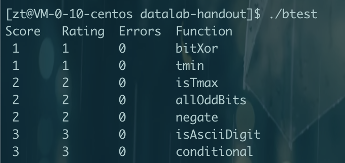

dlc 结果：

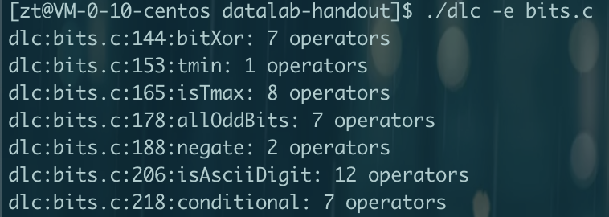

bdd check 结果：

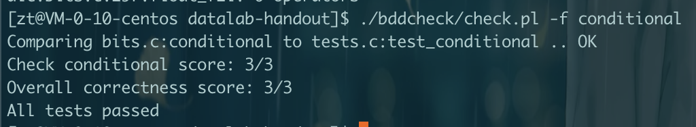

### isLessOrEqual


