# Data Lab

data lab 数据实验

这个数据实验请在linux机器上面运行，实测mac m1本跑不起来。windows没试过。

centos上需要安装好gcc运行环境。

如果跑不起来记得安装下面这个东西：

> yum -y install glibc-devel.i686

运行`make btest`的时候可能会有`warning`提示，不用管，这个时候其实已经创建完`btest`了，可以直接运行`btest`。


### bitXor

第一个函数是实现`位`的`异或`。

看一下异或的要求，相同为0，不同为1，这个函数里面只能使用`按位与&`和`按位取反~`。

最大操作符号数：14

| x | y | 结果 |
|:----|:----|:----|
|0 | 0 | 0|
|0 | 1 | 1|
|1 | 0 | 1|
|1 | 1 | 0|

假设我们有4 = 100, 5 = 101，异或的结果为1 = 001.

先看按位与的结果。100 & 101 = 100 这个时候能得到 0 0 0这个正确的组合

| x | y | 结果 |
|:----|:----|:----|
|0 | 0 | 0|
|0 | 1 | 0|
|1 | 0 | 0|
|1 | 1 | 1|

100再取反就是011，就可以得到 1 1 0 这个正确的组合。
| x | y | 结果 |
|:----|:----|:----|
|0 | 0 | 1|
|0 | 1 | 1|
|1 | 0 | 1|
|1 | 1 | 0|

先看按位或的结果。100 | 101 = 101 这个时候能得到 0 1 1 和 1 0 1这个正确的组合
| x | y | 结果 |
|:----|:----|:----|
|0 | 0 | 0|
|0 | 1 | 1|
|1 | 0 | 1|
|1 | 1 | 1|

可以看到 ~(x & y) & (x | y) 就可以得出结果了，但是我们不能用 | ，所以我们需要通过 &，～来实现 |。

可以通过 ~(~x & ~y) 来实现 ｜ ,4 = 100 取反 = 011， 5 = 101 取反 = 010, 011 & 010 = 010,取反 = 101. 100 | 101 = 101。

所以 异或就是 ~(x & y) & (~(~x & ~y))

代码
```c
int bitXor(int x, int y) {
  return ~(x & y) & ~(~x & ~y);
}
```

btest 结果：


dlc 结果：


bdd check 结果：


### Tmin

Tmin是`1000 0000`，也就是最小的有符号数，那当然是符号位是1，剩下全0了。

可以使用操作符：! ~ & ^ | + << >>

最大操作符号数量：4

分数：1

返回 1000 0000就可以了。正常的int Tmin就是1后面31个0，也就是1左移动31位

代码：
```c
int tmin(void) {
  return 1 << 31;
}
```

btest 结果：


dlc 结果：


bdd check 结果：


### isTmax

Tmax是`0111`

可以使用操作符: ! ~ & ^ | +
最大操作符号数量: 10

4位的话，Tmax就是7，看一下7的一些操作结果,可以发现，7+1 = ~7

```
7 = 0111
7 + 1 = 1000 = -8
~7 = 1000 = -8
1000 ^ 0000 = 1000 !1000 = 0000
```

但是 -1 + 1 也等于 ~-1,所以我们需要排除-1
```
-1 = 1111
-1 + 1 = 0000
~-1 = 0000
0000 ^ 0000 = 0000 !0000 = 0001
```

可以看到4的话，4 + 1 不等于~4

```
4 = 100
4 + 1 = 0101
~4 = 1011
101 ^ 000 = 101 !101 = 000
```

怎么排除-1呢，观察发现-1+1 = 0，而0^0 = 0,但是tmax ^ 0 不等于0

所以tmax需要满足两个条件
1. x + 1 == ~x
2. x + 1 != 0

可以用`^`操作来实现`==`。如果相等，那么x+1 ^ ~x 就会等于0，!0 == 1，所以第一个条件就是

> !((x+1) ^ ~x)

第二个条件同样通过`^`来实现。

> !!((x+1) ^ 0)

只要这两个都满足就是Tmax了，都满足可以通过`&`来实现，如果都是1，那么`&`以后就是1，有一个不满足`&`以后就是0.

代码：
```c
int isTmax(int x) {
    int xPlus = x + 1;
    return !(xPlus ^ ~x) & !!(xPlus ^ 0);
}
```

btest 结果：


dlc 结果：


bdd check 结果：


### allOddBits

如果所有的奇数位都是1就返回1，否则返回0

可以使用的操作符: ! ~ & ^ | + << >>
最大数量: 12
分数: 2

比如 `1010 1010`就是奇数位上全1.

所以只要和 `1010 1010` 做 `&` 操作，只要做完以后还是 `1010 1010`的话，那么就返回1，不然就是0.

因为假设 x 奇数位上有一个是0，比如 `1010 1000`，那么结果就会是 `1010 1000`，所以只有奇数位上全1，`&`以后一定是`1010 1010`。

所以需要满足条件
1. x & 1010 1010 == 1010 1010

代码：
```c
int allOddBits(int x) {
  int odd = 0xAA; //1010 1010
  int halfOdd = (odd << 8) + odd; // 1010 1010 0000 0000 + 1010 1010 = 1010 1010 1010 1010
  int allOdd = (halfOdd << 16) + halfOdd;
  return !((allOdd & x)  ^ allOdd );
}
```

btest 结果：


dlc 结果：


bdd check 结果：


### negate

返回-x
可以使用的操作符: ! ~ & ^ | + << >>
最大数量: 5
分数: 2

这里要分成三部
- 正数，比如 7 = 0111
- 0， 0 = 0000
- 负数，-1 = 1111

如果使用按位取反
- 7 = 0111，～7 = 1000 = -8
- 0 = 0000， ～0 = 1111 = -1
- -1 = 1111， ～-1 = 0000 = 0
- -8 = 1000， ～-8 = 0111 = 7

取反以后的值 + 1就是对应的负数了，-8 + 1 = -7, -1 + 1 = 0, 0 + 1 = 1, 7 + 1 = 8

代码：
```c
int negate(int x) {
  return ~x + 1;
}
```

btest 结果：


dlc 结果：


bdd check 结果：


### isAsciiDigit

如果 0x30 <= x <= 0x39，返回1，否则0
可以使用的操作符: ! ~ & ^ | + << >>
最大数量: 15
分数: 3

0x30 = 0011 0000, 0x39 = 0011 1001。
根据题目，也就是判断 0011 0000 <= x <= 0011 1001

首先高位要等于 0011，如果不等于0011，那么肯定不在这个范围。可以通过 >> 4位然后 ^ 0011，如果结果为0，那么高位就是满足的。

低位在0000 到 1001之间,当首位是0的时候，后面是啥都行，首位是1，那么后面两位必须是00，也就是前三位是100.

判断首位是0可以通过 & 0x8 然后 ^ 0来判断，如果结果是0首位就是0，不然首位是1

判断低4位的前3位，先 & 0xE来获取前3位，然后 ^ 0x8来判断是不是 100

所以需要满足条件1并且满足条件2或者3
1. x >> 4 ^ 0011 == 0
2. (x & 0x8) ^ 0 == 0 
3. (x & 0xE) ^ 0x8 == 0 

代码：
```c
int isAsciiDigit(int x) {
    int xh = x >> 4;
    int a3 = 0x3;
    int xlh = x & 0x8;
    int xorxlh = xlh^0;
    int xorxl = (x & 0xE) ^ 0x8;
    return (!(xh ^ a3 ^ 0)) & (!xorxlh | !xorxl);
}
```

btest 结果：


dlc 结果：


bdd check 结果：


### conditional

实现三元运算 x ? y : z
可以使用的操作符: ! ~ & ^ | + << >>
最大数量: 16
分数: 3

x 为真代表 x & 1 == 1,x 为假代表 x & 1 == 0。
需要满足条件
1. x & 1 == 1时，返回y,所以z需要置为0并且和y一起返回。`!(x & 1) & z`就可以把z置为0，所以应该返回 `(!(x & 1) & z) | y`
2. x & 1 == 0时，返回z,所以y需要置为0并且和z一起返回。`x & 1 & y`就可以把y置为0。所以应该返回 `(x & 1 & y) | z`

把上面的2个条件合并起来。
> (!(x & 1) & z) ｜ (x & 1 & y)

但是发现这样并不行，所以重新思考，发现 x & 1 == 1时候是没错，但是我们应该让 x = 0xFF才行。

所以改进一下子
- 先对x取反。!x = 1,说明x = 0,这个时候应该返回 z,所以需要`(0 & y) | z`
- !x = 0,说明x = 1，应该返回y,所以需要 `(0 & z) | y`

这里把 !x 在按位取反 + 1就可以得到当 x = 0时候，condition = 1111 1111。这个时候返回z。

代码：
```c
int conditional(int x, int y, int z) {
  int xn = !x;
  int condition = ~xn + 1; //x = 0,condition = 1111 1111, x = 1, condition = 0000 0000
  return (condition & z) | (~condition & y);
}
```

btest 结果：


dlc 结果：


bdd check 结果：


### isLessOrEqual

如果x <= y，返回1，否则0
可以使用的操作符: ! ~ & ^ | + << >>
最大数量: 24
分数: 3

等于可以通过`异或`来做。
> !(x ^ y) 

在看小于，如果一个正数和一个负数，那么负数一定小于正数，负数的符号位1，正数的符号位0.

取出符号位，通过右移动31位来获取符号位，但是负数会补1，所以在和1与一下，就可以得到符号位了。
> (x >> 31) & 1

可以`|`一下，如果是 `1 | 0`就返回1了。
> ((x >> 31) & 1 ) | ((y >> 31) & 1)

如果两个都是正数或者负数，那么符号位相同。
- 对较小的数进行按位取反，在加上大的数的话，会产生溢出。也就是 x < y, ~x + y 会溢出，所以首位是0
- 如果两个数相等或者较大的数取反了在加上小的数，不会溢出。x >= y, ~x + y 不会溢出，所以首位是1
- 所以对于等于的情况还需要处理，如果两个数相等，那么 ~x + y = -1，也就是所有位都是1，让这个值+1就是0了，就和小于保持一致了

如果两个数的符号位不同，那么x是1,y是0的话，就返回1，否则0
- 对x的符号位取反，如果x符号位是1，那么取反0,y的符号位是0，那么就返回1
- 如果x符号位是0，取反1，y是1，那么返回0

代码
```c
int isLessOrEqual(int x, int y) {
  // 取首位
  int signalX = (x >> 31) & 1;
  int signalY = (y >> 31) & 1;
  // !(signalX ^ signalY)是符号位相同的情况
  // !(((~x + y + 1) >> 31) & 1) 是符号位相同时候小于等于的情况
  int lessEq = !(signalX ^ signalY) & !(((~x + y + 1) >> 31) & 1);
  // 如果符号位不同的情况
  int neq = (!signalY) & signalX;
  // 两个情况做|，满足任一个情况则返回1
  return (lessEq | neq);
}
```

btest 结果：

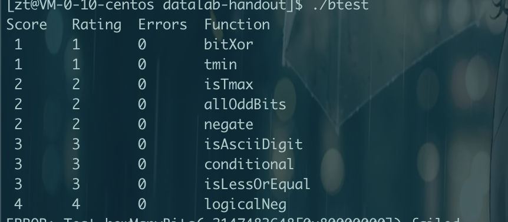

dlc 结果：

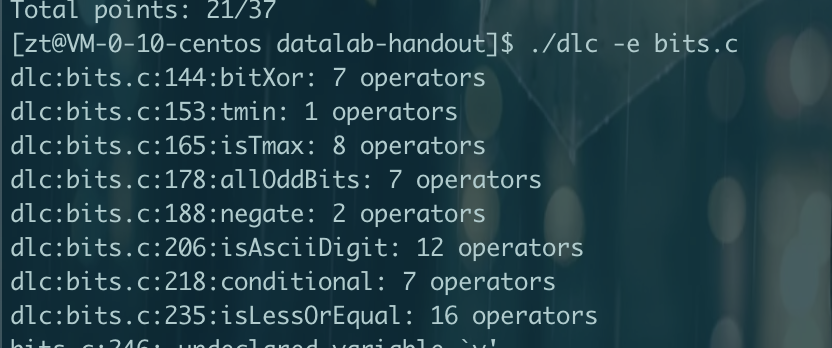

bdd check 结果：

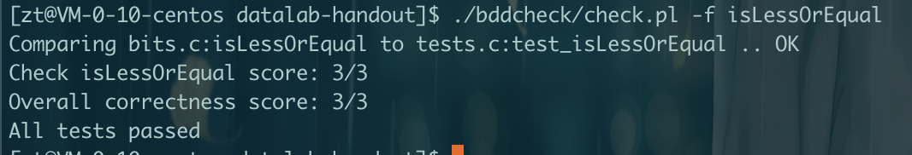

### logicalNeg

对x取反，实现!操作
可以使用的操作符: ~ & ^ | + << >>
最大数量: 12
分数: 4

两种情况
- 0，(~0 + 1) | 0 的首位是0
- 其他数， (~x + 1) | x的首位是1

0要返回1，1要返回0，可以异或1

代码

```c
int logicalNeg(int x) {
  return ((((~x + 1) | x) >> 31) & 1) ^ 1;
}
```

btest 结果：

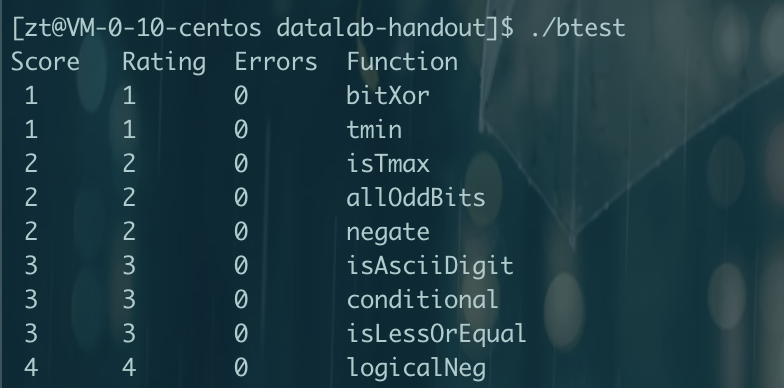

dlc 结果：

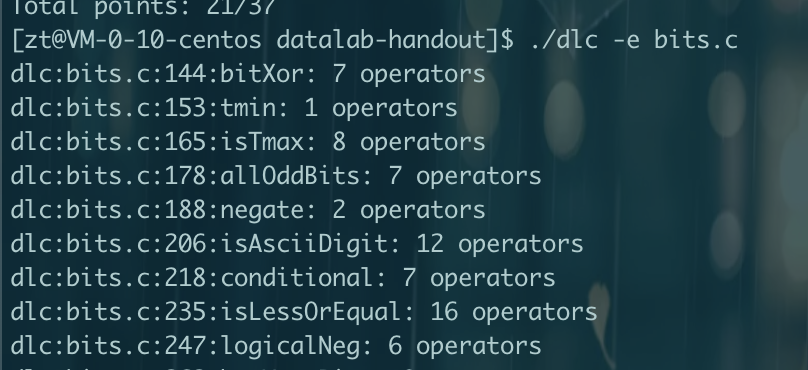

bdd check 结果：

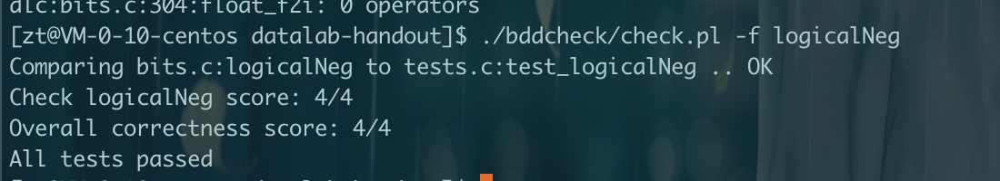

### howManyBits

输出最少需要的位数来表示int x
可以使用的操作符: ! ~ & ^ | + << >>
最大数量: 90
分数: 4

例子：
- howManyBits(12) = 5 = 10010
- howManyBits(298) = 10 = 10 1001 1000
- howManyBits(-5) = 4 = 1011
- howManyBits(0)  = 1 = 0
- howManyBits(-1) = 1 = 1
- howManyBits(0x80000000) = 32 = 1000....

三种情况
- 正数的首位都是1，遇到1的话，找到1是哪位就可以了
- 负数的首位是符号位都是1，所以需要找到第二个1，如果把负数的符号位变成0，就可以按照正数处理了
- 0，直接返回0，也可以使用正数的方法找1，找不到自然返回0了

有没有1，可以通过!!来判断，如果是!!0，就是0，如果是其他数!!x就是1了。

这道题的代码是从网上抄的。

代码

```c
int howManyBits(int x) {
  int signal = x >> 31;
  int b1,b2,b3,b4,b5,h16,h8,h4,h2,h1;
  x =  (signal & ~x) | (~signal & x);
  // 查看高16位是否有1
  h16 = !!(x >> 16);
  // 如果高16位有1，那么肯定需要16位来表示，记住这16位
  // 因为高 16bit 有1，那么h16就是1，所以1 << 4 就是16，代表最低需要16位表示
  // 如果高 16bit 没有1，那么h16就是0，所以 0<< 4就是0，代表最低需要0位表示
  b1 = h16 << 4;
  // 如果高位有1，那么x >> 16位，这样的原来的高位变成了低位
  // 如果高位没有1，那么x >> 0位，这样低16位还是低16位
  x = x >> b1;

  // 这里分为两种情况，如果高16位有1，需要继续看高8位是否有1，如果高16位没有1，需要看低16位的高8位是否有1
  // 因为上面对于高16位有1的时候，将高16位变成了低16位，所以都只需要看低16位的高8位就可以了
   h8 = !!(x >> 8);
  // 和上面同理，如果现在16位的高8位有1，那么b2代表 1 << 3就是8，如果没有，那么就是0
   b2 = h8 << 3
  // 同样处理，如果有，那么高8位变低8位
  x = x >> b2;

  //处理8位的高4位
   h4 = !!(x >> 4);
   b3 = h4 << 2;
  x = x >> b3;

  // 处理4位的高2位
   h2 = !!(x >> 2);
   b4 = h2 << 1;
  x = x >> b4;

  // 处理最后2位是否有1
   h1 = !!(x >> 1);
   b5 = h1;
  x = x >> b5;

  // 所有结果相加 最后+1，因为高16位有1，那么需要17位表示
  return b1 + b2 + b3 + b4 + b5 + x + 1;
}
```
btest 结果：

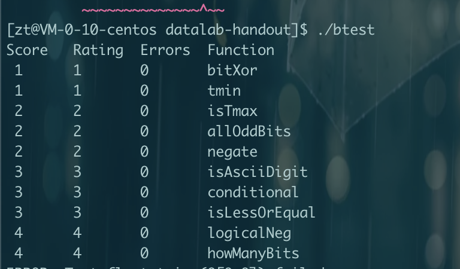

dlc 结果：

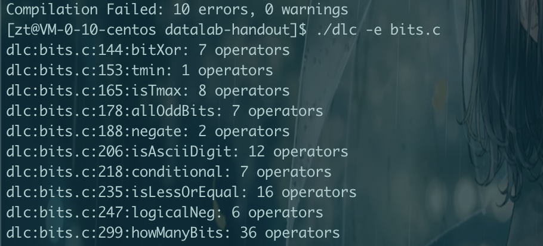

bdd check 结果：

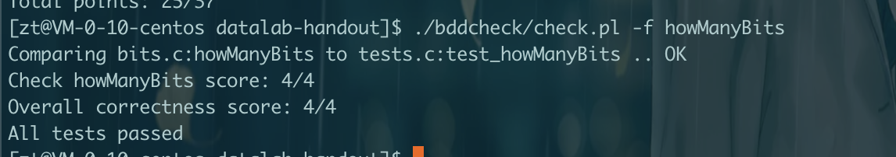

### float_twice

传入一个无符号数uf,返回uf * 2的小数的bit表示
可以使用的操作符: 任何整数的操作，包||,&&,if,while
最大数量: 30
分数: 4

在复习一下，IEEE浮点标准用`V = (-1)的s次方 * M * 2的E次方`来表示。
单精度尾数是23位，exp是8位，符号位1位

取符号位
int s = (uf >> 31) & 1;

取exp
int exp = (uf << 1) >> 24

当阶码exp不等于全0或不等于全1的时候，就表示规格化的浮点数。
E的计算方式
- E = 阶码 - Bias
- Bias = 单精度是127
- 单精度下，假设阶码为 0000 0001, 那么E = 1 - 127 = -126
E = exp - Bias

M的计算方式
- M = 1.XXXXXX
- 尾数就是 XXXXXX
- 假设 尾数为 0000 0000 0000 0000 0000 001，那么M = 1.00000000000000000000001
-1^s * 1.尾数 * 2^E

当阶码等于全0的时候，就表示非规格化的浮点数。
exp ^ 0是0就代表全0，非规格化
E的计算方式，他跟阶码没关系了，因为阶码永远是0
- E = 1 - Bias
- Bias = 单精度是127
- 阶码永远为 0000 0000, E = 1 - 127 = -126
E = 1 - 127

M的计算方式
- M = 0.XXXXXX
- 尾数就是 XXXXXX
- 假设 尾数为 0000 0000 0000 0000 0000 001，那么M = 0.00000000000000000000001
-1^s * 0.尾数 * 2^E

当阶码等于全1的时候，就表示特殊的浮点数。
~exp ^ 0是0就代表全1，特殊浮点数 当尾数不为全0的时候，就是NaN，返回参数。

小数乘法
- 符号位s1 ^ s2
- M = M1 * M2
- E = E1 + E2

对于规格化的数，*2，自然是e+1，因为2的E次方，E+1，那就等于多乘了个2
对于非规格化的数，E是固定的-126，没法改变，所以尾数*2

```c
unsigned float_twice(unsigned uf) {
  // 初始化s符号位，exp阶码，fre尾数
  int s,exp,fre;
  s = (uf >> 31) & 1;
  exp = (uf & 0x7F800000) >> 23;
  fre = uf & 0x7FFFFF;
  // 如果exp == 0，代表非规格化的数
  if (exp == 0) {
    // 非规格化
    // 尾数 * 2
    fre = fre << 1;
    return (s << 31) | (exp << 23) | fre;
  } else if (exp == 0xFF) {
    // 特殊
    return uf;
  } else {
    // 规格化 exp + 1
    exp = exp + 1;
    // +1以后有可能是全1，那么就是无穷大，也就是特殊值，无穷大需要把尾数变成全0
    if (exp == 0xff) {
        fre = 0x0;
    }
    return (s << 31) | (exp << 23) | fre;
  }
}
```

btest 结果：

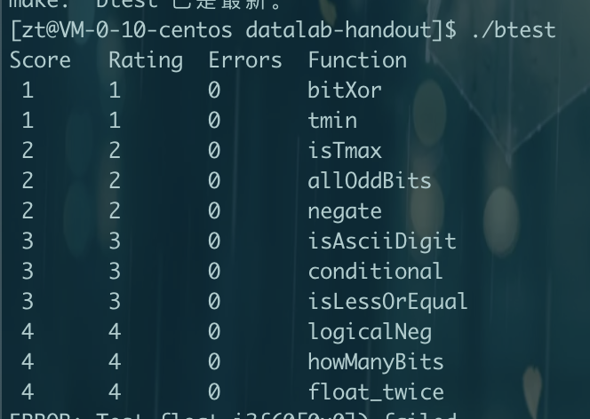

dlc 结果：

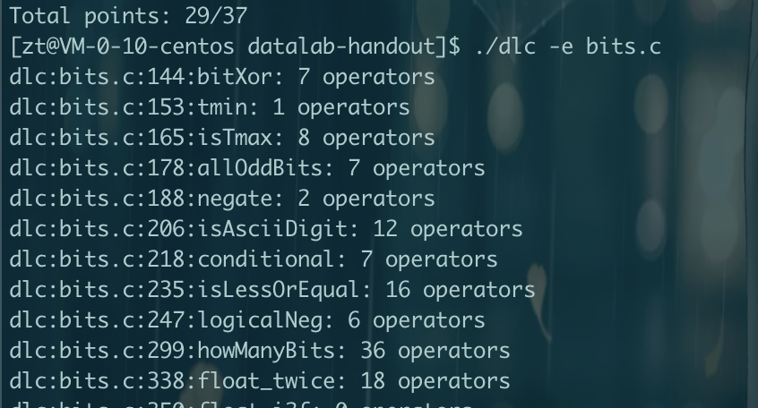

bdd check 结果：

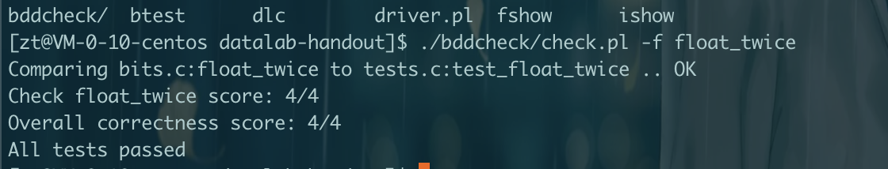

### float_i2f


