# 计算机系统漫游

计算机系统是由硬件和系统软件组成的，它们共同工作来运行应用程序。。虽然系统的 具体实现方式随着时间不断变化，但是系统内在的概念却没有改变。所有计算机系统都有 相似的硬件和软件组件，它们又执行着相似的功能。

## 第一个c程序

一般第一个程序都是输出`hello world`，这里我们使用c语言输出一个`hello world`。后面在来讲这里面都发生了什么。

```c
#include <stdio.h>

int main(void)
{
    printf("hello world\n");
    return 0;
}
```

# 信息的表示和处理

无符号整型和有符号整型的二进制表示

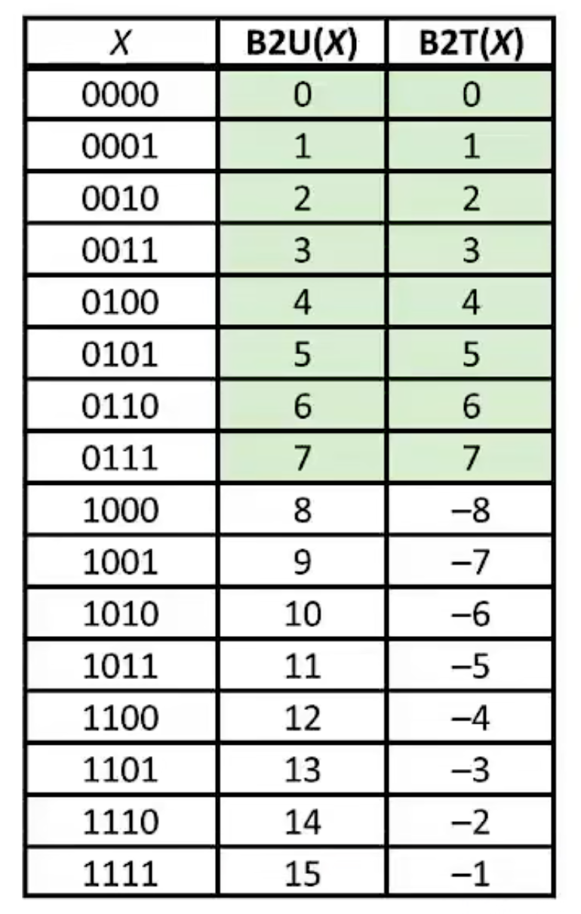

## bit

可以用bit来表示集合，并用位操作来表示集合的操作。

p && *p可以避免空指针

左移1位等于乘2

右移1位等于除2，且向下取整

逻辑右移：右移后补0，java中 -3 >> 1 = -2
算术右移：右移后补符号位,java中 -3 >>> 1 = 2147483646

## 大端表示和小端表示

- 最高有效字节在最前面的方式，称为大端表示。
- 低有效字节在最前面的方式，称为小端表示。

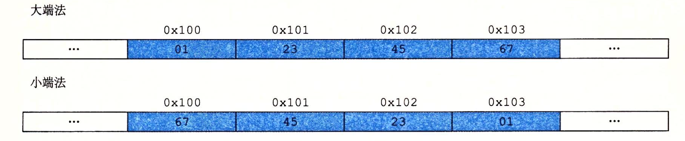

可以通过下面的代码来测试自己的机器是大端还是小端的。

```c
#include <stdio.h>

typedef unsigned char *pointer;

void show_bytes(pointer start, size_t len) {
	size_t i;
	for (i = 0; i < len; i++)
		printf("%p\t0x%.2x\n", start+i, start[i]);
	printf("\n");
}

int main() {
    int a = 15213;
    printf("int a = 15213;\n");
    show_bytes((pointer) &a, sizeof(int));
    return 0;
}
```

## float

101.11表示5又3/4，也就是23/4。前面的101表示5，小数点后面的11表示3/4,小数点后面第1个1表示1/2，第二个1表示1/4，所以相加就是3/4

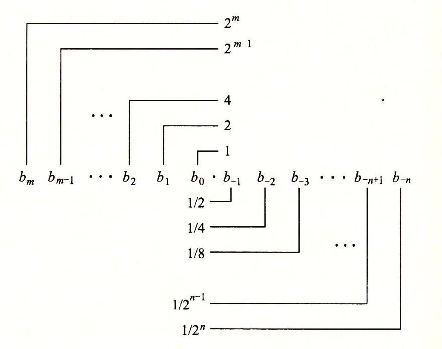

浮点数表示由`IEEE`制定。

IEEE浮点标准用`V = (-1)的s次方 * M * 2的E次方`来表示。

所以存储就有了3部分
- 符号位，1位，0表示正数，1表示负数，表示s
- 尾数significand，尾数通常是1-2之间或0-1之间。encodes M，但不等于M
- 阶码exponent，encodes E，但不等于E

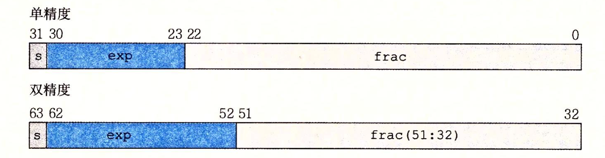

### 表示方式

#### 规格化表示(Normalized)

当阶码不等于全0或不等于全1的时候，就表示规格化的浮点数。

E的计算方式
- E = 阶码 - Bias
- Bias = 2的k-1次方 - 1，单精度是127，双精度是1023
- 单精度下，假设阶码为 0000 0001, 那么E = 1 - 127 = -126

M的计算方式
- M = 1.XXXXXX
- 尾数就是 XXXXXX
- 假设 尾数为 0000 0000 0000 0000 0000 001，那么M = 1.00000000000000000000001

假设符号为0表示正数，那么这个浮点数为 V = 1 * M * 2的E次方 
= 1 * 1.00000000000000000000001 * 2的-126次方 
= 1.00000000000000000000001 * 2的-126次方 
= 0.000...00100000000000000000000001 （小数点左移126位）
这等于非常非常小的一个浮点数了

如何表示15213.0呢。首先符号位为0，然后计算尾数和阶码。
- 15213.0 换成二进制表示为 11 1011 0110 1101.0
- 接下里移动小数点为 1.1101 1011 0110 1 * 2的13次方，因为小数点左移动了13位。
- 所以尾数为 1101 1011 0110 1000 0000 000
- E = 13，所以阶码 = E + Bias = 13 + 127 = 140.
- 所以阶码为 140，二进制表示为 1000 1100

15213.0的浮点数表示为：

0 1000 1100 1101 1011 0110 1000 0000 000


#### 非规格化表示(Denormalized)

当阶码等于全0的时候，就表示非规格化的浮点数。

E的计算方式，他跟阶码没关系了，因为阶码永远是0
- E = 1 - Bias
- Bias = 2的k-1次方 - 1，单精度是127，双精度是1023
- 阶码永远为 0000 0000, E = 1 - 127 = -126

M的计算方式
- M = 0.XXXXXX
- 尾数就是 XXXXXX
- 假设 尾数为 0000 0000 0000 0000 0000 001，那么M = 0.00000000000000000000001

假设符号为0表示正数，那么这个浮点数为 V = 1 * M * 2的E次方 
= 1 * 0.00000000000000000000001 * 2的-126次方 
= 0.00000000000000000000001 * 2的-126次方 
= 0.000...00000000000000000000000001 （小数点左移126位）
这等于非常非常小的一个浮点数了，比上一个规格化的更小

如果尾数也等于全0，那么就表示浮点数0

#### 特殊值

当阶码等于全1的时候，就表示特殊的浮点数。
- 当尾数全0，就表示无穷大
- 当尾数为其他值的时候，就表示 NaN(Not a Number)

用数轴表示如下：

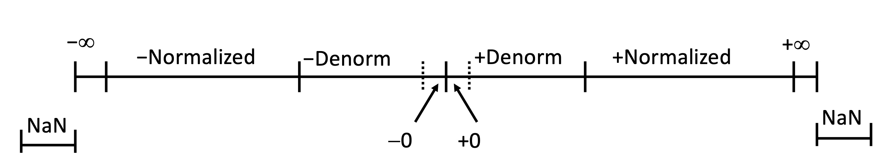

## 练习题

 习题2.54 假定变量x,f和d的类型分别是int、float 和cioubile。除了f和d都 不 能 等 于 十∞ 、 、 一 ∞ 或 者 N a N ， 它 们 的 值 是 任 意 的 。 对 于 下 面 每 个 C 表 达 式， 证 明 它 总 是 为 真 ( 也 就 是 求 值 为 1 )， 或 者 给 出 一 个 使 表 达 式 不 为 真 的 值 ( 也 就 是 求 值 为 0 )。

 类型中long > double > int > float

1. x == (int) (double) x // true
2. x == (int) (float) x // false
3. d == (double) (float) d // false
4. f == ( float ) ( double ) f // true
5. f == -(-f) //true 只改变了符号位
6. 1.0/2 == 1/2.0 //true
7. d*d >= 0.0 // true
8. ( f + d ) - f == d //false浮点数不满足结合律

# 程序的机器级表示

## 历史

从最早的16位处理器8086到现在的64位处理器x86-64
- 8086(1978年 ， 29 K个晶体管 )。 是 第 一代单芯片、16 位微处理器之一。8088是8086的一个变种，在8086上增加了一个8位外部总线，构成最初的IBM个人计算机的心脏。 BM与当时还不强大的微软签订合同，开发MS DOS 操作系统。最初的机器型号有32768 字节的内存和两个软驱 (没有硬盘驱动器)。 从体系结构上来说，这些机器只有655360字节的地址间 -- 地址只有20位长(可寻址范围为1048576字节)，而操作系统保留了393216字节自用。1980年 ，Intel提出了8087浮点协处理器 (45 K个晶体管)，它与一个8086或8088处理器一同运行，执行浮点指令。8087 建立了x86 系列的浮点模型，通常被称为 “x87”
- 80286(1982 年，134K个晶体管)。增加了更多的寻址模式(现在已经废弃了)，构成了IBM PC- AT个人计算机的基础，这种计算机是 MS Windows 最初的使用平台。
- i386 (1985 年，275K 个晶体管) 。将体系结构扩展到32位。增加了平坦寻址模式(flat addressingmodel)，Linux 和最近版本的Windows 操作系统都是使用的这种模式。这是 Intel 系列中第 一台全面支持Unix操作系统的机器。
- i486(1989 年，1.2M个晶体管)。改善了性能，同时将浮点单元集成到了处理器芯片上，但是指令集没有明显的改变。
- Pentium(1993 年，3.1M个晶体管)。改善了性能，不过只对指令集进行了小的扩展
- PentiumPro( 1995 年，5.5M个晶体管)。引人全新的处理器设计，在内部被称为P6 微体系结构。指令集中增加了一类“ 条件传送(conditional move)” 指令
- Pentium/ MMX ( 1997年，4.5M个晶体管 )。 在 Pentium处理器中增加了一类新的处理整数向量的指令。每个数据大小可以是1、2或4字节。每个向量总长64位
- Pentium II ( 1997 年 ，7M 个晶体管 )。 P6微体系结构的延伸
- Pentium III (1999年，8.2M个晶体管)。引人了SSE，这是一类处理整数或浮点数向 量的指令。每个数据可以是1、2或4个字节，打包成128位的向量。由于芯片上包括了 二 级高速绥存，这种芯片后来的版本最多使用 了24M 个晶体管
- Pentium4 ( 2000年 ， 42M个晶体管 )。 SSE 扩展到了 SSE2，增加了新的数据类型 (包括双精度浮点数)，以及针对这些格式的 144 条新指令。有了这些扩展，编译器可以使用 SSE 指令(而不是x87 指令)，来编译浮点代码
- Pentium 4E(2004年，125M个晶体管)。增加了超线程(hyperthreading)，这种技术 可以在一个处理器上同时运行两个程序;还增加 了EM64T ，它是 Intel 对 AMD 提出的对 IA32的64 位扩展的实现，我们称之为x86-64。
- Core2( 2006年 ， 291M 个晶体管 )。 回归到类似于 P6 的微体系结构 。Intel的第一个多核微处理器，即多处理器实现在一个芯片上。但不支持超线程。
- Core i7，Nehalem(2008年，781M个晶体管)。既支持超线程，也有多核，最初的版 本支持每个核上执行两个程序，每个芯片上最多四个核
- Core i7, Sandy Bridge(2011年，1.17G 个晶体管)。引入了AVX，这是对SSE 的扩 展，支持把数据封装进 256 位的向量。
- Corei7, Haswel(2013年，1.4G个晶体管)。将AVX扩展至AVX2，增加了更多的指令和指令格式.

## 机器级代码

# 程序优化性能

要写出编译器友好的程序来提升程序性能，比如下面两个函数

```c
void test1(long *xp, long *yp) {
    *xp += *yp;
    *xp += *yp;
}
```

```c
void test2(long *xp, long *yp) {
    *xp += 2 * *yp;
}
```

对于test1来说，要执行读取xp,读取yp,写xp，再次读取xp,读取yp，写xp，总共4次读取，2次写入。

对于test2来说，要执行读取xp,读取yp，写xp，只需要2次读取，1次写入，当然性能更好。

而且考虑一种情况，就是`*xp`和`*yp`指向同一个内存，如果这样的话，那么test1就变成了 xp = 4 * xp，test2就变成了 xp = 3 * xp，意思就不一样了，所以编译器没有办法把test1优化成test2的形式，这种叫做`内存别名`

在看一个指针的问题
```c
x = 1000;y = 3000;
*q = y;
*p = x;
t1 = *q; // 1000 or 3000
```

如果`*q`和`*p`是指向两个内存，那么t1就是3000,如果指向同一个内存，那么t1就是1000，因此编译器无法对这种代码进行优化。

### 消除循环的低效率

可以把循环中的多次计算或者过程调用等重复执行的，结果确定的，提取出来，只执行一次。

比如下面的代码，这个时候strlen这个函数会执行n次，A-a也会执行n次，他们的结果每次都是一样的，可以都提取出来。A-a由于是常数减法，编译器应该会优化，但是strlen是一个函数，函数的结果是不确定的，编译器会保守的保留它不进行优化。
```c
void lower(char *s)
{
 size_t i;
 for (i = 0; i < strlen(s); i++)
 if (s[i] >= 'A' && s[i] <= 'Z')
 s[i] -= ('A' - 'a');
} 
```

优化后的代码
```c
void lower(char *s)
{
 size_t i;
 size_t len = strlen(s);
 for (i = 0; i < len; i++)
 if (s[i] >= 'A' && s[i] <= 'Z')
 s[i] -= ('A' - 'a');
} 
```

### 减少过程调用

有一些函数中会有一些不必要的操作，可以减少他们，比如数组函数，里面也许会有边界检查之类的，防止越界，但是如果我们的外部代码已经很明显的做了检查，或者说肯定不会越界，那么我们就可以省掉调用函数里面的这部分开销。

get_vec_element这个函数获取数组中的值，并且做了边界检查。这样会做n次边界检查，我们可以优化它。

```c
void combine2(vec_ptr v, data_t *dest)
{
    long i;
    long length = vec_length(v);
    *dest = IDENT;
    for (i=0; i<length; i++) {
        data_t val;
        get_vec_element (v, i, &val);
        *dest = *dest OP val;
    }
}
```

优化之后的代码，省了每次的边界检查。

```c
void combine3(vec_ptr v, data_t *dest)
{
    long i;
    long length = vec_length(v);
    data_t *data =get_vec_start(v);
    *dest = IDENT;
    for (i=0; i<length; i++) {
        *dest = *dest OP data[i];
    }
}
```

### 消除不必要的内存引用

上面的代码还是有些问题，因为对于dest来说，每次都要经历load,计算,store的过程，这个过程要重复n次，可以通过增加局部变量来减少load和store的次数。

```c
void combine4(vec_ptr v, data_t *dest)
{
    long i;
    long length = vec_length(v);
    data_t *data =get_vec_start(v);
    data_t acc = IDENT;
    for (i=0; i<length; i++) {
        acc = acc OP data[i];
    }
    *dest = acc;
}
```

### 循环展开

for循环每次循环都会进行if条件判断，计算机执行条件判断的时候是比较费时的，现在有了`分支预测`功能，但是预测失败的话，也会影响性能。可以通过循环展开来优化这里，来减少for循环的消耗。这样改造的程序，已经极为接近线性代码的功耗了。

```c
void combine5(vec_ptr v, data_t *dest)
{
    long i;
    long length = vec_length(v);
    long limit = length - 1;
    data_t *data =get_vec_start(v);
    data_t acc = IDENT;
    // 循环次数减半
    for (i=0; i<limit; i+=2) {
        acc = acc OP data[i] OP data[i+1];
    }

    // 循环不一定是2的倍数，这里处理剩下的元素
    for(;i<length; i++) {
        acc = acc OP data[i];
    }
    *dest = acc;
}
```

### 结合律

对于满足结合律的运算，可以通过结合律来优化。对于上面的combine5函数来说，他的执行流程是这样的。因为每次乘的时候都要等上一个的结果，所以是线性的。

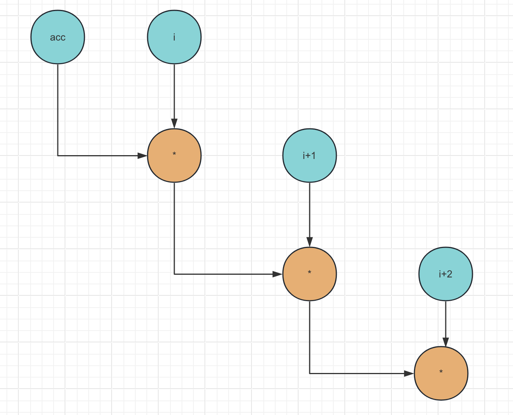

使用结合律优化以后，执行路程是下面这样的，为啥它能并行呢，因为在执行左边`acc * (i * i+1)`结果的时候，就已经可以计算`i+2 * i+3`的结果了。这两个乘法并行了，所以缩短了执行时间。上面无法并行的原因是先计算了`acc * i`，当计算下一个`acc * i`的时候需要依赖上一次acc的结果。

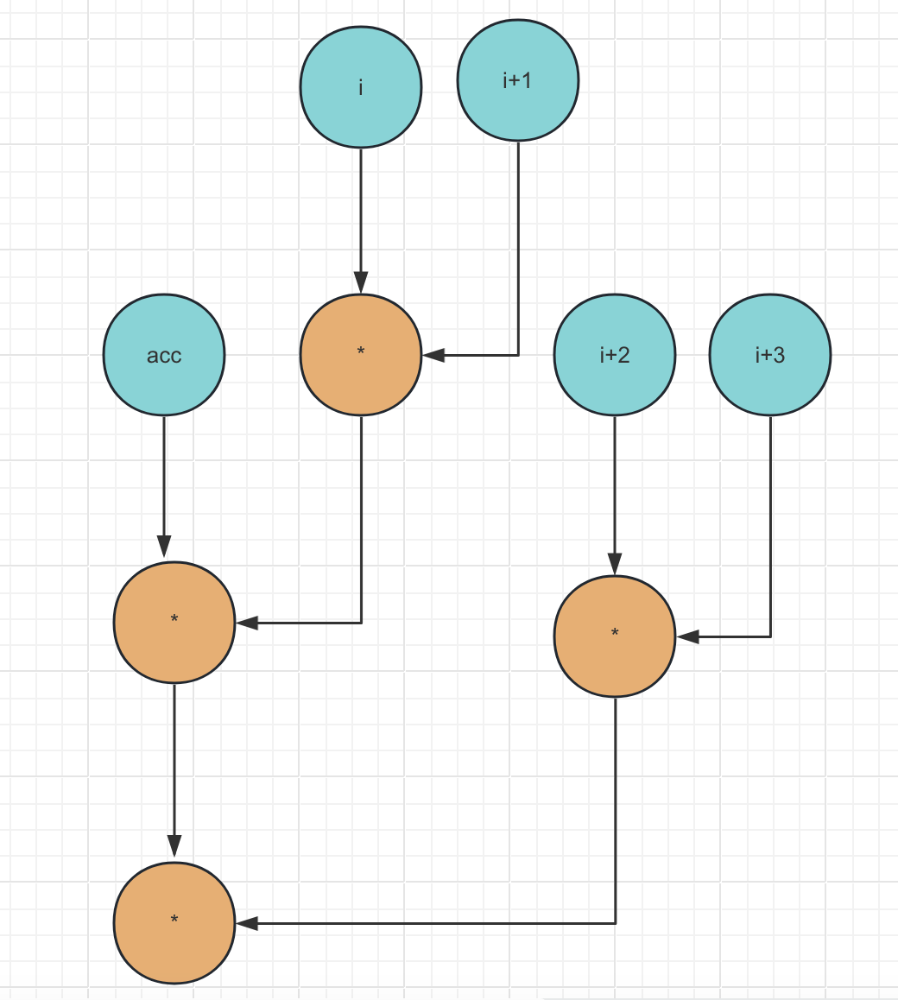

```c
void combine6(vec_ptr v, data_t *dest)
{
    long i;
    long length = vec_length(v);
    long limit = length - 1;
    data_t *data =get_vec_start(v);
    data_t acc = IDENT;
    // 循环次数减半
    for (i=0; i<limit; i+=2) {
        // 唯一的区别的就是这里加了括号
        acc = acc OP (data[i] OP data[i+1]);
    }

    // 循环不一定是2的倍数，这里处理剩下的元素
    for(;i<length; i++) {
        acc = acc OP data[i];
    }
    *dest = acc;
}
```

### 多个累积变量

还可以通过先求出所有i为偶数的结果，和i为奇数的结果，在把两个结果结合到一起。这样的话先计算奇数和偶数，这两个是互不干涉的，也可以达到上面结合律的效果。

```c
void combine7(vec_ptr v, data_t *dest)
{
    long i;
    long length = vec_length(v);
    long limit = length - 1;
    data_t *data =get_vec_start(v);
    data_t acc0 = IDENT;
    data_t acc1 = IDENT;
    // 循环次数减半
    for (i=0; i<limit; i+=2) {
        // 计算偶数和奇数
        acc0 = acc0 OP data[i]；
        acc1 = acc1 OP data[i+1];
    }

    // 循环不一定是2的倍数，这里处理剩下的元素
    for(;i<length; i++) {
        acc0 = acc0 OP data[i];
    }
    *dest = acc0 OP acc1;
}
```

# 存储器层次结构

## 存储技术

存储技术分为`易失存储`和`非易失存储`。
- 易失存储：DRAM 也就是一般所说的电脑内存,SRAM 也就是一般的cpu缓存，CPU的L1缓存，L2,L3这些
- 非易失存储：机械硬盘，固态硬盘

### 机械硬盘


最便宜的存储，存储容量也很大。由下面的部分组成
- 主轴：盘片放在主轴上
- 盘片：一个盘片有两个面可以进行存储
- 磁道：每个盘面上有多个磁道
- 扇区：每个磁道被划分为一组扇区
- 磁头：通过磁头进行读写扇区上的数据

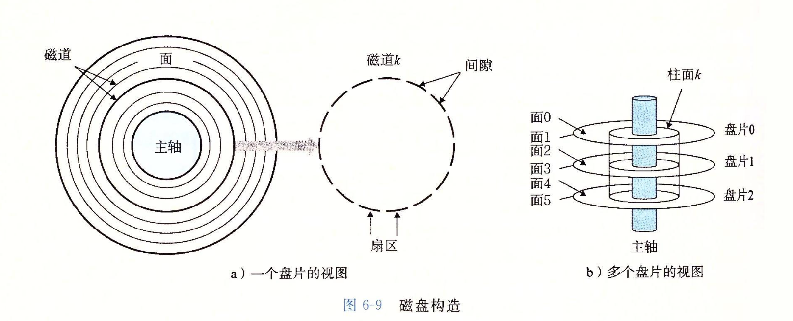

所以在次盘上读写的时候，需要移动`磁头`，让磁头找到对应的盘面，在找到磁道和扇区，然后才能读写数据，所以`顺序读写`比`随机读写`快的多。因为顺序的话磁头只需要移动一点点距离，而随机需要移动很长的距离。

### 固态硬盘

固态硬盘是基于`闪存`的存储技术，价格比机械硬盘贵一些。因为是闪存，所以顺序读写和随机读写都比机械硬盘快。虽然固态的顺序读写和随机读写的差距缩小了，但是顺序读写依旧比随机读写快。
- 块：整个闪存分成一个个块,一个块有32-128个页，块的大小为16KB-512KB
- 页：一个块有多个页组成，每次读写都是一个页，页的大小是512字节-4KB
- 闪存翻译层：连接IO总线和闪存数据，将数据放到IO总线里面，也将IO总线的数据放到闪存里面。

固态每次写入需要先擦除一个页里面原来的内容，在写入新的，因此，擦除次数多了以后，这个页就会坏掉。为了提升固态的使用寿命，一般也会控制每次擦除寿命更高的页。

### DRAM

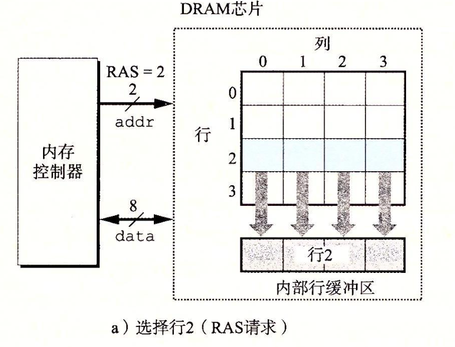

DRAM 也就是电脑内存，由下面几部分组成，价格比固态和机械硬盘贵的多，容量也小的多，现在大多数是16G内存。
- n * n的存储单元：真正存储数据的地方
- 行缓冲区：每次先将一行的数据取到缓冲区里面，在取对应的存储单元里面的数据。
- addr引脚：发送行号和列号给DRAM，发送行号以后，将这一行数据取到行缓冲区里面，再发送列号以后，返回对应的数据
- data引脚：传递数据

DRAM的发展历史，RAS:发送行号，CAS:发送列号
- 快页模式DRAM(Fast Page Mode DRAM, FPMDRAM)。传统的DRAM将存储单元的一整行复制到它的内部行缓冲区中， 使用一个 ，然后丢弃剩余的。FPM DRAM允许对同一行连续地访问可以直接从行缓冲区得到服务，从而改进了这一 点。例如，要从一个传统的DRAM的行i中读4个存储单元，内存控制器必须发送4 个RAS/CAS请求，即使是行地址i在每个情况中都是一样的。要从一个FPM DRAM的同一行中读取存储单元，内存控制器发送第一个RAS/CAS请求，后面跟三个CAS请求。初始的RAS/ CAS请求将行i复制到行缓冲区，并返回CAS寻址的那个存储单元。接下来三个存储单元直接从行缓冲区获得，因此返回得更快。
- 扩展数据输出 DRAM( Extended Data Out DRAM, EDO DRAM) . FPM DRAM 的一个增强的形式 ，它允许各个 CAS 信号在时间上靠得更紧密一点。
- 同步DRAM(Synchronous DRAM，SDRAM)。就它们与内存控制器通信使用一组显式的控制信号来说，常规的FPM 和EDO DRAM 都是异步的。SDRAM用与驱动内存控制器相同的外部时钟信号的上升沿来代替许多这样的控制信号。我们不会深人讨论细节， 最终效果就是SDRAM 能够比那些异步的存储器更快地输出它的超单元的内容。
- 双倍数据速率同步DRAM(Double Data-Rate SynchronousDRAM, DDR SDRAM)。 DDR SDRAM 是 对 SDRAM 的一种增强 ，它通过使用两个时钟沿作为控制信号，从而使DRAM的速度翻倍。不同类型的DDR SDRAM 是用提高有效带宽的很小的预取绥冲区的大小来划分的 : DDR (2位)、 DDR2 (4位)和 DDR (8位)。

现在一般的DDR5，DDR4，其实就是DDR DRAM内存。

### SRAM

SRAM 也就是电脑CPU的L1,L2,L3三级缓存使用的，价格比DRAM更贵，容量更小。通常是多少KB或MB。

SRAM将每个位存储在一个双稳态的(bistable)存储器单元里。每个单元是用一个六晶体管电路来实现的。这个电路有这样一个属性，它可以无限期地保持在两个不同的电压 配置(configuration )或状态(state) 之一。其他任何状态都是不稳定的一一从不稳定状态开始，电路会迅速地转移到两个稳定状态中的一个。

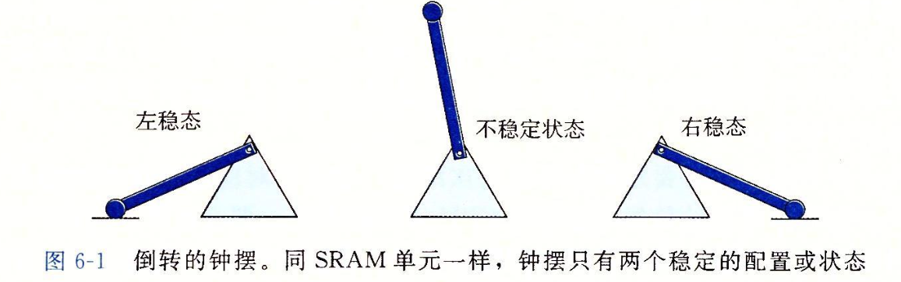

## 局部性(locality)

局部性分为`空间局部性(spatial locality)`和`时间局部性(temporal locality)`。

从上面也能看出，DRAM一次加载一行到行缓冲区，如果我们要的数据都在这一行，取的时候就会很快。这就是`空间局部性`。

比如数组的顺序访问。这个时候一个个接着访问的，就具有空间局部性。

```c
a[100] = {0,0,0,...} 
for(int i = 0; i < 100; i++) {
    printf("ai:%d",a[i]);
}
```

二维数组是一样的，需要按照行来访问。而不能按照列。

```c
a[100][100] = {{0,0,0,...},{0,0,0,...},...} 
for(int i = 0; i < 100; i++) {
    for(int j = 0; j < 100; j++) {
        printf("aij:%d",a[i][j]);
    }
}

// 按照列访问，不具有局部性，应该使用上面那种方式
for(int i = 0; i < 100; i++) {
    for(int j = 0; j < 100; j++) {
        printf("aij:%d",a[j][i]);
    }
}
```

三维数组,也应该使用行访问。
{
    {
        {0,0,0,...}, // 000, 001, 002, 003
        {0,0,0,...}, // 010, 011, 012, 013
        {0,0,0,...},
        {0,0,0,...}
    },
    {
        {0,0,0,...}, // 100, 101, 102, 103
        {0,0,0,...}, // 110, 111, 112, 113
        {0,0,0,...},
        {0,0,0,...}
    },
    {
        {0,0,0,...},
        {0,0,0,...},
        {0,0,0,...},
        {0,0,0,...}
    },...
} 
```c
a[100][100] = {{{0,0,0,...},{0,0,0,...},{0,0,0,...},...},{{0,0,0,...},{0,0,0,...},{0,0,0,...},...},...} 
for(int i = 0; i < 100; i++) {
    for(int j = 0; j < 100; j++) {
        for (int k = 0; k < 100; k++) {
            printf("aijk:%d",a[i][j][k]);
        }      
    }
}
```

使用最近使用过的数据，就是`时间局部性`。这是因为缓存的原因，比如最近使用过的数据还在L1缓存中，就会比再去DRAM中取数据要快。

sum就有 时间局部性，一直在使用。
```c
a[100] = {0,0,0,...} 
int sum = 0;
for(int i = 0; i < 100; i++) {
    sum += a[i];
    printf("ai:%d",a[i]);
}
```

## 存储器层次结构

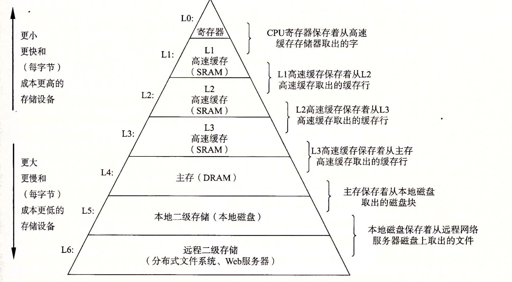

通常，高层的可以作为低层的缓存，比如L1缓存L2的数据，L2缓存L3的，L3缓存内存的。数据以块为大小传输。

- 缓存命中(cache hit)：要查找的内容就在L1缓存中，就不需要去L2查找了
- 缓存不命中(cache miss): 要查找的内容不在L1中，而在L2中，需要从L2传输到L1中。
    - 强制性不命中(compulsory miss): 在第一次访问缓存的时候，缓存中肯定是空的。这个时候肯定不会命中。
    - 冲突不命中(conflict miss): 缓存已经满了以后需要进行替换，比如LRU算法，比如取余算法，这个时候有可能你需要的缓存被替换出去了，因为这个原因不命中的，就是冲突不命中。
    - 容量不命中(capacity miss): 因为缓存不够大而没有命中的。

## 高速缓存存储器

像L1,L2这种SRAM，就是`高速缓存存储器`。

假设每个存储器地址有m位，形成$M = 2^m$个不同的地址。它由 $S = 2^s$ 个set组成。每个set里面有 $E = 2^e $ 个缓存行。每个行有 $B = 2^b$字节的数据块组成。高速缓存的大小$C = S * E * B$(不包括Tag和Valid)

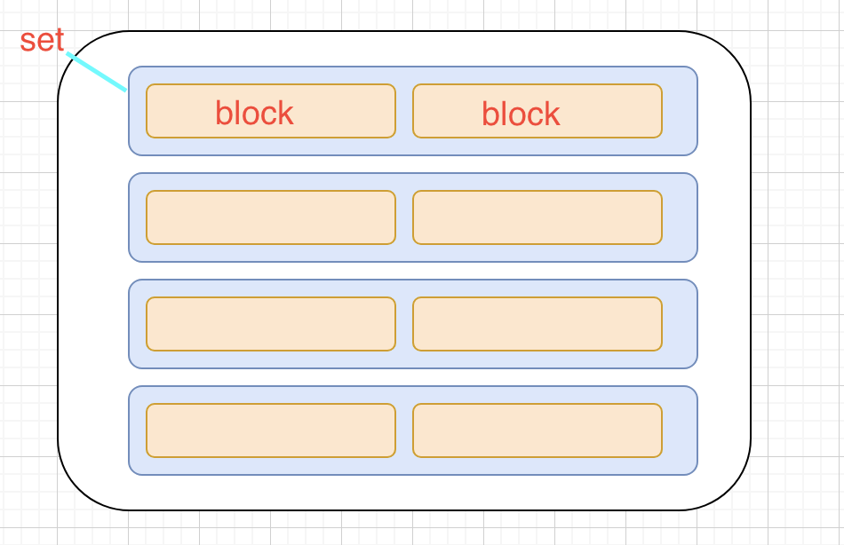

每个数据块有
- Valid: 1bit，0表示无效缓存，1表示有效缓存
- Tag: t个bit，一些标记 t = m - (b + s)
- Data: 真正的数据，有$B = 2^b$字节

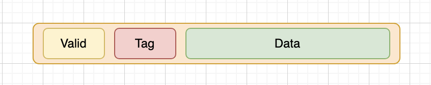

m个地址位的组成：
- t个bit:Tag，用来匹配高速缓存中的Tag，如果匹配上了说明缓存命中。
- s个bit:set index,用来找到对应的数据在哪个set里面。
- b个bit:block offset,用来找到具体数据在block的哪个位置里面。


### 读取

假设 m = 6,s = 2,t = 1, b = 3, e = 1, 则 S = 4个set,E = 2个行，B = 8字节。大小C =4 * 2 * 8 = 64。

假设 当前m = 000001, 那么 tag = 0, bit set = 00, block offset = 001。

缓存命中的情况。总共4个set，找到第0个set，然后找到其中tag是0并且valid是1的一个block，找到以后，找 001位置的数据，然后返回就可以了。

```
    valid   tag     data
00   1       0      ...    // 首先找到set 00 的这个set,有两行，这一行
00   0       0      ...    // 还有这一行
01   0       0      ...
01   0       0      ...
10   1       0      ...
10   1       0      ...
11   0       0      ...
11   0       0      ...

```

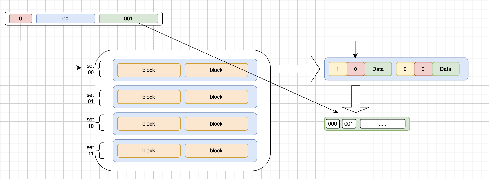

缓存不命中的情况。总共4个set，找到第2个set，然后找到其中tag是0并且valid是1的，这个时候发现没有匹配的，那么触发miss，开始去下一层获取数据，获取到数据以后，通过替换算法替换掉一个行，将tag修改为0并且valid修改为1，然后把数据写入block data。再返回001位置的数据。

```
    valid   tag     data
00   1       0      ...    
00   0       0      ...    
01   0       0      ...    // 首先找到set 01 的这个set,有两行，这一行
01   0       0      ...    // 还有这一行
10   1       0      ...
10   1       0      ...
11   0       0      ...
11   0       0      ...

```

冲突不命中，比如计算两个数组的点积。这个时候a[0] * b[0],会先把数组a加载到L1缓存，然后再把b加载到L1缓存，这个时候b会把a覆盖，然后a[1] * b[1]的时候，a就会冲突不命中，然后用a把b覆盖，一直重复这个动作。这个时候可以增加E,比如一个set里面有多个block，这样就不会覆盖了。

```c
float dotProd(float a[100], float b[100]) {
    float sum = 0.0;
    int i;
    for (i = 0; i < 100; i++) {
        sum += a[i] * b[i];
    }
    return sum;
}

```

### 写入


在写入的时候有两种情况，缓存命中和不命中，通常的搭配是`write through + no write allocate`和`write back + write allocate`
- 缓存命中
    - wirte through: 这个时候直接写入缓存。并且修改下一层的数据。相当于同步修改。
    - write back: 直接写入缓存，并且标记dirty, 尽可能的推迟更新下一层的数据，只有当替换算法执行的时候才更新。相当于异步修改。
- 缓存不命中
    - write allocate: 先把数据从下一层加载到缓存，然后更新缓存数据。
    - no write allocate: 直接写入下一层数据。


# 链接

c文件变成可执行文件的过程
- c预处理器cpp生成ASCII码的.i文件, cpp main.c main.i
- c编译器cc1生成ASCII汇编语言.s文件, cc1 main.i -Og -o main.s
- 汇编器as生成可重定位目标文件.o文件， as -o main.o main.s 
- 链接器ld生成可执行文件, ld -o main main.o

为了构造可执行文件，链接器必须完成两个主要任务
1. 符号解析。目标文件定义和引用符号，每个符号对应于一个函数 、一个全局变量或一个静态变量 (即C语言中任何以 static 属性声明的变量)。 符号解析的目的是将每个符号引用正好和一个符号定义关联起来
2. 重定位。编译器和汇编器生成从地址。开始的代码和数据节。链接器通 过把每个符号定义与 一个内存位置关联起来，从而重定位这些节，然后修改所有对 这些符号的引用，使得它们指向这个内存位置。链接器使用汇编器产生的重定位条 目(relocation entry)的详细指令，不加甄别地执行这样的重定位。

目标文件有三种形式
- 可重定位目标文件。包含二进制和代码数据，可与其他重定位目标文件合并起来变成可执行目标文件。
- 可执行目标文件。包含二进制和代码数据，可被直接复制到内存并执行。
- 共享目标文件。一种特殊类型的可重定位目标文件，可在加载或运行时被动态的加载进内存并链接。


`ELF(x86-64的Linux系统的文件)可重定位目标文件`的格式
- ELF头。
- .text。已编译程序机器代码
- .rodata。只读数据，比如printf语句中的格式串
- .data。已初始化的全局和静态变量。
- .bss。未初始化的全局和静态变量，以及所有初始化为0的全局和静态变量。不占据实际空间，仅仅是一个占位符。
- .symtab。一个符号表，用来存放 在程序中定义和引用的函数和全局变量的信息。
- .rel.text。一个.text节中位置的列表，当链接器把这个目标文件和其他文件组合时，需要修改这些位置。一般而言，任何调用外部函数或者引用全局变量的指令都需要修 改。另 一方面，调用本地函数的指令则不需要修改
- .rel.data。被模块引用或定义的所有全局变量的重定位信息。
- .debug。一个调试符号表，其条目是程序中定义的局部变量和类型定义，程序中定 义和引用的全局变量，以及原始的C源文件。只有以 -g选项调用编译器驱动程序时，才会得到这个表
- .line。原始C源程序中的行号和.text 节中机器指令之间的映射。只有以-g选项调 用编译器驱动程序时，才会得到这张表
- .strtab。一个字符串表，包括.symtab和.debug中的符号表，以及节头 部中的节名字。字符串表就是以nu 11 结尾的字符串的序列。


每个可重定位目标模块m都有一个符号表，它包含m定义和引用的符号的信息。在链接器的上下文中，有三种不同的符号:
- 由模块m定义的并能被其他模块引用的全局符号。对应非静态的C函数和全局变量。
- 由其他模块定义的并被m引用的全局符号。对应其他模块的非静态的C函数和全局变量。
- 由模块m定义和引用的局部符号。对应于静态的C函数和全局变量。

C++ 和Java 都允许重载方法，这些方法在源代码中有相同的名字，却有不同的参数 列表。那么链接器是如何区别这些不同的重载函数之间的差异呢?C++ 和Java 中能使用 重载函数，是因为编译器将每个唯一的方法和参数列表组合编码成一个对链接器来说唯一 的名字。这种编码过程叫做重整(mangling)，而相反的过程叫做恢复(demangling)。 幸运的是，C++ 和Java使用兼容的重整策略。一个被重整的类名字是由名字中字符 的整数数量，后面跟原始名字组成的。比如，类Foo 被编码成3Foo。方法被编码为原始方法名， 后面加上 __ ， 加上被重整的类名， 再加上每个参数的单字母编码。 比如，Foo::bar (int, long)被编码为bar__3Fooil。重整全局变量和模板名字的策略是相似的。

链接器对多个文件中同名变量或函数的处理。编译器会先分`强符号`和`弱符号`,强符号指函数和已初始化的全局变量，弱符号指未初始化的全局变量。
1. 不允许有多个同名的强符号
2. 如果有一个强符号和多个弱符号同名，那么选择强符号。
3. 如果有多个弱符号同名，那么从这些弱符号中任意选择一个。

上面说的链接器接受一组`可重定位文件`，并生成一个`可执行文件`，所有的编译系统都提供一种机制，将所有相关的目标模块打包成为一个单独的文件，称为`静态库`。它也可以用作链接器的输入。当构造可执行文件的时候，直接复制静态库里面被应用程序引用的目标模块。静态库是`.a`文件。


`可执行目标文件`的格式
- ELF头。
- `段头部表`
- `.init`。定义了一个函_init，程序的初始化代码会调用它
- .text。已编译程序机器代码
- .rodata。只读数据，比如printf语句中的格式串
- .data。已初始化的全局和静态变量。
- .bss。未初始化的全局和静态变量，以及所有初始化为0的全局和静态变量。不占据实际空间，仅仅是一个占位符。
- .symtab。一个符号表，用来存放 在程序中定义和引用的函数和全局变量的信息。
- .debug。一个调试符号表，其条目是程序中定义的局部变量和类型定义，程序中定 义和引用的全局变量，以及原始的C源文件。只有以 -g选项调用编译器驱动程序时，才会得到这个表
- .line。原始C源程序中的行号和.text 节中机器指令之间的映射。只有以-g选项调 用编译器驱动程序时，才会得到这张表
- .strtab。一个字符串表，包括.symtab和.debug中的符号表，以及节头 部中的节名字。字符串表就是以nu 11 结尾的字符串的序列。

`动态库`也叫`共享库`是致力于解决静态库缺陷的一个现代创新产物。共享库是一个 目标模块，在运行或加载时，可以加载到任意的内存地址，并和一个在内存中的程序链接起来。在linux中常用`.so`后缀来表示。 微软的操作系统大量地使用了共享库，它们称为DLL(动态链接库)

共享库是以两种不同的方式来`共享`的。首先，在任何给定的文件系统中 ，对于一个库只有一个 `.so` 文件 。 所有引用该库的可执行目标文件共享这个.so文 件中的代码和数据 ，而不是像静态库的内容那样被复制和嵌入到引用它们的可执行的文件中

 `共享库和Java本地接口` Java定义了一个标准调用规则，叫做Java本地接口(Java Native Interface, JNI)，它允许Java程序调用“本地的” C和C++ 函数。JNI的基本思想是将本地C函数(如Foo)编译 到一个共享库中 (如 Foo.so )。 当一个正在运行的Java 程序试图调用函数 Foo 时 ，Java解释器 利用dlopen 接口 (或者与其类似的接口)动态链接和加载 Foo.so，然后再调用Foo。

在 Linux 系统中有大量可用的工具可以帮助你理解和处理目标文件。特别地，GNU binutils 包尤其有帮助，而且可以运行在每个Linux 平台上。
- AR:创建静态库，插人、删除、列出和提取成员。
- STRINGS:列出一个目标文件中所有可打印的字符串。
- STRIP:从目标文件中删除符号表信息。
- NM:列出一个目标文件的符号表中定义的符号。
- SIZE:列出目标文件中节的名字和大小。
- READELF:显示 一个目标文件的完整结构，包括ELF 头中编码的所有信息。包含 SIZE 和NM的功能。
- OBJDUMP:所有二进制工具之母。能够显示 一个目标文件中所有的信息。它最大的作用是反汇编.text节中的二进制指令。

Linux 系统为操作共享库还提供了LDD程序:
- LDD:列出一个可执行文件在运行时所需要的共享库。


# 异常控制流

`异常控制流（ExceptionalControlFlow, ECF）`使程序能进行跳转，正常的程序执行都是PC里面一条条指令顺序执行的。ECF使PC里面的下一条指令变成别的指令，从而完成别的功能。ECF在系统的各个层次，比如进程切换，操作系统调用，网络请求处理，IO请求处理，是计算机中实现并发的基本机制。

## 异常

异常是异常控制流的一种形式，它 一部分由硬件实现，一部分由操作系统实现。

假设当前程序正在运行，出现了`缺页异常`，也就是数据在内存中不存在，需要进行IO请求将数据加载到内存中。执行图如下，异常处理程序有很多，每个异常都有对应的处理程序，当异常发生以后，系统切换到异常处理程序中执行。异常处理完成以后返回用户程序继续执行。

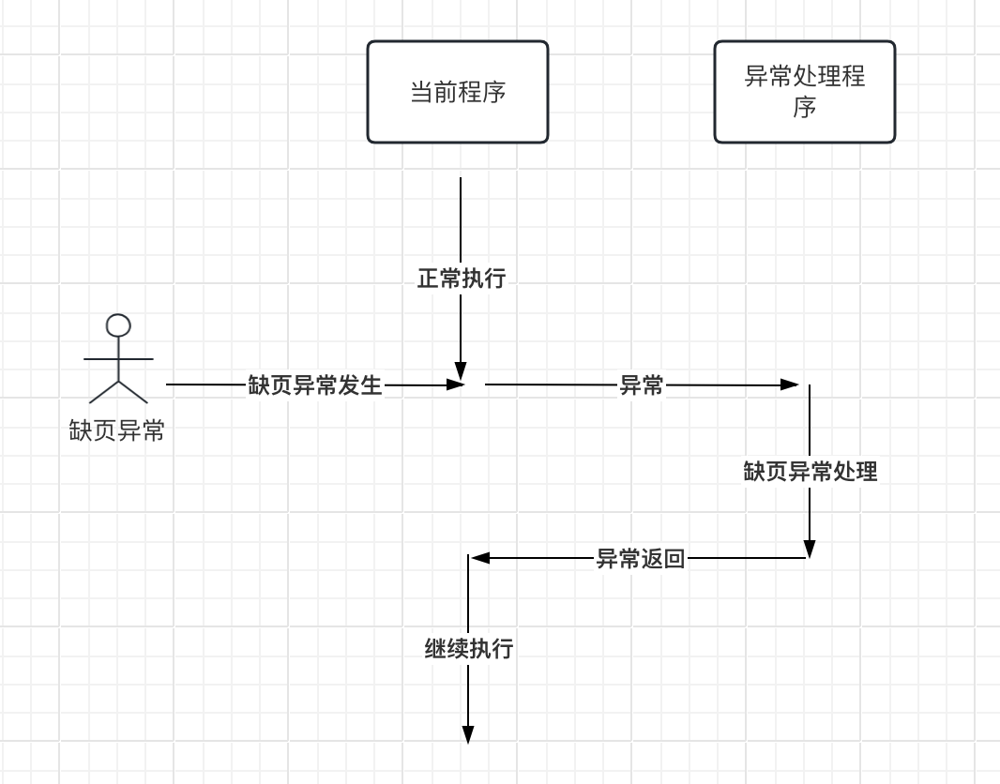

根据异常的不同，返回会发生三种情况：
- 异常处理程序将控制返回给当前用户程序正在执行的指令
- 异常处理程序将控制返回给当前用户程序的下一个指令
- 异常处理程序终止当前用户程序

> 这里说的都是`硬件异常`，和Java中try catch的`软件异常`是不一样的。

系统中可能的每种类型的异常都分配了一个唯 一的非负整数的`异常号`。有的异常号是处理器的设计者分配的，有的是操作系统的设计者分配的。前者包括被零除，缺页，断点，算术运算溢出，后者包括系统调用和外部IO设备的信号。

在系统启动时，操作系统会分配一个`异常表`。异常表的key就是异常号，value是异常处理程序的地址。当发生异常的时候，通过异常号找到异常处理地址，然后进行处理。异常表的首地址则放在`异常表基址寄存器`里面。硬件触发异常以后，就由`异常处理程序`软件进行执行了，执行在内核模式下。

异常可以分为4类，中断(interrupt),陷阱(trap)，故障(fault)和终止(abort)

| 类别 | 原因 | 异步/同步 | 返回 |
|:-----|:-----|:-----|:-----|
| 中断 | 来自I/O 设备的信号| 异步 | 总是返回到下一条指令 |
| 陷阱 | 有意的异常| 同步 | 总是返回到下一条指令 |
| 故障 | 潜在可恢复的错误| 同步 | 可能返回到当前指令 |
| 终止 | 不 可恢复的错误| 同步 | 不返回，直接终止程序|

中断是异步发生的，中断发生的时候拉起中断引脚。处理器发现中断引脚被拉起，就从系统总线读取异常号，然后执行对应的异常处理程序。执行完成以后继续返回执行下一条指令。

陷阱是有意的异常，最重要的作用是触发`系统调用`，正常用户程序都是运行在`用户模式`下，可以执行的功能有限，如果需要读取文件，创建进程等操作，就需要切换到`内核模式`下，由操作系统内核来进行处理。通过系统调用就可以切换到内核执行。

故障由错误情况引起，它可能能够被故障处理程序修正。比如`缺页异常`就是一个故障。当发生以后，故障处理程序进行处理，从磁盘加载数据，加载以后重新执行当前指令，就会成功了。如果故障没有被修正，那么就会转为abort，终止当前程序。

终止是不可恢复的致命错误造成的结果，通常是一些硬件错误。

x86-64系统定义了多达256种不同的异常类型，0-31号是由Inter架构师定义的，因此所有x86-64系统的电脑都是一样的。32-255对应的是操作系统定义的中断和陷阱。

下面是一些系统调用：

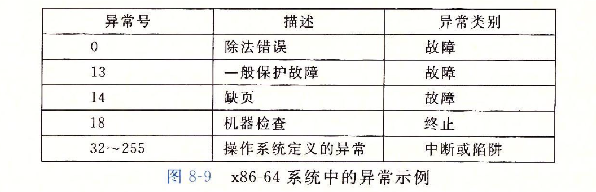
 

## 进程

`进程`的经典定义就是一个执行中程序的实例。系统中的每个程序都运行在某个`进程的上下文`(context)中。上下文是由程序正确运行所需的状态组成的。这个状态包括存放在内存中的程序的代码和数据，它的栈、通用目的寄存器的内容、程序计数器、环境变量以及打开文件描述符的集合.

进程提供给应用程序的关键抽象
- 一个独立的逻辑控制流，它提供一个假象，好像我们的程序独占处理器
- 一个私有地址空间，它提供一个假象，好像我们的程序独占内存


/proc文件系统将许多内核数据结构的内容输出为 一个用户程序可以读的文 本文件的层次结构。比如，你可以使用/proc 文件系统找出一般的系统属性，比如CPU类型 (/proc/cpuinfo)，或者某个特 的进程使用的内存段(/proc/<process-id>/maps)。2.6 版本的Linux内核引人/sys 文件系统，它输出关于系统总线和设备的额外的低层信息

操作系统内核使用一种称为上下文切换(context switch)的较高层形式的异常控制流来实现多任务。上下文包括通用目的寄存器、浮点寄存器、程序计数器、用户栈、状态寄存器、内核栈和各种内核数据结构，比如描述地址空间的页表、包含有关当前进程信息的进程表，以及包含进程已打开文件的信息的文件表。

在内核调度了一个新的进程运行后，它就抢占当前进程，并使用一种称为上下文切换的机制来将控制转移到新的进程。

上下文切换
- 保存当前进程的上下文
- 恢复要执行的进程的上下文
- 将控制传递给这个新恢复的进程

当Unix 系统级函数遇到错误时，它们通常会返回一1，并设置全局整数变量errno 来表示什么出错了.比如

```c
if ((pid = fork()) < 0) {
    // strerror函数返回一个文本串，描述了和某个errno值相关联的错误
    fprintf(stderr, "fork error: %s \n", strerror(errno));
    exit(0);
}
```

一些进程控制的系统调用C函数
- getpid(), 获取当前进程的pid
- getppid(), 获取当前进程的父进程的pid
- waitpid(), 等待子进程终止
- sleep(), 让程序休眠，时间到啦返回0，时间没到被其他信号中断则返回剩余秒数
- pause(), 让程序休眠直到收到信号
- execve(), 在当前进程的上下文中加载并运行一个新程序
- getpgrp(), 返回当前进程的进程组id
- signal(), 设置信号处理函数

从程序员的角度，可以认为进程总是处于下面三个状态之一
- 运行：进程正在CPU上执行
- 阻塞：进程被挂起，比如读取磁盘的时候
- 终止：进程结束了，收到终止信号，主程序执行完，调用exit函数

当一个子进程终止时，内核并不会立即清除它，进程会被保持为一种`已终止`的状态中，直到被父进程回收。这时候的子进程被称为`僵尸进程`。当父进程回收子进程后，内核将子进程的退出状态传递给父进程，然后清除子进程，这个时候子进程就不存在了。

如果一个父进程终止。它的子进程就被称为`孤儿进程`，内核会安排`init进程`成为它的孤儿进程的养父，init进程的pid为1，是在系统启动时由内核创建的，它是所有进程的祖先进程。如果父进程没有回收僵尸进程就死了，init进程会回收僵尸进程，不过长时间运行的程序比如shell或者服务器，总是应该回收它们的僵尸子进程，即使僵尸子进程没有运行，他们仍然消耗系统的内存资源。

一个进程可以通过`waitpid`函数来等待它的子进程终止或者停止。如果子进程已经终止，那么立即返回，如果子进程没有终止，挂起当前进程，等待子进程终止后返回，返回值为子进程的pid。此时，子进程已经被回收，内核会删除掉它的所有痕迹。

进程的执行顺序和回收顺序都是由操作系统内核通过异常控制流切换执行的，所以我们不能假设他们的执行顺序和回收顺序。


## 信号

`Linux信号`允许进程和内核中断其他进程。一个信号就是一条小消息，它通知进程系统中发生了一个某种类型的事件。每个信号类型都对应一个系统事件，底层的硬件异常由内核异常处理程序处理的，正常情况下，对用户进程是不可见的。

下图是一些信号

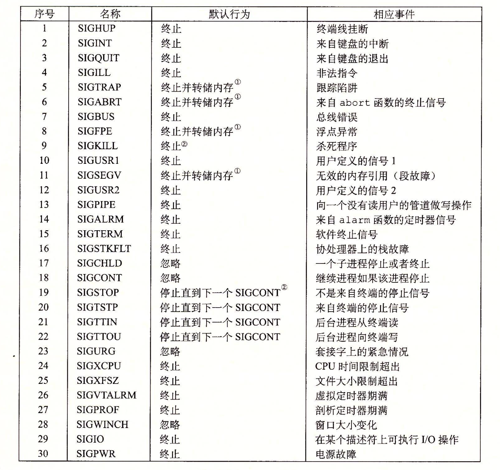

传送信号分为两部分
1. 发送信号。内核通过更新进程上下文中的某个状态，发送一个信号，可能有下面的原因
    - 内核检测到一个系统事件，比如除0或者子程序终止
    - 一个进程调用了kill函数，显式的发送一个信号
2. 接收信号。当进程被内核强迫以某种方式对信号作出反应时，就接收了信号。进程可以忽略这个信号，终止或者通过执行`信号处理程序`来处理信号。
3. 一个发出但没有被接收的信号叫做待处理信号。在任何时刻，一种类型至多只有一个待处理信号。

发送信号的几种方式
- kill程序，kill -9 pid
- kill函数，kill(pid, sig)
- alarm函数，给自己发送SIGALRM信号
- 键盘，ctrl+c会发送SIGINT信号，默认终止前台作业，ctrl+z会发送SIGTSTP信号，默认挂起前台作业。

前台作业和后台作业，系统只能有一个前台作业，但是可以有多个后台作业，前台作业就是通过waitpid等待程序在前台完成的，后台作业是运行在后台的，一般在命令最后面加上`&`就可以让程序后台运行。

接收信号的几种处理
1. 忽略该信号
2. 进程终止
3. 用户程序捕获信号并处理

可以通过`signal`函数来捕获信号并处理，第一个参数是信号，第二个参数是处理函数，如果处理函数是`SIG_IGN`，则忽略该信号，如果是`SIG_DFL`，则采用信号的默认行为处理，如果是一个函数，则执行他进行处理。


`待处理的信号只能有一个`。再过来一个同类型的信号就会被丢弃，实际上处理方式是有一个`Pending`的位，如果有6个信号，Pending就有6位，一个信号对应一位，当有一个待处理信号的时候，相应的位就变成1，所以最多只有一个待处理，剩下的会被丢弃。所以我们不能假设所有的信号都能被接收并且处理。

为了解决上面的问题，就出现了`阻塞信号`。通过阻塞信号可以暂时阻塞住信号，不接收它，等我们把待处理信号处理了再`解除阻塞`然后接受它，这样的话就可以接收到每一个信号并处理了，同样的阻塞信号是通过`Blocked`位来实现的，有6个信号那么Blocked就有6位，阻塞一个信号，对应的位就变成1.

可以通过`sigprocmask`函数来设置Blocked位，他有三个参数，第一个参数决定了行为，第二个参数是一个set变量用来设置Blocked位，第三个参数是返回一个oldset变量来存储以前的Blocked位，当解除阻塞以后用来恢复Bloked位的。

第一个参数值
- SIG_BLOCK: 把set中的位添加到Bloked中，相当于Blocked = Blokced | set
- SIG_UNBLOCK: 从Blocked中删除set中的位，相当于 Blocked = Blocked & ~set
- SIG_SETMASK: Blocked = set

使用下面的函数可以操作set变量中的位。
- sigemptyset。初始化set为空集合
- sigfillset. 把每个信号都添加到set中
- sigaddset. 添加某个信号到set中
- sigdelset. 从set中删除某个信号
- sigismember. 判断某个信号是否在set中。


信号处理程序的编写很麻烦，因为它和其他信号处理程序以及主程序都是并发执行的。为了保证安全，要尽可能的保守，以下是一些基本原则。
- 处理程序要尽可能简单。避免麻烦的最好方法是保持处理程序尽可能小和简 单。例如，处理程序可能只是简单地设置全局标志并立即返回;所有与接收信号相 关的处理都由主程序执行，它周期性地检查(并重置)这个标志
- 在处理程序中只调用异步信号安全的函数。所谓异步信号安全的函数(或简称安全的函 数)能够被信号处理程序安全地调用，原因有二:要么它是可重入的， 要么它不能被信号处理程序中断.
- 信号处理程序中产生输出唯一安全的方法是使用 write 函数
- 保存和恢复errno。许多Linux异步信号安全的函数都会在出错返回时设置 errno 。
- 阻塞所有的信号，保护对共享全局数据结构的访问
- 用 volatile 声明全局变量 。 
- 用 `sig_atomic_t` 声明标志。在常见的处理程序设计中，处理程序会写全局标 志来记录收到了信号。主程序周期性地读这个标志，响应信号，再清除该标志。对于通过这种方式来共享的标志 ， C 提供一种整型数据类型 sig_atomic_t， 对它的读和写保证会是原子的(不可中断的)，因为可以用一条指令来实现它们

## 非本地跳转

当程序返回的时候一般都是通过调用栈一层层返回，有的时候会很麻烦，为了避免这种情况，出现了`非本地跳转`，它通过`setjmp`和`longjmp`来进行直接跳转，避免了一层层返回。

setjmp保存当前的运行环境，longjmp可以跳回setjmp的地方。

C++和Java 提供的异常机制是较高层次的，是C语言的setjmp和longjmp 函数的更加结构化的版本。你可以把try语句中的catch 子句看做类似于setjmp函数。相似地，throw语句就类似于longjmp 函数。

# 系统级IO

在Linux中，`所有的一切都是文件`。所以文件读取可以控制一切，包括磁盘读写，网络编程都是通过文件IO来控制的。一个Linux文件就是一个m个字节的序列。

Unix IO接口提供了对文件的控制
- 打开文件。返回一个`文件描述符`
- 读取文件。读操作就是将文件内容复制到内存中。
- 写文件。写操作就是将内存中的内容写入到文件中。
- 改变当前的文件读写指针位置。打开文件的时候，初始为0.
- 关闭文件。关闭这个文件。

Linux shell创建的每个进程开始时都有三个打开的文件:标准输入(描述符为0)、标准输出(描述符为1)和标准错误(描述符为2)

每个文件都有一个类型
- 普通文件：包含任意数据，操作系统并不区分文本文件和二进制文件，在更高层的级别有的会区分
    - 文本文件： 只含有ASCII和 Unicode 字符的普通文件。
    - 二进制文件： 所有其他的普通文件，对于内核来说，二进制和文本文件没有区别。
- 目录：包含一组链接的文件，其中每个链接都将一个文件名映射到一个文件，这个文件也可能是另一个目录，每个目录至少含有两个条目
    - .是该目录自身的链接
    - ..是父目录的链接
- socket：是用来与另一个进程进行跨网络通信的文件

Linux将所有文件都组织成一个目录结构，最上面是`/`根目录，其他所有目录都是它的子级。

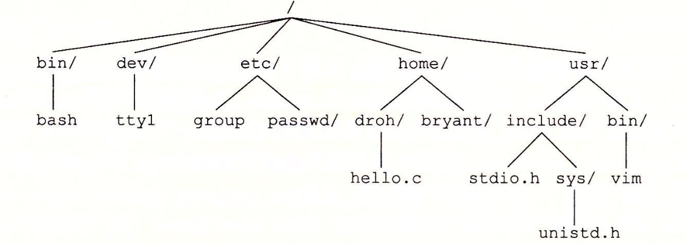

打开文件以后返回的文件描述符总是在进程中当前没有打开的最小描述符。通过系统的`limit`命令可以看到当前系统可以同时打开的文件数量。

Unix对文件的读取和写入操作可能会遇到`不足值(short count)`的问题。比如你要读取一个文件的前100个字节，但是这个文件每行50个字节，所以51个字节就是`换行符EOL`，换行符在Linux/mac里面是`LF`,在win里面是`CRLF`。当遇到换行的时候只会读入换行前的50个字节，然后读取换行的时候会读取0个字节，再之后才能读取下一行。下面是几种会遇到不足值的情况。
- 读的时候遇到换行
- 从终端读文本。从终端读取的话，read一次读取一行
- 读写socket

###  RIO包

RIO包解决了不足值的问题，它提供了两类函数
- 无缓冲输入输出：没有应用级缓冲，对二进制数据读写到网络和从网络读写二进制数据尤其有用
- 有缓冲输入输出：先读取或写入到缓冲区里面，在调用系统的read/write来读写。效率更高，开销小，RIO还是线程安全的。

无缓冲输入输出
- rio_readn(int fd, void * usrbuf, size_t n):从fd文件描述符中读取n个字节到内存usrbuf中
- rio_writen(int fd, void * usrbuf, size_t n):从内存usrbuf中写入n个字节到fd中

```c
ssize_t rio_readn(int fd, void *usbuf, size_t n) {
    size_t nleft = n;
    ssize_t nread;
    char *bufp =usrbuf;

    // 没读取够需要的n个字节就一直循环读取
    while (nleft > 0) {
        // 从fd中读取nleft个字节到内存bufp中 
        if ((nread = read(fd, bufp, nleft)) ‹ 0)  {
            // 如果读取失败 判断失败类型如果是被信号打断则再次读取，如果是其他失败，则返回失败
            if (errno = EINTR) /* Interrupted by sig handler return */
                nread =0; /*andcall read()again*/
            else
                return -1; /* errno set by read() */
        } else if (nread = 0)
            // 如果是读取到0个，则是读取到换行符，继续读取
            break; /* EOF */
        // 读取的字节数变少，bufp增加
        nleft -= nread;
        bufp += nread;
    }
    // 返回读取到的字节数
    return n - nleft; /* Return >= 0 */
}
```

```c
ssize_t rio_writen(int fd, void *usrbuf, size_t n)
{
    size_t nleft =n;
    ssize_t nwritten;
    char *bufp =usrbuf;
    while (nleft >0) {

        if ((nwritten =write(fd, bufp, nleft)) « 0) {

            if (errno = EINTR) /* Interrupted by sig handler return */ 
                written = 0; /* and call write() again */
            else
                return -1; /* errno set by write() */
        }
        nleft -= nwritten;
        bufp += nwritten;
    }
    return n;
}
```

有缓冲输入输出
- rio_readinitb(rio_t *rp, int fd): 初始化一个读取的缓冲区rp，读取的时候会先从fd文件中读取数据到rp缓冲区里面，然后在从缓冲区读取
- rio_readlineb(rio_t *rp, void *usrbuf, size_t maxlen): 从缓冲区rp中读取一个文本行到内存usrbuf中，最多maxlen-1个字节，最后以NULL结尾。如果一行不足maxlen-1，则读取一整行，如果超过maxlen-1，就截断他
- rio_readnb(rio_t *rp, void *usrbuf, size_t n): 对于既包含文本行也包含二进制数据的读取可以使用这个函数，它是rio_readn带缓冲区的版本。

下面是缓冲区`rio_t`结构体
```c
typedef struct {
    int rio_fd; /* 文件描述符fd */ 
    int rio_cnt; /* 缓冲区未读取的字节数 */ 
    char *rio_bufptr; /* 下一个要读取的指针 */ 
    char rio_buf [RIO_BUFSIZE]; /* 缓冲区 */
} rio_t;
```

```c
void rio_readinitb(rio_t *rp, int fd) {
    rp->rio_fd =fd;
    rp->rio_cnt = 0;
    rp->rio_bufptr = rp->rio_buf;
}
```

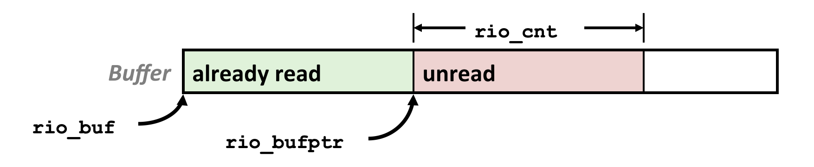

读取最核心的是`rio_read`函数

```c
static ssize_t rio_read(rio_t *rp , char *usrbuf, size_t n) {
    int cnt;

    // 开始读取数据到缓冲区rp
    while (rp->rio_cnt <= 0) { /* Refill if buf is empty */
        // 调用 read读取
        rp->rio_cnt = read(rp->rio_fd, rp->rio_buf, sizeof(rp->rio_buf));
        // 判断是否读取失败
        if (rp->rio_cnt < 0) {
            // 如果不是被信号打断，就是真的失败，返回-1 如果是被打断的话回到while继续读取
            if (errno != EINTR)
                return -1;
        } else if (rp->rio_cnt == 0) {
            // 读取到换行符，继续读取
            return 0;
        } else {
            // 读取成功 缓冲区指针指向缓冲区开头
            rp->rio_bufptr = rp->rio_buf; /* Reset buffer ptr */
        }
    }

    // 开始冲缓冲区读取数据到usrbuf
    /* Copy min(n, rp-›rio_cnt) bytes from internal buf to user buf */
    // 默认读取n个字节，如果缓冲区不足n个，就读取整个缓冲区
    cnt = n;
    if (rp->rio_cnt < n) {
        cnt = rp->rio_cnt;
    }
    // 从缓冲区读取到usrbuf
    memcpy(usrbuf, rp->rio_bufptr, cnt);
    // 修改缓冲区指针
    rp->rio_bufptr += cnt;
    // 修改缓冲区未读字节数量
    rp->rio_cnt -= cnt;
    // 返回读取的字节数
    return cnt;
}
```

rio_readlineb和rio_readnb都是用了rio_read函数
```c
ssize_t rio_readlineb(rio_t *rp, void *usrbuf, size_t maxlen) {
    int n,rc;
    char c, *bufp = usrbuf;

    // 循环从缓冲区读取
    for (n = 1; n < maxlen; n++) {
        // 从缓冲区读取1个字节到c里面 如果rc == 1则读取成功
        if ((rc = rio_read(rp, &c, 1)) == 1) {
            // 读取成功把读取到的字节放到bufp指向的usrbuf位置 然后bufp指向下一个usrbuf字节
            *bufp++ = c;
            // 如果读取到的是换行 n++再次读取
            if (c == '\n') {
                n++;
                break;
            }
        } else if (rc == 0) {
            // 读取EOF
            if (n == 1)
                return 0;
            else
                break;
        } else {
            // 出错，返回-1表示错误
            return -1;
        }
    }
    // 读取结束以后重制bufp指针
    *bufp = 0;
    // 返回 读取字节数
    return n - 1;
}
```


和上面的rio_readn唯一的区别就是read换成了rio_read，因此里面也不需要在判断是否被信号打断了，因为rio_read已经判断了。
```c
ssize_t rio_readnb(rio_t *rp, void *usrbuf, size_t n) {
    size_t nleft = n;
    ssize_t nread;
    char *bufp =usrbuf;

    // 没读取够需要的n个字节就一直循环读取
    while (nleft > 0) {
        // 从fd中读取nleft个字节到内存bufp中 
        if ((nread = rio_read(fd, bufp, nleft)) ‹ 0)  {
            return -1; /* errno set by read() */
        } else if (nread = 0)
            // 如果是读取到0个，则是读取到换行符，继续读取
            break; /* EOF */
        // 读取的字节数变少，bufp增加
        nleft -= nread;
        bufp += nread;
    }
    // 返回读取到的字节数
    return n - nleft; /* Return >= 0 */
}
```

### 文件元数据

有两个函数可以获取文件元数据
- stat(const char *filename, struct stat *buf): 第一个参数是文件名，第二个参数是文件元数据的结构体。
- fstat(int fd, struct stat *buf): 第一个参数是文件描述符，第二个参数是文件元数据的结构体。

文件元数据结构体

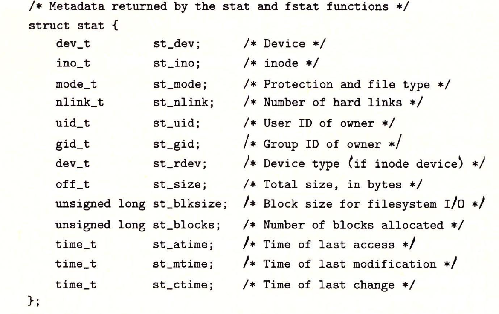

### 共享文件和文件重定向

内核用三个数据结构来表示打开的文件
- 描述符表(descriptor table): 每个进程都有独立的`描述符表`，里面每个表项是一个指针，指向一个打开文件表，每个进程一开始的描述符表都有三个指针，指向stdin,stdout,stderr
- 打开文件表(open file table): 所有进程共享的`打开文件表`，记录了所有打开的文件，记录了当前的文件位置，引用计数，指向v-node表的指针。调用`close`关闭文件会减少`引用计数`，当达到0,内核才会删除这个表项。
- v-node表(v-node table)：所有进程共享`v-node表`，记录了stat结构中的大部分信息

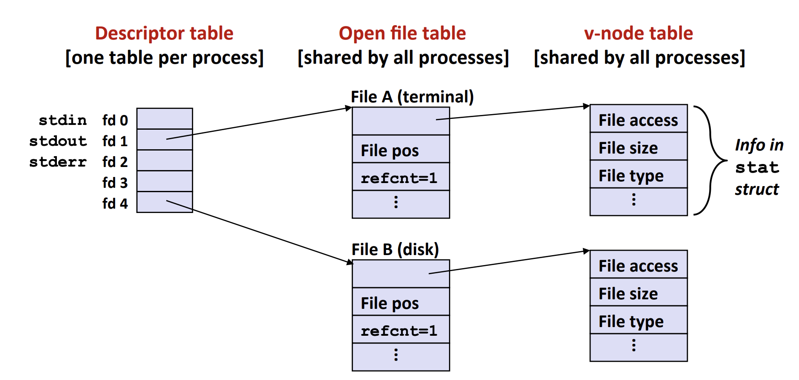

```
注意：当fork的时候，子进程会继承父进程的描述符表，打开文件表的引用计数会+1，这个时候想彻底关闭文件，需要两个进程都close才行。
```

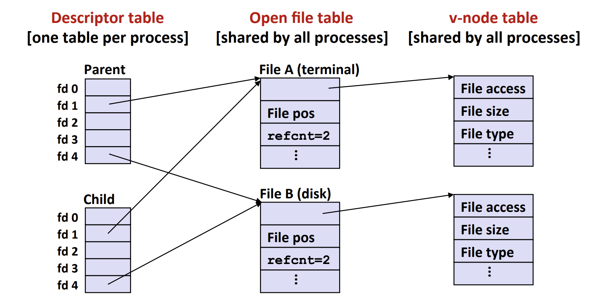

可以使用`dup2`函数来实现`IO重定向`，也就是Linux里面的`>`功能，在linux中，`cat a.c > b.c`可以把cat a.c的输出内容重定向输入到b.c文件中。
- dup2(int oldfd, int newfd): 复制描述符表oldfd到newfd，覆盖newfd以前的内容，如果newfd已经打开，会先关闭它再复制。

执行`dup2(4,1)`的意思是复制描述符fd4的内容给fd1,覆盖fd1原来的内容，假设原来fd1指向标准输出，复制以后fd1的输出将不再输出到标准输出，而是输出到fd4指向的打开文件里面。也就是将fd1的输出重定向到了fd4

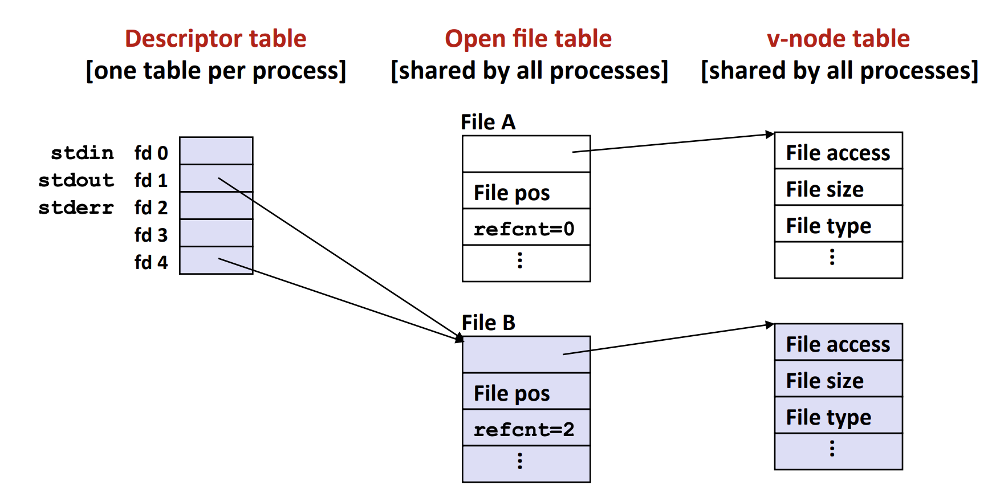

> C程序还提供了标准IO库，和RIO一样对Unix IO进行了封装，不过标准IO不适合网络读写，所以网络读写应该使用RIO，其他情况都应该使用标准IO。


# 虚拟内存

`MMU（Memory Management Unit）`来进行虚拟地址到物理地址的转化。

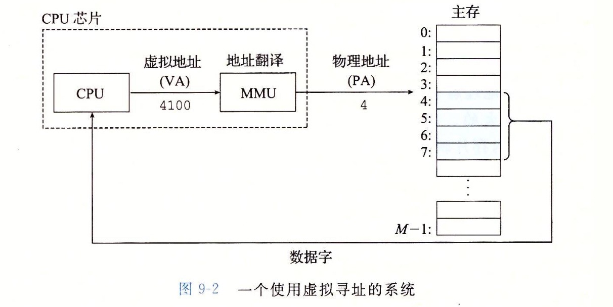

虚拟内存也像磁盘一样，划分为一个个块，虚拟内存里面一个块叫做一页，虚拟页面，物理内存同样分成一个个页面，称为物理页面。

在任意时刻，虚拟页面的集合都分为三个不相交的子集:
- 未分配的：还没有分配出去的虚拟页面，不占用任何磁盘空间和内存
- 缓存的：已经分配出去且加载到物理内存中的页面
- 未缓存的：已经分配出去，但是还在磁盘里面，没有加载到物理内存中的页面

因为主存不命中的话需要到磁盘去加载数据，这样会很慢，所以主页页面通常比较大，在4KB - 2MB，由于大的不命中处罚，所以主存是`全相连`的。任何虚拟页都可以放在任何物理页中。因为对磁盘的访问时间很长，所以主存总是用`写回法`，而不是`直写法`。

`页表(page table)`存储了虚拟页是否加载到物理页中，以及`物理页的地址`，页表中的每一项叫做`页表条目(Page Table Entry)`，简称`PTE`。

下图展示了虚拟页VP1,VP2,VP4,VP7已经加载到了物理内存中，对应的PTE里面的有效位是1，PTE里面还记录了对应的物理页面地址。VP0和VP5则处于`未分配`状态。剩下的VP3,VP6则在磁盘里面。

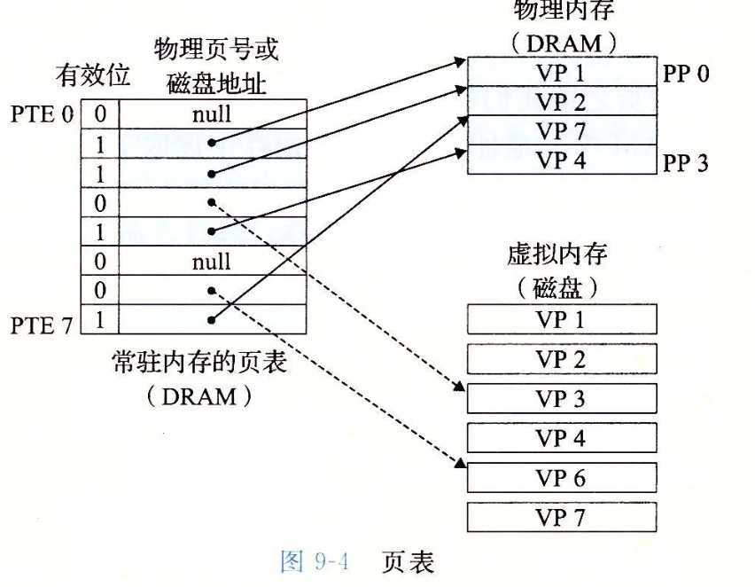

`命中`，如果通过虚拟页找到对应的PTE，发现valid == 1，就可以直接取出物理地址，去物理内存中获取对应的信息。

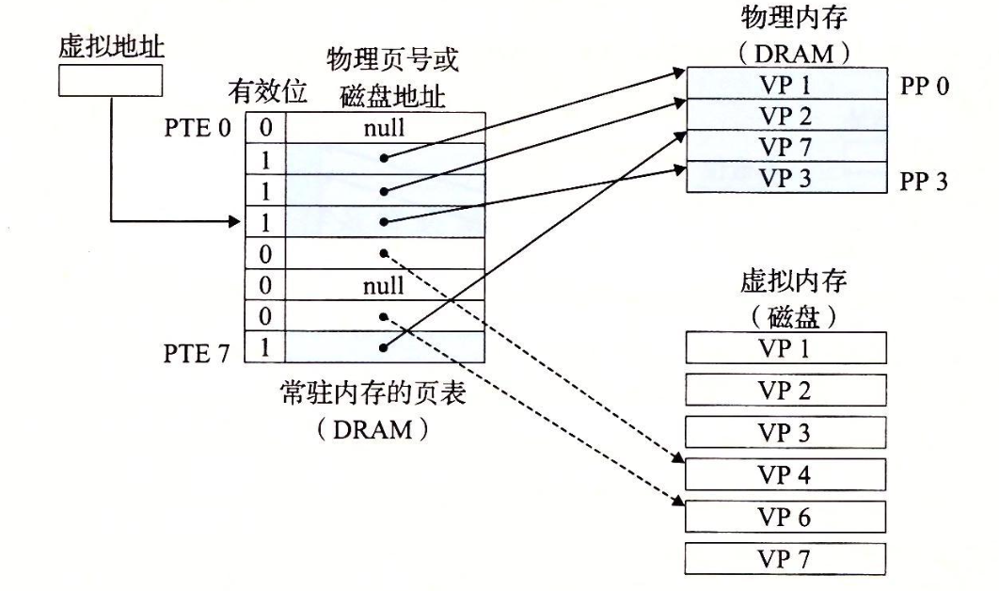

`不命中`,如果通过虚拟页找到对应的PTE,发现valid == 0，那么需要进入`缺页异常`处理程序，先选择出一个`victim page`，如果`victim page`有修改，需要写回磁盘，然后把新的页面装入物理内存。当缺页异常处理完毕以后，返回程序继续处理，进入`命中`流程。

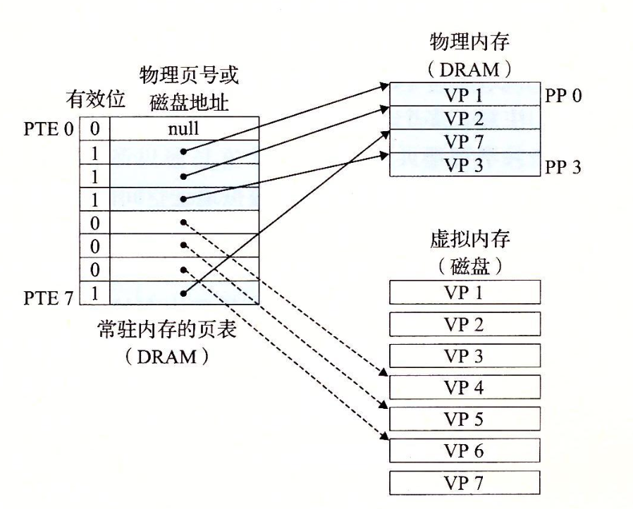

如果程序有好的`局部性`的话，虚拟内存将工作的很好，不命中会很少，因为都集中在局部性这几页中，如果程序局部性不好，可能就会发生`抖动`，虚拟内存不断的换入换出。

> 你可以利用Linux的getrusage函数监测缺页的数量 (以及许多其他的信息)

页表中还有一些位来表示权限，`SUP`位为1表示只有内核可以访问这个PTE,用户程序不可以，`READ`则表示可以读取这个PTE的内容，`WRITE`表示可以写入这个PTE的内容。如果违反了这些，会触发异常`段错误(segmentation fault)`


### 地址翻译

每个进程有自己的页表，当前进程页表的`起始地址`存放在`页表基址寄存器PTBR`中，n位的虚拟地址包含两个部分，一个p位的`虚拟页面偏移VPO(Virtual Page Offset)`和一个n-p位的`虚拟页号VPN(Virtual Page Number)`。


1. MMU根据虚拟地址的`VPN`从`页表`中获取到对应的`PTE`
2. 如果`命中`，就把PTE里面存储的`PPN`和虚拟地址的`VPO`拼接起来成为`物理地址`,因为物理页面和虚拟页面都是p字节的，所以VPO等于PPO,可以把VPO直接拿来用。
3. 根据物理地址去cache获取数据

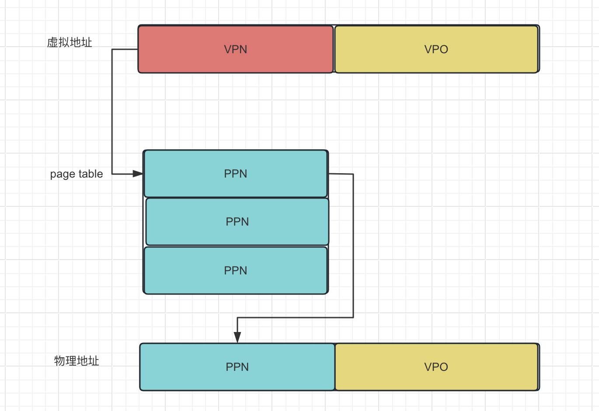

由于每次地址翻译都需要获取PTE,如果PTE不在cache中还需要去主存获取，所以速度会下降，在MMU中添加了一个`翻译后备缓冲器TLB(Translation Lookaside Buffer)`来加快速度，TLB中缓存了页表的数据，从TLB中获取页表的速度要比cache中获取更快。在`虚拟页号VPN`中，再次被分为了两部分，如果TLB有T = 2^t个组，两部分分别是t位的`TLB索引(TLBI)`和n-p-t位的`TLB的tag TLBT`。


TLB的执行步骤
1. MMU根据虚拟地址中的`TLBI`从`TLB`中取到对应的`PTE`
    - 如果没有命中，则从cache获取`PTE`
2. 如果`命中`，就把PTE里面存储的`PPN`和虚拟地址的`VPO`拼接起来成为`物理地址`,因为物理页面和虚拟页面都是p字节的，所以VPO等于PPO,可以把VPO直接拿来用。
3. 根据物理地址去cache获取数据

一个`页表`装载现在所有的内存地址，可能会很大，甚至比整个内存都要大，因此，可以使用`多级页表`的方式来组织页表。`一级页表`里面存放的是对应的二级页表的地址，以此类推。只有最后一个页表中包含的是`物理页面号PPN`。
- 多级页表可以大大减少`一级页表`的大小，虚拟地址空间大部分都是未分配的，而未分配的一级页表项则不存在对应的二级页表项。
- 只有一级页表才需要总是在主存中，虚拟内存系统可以在需要时创建，页面调入或调出二级页表，这就减少了主存的压力，只有最经常使用的二级页表才需要缓存在主存中。


### 动态内存分配

在内存的`堆`中动态的分配内存，内核维护着一个变量`brk`，指向堆的顶部。分配器将堆视为一组不同大小大的块的集合，每个块就是连续的虚拟内存片，要么是已分配的，要么是空闲的。

分配器有两种
- 显式：比如C中通过malloc来分配，通过free来释放
- 隐式：比如java中通过垃圾收集器gc来自动释放

显式分配器必须在一些相当严格的约束条件下工作
- 处理任意的malloc和free请求序列。
- 立即响应请求
- 只使用堆
- 对齐块(对齐要求)
- 不修改已分配的块

在这些限制条件下，试图实现吞吐率最大化和内存使用率最大化。

一个实际的分配器要在吞吐率和利用率之间把握好平衡，就必须考虑以下几个问题：
- 空闲块组织：字节数组？链表？双向链表？分离链表？
- 放置：如何选择一个合适的空闲块放置新分配的块，最先适配？最优适配？最坏适配？
- 分割：在将新块放置到某个空闲块之后，如何处理这个空闲块的剩余部分
- 合并：如何处理一个刚别释放的块,在free的时候是立即合并？还是延迟合并？

#### 隐式空闲链表

将空闲块大小信息放入空闲块头部，返回指针的时候返回指向`payload`的指针。如果是8字节对齐的，那么size的最低3位总是0，可以用来存放其他信息，比如最低位来存放是否分配，1已经分配，0还是空闲块

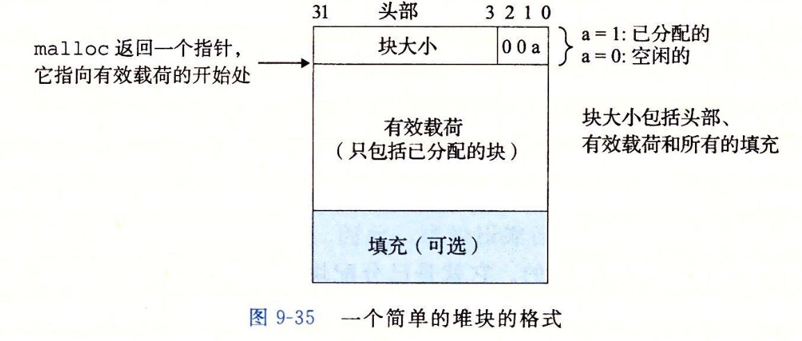


# 网络编程

每个网络应用都是基于客户端 - 服务器模型的。采用这个模型，一个应用是由一个服务器进程和一个或者多个客户端进程组成。服务器管理某种资源，并且通过操作这种资源 来为它的客户端提供某种服务。

主机A和LAN1相连，它发送一段数据字节到主机B，主机B和LAN2相连
- 主机A的客户端进行一个系统调用，从客户端的虚拟地址空间复制数据到内核缓冲区
- 主机A上的协议软件通过在数据前附加互联网络包头和LAN1帧头，创建了一个LAN1的帧。网络包头寻址到网络主机B，LAN1帧头寻址到路由器。然后它传送此帧到适配器。
- LAN1适配器复制该帧到网络上
- 此帧到达路由器，路由器的LAN1适配器从电缆上读取它，并把它传送给协议软件
- 路由器提取网络包头，根据路由表确定往哪里转发，确定为LAN2，去掉LAN1帧头，添加LAN2帧头，并把新的帧传送到适配器
- 路由器的LAN2适配器将该帧复制到网络上
- 此帧到达主机B，适配器从电缆上读取此帧并传送给协议软件
- 最后，主机B的协议软件剥落帧头和网络包头，当服务器进行读取这些数据的系统调用时，协议软件将数据复制到服务器的虚拟地址空间。

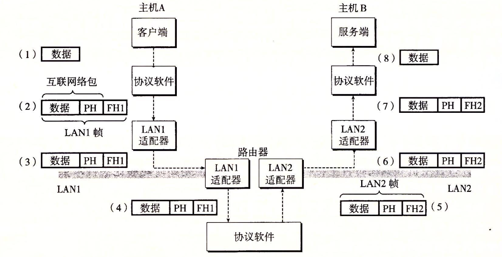

每个主机都运行`TCP/IP`协议。因特网的客户端和服务器混合使用套接字接又函数和Unix I/O函数来进行通信。通常将套接字函数实现为系统调用，这些系统调用会陷入内核，并调用各种内核模式的 TCP/IP 函数。

IP协议提供基本的命名方法和递送机制，能从一台网络主机往其他主机发送包，也叫`数据报`。IP协议是`不可靠`的，如果数据报


套接字接口(socket interface)是一组函数，它们和Unix I /O函数结合起来，用以创建 网络应用。

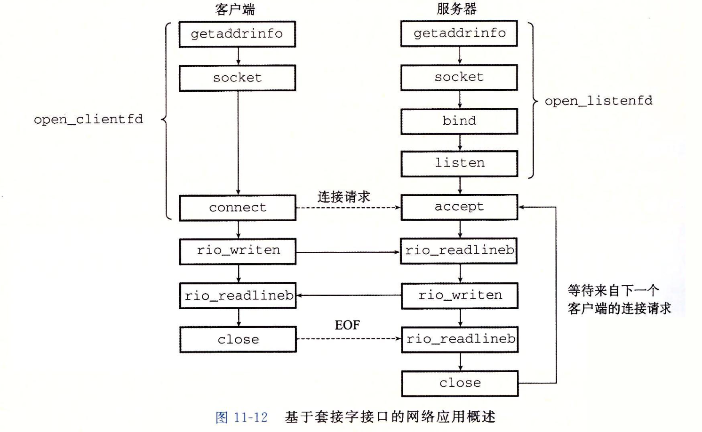

从Linux内核的角度来看， 一个套接字就是通信的一个端点。从Linux程序的角度来看，套接字就是一个有相应描述符的打开文件。

# 并发编程

现代操作系统提供了三种并发编程的方法
- 进程：由内核调度维护，每个进程有独立的虚拟地址空间，想要和其他进程通信，必须使用某种显示的进程间通信机制。需要注意子进程的回收，避免僵尸进程。需要注意子进程会复制父进程的一切，包括文件描述符等，注意关闭不需要的文件描述符。不然内核不会回收它们。
- IO多路复用：应用程序在一个进程的上下文中显示的调度它们自己的逻辑流。逻辑流被模拟成状态机，数据到达文件描述符后，改变文件的状态。因为程序是一个单独的进程，所以所有的流共享同一个虚拟地址空间，缺点是编写麻烦，代码复杂。
- 线程：线程是运行在一个单独进程的上下文中，由内核调度，所有线程共享同一个虚拟地址空间。

进程通过`fork`和`execve`来进行开发。

IO多路复用通过`select`或`epoll`函数来执行，它们会挂起当前进程，当文件描述符的状态改变的时候会触发对应的操作。

```c
#include <sys/select.h>

// 返回已准备好的描述符的非零的个数，若出错则为-1
int select(int n, fd_set *fdset, NULL, NULL, NULL);

FD_ZERO(fd_set *fdset); //把fdset中的所有位置0
FD_CLR(int fd, fd_set *fdset); //清楚fdset中的fd bit
FD_SET(int fd, fd_set *fdset); //设置fdset中的fd bit
FD_ISSET(int fd, fd_set *fdset); //检查fdset中的fd bit是否设置
```

IO多路复用的优缺点
- 优点：能对程序的行为进行更好的控制；运行在同一个进程里面，共享同一个虚拟地址空间，能更好的共享数据；由于是单一进程，可以使用GDB进行调试，对调试很友好；执行性能优秀，不需要进程上下文切换这些。
- 缺点：更复杂的编码方式，随着要对程序行为更好的控制，和并发粒度的减小，都会变得更加复杂；由于只有一个进程，只能进行单核的并发，而无法充分发挥多核的并行性能。

除了多进程以外，还可以在一个进程里面运行多个线程，每个线程有`线程上下文`。它们包括
- 线程id
- 栈
- 栈指针
- 寄存器
- PC
- 条件寄存器

多个线程共享进程的虚拟地址空间，代码，数据，共享库和打开的文件，线程的切换开销更小。

线程的一些函数

```c
#include <pthread.h>

// 创建线程 tid是线程的ID，attr可以改变创建线程的默认属性，f是 线程要执行的函数，arg是传给线程函数的参数
int pthread_create(pthread_t *tid, pthread_attr_t *attr, func *f, void *arg);

// 在线程中通过这个方法获得自己的线程id
pthread_† pthread_self (void);

// 调用这个函数显示的终止线程，主线程调用会等待所有线程终止，然后在终止主线程和整个进程
void pthread_exit (void *thread_return);

// 终止某一个线程tid是线程id 任何线程都可以通过这个方法终止其他线程
int pthread_cancel (pthread_t tid);

// 线程通过调用这个函数等待其他线程终止 该函数会阻塞，直到tid线程终止
int pthread_join(pthread_t tid, void **thread_return);
```

在任何一个时间点上，线程是`可结合的`或`可分离的`。可结合的线程可以被其他线程收回和杀死。在被其他线程回收前，它的内存资源是不被释放的。一个分离的线程是不能被其他线程回收或杀死的。它的内存资源在它终止时由系统自动释放。

默认情况下，线程都是可结合的，可以通过下面的函数变成可分离的。

```c
// 某个线程变成可分离的
int pthread_detach(pthread_† tid);
```

初始化线程。once_control 变量是一个全局或者静态变量，总是被初始化为PTHREAD_ONCE_INIT 。当你第一次用参数 once_control 调 用 pthread_.once 时，它调用 init_routine，这是一个没有输入参数、也不返回什么的函数。接下来的以once_control为参数 的pthread_once 调用不做任何事情。无论何时，当你需要动态初始化多个线程共享的全局变量时，Pthread_once 函数是很有用的

```c
pthread_once_t once_control = PTHREAD_ONCE_INIT;
i n t pthread_once (pthread_once_t *once_control, void (*init_routine) (void));
```

### 用信号量同步线程

共享变量很方便，但也引入了`同步错误`的可能性。

假设两个线程操作同一个变量进行计数。我们预期cnt应该是200，但结果却不一定。
```c
for (int i=0; i< 100; i++) cnt++;
```

`cnt++`虽然是一条指令，但是查看汇编可以发现，其实被分解成了三个指令，`Load`将cnt从内存加载到寄存器,`Update`更新cnt的值，`Store`将cnt写入内存。

如果按照顺序执行，是没有问题的。比如
- Load cnt=0
- Update cnt += 1
- Store cnt=1
- Load cnt = 1
- Update cnt += 1
- Store cnt = 2

但是多线程是并发执行的，我们不能假设它们的执行顺序，所以有可能是以下顺序执行
- Load cnt = 0
- Load cnt = 0
- Update cnt += 1
- Store cnt = 1
- UPdate cnt+=1
- Store cnt = 1

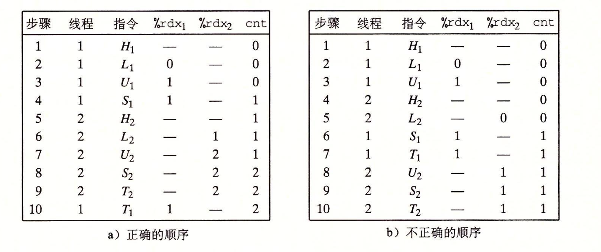

`进度图(progress graphy)`可以将n个并发线程的执行模型化为一条n维笛卡尔空间中的轨迹线。每条轴k对应线程k的进度。每个点代表已经完成了Ik这个状态。

将两个线程的执行化成进度图，如下：从左下角开始，任意一条可以到达右上角的链接线都是可能的执行顺序。

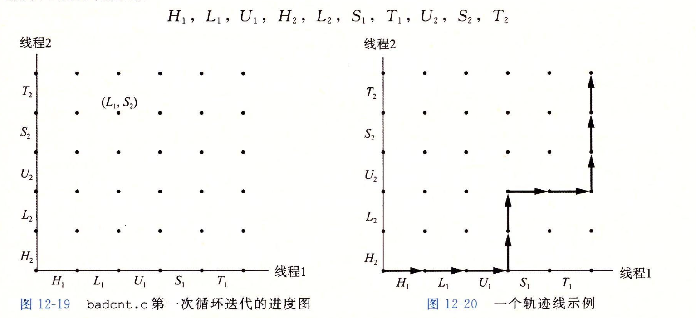

对于这两个线程来说，`Load`,`Update`,`Store`这三个指令构成了一个`临界区`。只要确保每次只有一个线程在执行临界区的代码，就可以保证顺序。也就是对共享变量的`互斥`访问。

两个临界区的交集形成的空间叫做`不安全区(unsafe region)`。没有经过不安全区的路线叫做`安全路线`，经过不安全区的叫做`不安全路线`。所有的安全路线都可以得到正确的结果，而不安全路线将得到错误的结果。

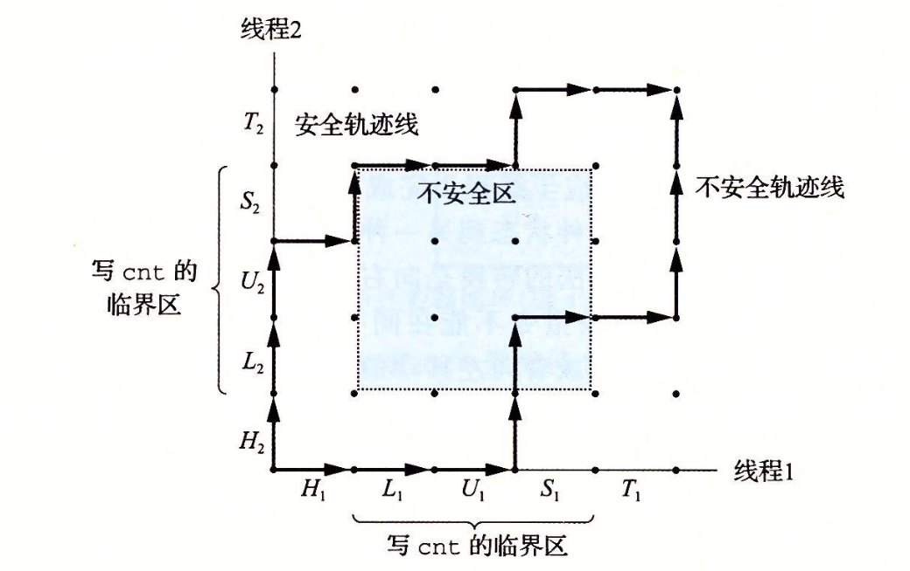

通过`信号量(semaphore)`可以阻止代码走到不安全路线上面。信号量s是具有非负整数值的全局变量。只能由两种特殊的操作来处理：
- P(s): 如果s非0，那么将s减去1，并且立即返回。
    - 如果s是0，那么挂起这个线程，直到s非0为止
    - V操作会重启这个线程，重启后，将s减1，并将控制返回给调用者。
- V(s): 将s加1。如果有任何线程阻塞在P操作中，V会重启其中的一个。

> P操作和V操作都是不可分割的，不会被中断。

下面是操作信号量的函数
```c
#include <semaphore.h>

// 使用信号量前需要通过sem_init初始化，初始化sem为value值
int sem_init (sem_t *sem, 0, unsigned int value);
int sem_wait (sem_t *s); /* P(s) */
int sem_post (sem_t *s); /* V(s) */

```

通过P和V操作信号量将不安全区包裹起来，就可以阻止代码跑到不安全区里面。以这种方式来保护共享变量的信号量叫做`二元信号量`，因为它的值总是0或1。以互斥为目的的二元信号量叫做`互斥锁(mutex)`。P也叫做`lock`,V也叫做`unlock`。

代码
```c
sem_t s;
sem_init(&s,0,1);
for (int i=0; i< 100; i++) {
    sem_wait(&s);
    cnt++;
    sem_post(&s);
}
```

包裹起来以后的进度图

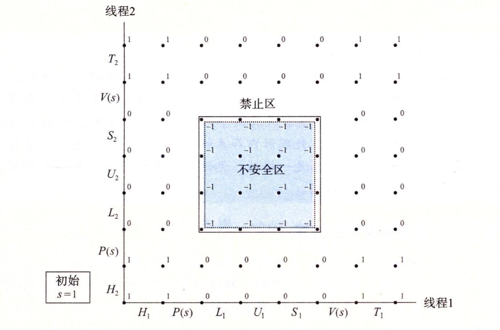

信号量除了能解决同步问题，还可以`调度对共享资源的访问`。一个线程可以用信号量操作来通知另一个线程，程序状态中


### 并发问题

- 线程安全： 一个函数被称为线程安全的(thread-safe)，当且仅当被多个并发线程反复地调用时，它会一直产生正确的结果。线程不安全的函数类：
    - 不保护共享变量的函数：可以通过加锁变成线程安全的
    - 保持跨越多个调用的状态的函数：可以重写它
    - 返回指向静态变量的指针的函数 ：可以加锁，然后复制返回值，解锁。使用复制后的值
    - 调用线程不安全函数的函数
- 可重入性：当它们被多个线程调用时，不会引用任何共享数据。可重人函数集合是线程安全函数的一个`真子集`。将第2类线程不安全函数转化为线程安全函数的唯一方法就是重写它，使之变为可重入的。
- 在线程化的程序中使用已存在的库函数：有些库函数是线程不安全的
- 竞争
- 死锁：给定所有互斥操作的一个全序，如果每个线程都是以一种顺序`获得互斥锁`并以`相反的顺序释放`，那么这个程序就是`无死锁`的


