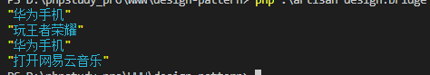

# 设计模式之桥接模式--组合优于继承的体现

`桥接模式`是灵活运用组合对象而不是继承类来实现功能。

> 将抽象与实现部分分离，使他们都可以独立变化。

## 为什么要使用桥接模式

`继承`这个面向对象的特性使得我们继承父类可以继承父类的功能，在使用多态特性可以自由修改子类，使得我们的设计很好用。

但是`继承`有一个问题，就是`强耦合`。继承一个父类代表拥有这个父类的能力，但这个父类的很多能力你可能并不需要。

还有如果继承关系很复杂的时候，使用继承会导致关系复杂到破裂，无法继承。

比如`华为`手机和`小米`手机都具有玩游戏，听音乐等功能。按照继承设计就会有下面4个类，如果再实现拍照功能又需要增加2个类。这个继承关系太过复杂。

- 手机父类
- 软件父类

- 华为游戏手机
- 华为音乐手机
- 小米游戏手机
- 小米音乐手机

如果使用组合的方式，只有4个类。

- 华为手机类
- 小米手机类
- 游戏类
- 音乐类

让这4个类互相组合就可以了。如果增加个拍照，只需要增加拍照类。这就是抽象和实现分离。手机类就是手机类，软件类就是软件类，互相组合实现功能而不是互相继承。

桥接模式可以理解成连接两个部分，比如连接手机和软件两个部分。像一座桥一样。

```php
/**
 * 桥接模式
 * 桥的一端
 * 手机类
 */
abstract class Mobile {
    protected $soft;
    /**
     * 运行手机功能
     */
    public abstract function run();

    /**
     * 设置相应的软件
     */
    public function setSoft(Soft $soft) {
        $this->soft = $soft;
    }

}

/**
 * 桥接模式
 * 桥的一端
 * 软件类
 */
abstract class Soft {
    
    /**
     * 运行软件功能
     */
    public abstract function run();


}
```

下面是手机类的具体实现和软件的具体实现。

```php

/**
 * 桥接模式
 * 桥的一端
 * 华为手机类
 * 
 */
class HuaWei extends Mobile {

    /**
     * 运行手机功能
     */
    public function run() {
        dump('华为手机');
        $this->soft->run();
    }

}


/**
 * 桥接模式
 * 桥的一端
 * 小米手机类
 * 
 */
class XiaoMi extends Mobile {

    /**
     * 运行手机功能
     */
    public function run() {
        dump('小米手机');
        $this->soft->run();
    }

}


/**
 * 桥接模式
 * 游戏软件类
 */
class Game extends Soft{
    
    /**
     * 运行软件功能
     */
    public function run() {
        dump('玩王者荣耀');
    }


}

/**
 * 桥接模式
 * 音乐软件类
 */
class Music extends Soft{
    
    /**
     * 运行软件功能
     */
    public function run() {
        dump('打开网易云音乐');
    }


}

```

客户端调用根据需要注入不同的软件就可以实现不同的软件功能而不再需要增加新的类来实现。

```php

$obj1 = new HuaWei;
$obj1->setSoft(new Game);
$obj1->run();

$obj1->setSoft(new Music);
$obj1->run();
```



桥接模式解决了继承过于复杂的问题，体现了组合优于继承的思想。

代码放在了我的github上面。

- [设计模式](https://github.com/Thepatterraining/design-pattern)


