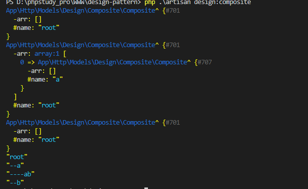

# 设计模式之组合模式--树形结构的最佳实践

`组合模式`是部分组合成整体。

> 将对象组合成树形结构以表示'部分'-'整体'的层次结构。组合模式使得用户对单个对象和组合对象的使用具有一致性。

## 为什么要使用组合模式

最常用到组合模式的应该就是树形结构了。

比如公司-部门的结构，文件夹-文件的结构。

首先有一个共同的父类。

```php

/**
 * 组合模式
 * 组合抽象类
 * 组合的部件和整体都继承这个抽象类，组合出这个抽象类的整体
 */
abstract class Component {
    
    protected $name;

    public function __construct($name) {
        $this->name = $name;
    }

    /**
     * 增加一个Component类型的对象
     */
    public abstract function add(Component $component);

    /**
     * 删除一个Component类型的对象
     */
    public abstract function remove(Component $component);

    /**
     * 展示结构
     */
    public abstract function show(int $depth);

}

```

然后实现支节点和叶子节点两个类

```php
use Illuminate\Support\Arr;
/**
 * 组合模式
 * 组合的支节点，可以有子节点，字节的需要是Component类型
 */
class Composite extends Component {

    private $arr = [];

    /**
     * 增加一个Component类型的对象
     */
    public function add(Component $component){
        $this->arr[] = $component;
    }

    /**
     * 删除一个Component类型的对象
     */
    public function remove(Component $component) {
        Arr::where($this->arr, function ($value, $key) use ($component) {
            if ($value == $component) {
                unset($this->arr[$key]);
            }
        });
        
    }

    /**
     * 展示结构
     */
    public function show(int $depth) {
        dump(str_repeat('-',$depth) . $this->name);
        foreach ($this->arr as $k => $v) {
            $v->show(2+$depth);
        }
    }

}

/**
 * 组合模式
 * 组合的叶子节点
 * 叶子节点不能添加和移除字节点
 */
class Leaf extends Component {

    /**
     * 增加一个Component类型的对象
     */
    public function add(Component $component){
        return '';
    }

    /**
     * 删除一个Component类型的对象
     */
    public function remove(Component $component) {
        return '';
    }

    /**
     * 展示结构
     */
    public function show(int $depth) {
        dump(str_repeat('-',$depth) . $this->name);
    }

}
```

客户端通过任意添加子节点的方式来完成组合。

```php

$root = new Composite('root');
dump($root);
$a = new Composite('a');
$root->add($a);
dump($root);
$root->remove($a);
dump($root);
$root->add($a);
$ab = new Leaf('ab');
$a->add($ab);
$b = new Composite('b');
$root->add($b);
$root->show(0);
```



代码放在了我的github上面。

- [设计模式](https://github.com/Thepatterraining/design-pattern)
